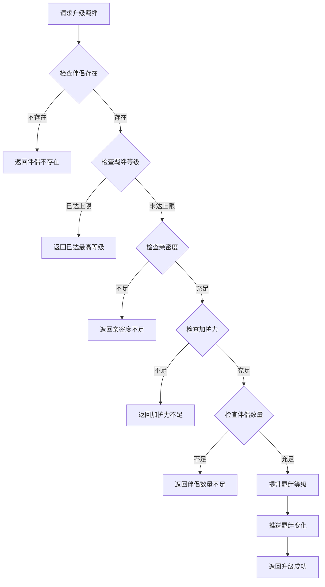
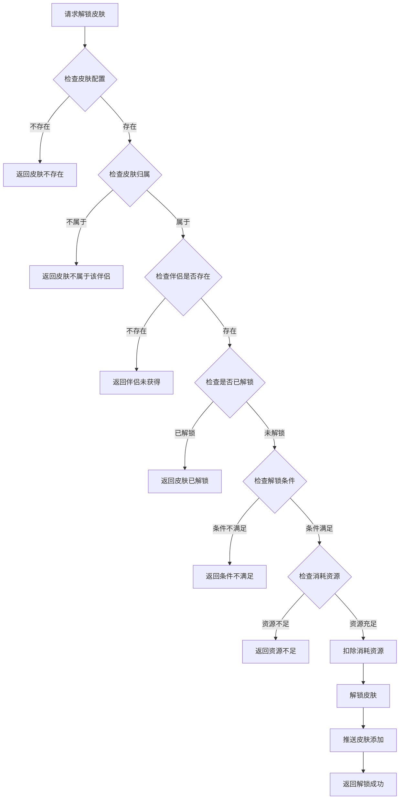
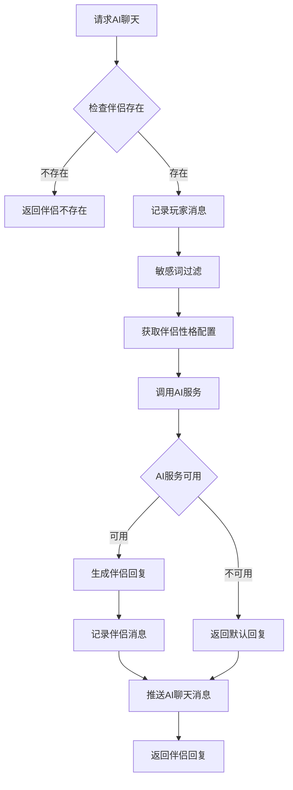
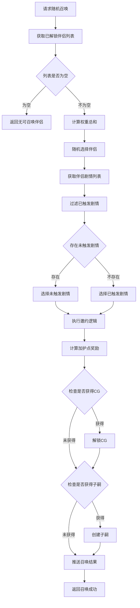
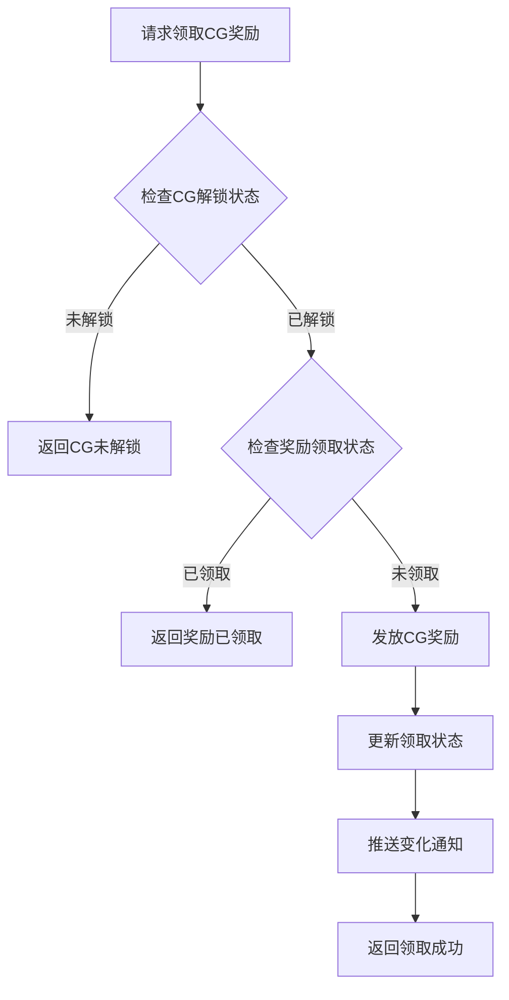

# 伴侣系统完整说明

## 一、模块概述

### 1.1 业务背景

伴侣系统是 K2C 游戏的核心养成社交玩法，玩家可以与游戏中的伴侣角色建立亲密关系，通过培养亲密度、羁绊等级来解锁更多互动内容。该系统融合了养成、对话、皮肤收集等多种玩法元素。

### 1.2 目标用户

- **养成玩家**：享受培养伴侣亲密度的过程
- **收集玩家**：收集伴侣皮肤和CG
- **社交玩家**：体验伴侣AI对话互动

### 1.3 核心价值

1. **情感陪伴**：AI伴侣提供情感互动体验
2. **养成成长**：培养伴侣属性，解锁更多内容
3. **收集乐趣**：收集伴侣皮肤和CG
4. **属性加成**：伴侣提供玩家属性加成

---

## 二、功能清单

### 2.1 伴侣培养功能

| 功能名称 | 功能描述 | 用户价值 | 解锁条件 |
|---------|---------|---------|---------|
| 升级羁绊等级 | 提升伴侣羁绊等级 | 解锁更多互动 | 亲密度达标 |
| 升级光环等级 | 提升伴侣光环等级 | 增强属性加成 | 解锁星辉 |
| 解锁光环 | 解锁新的光环 | 获得新的光环效果 | 满足条件 |

### 2.2 技能系统功能

| 功能名称 | 功能描述 | 用户价值 | 解锁条件 |
|---------|---------|---------|---------|
| 领悟商务技能 | 领悟伴侣商务技能 | 获得特殊效果 | 亲密度达标 |
| 升级祝福技能 | 升级伴侣祝福技能 | 增强技能效果 | 消耗资源 |
| 获取所有商务技能 | 查看所有商务技能 | 了解技能列表 | 无 |

### 2.3 召唤功能

| 功能名称 | 功能描述 | 用户价值 | 消耗 |
|---------|---------|---------|------|
| 随机召唤 | 随机召唤一个伴侣 | 惊喜体验 | 邀约次数 |
| 一键召唤 | 一键召唤所有伴侣 | 便捷操作 | 邀约次数 |
| 指定召唤 | 召唤指定伴侣 | 精确选择 | 邀约次数+消耗 |

### 2.4 皮肤系统功能

| 功能名称 | 功能描述 | 用户价值 | 解锁条件 |
|---------|---------|---------|---------|
| 解锁皮肤 | 解锁伴侣皮肤 | 获得新外观 | 消耗道具/条件满足 |
| 设置当前皮肤 | 设置展示的皮肤 | 个性化外观 | 拥有皮肤 |

### 2.5 AI聊天功能

| 功能名称 | 功能描述 | 用户价值 | 触发方式 |
|---------|---------|---------|---------|
| AI聊天 | 与伴侣AI对话 | 情感互动 | 玩家主动 |
| 动态聊天 | 伴侣发送动态消息 | 增加互动 | 系统触发 |
| 发起AI聊天 | 伴侣主动发起对话 | 惊喜互动 | 伴侣主动 |
| 选择对话选项 | 选择对话分支 | 影响剧情 | 对话时 |
| 领取对话奖励 | 领取对话奖励 | 获得奖励 | 对话完成 |
| 添加聊天好友 | 添加伴侣为聊天好友 | 便捷聊天 | 主动添加 |

### 2.6 CG系统功能

| 功能名称 | 功能描述 | 用户价值 | 解锁条件 |
|---------|---------|---------|---------|
| 解锁CG | 解锁伴侣CG | 收集内容 | 邀约触发 |
| 领取CG奖励 | 领取解锁CG的奖励 | 获得奖励 | CG已解锁 |

### 2.7 游历功能

| 功能名称 | 功能描述 | 用户价值 |
|---------|---------|---------|
| 获取游历轮次 | 查看游历进度 | 了解状态 |

---

## 三、业务流程详解

### 3.1 升级羁绊流程



**详细步骤说明**：

1. **伴侣验证**
   - 验证伴侣存在且已解锁
   - 验证伴侣属于当前玩家

2. **等级检查**
   - 检查当前羁绊等级
   - 检查是否达到上限（RefConsortFettersLvl配置）

3. **条件检查**
   - 检查亲密度是否满足升级要求
   - 检查加护力是否满足升级要求
   - 检查伴侣数量是否满足要求

4. **升级处理**
   - 提升羁绊等级
   - 解锁新功能（如有）
   - 推送变化通知

### 3.2 解锁皮肤流程



### 3.3 AI聊天流程



**详细步骤说明**：

1. **伴侣验证**
   - 验证伴侣存在
   - 获取伴侣配置信息

2. **消息处理**
   - 记录玩家发送的消息
   - 敏感词过滤

3. **AI处理**
   - 根据伴侣性格生成回复
   - 调用外部AI服务
   - 超时处理返回默认回复

4. **回复推送**
   - 保存聊天记录
   - 推送回复消息

### 3.4 召唤伴侣流程



### 3.5 领取CG奖励流程



---

## 四、关键规则

### 4.1 伴侣状态规则

| 状态 | 状态值 | 说明 | 可执行操作 |
|------|--------|------|-----------|
| 未解锁 | 0 | 伴侣未获得 | 无 |
| 已解锁 | 1 | 伴侣已获得，可互动 | 培养、邀约、聊天等 |
| 激活中 | 2 | 当前激活的伴侣 | 同上，展示优先 |

### 4.2 羁绊等级规则

1. **等级上限**：根据RefConsortFettersLvl配置决定
2. **升级条件**：
   - 亲密度达到要求值（need_consort_intimacy）
   - 加护力达到要求值（need_consort_charm）
   - 伴侣数量达到要求（need_consort_num）
3. **解锁功能**：特定等级解锁新功能
4. **属性加成**：
   - 收益天资加成（income_bonus，万分比）
   - 教学经验加成（study_bonus，万分比）

### 4.3 亲密度规则

1. **获取方式**：互动、礼物、任务等
2. **上限限制**：每级有亲密度上限
3. **突破机制**：达到上限需要突破
4. **用途**：
   - 羁绊升级条件
   - 经营技能解锁条件

### 4.4 加护点规则

1. **获取方式**：邀约获得
2. **计算公式**：
   ```
   加护点 = 基础值 × 出游倍数
   ```
3. **用途**：
   - 加护技能升级消耗
   - 属性加成计算

### 4.5 皮肤解锁规则

1. **解锁条件**：消耗道具、条件满足
2. **消耗资源**：部分皮肤需要消耗资源
3. **限时皮肤**：部分皮肤有时间限制

### 4.6 AI聊天规则

1. **聊天频率**：无限制
2. **内容过滤**：敏感词过滤
3. **性格影响**：不同伴侣有不同回复风格
4. **超时处理**：AI服务超时返回默认回复

### 4.7 邀约规则

1. **邀约次数**：根据配置限制
2. **剧情触发**：
   - 优先触发未触发的剧情
   - 所有剧情触发后可重复触发
3. **奖励计算**：
   - 加护点 = 基础值 × 出游倍数
   - CG概率触发
   - 子嗣概率触发

---

## 五、用户故事

### 5.1 新伴侣培养故事

> 作为一名刚获得新伴侣的玩家，我每天都会与伴侣互动，提升亲密度。当亲密度达到一定程度后，我升级了羁绊等级，解锁了新的对话选项。看着羁绊等级一步步提升，我感到非常有成就感。

**关键节点**：
1. 获得新伴侣（游历/关卡）
2. 日常互动提升亲密度
3. 羁绊等级升级
4. 解锁新功能

### 5.2 皮肤收集故事

> 作为一名收集玩家，我发现了一个精美的伴侣皮肤。查看解锁条件后，我努力完成相关任务，最终解锁了这个皮肤。将皮肤设置为主题后，伴侣的外观焕然一新，让我非常满意。

**关键节点**：
1. 发现心仪皮肤
2. 查看解锁条件
3. 完成任务/收集资源
4. 解锁皮肤
5. 设置为当前皮肤

### 5.3 AI聊天故事

> 作为一名喜欢社交的玩家，我经常与伴侣进行AI聊天。伴侣会根据我的话题给出不同的回复，有时还会主动发起对话，给我带来了很多惊喜。通过聊天，我与伴侣的关系更加亲密了。

**关键节点**：
1. 发起AI聊天
2. 接收伴侣回复
3. 伴侣主动发起对话
4. 建立情感连接

---

## 六、示例

### 6.1 伴侣信息示例

**伴侣数据**：
```
伴侣ID：10001
名称：小雪
稀有度：SSR
亲密度：5000
加护力：120
加护点：3500
羁绊等级：5
当前皮肤ID：1001
已解锁皮肤：[1001, 1002, 1003]
光环等级：3
光环解锁：是
经营技能：[{skillId: 1, proAdd: 50, normalOpCount: 3, advanceOpCount: 1}]
加护技能：[{skillId: 101, lvl: 2}]
```

### 6.2 升级羁绊示例

**输入数据**：
- 伴侣ID：10001

**初始状态**：
```
羁绊等级：5
亲密度：5000
加护力：120
升级所需亲密度：4500
升级所需加护力：100
```

**升级结果**：
```
羁绊等级：6（+1）
亲密度：5000（不变）
解锁功能：新对话选项
属性加成提升
```

### 6.3 解锁皮肤示例

**输入数据**：
- 伴侣ID：10001
- 皮肤ID：1004

**解锁条件**：
```
羁绊等级要求：5
消耗：钻石 × 500
```

**解锁结果**：
```
皮肤ID：1004
皮肤名称：夏日泳装
状态：已解锁
已解锁皮肤列表：[1001, 1002, 1003, 1004]
```

### 6.4 AI聊天示例

**输入数据**：
- 伴侣ID：10001
- 消息："今天天气真好"

**伴侣回复**：
```
消息内容："是啊，阳光明媚，心情也变好了。要不要一起去散步呢？"
消息类型：伴侣回复
时间：2026-04-12 10:00:00
```

### 6.5 邀约示例

**输入数据**：
- 请求类型：随机邀约

**邀约结果**：
```
伴侣ID：10001
剧情ID：2001
获得加护点：500
获得CG：是（CG ID: 3001）
获得子嗣：否
```

---

## 七、错误码

| 错误码 | 说明 | 处理建议 |
|-------|------|---------|
| 15001 | 伴侣不存在 | 检查伴侣ID有效性 |
| 15002 | 伴侣未解锁 | 检查解锁状态 |
| 15003 | 羁绊已达最高等级 | 检查等级上限 |
| 15004 | 亲密度不足 | 检查亲密度值 |
| 15005 | 皮肤不存在 | 检查皮肤ID |
| 15006 | 皮肤已解锁 | 检查解锁状态 |
| 15007 | 解锁条件不满足 | 检查解锁条件 |
| 15008 | 无可召唤伴侣 | 检查已解锁列表 |
| 15009 | 光环已达最高等级 | 检查等级上限 |
| 15010 | CG未解锁 | 检查解锁状态 |
| 15011 | CG奖励已领取 | 检查领取状态 |

---

## 八、跨模块依赖

### 8.1 依赖模块

| 模块名称 | 依赖方式 | 依赖内容 |
|----------|----------|----------|
| Player | 强依赖 | 玩家基础信息、资源管理 |
| Item | 强依赖 | 道具消耗和发放 |
| AI | 强依赖 | AI聊天服务 |
| Push | 强依赖 | 消息推送服务 |
| Child | 弱依赖 | 子嗣创建 |
| Hero | 弱依赖 | 关联大臣属性计算 |
| Dinner | 弱依赖 | 宴会凭证 |

### 8.2 被依赖模块

| 模块名称 | 被依赖内容 |
|----------|------------|
| Home | 伴侣展示 |
| Battle | 伴侣属性加成 |
| Achievement | 伴侣相关成就 |
| RedDot | 红点状态 |

---

*文档生成时间: 2026-04-12*
