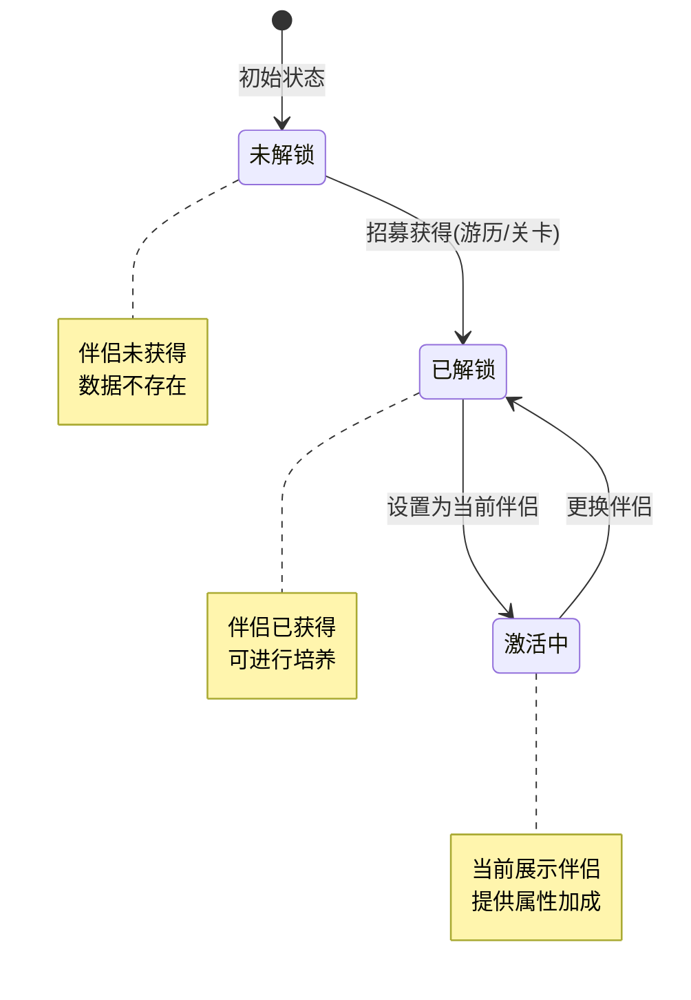
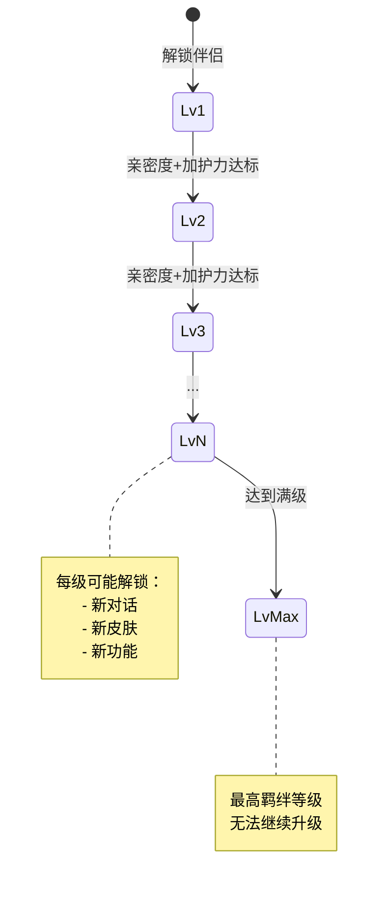
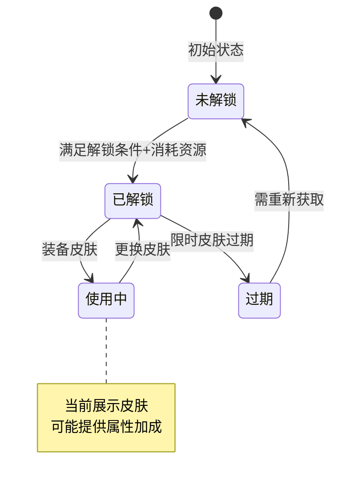
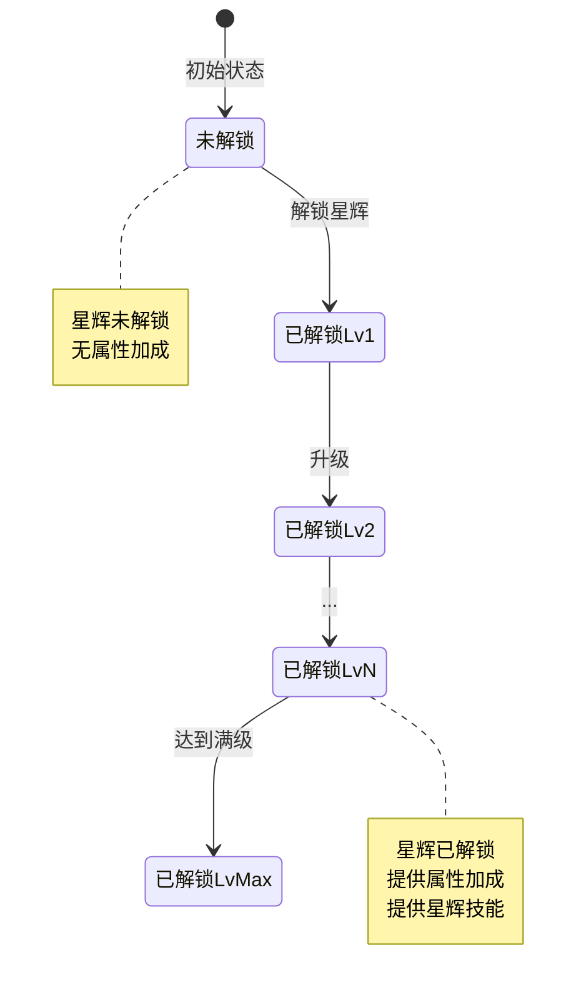
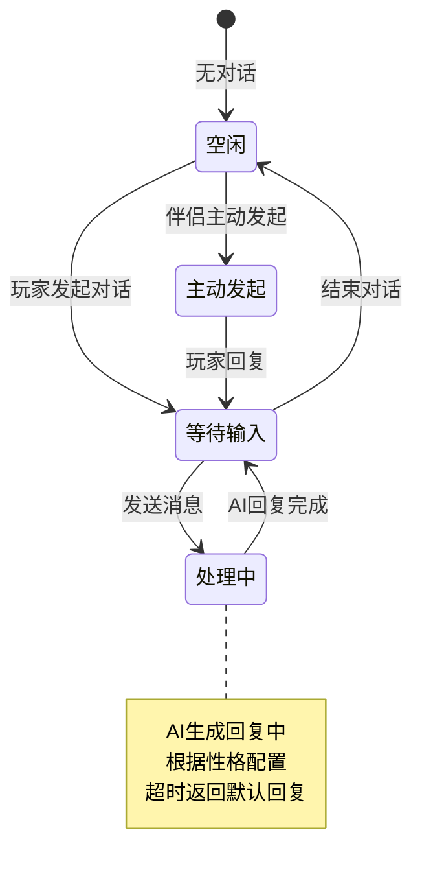
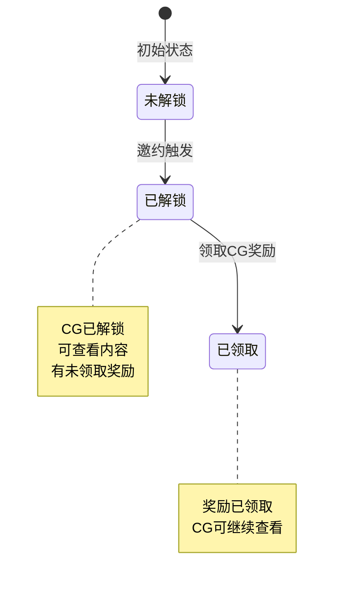
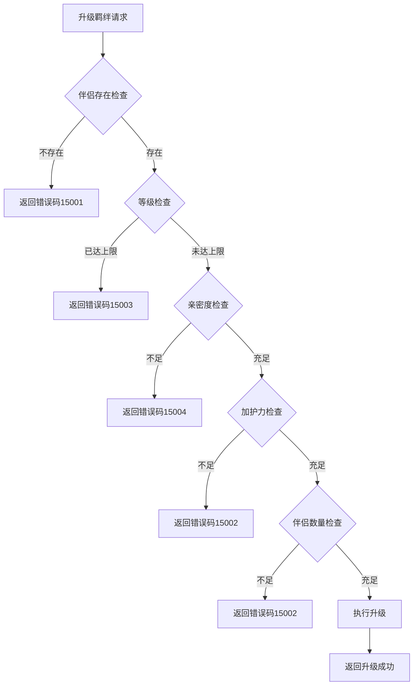

# 伴侣系统实现细节

## 一、计算公式

### 1.1 羁绊升级所需条件计算

```
所需亲密度 = need_consort_intimacy（配置表）
所需加护力 = need_consort_charm（配置表）
所需伴侣数量 = need_consort_num（配置表）
```

**配置示例**：
```
羁绊等级 1 → 2:
  need_consort_intimacy: 1000
  need_consort_charm: 50
  need_consort_num: 1

羁绊等级 5 → 6:
  need_consort_intimacy: 5000
  need_consort_charm: 200
  need_consort_num: 3
```

### 1.2 星辉属性加成计算公式

```
增加亲密度 = add_intimacy（配置表）
增加加护力 = add_charm（配置表）
```

**示例计算**：
```
星辉等级1:
  add_intimacy: 100
  add_charm: 50

星辉等级5:
  add_intimacy: 500
  add_charm: 250
```

### 1.3 召唤权重计算公式

```
选择概率 = 伴侣权重 / 总权重
```

**示例计算**：
```
伴侣A权重：30
伴侣B权重：50
伴侣C权重：20
总权重：100

伴侣A被选中概率 = 30 / 100 = 30%
伴侣B被选中概率 = 50 / 100 = 50%
伴侣C被选中概率 = 20 / 100 = 20%
```

### 1.4 加护点计算公式

```
加护点 = 基础值 × bless_point_multiple（出游倍数）
```

**示例计算**：
```
出游配置:
  bless_point_multiple: 2

邀约获得:
  基础值: 250
  加护点 = 250 × 2 = 500
```

### 1.5 卷王子嗣概率计算

```
概率 = giftde_probability / 10000
```

**示例计算**：
```
出游配置:
  giftde_probability: 500 (5%)

随机值: 0-10000
若随机值 <= 500，则获得卷王子嗣
```

---

## 二、状态机定义

### 2.1 伴侣解锁状态机



### 2.2 羁绊等级状态机



### 2.3 皮肤状态机



### 2.4 星辉状态机



### 2.5 AI聊天状态机



### 2.6 CG解锁状态机



---

## 三、数据约束

### 3.1 伴侣数据约束

| 字段名 | 数据类型 | 取值范围 | 必填 | 唯一性 | 说明 |
|--------|----------|----------|------|--------|------|
| consort_id | long | > 0 | 是 | 是 | 伴侣ID |
| player_id | long | > 0 | 是 | 否 | 玩家ID |
| intimacy | long | >= 0 | 是 | 否 | 亲密度 |
| charm | long | >= 0 | 是 | 否 | 加护力 |
| charm_point | long | >= 0 | 是 | 否 | 加护点 |
| charm_point_record | long | >= 0 | 是 | 否 | 加护点历史记录 |
| fetters_lvl | int | >= 1 | 是 | 否 | 羁绊等级 |
| cur_skin_id | long | >= 0 | 是 | 否 | 当前皮肤ID |
| halo_lvl | int | >= 0 | 是 | 否 | 光环等级 |
| is_halo_unlock | bool | - | 是 | 否 | 光环是否解锁 |
| has_add_chat_friend | bool | - | 是 | 否 | 是否已添加聊天好友 |

### 3.2 伴侣皮肤数据约束

| 字段名 | 数据类型 | 取值范围 | 必填 | 说明 |
|--------|----------|----------|------|------|
| id | long | > 0 | 是 | 主键 |
| player_id | long | > 0 | 是 | 玩家ID |
| consort_id | long | > 0 | 是 | 伴侣ID |
| skin_id | long | > 0 | 是 | 皮肤ID |
| skin_lvl | int | >= 1 | 是 | 皮肤等级 |

### 3.3 经营技能数据约束

| 字段名 | 数据类型 | 取值范围 | 必填 | 说明 |
|--------|----------|----------|------|------|
| player_id | long | > 0 | 是 | 玩家ID |
| consort_id | long | > 0 | 是 | 伴侣ID |
| skill_id | long | > 0 | 是 | 技能ID |
| pro_add | int | >= 0 | 是 | 概率加成 |
| normal_op_count | int | >= 0 | 是 | 普通领悟次数 |
| advance_op_count | int | >= 0 | 是 | 高级领悟次数 |

### 3.4 加护技能数据约束

| 字段名 | 数据类型 | 取值范围 | 必填 | 说明 |
|--------|----------|----------|------|------|
| player_id | long | > 0 | 是 | 玩家ID |
| consort_id | long | > 0 | 是 | 伴侣ID |
| skill_id | long | > 0 | 是 | 技能ID |
| skill_lvl | int | >= 1 | 是 | 技能等级 |

### 3.5 CG数据约束

| 字段名 | 数据类型 | 取值范围 | 必填 | 说明 |
|--------|----------|----------|------|------|
| player_id | long | > 0 | 是 | 玩家ID |
| cg_id | long | > 0 | 是 | CG ID |
| rewarded | bool | - | 是 | 是否已领取奖励 |

---

## 四、错误处理策略

### 4.1 伴侣系统错误码

| 错误码 | 错误信息 | 处理策略 | 用户提示 |
|--------|----------|----------|----------|
| 15001 | 伴侣不存在 | 检查伴侣ID有效性 | "伴侣不存在" |
| 15002 | 伴侣未解锁 | 检查解锁状态 | "该伴侣尚未解锁" |
| 15003 | 羁绊已达最高等级 | 检查等级上限 | "羁绊已达最高等级" |
| 15004 | 亲密度不足 | 检查亲密度值 | "亲密度不足，无法升级" |
| 15005 | 皮肤不存在 | 检查皮肤ID | "皮肤不存在" |
| 15006 | 皮肤已解锁 | 检查解锁状态 | "该皮肤已解锁" |
| 15007 | 解锁条件不满足 | 检查解锁条件 | "解锁条件不满足" |
| 15008 | 无可召唤伴侣 | 检查已解锁列表 | "没有可召唤的伴侣" |
| 15009 | 光环已达最高等级 | 检查等级上限 | "光环已达最高等级" |
| 15010 | CG未解锁 | 检查解锁状态 | "该CG尚未解锁" |
| 15011 | CG奖励已领取 | 检查领取状态 | "CG奖励已领取" |

### 4.2 升级羁绊错误处理流程



### 4.3 AI聊天错误处理

| 错误场景 | 处理策略 | 默认行为 |
|----------|----------|----------|
| AI服务不可用 | 返回默认回复 | "我现在有点累了，稍后再聊吧~" |
| 消息内容敏感 | 过滤敏感词后处理 | 替换敏感词为*** |
| 对话历史过长 | 只保留最近N条消息 | 保留最近20条消息 |
| AI服务超时 | 返回默认回复 | 设置3秒超时 |

---

## 五、关键代码示例

### 5.1 升级羁绊服务端伪代码

```java
public Result upgradeFettersLvl(long playerId, long consortId)
{
    // 1. 获取伴侣信息
    PlayerConsort consort = consortDao.selectByPlayerAndId(playerId, consortId);
    if (consort == null)
    {
        return Result.error(15001, "伴侣不存在");
    }

    // 2. 获取下一级配置
    int nextLvl = consort.fettersLvl + 1;
    RefConsortFettersLvl fettersRef = RefConsortFettersLvl.getMgr().get(nextLvl);
    if (fettersRef == null)
    {
        return Result.error(15003, "羁绊已达最高等级");
    }

    // 3. 检查升级条件
    if (consort.intimacy < fettersRef.need_consort_intimacy)
    {
        return Result.error(15004, "亲密度不足");
    }

    if (consort.charm < fettersRef.need_consort_charm)
    {
        return Result.error(15002, "加护力不足");
    }

    int consortCount = getConsortCount(playerId);
    if (consortCount < fettersRef.need_consort_num)
    {
        return Result.error(15002, "伴侣数量不足");
    }

    // 4. 升级
    BM bm = getUSServer().getBM();
    consort.fettersLvl = nextLvl;
    consort.saveFettersLvl(bm, nextLvl);

    // 5. 推送通知
    sendMsgToGC(US2GCWriter_015_ConsortOp.make_057_OnFettersChg(consort));

    // 6. 触发事件
    Event_P_CONSORT_FETTER_UPGRADE event = new Event_P_CONSORT_FETTER_UPGRADE(consortId, nextLvl);
    getUserData().onLogicEvent(event);

    return Result.success(new { fettersLvl = nextLvl });
}
```

### 5.2 解锁皮肤服务端伪代码

```java
public Result unlockSkin(long playerId, long skinId)
{
    // 1. 检查皮肤配置
    RefConsortSkin skinRef = RefConsortSkin.getMgr().get(skinId);
    if (skinRef == null)
    {
        return Result.error(15005, "皮肤不存在");
    }

    long consortId = skinRef.consort_id;

    // 2. 检查伴侣是否存在
    PlayerConsort consort = consortDao.selectByPlayerAndId(playerId, consortId);
    if (consort == null)
    {
        return Result.error(15001, "伴侣未获得");
    }

    // 3. 检查是否已解锁
    PlayerConsortSkin existingSkin = skinDao.selectByPlayerConsortSkin(playerId, consortId, skinId);
    if (existingSkin != null)
    {
        return Result.error(15006, "皮肤已解锁");
    }

    // 4. 检查并消耗资源
    NPCommonCostItem cost = skinRef.unlock_cost_item;
    if (cost != null && cost.item_id > 0)
    {
        if (!getUserData().checkAndConsumeItem(cost.item_id, cost.item_num))
        {
            return Result.error(0, "资源不足");
        }
    }

    // 5. 解锁皮肤
    BM bm = getUSServer().getBM();
    PlayerConsortSkin skin = new PlayerConsortSkin();
    skin.setCid(bm, playerId);
    skin.setConsortId(bm, consortId);
    skin.setSkinId(bm, skinId);
    skin.setSkinLvl(bm, 1);
    skin.insert(bm);

    // 6. 推送通知
    ConsortSkinInfo skinInfo = new ConsortSkinInfo(skin);
    sendMsgToGC(US2GCWriter_015_ConsortOp.make_055_OnSkinAdd(consort, skinInfo));

    // 7. 发放解锁奖励
    if (skinRef.unlock_gain_item_list != null && skinRef.unlock_gain_item_list.size() > 0)
    {
        NPPlayerContext context = NPPlayerContext.createNew(ENPGameEvent.CONSORT_UNLOCK_SKIN);
        getUserData().gainItemList(skinRef.unlock_gain_item_list, context);
    }

    return Result.success();
}
```

### 5.3 AI聊天服务端伪代码

```java
public Result aiChat(long playerId, long consortId, String msg)
{
    // 1. 获取伴侣信息
    PlayerConsort consort = consortDao.selectByPlayerAndId(playerId, consortId);
    if (consort == null)
    {
        return Result.error(15001, "伴侣不存在");
    }

    // 2. 过滤敏感词
    msg = sensitiveWordFilter.filter(msg);

    // 3. 记录玩家消息
    saveChatRecord(playerId, consortId, EChatMsgType.PLAYER, msg);

    // 4. 调用AI服务
    String reply;
    try
    {
        RefConsort ref = RefConsort.getMgr().get(consortId);
        String personality = ref.name; // 根据伴侣名称获取性格
        reply = aiChatService.chat(personality, msg, 3000); // 3秒超时
    }
    catch (TimeoutException e)
    {
        reply = "我现在有点累了，稍后再聊吧~";
    }
    catch (Exception e)
    {
        reply = "我现在有点累了，稍后再聊吧~";
    }

    // 5. 记录伴侣回复
    saveChatRecord(playerId, consortId, EChatMsgType.CONSORT, reply);

    // 6. 推送通知
    ArrayList<String> msgList = new ArrayList<>();
    msgList.add(reply);
    sendMsgToGC(US2GCWriter_015_ConsortOp.make_073_OnConsortAiChatMsgAdd(consortId, msgList));

    return Result.success(new { replyMsg = reply });
}
```

### 5.4 随机召唤服务端伪代码

```java
public Result callRandomConsort(long playerId)
{
    // 1. 获取已解锁伴侣列表
    ArrayList<ConsortInfo> unlockedList = getUnlockedConsortList(playerId);

    if (unlockedList.size() == 0)
    {
        return Result.error(15008, "没有可召唤的伴侣");
    }

    // 2. 计算权重并随机选择
    int totalWeight = 0;
    for (ConsortInfo consort : unlockedList)
    {
        RefConsort ref = consort.getRef();
        totalWeight += ref.call_weight; // 假设有call_weight字段
    }

    int random = ThreadLocalRandom.current().nextInt(totalWeight);
    int currentWeight = 0;
    ConsortInfo selectedConsort = null;

    for (ConsortInfo consort : unlockedList)
    {
        RefConsort ref = consort.getRef();
        currentWeight += ref.call_weight;
        if (random < currentWeight)
        {
            selectedConsort = consort;
            break;
        }
    }

    if (selectedConsort == null)
    {
        selectedConsort = unlockedList.get(0);
    }

    // 3. 随机选择剧情
    RefConsortStory story = selectStory(selectedConsort);

    // 4. 执行邀约逻辑
    Consort_CallRes callRes = executeCall(selectedConsort, story);

    // 5. 推送通知
    sendMsgToGC(US2GCWriter_015_ConsortOp.make_004_RetCallRand(callRes));

    // 6. 更新记录
    getUserData().getRecordComponent().incrRecordCount(ENPPlayerRecordParam.CONSORT_RND_CALL_TIMES);

    return Result.success(new { callRes = callRes });
}
```

### 5.5 升级星辉服务端伪代码

```java
public Result upgradeHaloLvl(long playerId, long consortId)
{
    // 1. 获取伴侣信息
    ConsortInfo consort = getConsortInfo(playerId, consortId);
    if (consort == null)
    {
        return Result.error(15001, "伴侣不存在");
    }

    // 2. 检查是否已解锁星辉
    if (!consort.isHaloUnlock())
    {
        return Result.error(15002, "星辉未解锁");
    }

    // 3. 获取下一级配置
    int nextLvl = consort.getHaloLvl() + 1;
    RefConsortHaloLvl haloRef = RefConsortHaloLvl.getMgr().getByHaloIdAndLevel(
        consort.getHaloId(), nextLvl);

    if (haloRef == null)
    {
        return Result.error(15009, "光环已达最高等级");
    }

    // 4. 检查并消耗资源
    NPCommonCostItem cost = haloRef.cost_item;
    if (cost != null && cost.item_id > 0)
    {
        if (!getUserData().checkAndConsumeItem(cost.item_id, cost.item_num))
        {
            return Result.error(0, "资源不足");
        }
    }

    // 5. 升级
    BM bm = getUSServer().getBM();
    consort.setHaloLvl(bm, nextLvl);

    // 6. 增加属性
    if (haloRef.add_intimacy > 0)
    {
        consort.incrIntimacy(haloRef.add_intimacy, NPPlayerContext.createNew(ENPGameEvent.CONSORT_HALO_UPGRADE));
    }
    if (haloRef.add_charm > 0)
    {
        consort.incrCharm(haloRef.add_charm, NPPlayerContext.createNew(ENPGameEvent.CONSORT_HALO_UPGRADE));
    }

    // 7. 发放升级奖励
    if (haloRef.reward_item_list != null && haloRef.reward_item_list.size() > 0)
    {
        NPPlayerContext context = NPPlayerContext.createNew(ENPGameEvent.CONSORT_HALO_UPGRADE);
        getUserData().gainItemList(haloRef.reward_item_list, context);
    }

    // 8. 推送通知
    sendMsgToGC(US2GCWriter_015_ConsortOp.make_060_OnHaloChg(consort));

    // 9. 重新计算关联大臣属性
    consort.relationHeroReCal();

    return Result.success(new { haloLvl = nextLvl });
}
```

---

## 六、跨模块依赖

### 6.1 依赖模块

| 模块名称 | 依赖方式 | 依赖内容 |
|----------|----------|----------|
| Player | 强依赖 | 玩家基础信息、资源管理 |
| Item | 强依赖 | 道具消耗和发放 |
| AI | 强依赖 | AI聊天服务 |
| Push | 强依赖 | 消息推送服务 |
| Child | 弱依赖 | 子嗣创建（邀约获得子嗣） |
| Hero | 弱依赖 | 关联大臣属性计算 |
| Dinner | 弱依赖 | 宴会凭证 |
| Travel | 弱依赖 | 游历获得伴侣 |

### 6.2 被依赖模块

| 模块名称 | 被依赖内容 |
|----------|------------|
| Home | 伴侣展示 |
| Battle | 伴侣属性加成 |
| Achievement | 伴侣相关成就 |
| RedDot | 红点状态 |
| Task | 伴侣相关任务 |

### 6.3 接口定义

```java
// AI聊天服务接口
interface IAiChatService
{
    /**
     * 与AI进行对话
     * @param personality 性格标识
     * @param message 用户消息
     * @param timeoutMs 超时时间（毫秒）
     * @return AI回复
     */
    String chat(String personality, String message, int timeoutMs) throws TimeoutException;
}

// 资源服务接口
interface IResourceService
{
    /**
     * 检查并消耗资源
     * @param itemId 道具ID
     * @param itemNum 道具数量
     * @return 是否成功
     */
    boolean checkAndConsumeItem(long itemId, int itemNum);

    /**
     * 发放道具
     * @param itemId 道具ID
     * @param itemNum 道具数量
     * @param context 上下文
     */
    void gainItem(long itemId, int itemNum, NPPlayerContext context);
}

// 推送服务接口
interface IPushService
{
    /**
     * 推送消息给客户端
     * @param playerId 玩家ID
     * @param message 消息内容
     */
    void pushToClient(long playerId, ByteBuffer message);
}
```

---

## 七、性能优化建议

### 7.1 缓存策略

1. **伴侣数据缓存**
   - 玩家伴侣数据缓存到内存
   - 使用LazyTaskDealer延迟计算属性
   - 修改后异步写入数据库

2. **AI回复缓存**
   - 常见问题回复缓存
   - 减少AI服务调用次数
   - 缓存过期时间：5分钟

3. **配置缓存**
   - 配表数据启动时全部加载
   - 按伴侣ID建立索引
   - 按类型分类存储剧情配置

### 7.2 数据库优化

1. **索引设计**
   - player_consort: (cid) 主键索引
   - player_consort_skin: (cid, consortId, skinId) 联合索引
   - player_consort_bless_skill: (cid, consortId, skillId) 联合索引
   - player_consort_business_skill: (cid, consortId, skillId) 联合索引
   - player_consort_cg: (cid, cgId) 联合索引

2. **分表策略**
   - 聊天记录按时间分表
   - 定期归档历史记录（超过30天）
   - 日志表按日期分表

### 7.3 AI服务优化

1. **批量请求**
   - 合并多个AI请求
   - 减少网络开销

2. **超时处理**
   - 设置合理的超时时间（3秒）
   - 超时后返回默认回复

3. **熔断机制**
   - AI服务连续失败超过阈值时熔断
   - 熔断期间直接返回默认回复
   - 定期尝试恢复

### 7.4 内存优化

1. **数据结构**
   - 使用ArrayList存储伴侣列表
   - 使用HashMap快速查找
   - 及时清理不需要的数据

2. **LazyTaskDealer**
   - 亲密度/加护力变化延迟计算
   - 批量处理减少计算次数
   - 设置合理的延迟间隔（100ms）

---

## 八、日志规范

### 8.1 关键操作日志

| 操作 | 日志类型 | 记录内容 |
|------|----------|----------|
| 获得伴侣 | log_consort_add | consortId, sourceType, allIntimacy, allCharm |
| 资源变化 | log_consort_res_chg | consortId, resType, preValue, newValue |
| 羁绊升级 | MJ日志 | consortId, 培养类型, 旧等级, 新等级 |
| 邀约 | 记录表 | 邀约次数、获得的子嗣/CG |

### 8.2 截面日志

```java
// 定期记录伴侣系统截面数据
public void recordSectionLog()
{
    for (ConsortInfo consort : _m_alConsortList)
    {
        log_section_consort_v2.log(
            consort.getConsortId(),
            consort.getIntimacy(),
            consort.getCharm(),
            consort.getCharmPointRecord(),
            consort.getFettersLvl(),
            consort.getBusinessSkillMgr().getTotalLvl(),
            consort.getBlessSkillMgr().getTotalLvl()
        );
    }
}
```

---

*文档生成时间: 2026-04-12*
