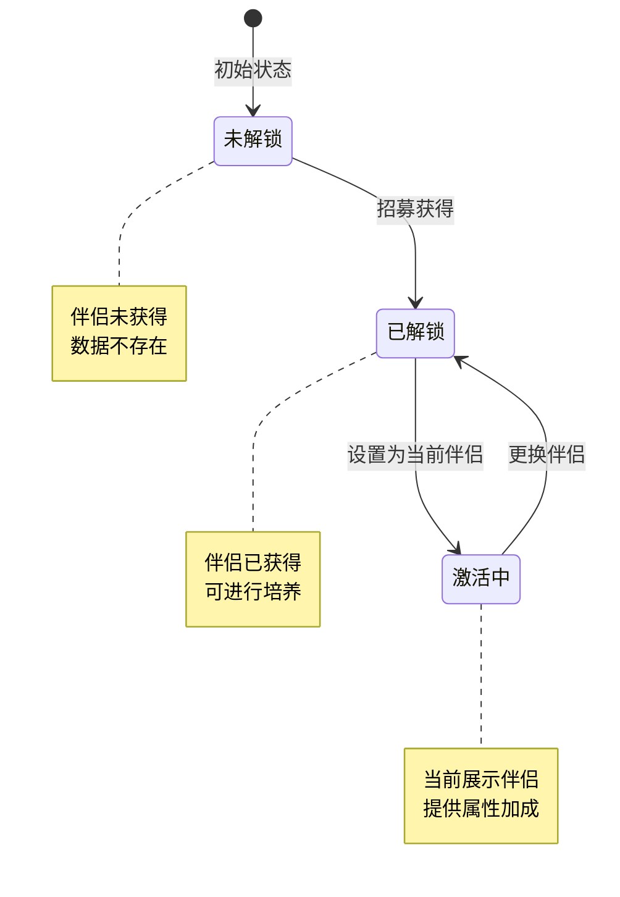
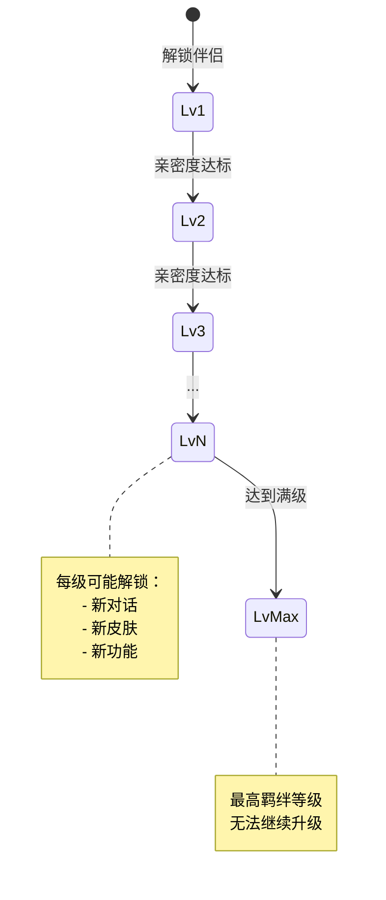
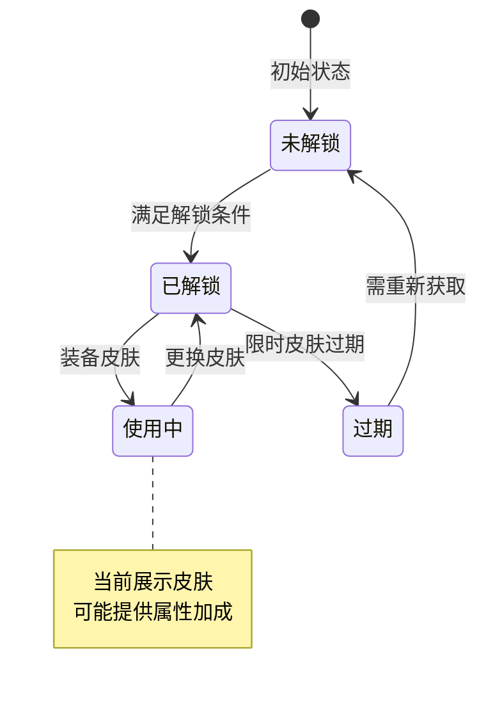
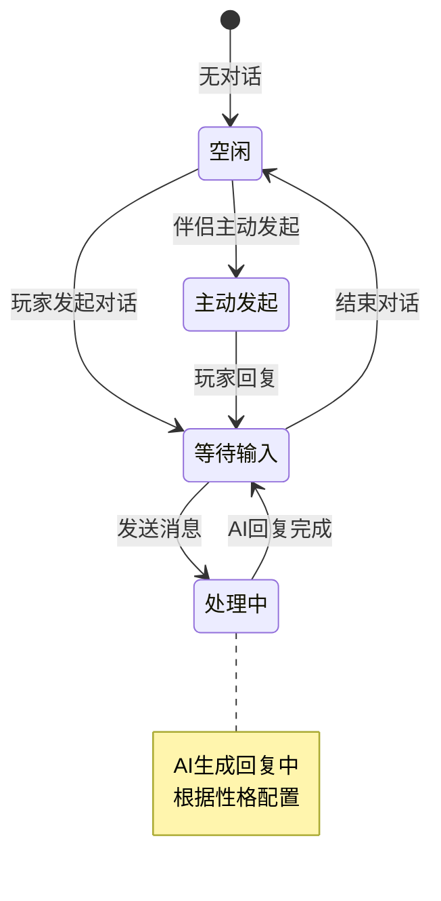
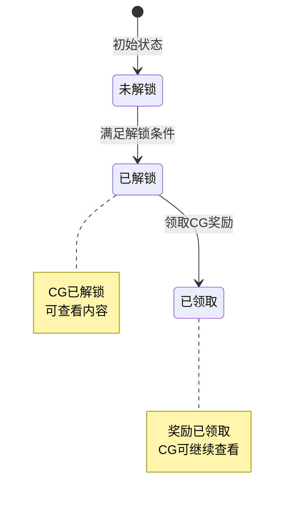
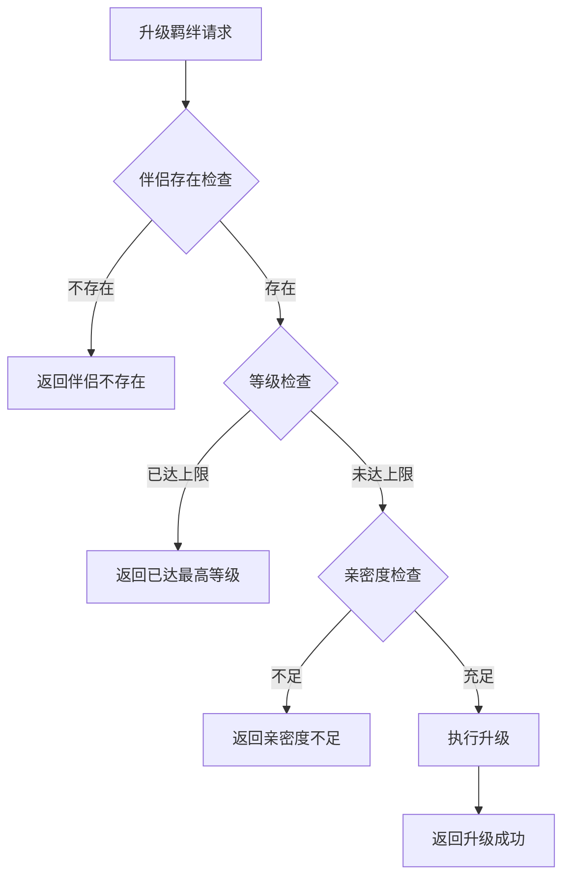

# 伴侣系统实现细节

## 一、计算公式

### 1.1 羁绊升级所需亲密度计算公式

```
所需亲密度 = base_intimacy × level ^ growth_ratio
```

**参数说明**：
- `base_intimacy`：基础亲密度（配置表）
- `level`：目标等级
- `growth_ratio`：成长系数

**示例计算**：
```
base_intimacy = 500
growth_ratio = 1.2

5级升6级需要亲密度：500 × 5^1.2 = 500 × 6.90 ≈ 3450
10级升11级需要亲密度：500 × 10^1.2 = 500 × 15.85 ≈ 7925
```

### 1.2 光环属性加成计算公式

```
属性加成 = base_value + level × growth_value
```

**参数说明**：
- `base_value`：基础属性值
- `level`：光环等级
- `growth_value`：每级成长值

**示例计算**：
```
base_value = 100
growth_value = 20

光环等级5时的属性加成 = 100 + 5 × 20 = 200
```

### 1.3 召唤权重计算公式

```
选择概率 = 伴侣权重 / 总权重
```

**示例计算**：
```
伴侣A权重：30
伴侣B权重：50
伴侣C权重：20
总权重：100

伴侣A被选中概率 = 30 / 100 = 30%
伴侣B被选中概率 = 50 / 100 = 50%
伴侣C被选中概率 = 20 / 100 = 20%
```

### 1.4 魅力值计算公式

```
魅力值 = 基础魅力 + 亲密度加成 + 皮肤加成 + 光环加成
```

---

## 二、状态机定义

### 2.1 伴侣解锁状态机



### 2.2 羁绊等级状态机



### 2.3 皮肤状态机



### 2.4 AI聊天状态机



### 2.5 CG解锁状态机



---

## 三、数据约束

### 3.1 伴侣数据约束

| 字段名 | 数据类型 | 取值范围 | 必填 | 唯一性 | 说明 |
|--------|----------|----------|------|--------|------|
| consort_id | long | > 0 | 是 | 是 | 伴侣ID |
| player_id | long | > 0 | 是 | 否 | 玩家ID |
| intimacy | int | 0-99999 | 是 | 否 | 亲密度 |
| charm | int | 0-9999 | 是 | 否 | 魅力值 |
| fetters_lvl | int | 1-50 | 是 | 否 | 羁绊等级 |
| cur_skin_id | int | >= 0 | 是 | 否 | 当前皮肤ID |
| halo_lvl | int | 0-100 | 是 | 否 | 光环等级 |
| state | int | 0-2 | 是 | 否 | 状态 |
| unlock_time | datetime | - | 是 | 否 | 解锁时间 |

### 3.2 伴侣皮肤数据约束

| 字段名 | 数据类型 | 取值范围 | 必填 | 说明 |
|--------|----------|----------|------|------|
| id | bigint | > 0 | 是 | 主键 |
| player_id | bigint | > 0 | 是 | 玩家ID |
| consort_id | bigint | > 0 | 是 | 伴侣ID |
| skin_id | int | > 0 | 是 | 皮肤ID |
| unlock_time | datetime | - | 是 | 解锁时间 |
| expire_time | datetime | - | 否 | 过期时间（限时皮肤） |

### 3.3 聊天记录数据约束

| 字段名 | 数据类型 | 取值范围 | 必填 | 说明 |
|--------|----------|----------|------|------|
| id | bigint | > 0 | 是 | 主键 |
| player_id | bigint | > 0 | 是 | 玩家ID |
| consort_id | bigint | > 0 | 是 | 伴侣ID |
| msg_type | int | 1-3 | 是 | 消息类型 |
| content | text | 1-500字符 | 是 | 消息内容 |
| create_time | datetime | - | 是 | 创建时间 |

### 3.4 商务技能数据约束

| 字段名 | 数据类型 | 取值范围 | 必填 | 说明 |
|--------|----------|----------|------|------|
| player_id | bigint | > 0 | 是 | 玩家ID |
| consort_id | bigint | > 0 | 是 | 伴侣ID |
| skill_id | int | > 0 | 是 | 技能ID |
| skill_level | int | 1-10 | 是 | 技能等级 |

### 3.5 祝福技能数据约束

| 字段名 | 数据类型 | 取值范围 | 必填 | 说明 |
|--------|----------|----------|------|------|
| player_id | bigint | > 0 | 是 | 玩家ID |
| consort_id | bigint | > 0 | 是 | 伴侣ID |
| skill_id | int | > 0 | 是 | 技能ID |
| skill_level | int | 1-10 | 是 | 技能等级 |

---

## 四、错误处理策略

### 4.1 伴侣系统错误码

| 错误码 | 错误信息 | 处理策略 | 用户提示 |
|--------|----------|----------|----------|
| 15001 | 伴侣不存在 | 检查伴侣ID有效性 | "伴侣不存在" |
| 15002 | 伴侣未解锁 | 检查解锁状态 | "该伴侣尚未解锁" |
| 15003 | 羁绊已达最高等级 | 检查等级上限 | "羁绊已达最高等级" |
| 15004 | 亲密度不足 | 检查亲密度值 | "亲密度不足，无法升级" |
| 15005 | 皮肤不存在 | 检查皮肤ID | "皮肤不存在" |
| 15006 | 皮肤已解锁 | 检查解锁状态 | "该皮肤已解锁" |
| 15007 | 解锁条件不满足 | 检查解锁条件 | "解锁条件不满足" |
| 15008 | 无可召唤伴侣 | 检查已解锁列表 | "没有可召唤的伴侣" |
| 15009 | 光环已达最高等级 | 检查等级上限 | "光环已达最高等级" |
| 15010 | CG未解锁 | 检查解锁状态 | "该CG尚未解锁" |
| 15011 | CG奖励已领取 | 检查领取状态 | "CG奖励已领取" |

### 4.2 升级羁绊错误处理流程



### 4.3 AI聊天错误处理

| 错误场景 | 处理策略 |
|----------|----------|
| AI服务不可用 | 返回默认回复 |
| 消息内容敏感 | 过滤敏感词后处理 |
| 对话历史过长 | 只保留最近N条消息 |

---

## 五、关键代码示例

### 5.1 升级羁绊伪代码

```csharp
public Result UpgradeFettersLvl(long playerId, long consortId)
{
    // 1. 获取伴侣信息
    PlayerConsort consort = consortDao.SelectByPlayerAndId(playerId, consortId);
    if (consort == null)
    {
        return Result.Error(15001, "伴侣不存在");
    }

    // 2. 获取配置
    ConsortConfig config = consortConfigDao.GetById(consortId);
    int nextLvl = consort.fettersLvl + 1;
    if (nextLvl > config.maxFettersLvl)
    {
        return Result.Error(15003, "羁绊已达最高等级");
    }

    // 3. 检查亲密度是否足够
    FettersConfig fettersConfig = fettersConfigDao.GetByLevel(nextLvl);
    if (consort.intimacy < fettersConfig.needIntimacy)
    {
        return Result.Error(15004, "亲密度不足");
    }

    // 4. 升级
    consort.fettersLvl = nextLvl;
    consortDao.UpdateById(consort);

    // 5. 推送通知
    PushFettersChg(playerId, consortId, nextLvl);

    return Result.Success(new { fettersLvl = nextLvl });
}
```

### 5.2 解锁皮肤伪代码

```csharp
public Result UnlockSkin(long playerId, long consortId, int skinId)
{
    // 1. 检查伴侣是否存在
    PlayerConsort consort = consortDao.SelectByPlayerAndId(playerId, consortId);
    if (consort == null)
    {
        return Result.Error(15001, "伴侣不存在");
    }

    // 2. 检查皮肤配置
    ConsortSkinConfig skinConfig = skinConfigDao.GetById(skinId);
    if (skinConfig == null || skinConfig.consortId != consortId)
    {
        return Result.Error(15005, "皮肤不存在");
    }

    // 3. 检查是否已解锁
    PlayerConsortSkin existingSkin = skinDao.SelectByPlayerConsortSkin(playerId, consortId, skinId);
    if (existingSkin != null)
    {
        return Result.Error(15006, "皮肤已解锁");
    }

    // 4. 检查解锁条件
    if (!CheckUnlockCondition(playerId, skinConfig.unlockCondition))
    {
        return Result.Error(15007, "解锁条件不满足");
    }

    // 5. 扣除消耗
    if (skinConfig.costList != null && skinConfig.costList.Count > 0)
    {
        if (!resourceService.CheckAndConsume(playerId, skinConfig.costList))
        {
            return Result.Error(0, "资源不足");
        }
    }

    // 6. 解锁皮肤
    PlayerConsortSkin skin = new PlayerConsortSkin
    {
        Id = idGenerator.NextId(),
        PlayerId = playerId,
        ConsortId = consortId,
        SkinId = skinId,
        UnlockTime = DateTime.Now
    };
    skinDao.Insert(skin);

    // 7. 推送通知
    PushSkinAdd(playerId, consortId, skinId);

    return Result.Success();
}
```

### 5.3 AI聊天伪代码

```csharp
public Result AiChat(long playerId, long consortId, string msg)
{
    // 1. 获取伴侣信息
    PlayerConsort consort = consortDao.SelectByPlayerAndId(playerId, consortId);
    if (consort == null)
    {
        return Result.Error(15001, "伴侣不存在");
    }

    // 2. 过滤敏感词
    msg = sensitiveWordFilter.Filter(msg);

    // 3. 记录玩家消息
    SaveChatRecord(playerId, consortId, EChatMsgType.PLAYER, msg);

    // 4. 调用AI服务
    ConsortConfig config = consortConfigDao.GetById(consortId);
    string personality = config.personality;
    string reply = aiChatService.Chat(personality, msg);

    // 5. 记录伴侣回复
    SaveChatRecord(playerId, consortId, EChatMsgType.CONSORT, reply);

    // 6. 推送通知
    PushAiChatMsgAdd(playerId, consortId, reply);

    return Result.Success(new { replyMsg = reply });
}
```

### 5.4 随机召唤伪代码

```csharp
public Result CallRandomConsort(long playerId)
{
    // 1. 获取已解锁伴侣列表
    List<PlayerConsort> unlockedList = consortDao.SelectUnlockedByPlayerId(playerId);

    if (unlockedList.Count == 0)
    {
        return Result.Error(15008, "没有可召唤的伴侣");
    }

    // 2. 根据权重随机选择
    int totalWeight = 0;
    foreach (PlayerConsort consort in unlockedList)
    {
        ConsortConfig config = consortConfigDao.GetById(consort.consortId);
        totalWeight += config.callWeight;
    }

    int random = ThreadLocalRandom.Current.Next(totalWeight);
    int currentWeight = 0;
    foreach (PlayerConsort consort in unlockedList)
    {
        ConsortConfig config = consortConfigDao.GetById(consort.consortId);
        currentWeight += config.callWeight;
        if (random < currentWeight)
        {
            PushRandCallConsortChg(playerId, consort.consortId);
            return Result.Success(new { consortId = consort.consortId });
        }
    }

    // 默认返回第一个
    return Result.Success(new { consortId = unlockedList[0].consortId });
}
```

### 5.5 升级光环伪代码

```csharp
public Result UpgradeHaloLvl(long playerId, long consortId)
{
    // 1. 获取伴侣信息
    PlayerConsort consort = consortDao.SelectByPlayerAndId(playerId, consortId);
    if (consort == null)
    {
        return Result.Error(15001, "伴侣不存在");
    }

    // 2. 获取光环配置
    int nextLvl = consort.haloLvl + 1;
    ConsortHaloConfig haloConfig = haloConfigDao.GetById(consort.haloId);
    if (nextLvl > haloConfig.maxLevel)
    {
        return Result.Error(15009, "光环已达最高等级");
    }

    // 3. 获取升级消耗
    HaloLevelConfig levelConfig = haloLevelConfigDao.GetByLevel(nextLvl);
    if (!resourceService.CheckAndConsume(playerId, levelConfig.costList))
    {
        return Result.Error(0, "资源不足");
    }

    // 4. 升级
    consort.haloLvl = nextLvl;
    consortDao.UpdateById(consort);

    // 5. 推送通知
    PushHaloChg(playerId, consortId, nextLvl);

    return Result.Success(new { haloLvl = nextLvl });
}
```

---

## 六、跨模块依赖

### 6.1 依赖模块

| 模块名称 | 依赖方式 | 依赖内容 |
|----------|----------|----------|
| Player | 强依赖 | 玩家基础信息、资源管理 |
| Item | 强依赖 | 道具消耗和发放 |
| AI | 强依赖 | AI聊天服务 |
| Push | 强依赖 | 消息推送服务 |

### 6.2 被依赖模块

| 模块名称 | 被依赖内容 |
|----------|------------|
| Home | 伴侣展示 |
| Battle | 伴侣属性加成 |
| Achievement | 伴侣相关成就 |

### 6.3 接口定义

```csharp
// AI聊天服务接口
interface IAiChatService
{
    string Chat(string personality, string message);
}

// 资源服务接口
interface IResourceService
{
    bool CheckAndConsume(long playerId, List<CostInfo> costList);
}

// 推送服务接口
interface IPushService
{
    void PushToPlayer(long playerId, object message);
}
```

---

## 七、性能优化建议

### 7.1 缓存策略

1. **伴侣数据缓存**
   - 玩家伴侣数据缓存到Redis
   - 修改后异步写入数据库

2. **AI回复缓存**
   - 常见问题回复缓存
   - 减少AI服务调用

### 7.2 数据库优化

1. **索引设计**
   - player_id + consort_id 复合索引
   - player_id 主键索引

2. **分表策略**
   - 聊天记录按时间分表
   - 定期归档历史记录

### 7.3 AI服务优化

1. **批量请求**
   - 合并多个AI请求
   - 减少网络开销

2. **超时处理**
   - 设置合理的超时时间
   - 超时后返回默认回复

---

*文档生成时间: 2026-04-07*
