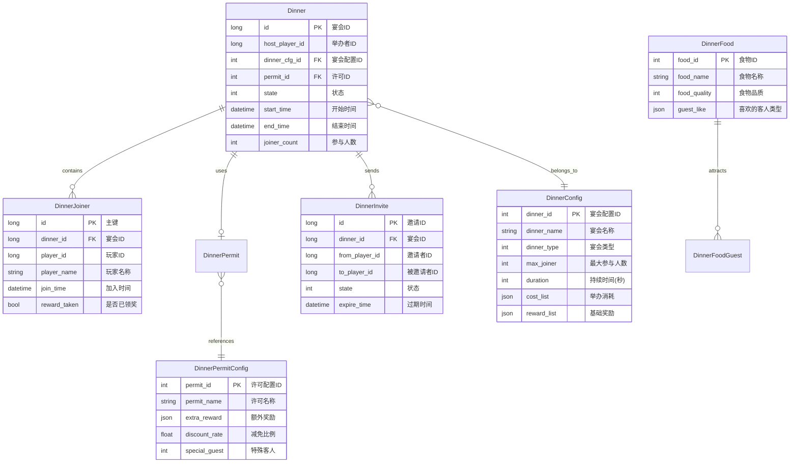
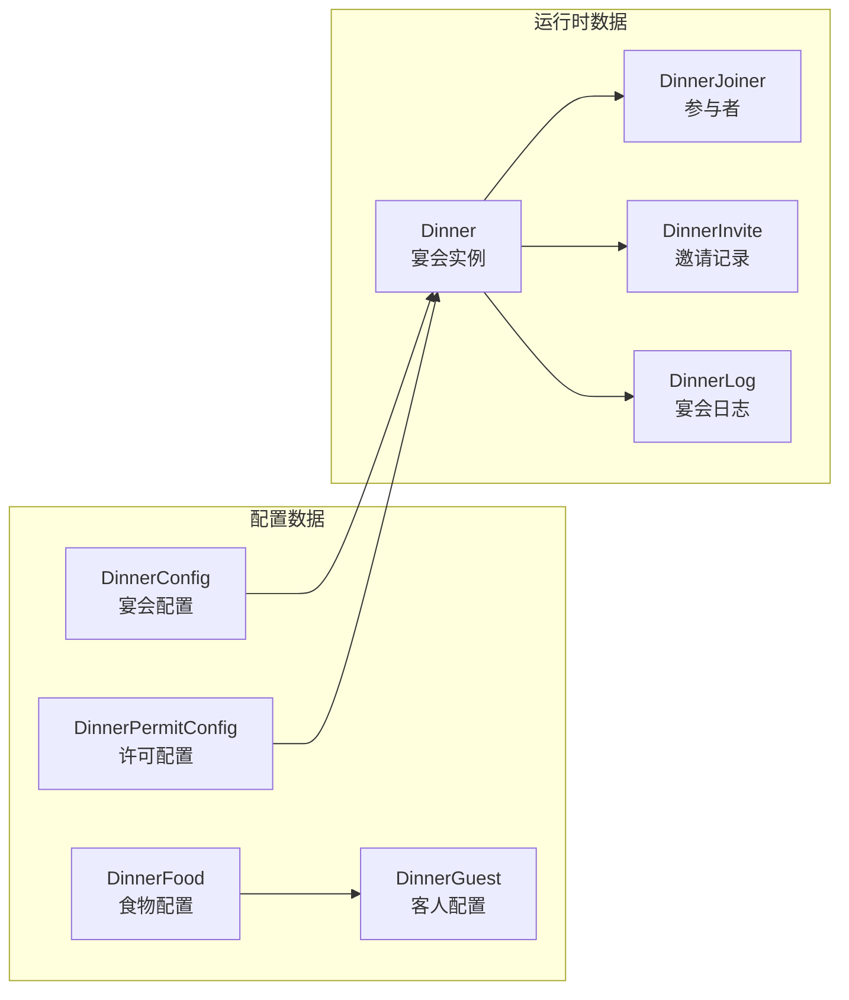
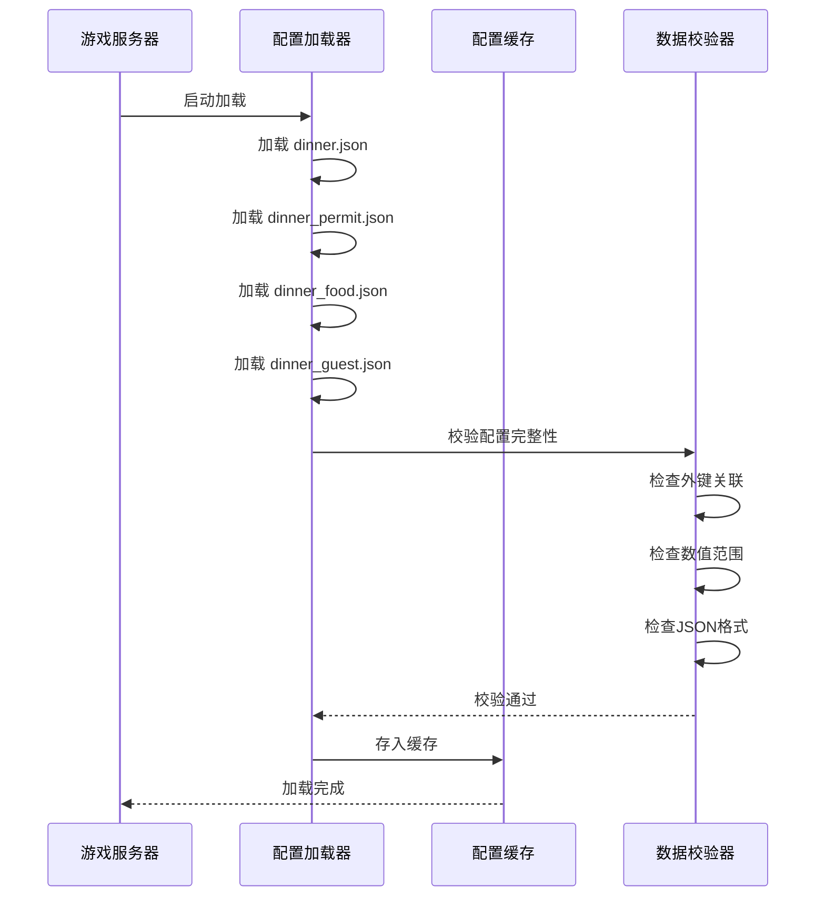
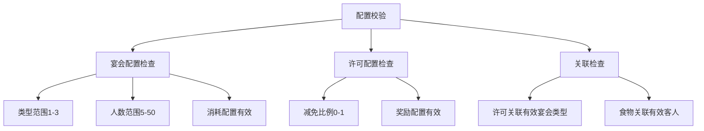

# 宴会系统 - 数据配表

**模块名称**: DinnerOp (宴会操作)
**模块编号**: p019
**文档版本**: 2.0
**更新日期**: 2026-04-12

---

## 一、配表总览



---

## 二、核心配表详情

### 2.1 宴会配置表 (DinnerConfig)

**文件路径**: `game_server/Config/dinner/dinner.json`

| 字段名 | 类型 | 必填 | 默认值 | 说明 | 示例值 |
|--------|------|------|--------|------|--------|
| dinner_id | int | 是 | - | 宴会配置ID（主键） | 1 |
| dinner_name | string | 是 | - | 宴会名称 | "普通宴会" |
| dinner_desc | string | 否 | "" | 宴会描述 | "简单的宴会" |
| dinner_type | int | 是 | 1 | 宴会类型 | 1 |
| max_joiner | int | 是 | 10 | 最大参与人数 | 20 |
| duration | int | 是 | 3600 | 持续时间(秒) | 7200 |
| cost_list | json | 是 | [] | 举办消耗列表 | [{"itemType":2,"itemId":0,"count":100}] |
| reward_list | json | 是 | [] | 基础奖励列表 | [{"itemType":1,"itemId":1001,"count":100}] |
| icon | string | 否 | "" | 图标资源路径 | "ui/dinner/icon_1" |
| unlock_level | int | 否 | 1 | 解锁等级 | 10 |
| vip_level | int | 否 | 0 | 所需VIP等级 | 0 |
| sort_id | int | 否 | 0 | 排序ID | 1 |

**宴会类型枚举 (EDinnerType)**:

| 枚举值 | 数值 | 说明 | 消耗 | 奖励 | 持续时间 |
|--------|------|------|------|------|----------|
| NORMAL | 1 | 普通宴会 | 低 | 基础 | 30分钟 |
| LUXURY | 2 | 豪华宴会 | 中 | 丰富 | 45分钟 |
| ROYAL | 3 | 皇家宴会 | 高 | 丰厚 | 60分钟 |

```csharp
public enum EDinnerType
{
    NORMAL = 1,     // 普通宴会
    LUXURY = 2,     // 豪华宴会
    ROYAL = 3       // 皇家宴会
}
```

**宴会状态枚举 (EDinnerState)**:

| 枚举值 | 数值 | 说明 | 可执行操作 |
|--------|------|------|------------|
| PREPARING | 0 | 准备中 | 等待开始 |
| ONGOING | 1 | 进行中 | 加入、邀请、领奖 |
| ENDED | 2 | 已结束 | 领取奖励 |

```csharp
public enum EDinnerState
{
    PREPARING = 0,  // 准备中
    ONGOING = 1,    // 进行中
    ENDED = 2       // 已结束
}
```

**消耗列表格式**:

```json
[
    {"itemType": 2, "itemId": 0, "count": 100},       // 钻石 × 100
    {"itemType": 1, "itemId": 5001, "count": 5},      // 道具 × 5
    {"itemType": 3, "itemId": 10001, "count": 1}      // 英雄碎片 × 1
]
```

**奖励列表格式**:

```json
[
    {"itemType": 1, "itemId": 1001, "count": 1000},   // 银两 × 1000
    {"itemType": 1, "itemId": 2001, "count": 50}      // 稀有道具 × 50
]
```

**配置示例**:

```json
[
  {
    "dinner_id": 1,
    "dinner_name": "普通宴会",
    "dinner_desc": "简单的宴会，适合小型聚会",
    "dinner_type": 1,
    "max_joiner": 10,
    "duration": 1800,
    "cost_list": [
      {"itemType": 2, "itemId": 0, "count": 100}
    ],
    "reward_list": [
      {"itemType": 1, "itemId": 1001, "count": 500},
      {"itemType": 2, "itemId": 0, "count": 20}
    ],
    "icon": "ui/dinner/normal",
    "unlock_level": 1,
    "vip_level": 0,
    "sort_id": 1
  },
  {
    "dinner_id": 2,
    "dinner_name": "豪华宴会",
    "dinner_desc": "精致的宴会，奖励丰厚",
    "dinner_type": 2,
    "max_joiner": 20,
    "duration": 2700,
    "cost_list": [
      {"itemType": 2, "itemId": 0, "count": 300}
    ],
    "reward_list": [
      {"itemType": 1, "itemId": 1001, "count": 1500},
      {"itemType": 2, "itemId": 0, "count": 50},
      {"itemType": 1, "itemId": 3001, "count": 1}
    ],
    "icon": "ui/dinner/luxury",
    "unlock_level": 20,
    "vip_level": 0,
    "sort_id": 2
  },
  {
    "dinner_id": 3,
    "dinner_name": "皇家宴会",
    "dinner_desc": "顶级的皇家宴会，奖励最丰厚",
    "dinner_type": 3,
    "max_joiner": 30,
    "duration": 3600,
    "cost_list": [
      {"itemType": 2, "itemId": 0, "count": 500}
    ],
    "reward_list": [
      {"itemType": 1, "itemId": 1001, "count": 3000},
      {"itemType": 2, "itemId": 0, "count": 100},
      {"itemType": 1, "itemId": 4001, "count": 1}
    ],
    "icon": "ui/dinner/royal",
    "unlock_level": 40,
    "vip_level": 3,
    "sort_id": 3
  }
]
```

---

### 2.2 宴会许可配置表 (DinnerPermitConfig)

**文件路径**: `game_server/Config/dinner/dinner_permit.json`

| 字段名 | 类型 | 必填 | 默认值 | 说明 |
|--------|------|------|--------|------|
| permit_id | int | 是 | - | 许可ID（主键） |
| permit_name | string | 是 | - | 许可名称 |
| permit_desc | string | 否 | "" | 许可描述 |
| extra_reward | json | 是 | [] | 额外奖励列表 |
| discount_rate | float | 否 | 0 | 消耗减免比例(0-1) |
| special_guest | int | 否 | 0 | 特殊客人ID |
| icon | string | 否 | "" | 图标资源 |
| sort_id | int | 否 | 0 | 排序ID |

**许可减免计算**:

```
实际消耗 = 基础消耗 × (1 - discount_rate)
```

**示例计算**:
```
基础消耗：钻石 × 500
discount_rate：0.2 (20%减免)
实际消耗 = 500 × (1 - 0.2) = 400 钻石
```

**配置示例**:

```json
[
  {
    "permit_id": 1,
    "permit_name": "普通宴会许可",
    "permit_desc": "使用后减免20%消耗，获得额外奖励",
    "extra_reward": [
      {"itemType": 1, "itemId": 5001, "count": 1}
    ],
    "discount_rate": 0.2,
    "special_guest": 0,
    "icon": "ui/dinner/permit_1",
    "sort_id": 1
  },
  {
    "permit_id": 2,
    "permit_name": "豪华宴会许可",
    "permit_desc": "使用后减免30%消耗，获得稀有奖励",
    "extra_reward": [
      {"itemType": 1, "itemId": 5002, "count": 1},
      {"itemType": 2, "itemId": 0, "count": 50}
    ],
    "discount_rate": 0.3,
    "special_guest": 101,
    "icon": "ui/dinner/permit_2",
    "sort_id": 2
  },
  {
    "permit_id": 3,
    "permit_name": "皇家宴会许可",
    "permit_desc": "使用后减免50%消耗，获得传说奖励",
    "extra_reward": [
      {"itemType": 1, "itemId": 5003, "count": 1},
      {"itemType": 2, "itemId": 0, "count": 100}
    ],
    "discount_rate": 0.5,
    "special_guest": 201,
    "icon": "ui/dinner/permit_3",
    "sort_id": 3
  }
]
```

---

### 2.3 宴会食物配置表 (DinnerFood)

**文件路径**: `game_server/Config/dinner/dinner_food.json`

| 字段名 | 类型 | 必填 | 默认值 | 说明 |
|--------|------|------|--------|------|
| food_id | int | 是 | - | 食物ID（主键） |
| food_name | string | 是 | - | 食物名称 |
| food_desc | string | 否 | "" | 食物描述 |
| food_quality | int | 是 | 1 | 食物品质(1-5) |
| guest_like | json | 否 | [] | 喜欢的客人类型 |
| bonus_reward | json | 否 | [] | 额外奖励 |
| icon | string | 否 | "" | 图标资源 |

**食物品质枚举**:

| 品质值 | 名称 | 颜色 | 奖励倍率 |
|--------|------|------|----------|
| 1 | 普通 | 白色 | 1.0x |
| 2 | 优秀 | 绿色 | 1.2x |
| 3 | 精良 | 蓝色 | 1.5x |
| 4 | 史诗 | 紫色 | 2.0x |
| 5 | 传说 | 橙色 | 3.0x |

**配置示例**:

```json
[
  {
    "food_id": 1,
    "food_name": "烤肉拼盘",
    "food_desc": "香气扑鼻的烤肉拼盘",
    "food_quality": 1,
    "guest_like": [1, 2],
    "bonus_reward": [],
    "icon": "ui/dinner/food_1"
  },
  {
    "food_id": 2,
    "food_name": "精美甜点",
    "food_desc": "精致的法式甜点",
    "food_quality": 3,
    "guest_like": [3, 4],
    "bonus_reward": [
      {"itemType": 2, "itemId": 0, "count": 10}
    ],
    "icon": "ui/dinner/food_2"
  }
]
```

---

### 2.4 宴会客人配置表 (DinnerGuest)

**文件路径**: `game_server/Config/dinner/dinner_guest.json`

| 字段名 | 类型 | 必填 | 默认值 | 说明 |
|--------|------|------|--------|------|
| guest_id | int | 是 | - | 客人ID（主键） |
| guest_name | string | 是 | - | 客人名称 |
| guest_type | int | 是 | 1 | 客人类型 |
| rarity | int | 是 | 1 | 稀有度(1-4) |
| prefer_food | json | 是 | [] | 喜欢的食物列表 |
| special_reward | json | 否 | [] | 特殊奖励 |
| visit_weight | int | 否 | 100 | 出现权重 |
| icon | string | 否 | "" | 图标资源 |

**客人类型枚举**:

| 枚举值 | 数值 | 说明 | 特点 |
|--------|------|------|------|
| NOBLE | 1 | 贵族 | 高额奖励 |
| MERCHANT | 2 | 商人 | 稀有道具 |
| SCHOLAR | 3 | 学者 | 经验加成 |
| ADVENTURER | 4 | 冒险者 | 特殊奖励 |

**配置示例**:

```json
[
  {
    "guest_id": 1,
    "guest_name": "贵族伯爵",
    "guest_type": 1,
    "rarity": 2,
    "prefer_food": [1, 2],
    "special_reward": [
      {"itemType": 2, "itemId": 0, "count": 50}
    ],
    "visit_weight": 200,
    "icon": "ui/dinner/guest_noble"
  },
  {
    "guest_id": 101,
    "guest_name": "神秘商人",
    "guest_type": 2,
    "rarity": 4,
    "prefer_food": [3, 4],
    "special_reward": [
      {"itemType": 1, "itemId": 6001, "count": 1}
    ],
    "visit_weight": 50,
    "icon": "ui/dinner/guest_merchant"
  }
]
```

---

## 三、数据关系图



---

## 四、配表加载流程



---

## 五、协议数据结构

### DinnerInfo - 宴会信息

**路径**: `ClientProtocol/Common/DinnerObj/Dinner_Info.cs`

| 字段名 | 类型 | 说明 | 示例值 |
|--------|------|------|--------|
| dinnerId | long | 宴会ID | 50001 |
| hostPlayerId | long | 举办者ID | 20001 |
| hostPlayerName | string | 举办者名称 | "剑舞春秋" |
| dinnerCfgId | int | 宴会配置ID | 2 |
| state | int | 状态 | 1 |
| startTimeMs | long | 开始时间戳(毫秒) | 1640000000000 |
| endTimeMs | long | 结束时间戳(毫秒) | 1640003600000 |
| joinerList | List\<DinnerJoinerInfo\> | 参与者列表 | [...] |
| permitId | int | 许可ID | 0 |

```csharp
public class Dinner_Info : _IALProtocolStructure
{
    private long dinnerId;           // 宴会ID
    private long hostPlayerId;       // 举办者ID
    private string hostPlayerName;   // 举办者名称
    private int dinnerCfgId;         // 宴会配置ID
    private int state;               // 状态
    private long startTimeMs;        // 开始时间(毫秒)
    private long endTimeMs;          // 结束时间(毫秒)
    private List<DinnerJoinerInfo> joinerList;  // 参与者列表
    private int permitId;            // 许可ID

    public byte getMainOrder() { return (byte)19; }
    public byte getSubOrder() { return (byte)0; }
}
```

### DinnerJoinerInfo - 参与者信息

**路径**: `ClientProtocol/Common/DinnerObj/DinnerJoiner_Info.cs`

| 字段名 | 类型 | 说明 | 示例值 |
|--------|------|------|--------|
| playerId | long | 玩家ID | 20002 |
| playerName | string | 玩家名称 | "风云公子" |
| joinTimeMs | long | 加入时间戳(毫秒) | 1640001000000 |
| rewardTaken | bool | 是否已领取奖励 | false |

```csharp
public class DinnerJoinerInfo : _IALProtocolStructure
{
    private long playerId;           // 玩家ID
    private string playerName;       // 玩家名称
    private long joinTimeMs;         // 加入时间(毫秒)
    private bool rewardTaken;        // 是否已领取奖励

    public byte getMainOrder() { return (byte)19; }
    public byte getSubOrder() { return (byte)0; }
}
```

### DinnerInviteInfo - 邀请信息

**路径**: `ClientProtocol/Common/DinnerObj/DinnerInvite_Info.cs`

| 字段名 | 类型 | 说明 | 示例值 |
|--------|------|------|--------|
| inviteId | long | 邀请ID | 60001 |
| dinnerId | long | 宴会ID | 50001 |
| fromPlayerId | long | 邀请者ID | 20001 |
| fromPlayerName | string | 邀请者名称 | "剑舞春秋" |
| dinnerCfgId | int | 宴会配置ID | 2 |
| expireTimeMs | long | 过期时间戳(毫秒) | 1640003600000 |

```csharp
public class DinnerInviteInfo : _IALProtocolStructure
{
    private long inviteId;           // 邀请ID
    private long dinnerId;           // 宴会ID
    private long fromPlayerId;       // 邀请者ID
    private string fromPlayerName;   // 邀请者名称
    private int dinnerCfgId;         // 宴会配置ID
    private long expireTimeMs;       // 过期时间(毫秒)

    public byte getMainOrder() { return (byte)19; }
    public byte getSubOrder() { return (byte)0; }
}
```

---

## 六、数据库表结构

### dinner（宴会数据表）

```sql
CREATE TABLE IF NOT EXISTS `dinner` (
    `id` bigint(20) NOT NULL AUTO_INCREMENT COMMENT '宴会ID',
    `host_player_id` bigint(20) NOT NULL DEFAULT '0' COMMENT '举办者ID',
    `dinner_cfg_id` int(11) NOT NULL DEFAULT '0' COMMENT '宴会配置ID',
    `permit_id` int(11) NOT NULL DEFAULT '0' COMMENT '许可ID',
    `state` int(11) NOT NULL DEFAULT '1' COMMENT '状态(0准备,1进行,2结束)',
    `start_time` datetime NOT NULL COMMENT '开始时间',
    `end_time` datetime NOT NULL COMMENT '结束时间',
    `joiner_count` int(11) NOT NULL DEFAULT '0' COMMENT '参与人数',
    `create_time` datetime DEFAULT CURRENT_TIMESTAMP COMMENT '创建时间',
    `update_time` datetime DEFAULT CURRENT_TIMESTAMP ON UPDATE CURRENT_TIMESTAMP COMMENT '更新时间',
    PRIMARY KEY (`id`),
    KEY `idx_host_player_id` (`host_player_id`),
    KEY `idx_state` (`state`),
    KEY `idx_end_time` (`end_time`),
    KEY `idx_state_end_time` (`state`, `end_time`)
) COMMENT='宴会数据表' engine=InnoDB DEFAULT CHARSET=utf8mb4;
```

### dinner_joiner（参与者表）

```sql
CREATE TABLE IF NOT EXISTS `dinner_joiner` (
    `id` bigint(20) NOT NULL AUTO_INCREMENT COMMENT '主键',
    `dinner_id` bigint(20) NOT NULL DEFAULT '0' COMMENT '宴会ID',
    `player_id` bigint(20) NOT NULL DEFAULT '0' COMMENT '玩家ID',
    `player_name` varchar(64) NOT NULL DEFAULT '' COMMENT '玩家名称',
    `join_time` datetime NOT NULL COMMENT '加入时间',
    `reward_taken` tinyint(1) NOT NULL DEFAULT '0' COMMENT '是否已领奖',
    `create_time` datetime DEFAULT CURRENT_TIMESTAMP COMMENT '创建时间',
    PRIMARY KEY (`id`),
    UNIQUE KEY `uk_dinner_player` (`dinner_id`, `player_id`),
    KEY `idx_player_id` (`player_id`),
    KEY `idx_dinner_id` (`dinner_id`)
) COMMENT='宴会参与者表' engine=InnoDB DEFAULT CHARSET=utf8mb4;
```

### dinner_invite（邀请表）

```sql
CREATE TABLE IF NOT EXISTS `dinner_invite` (
    `id` bigint(20) NOT NULL AUTO_INCREMENT COMMENT '邀请ID',
    `dinner_id` bigint(20) NOT NULL DEFAULT '0' COMMENT '宴会ID',
    `from_player_id` bigint(20) NOT NULL DEFAULT '0' COMMENT '邀请者ID',
    `to_player_id` bigint(20) NOT NULL DEFAULT '0' COMMENT '被邀请者ID',
    `state` int(11) NOT NULL DEFAULT '0' COMMENT '状态(0待处理,1已接受,2已拒绝,3已过期)',
    `expire_time` datetime NOT NULL COMMENT '过期时间',
    `create_time` datetime DEFAULT CURRENT_TIMESTAMP COMMENT '创建时间',
    PRIMARY KEY (`id`),
    KEY `idx_to_player_id` (`to_player_id`),
    KEY `idx_dinner_id` (`dinner_id`),
    KEY `idx_expire_time` (`expire_time`)
) COMMENT='宴会邀请表' engine=InnoDB DEFAULT CHARSET=utf8mb4;
```

### dinner_log（宴会日志表）

```sql
CREATE TABLE IF NOT EXISTS `dinner_log` (
    `id` bigint(20) NOT NULL AUTO_INCREMENT COMMENT '主键',
    `cid` bigint(20) NOT NULL DEFAULT '0' COMMENT '玩家CID',
    `dinner_id` bigint(20) NOT NULL DEFAULT '0' COMMENT '宴会ID',
    `dinner_cfg_id` int(11) NOT NULL DEFAULT '0' COMMENT '宴会配置ID',
    `action` int(11) NOT NULL DEFAULT '0' COMMENT '操作类型(1举办,2加入,3领奖)',
    `reward_data` text COMMENT '奖励数据(JSON)',
    `create_time` datetime DEFAULT CURRENT_TIMESTAMP COMMENT '创建时间',
    PRIMARY KEY (`id`),
    KEY `idx_cid` (`cid`),
    KEY `idx_dinner_id` (`dinner_id`),
    KEY `idx_create_time` (`create_time`)
) COMMENT='宴会日志表' engine=InnoDB DEFAULT CHARSET=utf8mb4;
```

---

## 七、配表校验规则

### 7.1 数据完整性校验

| 校验项 | 校验规则 | 错误级别 |
|--------|----------|----------|
| 主键唯一性 | dinner_id、permit_id 必须唯一 | ERROR |
| 外键关联性 | permit.dinner_type → dinner.dinner_id | ERROR |
| 数值范围 | dinner_type: 1-3, max_joiner: 5-50 | ERROR |
| 必填字段检查 | 所有标记为必填的字段不能为空 | ERROR |
| JSON格式检查 | cost_list、reward_list 等JSON字段格式正确 | WARN |

### 7.2 校验流程



---

## 八、配表路径汇总

### 8.1 客户端配置

| 文件名 | 路径 | 说明 |
|--------|------|------|
| DinnerConfig.cs | game_client/Assets/Scripts/ResScripts/NPSO/GSO/Dinner/ | 宴会配置 |
| DinnerPermitConfig.cs | game_client/Assets/Scripts/ResScripts/NPSO/GSO/Dinner/ | 许可配置 |
| DinnerFoodConfig.cs | game_client/Assets/Scripts/ResScripts/NPSO/GSO/Dinner/ | 食物配置 |
| DinnerGuestConfig.cs | game_client/Assets/Scripts/ResScripts/NPSO/GSO/Dinner/ | 客人配置 |

### 8.2 服务端配置

| 文件名 | 路径 | 说明 |
|--------|------|------|
| dinner.json | game_server/Config/dinner/ | 宴会主配置 |
| dinner_permit.json | game_server/Config/dinner/ | 许可配置 |
| dinner_food.json | game_server/Config/dinner/ | 食物配置 |
| dinner_guest.json | game_server/Config/dinner/ | 客人配置 |

---

*文档生成时间: 2026-04-12*
*文档版本: v2.1*
