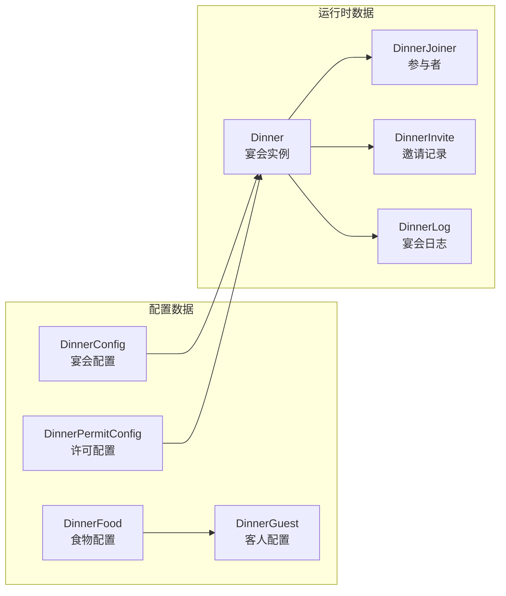
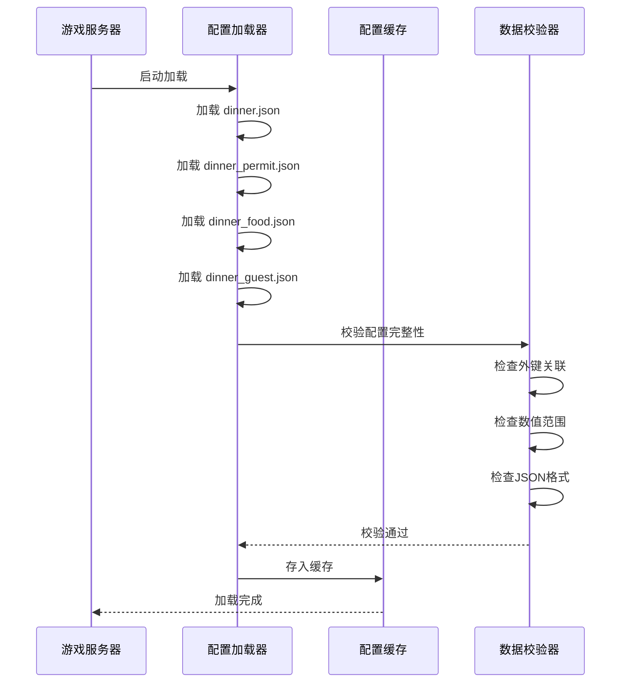
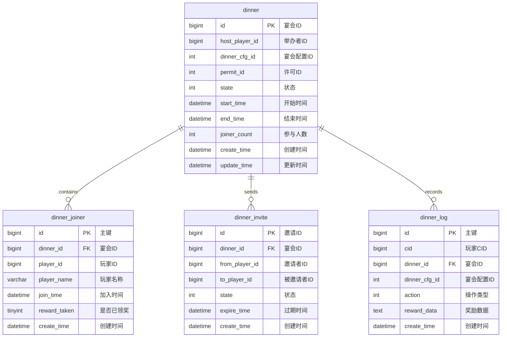
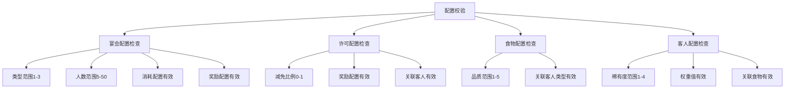
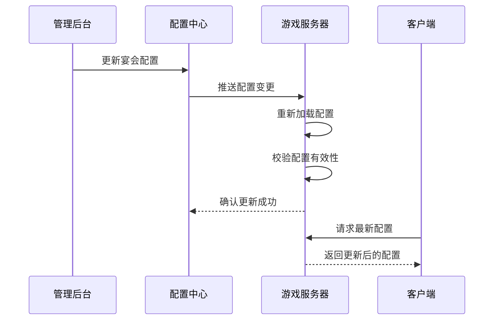

# 宴会系统 - 数据配表

**模块名称**: DinnerOp (宴会操作)
**模块编号**: p019
**文档版本**: 2.1
**更新日期**: 2026-04-12

---

## 一、配表总览


---

## 二、核心配表详情

### 2.1 宴会配置表 (DinnerConfig)

**文件路径**: `game_server/Config/dinner/dinner.json`

#### 完整字段列表

| 字段名 | 类型 | 必填 | 默认值 | 说明 | 约束条件 |
|--------|------|------|--------|------|----------|
| dinner_id | int | 是 | - | 宴会配置ID（主键） | 唯一，> 0 |
| dinner_name | string | 是 | - | 宴会名称 | 最大长度50，不能为空 |
| dinner_desc | string | 否 | "" | 宴会描述 | 最大长度500 |
| dinner_type | int | 是 | 1 | 宴会类型 | 枚举值：1-3 |
| max_joiner | int | 是 | 10 | 最大参与人数 | 范围：5-50 |
| duration | int | 是 | 3600 | 持续时间(秒) | 范围：600-7200 |
| cost_list | json | 是 | [] | 举办消耗列表 | 关联有效物品配置 |
| reward_list | json | 是 | [] | 基础奖励列表 | 关联有效物品配置 |
| icon | string | 否 | "" | 图标资源路径 | 最大长度200 |
| unlock_level | int | 否 | 1 | 解锁等级 | >= 1 |
| vip_level | int | 否 | 0 | 所需VIP等级 | >= 0 |
| sort_id | int | 否 | 0 | 排序ID | >= 0 |
| permit_type | int | 否 | 0 | 关联许可类型 | 0表示不限 |
| special_effect | int | 否 | 0 | 特殊效果ID | >= 0 |

#### 宴会类型枚举 (EDinnerType)

| 枚举值 | 数值 | 说明 | 消耗 | 奖励 | 持续时间 |
|--------|------|------|------|------|----------|
| NORMAL | 1 | 普通宴会 | 低 | 基础 | 30分钟 |
| LUXURY | 2 | 豪华宴会 | 中 | 丰富 | 45分钟 |
| ROYAL | 3 | 皇家宴会 | 高 | 丰厚 | 60分钟 |

```csharp
/// <summary>
/// 宴会类型枚举
/// </summary>
public enum EDinnerType
{
    /// <summary>普通宴会</summary>
    NORMAL = 1,
    /// <summary>豪华宴会</summary>
    LUXURY = 2,
    /// <summary>皇家宴会</summary>
    ROYAL = 3
}
```

```java
// Java枚举定义
public enum EDinnerType {
    NORMAL(1, "普通宴会"),
    LUXURY(2, "豪华宴会"),
    ROYAL(3, "皇家宴会");

    private final int value;
    private final String desc;

    EDinnerType(int value, String desc) {
        this.value = value;
        this.desc = desc;
    }

    public int getValue() { return value; }
    public String getDesc() { return desc; }

    public static EDinnerType fromValue(int value) {
        for (EDinnerType type : values()) {
            if (type.value == value) return type;
        }
        return null;
    }
}
```

#### 宴会状态枚举 (EDinnerState)

| 枚举值 | 数值 | 说明 | 可执行操作 |
|--------|------|------|------------|
| PREPARING | 0 | 准备中 | 等待开始 |
| ONGOING | 1 | 进行中 | 加入、邀请、领奖 |
| ENDED | 2 | 已结束 | 领取奖励 |

```csharp
/// <summary>
/// 宴会状态枚举
/// </summary>
public enum EDinnerState
{
    /// <summary>准备中</summary>
    PREPARING = 0,
    /// <summary>进行中</summary>
    ONGOING = 1,
    /// <summary>已结束</summary>
    ENDED = 2
}
```

#### 消耗列表格式 (cost_list)

```json
[
    {"item": {"itemType": 2, "itemId": 0}, "count": 100},
    {"item": {"itemType": 1, "itemId": 5001}, "count": 5},
    {"item": {"itemType": 3, "itemId": 10001}, "count": 1}
]
```

**字段说明**：
| 字段路径 | 类型 | 说明 | 约束条件 |
|----------|------|------|----------|
| item.itemType | int | 物品类型 | 1=普通道具, 2=货币, 3=碎片 |
| item.itemId | int | 物品ID | 必须关联有效配置 |
| count | int | 数量 | > 0 |

#### 奖励列表格式 (reward_list)

```json
[
    {"item": {"itemType": 1, "itemId": 1001}, "count": 1000},
    {"item": {"itemType": 1, "itemId": 2001}, "count": 50}
]
```

#### 配置示例

```json
[
  {
    "dinner_id": 1,
    "dinner_name": "普通宴会",
    "dinner_desc": "简单的宴会，适合小型聚会",
    "dinner_type": 1,
    "max_joiner": 10,
    "duration": 1800,
    "cost_list": [
      {"item": {"itemType": 2, "itemId": 0}, "count": 100}
    ],
    "reward_list": [
      {"item": {"itemType": 1, "itemId": 1001}, "count": 500},
      {"item": {"itemType": 2, "itemId": 0}, "count": 20}
    ],
    "icon": "ui/dinner/normal",
    "unlock_level": 1,
    "vip_level": 0,
    "sort_id": 1,
    "permit_type": 0,
    "special_effect": 0
  },
  {
    "dinner_id": 2,
    "dinner_name": "豪华宴会",
    "dinner_desc": "精致的宴会，奖励丰厚",
    "dinner_type": 2,
    "max_joiner": 20,
    "duration": 2700,
    "cost_list": [
      {"item": {"itemType": 2, "itemId": 0}, "count": 300}
    ],
    "reward_list": [
      {"item": {"itemType": 1, "itemId": 1001}, "count": 1500},
      {"item": {"itemType": 2, "itemId": 0}, "count": 50},
      {"item": {"itemType": 1, "itemId": 3001}, "count": 1}
    ],
    "icon": "ui/dinner/luxury",
    "unlock_level": 20,
    "vip_level": 0,
    "sort_id": 2,
    "permit_type": 0,
    "special_effect": 0
  },
  {
    "dinner_id": 3,
    "dinner_name": "皇家宴会",
    "dinner_desc": "顶级的皇家宴会，奖励最丰厚",
    "dinner_type": 3,
    "max_joiner": 30,
    "duration": 3600,
    "cost_list": [
      {"item": {"itemType": 2, "itemId": 0}, "count": 500}
    ],
    "reward_list": [
      {"item": {"itemType": 1, "itemId": 1001}, "count": 3000},
      {"item": {"itemType": 2, "itemId": 0}, "count": 100},
      {"item": {"itemType": 1, "itemId": 4001}, "count": 1}
    ],
    "icon": "ui/dinner/royal",
    "unlock_level": 40,
    "vip_level": 3,
    "sort_id": 3,
    "permit_type": 0,
    "special_effect": 1
  }
]
```

#### 代码示例

```java
// 服务端获取宴会配置
public DinnerConfig getDinnerConfig(int dinnerCfgId) {
    DinnerConfig config = dinnerConfigDao.getById(dinnerCfgId);
    if (config == null) {
        throw new BusinessException(ErrorCode.DINNER_CONFIG_NOT_FOUND);
    }
    return config;
}

// 检查宴会解锁条件
public boolean checkUnlockCondition(long playerId, DinnerConfig config) {
    Player player = playerDao.getById(playerId);
    if (player == null) return false;

    // 检查等级
    if (player.getLevel() < config.getUnlockLevel()) {
        return false;
    }

    // 检查VIP等级
    if (player.getVipLevel() < config.getVipLevel()) {
        return false;
    }

    return true;
}

// 获取宴会消耗
public List<ItemInfo> getCostList(DinnerConfig config, DinnerPermit permit) {
    List<ItemInfo> costList = new ArrayList<>(config.getCostList());

    if (permit != null) {
        // 应用许可减免
        DinnerPermitConfig permitConfig = permitConfigDao.getById(permit.getPermitCfgId());
        if (permitConfig != null) {
            float discountRate = permitConfig.getDiscountRate();
            for (ItemInfo item : costList) {
                item.setCount((int) Math.ceil(item.getCount() * (1 - discountRate)));
            }
        }
    }

    return costList;
}
```

```csharp
// 客户端获取宴会配置
public DinnerConfigRefObj GetDinnerConfig(int dinnerCfgId)
{
    return GRefdataCoreMgr.instance.dinnerMap.getRef(dinnerCfgId);
}

// 获取宴会类型名称
public string GetDinnerTypeName(int dinnerType)
{
    switch ((EDinnerType)dinnerType)
    {
        case EDinnerType.NORMAL: return "普通宴会";
        case EDinnerType.LUXURY: return "豪华宴会";
        case EDinnerType.ROYAL: return "皇家宴会";
        default: return "未知类型";
    }
}

// 检查是否可以举办
public bool CanHostDinner(int dinnerCfgId)
{
    var config = GetDinnerConfig(dinnerCfgId);
    if (config == null) return false;

    // 检查等级
    int playerLevel = NPPlayer.instance.level;
    if (playerLevel < config.unlock_level) return false;

    // 检查VIP等级
    int vipLevel = NPPlayer.instance.vipLevel;
    if (vipLevel < config.vip_level) return false;

    // 检查资源
    foreach (var cost in config.cost_list)
    {
        if (!NPPlayer.instance.HasEnoughResource(cost.item.itemType, cost.item.itemId, cost.count))
            return false;
    }

    return true;
}
```

---

### 2.2 宴会许可配置表 (DinnerPermitConfig)

**文件路径**: `game_server/Config/dinner/dinner_permit.json`

#### 完整字段列表

| 字段名 | 类型 | 必填 | 默认值 | 说明 | 约束条件 |
|--------|------|------|--------|------|----------|
| permit_id | int | 是 | - | 许可ID（主键） | 唯一，> 0 |
| permit_name | string | 是 | - | 许可名称 | 最大长度50 |
| permit_desc | string | 否 | "" | 许可描述 | 最大长度500 |
| extra_reward | json | 是 | [] | 额外奖励列表 | 关联有效物品配置 |
| discount_rate | float | 否 | 0 | 消耗减免比例 | 范围：0-1 |
| special_guest | int | 否 | 0 | 特殊客人ID | >= 0 |
| icon | string | 否 | "" | 图标资源 | 最大长度200 |
| sort_id | int | 否 | 0 | 排序ID | >= 0 |
| expire_days | int | 否 | 0 | 有效期天数 | 0=永久 |
| dinner_type_limit | int | 否 | 0 | 限用宴会类型 | 0=不限 |

#### 许可减免计算

```
实际消耗 = 基础消耗 × (1 - discount_rate)
```

**示例计算**：
```
基础消耗：钻石 × 500
discount_rate：0.2 (20%减免)
实际消耗 = 500 × (1 - 0.2) = 400 钻石
```

#### 配置示例

```json
[
  {
    "permit_id": 1,
    "permit_name": "普通宴会许可",
    "permit_desc": "使用后减免20%消耗，获得额外奖励",
    "extra_reward": [
      {"item": {"itemType": 1, "itemId": 5001}, "count": 1}
    ],
    "discount_rate": 0.2,
    "special_guest": 0,
    "icon": "ui/dinner/permit_1",
    "sort_id": 1,
    "expire_days": 0,
    "dinner_type_limit": 0
  },
  {
    "permit_id": 2,
    "permit_name": "豪华宴会许可",
    "permit_desc": "使用后减免30%消耗，获得稀有奖励",
    "extra_reward": [
      {"item": {"itemType": 1, "itemId": 5002}, "count": 1},
      {"item": {"itemType": 2, "itemId": 0}, "count": 50}
    ],
    "discount_rate": 0.3,
    "special_guest": 101,
    "icon": "ui/dinner/permit_2",
    "sort_id": 2,
    "expire_days": 7,
    "dinner_type_limit": 2
  },
  {
    "permit_id": 3,
    "permit_name": "皇家宴会许可",
    "permit_desc": "使用后减免50%消耗，获得传说奖励",
    "extra_reward": [
      {"item": {"itemType": 1, "itemId": 5003}, "count": 1},
      {"item": {"itemType": 2, "itemId": 0}, "count": 100}
    ],
    "discount_rate": 0.5,
    "special_guest": 201,
    "icon": "ui/dinner/permit_3",
    "sort_id": 3,
    "expire_days": 30,
    "dinner_type_limit": 3
  }
]
```

#### 代码示例

```java
// 服务端应用许可减免
public List<ItemInfo> applyPermitDiscount(List<ItemInfo> costList, DinnerPermit permit) {
    DinnerPermitConfig permitConfig = permitConfigDao.getById(permit.getPermitCfgId());
    if (permitConfig == null) {
        return costList;
    }

    float discountRate = permitConfig.getDiscountRate();
    List<ItemInfo> discounted = new ArrayList<>();
    for (ItemInfo item : costList) {
        ItemInfo newItem = new ItemInfo();
        newItem.setItemType(item.getItemType());
        newItem.setItemId(item.getItemId());
        // 向上取整，确保消耗至少为1
        newItem.setCount(Math.max(1, (int) Math.ceil(item.getCount() * (1 - discountRate))));
        discounted.add(newItem);
    }
    return discounted;
}

// 检查许可是否可用
public boolean checkPermitAvailable(long playerId, int permitId, int dinnerCfgId) {
    DinnerPermit permit = permitDao.selectById(permitId);
    if (permit == null || permit.getPlayerId() != playerId || permit.isUsed()) {
        return false;
    }

    DinnerPermitConfig permitConfig = permitConfigDao.getById(permit.getPermitCfgId());
    DinnerConfig dinnerConfig = dinnerConfigDao.getById(dinnerCfgId);

    // 检查宴会类型限制
    if (permitConfig.getDinnerTypeLimit() > 0 &&
        permitConfig.getDinnerTypeLimit() != dinnerConfig.getDinnerType()) {
        return false;
    }

    // 检查有效期
    if (permitConfig.getExpireDays() > 0) {
        Date expireDate = DateUtils.addDays(permit.getGainTime(), permitConfig.getExpireDays());
        if (new Date().after(expireDate)) {
            return false;
        }
    }

    return true;
}
```

```csharp
// 客户端获取许可信息
public DinnerPermitConfigRefObj GetPermitConfig(int permitId)
{
    return GRefdataCoreMgr.instance.permitMap.getRef(permitId);
}

// 计算减免后的消耗
public List<NPCommonCostItem> CalculateDiscountedCost(DinnerConfigRefObj dinnerConfig, int permitId)
{
    var permitConfig = GetPermitConfig(permitId);
    if (permitConfig == null) return dinnerConfig.cost_list;

    var result = new List<NPCommonCostItem>();
    foreach (var cost in dinnerConfig.cost_list)
    {
        var newCost = new NPCommonCostItem
        {
            item = cost.item,
            count = Math.Max(1, (int)Math.Ceiling(cost.count * (1 - permitConfig.discount_rate)))
        };
        result.Add(newCost);
    }
    return result;
}

// 获取使用许可后的总奖励
public List<NPCommonCostItem> GetTotalRewards(DinnerConfigRefObj dinnerConfig, int permitId)
{
    var result = new List<NPCommonCostItem>(dinnerConfig.reward_list);

    var permitConfig = GetPermitConfig(permitId);
    if (permitConfig != null && permitConfig.extra_reward != null)
    {
        result.AddRange(permitConfig.extra_reward);
    }

    return result;
}
```

---

### 2.3 宴会食物配置表 (DinnerFood)

**文件路径**: `game_server/Config/dinner/dinner_food.json`

#### 完整字段列表

| 字段名 | 类型 | 必填 | 默认值 | 说明 | 约束条件 |
|--------|------|------|--------|------|----------|
| food_id | int | 是 | - | 食物ID（主键） | 唯一，> 0 |
| food_name | string | 是 | - | 食物名称 | 最大长度50 |
| food_desc | string | 否 | "" | 食物描述 | 最大长度500 |
| food_quality | int | 是 | 1 | 食物品质 | 范围：1-5 |
| guest_like | json | 否 | [] | 喜欢的客人类型列表 | 关联有效客人类型 |
| bonus_reward | json | 否 | [] | 额外奖励 | 关联有效物品配置 |
| icon | string | 否 | "" | 图标资源 | 最大长度200 |
| unlock_condition | int | 否 | 0 | 解锁条件ID | >= 0 |

#### 食物品质枚举

| 品质值 | 名称 | 颜色 | 奖励倍率 | 出现概率 |
|--------|------|------|----------|----------|
| 1 | 普通 | 白色 | 1.0x | 50% |
| 2 | 优秀 | 绿色 | 1.2x | 25% |
| 3 | 精良 | 蓝色 | 1.5x | 15% |
| 4 | 史诗 | 紫色 | 2.0x | 8% |
| 5 | 传说 | 橙色 | 3.0x | 2% |

```csharp
/// <summary>
/// 食物品质枚举
/// </summary>
public enum EFoodQuality
{
    /// <summary>普通</summary>
    COMMON = 1,
    /// <summary>优秀</summary>
    GOOD = 2,
    /// <summary>精良</summary>
    EXCELLENT = 3,
    /// <summary>史诗</summary>
    EPIC = 4,
    /// <summary>传说</summary>
    LEGENDARY = 5
}
```

#### 配置示例

```json
[
  {
    "food_id": 1,
    "food_name": "烤肉拼盘",
    "food_desc": "香气扑鼻的烤肉拼盘",
    "food_quality": 1,
    "guest_like": [1, 2],
    "bonus_reward": [],
    "icon": "ui/dinner/food_1",
    "unlock_condition": 0
  },
  {
    "food_id": 2,
    "food_name": "精美甜点",
    "food_desc": "精致的法式甜点",
    "food_quality": 3,
    "guest_like": [3, 4],
    "bonus_reward": [
      {"item": {"itemType": 2, "itemId": 0}, "count": 10}
    ],
    "icon": "ui/dinner/food_2",
    "unlock_condition": 101
  },
  {
    "food_id": 3,
    "food_name": "皇家盛宴",
    "food_desc": "顶级的皇家料理",
    "food_quality": 5,
    "guest_like": [1, 2, 3, 4],
    "bonus_reward": [
      {"item": {"itemType": 1, "itemId": 6001}, "count": 1},
      {"item": {"itemType": 2, "itemId": 0}, "count": 50}
    ],
    "icon": "ui/dinner/food_3",
    "unlock_condition": 201
  }
]
```

---

### 2.4 宴会客人配置表 (DinnerGuest)

**文件路径**: `game_server/Config/dinner/dinner_guest.json`

#### 完整字段列表

| 字段名 | 类型 | 必填 | 默认值 | 说明 | 约束条件 |
|--------|------|------|--------|------|----------|
| guest_id | int | 是 | - | 客人ID（主键） | 唯一，> 0 |
| guest_name | string | 是 | - | 客人名称 | 最大长度50 |
| guest_type | int | 是 | 1 | 客人类型 | 枚举值：1-4 |
| rarity | int | 是 | 1 | 稀有度 | 范围：1-4 |
| prefer_food | json | 是 | [] | 喜欢的食物列表 | 关联有效食物配置 |
| special_reward | json | 否 | [] | 特殊奖励 | 关联有效物品配置 |
| visit_weight | int | 否 | 100 | 出现权重 | > 0 |
| icon | string | 否 | "" | 图标资源 | 最大长度200 |
| dialogue_id | int | 否 | 0 | 对话ID | >= 0 |

#### 客人类型枚举

| 枚举值 | 数值 | 说明 | 特点 | 奖励倾向 |
|--------|------|------|------|----------|
| NOBLE | 1 | 贵族 | 高额奖励 | 金币/银两 |
| MERCHANT | 2 | 商人 | 稀有道具 | 道具/材料 |
| SCHOLAR | 3 | 学者 | 经验加成 | 经验书 |
| ADVENTURER | 4 | 冒险者 | 特殊奖励 | 稀有道具 |

```csharp
/// <summary>
/// 客人类型枚举
/// </summary>
public enum EGuestType
{
    /// <summary>贵族</summary>
    NOBLE = 1,
    /// <summary>商人</summary>
    MERCHANT = 2,
    /// <summary>学者</summary>
    SCHOLAR = 3,
    /// <summary>冒险者</summary>
    ADVENTURER = 4
}
```

#### 客人稀有度枚举

| 稀有度 | 名称 | 颜色 | 出现概率 | 奖励倍率 |
|--------|------|------|----------|----------|
| 1 | 普通 | 白色 | 60% | 1.0x |
| 2 | 稀有 | 绿色 | 25% | 1.5x |
| 3 | 史诗 | 紫色 | 12% | 2.5x |
| 4 | 传说 | 橙色 | 3% | 5.0x |

#### 配置示例

```json
[
  {
    "guest_id": 1,
    "guest_name": "贵族伯爵",
    "guest_type": 1,
    "rarity": 2,
    "prefer_food": [1, 2],
    "special_reward": [
      {"item": {"itemType": 2, "itemId": 0}, "count": 50}
    ],
    "visit_weight": 200,
    "icon": "ui/dinner/guest_noble",
    "dialogue_id": 1001
  },
  {
    "guest_id": 2,
    "guest_name": "神秘商人",
    "guest_type": 2,
    "rarity": 4,
    "prefer_food": [3, 4],
    "special_reward": [
      {"item": {"itemType": 1, "itemId": 6001}, "count": 1}
    ],
    "visit_weight": 50,
    "icon": "ui/dinner/guest_merchant",
    "dialogue_id": 1002
  },
  {
    "guest_id": 3,
    "guest_name": "学者大师",
    "guest_type": 3,
    "rarity": 3,
    "prefer_food": [2, 5],
    "special_reward": [
      {"item": {"itemType": 1, "itemId": 2001}, "count": 5}
    ],
    "visit_weight": 100,
    "icon": "ui/dinner/guest_scholar",
    "dialogue_id": 1003
  }
]
```

---

## 三、数据关系图



---

## 四、配表加载流程



---

## 五、协议数据结构

### DinnerInfo - 宴会信息

**路径**: `ClientProtocol/Common/DinnerObj/Dinner_Info.cs`

| 字段名 | 类型 | 说明 | 示例值 | 约束条件 |
|--------|------|------|--------|----------|
| dinnerId | long | 宴会ID | 50001 | > 0 |
| hostPlayerId | long | 举办者ID | 20001 | > 0 |
| hostPlayerName | string | 举办者名称 | "剑舞春秋" | 最大长度64 |
| dinnerCfgId | int | 宴会配置ID | 2 | > 0 |
| state | int | 状态 | 1 | 枚举值：0-2 |
| startTimeMs | long | 开始时间戳(毫秒) | 1640000000000 | > 0 |
| endTimeMs | long | 结束时间戳(毫秒) | 1640003600000 | > startTimeMs |
| joinerList | List\<DinnerJoinerInfo\> | 参与者列表 | [...] | 非空 |
| permitId | int | 许可ID | 0 | >= 0 |

```csharp
/// <summary>
/// 宴会信息协议结构
/// </summary>
public class Dinner_Info : _IALProtocolStructure
{
    private long dinnerId;           // 宴会ID
    private long hostPlayerId;       // 举办者ID
    private string hostPlayerName;   // 举办者名称
    private int dinnerCfgId;         // 宴会配置ID
    private int state;               // 状态
    private long startTimeMs;        // 开始时间(毫秒)
    private long endTimeMs;          // 结束时间(毫秒)
    private List<DinnerJoinerInfo> joinerList;  // 参与者列表
    private int permitId;            // 许可ID

    public byte getMainOrder() { return (byte)19; }
    public byte getSubOrder() { return (byte)0; }
}
```

### DinnerJoinerInfo - 参与者信息

**路径**: `ClientProtocol/Common/DinnerObj/DinnerJoiner_Info.cs`

| 字段名 | 类型 | 说明 | 示例值 | 约束条件 |
|--------|------|------|--------|----------|
| playerId | long | 玩家ID | 20002 | > 0 |
| playerName | string | 玩家名称 | "风云公子" | 最大长度64 |
| joinTimeMs | long | 加入时间戳(毫秒) | 1640001000000 | > 0 |
| rewardTaken | bool | 是否已领取奖励 | false | - |

```csharp
/// <summary>
/// 宴会参与者信息
/// </summary>
public class DinnerJoinerInfo : _IALProtocolStructure
{
    private long playerId;           // 玩家ID
    private string playerName;       // 玩家名称
    private long joinTimeMs;         // 加入时间(毫秒)
    private bool rewardTaken;        // 是否已领取奖励

    public byte getMainOrder() { return (byte)19; }
    public byte getSubOrder() { return (byte)0; }
}
```

### DinnerInviteInfo - 邀请信息

**路径**: `ClientProtocol/Common/DinnerObj/DinnerInvite_Info.cs`

| 字段名 | 类型 | 说明 | 示例值 | 约束条件 |
|--------|------|------|--------|----------|
| inviteId | long | 邀请ID | 60001 | > 0 |
| dinnerId | long | 宴会ID | 50001 | > 0 |
| fromPlayerId | long | 邀请者ID | 20001 | > 0 |
| fromPlayerName | string | 邀请者名称 | "剑舞春秋" | 最大长度64 |
| dinnerCfgId | int | 宴会配置ID | 2 | > 0 |
| expireTimeMs | long | 过期时间戳(毫秒) | 1640003600000 | > 0 |

```csharp
/// <summary>
/// 宴会邀请信息
/// </summary>
public class DinnerInviteInfo : _IALProtocolStructure
{
    private long inviteId;           // 邀请ID
    private long dinnerId;           // 宴会ID
    private long fromPlayerId;       // 邀请者ID
    private string fromPlayerName;   // 邀请者名称
    private int dinnerCfgId;         // 宴会配置ID
    private long expireTimeMs;       // 过期时间(毫秒)

    public byte getMainOrder() { return (byte)19; }
    public byte getSubOrder() { return (byte)0; }
}
```

---

## 六、数据库表结构

### dinner（宴会数据表）

```sql
CREATE TABLE IF NOT EXISTS `dinner` (
    `id` bigint(20) NOT NULL AUTO_INCREMENT COMMENT '宴会ID',
    `host_player_id` bigint(20) NOT NULL DEFAULT '0' COMMENT '举办者ID',
    `dinner_cfg_id` int(11) NOT NULL DEFAULT '0' COMMENT '宴会配置ID',
    `permit_id` int(11) NOT NULL DEFAULT '0' COMMENT '许可ID',
    `state` int(11) NOT NULL DEFAULT '1' COMMENT '状态(0准备,1进行,2结束)',
    `start_time` datetime NOT NULL COMMENT '开始时间',
    `end_time` datetime NOT NULL COMMENT '结束时间',
    `joiner_count` int(11) NOT NULL DEFAULT '0' COMMENT '参与人数',
    `create_time` datetime DEFAULT CURRENT_TIMESTAMP COMMENT '创建时间',
    `update_time` datetime DEFAULT CURRENT_TIMESTAMP ON UPDATE CURRENT_TIMESTAMP COMMENT '更新时间',
    PRIMARY KEY (`id`),
    KEY `idx_host_player_id` (`host_player_id`),
    KEY `idx_state` (`state`),
    KEY `idx_end_time` (`end_time`),
    KEY `idx_state_end_time` (`state`, `end_time`)
) COMMENT='宴会数据表' engine=InnoDB DEFAULT CHARSET=utf8mb4;
```

### dinner_joiner（参与者表）

```sql
CREATE TABLE IF NOT EXISTS `dinner_joiner` (
    `id` bigint(20) NOT NULL AUTO_INCREMENT COMMENT '主键',
    `dinner_id` bigint(20) NOT NULL DEFAULT '0' COMMENT '宴会ID',
    `player_id` bigint(20) NOT NULL DEFAULT '0' COMMENT '玩家ID',
    `player_name` varchar(64) NOT NULL DEFAULT '' COMMENT '玩家名称',
    `join_time` datetime NOT NULL COMMENT '加入时间',
    `reward_taken` tinyint(1) NOT NULL DEFAULT '0' COMMENT '是否已领奖',
    `create_time` datetime DEFAULT CURRENT_TIMESTAMP COMMENT '创建时间',
    PRIMARY KEY (`id`),
    UNIQUE KEY `uk_dinner_player` (`dinner_id`, `player_id`),
    KEY `idx_player_id` (`player_id`),
    KEY `idx_dinner_id` (`dinner_id`)
) COMMENT='宴会参与者表' engine=InnoDB DEFAULT CHARSET=utf8mb4;
```

### dinner_invite（邀请表）

```sql
CREATE TABLE IF NOT EXISTS `dinner_invite` (
    `id` bigint(20) NOT NULL AUTO_INCREMENT COMMENT '邀请ID',
    `dinner_id` bigint(20) NOT NULL DEFAULT '0' COMMENT '宴会ID',
    `from_player_id` bigint(20) NOT NULL DEFAULT '0' COMMENT '邀请者ID',
    `to_player_id` bigint(20) NOT NULL DEFAULT '0' COMMENT '被邀请者ID',
    `state` int(11) NOT NULL DEFAULT '0' COMMENT '状态(0待处理,1已接受,2已拒绝,3已过期)',
    `expire_time` datetime NOT NULL COMMENT '过期时间',
    `create_time` datetime DEFAULT CURRENT_TIMESTAMP COMMENT '创建时间',
    PRIMARY KEY (`id`),
    KEY `idx_to_player_id` (`to_player_id`),
    KEY `idx_dinner_id` (`dinner_id`),
    KEY `idx_expire_time` (`expire_time`)
) COMMENT='宴会邀请表' engine=InnoDB DEFAULT CHARSET=utf8mb4;
```

### dinner_log（宴会日志表）

```sql
CREATE TABLE IF NOT EXISTS `dinner_log` (
    `id` bigint(20) NOT NULL AUTO_INCREMENT COMMENT '主键',
    `cid` bigint(20) NOT NULL DEFAULT '0' COMMENT '玩家CID',
    `dinner_id` bigint(20) NOT NULL DEFAULT '0' COMMENT '宴会ID',
    `dinner_cfg_id` int(11) NOT NULL DEFAULT '0' COMMENT '宴会配置ID',
    `action` int(11) NOT NULL DEFAULT '0' COMMENT '操作类型(1举办,2加入,3领奖)',
    `reward_data` text COMMENT '奖励数据(JSON)',
    `create_time` datetime DEFAULT CURRENT_TIMESTAMP COMMENT '创建时间',
    PRIMARY KEY (`id`),
    KEY `idx_cid` (`cid`),
    KEY `idx_dinner_id` (`dinner_id`),
    KEY `idx_create_time` (`create_time`)
) COMMENT='宴会日志表' engine=InnoDB DEFAULT CHARSET=utf8mb4;
```

### 数据库表关系图



---

## 七、配表校验规则

### 7.1 数据完整性校验

| 校验项 | 校验规则 | 错误级别 | 错误提示 |
|--------|----------|----------|----------|
| 主键唯一性 | dinner_id、permit_id、food_id、guest_id 必须唯一 | ERROR | "主键重复: {id}" |
| 外键关联性 | extra_reward、bonus_reward 必须关联有效物品 | ERROR | "无效物品引用: {itemId}" |
| 数值范围 | dinner_type: 1-3, max_joiner: 5-50, duration: 600-7200 | ERROR | "数值超出范围: {field}" |
| 必填字段检查 | 所有标记为必填的字段不能为空 | ERROR | "必填字段为空: {field}" |
| JSON格式检查 | cost_list、reward_list 等JSON字段格式正确 | WARN | "JSON格式错误: {field}" |

### 7.2 校验流程



### 7.3 校验代码

```java
/**
 * 宴会配置校验器
 */
public class DinnerConfigValidator {

    /**
     * 校验宴会配置
     */
    public void validateDinnerConfig(DinnerConfig config) {
        // 校验主键
        if (config.getDinnerId() <= 0) {
            throw new ConfigException("宴会配置ID无效: " + config.getDinnerId());
        }

        // 校验名称
        if (StringUtils.isEmpty(config.getDinnerName())) {
            throw new ConfigException("宴会名称不能为空: " + config.getDinnerId());
        }
        if (config.getDinnerName().length() > 50) {
            throw new ConfigException("宴会名称过长: " + config.getDinnerId());
        }

        // 校验类型
        if (config.getDinnerType() < 1 || config.getDinnerType() > 3) {
            throw new ConfigException("宴会类型无效: " + config.getDinnerType());
        }

        // 校验人数
        if (config.getMaxJoiner() < 5 || config.getMaxJoiner() > 50) {
            throw new ConfigException("最大参与人数超出范围: " + config.getMaxJoiner());
        }

        // 校验持续时间
        if (config.getDuration() < 600 || config.getDuration() > 7200) {
            throw new ConfigException("持续时间超出范围: " + config.getDuration());
        }

        // 校验消耗列表
        validateItemList(config.getCostList(), "消耗列表");

        // 校验奖励列表
        validateItemList(config.getRewardList(), "奖励列表");
    }

    /**
     * 校验物品列表
     */
    private void validateItemList(List<ItemInfo> itemList, String fieldName) {
        if (itemList == null || itemList.isEmpty()) {
            return;
        }

        for (ItemInfo item : itemList) {
            // 校验物品类型
            if (item.getItemType() < 1 || item.getItemType() > 10) {
                throw new ConfigException(fieldName + "物品类型无效: " + item.getItemType());
            }

            // 校验数量
            if (item.getCount() <= 0) {
                throw new ConfigException(fieldName + "物品数量无效: " + item.getCount());
            }

            // 校验物品是否存在
            if (!itemConfigMgr.hasItem(item.getItemType(), item.getItemId())) {
                throw new ConfigException(fieldName + "物品不存在: " + item.getItemId());
            }
        }
    }

    /**
     * 校验许可配置
     */
    public void validatePermitConfig(DinnerPermitConfig config) {
        // 校验主键
        if (config.getPermitId() <= 0) {
            throw new ConfigException("许可ID无效: " + config.getPermitId());
        }

        // 校验减免比例
        if (config.getDiscountRate() < 0 || config.getDiscountRate() > 1) {
            throw new ConfigException("减免比例超出范围: " + config.getDiscountRate());
        }

        // 校验额外奖励
        validateItemList(config.getExtraReward(), "额外奖励");

        // 校验关联客人
        if (config.getSpecialGuest() > 0) {
            if (!guestConfigMgr.hasGuest(config.getSpecialGuest())) {
                throw new ConfigException("关联客人不存在: " + config.getSpecialGuest());
            }
        }
    }
}
```

---

## 八、配表路径汇总

### 8.1 客户端配置

| 文件名 | 路径 | 说明 |
|--------|------|------|
| DinnerConfigRefObj.cs | game_client/Assets/Scripts/ResScripts/NPSO/GSO/Dinner/ | 宴会配置对象 |
| DinnerPermitConfigRefObj.cs | game_client/Assets/Scripts/ResScripts/NPSO/GSO/Dinner/ | 许可配置对象 |
| DinnerFoodConfigRefObj.cs | game_client/Assets/Scripts/ResScripts/NPSO/GSO/Dinner/ | 食物配置对象 |
| DinnerGuestConfigRefObj.cs | game_client/Assets/Scripts/ResScripts/NPSO/GSO/Dinner/ | 客人配置对象 |
| DinnerConfigRefCore.cs | game_client/Assets/Scripts/ResScripts/NPSO/GSO/Dinner/ | 宴会配置容器 |

### 8.2 服务端配置

| 文件名 | 路径 | 说明 |
|--------|------|------|
| dinner.json | game_server/Config/dinner/ | 宴会主配置 |
| dinner_permit.json | game_server/Config/dinner/ | 许可配置 |
| dinner_food.json | game_server/Config/dinner/ | 食物配置 |
| dinner_guest.json | game_server/Config/dinner/ | 客人配置 |

### 8.3 客户端配置类

```csharp
/// <summary>
/// 宴会配置对象
/// </summary>
public class DinnerConfigRefObj : _IALRefDataObj
{
    public int dinner_id;                              // 宴会配置ID
    public string dinner_name;                         // 宴会名称
    public string dinner_desc;                         // 宴会描述
    public int dinner_type;                            // 宴会类型
    public int max_joiner;                             // 最大参与人数
    public int duration;                               // 持续时间(秒)
    public List<NPCommonCostItem> cost_list;           // 举办消耗
    public List<NPCommonCostItem> reward_list;         // 基础奖励
    public string icon;                                // 图标路径
    public int unlock_level;                           // 解锁等级
    public int vip_level;                              // VIP等级
    public int sort_id;                                // 排序ID
    public int permit_type;                            // 关联许可类型
    public int special_effect;                         // 特殊效果ID

    /// <summary>
    /// 获取宴会类型名称
    /// </summary>
    public string GetDinnerTypeName()
    {
        return ((EDinnerType)dinner_type).ToString();
    }

    /// <summary>
    /// 获取本地化名称
    /// </summary>
    public string GetLocalizedName()
    {
        return LocalizationManager.instance.GetText(dinner_name);
    }

    /// <summary>
    /// 获取持续时间（毫秒）
    /// </summary>
    public long GetDurationMs()
    {
        return duration * 1000L;
    }

    /// <summary>
    /// 检查是否满足解锁条件
    /// </summary>
    public bool CheckUnlockCondition(int playerLevel, int vipLevel)
    {
        return playerLevel >= unlock_level && vipLevel >= vip_level;
    }
}

/// <summary>
/// 宴会配置容器
/// </summary>
public class DinnerConfigRefCore : _ALRefDataCore
{
    public List<DinnerConfigRefObj> refList;
    private Dictionary<int, DinnerConfigRefObj> _configMap;
    private List<DinnerConfigRefObj> _sortedList;

    public override void init(List<_IALRefDataObj> _refList)
    {
        base.init(_refList);

        _configMap = new Dictionary<int, DinnerConfigRefObj>();
        foreach (var obj in _refList)
        {
            var refObj = obj as DinnerConfigRefObj;
            _configMap[refObj.dinner_id] = refObj;
        }

        // 按sort_id排序
        _sortedList = refList.OrderBy(x => x.sort_id).ToList();
    }

    /// <summary>
    /// 根据ID获取配置
    /// </summary>
    public DinnerConfigRefObj getRef(int dinnerId)
    {
        return _configMap.TryGetValue(dinnerId, out var refObj) ? refObj : null;
    }

    /// <summary>
    /// 获取按类型过滤的配置列表
    /// </summary>
    public List<DinnerConfigRefObj> getByType(EDinnerType type)
    {
        return refList.FindAll(x => x.dinner_type == (int)type);
    }

    /// <summary>
    /// 获取排序后的配置列表
    /// </summary>
    public List<DinnerConfigRefObj> getSortedList()
    {
        return _sortedList;
    }

    /// <summary>
    /// 检查配置是否存在
    /// </summary>
    public bool hasConfig(int dinnerId)
    {
        return _configMap.ContainsKey(dinnerId);
    }
}
```

---

## 九、配置热更新机制



### 热更新代码示例

```java
/**
 * 宴会配置热更新服务
 */
@Service
public class DinnerConfigReloadService {

    @Autowired
    private DinnerConfigMgr dinnerConfigMgr;

    @Autowired
    private DinnerConfigValidator validator;

    /**
     * 热更新宴会配置
     */
    public void reloadDinnerConfig() {
        try {
            // 备份当前配置
            Map<Integer, DinnerConfig> backup = dinnerConfigMgr.getAllConfigs();

            // 重新加载配置
            dinnerConfigMgr.reload();

            // 校验新配置
            for (DinnerConfig config : dinnerConfigMgr.getAllConfigs().values()) {
                validator.validateDinnerConfig(config);
            }

            log.info("宴会配置热更新成功");
        } catch (Exception e) {
            log.error("宴会配置热更新失败", e);
            // 恢复备份
            dinnerConfigMgr.restore(backup);
        }
    }
}
```

---

*文档生成时间: 2026-04-12*
*文档版本: v2.1*
