# 宴会系统协议文档

**模块编号**: p019 (DinnerOp)
**文档版本**: 2.0
**更新日期**: 2026-04-12

---

## 一、协议总览

### 1.1 协议模块架构图

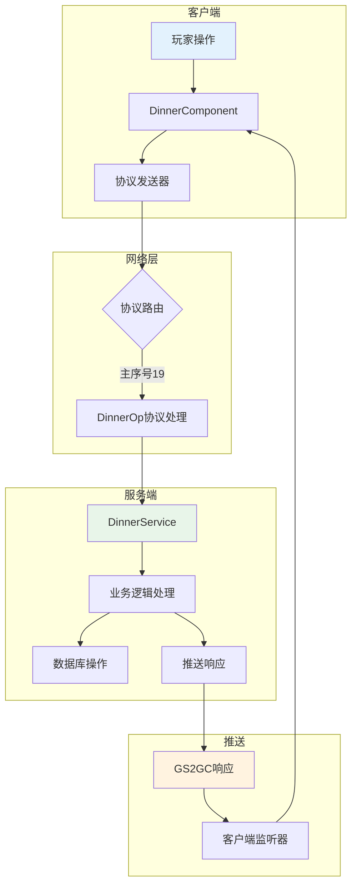

### 1.2 协议序号分配

| 子序号范围 | 用途 | 示例协议 |
|------------|------|----------|
| 001-010 | 宴会操作 | 001举办宴会, 002使用许可举办, 008加入宴会 |
| 011-020 | 查询操作 | 003参与者列表, 004宴会记录, 006宴会列表 |
| 021-030 | 奖励操作 | 009领取奖励 |
| 031-040 | 邀请操作 | 013发送邀请, 014检查邀请 |
| 050-059 | 推送通知 | 050宴会添加, 051宴会结束, 052许可添加, 053参与者添加 |

### 1.3 协议分类一览表

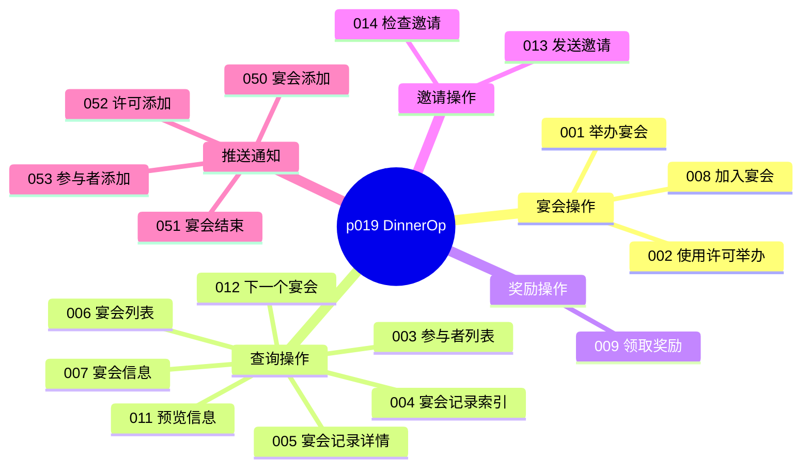

---

## 二、请求协议 (GC2GS)

### 2.1 GC2GS_019_001_ReqStartDinner - 请求举办宴会

**主序号**: 19 | **子序号**: 1

#### 协议字段

| 字段名 | 类型 | 说明 | 必填 | 校验规则 |
|--------|------|------|------|----------|
| dinnerCfgId | int | 宴会配置ID | 是 | 必须为有效配置ID |

#### 协议源码

```csharp
public class GC2GS_019_001_ReqStartDinner : _IALProtocolStructure
{
    private int dinnerCfgId;  // 宴会配置ID

    public byte getMainOrder() { return (byte)19; }
    public byte getSubOrder() { return (byte)1; }
}
```

#### 请求示例

```csharp
// 通过宴会组件发送举办请求
NPPlayer.instance.dinnerComp.reqStartDinner(dinnerCfgId, () => {
    Debug.Log("宴会举办成功");
});
```

---

### 2.2 GC2GS_019_002_ReqStartDinnerByPermit - 使用许可举办宴会

**主序号**: 19 | **子序号**: 2

#### 协议字段

| 字段名 | 类型 | 说明 | 必填 | 校验规则 |
|--------|------|------|------|----------|
| dinnerCfgId | int | 宴会配置ID | 是 | 必须为有效配置ID |
| permitId | int | 许可ID | 是 | 必须为玩家拥有的许可 |

#### 协议源码

```csharp
public class GC2GS_019_002_ReqStartDinnerByPermit : _IALProtocolStructure
{
    private int dinnerCfgId;  // 宴会配置ID
    private int permitId;     // 许可ID

    public byte getMainOrder() { return (byte)19; }
    public byte getSubOrder() { return (byte)2; }
}
```

---

### 2.3 GC2GS_019_003_ReqJoinedPlayerList - 请求已加入玩家列表

**主序号**: 19 | **子序号**: 3

#### 协议字段

| 字段名 | 类型 | 说明 | 必填 |
|--------|------|------|------|
| dinnerId | long | 宴会ID | 是 |
| hostPlayerId | long | 举办者ID | 是 |

#### 协议源码

```csharp
public class GC2GS_019_003_ReqJoinedPlayerList : _IALProtocolStructure
{
    private long dinnerId;      // 宴会ID
    private long hostPlayerId;  // 举办者ID

    public byte getMainOrder() { return (byte)19; }
    public byte getSubOrder() { return (byte)3; }
}
```

---

### 2.4 GC2GS_019_004_ReqGetStartLogIdxList - 请求宴会举办记录索引列表

**主序号**: 19 | **子序号**: 4

#### 协议字段

无请求参数，返回玩家自己的宴会举办记录索引。

---

### 2.5 GC2GS_019_005_ReqGetStartLogInfo - 请求宴会举办记录详情

**主序号**: 19 | **子序号**: 5

#### 协议字段

| 字段名 | 类型 | 说明 | 必填 |
|--------|------|------|------|
| logId | long | 记录ID | 是 |

---

### 2.6 GC2GS_019_006_ReqGetDinnerIdxList - 请求宴会索引列表

**主序号**: 19 | **子序号**: 6

#### 协议字段

无请求参数，返回当前可参加的宴会索引列表。

---

### 2.7 GC2GS_019_007_ReqGetDinnerInfo - 请求宴会信息

**主序号**: 19 | **子序号**: 7

#### 协议字段

| 字段名 | 类型 | 说明 | 必填 |
|--------|------|------|------|
| dinnerId | long | 宴会ID | 是 |
| hostPlayerId | long | 举办者ID | 是 |

---

### 2.8 GC2GS_019_008_ReqJoinDinner - 请求加入宴会

**主序号**: 19 | **子序号**: 8

#### 协议字段

| 字段名 | 类型 | 说明 | 必填 | 校验规则 |
|--------|------|------|------|----------|
| dinnerId | long | 宴会ID | 是 | 必须存在且进行中 |
| hostPlayerId | long | 举办者ID | 是 | 必须匹配宴会举办者 |

#### 协议源码

```csharp
public class GC2GS_019_008_ReqJoinDinner : _IALProtocolStructure
{
    private long dinnerId;      // 宴会ID
    private long hostPlayerId;  // 举办者ID

    public byte getMainOrder() { return (byte)19; }
    public byte getSubOrder() { return (byte)8; }
}
```

#### 请求示例

```csharp
NPPlayer.instance.dinnerComp.reqJoinDinner(dinnerId, hostPlayerId, () => {
    Debug.Log("加入宴会成功");
});
```

---

### 2.9 GC2GS_019_009_ReqTakeOpenReward - 请求领取奖励

**主序号**: 19 | **子序号**: 9

#### 协议字段

| 字段名 | 类型 | 说明 | 必填 |
|--------|------|------|------|
| dinnerId | long | 宴会ID | 是 |

#### 协议源码

```csharp
public class GC2GS_019_009_ReqTakeOpenReward : _IALProtocolStructure
{
    private long dinnerId;  // 宴会ID

    public byte getMainOrder() { return (byte)19; }
    public byte getSubOrder() { return (byte)9; }
}
```

---

### 2.10 GC2GS_019_011_ReqGetPreDinnerInfo - 请求预览宴会信息

**主序号**: 19 | **子序号**: 11

#### 协议字段

| 字段名 | 类型 | 说明 | 必填 |
|--------|------|------|------|
| dinnerCfgId | int | 宴会配置ID | 是 |

---

### 2.11 GC2GS_019_012_ReqGetNextDinnerInfo - 请求下一个宴会信息

**主序号**: 19 | **子序号**: 12

#### 协议字段

无请求参数，返回下一个可参加的宴会信息。

---

### 2.12 GC2GS_019_013_ReqSendInviteToPlayer - 请求发送邀请

**主序号**: 19 | **子序号**: 13

#### 协议字段

| 字段名 | 类型 | 说明 | 必填 | 校验规则 |
|--------|------|------|------|----------|
| targetPlayerId | long | 目标玩家ID | 是 | 必须为好友关系 |

#### 协议源码

```csharp
public class GC2GS_019_013_ReqSendInviteToPlayer : _IALProtocolStructure
{
    private long targetPlayerId;  // 目标玩家ID

    public byte getMainOrder() { return (byte)19; }
    public byte getSubOrder() { return (byte)13; }
}
```

---

### 2.13 GC2GS_019_014_ReqCheckDinnerInvite - 请求检查宴会邀请

**主序号**: 19 | **子序号**: 14

#### 协议字段

无请求参数，返回收到的邀请列表。

---

### 2.14 完整请求协议列表

| 协议名 | 主序号 | 子序号 | 说明 | 触发时机 |
|--------|--------|--------|------|----------|
| GC2GS_019_001_ReqStartDinner | 19 | 1 | 举办宴会 | 玩家点击举办 |
| GC2GS_019_002_ReqStartDinnerByPermit | 19 | 2 | 使用许可举办 | 玩家使用许可举办 |
| GC2GS_019_003_ReqJoinedPlayerList | 19 | 3 | 获取参与者列表 | 查看宴会详情 |
| GC2GS_019_004_ReqGetStartLogIdxList | 19 | 4 | 获取宴会记录索引 | 查看历史记录 |
| GC2GS_019_005_ReqGetStartLogInfo | 19 | 5 | 获取宴会记录详情 | 查看记录详情 |
| GC2GS_019_006_ReqGetDinnerIdxList | 19 | 6 | 获取宴会列表 | 进入宴会列表 |
| GC2GS_019_007_ReqGetDinnerInfo | 19 | 7 | 获取宴会信息 | 查看宴会详情 |
| GC2GS_019_008_ReqJoinDinner | 19 | 8 | 加入宴会 | 玩家点击加入 |
| GC2GS_019_009_ReqTakeOpenReward | 19 | 9 | 领取奖励 | 玩家点击领奖 |
| GC2GS_019_011_ReqGetPreDinnerInfo | 19 | 11 | 预览宴会信息 | 预览举办效果 |
| GC2GS_019_012_ReqGetNextDinnerInfo | 19 | 12 | 获取下一个宴会 | 快速找到目标 |
| GC2GS_019_013_ReqSendInviteToPlayer | 19 | 13 | 发送邀请 | 邀请好友 |
| GC2GS_019_014_ReqCheckDinnerInvite | 19 | 14 | 检查邀请 | 查看收到邀请 |

---

## 三、响应协议 (GS2GC)

### 3.1 GS2GC_019_001_RetStartDinner - 举办宴会响应

**主序号**: 19 | **子序号**: 1

#### 协议字段

| 字段名 | 类型 | 说明 |
|--------|------|------|
| result | int | 结果码（0表示成功） |
| dinnerInfo | Dinner_Info | 宴会完整数据 |

#### 协议源码

```csharp
public class GS2GC_019_001_RetStartDinner : _IALProtocolStructure
{
    private int result;               // 结果码
    private Dinner_Info dinnerInfo;   // 宴会信息

    public byte getMainOrder() { return (byte)19; }
    public byte getSubOrder() { return (byte)1; }
}
```

---

### 3.2 GS2GC_019_002_RetStartDinnerByPermit - 使用许可举办响应

**主序号**: 19 | **子序号**: 2

#### 协议字段

| 字段名 | 类型 | 说明 |
|--------|------|------|
| result | int | 结果码（0表示成功） |
| dinnerInfo | Dinner_Info | 宴会完整数据 |

---

### 3.3 GS2GC_019_008_RetJoinDinner - 加入宴会响应

**主序号**: 19 | **子序号**: 8

#### 协议字段

| 字段名 | 类型 | 说明 |
|--------|------|------|
| result | int | 结果码（0表示成功） |
| dinnerId | long | 宴会ID |
| joinerInfo | DinnerJoinerInfo | 参与者信息 |

---

### 3.4 GS2GC_019_009_RetTakeOpenReward - 领取奖励响应

**主序号**: 19 | **子序号**: 9

#### 协议字段

| 字段名 | 类型 | 说明 |
|--------|------|------|
| result | int | 结果码（0表示成功） |
| dinnerId | long | 宴会ID |
| rewardList | List\<NPCommonCostItem\> | 奖励列表 |

---

## 四、推送协议 (GS2GC)

### 4.1 GS2GC_019_050_OnDinnerAdd - 宴会添加推送

**主序号**: 19 | **子序号**: 50

#### 协议字段

| 字段名 | 类型 | 说明 |
|--------|------|------|
| dinnerInfo | Dinner_Info | 新增的宴会信息 |

#### 协议源码

```csharp
public class GS2GC_019_050_OnDinnerAdd : _IALProtocolStructure
{
    private Dinner_Info dinnerInfo;  // 宴会信息

    public byte getMainOrder() { return (byte)19; }
    public byte getSubOrder() { return (byte)50; }
}
```

#### 客户端处理

```csharp
// 监听器处理
public class GSSubDealer_019_050_OnDinnerAdd : _AGSSubDealerBase
{
    public override void deal(NPPlayer _player, GS2GC_019_050_OnDinnerAdd _msg)
    {
        Dinner_Info dinnerInfo = _msg.getDinnerInfo();
        _player.dinnerComp.retOnDinnerAdd(dinnerInfo);
    }
}

// 组件处理
public void retOnDinnerAdd(Dinner_Info _info)
{
    if (null == _info) return;

    DinnerInfo dinnerInfo = new DinnerInfo(_info);
    _m_dinnerList.Add(dinnerInfo);

    WinMsg.SendMsg(WinMsgType.ON_DINNER_ADD, dinnerInfo);
}
```

---

### 4.2 GS2GC_019_051_OnDinnerEnd - 宴会结束推送

**主序号**: 19 | **子序号**: 51

#### 协议字段

| 字段名 | 类型 | 说明 |
|--------|------|------|
| dinnerId | long | 结束的宴会ID |

#### 协议源码

```csharp
public class GS2GC_019_051_OnDinnerEnd : _IALProtocolStructure
{
    private long dinnerId;  // 宴会ID

    public byte getMainOrder() { return (byte)19; }
    public byte getSubOrder() { return (byte)51; }
}
```

#### 客户端处理

```csharp
public void retOnDinnerEnd(long _dinnerId)
{
    _m_dinnerList.RemoveAll(d => d.dinnerId == _dinnerId);
    WinMsg.SendMsg(WinMsgType.ON_DINNER_END, _dinnerId);
}
```

---

### 4.3 GS2GC_019_052_OnPermitAdd - 许可添加推送

**主序号**: 19 | **子序号**: 52

#### 协议字段

| 字段名 | 类型 | 说明 |
|--------|------|------|
| permitId | int | 许可配置ID |
| count | int | 数量 |

---

### 4.4 GS2GC_019_053_OnJoinerAdd - 参与者添加推送

**主序号**: 19 | **子序号**: 53

#### 协议字段

| 字段名 | 类型 | 说明 |
|--------|------|------|
| dinnerId | long | 宴会ID |
| joinerInfo | DinnerJoinerInfo | 新增参与者信息 |

#### 客户端处理

```csharp
public void retOnJoinerAdd(long _dinnerId, DinnerJoinerInfo _joiner)
{
    DinnerInfo dinner = _m_dinnerList.Find(d => d.dinnerId == _dinnerId);
    if (dinner != null)
    {
        dinner.joinerList.Add(_joiner);
        WinMsg.SendMsg(WinMsgType.ON_DINNER_JOINER_ADD, _dinnerId, _joiner);
    }
}
```

---

### 4.5 完整推送协议列表

| 协议名 | 主序号 | 子序号 | 说明 | 触发时机 |
|--------|--------|--------|------|----------|
| GS2GC_019_050_OnDinnerAdd | 19 | 50 | 宴会添加推送 | 新宴会创建 |
| GS2GC_019_051_OnDinnerEnd | 19 | 51 | 宴会结束推送 | 宴会时间到 |
| GS2GC_019_052_OnPermitAdd | 19 | 52 | 许可添加推送 | 获得新许可 |
| GS2GC_019_053_OnJoinerAdd | 19 | 53 | 参与者添加推送 | 新玩家加入 |

---

## 五、协议交互流程

### 5.1 举办宴会完整流程

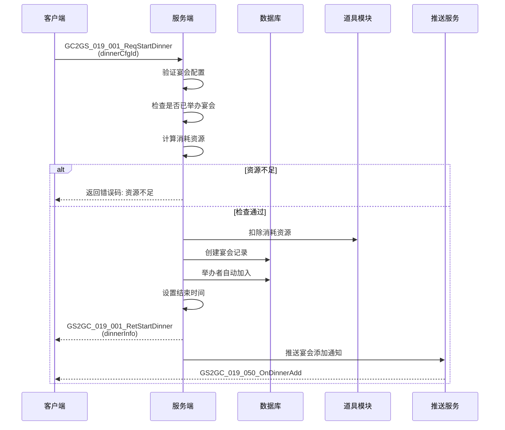

### 5.2 加入宴会完整流程

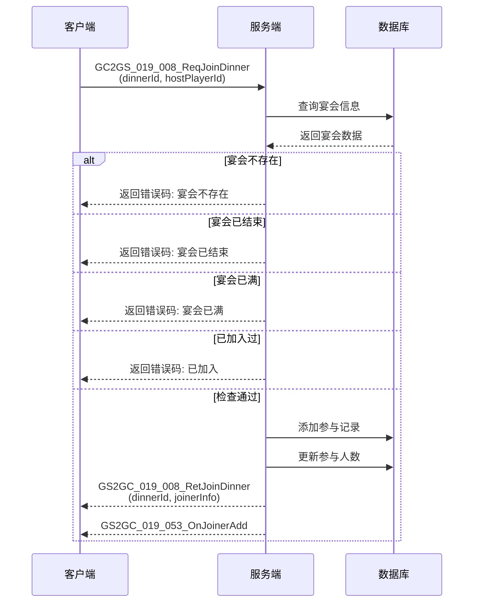

### 5.3 领取奖励流程

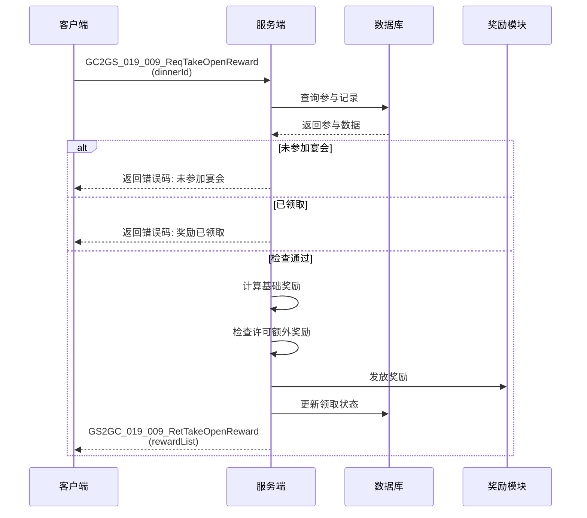

### 5.4 发送邀请流程

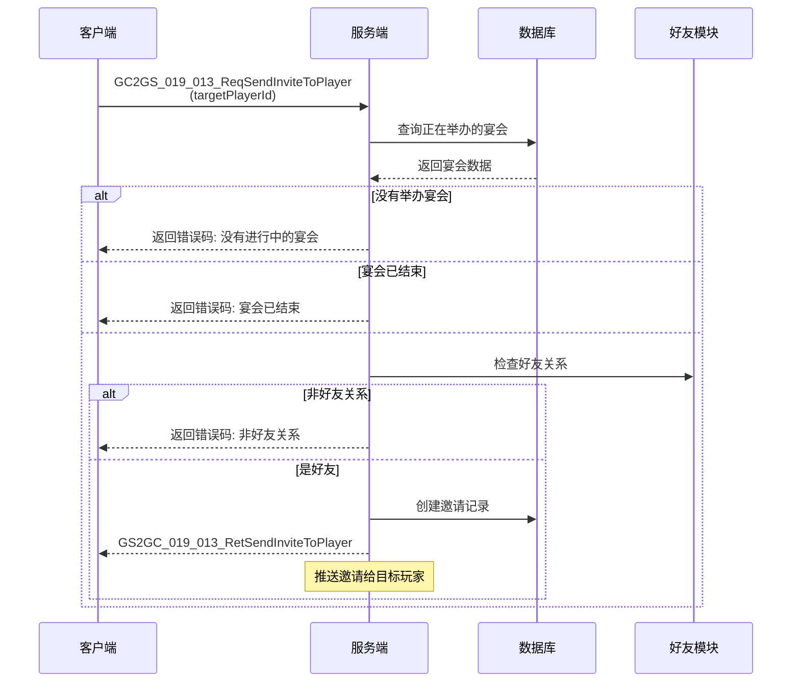

### 5.5 宴会结束定时检查流程

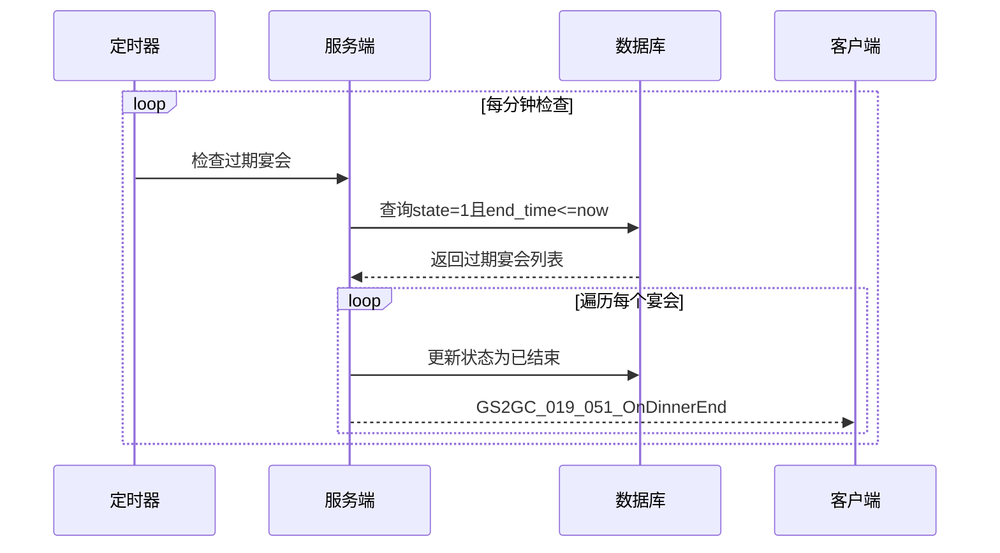

---

## 六、协议错误码

### 6.1 宴会模块错误码定义

| 错误码 | 常量名 | 说明 | 触发场景 | 用户提示 |
|--------|--------|------|----------|----------|
| 19001 | DINNER_CONFIG_NOT_FOUND | 宴会配置不存在 | 查询配置时 | "宴会类型不存在" |
| 19002 | DINNER_ALREADY_HOSTED | 已举办未结束的宴会 | 举办宴会时 | "您已举办了宴会，请等待结束" |
| 19003 | DINNER_NOT_FOUND | 宴会不存在 | 查询宴会时 | "该宴会不存在" |
| 19004 | DINNER_ENDED | 宴会已结束 | 加入宴会时 | "该宴会已结束" |
| 19005 | DINNER_FULL | 宴会已满 | 加入宴会时 | "该宴会人数已满" |
| 19006 | ALREADY_JOINED | 已加入该宴会 | 加入宴会时 | "您已参加该宴会" |
| 19007 | NOT_JOINED | 未参加该宴会 | 领取奖励时 | "您未参加该宴会" |
| 19008 | REWARD_TAKEN | 奖励已领取 | 领取奖励时 | "奖励已领取" |
| 19009 | PERMIT_NOT_FOUND | 许可不存在 | 使用许可时 | "许可不存在" |
| 19010 | PERMIT_USED | 许可已使用 | 使用许可时 | "该许可已使用" |
| 19011 | NOT_FRIEND | 非好友关系 | 发送邀请时 | "只能邀请好友" |
| 19012 | NO_HOSTING_DINNER | 没有举办的宴会 | 发送邀请时 | "您没有正在举办的宴会" |

### 6.2 错误码分类图

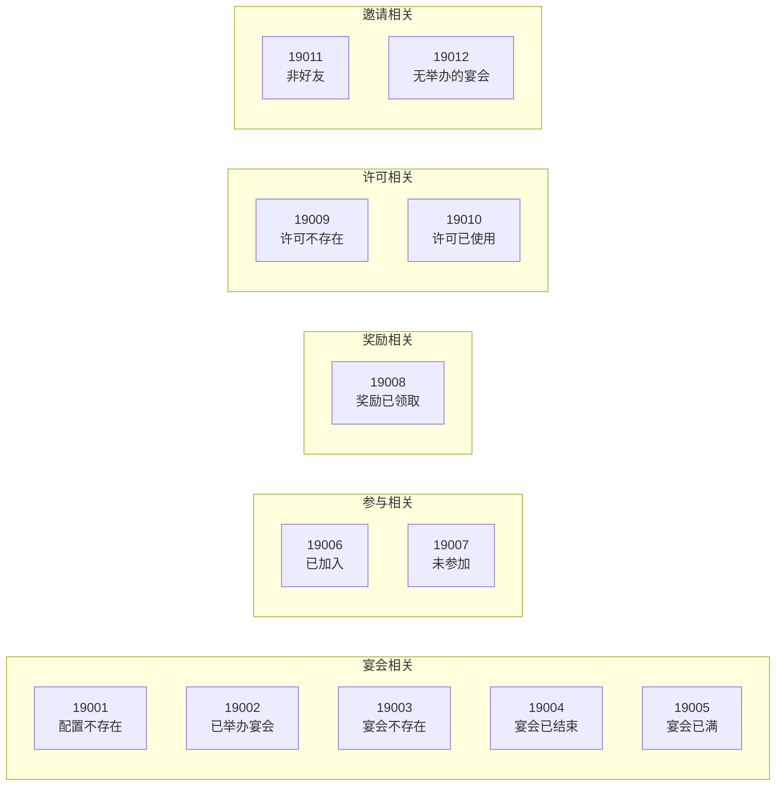

### 6.3 错误处理流程

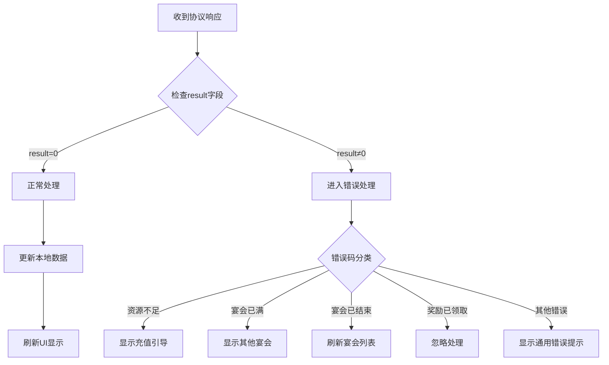

---

## 七、协议安全机制

### 7.1 请求频率限制

| 协议类型 | 频率限制 | 限制策略 | 超限处理 |
|----------|----------|----------|----------|
| 举办宴会 | 3次/秒 | 滑动窗口 | 返回"操作过于频繁" |
| 加入宴会 | 10次/秒 | 滑动窗口 | 返回"操作过于频繁" |
| 发送邀请 | 5次/秒 | 滑动窗口 | 返回"操作过于频繁" |
| 领取奖励 | 5次/秒 | 滑动窗口 | 返回"操作过于频繁" |

### 7.2 参数校验规则

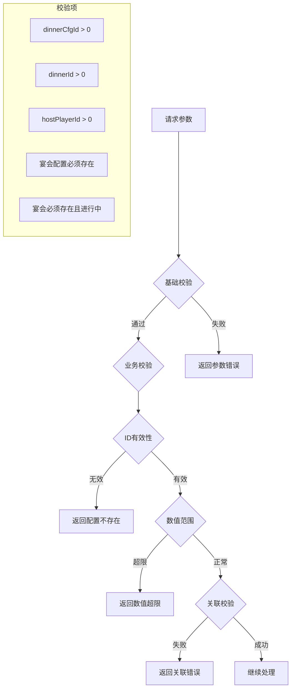

---

## 八、客户端协议封装

### 8.1 协议发送器

```csharp
// GSWriter_019_DinnerOp.cs - 协议发送封装
public static class GSWriter_019_DinnerOp
{
    /// <summary>
    /// 举办宴会
    /// </summary>
    public static GC2GS_019_001_ReqStartDinner make_001_ReqStartDinner(int dinnerCfgId)
    {
        GC2GS_019_001_ReqStartDinner req = new GC2GS_019_001_ReqStartDinner();
        req.setDinnerCfgId(dinnerCfgId);
        return req;
    }

    /// <summary>
    /// 使用许可举办宴会
    /// </summary>
    public static GC2GS_019_002_ReqStartDinnerByPermit make_002_ReqStartDinnerByPermit(
        int dinnerCfgId, int permitId)
    {
        GC2GS_019_002_ReqStartDinnerByPermit req = new GC2GS_019_002_ReqStartDinnerByPermit();
        req.setDinnerCfgId(dinnerCfgId);
        req.setPermitId(permitId);
        return req;
    }

    /// <summary>
    /// 加入宴会
    /// </summary>
    public static GC2GS_019_008_ReqJoinDinner make_008_ReqJoinDinner(
        long dinnerId, long hostPlayerId)
    {
        GC2GS_019_008_ReqJoinDinner req = new GC2GS_019_008_ReqJoinDinner();
        req.setDinnerId(dinnerId);
        req.setHostPlayerId(hostPlayerId);
        return req;
    }

    /// <summary>
    /// 领取奖励
    /// </summary>
    public static GC2GS_019_009_ReqTakeOpenReward make_009_ReqTakeOpenReward(long dinnerId)
    {
        GC2GS_019_009_ReqTakeOpenReward req = new GC2GS_019_009_ReqTakeOpenReward();
        req.setDinnerId(dinnerId);
        return req;
    }

    /// <summary>
    /// 发送邀请
    /// </summary>
    public static GC2GS_019_013_ReqSendInviteToPlayer make_013_ReqSendInviteToPlayer(
        long targetPlayerId)
    {
        GC2GS_019_013_ReqSendInviteToPlayer req = new GC2GS_019_013_ReqSendInviteToPlayer();
        req.setTargetPlayerId(targetPlayerId);
        return req;
    }
}
```

### 8.2 组件封装调用

```csharp
// NPPlayerDinnerComponent.cs - 组件层封装
public partial class NPPlayerDinnerComponent : _ANPBasicPlayerComponent
{
    /// <summary>
    /// 请求举办宴会
    /// </summary>
    public void reqStartDinner(int dinnerCfgId, Action _backAction = null)
    {
        NPGSClientListener.sendRequest(
            GSWriter_019_DinnerOp.make_001_ReqStartDinner(dinnerCfgId),
            new CommonErrCodeRequestCallbackProtocolDealer<GS2GC_019_001_RetStartDinner>((msg) =>
            {
                _backAction?.Invoke();
            }));
    }

    /// <summary>
    /// 请求使用许可举办宴会
    /// </summary>
    public void reqStartDinnerByPermit(int dinnerCfgId, int permitId, Action _backAction = null)
    {
        NPGSClientListener.sendRequest(
            GSWriter_019_DinnerOp.make_002_ReqStartDinnerByPermit(dinnerCfgId, permitId),
            new CommonErrCodeRequestCallbackProtocolDealer<GS2GC_019_002_RetStartDinnerByPermit>((msg) =>
            {
                _backAction?.Invoke();
            }));
    }

    /// <summary>
    /// 请求加入宴会
    /// </summary>
    public void reqJoinDinner(long dinnerId, long hostPlayerId, Action _backAction = null)
    {
        NPGSClientListener.sendRequest(
            GSWriter_019_DinnerOp.make_008_ReqJoinDinner(dinnerId, hostPlayerId),
            new CommonErrCodeRequestCallbackProtocolDealer<GS2GC_019_008_RetJoinDinner>((msg) =>
            {
                _backAction?.Invoke();
            }));
    }

    /// <summary>
    /// 请求领取奖励
    /// </summary>
    public void reqTakeOpenReward(long dinnerId, Action _backAction = null)
    {
        NPGSClientListener.sendRequest(
            GSWriter_019_DinnerOp.make_009_ReqTakeOpenReward(dinnerId),
            new CommonErrCodeRequestCallbackProtocolDealer<GS2GC_019_009_RetTakeOpenReward>((msg) =>
            {
                _backAction?.Invoke();
            }));
    }

    /// <summary>
    /// 请求发送邀请
    /// </summary>
    public void reqSendInviteToPlayer(long targetPlayerId, Action _backAction = null)
    {
        NPGSClientListener.sendRequest(
            GSWriter_019_DinnerOp.make_013_ReqSendInviteToPlayer(targetPlayerId),
            new CommonErrCodeRequestCallbackProtocolDealer<GS2GC_019_013_RetSendInviteToPlayer>((msg) =>
            {
                _backAction?.Invoke();
            }));
    }
}
```

### 8.3 监听器注册

```csharp
// 协议监听器注册
public void RegisterDinnerProtocolListeners()
{
    // 宴会添加推送
    NPGSClientListener.registSubDealer(
        new GSSubDealer_019_050_OnDinnerAdd());

    // 宴会结束推送
    NPGSClientListener.registSubDealer(
        new GSSubDealer_019_051_OnDinnerEnd());

    // 许可添加推送
    NPGSClientListener.registSubDealer(
        new GSSubDealer_019_052_OnPermitAdd());

    // 参与者添加推送
    NPGSClientListener.registSubDealer(
        new GSSubDealer_019_053_OnJoinerAdd());
}
```

---

## 九、协议监控与日志

### 9.1 协议监控指标

| 指标名称 | 计算方式 | 告警阈值 | 说明 |
|----------|----------|----------|------|
| 举办成功率 | 成功数/总请求数 | <90% | 核心业务指标 |
| 加入成功率 | 成功数/总请求数 | <85% | 核心业务指标 |
| 平均响应时间 | 总耗时/请求数 | >200ms | 性能指标 |
| P99响应时间 | 第99百分位耗时 | >500ms | 极端情况监控 |
| 错误率 | 错误数/总请求数 | >5% | 稳定性指标 |

### 9.2 协议日志格式

```json
{
  "timestamp": "2026-04-12T10:30:00.000Z",
  "protocol": "GC2GS_019_008_ReqJoinDinner",
  "mainOrder": 19,
  "subOrder": 8,
  "cid": 12345678,
  "request": {
    "dinnerId": 50001,
    "hostPlayerId": 20001
  },
  "response": {
    "result": 0,
    "dinnerId": 50001
  },
  "duration": 45,
  "serverIp": "192.168.1.100"
}
```

---

## 十、协议版本兼容

### 10.1 版本兼容策略

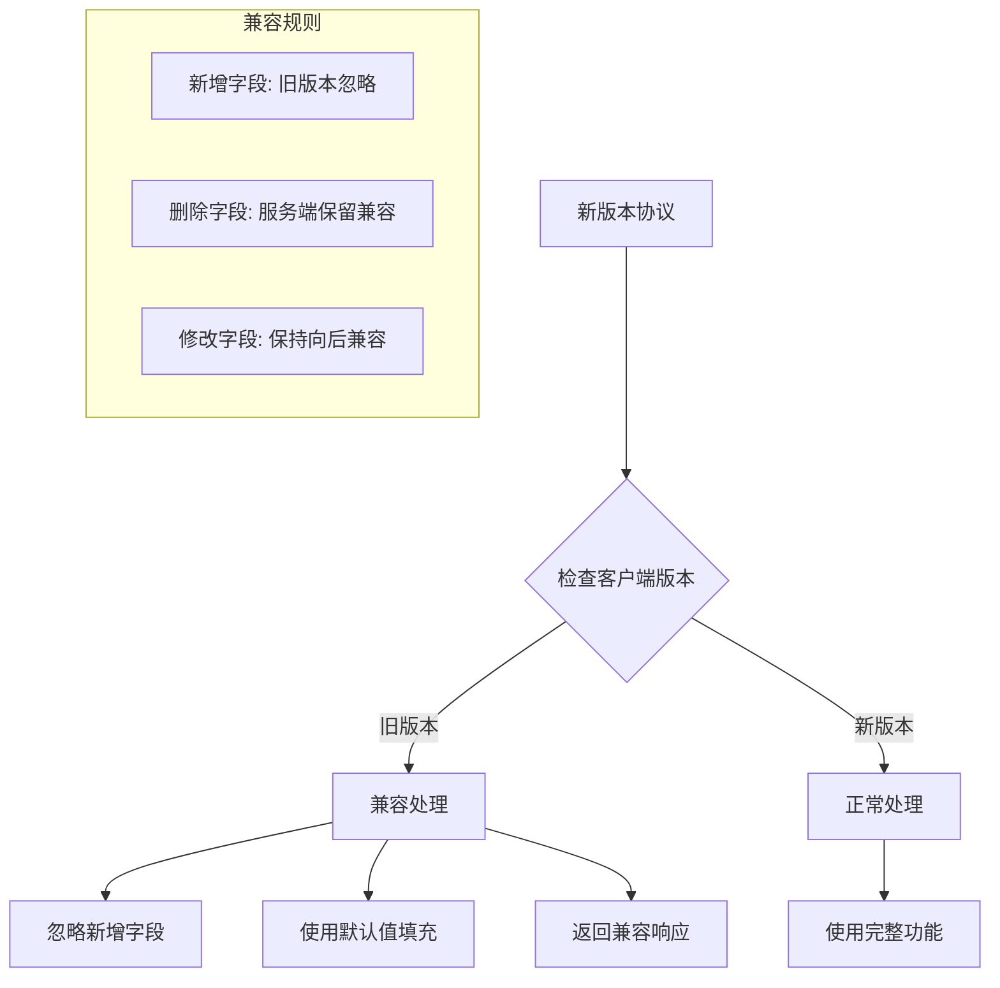

### 10.2 协议升级指南

| 升级类型 | 兼容性 | 处理方式 |
|----------|--------|----------|
| 新增字段 | 向后兼容 | 旧版本忽略，新版本使用 |
| 新增协议 | 向后兼容 | 旧版本不调用，新版本使用 |
| 删除字段 | 不兼容 | 需要强制更新 |
| 修改字段类型 | 不兼容 | 需要强制更新 |

---

*文档生成时间: 2026-04-12*
*文档版本: v2.1*
