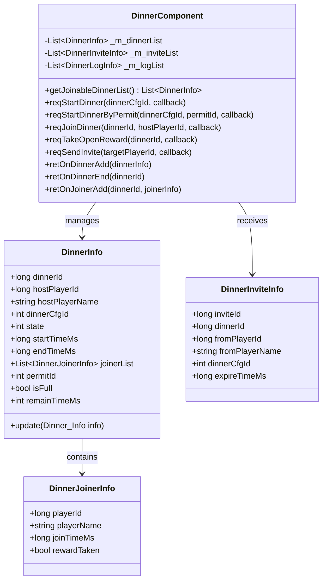
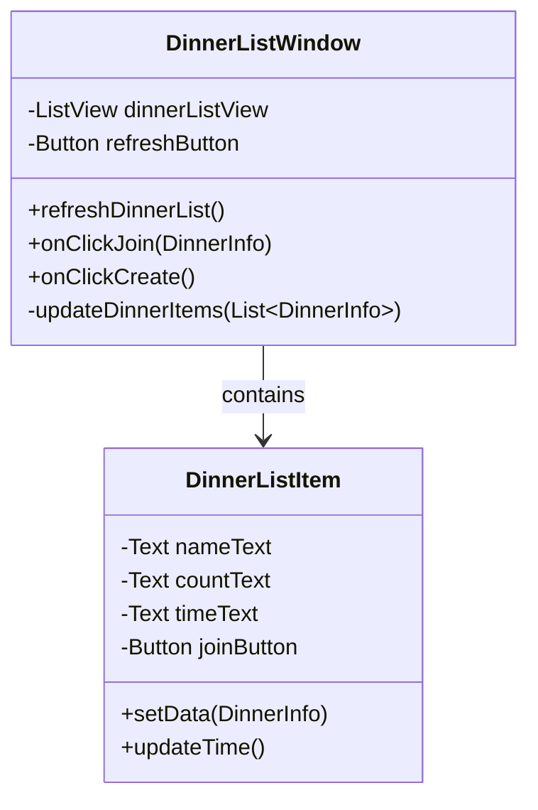
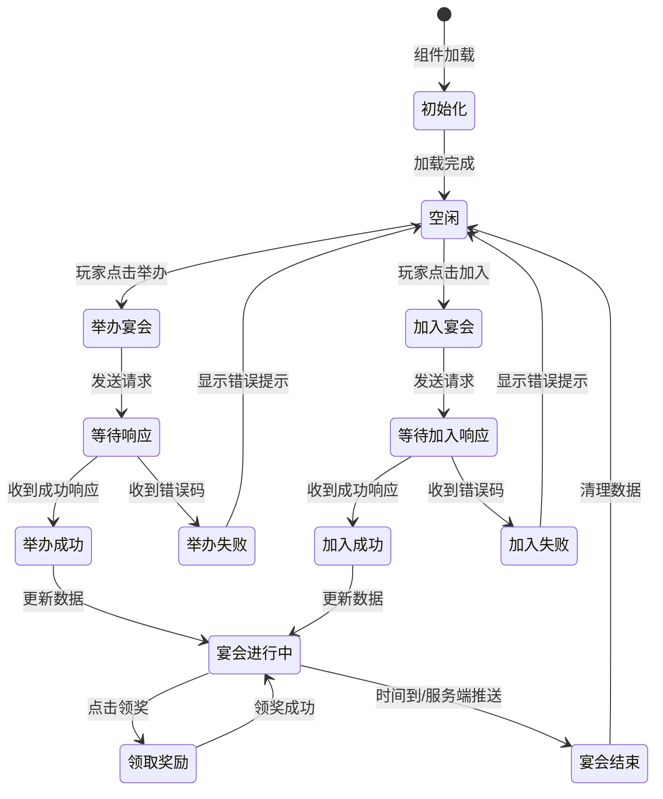

# 宴会系统 - 客户端开发

**模块名称**: DinnerOp (宴会操作)
**模块编号**: p019
**文档版本**: 2.0
**更新日期**: 2026-04-12

---

## 一、组件架构

### 1.1 组件结构图

```
GameComponent/Dinner/
├── DinnerComponent.cs           # 宴会组件（主组件）
├── DinnerInfo.cs                # 宴会信息数据类
├── DinnerJoinerInfo.cs          # 参与者信息数据类
├── DinnerInviteInfo.cs          # 邀请信息数据类
├── DinnerLogInfo.cs             # 宴会日志数据类
└── DinnerConfig.cs              # 宴会配置数据类
```

### 1.2 组件类图



---

## 二、数据管理

### 2.1 DinnerComponent 核心实现

```csharp
public class DinnerComponent : _ANPBasicPlayerComponent
{
    // 当前宴会列表
    private List<DinnerInfo> _m_dinnerList = new List<DinnerInfo>();

    // 收到的邀请列表
    private List<DinnerInviteInfo> _m_inviteList = new List<DinnerInviteInfo>();

    // 宴会举办记录
    private List<DinnerLogInfo> _m_logList = new List<DinnerLogInfo>();

    // 红点处理器
    private DinnerRedDotDealer _m_redDealer;

    /// <summary>
    /// 获取可参加的宴会列表
    /// </summary>
    public List<DinnerInfo> getJoinableDinnerList()
    {
        return _m_dinnerList.FindAll(d =>
            d.state == EDinnerState.ONGOING &&
            !d.isFull &&
            !hasJoined(d.dinnerId));
    }

    /// <summary>
    /// 获取正在举办的宴会（自己举办的）
    /// </summary>
    public DinnerInfo getHostingDinner()
    {
        return _m_dinnerList.Find(d =>
            d.hostPlayerId == NPPlayer.instance.cid &&
            d.state == EDinnerState.ONGOING);
    }

    /// <summary>
    /// 检查是否已加入宴会
    /// </summary>
    public bool hasJoined(long dinnerId)
    {
        DinnerInfo dinner = _m_dinnerList.Find(d => d.dinnerId == dinnerId);
        if (dinner == null) return false;

        long myCid = NPPlayer.instance.cid;
        return dinner.joinerList.Exists(j => j.playerId == myCid);
    }

    /// <summary>
    /// 获取已参加的宴会
    /// </summary>
    public List<DinnerInfo> getJoinedDinnerList()
    {
        return _m_dinnerList.FindAll(d => hasJoined(d.dinnerId));
    }

    /// <summary>
    /// 请求举办宴会
    /// </summary>
    public void reqStartDinner(int dinnerCfgId, Action callback)
    {
        NPGSClientListener.sendRequest(
            NPGSWriter_019_DinnerOp.make_001_ReqStartDinner(dinnerCfgId),
            new CommonErrCodeRequestCallbackProtocolDealer<GS2GC_019_001_RetStartDinner>((msg) =>
            {
                callback?.Invoke();
            }));
    }

    /// <summary>
    /// 请求使用许可举办宴会
    /// </summary>
    public void reqStartDinnerByPermit(int dinnerCfgId, int permitId, Action callback)
    {
        NPGSClientListener.sendRequest(
            NPGSWriter_019_DinnerOp.make_002_ReqStartDinnerByPermit(dinnerCfgId, permitId),
            new CommonErrCodeRequestCallbackProtocolDealer<GS2GC_019_002_RetStartDinnerByPermit>((msg) =>
            {
                callback?.Invoke();
            }));
    }

    /// <summary>
    /// 请求加入宴会
    /// </summary>
    public void reqJoinDinner(long dinnerId, long hostPlayerId, Action callback)
    {
        NPGSClientListener.sendRequest(
            NPGSWriter_019_DinnerOp.make_008_ReqJoinDinner(dinnerId, hostPlayerId),
            new CommonErrCodeRequestCallbackProtocolDealer<GS2GC_019_008_RetJoinDinner>((msg) =>
            {
                callback?.Invoke();
            }));
    }

    /// <summary>
    /// 请求领取开启奖励
    /// </summary>
    public void reqTakeOpenReward(long dinnerId, Action callback)
    {
        NPGSClientListener.sendRequest(
            NPGSWriter_019_DinnerOp.make_009_ReqTakeOpenReward(dinnerId),
            new CommonErrCodeRequestCallbackProtocolDealer<GS2GC_019_009_RetTakeOpenReward>((msg) =>
            {
                callback?.Invoke();
            }));
    }

    /// <summary>
    /// 请求发送邀请
    /// </summary>
    public void reqSendInvite(long targetPlayerId, Action callback)
    {
        NPGSClientListener.sendRequest(
            NPGSWriter_019_DinnerOp.make_013_ReqSendInviteToPlayer(targetPlayerId),
            new CommonErrCodeRequestCallbackProtocolDealer<GS2GC_019_013_RetSendInviteToPlayer>((msg) =>
            {
                callback?.Invoke();
            }));
    }

    /// <summary>
    /// 检查宴会邀请
    /// </summary>
    public void reqCheckDinnerInvite(Action callback)
    {
        NPGSClientListener.sendRequest(
            NPGSWriter_019_DinnerOp.make_014_ReqCheckDinnerInvite(),
            new CommonErrCodeRequestCallbackProtocolDealer<GS2GC_019_014_RetCheckDinnerInvite>((msg) =>
            {
                callback?.Invoke();
            }));
    }
}
```

### 2.2 DinnerInfo 数据类

```csharp
public class DinnerInfo
{
    public long dinnerId;
    public long hostPlayerId;
    public string hostPlayerName;
    public int dinnerCfgId;
    public int state;
    public long startTimeMs;
    public long endTimeMs;
    public List<DinnerJoinerInfo> joinerList = new List<DinnerJoinerInfo>();
    public int permitId;

    /// <summary>
    /// 是否已满
    /// </summary>
    public bool isFull
    {
        get
        {
            DinnerConfig config = GRefdataCoreMgr.instance.dinnerMap.getRef(dinnerCfgId);
            if (config == null) return true;
            return joinerList.Count >= config.max_joiner;
        }
    }

    /// <summary>
    /// 剩余时间（毫秒）
    /// </summary>
    public int remainTimeMs
    {
        get
        {
            long serverTime = FpsAndPingMgr.instance.serverTimeTag;
            long remain = endTimeMs - serverTime;
            return remain > 0 ? (int)remain : 0;
        }
    }

    /// <summary>
    /// 是否可以领取奖励
    /// </summary>
    public bool canTakeReward
    {
        get
        {
            long myCid = NPPlayer.instance.cid;
            DinnerJoinerInfo joiner = joinerList.Find(j => j.playerId == myCid);
            return joiner != null && !joiner.rewardTaken;
        }
    }

    /// <summary>
    /// 更新数据
    /// </summary>
    public void update(Dinner_Info info)
    {
        dinnerId = info.getDinnerId();
        hostPlayerId = info.getHostPlayerId();
        hostPlayerName = info.getHostPlayerName();
        dinnerCfgId = info.getDinnerCfgId();
        state = info.getState();
        startTimeMs = info.getStartTimeMs();
        endTimeMs = info.getEndTimeMs();
        permitId = info.getPermitId();

        joinerList.Clear();
        List<DinnerJoinerInfo> list = info.getJoinerList();
        if (list != null)
        {
            foreach (var j in list)
            {
                joinerList.Add(new DinnerJoinerInfo(j));
            }
        }
    }
}
```

---

## 三、UI 窗口实现

### 3.1 宴会列表界面



```csharp
public class DinnerListWindow : BaseWindow
{
    [SerializeField] private ListView dinnerListView;
    [SerializeField] private Button refreshButton;
    [SerializeField] private Button createButton;

    protected override void OnOpen()
    {
        base.OnOpen();
        refreshButton.onClick.AddListener(OnRefreshClick);
        createButton.onClick.AddListener(OnCreateClick);

        // 注册消息监听
        WinMsg.RegisterMsg(WinMsgType.ON_DINNER_ADD, OnDinnerAdd);
        WinMsg.RegisterMsg(WinMsgType.ON_DINNER_END, OnDinnerEnd);

        // 刷新列表
        refreshDinnerList();
    }

    protected override void OnClose()
    {
        WinMsg.UnregisterMsg(WinMsgType.ON_DINNER_ADD, OnDinnerAdd);
        WinMsg.UnregisterMsg(WinMsgType.ON_DINNER_END, OnDinnerEnd);
        base.OnClose();
    }

    /// <summary>
    /// 刷新宴会列表
    /// </summary>
    public void refreshDinnerList()
    {
        var dinnerList = DinnerComponent.instance.getJoinableDinnerList();
        updateDinnerItems(dinnerList);
    }

    /// <summary>
    /// 更新宴会列表项
    /// </summary>
    private void updateDinnerItems(List<DinnerInfo> dinnerList)
    {
        dinnerListView.Clear();

        foreach (var dinner in dinnerList)
        {
            var item = dinnerListView.AddItem<DinnerListItem>();
            item.setData(dinner);
            item.onJoinClick = () => onClickJoin(dinner);
        }
    }

    /// <summary>
    /// 点击加入宴会
    /// </summary>
    public void onClickJoin(DinnerInfo dinnerInfo)
    {
        DinnerComponent.instance.reqJoinDinner(dinnerInfo.dinnerId, dinnerInfo.hostPlayerId, () =>
        {
            // 加入成功，进入宴会场景或显示详情
            UIManager.OpenWindow<DinnerDetailWindow>(dinnerInfo);
        });
    }

    /// <summary>
    /// 点击举办宴会
    /// </summary>
    private void OnCreateClick()
    {
        UIManager.OpenWindow<DinnerCreateWindow>();
    }

    /// <summary>
    /// 点击刷新
    /// </summary>
    private void OnRefreshClick()
    {
        refreshDinnerList();
    }

    /// <summary>
    /// 宴会添加消息处理
    /// </summary>
    private void OnDinnerAdd(object data)
    {
        refreshDinnerList();
    }

    /// <summary>
    /// 宴会结束消息处理
    /// </summary>
    private void OnDinnerEnd(object data)
    {
        refreshDinnerList();
    }
}
```

### 3.2 宴会举办界面

```csharp
public class DinnerCreateWindow : BaseWindow
{
    [SerializeField] private List<Toggle> typeToggles;
    [SerializeField] private Text costText;
    [SerializeField] private Text rewardText;
    [SerializeField] private Button createButton;
    [SerializeField] private Button createWithPermitButton;

    private int _selectedDinnerCfgId;

    protected override void OnOpen()
    {
        base.OnOpen();

        for (int i = 0; i < typeToggles.Count; i++)
        {
            int index = i;
            typeToggles[i].onValueChanged.AddListener((isOn) =>
            {
                if (isOn) onSelectDinnerType(index + 1);
            });
        }

        createButton.onClick.AddListener(OnClickCreate);
        createWithPermitButton.onClick.AddListener(OnClickCreateWithPermit);

        // 默认选择第一个
        onSelectDinnerType(1);
    }

    /// <summary>
    /// 选择宴会类型
    /// </summary>
    private void onSelectDinnerType(int dinnerCfgId)
    {
        _selectedDinnerCfgId = dinnerCfgId;
        refreshPreview();
    }

    /// <summary>
    /// 刷新预览
    /// </summary>
    private void refreshPreview()
    {
        DinnerConfig config = GRefdataCoreMgr.instance.dinnerMap.getRef(_selectedDinnerCfgId);
        if (config == null) return;

        // 显示消耗
        costText.text = FormatCostList(config.cost_list);

        // 显示奖励
        rewardText.text = FormatRewardList(config.reward_list);

        // 检查是否可以使用许可
        int permitCount = GetAvailablePermitCount(_selectedDinnerCfgId);
        createWithPermitButton.gameObject.SetActive(permitCount > 0);
    }

    /// <summary>
    /// 点击举办
    /// </summary>
    private void OnClickCreate()
    {
        DinnerComponent.instance.reqStartDinner(_selectedDinnerCfgId, () =>
        {
            closeWindow();
            // 显示举办成功提示
            UIMessageBox.Show("宴会举办成功！");
        });
    }

    /// <summary>
    /// 使用许可举办
    /// </summary>
    private void OnClickCreateWithPermit()
    {
        int permitId = GetBestPermitId(_selectedDinnerCfgId);
        if (permitId <= 0) return;

        DinnerComponent.instance.reqStartDinnerByPermit(_selectedDinnerCfgId, permitId, () =>
        {
            closeWindow();
            UIMessageBox.Show("宴会举办成功！使用许可获得额外奖励！");
        });
    }

    /// <summary>
    /// 获取最佳许可ID
    /// </summary>
    private int GetBestPermitId(int dinnerCfgId)
    {
        // 根据许可减免比例排序，选择最优
        // 实际实现需要查询玩家拥有的许可
        return 1;
    }
}
```

### 3.3 宴会详情界面

```csharp
public class DinnerDetailWindow : BaseWindow
{
    [SerializeField] private Text hostNameText;
    [SerializeField] private Text stateText;
    [SerializeField] private Text timeText;
    [SerializeField] private Text countText;
    [SerializeField] private ListView joinerListView;
    [SerializeField] private Button takeRewardButton;
    [SerializeField] private Button inviteButton;

    private DinnerInfo _dinnerInfo;

    public void setData(DinnerInfo dinnerInfo)
    {
        _dinnerInfo = dinnerInfo;
        refreshUI();
    }

    protected override void OnOpen()
    {
        base.OnOpen();
        takeRewardButton.onClick.AddListener(OnClickTakeReward);
        inviteButton.onClick.AddListener(OnClickInvite);

        WinMsg.RegisterMsg(WinMsgType.ON_DINNER_JOINER_ADD, OnJoinerAdd);
    }

    protected override void OnClose()
    {
        WinMsg.UnregisterMsg(WinMsgType.ON_DINNER_JOINER_ADD, OnJoinerAdd);
        base.OnClose();
    }

    private void refreshUI()
    {
        if (_dinnerInfo == null) return;

        hostNameText.text = _dinnerInfo.hostPlayerName;
        stateText.text = GetStateText(_dinnerInfo.state);

        // 显示剩余时间
        UpdateTimeDisplay();

        // 显示参与人数
        DinnerConfig config = GRefdataCoreMgr.instance.dinnerMap.getRef(_dinnerInfo.dinnerCfgId);
        if (config != null)
        {
            countText.text = $"{_dinnerInfo.joinerList.Count}/{config.max_joiner}";
        }

        // 更新参与者列表
        updateJoinerList();

        // 更新领奖按钮状态
        takeRewardButton.gameObject.SetActive(_dinnerInfo.canTakeReward);

        // 更新邀请按钮状态（只有举办者可以邀请）
        long myCid = NPPlayer.instance.cid;
        inviteButton.gameObject.SetActive(_dinnerInfo.hostPlayerId == myCid);
    }

    private void updateJoinerList()
    {
        joinerListView.Clear();
        foreach (var joiner in _dinnerInfo.joinerList)
        {
            var item = joinerListView.AddItem<DinnerJoinerItem>();
            item.setData(joiner);
        }
    }

    private void UpdateTimeDisplay()
    {
        int remainMs = _dinnerInfo.remainTimeMs;
        if (remainMs > 0)
        {
            int minutes = remainMs / 60000;
            int seconds = (remainMs % 60000) / 1000;
            timeText.text = $"剩余时间: {minutes:D2}:{seconds:D2}";
        }
        else
        {
            timeText.text = "已结束";
        }
    }

    /// <summary>
    /// 领取奖励
    /// </summary>
    public void onClickTakeReward()
    {
        DinnerComponent.instance.reqTakeOpenReward(_dinnerInfo.dinnerId, () =>
        {
            refreshUI();
            showRewardEffect();
        });
    }

    /// <summary>
    /// 邀请玩家
    /// </summary>
    public void onClickInvite()
    {
        // 打开好友选择界面
        UIManager.openWindow<FriendSelectWindow>((win) =>
        {
            win.setOnSelectCallback((playerId) =>
            {
                DinnerComponent.instance.reqSendInvite(playerId, () =>
                {
                    UIMessageBox.Show("邀请发送成功！");
                });
            });
        });
    }

    private void OnJoinerAdd(object data)
    {
        // 刷新参与者列表
        refreshUI();
    }

    private void showRewardEffect()
    {
        // 播放奖励特效
        AudioManager.PlaySound("reward");
    }
}
```

---

## 四、协议对接

### 4.1 监听器实现

```csharp
// 接收宴会添加
public class GSSubDealer_019_050_OnDinnerAdd : _AGSSubDealerBase
{
    public override void deal(NPPlayer _player, GS2GC_019_050_OnDinnerAdd _msg)
    {
        Dinner_Info dinnerInfo = _msg.getDinnerInfo();
        _player.dinnerComp.retOnDinnerAdd(dinnerInfo);
    }
}

// 接收宴会结束
public class GSSubDealer_019_051_OnDinnerEnd : _AGSSubDealerBase
{
    public override void deal(NPPlayer _player, GS2GC_019_051_OnDinnerEnd _msg)
    {
        long dinnerId = _msg.getDinnerId();
        _player.dinnerComp.retOnDinnerEnd(dinnerId);
    }
}

// 接收许可添加
public class GSSubDealer_019_052_OnPermitAdd : _AGSSubDealerBase
{
    public override void deal(NPPlayer _player, GS2GC_019_052_OnPermitAdd _msg)
    {
        int permitId = _msg.getPermitId();
        int count = _msg.getCount();
        _player.dinnerComp.retOnPermitAdd(permitId, count);
    }
}

// 接收参与者添加
public class GSSubDealer_019_053_OnJoinerAdd : _AGSSubDealerBase
{
    public override void deal(NPPlayer _player, GS2GC_019_053_OnJoinerAdd _msg)
    {
        long dinnerId = _msg.getDinnerId();
        DinnerJoinerInfo joinerInfo = _msg.getJoinerInfo();
        _player.dinnerComp.retOnJoinerAdd(dinnerId, joinerInfo);
    }
}
```

### 4.2 组件回调实现

```csharp
public partial class NPPlayerDinnerComponent
{
    /// <summary>
    /// 宴会添加回调
    /// </summary>
    public void retOnDinnerAdd(Dinner_Info _info)
    {
        if (null == _info) return;

        DinnerInfo dinnerInfo = new DinnerInfo(_info);

        // 检查是否已存在，更新或添加
        int index = _m_dinnerList.FindIndex(d => d.dinnerId == dinnerInfo.dinnerId);
        if (index >= 0)
        {
            _m_dinnerList[index] = dinnerInfo;
        }
        else
        {
            _m_dinnerList.Add(dinnerInfo);
        }

        // 发送消息通知UI
        WinMsg.SendMsg(WinMsgType.ON_DINNER_ADD, dinnerInfo);

        // 更新红点
        _m_redDealer?.refreshRedTip();
    }

    /// <summary>
    /// 宴会结束回调
    /// </summary>
    public void retOnDinnerEnd(long _dinnerId)
    {
        DinnerInfo dinner = _m_dinnerList.Find(d => d.dinnerId == _dinnerId);
        if (dinner != null)
        {
            dinner.state = EDinnerState.ENDED;
        }

        // 发送消息通知UI
        WinMsg.SendMsg(WinMsgType.ON_DINNER_END, _dinnerId);

        // 更新红点
        _m_redDealer?.refreshRedTip();
    }

    /// <summary>
    /// 许可添加回调
    /// </summary>
    public void retOnPermitAdd(int _permitId, int _count)
    {
        WinMsg.SendMsg(WinMsgType.ON_PERMIT_ADD, _permitId, _count);
    }

    /// <summary>
    /// 参与者添加回调
    /// </summary>
    public void retOnJoinerAdd(long _dinnerId, DinnerJoinerInfo _joiner)
    {
        DinnerInfo dinner = _m_dinnerList.Find(d => d.dinnerId == _dinnerId);
        if (dinner != null && _joiner != null)
        {
            dinner.joinerList.Add(_joiner);

            WinMsg.SendMsg(WinMsgType.ON_DINNER_JOINER_ADD, _dinnerId, _joiner);
        }
    }
}
```

---

## 五、红点系统

### 5.1 红点类型定义

| 红点类型 | 触发条件 | 说明 |
|----------|----------|------|
| DINNER_NEW | 有新的可参加宴会 | 红点提示 |
| DINNER_INVITE | 有未处理的邀请 | 邀请红点 |
| DINNER_REWARD | 有可领取的奖励 | 奖励红点 |

### 5.2 红点处理器

```csharp
public class DinnerRedDotDealer
{
    public void refreshRedTip()
    {
        // 检查新宴会
        bool hasNewDinner = CheckNewDinner();
        RedDotManager.SetRedDot(RedDotType.DINNER_NEW, hasNewDinner);

        // 检查邀请
        bool hasInvite = CheckInvite();
        RedDotManager.SetRedDot(RedDotType.DINNER_INVITE, hasInvite);

        // 检查奖励
        bool hasReward = CheckReward();
        RedDotManager.SetRedDot(RedDotType.DINNER_REWARD, hasReward);
    }

    private bool CheckNewDinner()
    {
        var list = DinnerComponent.instance.getJoinableDinnerList();
        return list.Count > 0;
    }

    private bool CheckInvite()
    {
        var inviteList = DinnerComponent.instance.getInviteList();
        return inviteList.Exists(i => !i.isExpired);
    }

    private bool CheckReward()
    {
        var dinnerList = DinnerComponent.instance.getDinnerList();
        return dinnerList.Exists(d => d.canTakeReward);
    }
}
```

---

## 六、事件流程图

### 6.1 宴会完整生命周期



---

## 七、注意事项

1. **宴会人数限制**：满了不能加入，需要提前检查 `isFull` 属性
2. **宴会时间限制**：超时自动结束，客户端需要显示倒计时
3. **许可使用**：使用许可可获得额外奖励和消耗减免
4. **邀请限制**：只能邀请好友，且宴会必须正在进行
5. **奖励领取**：宴会结束后仍可领取奖励，但必须先参加过宴会
6. **状态同步**：通过推送协议保持客户端和服务端状态一致
7. **离线处理**：玩家离线后重登需要重新获取宴会列表

---

*文档生成时间: 2026-04-12*
*文档版本: v2.1*
