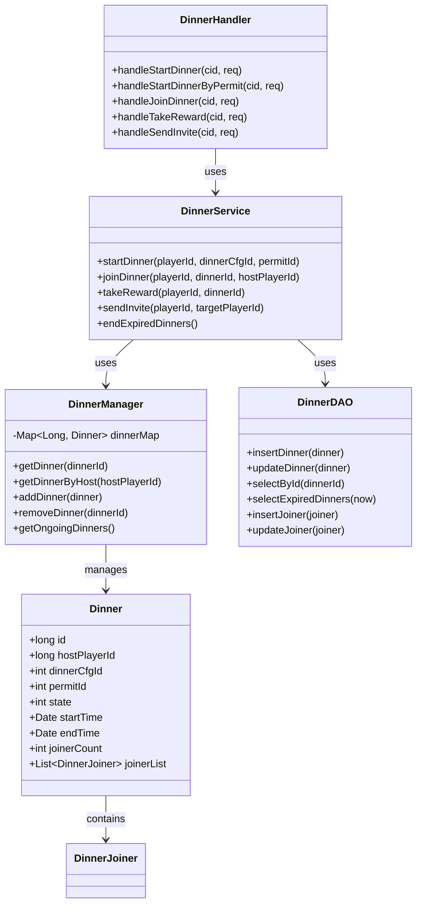

# 宴会系统 - 服务端开发

**模块名称**: DinnerOp (宴会操作)
**模块编号**: p019
**文档版本**: 2.0
**更新日期**: 2026-04-12

---

## 一、模块架构

### 1.1 目录结构

```
GameServer/
├── DinnerModule/
│   ├── DinnerHandler.java           # 协议处理器
│   ├── DinnerService.java           # 业务逻辑服务
│   ├── DinnerManager.java           # 宴会管理器
│   ├── DinnerDAO.java               # 数据访问层
│   └── DinnerConfig.java            # 配置管理
├── DinnerObj/
│   ├── Dinner.java                  # 宴会实体
│   ├── DinnerJoiner.java            # 参与者实体
│   └── DinnerInvite.java            # 邀请实体
```

### 1.2 模块类图



---

## 二、数据存储

### 2.1 宴会数据表 (dinner)

```sql
CREATE TABLE IF NOT EXISTS `dinner` (
    `id` bigint(20) NOT NULL AUTO_INCREMENT COMMENT '宴会ID',
    `host_player_id` bigint(20) NOT NULL DEFAULT '0' COMMENT '举办者ID',
    `dinner_cfg_id` int(11) NOT NULL DEFAULT '0' COMMENT '宴会配置ID',
    `permit_id` int(11) NOT NULL DEFAULT '0' COMMENT '许可ID',
    `state` int(11) NOT NULL DEFAULT '1' COMMENT '状态(0准备,1进行,2结束)',
    `start_time` datetime NOT NULL COMMENT '开始时间',
    `end_time` datetime NOT NULL COMMENT '结束时间',
    `joiner_count` int(11) NOT NULL DEFAULT '0' COMMENT '参与人数',
    `create_time` datetime DEFAULT CURRENT_TIMESTAMP COMMENT '创建时间',
    `update_time` datetime DEFAULT CURRENT_TIMESTAMP ON UPDATE CURRENT_TIMESTAMP COMMENT '更新时间',
    PRIMARY KEY (`id`),
    KEY `idx_host_player_id` (`host_player_id`),
    KEY `idx_state` (`state`),
    KEY `idx_end_time` (`end_time`),
    KEY `idx_state_end_time` (`state`, `end_time`)
) COMMENT='宴会数据表' engine=InnoDB DEFAULT CHARSET=utf8mb4;
```

### 2.2 宴会参与者表 (dinner_joiner)

```sql
CREATE TABLE IF NOT EXISTS `dinner_joiner` (
    `id` bigint(20) NOT NULL AUTO_INCREMENT COMMENT '主键',
    `dinner_id` bigint(20) NOT NULL DEFAULT '0' COMMENT '宴会ID',
    `player_id` bigint(20) NOT NULL DEFAULT '0' COMMENT '玩家ID',
    `player_name` varchar(64) NOT NULL DEFAULT '' COMMENT '玩家名称',
    `join_time` datetime NOT NULL COMMENT '加入时间',
    `reward_taken` tinyint(1) NOT NULL DEFAULT '0' COMMENT '是否已领奖',
    `create_time` datetime DEFAULT CURRENT_TIMESTAMP COMMENT '创建时间',
    PRIMARY KEY (`id`),
    UNIQUE KEY `uk_dinner_player` (`dinner_id`, `player_id`),
    KEY `idx_player_id` (`player_id`),
    KEY `idx_dinner_id` (`dinner_id`)
) COMMENT='宴会参与者表' engine=InnoDB DEFAULT CHARSET=utf8mb4;
```

### 2.3 宴会邀请表 (dinner_invite)

```sql
CREATE TABLE IF NOT EXISTS `dinner_invite` (
    `id` bigint(20) NOT NULL AUTO_INCREMENT COMMENT '邀请ID',
    `dinner_id` bigint(20) NOT NULL DEFAULT '0' COMMENT '宴会ID',
    `from_player_id` bigint(20) NOT NULL DEFAULT '0' COMMENT '邀请者ID',
    `to_player_id` bigint(20) NOT NULL DEFAULT '0' COMMENT '被邀请者ID',
    `state` int(11) NOT NULL DEFAULT '0' COMMENT '状态(0待处理,1已接受,2已拒绝,3已过期)',
    `expire_time` datetime NOT NULL COMMENT '过期时间',
    `create_time` datetime DEFAULT CURRENT_TIMESTAMP COMMENT '创建时间',
    PRIMARY KEY (`id`),
    KEY `idx_to_player_id` (`to_player_id`),
    KEY `idx_dinner_id` (`dinner_id`),
    KEY `idx_expire_time` (`expire_time`)
) COMMENT='宴会邀请表' engine=InnoDB DEFAULT CHARSET=utf8mb4;
```

### 2.4 宴会日志表 (dinner_log)

```sql
CREATE TABLE IF NOT EXISTS `dinner_log` (
    `id` bigint(20) NOT NULL AUTO_INCREMENT COMMENT '主键',
    `cid` bigint(20) NOT NULL DEFAULT '0' COMMENT '玩家CID',
    `dinner_id` bigint(20) NOT NULL DEFAULT '0' COMMENT '宴会ID',
    `dinner_cfg_id` int(11) NOT NULL DEFAULT '0' COMMENT '宴会配置ID',
    `action` int(11) NOT NULL DEFAULT '0' COMMENT '操作类型(1举办,2加入,3领奖)',
    `reward_data` text COMMENT '奖励数据(JSON)',
    `create_time` datetime DEFAULT CURRENT_TIMESTAMP COMMENT '创建时间',
    PRIMARY KEY (`id`),
    KEY `idx_cid` (`cid`),
    KEY `idx_dinner_id` (`dinner_id`),
    KEY `idx_create_time` (`create_time`)
) COMMENT='宴会日志表' engine=InnoDB DEFAULT CHARSET=utf8mb4;
```

---

## 三、核心逻辑实现

### 3.1 举办宴会

```java
/**
 * 举办宴会
 */
public long startDinner(long playerId, int dinnerCfgId, Integer permitId) {
    // 1. 获取宴会配置
    DinnerConfig config = dinnerConfigDao.getById(dinnerCfgId);
    if (config == null) {
        throw new BusinessException(ErrorCode.DINNER_CONFIG_NOT_FOUND);
    }

    // 2. 检查是否已举办
    Dinner existingDinner = dinnerDao.selectOngoingByHost(playerId);
    if (existingDinner != null) {
        throw new BusinessException(ErrorCode.DINNER_ALREADY_HOSTED);
    }

    // 3. 检查解锁条件
    if (!checkUnlockCondition(playerId, config)) {
        throw new BusinessException(ErrorCode.DINNER_NOT_UNLOCKED);
    }

    // 4. 计算消耗
    List<ItemInfo> costList = config.getCostList();
    if (permitId != null) {
        // 检查许可
        DinnerPermit permit = permitDao.selectById(permitId);
        if (permit == null || permit.getPlayerId() != playerId || permit.isUsed()) {
            throw new BusinessException(ErrorCode.PERMIT_NOT_FOUND);
        }
        // 应用许可减免
        costList = applyPermitDiscount(costList, permit);
    }

    // 5. 检查并扣除消耗
    if (!resourceService.checkAndConsume(playerId, costList, "举办宴会")) {
        throw new BusinessException(ErrorCode.RESOURCE_NOT_ENOUGH);
    }

    // 6. 使用许可
    if (permitId != null) {
        permitDao.markAsUsed(permitId);
    }

    // 7. 创建宴会
    Dinner dinner = new Dinner();
    dinner.setId(idGenerator.nextId());
    dinner.setHostPlayerId(playerId);
    dinner.setDinnerCfgId(dinnerCfgId);
    dinner.setPermitId(permitId);
    dinner.setState(EDinnerState.ONGOING.getValue());
    dinner.setStartTime(new Date());
    dinner.setEndTime(DateUtils.addSeconds(new Date(), config.getDuration()));
    dinner.setJoinerCount(1);
    dinnerDao.insert(dinner);

    // 8. 举办者自动加入
    addJoiner(dinner.getId(), playerId, getPlayerName(playerId));

    // 9. 记录日志
    logDinnerAction(playerId, dinner.getId(), dinnerCfgId, "HOST");

    // 10. 推送通知
    pushDinnerAdd(dinner);

    return dinner.getId();
}

/**
 * 应用许可减免
 */
private List<ItemInfo> applyPermitDiscount(List<ItemInfo> costList, DinnerPermit permit) {
    DinnerPermitConfig permitConfig = permitConfigDao.getById(permit.getPermitCfgId());
    if (permitConfig == null) {
        return costList;
    }

    float discountRate = permitConfig.getDiscountRate();
    List<ItemInfo> discounted = new ArrayList<>();
    for (ItemInfo item : costList) {
        ItemInfo newItem = new ItemInfo();
        newItem.setItemType(item.getItemType());
        newItem.setItemId(item.getItemId());
        newItem.setCount((int) Math.ceil(item.getCount() * (1 - discountRate)));
        discounted.add(newItem);
    }
    return discounted;
}
```

### 3.2 加入宴会

```java
/**
 * 加入宴会
 */
public void joinDinner(long playerId, long dinnerId, long hostPlayerId) {
    // 1. 获取宴会信息
    Dinner dinner = dinnerDao.selectById(dinnerId);
    if (dinner == null || dinner.getHostPlayerId() != hostPlayerId) {
        throw new BusinessException(ErrorCode.DINNER_NOT_FOUND);
    }

    // 2. 检查状态
    if (dinner.getState() != EDinnerState.ONGOING.getValue()) {
        throw new BusinessException(ErrorCode.DINNER_ENDED);
    }

    // 3. 检查是否已结束
    if (dinner.getEndTime().before(new Date())) {
        // 更新状态
        dinner.setState(EDinnerState.ENDED.getValue());
        dinnerDao.updateById(dinner);
        throw new BusinessException(ErrorCode.DINNER_ENDED);
    }

    // 4. 检查人数
    DinnerConfig config = dinnerConfigDao.getById(dinner.getDinnerCfgId());
    if (dinner.getJoinerCount() >= config.getMaxJoiner()) {
        throw new BusinessException(ErrorCode.DINNER_FULL);
    }

    // 5. 检查是否已加入
    DinnerJoiner existingJoiner = joinerDao.selectByDinnerAndPlayer(dinnerId, playerId);
    if (existingJoiner != null) {
        throw new BusinessException(ErrorCode.ALREADY_JOINED);
    }

    // 6. 加入宴会
    String playerName = getPlayerName(playerId);
    addJoiner(dinnerId, playerId, playerName);

    // 7. 更新参与人数
    dinner.setJoinerCount(dinner.getJoinerCount() + 1);
    dinnerDao.updateById(dinner);

    // 8. 记录日志
    logDinnerAction(playerId, dinnerId, dinner.getDinnerCfgId(), "JOIN");

    // 9. 推送参与者添加通知
    pushJoinerAdd(dinnerId, playerId, playerName);
}

/**
 * 添加参与者
 */
private void addJoiner(long dinnerId, long playerId, String playerName) {
    DinnerJoiner joiner = new DinnerJoiner();
    joiner.setId(idGenerator.nextId());
    joiner.setDinnerId(dinnerId);
    joiner.setPlayerId(playerId);
    joiner.setPlayerName(playerName);
    joiner.setJoinTime(new Date());
    joiner.setRewardTaken(false);
    joinerDao.insert(joiner);
}
```

### 3.3 领取奖励

```java
/**
 * 领取奖励
 */
public List<ItemInfo> takeReward(long playerId, long dinnerId) {
    // 1. 获取参与记录
    DinnerJoiner joiner = joinerDao.selectByDinnerAndPlayer(dinnerId, playerId);
    if (joiner == null) {
        throw new BusinessException(ErrorCode.NOT_JOINED);
    }

    // 2. 检查是否已领取
    if (joiner.isRewardTaken()) {
        throw new BusinessException(ErrorCode.REWARD_TAKEN);
    }

    // 3. 获取宴会配置
    Dinner dinner = dinnerDao.selectById(dinnerId);
    DinnerConfig config = dinnerConfigDao.getById(dinner.getDinnerCfgId());

    // 4. 计算奖励
    List<ItemInfo> rewardList = new ArrayList<>(config.getRewardList());

    // 5. 添加许可额外奖励
    if (dinner.getPermitId() != null && dinner.getPermitId() > 0) {
        DinnerPermit permit = permitDao.selectById(dinner.getPermitId());
        if (permit != null) {
            DinnerPermitConfig permitConfig = permitConfigDao.getById(permit.getPermitCfgId());
            if (permitConfig != null && permitConfig.getExtraReward() != null) {
                rewardList.addAll(permitConfig.getExtraReward());
            }
        }
    }

    // 6. 发放奖励
    rewardService.giveRewards(playerId, rewardList, "宴会奖励");

    // 7. 更新领取状态
    joiner.setRewardTaken(true);
    joinerDao.updateById(joiner);

    // 8. 记录日志
    logDinnerAction(playerId, dinnerId, dinner.getDinnerCfgId(), "REWARD",
        JsonUtils.toJson(rewardList));

    return rewardList;
}
```

### 3.4 发送邀请

```java
/**
 * 发送邀请
 */
public void sendInvite(long playerId, long targetPlayerId) {
    // 1. 检查目标玩家是否存在
    if (!playerService.exists(targetPlayerId)) {
        throw new BusinessException(ErrorCode.PLAYER_NOT_FOUND);
    }

    // 2. 检查好友关系
    if (!friendService.isFriend(playerId, targetPlayerId)) {
        throw new BusinessException(ErrorCode.NOT_FRIEND);
    }

    // 3. 获取玩家正在举办的宴会
    Dinner dinner = dinnerDao.selectOngoingByHost(playerId);
    if (dinner == null) {
        throw new BusinessException(ErrorCode.NO_HOSTING_DINNER);
    }

    // 4. 检查宴会状态
    if (dinner.getState() != EDinnerState.ONGOING.getValue()) {
        throw new BusinessException(ErrorCode.DINNER_ENDED);
    }

    // 5. 创建邀请记录
    DinnerInvite invite = new DinnerInvite();
    invite.setId(idGenerator.nextId());
    invite.setDinnerId(dinner.getId());
    invite.setFromPlayerId(playerId);
    invite.setToPlayerId(targetPlayerId);
    invite.setState(EInviteState.PENDING.getValue());
    invite.setExpireTime(dinner.getEndTime());
    inviteDao.insert(invite);

    // 6. 推送邀请给目标玩家
    pushInviteToPlayer(targetPlayerId, invite, dinner);
}
```

---

## 四、定时任务

### 4.1 结束过期宴会

```java
/**
 * 结束过期宴会定时任务
 * 每分钟执行一次
 */
@Scheduled(fixedRate = 60000)
public void endExpiredDinners() {
    Date now = new Date();
    List<Dinner> expiredList = dinnerDao.selectExpired(now);

    for (Dinner dinner : expiredList) {
        try {
            // 1. 更新状态
            dinner.setState(EDinnerState.ENDED.getValue());
            dinnerDao.updateById(dinner);

            // 2. 推送结束通知给所有参与者
            pushDinnerEnd(dinner);

            // 3. 通知未领奖的参与者
            List<DinnerJoiner> joiners = joinerDao.selectByDinnerId(dinner.getId());
            for (DinnerJoiner joiner : joiners) {
                if (!joiner.isRewardTaken()) {
                    pushRewardReminder(joiner.getPlayerId(), dinner.getId());
                }
            }

            log.info("宴会结束: dinnerId={}, hostId={}", dinner.getId(), dinner.getHostPlayerId());
        } catch (Exception e) {
            log.error("结束宴会失败: dinnerId={}", dinner.getId(), e);
        }
    }
}
```

### 4.2 清理过期邀请

```java
/**
 * 清理过期邀请定时任务
 * 每小时执行一次
 */
@Scheduled(fixedRate = 3600000)
public void cleanExpiredInvites() {
    Date now = new Date();
    int count = inviteDao.updateExpiredToEnded(now);
    log.info("清理过期邀请: count={}", count);
}
```

---

## 五、推送服务

### 5.1 推送实现

```java
/**
 * 推送宴会添加通知
 */
private void pushDinnerAdd(Dinner dinner) {
    GS2GC_019_050_OnDinnerAdd push = new GS2GC_019_050_OnDinnerAdd();
    push.setDinnerInfo(buildDinnerInfo(dinner));

    // 推送给全服玩家（或特定范围的玩家）
    pushService.broadcast(push);
}

/**
 * 推送宴会结束通知
 */
private void pushDinnerEnd(Dinner dinner) {
    GS2GC_019_051_OnDinnerEnd push = new GS2GC_019_051_OnDinnerEnd();
    push.setDinnerId(dinner.getId());

    // 推送给所有参与者
    List<DinnerJoiner> joiners = joinerDao.selectByDinnerId(dinner.getId());
    for (DinnerJoiner joiner : joiners) {
        pushService.pushToPlayer(joiner.getPlayerId(), push);
    }
}

/**
 * 推送参与者添加通知
 */
private void pushJoinerAdd(long dinnerId, long playerId, String playerName) {
    GS2GC_019_053_OnJoinerAdd push = new GS2GC_019_053_OnJoinerAdd();
    push.setDinnerId(dinnerId);

    DinnerJoinerInfo joinerInfo = new DinnerJoinerInfo();
    joinerInfo.setPlayerId(playerId);
    joinerInfo.setPlayerName(playerName);
    joinerInfo.setJoinTimeMs(System.currentTimeMillis());
    joinerInfo.setRewardTaken(false);
    push.setJoinerInfo(joinerInfo);

    // 推送给宴会所有参与者
    Dinner dinner = dinnerDao.selectById(dinnerId);
    if (dinner != null) {
        List<DinnerJoiner> joiners = joinerDao.selectByDinnerId(dinnerId);
        for (DinnerJoiner joiner : joiners) {
            pushService.pushToPlayer(joiner.getPlayerId(), push);
        }
    }
}

/**
 * 推送邀请给目标玩家
 */
private void pushInviteToPlayer(long targetPlayerId, DinnerInvite invite, Dinner dinner) {
    DinnerInviteInfo inviteInfo = new DinnerInviteInfo();
    inviteInfo.setInviteId(invite.getId());
    inviteInfo.setDinnerId(dinner.getId());
    inviteInfo.setFromPlayerId(invite.getFromPlayerId());
    inviteInfo.setFromPlayerName(getPlayerName(invite.getFromPlayerId()));
    inviteInfo.setDinnerCfgId(dinner.getDinnerCfgId());
    inviteInfo.setExpireTimeMs(dinner.getEndTime().getTime());

    pushService.pushDinnerInvite(targetPlayerId, inviteInfo);
}
```

---

## 六、协议处理器

### 6.1 Handler 实现

```java
/**
 * 宴会协议处理器
 */
public class DinnerHandler {

    @Autowired
    private DinnerService dinnerService;

    /**
     * 处理举办宴会请求
     */
    public void handleStartDinner(long cid, GC2GS_019_001_ReqStartDinner req) {
        GS2GC_019_001_RetStartDinner resp = new GS2GC_019_001_RetStartDinner();

        try {
            long dinnerId = dinnerService.startDinner(cid, req.getDinnerCfgId(), null);

            Dinner dinner = dinnerService.getDinnerById(dinnerId);
            resp.setResult(0);
            resp.setDinnerInfo(buildDinnerInfo(dinner));
        } catch (BusinessException e) {
            resp.setResult(e.getErrorCode());
        } catch (Exception e) {
            log.error("举办宴会异常", e);
            resp.setResult(ErrorCode.INTERNAL_ERROR);
        }

        pushService.pushToPlayer(cid, resp);
    }

    /**
     * 处理使用许可举办宴会请求
     */
    public void handleStartDinnerByPermit(long cid, GC2GS_019_002_ReqStartDinnerByPermit req) {
        GS2GC_019_002_RetStartDinnerByPermit resp = new GS2GC_019_002_RetStartDinnerByPermit();

        try {
            long dinnerId = dinnerService.startDinner(cid, req.getDinnerCfgId(), req.getPermitId());

            Dinner dinner = dinnerService.getDinnerById(dinnerId);
            resp.setResult(0);
            resp.setDinnerInfo(buildDinnerInfo(dinner));
        } catch (BusinessException e) {
            resp.setResult(e.getErrorCode());
        } catch (Exception e) {
            log.error("使用许可举办宴会异常", e);
            resp.setResult(ErrorCode.INTERNAL_ERROR);
        }

        pushService.pushToPlayer(cid, resp);
    }

    /**
     * 处理加入宴会请求
     */
    public void handleJoinDinner(long cid, GC2GS_019_008_ReqJoinDinner req) {
        GS2GC_019_008_RetJoinDinner resp = new GS2GC_019_008_RetJoinDinner();

        try {
            dinnerService.joinDinner(cid, req.getDinnerId(), req.getHostPlayerId());

            resp.setResult(0);
            resp.setDinnerId(req.getDinnerId());
            resp.setJoinerInfo(buildJoinerInfo(cid));
        } catch (BusinessException e) {
            resp.setResult(e.getErrorCode());
        } catch (Exception e) {
            log.error("加入宴会异常", e);
            resp.setResult(ErrorCode.INTERNAL_ERROR);
        }

        pushService.pushToPlayer(cid, resp);
    }

    /**
     * 处理领取奖励请求
     */
    public void handleTakeReward(long cid, GC2GS_019_009_ReqTakeOpenReward req) {
        GS2GC_019_009_RetTakeOpenReward resp = new GS2GC_019_009_RetTakeOpenReward();

        try {
            List<ItemInfo> rewards = dinnerService.takeReward(cid, req.getDinnerId());

            resp.setResult(0);
            resp.setDinnerId(req.getDinnerId());
            resp.setRewardList(rewards);
        } catch (BusinessException e) {
            resp.setResult(e.getErrorCode());
        } catch (Exception e) {
            log.error("领取奖励异常", e);
            resp.setResult(ErrorCode.INTERNAL_ERROR);
        }

        pushService.pushToPlayer(cid, resp);
    }

    /**
     * 处理发送邀请请求
     */
    public void handleSendInvite(long cid, GC2GS_019_013_ReqSendInviteToPlayer req) {
        GS2GC_019_013_RetSendInviteToPlayer resp = new GS2GC_019_013_RetSendInviteToPlayer();

        try {
            dinnerService.sendInvite(cid, req.getTargetPlayerId());
            resp.setResult(0);
        } catch (BusinessException e) {
            resp.setResult(e.getErrorCode());
        } catch (Exception e) {
            log.error("发送邀请异常", e);
            resp.setResult(ErrorCode.INTERNAL_ERROR);
        }

        pushService.pushToPlayer(cid, resp);
    }
}
```

---

## 七、数据访问层

### 7.1 DAO 实现

```java
/**
 * 宴会数据访问层
 */
@Repository
public class DinnerDAO {

    @Autowired
    private JdbcTemplate jdbcTemplate;

    /**
     * 插入宴会
     */
    public void insert(Dinner dinner) {
        String sql = """
            INSERT INTO dinner
            (id, host_player_id, dinner_cfg_id, permit_id, state, start_time, end_time, joiner_count)
            VALUES (?, ?, ?, ?, ?, ?, ?, ?)
            """;
        jdbcTemplate.update(sql,
            dinner.getId(),
            dinner.getHostPlayerId(),
            dinner.getDinnerCfgId(),
            dinner.getPermitId(),
            dinner.getState(),
            dinner.getStartTime(),
            dinner.getEndTime(),
            dinner.getJoinerCount()
        );
    }

    /**
     * 更新宴会
     */
    public void updateById(Dinner dinner) {
        String sql = """
            UPDATE dinner SET
            state = ?, joiner_count = ?, update_time = NOW()
            WHERE id = ?
            """;
        jdbcTemplate.update(sql,
            dinner.getState(),
            dinner.getJoinerCount(),
            dinner.getId()
        );
    }

    /**
     * 根据ID查询
     */
    public Dinner selectById(long dinnerId) {
        String sql = "SELECT * FROM dinner WHERE id = ?";
        List<Dinner> list = jdbcTemplate.query(sql, DINNER_ROW_MAPPER, dinnerId);
        return list.isEmpty() ? null : list.get(0);
    }

    /**
     * 查询举办者正在进行的宴会
     */
    public Dinner selectOngoingByHost(long hostPlayerId) {
        String sql = """
            SELECT * FROM dinner
            WHERE host_player_id = ? AND state = ?
            LIMIT 1
            """;
        List<Dinner> list = jdbcTemplate.query(sql, DINNER_ROW_MAPPER,
            hostPlayerId, EDinnerState.ONGOING.getValue());
        return list.isEmpty() ? null : list.get(0);
    }

    /**
     * 查询已过期的宴会
     */
    public List<Dinner> selectExpired(Date now) {
        String sql = """
            SELECT * FROM dinner
            WHERE state = ? AND end_time <= ?
            """;
        return jdbcTemplate.query(sql, DINNER_ROW_MAPPER,
            EDinnerState.ONGOING.getValue(), now);
    }

    /**
     * 行映射器
     */
    private static final RowMapper<Dinner> DINNER_ROW_MAPPER = (rs, rowNum) -> {
        Dinner dinner = new Dinner();
        dinner.setId(rs.getLong("id"));
        dinner.setHostPlayerId(rs.getLong("host_player_id"));
        dinner.setDinnerCfgId(rs.getInt("dinner_cfg_id"));
        dinner.setPermitId(rs.getInt("permit_id"));
        dinner.setState(rs.getInt("state"));
        dinner.setStartTime(rs.getTimestamp("start_time"));
        dinner.setEndTime(rs.getTimestamp("end_time"));
        dinner.setJoinerCount(rs.getInt("joiner_count"));
        return dinner;
    };
}
```

---

## 八、缓存策略

### 8.1 Redis 缓存设计

```java
/**
 * 宴会缓存服务
 */
@Service
public class DinnerCacheService {

    private static final String DINNER_KEY_PREFIX = "dinner:";
    private static final String DINNER_LIST_KEY = "dinner:list:ongoing";
    private static final int CACHE_EXPIRE_SECONDS = 3600; // 1小时

    @Autowired
    private RedisTemplate<String, Object> redisTemplate;

    /**
     * 缓存宴会
     */
    public void cacheDinner(Dinner dinner) {
        String key = DINNER_KEY_PREFIX + dinner.getId();
        redisTemplate.opsForValue().set(key, dinner, CACHE_EXPIRE_SECONDS, TimeUnit.SECONDS);

        // 添加到进行中列表
        if (dinner.getState() == EDinnerState.ONGOING.getValue()) {
            redisTemplate.opsForSet().add(DINNER_LIST_KEY, dinner.getId());
        }
    }

    /**
     * 获取缓存的宴会
     */
    public Dinner getDinnerFromCache(long dinnerId) {
        String key = DINNER_KEY_PREFIX + dinnerId;
        return (Dinner) redisTemplate.opsForValue().get(key);
    }

    /**
     * 移除宴会缓存
     */
    public void removeDinnerFromCache(long dinnerId) {
        String key = DINNER_KEY_PREFIX + dinnerId;
        redisTemplate.delete(key);
        redisTemplate.opsForSet().remove(DINNER_LIST_KEY, dinnerId);
    }

    /**
     * 获取进行中的宴会ID列表
     */
    public Set<Object> getOngoingDinnerIds() {
        return redisTemplate.opsForSet().members(DINNER_LIST_KEY);
    }
}
```

---

## 九、注意事项

1. **宴会时间限制**：定时任务每分钟检查过期宴会
2. **使用许可验证**：需要验证许可拥有者和状态
3. **奖励防重**：使用 `reward_taken` 字段防止重复领取
4. **并发控制**：加入宴会时需要检查人数上限，防止超限
5. **推送范围**：宴会添加推送给全服，参与者添加推送给宴会内所有玩家
6. **事务处理**：举办宴会涉及多表操作，需要事务保证一致性
7. **日志记录**：所有关键操作需要记录日志，便于问题排查

---

*文档生成时间: 2026-04-12*
*文档版本: v2.1*
