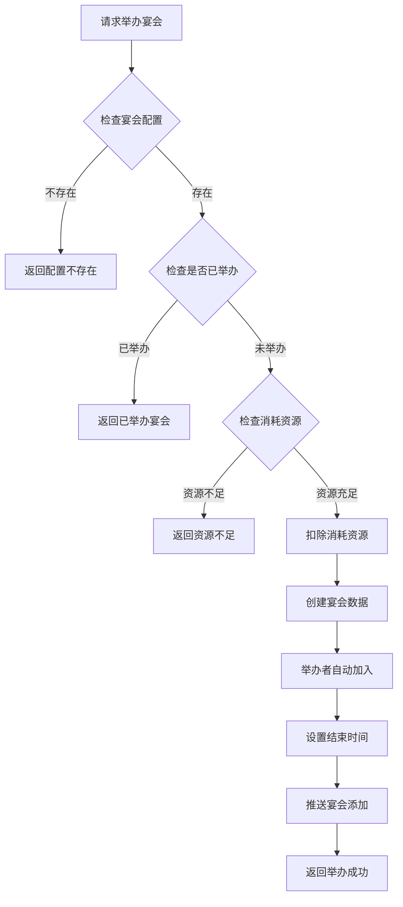
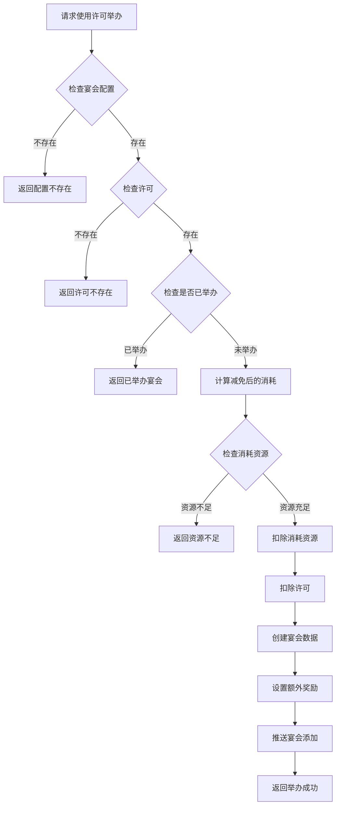
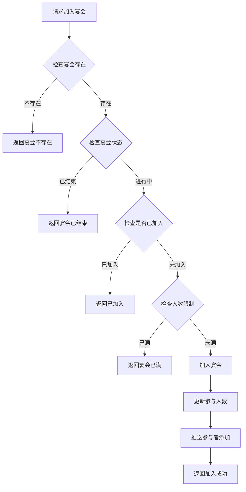
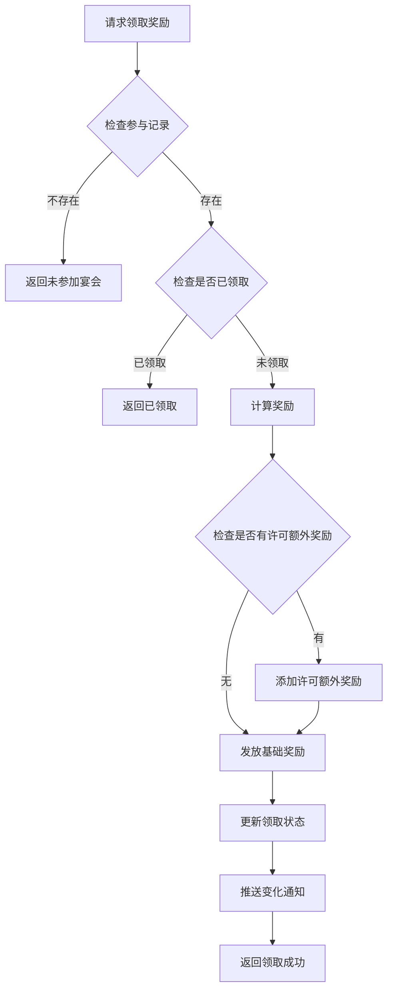
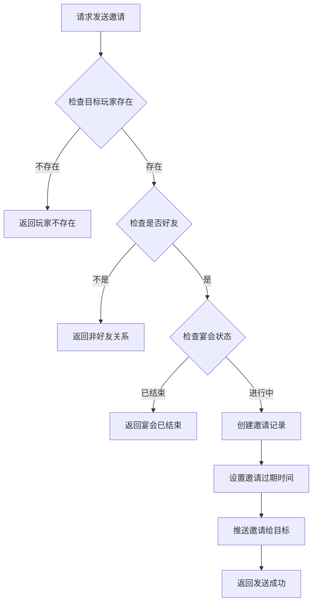

# 宴会系统完整说明

## 一、模块概述

### 1.1 业务背景

宴会系统是 K2C 游戏的核心社交玩法，玩家可以举办宴会邀请其他玩家参加，参与宴会可获得丰厚奖励。该系统融合了社交互动、资源获取、特殊客人等多种元素，是促进玩家社交的重要途径。

### 1.2 目标用户

- **社交玩家**：通过宴会结交新朋友
- **资源玩家**：通过参加宴会获取奖励
- **公会成员**：通过公会宴会增进感情

### 1.3 核心价值

1. **社交互动**：宴会促进玩家间的互动
2. **资源获取**：参与宴会获得丰厚奖励
3. **VIP特权**：使用许可可获得额外奖励
4. **限时体验**：宴会时间有限，增加紧迫感

---

## 二、功能清单

### 2.1 宴会举办功能

| 功能名称 | 功能描述 | 用户价值 |
|---------|---------|---------|
| 举办宴会 | 消耗资源举办宴会 | 创建社交场合 |
| 使用许可举办 | 使用许可减免消耗 | 节省资源并获得额外奖励 |

### 2.2 宴会参与功能

| 功能名称 | 功能描述 | 用户价值 |
|---------|---------|---------|
| 加入宴会 | 加入他人举办的宴会 | 参与社交活动 |
| 查看宴会列表 | 查看可参加的宴会 | 选择参与目标 |
| 查看宴会详情 | 查看宴会详细信息 | 了解宴会内容 |

### 2.3 奖励领取功能

| 功能名称 | 功能描述 | 用户价值 |
|---------|---------|---------|
| 领取开启奖励 | 领取宴会参与奖励 | 获得参与奖励 |

### 2.4 邀请功能

| 功能名称 | 功能描述 | 用户价值 |
|---------|---------|---------|
| 发送邀请 | 向好友发送宴会邀请 | 邀请好友参加 |
| 检查宴会邀请 | 查看收到的邀请 | 接受邀请 |

### 2.5 记录查询功能

| 功能名称 | 功能描述 | 用户价值 |
|---------|---------|---------|
| 获取宴会记录 | 查看宴会举办历史 | 回顾参与记录 |
| 获取预览信息 | 预览宴会举办效果 | 了解宴会内容 |
| 获取下一个宴会 | 获取下一个可参加的宴会 | 快速找到目标 |

---

## 三、业务流程详解

### 3.1 举办宴会流程



**详细步骤说明**：

1. **配置验证**
   - 获取宴会配置信息
   - 验证宴会类型有效性

2. **状态检查**
   - 检查玩家是否已举办未结束的宴会
   - 每人同时只能举办一个宴会

3. **资源消耗**
   - 计算举办宴会所需资源
   - 使用许可可减免消耗

4. **宴会创建**
   - 创建宴会数据记录
   - 举办者自动成为第一个参与者
   - 设置宴会结束时间

### 3.2 使用许可举办流程



### 3.3 加入宴会流程



**详细步骤说明**：

1. **宴会验证**
   - 验证宴会存在
   - 验证举办者ID匹配

2. **状态检查**
   - 检查宴会是否进行中
   - 检查是否已过结束时间

3. **人数检查**
   - 检查当前参与人数
   - 检查是否达到人数上限

4. **加入处理**
   - 添加参与记录
   - 更新参与人数
   - 推送通知

### 3.4 领取奖励流程



### 3.5 发送邀请流程



---

## 四、关键规则

### 4.1 宴会类型规则

| 宴会类型 | 类型ID | 说明 |
|----------|--------|------|
| 普通宴会 | 1 | 基础宴会，消耗较少 |
| 豪华宴会 | 2 | 豪华宴会，奖励更多 |
| 皇家宴会 | 3 | 顶级宴会，奖励最丰厚 |

### 4.2 宴会状态规则

| 状态 | 状态值 | 说明 |
|------|--------|------|
| 准备中 | 0 | 宴会正在准备 |
| 进行中 | 1 | 宴会正在进行 |
| 已结束 | 2 | 宴会已结束 |

### 4.3 人数限制规则

1. **人数上限**：根据宴会类型配置
2. **举办者占用**：举办者计入参与人数
3. **一人一宴**：同一宴会每人只能参加一次

### 4.4 时间限制规则

1. **持续时间**：根据宴会类型配置（通常30-60分钟）
2. **自动结束**：到达结束时间自动结束
3. **奖励领取**：宴会结束后仍可领取奖励

### 4.5 许可规则

1. **许可获取**：通过活动、商城购买获得
2. **消耗减免**：使用许可减免举办消耗
3. **额外奖励**：使用许可获得额外奖励

---

## 五、用户故事

### 5.1 举办宴会故事

> 作为一名活跃玩家，我决定举办一场豪华宴会邀请好友参加。我准备了足够的资源，选择使用一张宴会许可，既节省了消耗又能获得额外奖励。宴会开始后，好友们陆续加入，我们一起聊天互动，享受宴会的乐趣。

### 5.2 参加宴会故事

> 作为一名普通玩家，我在宴会列表中看到了一场皇家宴会正在进行。查看详情后发现还有很多空位，我便申请加入。宴会主人很快同意了我的请求，我成功加入宴会并领取了丰厚的奖励。

### 5.3 公会宴会故事

> 作为一名公会会长，我定期举办公会宴会，邀请公会成员参加。通过宴会，公会成员之间的感情更加深厚，新成员也能更快融入公会。宴会奖励也帮助成员们更好地发展。

---

## 六、示例

### 6.1 举办宴会示例

**输入数据**：
- 宴会配置ID：2（豪华宴会）
- 是否使用许可：是
- 许可ID：1001

**举办结果**：
```
宴会ID：50001
举办者ID：20001
举办者名称：剑舞春秋
宴会类型：豪华宴会
状态：进行中
开始时间：2026-04-07 10:00:00
结束时间：2026-04-07 11:00:00
当前参与人数：1
许可ID：1001
```

### 6.2 加入宴会示例

**输入数据**：
- 宴会ID：50001
- 举办者ID：20001

**加入结果**：
```
宴会ID：50001
参与者ID：20002
参与者名称：风云公子
加入时间：2026-04-07 10:15:00
当前参与人数：2
```

### 6.3 领取奖励示例

**初始状态**：
```
宴会ID：50001
参与者ID：20002
是否已领取：否
```

**领取结果**：
```
基础奖励：银两 × 1000、钻石 × 50
许可额外奖励：稀有道具 × 1
总奖励：银两 × 1000、钻石 × 50、稀有道具 × 1
是否已领取：是
```

### 6.4 宴会邀请示例

**输入数据**：
- 目标玩家ID：20003

**邀请结果**：
```
邀请ID：60001
宴会ID：50001
邀请者ID：20001
邀请者名称：剑舞春秋
目标玩家ID：20003
过期时间：2026-04-07 11:00:00
```

---

*文档生成时间: 2026-04-07*
