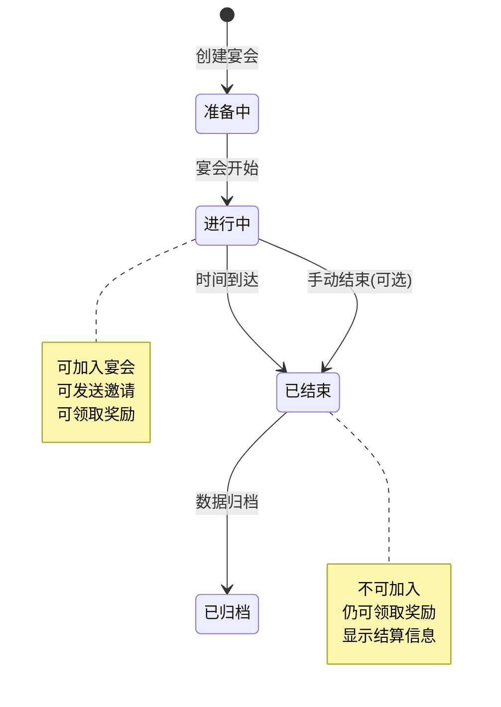
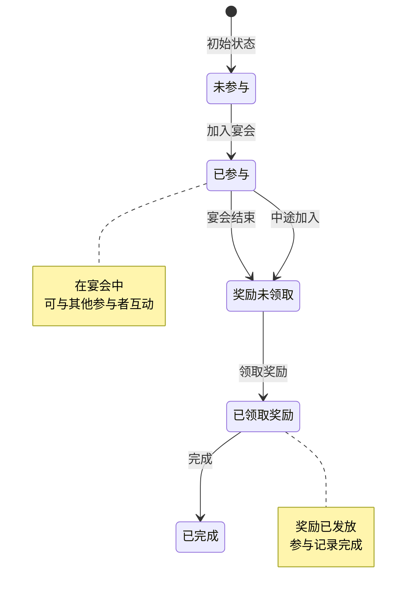
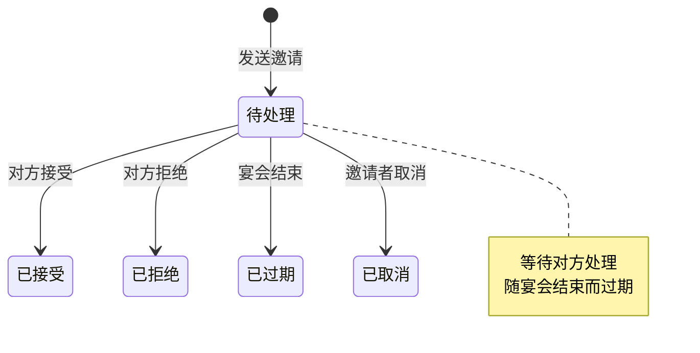
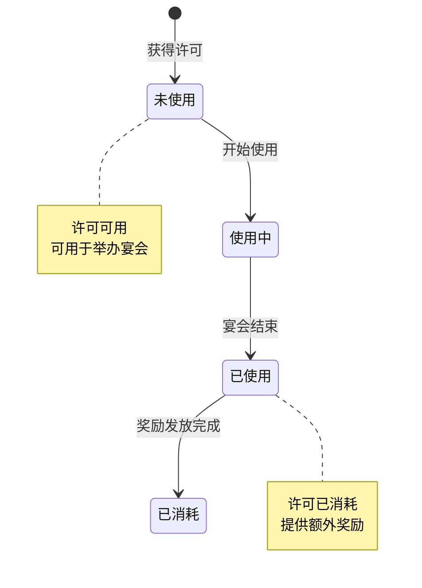
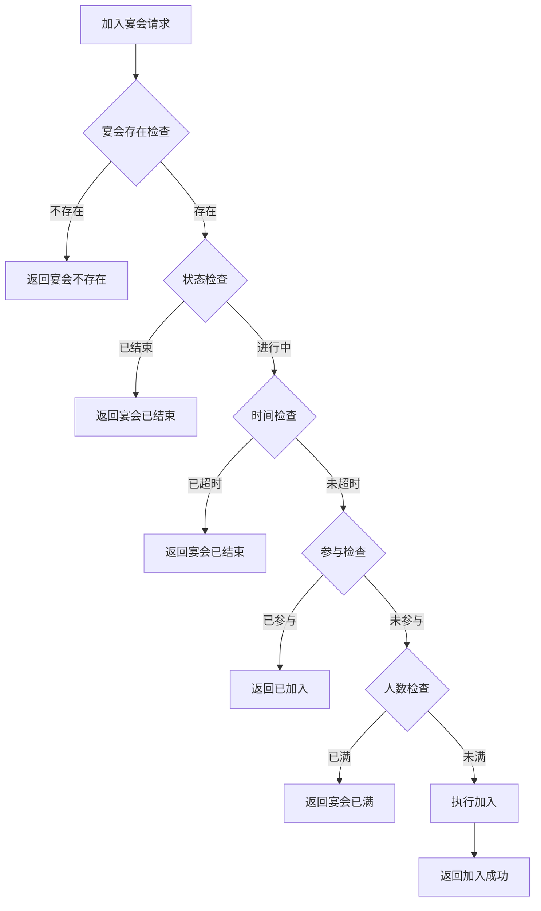

# 宴会系统实现细节

## 一、计算公式

### 1.1 宴会消耗计算公式

```
实际消耗 = 基础消耗 - 许可减免
```

**参数说明**：
- `基础消耗`：宴会配置的消耗列表
- `许可减免`：许可配置的减免比例或固定值

**示例计算**：
```
基础消耗：钻石 × 500
许可减免：20%
实际消耗 = 500 × (1 - 0.2) = 400 钻石
```

### 1.2 宴会奖励计算公式

```
最终奖励 = 基础奖励 + 许可额外奖励
```

**示例计算**：
```
基础奖励：银两 × 1000、钻石 × 50
许可额外奖励：稀有道具 × 1
最终奖励 = 银两 × 1000、钻石 × 50、稀有道具 × 1
```

### 1.3 宴会持续时间计算

```
结束时间 = 开始时间 + 宴会持续时间
```

**示例计算**：
```
开始时间：2026-04-07 10:00:00
持续时间：60分钟
结束时间 = 2026-04-07 11:00:00
```

### 1.4 邀请过期时间计算

```
邀请过期时间 = 宴会结束时间
```

---

## 二、状态机定义

### 2.1 宴会状态机



### 2.2 参与者状态机



### 2.3 邀请状态机



### 2.4 许可状态机



---

## 三、数据约束

### 3.1 宴会数据约束

| 字段名 | 数据类型 | 取值范围 | 必填 | 唯一性 | 说明 |
|--------|----------|----------|------|--------|------|
| id | bigint | > 0 | 是 | 是 | 宴会ID |
| host_player_id | bigint | > 0 | 是 | 否 | 举办者ID |
| dinner_cfg_id | int | > 0 | 是 | 否 | 宴会配置ID |
| permit_id | int | >= 0 | 否 | 否 | 许可ID |
| state | int | 0-2 | 是 | 否 | 状态 |
| start_time | datetime | - | 是 | 否 | 开始时间 |
| end_time | datetime | - | 是 | 否 | 结束时间 |
| joiner_count | int | >= 1 | 是 | 否 | 参与人数 |

### 3.2 宴会参与者数据约束

| 字段名 | 数据类型 | 取值范围 | 必填 | 说明 |
|--------|----------|----------|------|------|
| id | bigint | > 0 | 是 | 主键 |
| dinner_id | bigint | > 0 | 是 | 宴会ID |
| player_id | bigint | > 0 | 是 | 玩家ID |
| player_name | varchar(64) | 1-64字符 | 是 | 玩家名称 |
| join_time | datetime | - | 是 | 加入时间 |
| reward_taken | tinyint | 0-1 | 是 | 是否已领奖 |

### 3.3 宴会邀请数据约束

| 字段名 | 数据类型 | 取值范围 | 必填 | 说明 |
|--------|----------|----------|------|------|
| id | bigint | > 0 | 是 | 邀请ID |
| dinner_id | bigint | > 0 | 是 | 宴会ID |
| from_player_id | bigint | > 0 | 是 | 邀请者ID |
| to_player_id | bigint | > 0 | 是 | 被邀请者ID |
| state | int | 0-4 | 是 | 状态 |
| expire_time | datetime | - | 是 | 过期时间 |

### 3.4 宴会配置数据约束

| 字段名 | 数据类型 | 取值范围 | 必填 | 说明 |
|--------|----------|----------|------|------|
| dinner_id | int | > 0 | 是 | 宴会ID |
| dinner_name | string | 1-32字符 | 是 | 宴会名称 |
| dinner_type | int | 1-3 | 是 | 宴会类型 |
| max_joiner | int | 5-50 | 是 | 最大参与人数 |
| duration | int | 600-3600 | 是 | 持续时间（秒） |

---

## 四、错误处理策略

### 4.1 宴会系统错误码

| 错误码 | 错误信息 | 处理策略 | 用户提示 |
|--------|----------|----------|----------|
| 19001 | 宴会配置不存在 | 检查宴会配置ID | "宴会类型不存在" |
| 19002 | 已举办未结束的宴会 | 检查宴会状态 | "您已举办了宴会，请等待结束" |
| 19003 | 宴会不存在 | 检查宴会ID | "该宴会不存在" |
| 19004 | 宴会已结束 | 检查宴会时间 | "该宴会已结束" |
| 19005 | 宴会已满 | 检查参与人数 | "该宴会人数已满" |
| 19006 | 已加入该宴会 | 检查参与记录 | "您已参加该宴会" |
| 19007 | 未参加该宴会 | 检查参与记录 | "您未参加该宴会" |
| 19008 | 奖励已领取 | 检查领取状态 | "奖励已领取" |
| 19009 | 许可不存在 | 检查许可ID | "许可不存在" |
| 19010 | 许可已使用 | 检查许可状态 | "该许可已使用" |

### 4.2 加入宴会错误处理流程



### 4.3 领取奖励错误处理

| 错误场景 | 处理策略 |
|----------|----------|
| 未参加宴会 | 拒绝领取，提示未参加 |
| 奖励已领取 | 拒绝领取，提示已领取 |
| 宴会数据异常 | 记录日志，补偿发放 |

---

## 五、关键代码示例

### 5.1 举办宴会伪代码

```csharp
public Result StartDinner(long playerId, int dinnerCfgId, int? permitId)
{
    // 1. 获取宴会配置
    DinnerConfig config = dinnerConfigDao.GetById(dinnerCfgId);
    if (config == null)
    {
        return Result.Error(19001, "宴会配置不存在");
    }

    // 2. 检查是否已举办
    Dinner existingDinner = dinnerDao.SelectOngoingByHost(playerId);
    if (existingDinner != null)
    {
        return Result.Error(19002, "已举办未结束的宴会");
    }

    // 3. 计算消耗
    List<CostInfo> costList = config.costList;
    if (permitId.HasValue)
    {
        // 检查许可
        DinnerPermit permit = permitDao.GetById(permitId.Value);
        if (permit == null || permit.playerId != playerId || permit.used)
        {
            return Result.Error(19009, "许可不存在或已使用");
        }
        // 应用许可减免
        costList = ApplyPermitDiscount(costList, permit);
    }

    // 4. 扣除消耗
    if (!resourceService.CheckAndConsume(playerId, costList))
    {
        return Result.Error(0, "资源不足");
    }

    // 5. 创建宴会
    Dinner dinner = new Dinner
    {
        Id = idGenerator.NextId(),
        HostPlayerId = playerId,
        DinnerCfgId = dinnerCfgId,
        PermitId = permitId,
        State = EDinnerState.ONGOING,
        StartTime = DateTime.Now,
        EndTime = DateTime.Now.AddSeconds(config.duration),
        JoinerCount = 1
    };
    dinnerDao.Insert(dinner);

    // 6. 举办者自动加入
    DinnerJoiner joiner = new DinnerJoiner
    {
        Id = idGenerator.NextId(),
        DinnerId = dinner.Id,
        PlayerId = playerId,
        PlayerName = GetPlayerName(playerId),
        JoinTime = DateTime.Now,
        RewardTaken = false
    };
    joinerDao.Insert(joiner);

    // 7. 使用许可
    if (permitId.HasValue)
    {
        permitDao.MarkAsUsed(permitId.Value);
    }

    // 8. 推送通知
    PushDinnerAdd(dinner);

    return Result.Success(new { dinnerId = dinner.Id });
}
```

### 5.2 加入宴会伪代码

```csharp
public Result JoinDinner(long playerId, long dinnerId, long hostPlayerId)
{
    // 1. 获取宴会信息
    Dinner dinner = dinnerDao.SelectById(dinnerId);
    if (dinner == null || dinner.HostPlayerId != hostPlayerId)
    {
        return Result.Error(19003, "宴会不存在");
    }

    // 2. 检查状态
    if (dinner.State != EDinnerState.ONGOING)
    {
        return Result.Error(19004, "宴会已结束");
    }

    // 3. 检查是否已结束
    if (dinner.EndTime < DateTime.Now)
    {
        return Result.Error(19004, "宴会已结束");
    }

    // 4. 检查人数
    DinnerConfig config = dinnerConfigDao.GetById(dinner.DinnerCfgId);
    if (dinner.JoinerCount >= config.maxJoiner)
    {
        return Result.Error(19005, "宴会已满");
    }

    // 5. 检查是否已加入
    DinnerJoiner existingJoiner = joinerDao.SelectByDinnerAndPlayer(dinnerId, playerId);
    if (existingJoiner != null)
    {
        return Result.Error(19006, "已加入该宴会");
    }

    // 6. 加入宴会
    DinnerJoiner joiner = new DinnerJoiner
    {
        Id = idGenerator.NextId(),
        DinnerId = dinnerId,
        PlayerId = playerId,
        PlayerName = GetPlayerName(playerId),
        JoinTime = DateTime.Now,
        RewardTaken = false
    };
    joinerDao.Insert(joiner);

    // 7. 更新参与人数
    dinner.JoinerCount++;
    dinnerDao.UpdateById(dinner);

    // 8. 推送通知
    PushJoinerAdd(dinnerId, playerId);

    return Result.Success();
}
```

### 5.3 领取奖励伪代码

```csharp
public Result TakeReward(long playerId, long dinnerId)
{
    // 1. 获取参与记录
    DinnerJoiner joiner = joinerDao.SelectByDinnerAndPlayer(dinnerId, playerId);
    if (joiner == null)
    {
        return Result.Error(19007, "未参加该宴会");
    }

    // 2. 检查是否已领取
    if (joiner.RewardTaken)
    {
        return Result.Error(19008, "奖励已领取");
    }

    // 3. 获取宴会配置
    Dinner dinner = dinnerDao.SelectById(dinnerId);
    DinnerConfig config = dinnerConfigDao.GetById(dinner.DinnerCfgId);

    // 4. 计算奖励
    List<RewardInfo> rewardList = new List<RewardInfo>(config.rewardList);

    // 5. 添加许可额外奖励
    if (dinner.PermitId.HasValue)
    {
        DinnerPermitConfig permitConfig = permitConfigDao.GetById(dinner.PermitId.Value);
        if (permitConfig.extraReward != null)
        {
            rewardList.AddRange(permitConfig.extraReward);
        }
    }

    // 6. 发放奖励
    rewardService.GiveRewards(playerId, rewardList);

    // 7. 更新状态
    joiner.RewardTaken = true;
    joinerDao.UpdateById(joiner);

    return Result.Success(new { rewardList });
}
```

### 5.4 发送邀请伪代码

```csharp
public Result SendInvite(long playerId, long targetPlayerId)
{
    // 1. 获取玩家正在举办的宴会
    Dinner dinner = dinnerDao.SelectOngoingByHost(playerId);
    if (dinner == null)
    {
        return Result.Error(19003, "没有进行中的宴会");
    }

    // 2. 检查宴会状态
    if (dinner.State != EDinnerState.ONGOING)
    {
        return Result.Error(19004, "宴会已结束");
    }

    // 3. 检查目标玩家
    PlayerBase targetPlayer = playerDao.SelectById(targetPlayerId);
    if (targetPlayer == null)
    {
        return Result.Error(0, "玩家不存在");
    }

    // 4. 创建邀请
    DinnerInvite invite = new DinnerInvite
    {
        Id = idGenerator.NextId(),
        DinnerId = dinner.Id,
        FromPlayerId = playerId,
        ToPlayerId = targetPlayerId,
        State = EInviteState.PENDING,
        ExpireTime = dinner.EndTime
    };
    inviteDao.Insert(invite);

    // 5. 推送邀请给目标玩家
    PushInviteToPlayer(targetPlayerId, invite);

    return Result.Success();
}
```

### 5.5 结束过期宴会伪代码

```csharp
public void EndExpiredDinners()
{
    DateTime now = DateTime.Now;
    List<Dinner> expiredList = dinnerDao.SelectExpired(now);

    foreach (Dinner dinner in expiredList)
    {
        // 1. 更新状态
        dinner.State = EDinnerState.ENDED;
        dinnerDao.UpdateById(dinner);

        // 2. 推送结束通知
        PushDinnerEnd(dinner);

        // 3. 通知所有参与者
        List<DinnerJoiner> joiners = joinerDao.SelectByDinnerId(dinner.Id);
        foreach (DinnerJoiner joiner in joiners)
        {
            if (!joiner.RewardTaken)
            {
                // 提醒领取奖励
                PushRewardReminder(joiner.PlayerId, dinner.Id);
            }
        }
    }
}
```

---

## 六、跨模块依赖

### 6.1 依赖模块

| 模块名称 | 依赖方式 | 依赖内容 |
|----------|----------|----------|
| Player | 强依赖 | 玩家基础信息、资源管理 |
| Item | 强依赖 | 道具消耗和发放 |
| Friend | 弱依赖 | 好友关系验证 |
| Push | 强依赖 | 消息推送服务 |

### 6.2 被依赖模块

| 模块名称 | 被依赖内容 |
|----------|------------|
| Activity | 宴会活动统计 |
| Achievement | 宴会相关成就 |
| Task | 宴会相关任务 |

### 6.3 接口定义

```csharp
// 资源服务接口
interface IResourceService
{
    bool CheckAndConsume(long playerId, List<CostInfo> costList);
}

// 奖励服务接口
interface IRewardService
{
    void GiveRewards(long playerId, List<RewardInfo> rewardList);
}

// 推送服务接口
interface IPushService
{
    void PushToPlayer(long playerId, object message);
}

// 好友服务接口
interface IFriendService
{
    bool IsFriend(long playerId, long targetPlayerId);
}
```

---

## 七、性能优化建议

### 7.1 缓存策略

1. **宴会数据缓存**
   - 进行中的宴会缓存到Redis
   - 设置与宴会持续时间相同的过期时间

2. **参与者列表缓存**
   - 参与者列表缓存
   - 加入时更新缓存

### 7.2 数据库优化

1. **索引设计**
   - host_player_id 索引（查询举办者的宴会）
   - state + end_time 复合索引（查询过期宴会）

2. **分表策略**
   - 宴会记录按时间分表
   - 定期归档历史数据

### 7.3 定时任务

1. **宴会结束检查**
   - 每分钟检查一次
   - 批量更新过期宴会状态

2. **数据清理**
   - 定期清理过期的邀请记录
   - 归档已结束宴会的详细数据

---

*文档生成时间: 2026-04-07*
