# 副本模块数据配表文档

## 配表概述

副本模块相关的配置数据存储在 `dungeon_refdata.unity3d` 资源文件中，客户端通过 `GRefdataCoreMgr` 访问配置数据。

**资源路径**: `refdata/dungeon_refdata.unity3d`

---

## 一、配表关系总览

### 1.1 配表ER关系图

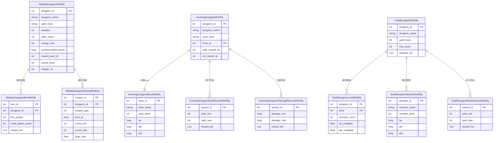

### 1.2 配表模块架构图

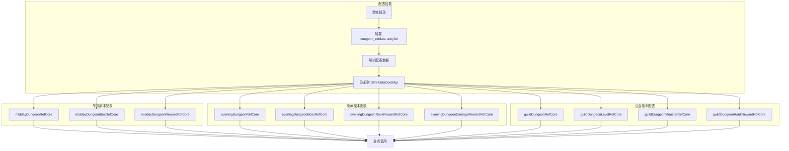

### 1.3 配表依赖关系图

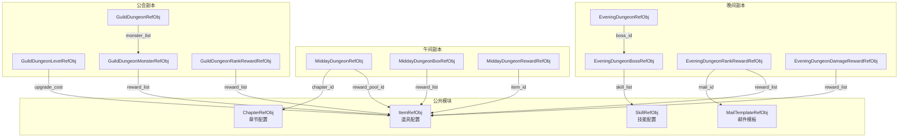

---

## 二、午间副本配表

### 2.1 MiddayDungeonRefObj - 午间副本主表

**文件路径**: `dungeon_refdata.unity3d` -> `midday_dungeon`

**配置类**: `GSOMiddayDungeonRefSet`

| 序号 | 字段名 | 类型 | 说明 | 取值范围 | 必填 | 默认值 | 示例 |
|------|--------|------|------|----------|------|--------|------|
| 1 | dungeon_id | int | 副本ID（唯一标识） | > 0 | 是 | - | 1 |
| 2 | dungeon_name | string | 副本名称 | 非空 | 是 | - | "午间试炼" |
| 3 | dungeon_type | int | 副本类型 | 1 | 是 | 1 | 1 |
| 4 | open_time | string | 开启时间（HH:mm） | 有效时间 | 是 | - | "12:00" |
| 5 | close_time | string | 关闭时间（HH:mm） | 有效时间 | 是 | - | "14:00" |
| 6 | duration | int | 持续时间（分钟） | > 0 | 是 | - | 120 |
| 7 | daily_count | int | 每日挑战次数 | >= 0 | 是 | - | 3 |
| 8 | energy_cost | int | 体力消耗 | >= 0 | 是 | - | 10 |
| 9 | recommended_power | long | 推荐战力 | >= 0 | 是 | 0 | 30000 |
| 10 | reward_pool_id | int | 奖励池ID | > 0 | 是 | - | 1001 |
| 11 | unlock_level | int | 解锁等级 | >= 0 | 是 | 0 | 10 |
| 12 | chapter_id | int | 所属章节 | > 0 | 是 | - | 1 |
| 13 | icon | NPGTextureIndex | 副本图标 | - | 否 | - | - |
| 14 | bg_image | NPGTextureIndex | 背景图片 | - | 否 | - | - |
| 15 | desc | string | 副本描述 | - | 否 | "" | "每日限时开放的副本" |

**索引说明**:
- 主键: `dungeon_id`
- 服务端查询: 按章节查询 `chapter_id`

**数据约束**:

| 约束类型 | 字段 | 约束条件 | 说明 |
|----------|------|----------|------|
| 唯一约束 | dungeon_id | 全局唯一 | 副本ID不可重复 |
| 外键约束 | chapter_id | 引用章节表 | 章节必须存在 |
| 外键约束 | reward_pool_id | 引用奖励池表 | 奖励池必须存在 |
| 逻辑约束 | open_time < close_time | 时间有效 | 开启时间必须早于关闭时间 |
| 数值约束 | daily_count | 0-100 | 合理的每日次数 |
| 数值约束 | energy_cost | 0-1000 | 合理的体力消耗 |

---

### 2.2 MiddayDungeonBoxRefObj - 午间副本宝箱表

**文件路径**: `dungeon_refdata.unity3d` -> `midday_dungeon_box`

**配置类**: `GSOMiddayDungeonBoxRefSet`

| 序号 | 字段名 | 类型 | 说明 | 取值范围 | 必填 | 默认值 | 示例 |
|------|--------|------|------|----------|------|--------|------|
| 1 | box_id | int | 宝箱ID（唯一标识） | > 0 | 是 | - | 1 |
| 2 | dungeon_id | int | 所属副本ID | > 0 | 是 | - | 1 |
| 3 | box_quality | int | 宝箱品质（1-5星） | 1-5 | 是 | 1 | 3 |
| 4 | reward_list | List\<NPCommonCostItem\> | 奖励列表 | 非空 | 是 | - | [{SILVER, 1000}] |
| 5 | draw_condition | NPPlayerCondition | 领取条件 | - | 否 | - | - |
| 6 | need_attack_count | int | 需要攻击次数 | > 0 | 是 | - | 5 |
| 7 | icon | NPGTextureIndex | 宝箱图标 | - | 否 | - | - |
| 8 | desc | string | 宝箱描述 | - | 否 | "" | "累计攻击5次可领取" |

**索引说明**:
- 主键: `box_id`
- 外键: `dungeon_id` -> MiddayDungeonRefObj

**宝箱品质对应表**:

| 品质 | 星级 | 边框颜色 | 奖励价值 |
|------|------|----------|----------|
| 1 | ★ | 灰色 | 普通 |
| 2 | ★★ | 绿色 | 优秀 |
| 3 | ★★★ | 蓝色 | 稀有 |
| 4 | ★★★★ | 紫色 | 史诗 |
| 5 | ★★★★★ | 橙色 | 传说 |

**NPCommonCostItem 结构**:

| 序号 | 字段名 | 类型 | 说明 | 示例 |
|------|--------|------|------|------|
| 1 | type | int | 物品类型（0货币，1道具，2装备） | 0 |
| 2 | id | long | 物品ID | 1 |
| 3 | count | int | 数量 | 1000 |

---

### 2.3 MiddayDungeonRewardRefObj - 午间副本奖励表

**文件路径**: `dungeon_refdata.unity3d` -> `midday_dungeon_reward`

**配置类**: `GSOMiddayDungeonRewardRefSet`

| 序号 | 字段名 | 类型 | 说明 | 取值范围 | 必填 | 默认值 | 示例 |
|------|--------|------|------|----------|------|--------|------|
| 1 | reward_id | int | 奖励ID（唯一标识） | > 0 | 是 | - | 1 |
| 2 | dungeon_id | int | 所属副本ID | > 0 | 是 | - | 1 |
| 3 | reward_type | int | 奖励类型 | 1-3 | 是 | - | 1 |
| 4 | item_id | long | 物品ID | > 0 | 是 | - | 10001 |
| 5 | count_min | int | 最小数量 | > 0 | 是 | - | 1 |
| 6 | count_max | int | 最大数量 | >= count_min | 是 | - | 5 |
| 7 | drop_rate | float | 掉落概率 | 0-1 | 是 | - | 0.5 |
| 8 | guarantee_count | int | 保底次数 | >= 0 | 是 | 0 | 0 |

**奖励类型说明**:

| 值 | 说明 | 描述 |
|----|------|------|
| 1 | 固定奖励 | 每次攻击必定获得 |
| 2 | 随机奖励 | 根据掉落率概率获得 |
| 3 | 首通奖励 | 首次通关获得 |

**索引说明**:
- 主键: `reward_id`
- 外键: `dungeon_id` -> MiddayDungeonRefObj

---

## 三、晚间副本配表

### 3.1 EveningDungeonRefObj - 晚间副本主表

**文件路径**: `dungeon_refdata.unity3d` -> `evening_dungeon`

**配置类**: `GSOEveningDungeonRefSet`

| 序号 | 字段名 | 类型 | 说明 | 取值范围 | 必填 | 默认值 | 示例 |
|------|--------|------|------|----------|------|--------|------|
| 1 | dungeon_id | int | 副本ID（唯一标识） | > 0 | 是 | - | 1 |
| 2 | dungeon_name | string | 副本名称 | 非空 | 是 | - | "晚间世界Boss" |
| 3 | dungeon_type | int | 副本类型 | 2 | 是 | 2 | 2 |
| 4 | open_time | string | 开启时间（HH:mm） | 有效时间 | 是 | - | "20:00" |
| 5 | close_time | string | 关闭时间（HH:mm） | 有效时间 | 是 | - | "22:00" |
| 6 | duration | int | 持续时间（分钟） | > 0 | 是 | - | 120 |
| 7 | boss_id | int | Boss ID | > 0 | 是 | - | 1001 |
| 8 | unlock_level | int | 解锁等级 | >= 0 | 是 | 0 | 20 |
| 9 | daily_count | int | 每日挑战次数 | >= -1 | 是 | -1 | -1（无限制） |
| 10 | energy_cost | int | 体力消耗 | >= 0 | 是 | 0 | 0 |
| 11 | rank_reward_id | int | 排行榜奖励ID | > 0 | 是 | - | 2001 |
| 12 | kill_reward_id | int | 击杀奖励ID | > 0 | 是 | - | 2002 |
| 13 | icon | NPGTextureIndex | 副本图标 | - | 否 | - | - |
| 14 | bg_image | NPGTextureIndex | 背景图片 | - | 否 | - | - |
| 15 | desc | string | 副本描述 | - | 否 | "" | "全服共同挑战世界Boss" |

**索引说明**:
- 主键: `dungeon_id`
- 关联: `boss_id` -> EveningDungeonBossRefObj

---

### 3.2 EveningDungeonBossRefObj - 晚间副本Boss表

**文件路径**: `dungeon_refdata.unity3d` -> `evening_dungeon_boss`

**配置类**: `GSOEveningDungeonBossRefSet`

| 序号 | 字段名 | 类型 | 说明 | 取值范围 | 必填 | 默认值 | 示例 |
|------|--------|------|------|----------|------|--------|------|
| 1 | boss_id | int | Boss ID（唯一标识） | > 0 | 是 | - | 1001 |
| 2 | boss_name | string | Boss名称 | 非空 | 是 | - | "暗影巨龙" |
| 3 | boss_level | int | Boss等级 | > 0 | 是 | - | 50 |
| 4 | hp | long | 基础血量 | > 0 | 是 | - | 100000000 |
| 5 | atk | long | 攻击力 | >= 0 | 是 | 0 | 50000 |
| 6 | def | long | 防御力 | >= 0 | 是 | 0 | 30000 |
| 7 | boss_type | int | Boss类型 | 1-10 | 是 | 1 | 1 |
| 8 | skill_list | List\<long\> | Boss技能列表 | - | 否 | [] | [1001, 1002] |
| 9 | reward_list | List\<NPCommonCostItem\> | 击杀奖励列表 | - | 否 | [] | [{DIAMOND, 100}] |
| 10 | model_id | NPGGoIndex | 模型ID | - | 否 | - | - |
| 11 | icon | NPGTextureIndex | Boss图标 | - | 否 | - | - |
| 12 | desc | string | Boss描述 | - | 否 | "" | "传说中的暗影巨龙" |

**Boss类型说明**:

| 值 | 说明 | 特点 |
|----|------|------|
| 1 | 普通Boss | 基础难度 |
| 2 | 精英Boss | 高难度，奖励丰厚 |
| 3 | 世界Boss | 全服共享血量 |
| 4 | 活动Boss | 限时活动出现 |

**Boss血量计算公式**:

```
实际血量 = 基础血量 × (1 + 天数系数)
天数系数 = min(当前开服天数 / 7, 1) × 0.5

说明：每7天血量增加50%，最高增加50%
```

---

### 3.3 EveningDungeonRankRewardRefObj - 晚间副本排行奖励表

**文件路径**: `dungeon_refdata.unity3d` -> `evening_dungeon_rank_reward`

**配置类**: `GSOEveningDungeonRankRewardRefSet`

| 序号 | 字段名 | 类型 | 说明 | 取值范围 | 必填 | 默认值 | 示例 |
|------|--------|------|------|----------|------|--------|------|
| 1 | reward_id | int | 奖励ID（唯一标识） | > 0 | 是 | - | 2001 |
| 2 | dungeon_id | int | 所属副本ID | > 0 | 是 | - | 1 |
| 3 | rank_min | int | 最低排名 | >= 1 | 是 | - | 1 |
| 4 | rank_max | int | 最高排名 | >= rank_min | 是 | - | 1 |
| 5 | reward_list | List\<NPCommonCostItem\> | 奖励列表 | 非空 | 是 | - | [{DIAMOND, 500}] |
| 6 | mail_id | int | 邮件模板ID | > 0 | 是 | - | 1001 |
| 7 | mail_title | string | 邮件标题 | - | 否 | "" | "晚间副本排行奖励" |
| 8 | mail_content | string | 邮件内容 | - | 否 | "" | "恭喜您获得排行奖励" |

**索引说明**:
- 主键: `reward_id`
- 外键: `dungeon_id` -> EveningDungeonRefObj

---

### 3.4 EveningDungeonDamageRewardRefObj - 晚间副本伤害奖励表

**文件路径**: `dungeon_refdata.unity3d` -> `evening_dungeon_damage_reward`

**配置类**: `GSOEveningDungeonDamageRewardRefSet`

| 序号 | 字段名 | 类型 | 说明 | 取值范围 | 必填 | 默认值 | 示例 |
|------|--------|------|------|----------|------|--------|------|
| 1 | reward_id | int | 奖励ID（唯一标识） | > 0 | 是 | - | 1 |
| 2 | dungeon_id | int | 所属副本ID | > 0 | 是 | - | 1 |
| 3 | damage_min | long | 最低伤害 | >= 0 | 是 | - | 100000 |
| 4 | damage_max | long | 最高伤害 | >= damage_min | 是 | - | 500000 |
| 5 | reward_list | List\<NPCommonCostItem\> | 奖励列表 | 非空 | 是 | - | [{SILVER, 1000}] |

---

## 四、公会副本配表

### 4.1 GuildDungeonRefObj - 公会副本主表

**文件路径**: `dungeon_refdata.unity3d` -> `guild_dungeon`

**配置类**: `GSOGuildDungeonRefSet`

| 序号 | 字段名 | 类型 | 说明 | 取值范围 | 必填 | 默认值 | 示例 |
|------|--------|------|------|----------|------|--------|------|
| 1 | dungeon_id | int | 副本ID（唯一标识） | > 0 | 是 | - | 1 |
| 2 | dungeon_name | string | 副本名称 | 非空 | 是 | - | "公会试炼" |
| 3 | dungeon_type | int | 副本类型 | 3 | 是 | 3 | 3 |
| 4 | guild_level | int | 公会等级需求 | >= 1 | 是 | - | 3 |
| 5 | max_level | int | 副本最大等级 | >= 1 | 是 | - | 10 |
| 6 | monster_list | List\<int\> | 怪物ID列表 | 非空 | 是 | - | [1001, 1002, 1003] |
| 7 | auto_start | bool | 是否自动开始 | - | 是 | false | true |
| 8 | open_day_list | List\<int\> | 开放日期（周几） | 1-7 | 是 | - | [1, 3, 5] |
| 9 | reward_id | int | 奖励ID | > 0 | 是 | - | 3001 |
| 10 | open_time | string | 自动开启时间（HH:mm） | - | 否 | "" | "20:00" |
| 11 | duration | int | 持续时间（小时） | > 0 | 否 | 24 | 24 |
| 12 | icon | NPGTextureIndex | 副本图标 | - | 否 | - | - |
| 13 | desc | string | 副本描述 | - | 否 | "" | "公会成员协作挑战" |

**开放日期说明**:

| 值 | 说明 |
|----|------|
| 1 | 周一 |
| 2 | 周二 |
| 3 | 周三 |
| 4 | 周四 |
| 5 | 周五 |
| 6 | 周六 |
| 7 | 周日 |

---

### 4.2 GuildDungeonLevelRefObj - 公会副本等级表

**文件路径**: `dungeon_refdata.unity3d` -> `guild_dungeon_level`

**配置类**: `GSOGuildDungeonLevelRefSet`

| 序号 | 字段名 | 类型 | 说明 | 取值范围 | 必填 | 默认值 | 示例 |
|------|--------|------|------|----------|------|--------|------|
| 1 | dungeon_id | int | 副本ID | > 0 | 是 | - | 1 |
| 2 | level | int | 副本等级 | >= 1 | 是 | - | 1 |
| 3 | monster_count | int | 怪物数量 | > 0 | 是 | - | 3 |
| 4 | hp_multiplier | float | 血量倍率 | >= 0 | 是 | 1.0 | 1.0 |
| 5 | atk_multiplier | float | 攻击倍率 | >= 0 | 是 | 1.0 | 1.0 |
| 6 | reward_list | List\<NPCommonCostItem\> | 通关奖励 | - | 否 | [] | [{GUILD_COIN, 100}] |
| 7 | upgrade_cost | NPCommonCostItem | 升级消耗 | - | 是 | - | {GUILD_COIN, 500} |

**复合主键**: `(dungeon_id, level)`

**等级倍率对照表**:

| 等级 | 血量倍率 | 攻击倍率 | 升级消耗 |
|------|----------|----------|----------|
| 1 | 1.0 | 1.0 | 500 |
| 2 | 1.2 | 1.1 | 1000 |
| 3 | 1.5 | 1.2 | 2000 |
| 4 | 1.8 | 1.3 | 4000 |
| 5 | 2.2 | 1.5 | 8000 |
| 6 | 2.7 | 1.7 | 15000 |
| 7 | 3.2 | 2.0 | 30000 |
| 8 | 4.0 | 2.3 | 60000 |
| 9 | 5.0 | 2.7 | 100000 |
| 10 | 6.0 | 3.0 | - |

---

### 4.3 GuildDungeonMonsterRefObj - 公会副本怪物表

**文件路径**: `dungeon_refdata.unity3d` -> `guild_dungeon_monster`

**配置类**: `GSOGuildDungeonMonsterRefSet`

| 序号 | 字段名 | 类型 | 说明 | 取值范围 | 必填 | 默认值 | 示例 |
|------|--------|------|------|----------|------|--------|------|
| 1 | monster_id | int | 怪物ID（唯一标识） | > 0 | 是 | - | 1001 |
| 2 | monster_name | string | 怪物名称 | 非空 | 是 | - | "哥布林战士" |
| 3 | monster_level | int | 怪物等级 | > 0 | 是 | - | 30 |
| 4 | hp | long | 基础血量 | > 0 | 是 | - | 500000 |
| 5 | atk | long | 攻击力 | >= 0 | 是 | 0 | 10000 |
| 6 | def | long | 防御力 | >= 0 | 是 | 0 | 5000 |
| 7 | monster_type | int | 怪物类型 | 1-5 | 是 | 1 | 1 |
| 8 | reward_list | List\<NPCommonCostItem\> | 击杀奖励 | - | 否 | [] | [{GUILD_COIN, 50}] |
| 9 | model_id | NPGGoIndex | 模型ID | - | 否 | - | - |
| 10 | icon | NPGTextureIndex | 怪物图标 | - | 否 | - | - |
| 11 | desc | string | 怪物描述 | - | 否 | "" | "凶猛的哥布林战士" |

**怪物类型说明**:

| 值 | 说明 | 特点 |
|----|------|------|
| 1 | 普通怪物 | 基础难度 |
| 2 | 精英怪物 | 较高难度 |
| 3 | 小Boss | 高难度 |
| 4 | 大Boss | 最高难度 |
| 5 | 隐藏怪物 | 特殊触发 |

---

### 4.4 GuildDungeonRankRewardRefObj - 公会副本排行奖励表

**文件路径**: `dungeon_refdata.unity3d` -> `guild_dungeon_rank_reward`

**配置类**: `GSOGuildDungeonRankRewardRefSet`

| 序号 | 字段名 | 类型 | 说明 | 取值范围 | 必填 | 默认值 | 示例 |
|------|--------|------|------|----------|------|--------|------|
| 1 | reward_id | int | 奖励ID（唯一标识） | > 0 | 是 | - | 3001 |
| 2 | dungeon_id | int | 所属副本ID | > 0 | 是 | - | 1 |
| 3 | rank_min | int | 最低排名 | >= 1 | 是 | - | 1 |
| 4 | rank_max | int | 最高排名 | >= rank_min | 是 | - | 3 |
| 5 | reward_list | List\<NPCommonCostItem\> | 奖励列表 | 非空 | 是 | - | [{DIAMOND, 100}] |

---

## 五、副本状态枚举

### 5.1 EDungeonState - 副本状态

```csharp
/// <summary>
/// 副本状态枚举
/// </summary>
public enum EDungeonState
{
    /// <summary>
    /// 未开启
    /// </summary>
    CLOSED = 0,

    /// <summary>
    /// 开启中
    /// </summary>
    OPENING = 1,

    /// <summary>
    /// 已结束
    /// </summary>
    ENDED = 2
}
```

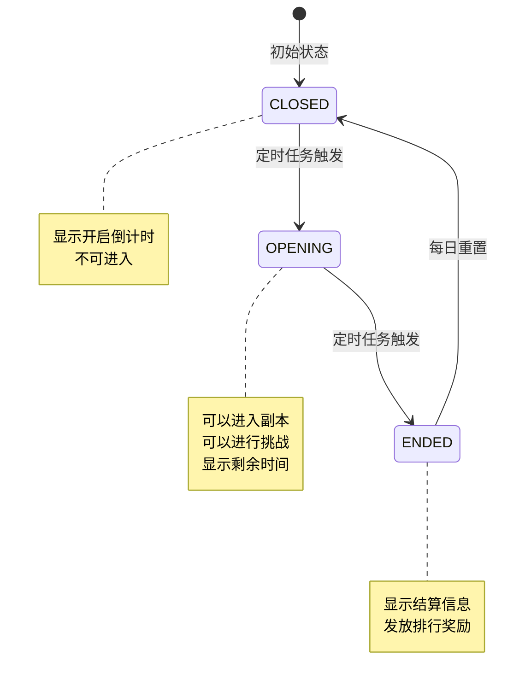

### 5.2 EDungeonType - 副本类型

```csharp
/// <summary>
/// 副本类型枚举
/// </summary>
public enum EDungeonType
{
    /// <summary>
    /// 午间副本
    /// </summary>
    MIDDAY = 1,

    /// <summary>
    /// 晚间副本
    /// </summary>
    EVENING = 2,

    /// <summary>
    /// 公会副本
    /// </summary>
    GUILD = 3,

    /// <summary>
    /// 章节副本
    /// </summary>
    CHAPTER = 4,

    /// <summary>
    /// 无尽副本
    /// </summary>
    ENDLESS = 5
}
```

### 5.3 EBoxState - 宝箱状态

```csharp
/// <summary>
/// 宝箱状态枚举
/// </summary>
public enum EBoxState
{
    /// <summary>
    /// 未达成（条件未满足）
    /// </summary>
    LOCKED = 0,

    /// <summary>
    /// 可领取（条件已满足）
    /// </summary>
    UNLOCKED = 1,

    /// <summary>
    /// 已领取
    /// </summary>
    DRAWN = 2
}
```

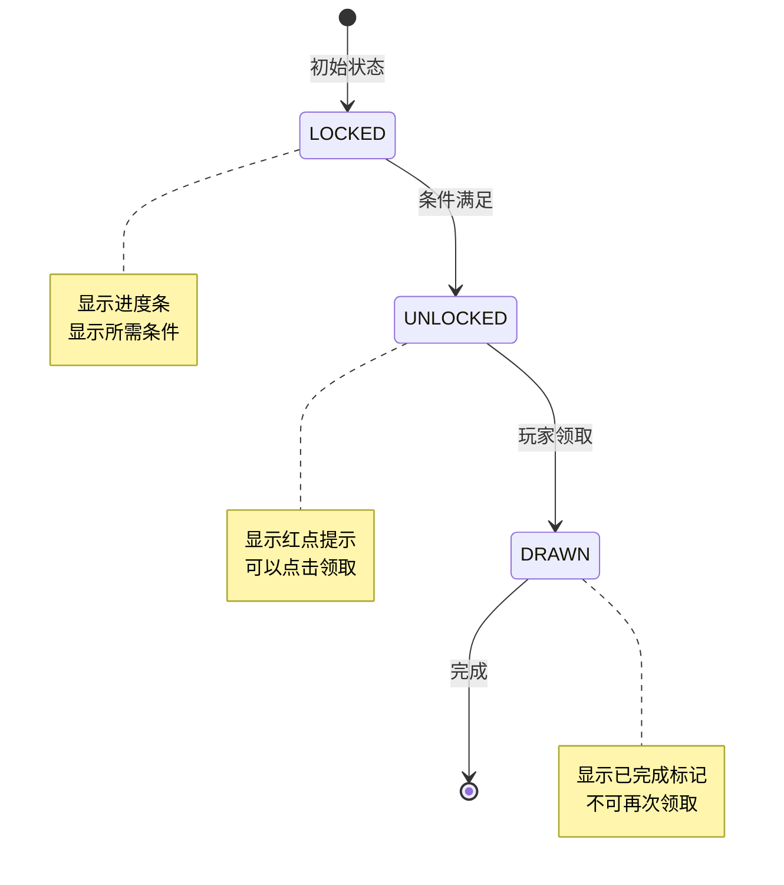

### 5.4 EMonsterState - 怪物状态

```csharp
/// <summary>
/// 怪物状态枚举
/// </summary>
public enum EMonsterState
{
    /// <summary>
    /// 存活
    /// </summary>
    ALIVE = 0,

    /// <summary>
    /// 已死亡
    /// </summary>
    DEAD = 1
}
```

### 5.5 EBossState - Boss状态

```csharp
/// <summary>
/// Boss状态枚举
/// </summary>
public enum EBossState
{
    /// <summary>
    /// 存活
    /// </summary>
    ALIVE = 0,

    /// <summary>
    /// 已死亡
    /// </summary>
    DEAD = 1
}
```

### 5.6 EDungeonBoxType - 副本宝箱类型

```csharp
/// <summary>
/// 副本宝箱类型
/// </summary>
public enum EDungeonBoxType
{
    /// <summary>
    /// 午间副本宝箱
    /// </summary>
    MIDDAY = 0,

    /// <summary>
    /// 晚间副本宝箱
    /// </summary>
    EVENING = 1
}
```

---

## 六、配表加载方式

### 6.1 客户端访问方式

```csharp
// ========== 午间副本配表访问 ==========

// 获取午间副本静态配置
MiddayDungeonRefObj dungeonRef = GRefdataCoreMgr.instance.middayDungeonRefCore.getRef(dungeonId);
if (dungeonRef != null)
{
    string name = dungeonRef.dungeon_name;
    int energyCost = dungeonRef.energy_cost;
    int dailyCount = dungeonRef.daily_count;
}

// 获取午间副本宝箱配置列表（按副本ID）
List<MiddayDungeonBoxRefObj> boxList = GRefdataCoreMgr.instance.middayDungeonBoxRefCore.getListByDungeonId(dungeonId);

// 遍历宝箱列表
foreach (var box in boxList)
{
    int boxId = box.box_id;
    int needCount = box.need_attack_count;
    List<NPCommonCostItem> rewards = box.reward_list;
}

// ========== 晚间副本配表访问 ==========

// 获取晚间副本静态配置
EveningDungeonRefObj eveningRef = GRefdataCoreMgr.instance.eveningDungeonRefCore.getRef(dungeonId);

// 获取晚间副本Boss配置
EveningDungeonBossRefObj bossRef = GRefdataCoreMgr.instance.eveningDungeonBossRefCore.getRef(bossId);
if (bossRef != null)
{
    string bossName = bossRef.boss_name;
    long bossHp = bossRef.hp;
    long bossAtk = bossRef.atk;
}

// ========== 公会副本配表访问 ==========

// 获取公会副本静态配置
GuildDungeonRefObj guildRef = GRefdataCoreMgr.instance.guildDungeonRefCore.getRef(dungeonId);

// 获取公会副本怪物配置
GuildDungeonMonsterRefObj monsterRef = GRefdataCoreMgr.instance.guildDungeonMonsterRefCore.getRef(monsterId);

// 获取公会副本等级配置
GuildDungeonLevelRefObj levelRef = GRefdataCoreMgr.instance.guildDungeonLevelRefCore.getByDungeonAndLevel(dungeonId, level);
if (levelRef != null)
{
    int monsterCount = levelRef.monster_count;
    float hpMultiplier = levelRef.hp_multiplier;
}
```

### 6.2 服务端访问方式

```java
// ========== 午间副本配表访问 ==========

// 获取午间副本静态配置
RefMiddayDungeon dungeonRef = RefMiddayDungeon.getMgr().get(dungeonId);
if (dungeonRef != null) {
    String name = dungeonRef.getDungeonName();
    int energyCost = dungeonRef.getEnergyCost();
    int dailyCount = dungeonRef.getDailyCount();
}

// 获取午间副本宝箱配置列表
List<RefMiddayDungeonBox> boxList = RefMiddayDungeonBox.getByDungeonId(dungeonId);

// ========== 晚间副本配表访问 ==========

// 获取晚间副本Boss配置
RefEveningDungeonBoss bossRef = RefEveningDungeonBoss.getMgr().get(bossId);

// 获取排行奖励配置列表
List<RefEveningDungeonRankReward> rankRewards = RefEveningDungeonRankReward.getByDungeonId(dungeonId);

// ========== 公会副本配表访问 ==========

// 获取公会副本静态配置
RefGuildDungeon guildRef = RefGuildDungeon.getMgr().get(dungeonId);

// 获取公会副本怪物配置
RefGuildDungeonMonster monsterRef = RefGuildDungeonMonster.getMgr().get(monsterId);

// 获取公会副本等级配置
RefGuildDungeonLevel levelRef = RefGuildDungeonLevel.getByDungeonAndLevel(dungeonId, level);
```

---

## 七、配表数据加载流程

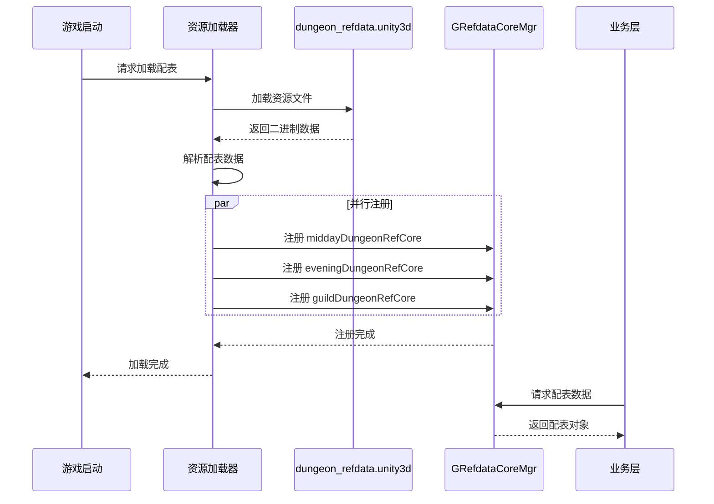

---

## 八、配表数据示例

### 8.1 午间副本配置示例

```json
{
  "dungeon_id": 1,
  "dungeon_name": "午间试炼",
  "dungeon_type": 1,
  "open_time": "12:00",
  "close_time": "14:00",
  "duration": 120,
  "daily_count": 3,
  "energy_cost": 10,
  "recommended_power": 30000,
  "reward_pool_id": 1001,
  "unlock_level": 10,
  "chapter_id": 1,
  "desc": "每日中午12点开启的限时副本，可获得大量奖励"
}
```

### 8.2 午间副本宝箱配置示例

```json
{
  "box_id": 1,
  "dungeon_id": 1,
  "box_quality": 1,
  "need_attack_count": 3,
  "reward_list": [
    {"type": 0, "id": 1, "count": 1000}
  ],
  "desc": "累计攻击3次可领取"
}
```

### 8.3 晚间副本Boss配置示例

```json
{
  "boss_id": 1001,
  "boss_name": "暗影巨龙",
  "boss_level": 50,
  "hp": 100000000,
  "atk": 50000,
  "def": 30000,
  "boss_type": 3,
  "skill_list": [1001, 1002],
  "reward_list": [
    {"type": 0, "id": 2, "count": 100}
  ],
  "desc": "传说中的暗影巨龙，每晚会降临世界"
}
```

### 8.4 晚间副本排行奖励配置示例

```json
[
  {
    "reward_id": 2001,
    "dungeon_id": 1,
    "rank_min": 1,
    "rank_max": 1,
    "reward_list": [
      {"type": 0, "id": 2, "count": 500},
      {"type": 1, "id": 30001, "count": 1}
    ],
    "mail_title": "晚间副本排行奖励",
    "mail_content": "恭喜您获得伤害排行第1名！"
  },
  {
    "reward_id": 2002,
    "dungeon_id": 1,
    "rank_min": 2,
    "rank_max": 10,
    "reward_list": [
      {"type": 0, "id": 2, "count": 200}
    ]
  }
]
```

### 8.5 公会副本配置示例

```json
{
  "dungeon_id": 1,
  "dungeon_name": "公会试炼",
  "dungeon_type": 3,
  "guild_level": 3,
  "max_level": 10,
  "monster_list": [1001, 1002, 1003, 1004, 1005],
  "auto_start": true,
  "open_day_list": [1, 3, 5],
  "reward_id": 3001,
  "open_time": "20:00",
  "duration": 24,
  "desc": "公会成员协作挑战的副本"
}
```

### 8.6 公会副本等级配置示例

```json
[
  {
    "dungeon_id": 1,
    "level": 1,
    "monster_count": 3,
    "hp_multiplier": 1.0,
    "atk_multiplier": 1.0,
    "reward_list": [
      {"type": 0, "id": 3, "count": 100}
    ],
    "upgrade_cost": {"type": 0, "id": 3, "count": 500}
  },
  {
    "dungeon_id": 1,
    "level": 2,
    "monster_count": 4,
    "hp_multiplier": 1.2,
    "atk_multiplier": 1.1,
    "reward_list": [
      {"type": 0, "id": 3, "count": 150}
    ],
    "upgrade_cost": {"type": 0, "id": 3, "count": 1000}
  }
]
```

### 8.7 公会副本怪物配置示例

```json
{
  "monster_id": 1001,
  "monster_name": "哥布林战士",
  "monster_level": 30,
  "hp": 500000,
  "atk": 10000,
  "def": 5000,
  "monster_type": 1,
  "reward_list": [
    {"type": 0, "id": 3, "count": 50}
  ],
  "desc": "凶猛的哥布林战士"
}
```

---

## 九、配表路径汇总

| 配表类型 | 客户端路径 | 服务端路径 | 配置类 |
|----------|------------|------------|--------|
| 午间副本主表 | `dungeon_refdata.unity3d/midday_dungeon` | `config/dungeon/midday_dungeon.json` | GSOMiddayDungeonRefSet |
| 午间宝箱表 | `dungeon_refdata.unity3d/midday_dungeon_box` | `config/dungeon/midday_dungeon_box.json` | GSOMiddayDungeonBoxRefSet |
| 午间奖励表 | `dungeon_refdata.unity3d/midday_dungeon_reward` | `config/dungeon/midday_dungeon_reward.json` | GSOMiddayDungeonRewardRefSet |
| 晚间副本主表 | `dungeon_refdata.unity3d/evening_dungeon` | `config/dungeon/evening_dungeon.json` | GSOEveningDungeonRefSet |
| 晚间Boss表 | `dungeon_refdata.unity3d/evening_dungeon_boss` | `config/dungeon/evening_dungeon_boss.json` | GSOEveningDungeonBossRefSet |
| 晚间排行奖励表 | `dungeon_refdata.unity3d/evening_dungeon_rank_reward` | `config/dungeon/evening_dungeon_rank_reward.json` | GSOEveningDungeonRankRewardRefSet |
| 晚间伤害奖励表 | `dungeon_refdata.unity3d/evening_dungeon_damage_reward` | `config/dungeon/evening_dungeon_damage_reward.json` | GSOEveningDungeonDamageRewardRefSet |
| 公会副本主表 | `dungeon_refdata.unity3d/guild_dungeon` | `config/dungeon/guild_dungeon.json` | GSOGuildDungeonRefSet |
| 公会副本等级表 | `dungeon_refdata.unity3d/guild_dungeon_level` | `config/dungeon/guild_dungeon_level.json` | GSOGuildDungeonLevelRefSet |
| 公会副本怪物表 | `dungeon_refdata.unity3d/guild_dungeon_monster` | `config/dungeon/guild_dungeon_monster.json` | GSOGuildDungeonMonsterRefSet |
| 公会排行奖励表 | `dungeon_refdata.unity3d/guild_dungeon_rank_reward` | `config/dungeon/guild_dungeon_rank_reward.json` | GSOGuildDungeonRankRewardRefSet |

---

## 十、配表校验规则

### 10.1 数据一致性校验流程

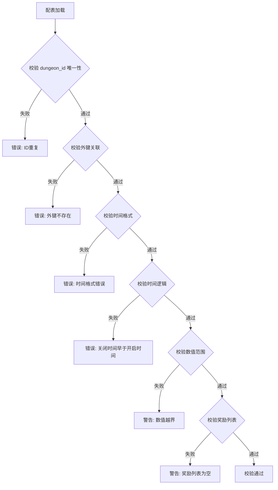

| 校验项 | 校验规则 | 错误级别 | 处理方式 |
|--------|----------|----------|----------|
| dungeon_id 唯一性 | 所有副本ID不可重复 | Error | 阻止加载 |
| 外键关联 | box.dungeon_id 必须存在于主表 | Error | 阻止加载 |
| 时间格式 | open_time/close_time 格式为 HH:mm | Error | 阻止加载 |
| 时间逻辑 | close_time 必须晚于 open_time | Error | 阻止加载 |
| 数值范围 | daily_count >= 0, energy_cost >= 0 | Error | 阻止加载 |
| 奖励列表 | reward_list 不能为空 | Warning | 允许加载 |

### 10.2 配表版本管理

```
版本号格式: v{major}.{minor}.{patch}
示例: v1.0.0

版本更新规则:
- major: 配表结构变更（新增/删除字段）
- minor: 数据内容变更（新增副本/修改数值）
- patch: 数据修复（修复错误数据）
```

---

## 十一、数据流向与加载时序

### 11.1 配表数据流向图

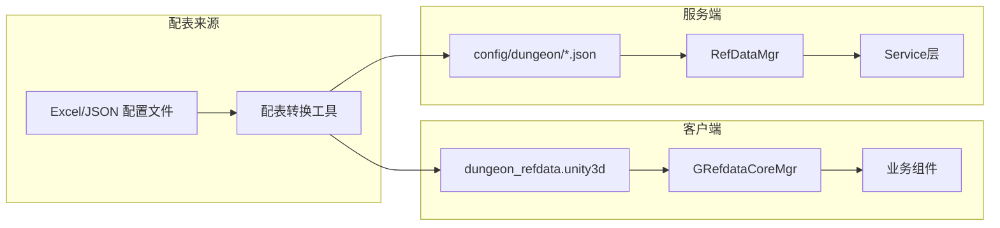

### 11.2 配表热更新流程

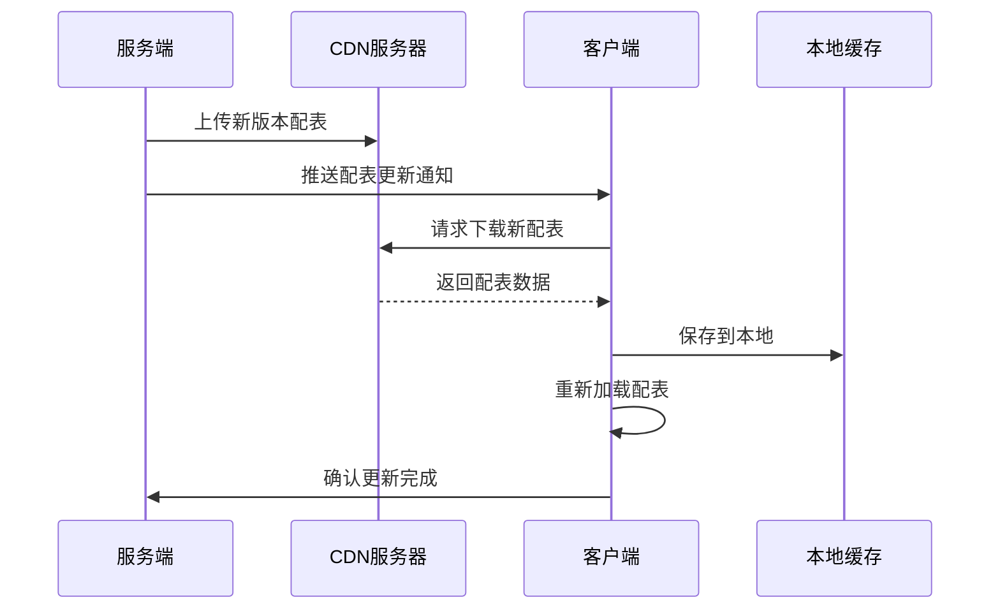

---

## 十二、字段完整索引说明

### 12.1 午间副本配表索引

| 配表类 | 主键字段 | 外键字段 | 索引字段 | 查询方法 |
|--------|----------|----------|----------|----------|
| MiddayDungeonRefObj | dungeon_id | chapter_id | - | getRef(dungeonId) |
| MiddayDungeonBoxRefObj | box_id | dungeon_id | dungeon_id | getListByDungeonId(dungeonId) |
| MiddayDungeonRewardRefObj | reward_id | dungeon_id | dungeon_id | getByDungeonId(dungeonId) |

### 12.2 晚间副本配表索引

| 配表类 | 主键字段 | 外键字段 | 索引字段 | 查询方法 |
|--------|----------|----------|----------|----------|
| EveningDungeonRefObj | dungeon_id | boss_id | - | getRef(dungeonId) |
| EveningDungeonBossRefObj | boss_id | - | - | getRef(bossId) |
| EveningDungeonRankRewardRefObj | reward_id | dungeon_id | dungeon_id, rank_min, rank_max | getByDungeonId(dungeonId) |
| EveningDungeonDamageRewardRefObj | reward_id | dungeon_id | dungeon_id | getByDungeonId(dungeonId) |

### 12.3 公会副本配表索引

| 配表类 | 主键字段 | 外键字段 | 索引字段 | 查询方法 |
|--------|----------|----------|----------|----------|
| GuildDungeonRefObj | dungeon_id | - | guild_level | getRef(dungeonId) |
| GuildDungeonLevelRefObj | (dungeon_id, level) | - | - | getByDungeonAndLevel(dungeonId, level) |
| GuildDungeonMonsterRefObj | monster_id | - | - | getRef(monsterId) |
| GuildDungeonRankRewardRefObj | reward_id | dungeon_id | dungeon_id | getByDungeonId(dungeonId) |

---

## 十三、配表工具函数

### 13.1 客户端工具函数

```csharp
/// <summary>
/// 副本配表工具类
/// </summary>
public static class DungeonRefHelper
{
    /// <summary>
    /// 获取午间副本的所有宝箱
    /// </summary>
    public static List<MiddayDungeonBoxRefObj> GetMiddayBoxes(int dungeonId)
    {
        return GRefdataCoreMgr.instance.middayDungeonBoxRefCore
            .getListByDungeonId(dungeonId)
            .OrderBy(b => b.need_attack_count)
            .ToList();
    }

    /// <summary>
    /// 检查玩家是否可以领取宝箱
    /// </summary>
    public static bool CanDrawBox(int dungeonId, int boxId, int attackCount)
    {
        var box = GRefdataCoreMgr.instance.middayDungeonBoxRefCore.getRef(boxId);
        if (box == null) return false;
        if (box.dungeon_id != dungeonId) return false;
        return attackCount >= box.need_attack_count;
    }

    /// <summary>
    /// 获取晚间副本排行奖励
    /// </summary>
    public static EveningDungeonRankRewardRefObj GetRankReward(int dungeonId, int rank)
    {
        var rewards = GRefdataCoreMgr.instance.eveningDungeonRankRewardRefCore
            .getByDungeonId(dungeonId);
        return rewards?.FirstOrDefault(r => rank >= r.rank_min && rank <= r.rank_max);
    }

    /// <summary>
    /// 获取公会副本当前等级配置
    /// </summary>
    public static GuildDungeonLevelRefObj GetCurrentLevelConfig(int dungeonId, int level)
    {
        return GRefdataCoreMgr.instance.guildDungeonLevelRefCore
            .getByDungeonAndLevel(dungeonId, level);
    }

    /// <summary>
    /// 获取公会副本怪物实际属性（应用倍率）
    /// </summary>
    public static (long hp, long atk, long def) GetMonsterRealStats(
        int monsterId, float hpMultiplier, float atkMultiplier)
    {
        var monster = GRefdataCoreMgr.instance.guildDungeonMonsterRefCore.getRef(monsterId);
        if (monster == null) return (0, 0, 0);

        return (
            (long)(monster.hp * hpMultiplier),
            (long)(monster.atk * atkMultiplier),
            monster.def
        );
    }

    /// <summary>
    /// 检查副本是否今日开放
    /// </summary>
    public static bool IsDungeonOpenToday(int dungeonId)
    {
        var dungeon = GRefdataCoreMgr.instance.guildDungeonRefCore.getRef(dungeonId);
        if (dungeon == null) return false;

        int dayOfWeek = (int)DateTime.Now.DayOfWeek;
        // 转换为周一=1的格式
        if (dayOfWeek == 0) dayOfWeek = 7;

        return dungeon.open_day_list.Contains(dayOfWeek);
    }

    /// <summary>
    /// 计算午间副本奖励预览
    /// </summary>
    public static List<NPCommonCostItem> PreviewMiddayRewards(int dungeonId)
    {
        var rewards = new List<NPCommonCostItem>();
        var rewardList = GRefdataCoreMgr.instance.middayDungeonRewardRefCore
            .getByDungeonId(dungeonId);

        foreach (var reward in rewardList)
        {
            if (reward.reward_type == 1) // 固定奖励
            {
                rewards.Add(new NPCommonCostItem
                {
                    type = 0,
                    id = reward.item_id,
                    count = reward.count_min
                });
            }
        }

        return rewards;
    }
}
```

### 13.2 服务端工具函数

```java
/**
 * 副本配表工具类
 */
public class DungeonRefHelper {

    /**
     * 获取晚间副本Boss实际血量（根据天数递增）
     */
    public static long getBossRealHp(int bossId, int dayIndex) {
        RefEveningDungeonBoss bossRef = RefEveningDungeonBoss.getMgr().get(bossId);
        if (bossRef == null) return 0;

        // 每7天增加50%，最高增加50%
        float dayMultiplier = Math.min(dayIndex / 7.0f, 1.0f) * 0.5f;
        return (long) (bossRef.getHp() * (1 + dayMultiplier));
    }

    /**
     * 计算公会副本升级消耗
     */
    public static NPCommonCostItem getUpgradeCost(int dungeonId, int currentLevel) {
        RefGuildDungeonLevel levelRef = RefGuildDungeonLevel.getByDungeonAndLevel(
            dungeonId, currentLevel + 1);
        if (levelRef == null) return null;
        return levelRef.getUpgradeCost();
    }

    /**
     * 检查公会副本是否可以升级
     */
    public static boolean canUpgrade(int dungeonId, int currentLevel) {
        RefGuildDungeon dungeonRef = RefGuildDungeon.getMgr().get(dungeonId);
        if (dungeonRef == null) return false;
        return currentLevel < dungeonRef.getMaxLevel();
    }

    /**
     * 获取排行奖励配置
     */
    public static RefEveningDungeonRankReward getRankReward(int dungeonId, int rank) {
        List<RefEveningDungeonRankReward> rewards =
            RefEveningDungeonRankReward.getByDungeonId(dungeonId);
        for (RefEveningDungeonRankReward reward : rewards) {
            if (rank >= reward.getRankMin() && rank <= reward.getRankMax()) {
                return reward;
            }
        }
        return null;
    }

    /**
     * 获取伤害奖励配置
     */
    public static List<RefEveningDungeonDamageReward> getDamageRewards(
            int dungeonId, long damage) {
        List<RefEveningDungeonDamageReward> result = new ArrayList<>();
        List<RefEveningDungeonDamageReward> rewards =
            RefEveningDungeonDamageReward.getByDungeonId(dungeonId);

        for (RefEveningDungeonDamageReward reward : rewards) {
            if (damage >= reward.getDamageMin() && damage <= reward.getDamageMax()) {
                result.add(reward);
            }
        }
        return result;
    }
}
```

---

## 十四、配表数据关系详解

### 14.1 午间副本数据关系图

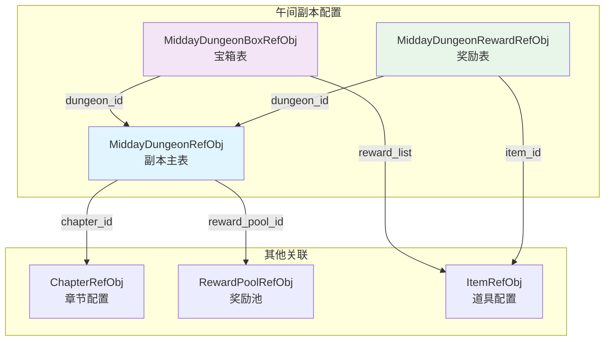

### 14.2 晚间副本数据关系图

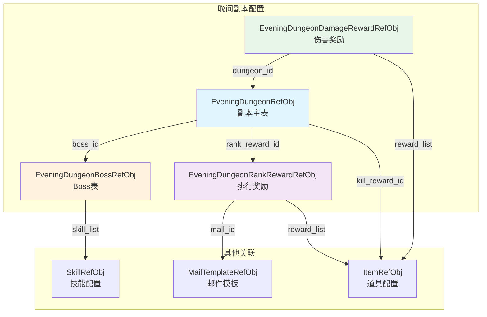

### 14.3 公会副本数据关系图

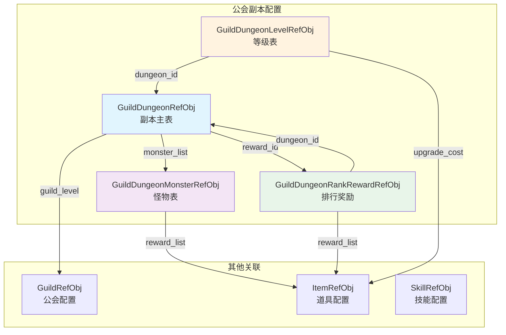

---

## 十五、配表查询流程图

### 15.1 午间副本宝箱查询流程

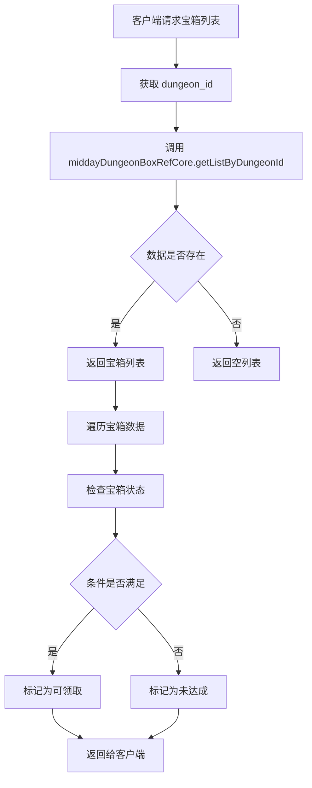

### 15.2 晚间副本排行奖励查询流程

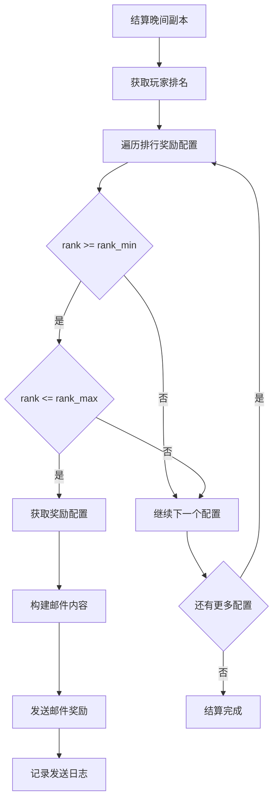

### 15.3 公会副本怪物初始化流程

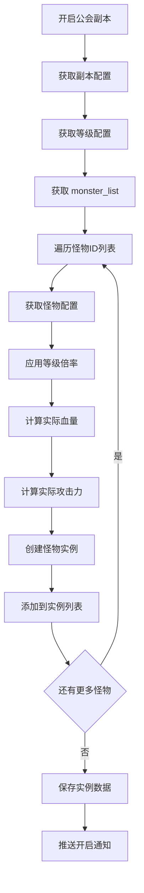

---

## 十六、完整字段列表汇总

### 16.1 午间副本完整字段列表

#### MiddayDungeonRefObj

| 序号 | 字段名 | 类型 | 必填 | 取值范围 | 默认值 | 说明 |
|------|--------|------|------|----------|--------|------|
| 1 | dungeon_id | int | 是 | > 0 | - | 副本ID |
| 2 | dungeon_name | string | 是 | 非空 | - | 副本名称 |
| 3 | dungeon_type | int | 是 | 1 | 1 | 副本类型 |
| 4 | open_time | string | 是 | HH:mm | - | 开启时间 |
| 5 | close_time | string | 是 | HH:mm | - | 关闭时间 |
| 6 | duration | int | 是 | > 0 | - | 持续时间(分钟) |
| 7 | daily_count | int | 是 | >= 0 | - | 每日次数 |
| 8 | energy_cost | int | 是 | >= 0 | - | 体力消耗 |
| 9 | recommended_power | long | 是 | >= 0 | 0 | 推荐战力 |
| 10 | reward_pool_id | int | 是 | > 0 | - | 奖励池ID |
| 11 | unlock_level | int | 是 | >= 0 | 0 | 解锁等级 |
| 12 | chapter_id | int | 是 | > 0 | - | 章节ID |
| 13 | icon | NPGTextureIndex | 否 | - | - | 图标 |
| 14 | bg_image | NPGTextureIndex | 否 | - | - | 背景图 |
| 15 | desc | string | 否 | - | "" | 描述 |

#### MiddayDungeonBoxRefObj

| 序号 | 字段名 | 类型 | 必填 | 取值范围 | 默认值 | 说明 |
|------|--------|------|------|----------|--------|------|
| 1 | box_id | int | 是 | > 0 | - | 宝箱ID |
| 2 | dungeon_id | int | 是 | > 0 | - | 副本ID |
| 3 | box_quality | int | 是 | 1-5 | 1 | 宝箱品质 |
| 4 | reward_list | List | 是 | 非空 | - | 奖励列表 |
| 5 | draw_condition | NPPlayerCondition | 否 | - | - | 领取条件 |
| 6 | need_attack_count | int | 是 | > 0 | - | 需要攻击次数 |
| 7 | icon | NPGTextureIndex | 否 | - | - | 图标 |
| 8 | desc | string | 否 | - | "" | 描述 |

#### MiddayDungeonRewardRefObj

| 序号 | 字段名 | 类型 | 必填 | 取值范围 | 默认值 | 说明 |
|------|--------|------|------|----------|--------|------|
| 1 | reward_id | int | 是 | > 0 | - | 奖励ID |
| 2 | dungeon_id | int | 是 | > 0 | - | 副本ID |
| 3 | reward_type | int | 是 | 1-3 | - | 奖励类型 |
| 4 | item_id | long | 是 | > 0 | - | 物品ID |
| 5 | count_min | int | 是 | > 0 | - | 最小数量 |
| 6 | count_max | int | 是 | >= count_min | - | 最大数量 |
| 7 | drop_rate | float | 是 | 0-1 | - | 掉落率 |
| 8 | guarantee_count | int | 是 | >= 0 | 0 | 保底次数 |

### 16.2 晚间副本完整字段列表

#### EveningDungeonRefObj

| 序号 | 字段名 | 类型 | 必填 | 取值范围 | 默认值 | 说明 |
|------|--------|------|------|----------|--------|------|
| 1 | dungeon_id | int | 是 | > 0 | - | 副本ID |
| 2 | dungeon_name | string | 是 | 非空 | - | 副本名称 |
| 3 | dungeon_type | int | 是 | 2 | 2 | 副本类型 |
| 4 | open_time | string | 是 | HH:mm | - | 开启时间 |
| 5 | close_time | string | 是 | HH:mm | - | 关闭时间 |
| 6 | duration | int | 是 | > 0 | - | 持续时间(分钟) |
| 7 | boss_id | int | 是 | > 0 | - | Boss ID |
| 8 | unlock_level | int | 是 | >= 0 | 0 | 解锁等级 |
| 9 | daily_count | int | 是 | >= -1 | -1 | 每日次数(-1无限制) |
| 10 | energy_cost | int | 是 | >= 0 | 0 | 体力消耗 |
| 11 | rank_reward_id | int | 是 | > 0 | - | 排行奖励ID |
| 12 | kill_reward_id | int | 是 | > 0 | - | 击杀奖励ID |
| 13 | icon | NPGTextureIndex | 否 | - | - | 图标 |
| 14 | bg_image | NPGTextureIndex | 否 | - | - | 背景图 |
| 15 | desc | string | 否 | - | "" | 描述 |

#### EveningDungeonBossRefObj

| 序号 | 字段名 | 类型 | 必填 | 取值范围 | 默认值 | 说明 |
|------|--------|------|------|----------|--------|------|
| 1 | boss_id | int | 是 | > 0 | - | Boss ID |
| 2 | boss_name | string | 是 | 非空 | - | Boss名称 |
| 3 | boss_level | int | 是 | > 0 | - | Boss等级 |
| 4 | hp | long | 是 | > 0 | - | 基础血量 |
| 5 | atk | long | 是 | >= 0 | 0 | 攻击力 |
| 6 | def | long | 是 | >= 0 | 0 | 防御力 |
| 7 | boss_type | int | 是 | 1-10 | 1 | Boss类型 |
| 8 | skill_list | List | 否 | - | [] | 技能列表 |
| 9 | reward_list | List | 否 | - | [] | 击杀奖励 |
| 10 | model_id | NPGGoIndex | 否 | - | - | 模型ID |
| 11 | icon | NPGTextureIndex | 否 | - | - | 图标 |
| 12 | desc | string | 否 | - | "" | 描述 |

#### EveningDungeonRankRewardRefObj

| 序号 | 字段名 | 类型 | 必填 | 取值范围 | 默认值 | 说明 |
|------|--------|------|------|----------|--------|------|
| 1 | reward_id | int | 是 | > 0 | - | 奖励ID |
| 2 | dungeon_id | int | 是 | > 0 | - | 副本ID |
| 3 | rank_min | int | 是 | >= 1 | - | 最低排名 |
| 4 | rank_max | int | 是 | >= rank_min | - | 最高排名 |
| 5 | reward_list | List | 是 | 非空 | - | 奖励列表 |
| 6 | mail_id | int | 是 | > 0 | - | 邮件模板ID |
| 7 | mail_title | string | 否 | - | "" | 邮件标题 |
| 8 | mail_content | string | 否 | - | "" | 邮件内容 |

#### EveningDungeonDamageRewardRefObj

| 序号 | 字段名 | 类型 | 必填 | 取值范围 | 默认值 | 说明 |
|------|--------|------|------|----------|--------|------|
| 1 | reward_id | int | 是 | > 0 | - | 奖励ID |
| 2 | dungeon_id | int | 是 | > 0 | - | 副本ID |
| 3 | damage_min | long | 是 | >= 0 | - | 最低伤害 |
| 4 | damage_max | long | 是 | >= damage_min | - | 最高伤害 |
| 5 | reward_list | List | 是 | 非空 | - | 奖励列表 |

### 16.3 公会副本完整字段列表

#### GuildDungeonRefObj

| 序号 | 字段名 | 类型 | 必填 | 取值范围 | 默认值 | 说明 |
|------|--------|------|------|----------|--------|------|
| 1 | dungeon_id | int | 是 | > 0 | - | 副本ID |
| 2 | dungeon_name | string | 是 | 非空 | - | 副本名称 |
| 3 | dungeon_type | int | 是 | 3 | 3 | 副本类型 |
| 4 | guild_level | int | 是 | >= 1 | - | 公会等级需求 |
| 5 | max_level | int | 是 | >= 1 | - | 最大等级 |
| 6 | monster_list | List | 是 | 非空 | - | 怪物ID列表 |
| 7 | auto_start | bool | 是 | - | false | 自动开始 |
| 8 | open_day_list | List | 是 | 1-7 | - | 开放日期列表 |
| 9 | reward_id | int | 是 | > 0 | - | 奖励ID |
| 10 | open_time | string | 否 | HH:mm | "" | 自动开启时间 |
| 11 | duration | int | 否 | > 0 | 24 | 持续时间(小时) |
| 12 | icon | NPGTextureIndex | 否 | - | - | 图标 |
| 13 | desc | string | 否 | - | "" | 描述 |

#### GuildDungeonLevelRefObj

| 序号 | 字段名 | 类型 | 必填 | 取值范围 | 默认值 | 说明 |
|------|--------|------|------|----------|--------|------|
| 1 | dungeon_id | int | 是 | > 0 | - | 副本ID |
| 2 | level | int | 是 | >= 1 | - | 副本等级 |
| 3 | monster_count | int | 是 | > 0 | - | 怪物数量 |
| 4 | hp_multiplier | float | 是 | >= 0 | 1.0 | 血量倍率 |
| 5 | atk_multiplier | float | 是 | >= 0 | 1.0 | 攻击倍率 |
| 6 | reward_list | List | 否 | - | [] | 通关奖励 |
| 7 | upgrade_cost | NPCommonCostItem | 是 | - | - | 升级消耗 |

#### GuildDungeonMonsterRefObj

| 序号 | 字段名 | 类型 | 必填 | 取值范围 | 默认值 | 说明 |
|------|--------|------|------|----------|--------|------|
| 1 | monster_id | int | 是 | > 0 | - | 怪物ID |
| 2 | monster_name | string | 是 | 非空 | - | 怪物名称 |
| 3 | monster_level | int | 是 | > 0 | - | 怪物等级 |
| 4 | hp | long | 是 | > 0 | - | 基础血量 |
| 5 | atk | long | 是 | >= 0 | 0 | 攻击力 |
| 6 | def | long | 是 | >= 0 | 0 | 防御力 |
| 7 | monster_type | int | 是 | 1-5 | 1 | 怪物类型 |
| 8 | reward_list | List | 否 | - | [] | 击杀奖励 |
| 9 | model_id | NPGGoIndex | 否 | - | - | 模型ID |
| 10 | icon | NPGTextureIndex | 否 | - | - | 图标 |
| 11 | desc | string | 否 | - | "" | 描述 |

#### GuildDungeonRankRewardRefObj

| 序号 | 字段名 | 类型 | 必填 | 取值范围 | 默认值 | 说明 |
|------|--------|------|------|----------|--------|------|
| 1 | reward_id | int | 是 | > 0 | - | 奖励ID |
| 2 | dungeon_id | int | 是 | > 0 | - | 副本ID |
| 3 | rank_min | int | 是 | >= 1 | - | 最低排名 |
| 4 | rank_max | int | 是 | >= rank_min | - | 最高排名 |
| 5 | reward_list | List | 是 | 非空 | - | 奖励列表 |

---

## 十七、配表设计最佳实践

### 17.1 配表设计原则

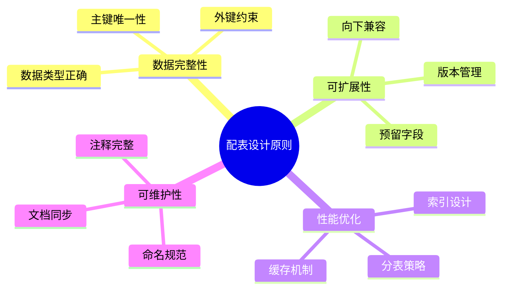

### 17.2 配表变更流程

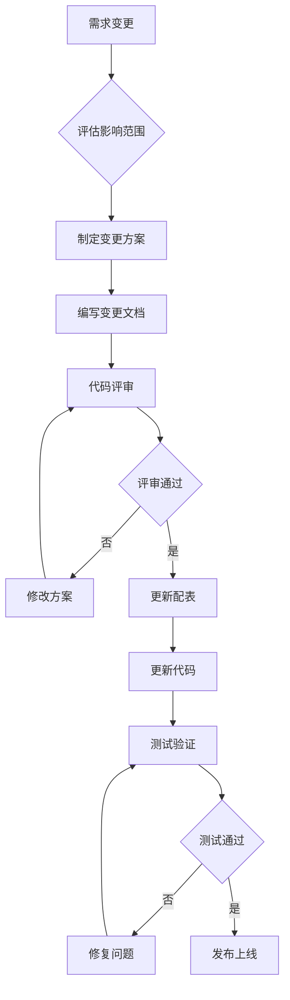

### 17.3 配表热更新机制

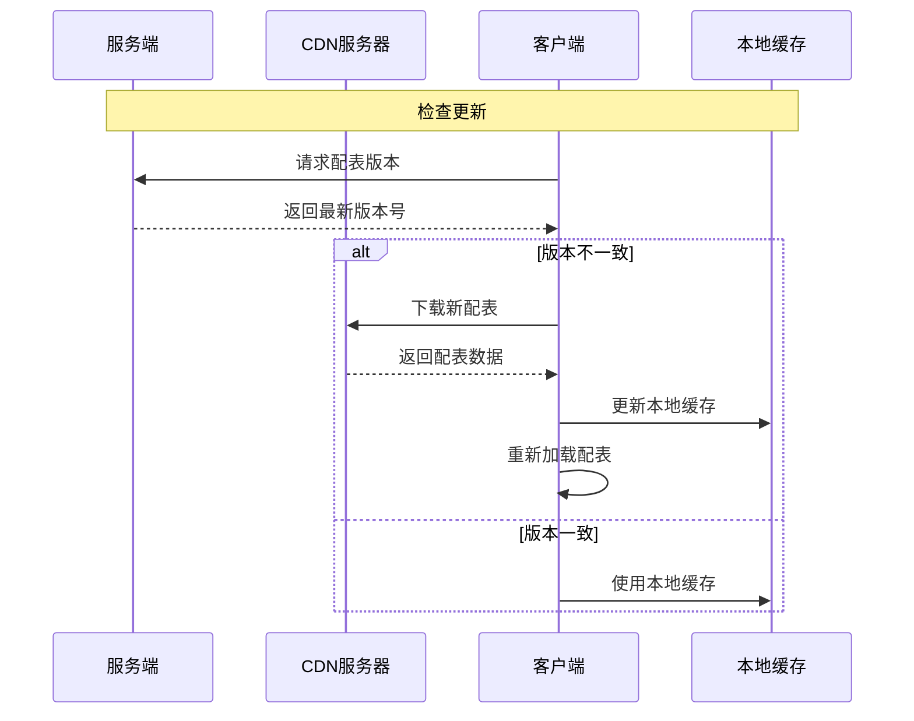

### 17.4 配表数据校验代码

```csharp
/// <summary>
/// 配表数据校验器
/// </summary>
public static class DungeonRefDataValidator
{
    /// <summary>
    /// 校验所有副本配表
    /// </summary>
    public static List<string> ValidateAll()
    {
        var errors = new List<string>();

        // 校验午间副本
        ValidateMiddayDungeon(errors);

        // 校验晚间副本
        ValidateEveningDungeon(errors);

        // 校验公会副本
        ValidateGuildDungeon(errors);

        return errors;
    }

    private static void ValidateMiddayDungeon(List<string> errors)
    {
        var dungeons = GRefdataCoreMgr.instance.middayDungeonRefCore.getAll();
        var dungeonIds = new HashSet<int>();

        foreach (var dungeon in dungeons)
        {
            // 检查ID唯一性
            if (dungeonIds.Contains(dungeon.dungeon_id))
            {
                errors.Add($"[MiddayDungeon] 重复的dungeon_id: {dungeon.dungeon_id}");
            }
            dungeonIds.Add(dungeon.dungeon_id);

            // 检查时间格式
            if (!IsValidTimeFormat(dungeon.open_time))
            {
                errors.Add($"[MiddayDungeon] dungeon_id={dungeon.dungeon_id} open_time格式错误: {dungeon.open_time}");
            }

            // 检查数值范围
            if (dungeon.daily_count < 0)
            {
                errors.Add($"[MiddayDungeon] dungeon_id={dungeon.dungeon_id} daily_count不能为负数");
            }

            // 检查宝箱关联
            var boxes = GRefdataCoreMgr.instance.middayDungeonBoxRefCore.getListByDungeonId(dungeon.dungeon_id);
            foreach (var box in boxes)
            {
                if (box.reward_list == null || box.reward_list.Count == 0)
                {
                    errors.Add($"[MiddayDungeonBox] box_id={box.box_id} reward_list为空");
                }
            }
        }
    }

    private static void ValidateEveningDungeon(List<string> errors)
    {
        var dungeons = GRefdataCoreMgr.instance.eveningDungeonRefCore.getAll();

        foreach (var dungeon in dungeons)
        {
            // 检查Boss关联
            var boss = GRefdataCoreMgr.instance.eveningDungeonBossRefCore.getRef(dungeon.boss_id);
            if (boss == null)
            {
                errors.Add($"[EveningDungeon] dungeon_id={dungeon.dungeon_id} boss_id={dungeon.boss_id} Boss不存在");
            }

            // 检查排行奖励
            var rankRewards = GRefdataCoreMgr.instance.eveningDungeonRankRewardRefCore.getByDungeonId(dungeon.dungeon_id);
            if (rankRewards == null || rankRewards.Count == 0)
            {
                errors.Add($"[EveningDungeon] dungeon_id={dungeon.dungeon_id} 缺少排行奖励配置");
            }
        }
    }

    private static void ValidateGuildDungeon(List<string> errors)
    {
        var dungeons = GRefdataCoreMgr.instance.guildDungeonRefCore.getAll();

        foreach (var dungeon in dungeons)
        {
            // 检查怪物列表
            if (dungeon.monster_list == null || dungeon.monster_list.Count == 0)
            {
                errors.Add($"[GuildDungeon] dungeon_id={dungeon.dungeon_id} monster_list为空");
                continue;
            }

            // 检查怪物ID有效性
            foreach (var monsterId in dungeon.monster_list)
            {
                var monster = GRefdataCoreMgr.instance.guildDungeonMonsterRefCore.getRef(monsterId);
                if (monster == null)
                {
                    errors.Add($"[GuildDungeon] dungeon_id={dungeon.dungeon_id} monster_id={monsterId} 怪物不存在");
                }
            }

            // 检查等级配置完整性
            for (int level = 1; level <= dungeon.max_level; level++)
            {
                var levelRef = GRefdataCoreMgr.instance.guildDungeonLevelRefCore.getByDungeonAndLevel(dungeon.dungeon_id, level);
                if (levelRef == null)
                {
                    errors.Add($"[GuildDungeon] dungeon_id={dungeon.dungeon_id} level={level} 缺少等级配置");
                }
            }
        }
    }

    private static bool IsValidTimeFormat(string time)
    {
        if (string.IsNullOrEmpty(time)) return false;
        var parts = time.Split(':');
        if (parts.Length != 2) return false;
        if (!int.TryParse(parts[0], out int hour) || hour < 0 || hour > 23) return false;
        if (!int.TryParse(parts[1], out int minute) || minute < 0 || minute > 59) return false;
        return true;
    }
}
```

---

*文档生成时间: 2026-04-11*
