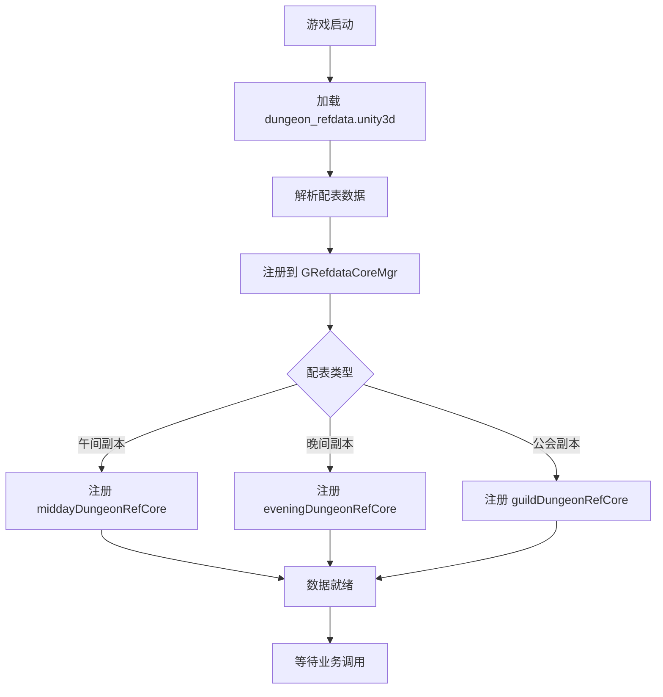

# 副本模块数据配表文档

## 配表概述

副本模块相关的配置数据存储在 `dungeon_refdata.unity3d` 资源文件中，客户端通过 `GRefdataCoreMgr` 访问配置数据。

**资源路径**: `refdata/dungeon_refdata.unity3d`

---

## 一、配表关系总览


---

## 二、午间副本配表

### 2.1 MiddayDungeonRefObj - 午间副本主表

**文件路径**: `dungeon_refdata.unity3d` -> `midday_dungeon`

**配置类**: `GSOMiddayDungeonRefSet`

| 序号 | 字段名 | 类型 | 说明 | 取值范围 | 必填 | 默认值 | 示例 |
|------|--------|------|------|----------|------|--------|------|
| 1 | dungeon_id | int | 副本ID（唯一标识） | > 0 | 是 | - | 1 |
| 2 | dungeon_name | string | 副本名称 | 非空 | 是 | - | "午间试炼" |
| 3 | dungeon_type | int | 副本类型 | 1 | 是 | 1 | 1 |
| 4 | open_time | string | 开启时间（HH:mm） | 有效时间 | 是 | - | "12:00" |
| 5 | close_time | string | 关闭时间（HH:mm） | 有效时间 | 是 | - | "14:00" |
| 6 | duration | int | 持续时间（分钟） | > 0 | 是 | - | 120 |
| 7 | daily_count | int | 每日挑战次数 | >= 0 | 是 | - | 3 |
| 8 | energy_cost | int | 体力消耗 | >= 0 | 是 | - | 10 |
| 9 | recommended_power | long | 推荐战力 | >= 0 | 是 | 0 | 30000 |
| 10 | reward_pool_id | int | 奖励池ID | > 0 | 是 | - | 1001 |
| 11 | unlock_level | int | 解锁等级 | >= 0 | 是 | 0 | 10 |
| 12 | chapter_id | int | 所属章节 | > 0 | 是 | - | 1 |
| 13 | icon | NPGTextureIndex | 副本图标 | - | 否 | - | - |
| 14 | bg_image | NPGTextureIndex | 背景图片 | - | 否 | - | - |
| 15 | desc | string | 副本描述 | - | 否 | "" | "每日限时开放的副本" |

**索引说明**:
- 主键: `dungeon_id`
- 服务端查询: 按章节查询 `chapter_id`

---

### 2.2 MiddayDungeonBoxRefObj - 午间副本宝箱表

**文件路径**: `dungeon_refdata.unity3d` -> `midday_dungeon_box`

**配置类**: `GSOMiddayDungeonBoxRefSet`

| 序号 | 字段名 | 类型 | 说明 | 取值范围 | 必填 | 默认值 | 示例 |
|------|--------|------|------|----------|------|--------|------|
| 1 | box_id | int | 宝箱ID（唯一标识） | > 0 | 是 | - | 1 |
| 2 | dungeon_id | int | 所属副本ID | > 0 | 是 | - | 1 |
| 3 | box_quality | int | 宝箱品质（1-5星） | 1-5 | 是 | 1 | 3 |
| 4 | reward_list | List\<NPCommonCostItem\> | 奖励列表 | 非空 | 是 | - | [{SILVER, 1000}] |
| 5 | draw_condition | NPPlayerCondition | 领取条件 | - | 否 | - | - |
| 6 | need_attack_count | int | 需要攻击次数 | > 0 | 是 | - | 5 |
| 7 | icon | NPGTextureIndex | 宝箱图标 | - | 否 | - | - |
| 8 | desc | string | 宝箱描述 | - | 否 | "" | "累计攻击5次可领取" |

**索引说明**:
- 主键: `box_id`
- 外键: `dungeon_id` -> MiddayDungeonRefObj

**NPCommonCostItem 结构**:
| 字段名 | 类型 | 说明 |
|--------|------|------|
| type | int | 物品类型（0货币，1道具，2装备） |
| id | long | 物品ID |
| count | int | 数量 |

---

### 2.3 MiddayDungeonRewardRefObj - 午间副本奖励表

**文件路径**: `dungeon_refdata.unity3d` -> `midday_dungeon_reward`

**配置类**: `GSOMiddayDungeonRewardRefSet`

| 序号 | 字段名 | 类型 | 说明 | 取值范围 | 必填 | 默认值 | 示例 |
|------|--------|------|------|----------|------|--------|------|
| 1 | reward_id | int | 奖励ID（唯一标识） | > 0 | 是 | - | 1 |
| 2 | dungeon_id | int | 所属副本ID | > 0 | 是 | - | 1 |
| 3 | reward_type | int | 奖励类型 | 1-3 | 是 | - | 1 |
| 4 | item_id | long | 物品ID | > 0 | 是 | - | 10001 |
| 5 | count_min | int | 最小数量 | > 0 | 是 | - | 1 |
| 6 | count_max | int | 最大数量 | >= count_min | 是 | - | 5 |
| 7 | drop_rate | float | 掉落概率 | 0-1 | 是 | - | 0.5 |
| 8 | guarantee_count | int | 保底次数 | >= 0 | 是 | 0 | 0 |

**奖励类型说明**:
| 值 | 说明 |
|----|------|
| 1 | 固定奖励 |
| 2 | 随机奖励 |
| 3 | 首通奖励 |

**索引说明**:
- 主键: `reward_id`
- 外键: `dungeon_id` -> MiddayDungeonRefObj

---

## 三、晚间副本配表

### 3.1 EveningDungeonRefObj - 晚间副本主表

**文件路径**: `dungeon_refdata.unity3d` -> `evening_dungeon`

**配置类**: `GSOEveningDungeonRefSet`

| 序号 | 字段名 | 类型 | 说明 | 取值范围 | 必填 | 默认值 | 示例 |
|------|--------|------|------|----------|------|--------|------|
| 1 | dungeon_id | int | 副本ID（唯一标识） | > 0 | 是 | - | 1 |
| 2 | dungeon_name | string | 副本名称 | 非空 | 是 | - | "晚间世界Boss" |
| 3 | dungeon_type | int | 副本类型 | 2 | 是 | 2 | 2 |
| 4 | open_time | string | 开启时间（HH:mm） | 有效时间 | 是 | - | "20:00" |
| 5 | close_time | string | 关闭时间（HH:mm） | 有效时间 | 是 | - | "22:00" |
| 6 | duration | int | 持续时间（分钟） | > 0 | 是 | - | 120 |
| 7 | boss_id | int | Boss ID | > 0 | 是 | - | 1001 |
| 8 | unlock_level | int | 解锁等级 | >= 0 | 是 | 0 | 20 |
| 9 | daily_count | int | 每日挑战次数 | >= -1 | 是 | -1 | -1（无限制） |
| 10 | energy_cost | int | 体力消耗 | >= 0 | 是 | 0 | 0 |
| 11 | rank_reward_id | int | 排行榜奖励ID | > 0 | 是 | - | 2001 |
| 12 | kill_reward_id | int | 击杀奖励ID | > 0 | 是 | - | 2002 |
| 13 | icon | NPGTextureIndex | 副本图标 | - | 否 | - | - |
| 14 | bg_image | NPGTextureIndex | 背景图片 | - | 否 | - | - |
| 15 | desc | string | 副本描述 | - | 否 | "" | "全服共同挑战世界Boss" |

**索引说明**:
- 主键: `dungeon_id`
- 关联: `boss_id` -> EveningDungeonBossRefObj

---

### 3.2 EveningDungeonBossRefObj - 晚间副本Boss表

**文件路径**: `dungeon_refdata.unity3d` -> `evening_dungeon_boss`

**配置类**: `GSOEveningDungeonBossRefSet`

| 序号 | 字段名 | 类型 | 说明 | 取值范围 | 必填 | 默认值 | 示例 |
|------|--------|------|------|----------|------|--------|------|
| 1 | boss_id | int | Boss ID（唯一标识） | > 0 | 是 | - | 1001 |
| 2 | boss_name | string | Boss名称 | 非空 | 是 | - | "暗影巨龙" |
| 3 | boss_level | int | Boss等级 | > 0 | 是 | - | 50 |
| 4 | hp | long | 基础血量 | > 0 | 是 | - | 100000000 |
| 5 | atk | long | 攻击力 | >= 0 | 是 | 0 | 50000 |
| 6 | def | long | 防御力 | >= 0 | 是 | 0 | 30000 |
| 7 | boss_type | int | Boss类型 | 1-10 | 是 | 1 | 1 |
| 8 | skill_list | List\<long\> | Boss技能列表 | - | 否 | [] | [1001, 1002] |
| 9 | reward_list | List\<NPCommonCostItem\> | 击杀奖励列表 | - | 否 | [] | [{DIAMOND, 100}] |
| 10 | model_id | NPGGoIndex | 模型ID | - | 否 | - | - |
| 11 | icon | NPGTextureIndex | Boss图标 | - | 否 | - | - |
| 12 | desc | string | Boss描述 | - | 否 | "" | "传说中的暗影巨龙" |

**Boss类型说明**:
| 值 | 说明 |
|----|------|
| 1 | 普通Boss |
| 2 | 精英Boss |
| 3 | 世界Boss |
| 4 | 活动Boss |

---

### 3.3 EveningDungeonRankRewardRefObj - 晚间副本排行奖励表

**文件路径**: `dungeon_refdata.unity3d` -> `evening_dungeon_rank_reward`

**配置类**: `GSOEveningDungeonRankRewardRefSet`

| 序号 | 字段名 | 类型 | 说明 | 取值范围 | 必填 | 默认值 | 示例 |
|------|--------|------|------|----------|------|--------|------|
| 1 | reward_id | int | 奖励ID（唯一标识） | > 0 | 是 | - | 2001 |
| 2 | dungeon_id | int | 所属副本ID | > 0 | 是 | - | 1 |
| 3 | rank_min | int | 最低排名 | >= 1 | 是 | - | 1 |
| 4 | rank_max | int | 最高排名 | >= rank_min | 是 | - | 1 |
| 5 | reward_list | List\<NPCommonCostItem\> | 奖励列表 | 非空 | 是 | - | [{DIAMOND, 500}] |
| 6 | mail_id | int | 邮件模板ID | > 0 | 是 | - | 1001 |
| 7 | mail_title | string | 邮件标题 | - | 否 | "" | "晚间副本排行奖励" |
| 8 | mail_content | string | 邮件内容 | - | 否 | "" | "恭喜您获得排行奖励" |

**索引说明**:
- 主键: `reward_id`
- 外键: `dungeon_id` -> EveningDungeonRefObj

---

### 3.4 EveningDungeonDamageRewardRefObj - 晚间副本伤害奖励表

**文件路径**: `dungeon_refdata.unity3d` -> `evening_dungeon_damage_reward`

**配置类**: `GSOEveningDungeonDamageRewardRefSet`

| 序号 | 字段名 | 类型 | 说明 | 取值范围 | 必填 | 默认值 | 示例 |
|------|--------|------|------|----------|------|--------|------|
| 1 | reward_id | int | 奖励ID（唯一标识） | > 0 | 是 | - | 1 |
| 2 | dungeon_id | int | 所属副本ID | > 0 | 是 | - | 1 |
| 3 | damage_min | long | 最低伤害 | >= 0 | 是 | - | 100000 |
| 4 | damage_max | long | 最高伤害 | >= damage_min | 是 | - | 500000 |
| 5 | reward_list | List\<NPCommonCostItem\> | 奖励列表 | 非空 | 是 | - | [{SILVER, 1000}] |

---

## 四、公会副本配表

### 4.1 GuildDungeonRefObj - 公会副本主表

**文件路径**: `dungeon_refdata.unity3d` -> `guild_dungeon`

**配置类**: `GSOGuildDungeonRefSet`

| 序号 | 字段名 | 类型 | 说明 | 取值范围 | 必填 | 默认值 | 示例 |
|------|--------|------|------|----------|------|--------|------|
| 1 | dungeon_id | int | 副本ID（唯一标识） | > 0 | 是 | - | 1 |
| 2 | dungeon_name | string | 副本名称 | 非空 | 是 | - | "公会试炼" |
| 3 | dungeon_type | int | 副本类型 | 3 | 是 | 3 | 3 |
| 4 | guild_level | int | 公会等级需求 | >= 1 | 是 | - | 3 |
| 5 | max_level | int | 副本最大等级 | >= 1 | 是 | - | 10 |
| 6 | monster_list | List\<int\> | 怪物ID列表 | 非空 | 是 | - | [1001, 1002, 1003] |
| 7 | auto_start | bool | 是否自动开始 | - | 是 | false | true |
| 8 | open_day_list | List\<int\> | 开放日期（周几） | 1-7 | 是 | - | [1, 3, 5] |
| 9 | reward_id | int | 奖励ID | > 0 | 是 | - | 3001 |
| 10 | open_time | string | 自动开启时间（HH:mm） | - | 否 | "" | "20:00" |
| 11 | duration | int | 持续时间（小时） | > 0 | 否 | 24 | 24 |
| 12 | icon | NPGTextureIndex | 副本图标 | - | 否 | - | - |
| 13 | desc | string | 副本描述 | - | 否 | "" | "公会成员协作挑战" |

**开放日期说明**:
| 值 | 说明 |
|----|------|
| 1 | 周一 |
| 2 | 周二 |
| 3 | 周三 |
| 4 | 周四 |
| 5 | 周五 |
| 6 | 周六 |
| 7 | 周日 |

---

### 4.2 GuildDungeonLevelRefObj - 公会副本等级表

**文件路径**: `dungeon_refdata.unity3d` -> `guild_dungeon_level`

**配置类**: `GSOGuildDungeonLevelRefSet`

| 序号 | 字段名 | 类型 | 说明 | 取值范围 | 必填 | 默认值 | 示例 |
|------|--------|------|------|----------|------|--------|------|
| 1 | dungeon_id | int | 副本ID | > 0 | 是 | - | 1 |
| 2 | level | int | 副本等级 | >= 1 | 是 | - | 1 |
| 3 | monster_count | int | 怪物数量 | > 0 | 是 | - | 3 |
| 4 | hp_multiplier | float | 血量倍率 | >= 0 | 是 | 1.0 | 1.0 |
| 5 | atk_multiplier | float | 攻击倍率 | >= 0 | 是 | 1.0 | 1.0 |
| 6 | reward_list | List\<NPCommonCostItem\> | 通关奖励 | - | 否 | [] | [{GUILD_COIN, 100}] |
| 7 | upgrade_cost | NPCommonCostItem | 升级消耗 | - | 是 | - | {GUILD_COIN, 500} |

**复合主键**: `(dungeon_id, level)`

---

### 4.3 GuildDungeonMonsterRefObj - 公会副本怪物表

**文件路径**: `dungeon_refdata.unity3d` -> `guild_dungeon_monster`

**配置类**: `GSOGuildDungeonMonsterRefSet`

| 序号 | 字段名 | 类型 | 说明 | 取值范围 | 必填 | 默认值 | 示例 |
|------|--------|------|------|----------|------|--------|------|
| 1 | monster_id | int | 怪物ID（唯一标识） | > 0 | 是 | - | 1001 |
| 2 | monster_name | string | 怪物名称 | 非空 | 是 | - | "哥布林战士" |
| 3 | monster_level | int | 怪物等级 | > 0 | 是 | - | 30 |
| 4 | hp | long | 基础血量 | > 0 | 是 | - | 500000 |
| 5 | atk | long | 攻击力 | >= 0 | 是 | 0 | 10000 |
| 6 | def | long | 防御力 | >= 0 | 是 | 0 | 5000 |
| 7 | monster_type | int | 怪物类型 | 1-5 | 是 | 1 | 1 |
| 8 | reward_list | List\<NPCommonCostItem\> | 击杀奖励 | - | 否 | [] | [{GUILD_COIN, 50}] |
| 9 | model_id | NPGGoIndex | 模型ID | - | 否 | - | - |
| 10 | icon | NPGTextureIndex | 怪物图标 | - | 否 | - | - |
| 11 | desc | string | 怪物描述 | - | 否 | "" | "凶猛的哥布林战士" |

**怪物类型说明**:
| 值 | 说明 |
|----|------|
| 1 | 普通怪物 |
| 2 | 精英怪物 |
| 3 | 小Boss |
| 4 | 大Boss |
| 5 | 隐藏怪物 |

---

### 4.4 GuildDungeonRankRewardRefObj - 公会副本排行奖励表

**文件路径**: `dungeon_refdata.unity3d` -> `guild_dungeon_rank_reward`

**配置类**: `GSOGuildDungeonRankRewardRefSet`

| 序号 | 字段名 | 类型 | 说明 | 取值范围 | 必填 | 默认值 | 示例 |
|------|--------|------|------|----------|------|--------|------|
| 1 | reward_id | int | 奖励ID（唯一标识） | > 0 | 是 | - | 3001 |
| 2 | dungeon_id | int | 所属副本ID | > 0 | 是 | - | 1 |
| 3 | rank_min | int | 最低排名 | >= 1 | 是 | - | 1 |
| 4 | rank_max | int | 最高排名 | >= rank_min | 是 | - | 3 |
| 5 | reward_list | List\<NPCommonCostItem\> | 奖励列表 | 非空 | 是 | - | [{DIAMOND, 100}] |

---

## 五、副本状态枚举

### 5.1 EDungeonState - 副本状态

```csharp
/// <summary>
/// 副本状态枚举
/// </summary>
public enum EDungeonState
{
    /// <summary>
    /// 未开启
    /// </summary>
    CLOSED = 0,

    /// <summary>
    /// 开启中
    /// </summary>
    OPENING = 1,

    /// <summary>
    /// 已结束
    /// </summary>
    ENDED = 2
}
```

### 5.2 EDungeonType - 副本类型

```csharp
/// <summary>
/// 副本类型枚举
/// </summary>
public enum EDungeonType
{
    /// <summary>
    /// 午间副本
    /// </summary>
    MIDDAY = 1,

    /// <summary>
    /// 晚间副本
    /// </summary>
    EVENING = 2,

    /// <summary>
    /// 公会副本
    /// </summary>
    GUILD = 3,

    /// <summary>
    /// 章节副本
    /// </summary>
    CHAPTER = 4,

    /// <summary>
    /// 无尽副本
    /// </summary>
    ENDLESS = 5
}
```

### 5.3 EBoxState - 宝箱状态

```csharp
/// <summary>
/// 宝箱状态枚举
/// </summary>
public enum EBoxState
{
    /// <summary>
    /// 未达成（条件未满足）
    /// </summary>
    LOCKED = 0,

    /// <summary>
    /// 可领取（条件已满足）
    /// </summary>
    UNLOCKED = 1,

    /// <summary>
    /// 已领取
    /// </summary>
    DRAWN = 2
}
```

### 5.4 EMonsterState - 怪物状态

```csharp
/// <summary>
/// 怪物状态枚举
/// </summary>
public enum EMonsterState
{
    /// <summary>
    /// 存活
    /// </summary>
    ALIVE = 0,

    /// <summary>
    /// 已死亡
    /// </summary>
    DEAD = 1
}
```

### 5.5 EBossState - Boss状态

```csharp
/// <summary>
/// Boss状态枚举
/// </summary>
public enum EBossState
{
    /// <summary>
    /// 存活
    /// </summary>
    ALIVE = 0,

    /// <summary>
    /// 已死亡
    /// </summary>
    DEAD = 1
}
```

---

## 六、配表加载方式

### 6.1 客户端访问方式

```csharp
// 获取午间副本静态配置
MiddayDungeonRefObj dungeonRef = GRefdataCoreMgr.instance.middayDungeonRefCore.getRef(dungeonId);
if (dungeonRef != null)
{
    string name = dungeonRef.dungeon_name;
    int energyCost = dungeonRef.energy_cost;
}

// 获取午间副本宝箱配置列表（按副本ID）
List<MiddayDungeonBoxRefObj> boxList = GRefdataCoreMgr.instance.middayDungeonBoxRefCore.getListByDungeonId(dungeonId);

// 获取晚间副本静态配置
EveningDungeonRefObj eveningRef = GRefdataCoreMgr.instance.eveningDungeonRefCore.getRef(dungeonId);

// 获取晚间副本Boss配置
EveningDungeonBossRefObj bossRef = GRefdataCoreMgr.instance.eveningDungeonBossRefCore.getRef(bossId);

// 获取公会副本静态配置
GuildDungeonRefObj guildRef = GRefdataCoreMgr.instance.guildDungeonRefCore.getRef(dungeonId);

// 获取公会副本怪物配置
GuildDungeonMonsterRefObj monsterRef = GRefdataCoreMgr.instance.guildDungeonMonsterRefCore.getRef(monsterId);

// 获取公会副本等级配置
GuildDungeonLevelRefObj levelRef = GRefdataCoreMgr.instance.guildDungeonLevelRefCore.getByDungeonAndLevel(dungeonId, level);
```

### 6.2 服务端访问方式

```java
// 获取午间副本静态配置
RefMiddayDungeon dungeonRef = RefMiddayDungeon.getMgr().get(dungeonId);
if (dungeonRef != null) {
    String name = dungeonRef.getDungeonName();
    int energyCost = dungeonRef.getEnergyCost();
}

// 获取午间副本宝箱配置列表
List<RefMiddayDungeonBox> boxList = RefMiddayDungeonBox.getByDungeonId(dungeonId);

// 获取晚间副本Boss配置
RefEveningDungeonBoss bossRef = RefEveningDungeonBoss.getMgr().get(bossId);

// 获取公会副本静态配置
RefGuildDungeon guildRef = RefGuildDungeon.getMgr().get(dungeonId);

// 获取公会副本怪物配置
RefGuildDungeonMonster monsterRef = RefGuildDungeonMonster.getMgr().get(monsterId);

// 获取公会副本等级配置
RefGuildDungeonLevel levelRef = RefGuildDungeonLevel.getByDungeonAndLevel(dungeonId, level);
```

---

## 七、配表数据加载流程



---

## 八、配表数据示例

### 8.1 午间副本配置示例

```json
{
  "dungeon_id": 1,
  "dungeon_name": "午间试炼",
  "dungeon_type": 1,
  "open_time": "12:00",
  "close_time": "14:00",
  "duration": 120,
  "daily_count": 3,
  "energy_cost": 10,
  "recommended_power": 30000,
  "reward_pool_id": 1001,
  "unlock_level": 10,
  "chapter_id": 1,
  "desc": "每日中午12点开启的限时副本，可获得大量奖励"
}
```

### 8.2 午间副本宝箱配置示例

```json
{
  "box_id": 1,
  "dungeon_id": 1,
  "box_quality": 1,
  "need_attack_count": 3,
  "reward_list": [
    {"type": 0, "id": 1, "count": 1000}
  ],
  "desc": "累计攻击3次可领取"
}
```

### 8.3 晚间副本Boss配置示例

```json
{
  "boss_id": 1001,
  "boss_name": "暗影巨龙",
  "boss_level": 50,
  "hp": 100000000,
  "atk": 50000,
  "def": 30000,
  "boss_type": 3,
  "skill_list": [1001, 1002],
  "reward_list": [
    {"type": 0, "id": 2, "count": 100}
  ],
  "desc": "传说中的暗影巨龙，每晚会降临世界"
}
```

### 8.4 晚间副本排行奖励配置示例

```json
[
  {
    "reward_id": 2001,
    "dungeon_id": 1,
    "rank_min": 1,
    "rank_max": 1,
    "reward_list": [
      {"type": 0, "id": 2, "count": 500},
      {"type": 1, "id": 30001, "count": 1}
    ],
    "mail_title": "晚间副本排行奖励",
    "mail_content": "恭喜您获得伤害排行第1名！"
  },
  {
    "reward_id": 2002,
    "dungeon_id": 1,
    "rank_min": 2,
    "rank_max": 10,
    "reward_list": [
      {"type": 0, "id": 2, "count": 200}
    ]
  }
]
```

### 8.5 公会副本配置示例

```json
{
  "dungeon_id": 1,
  "dungeon_name": "公会试炼",
  "dungeon_type": 3,
  "guild_level": 3,
  "max_level": 10,
  "monster_list": [1001, 1002, 1003, 1004, 1005],
  "auto_start": true,
  "open_day_list": [1, 3, 5],
  "reward_id": 3001,
  "open_time": "20:00",
  "duration": 24,
  "desc": "公会成员协作挑战的副本"
}
```

### 8.6 公会副本等级配置示例

```json
[
  {
    "dungeon_id": 1,
    "level": 1,
    "monster_count": 3,
    "hp_multiplier": 1.0,
    "atk_multiplier": 1.0,
    "reward_list": [
      {"type": 0, "id": 3, "count": 100}
    ],
    "upgrade_cost": {"type": 0, "id": 3, "count": 500}
  },
  {
    "dungeon_id": 1,
    "level": 2,
    "monster_count": 4,
    "hp_multiplier": 1.2,
    "atk_multiplier": 1.1,
    "reward_list": [
      {"type": 0, "id": 3, "count": 150}
    ],
    "upgrade_cost": {"type": 0, "id": 3, "count": 1000}
  }
]
```

### 8.7 公会副本怪物配置示例

```json
{
  "monster_id": 1001,
  "monster_name": "哥布林战士",
  "monster_level": 30,
  "hp": 500000,
  "atk": 10000,
  "def": 5000,
  "monster_type": 1,
  "reward_list": [
    {"type": 0, "id": 3, "count": 50}
  ],
  "desc": "凶猛的哥布林战士"
}
```

---

## 九、配表路径汇总

| 配表类型 | 客户端路径 | 服务端路径 | 配置类 |
|----------|------------|------------|--------|
| 午间副本主表 | `dungeon_refdata.unity3d/midday_dungeon` | `config/dungeon/midday_dungeon.json` | GSOMiddayDungeonRefSet |
| 午间宝箱表 | `dungeon_refdata.unity3d/midday_dungeon_box` | `config/dungeon/midday_dungeon_box.json` | GSOMiddayDungeonBoxRefSet |
| 午间奖励表 | `dungeon_refdata.unity3d/midday_dungeon_reward` | `config/dungeon/midday_dungeon_reward.json` | GSOMiddayDungeonRewardRefSet |
| 晚间副本主表 | `dungeon_refdata.unity3d/evening_dungeon` | `config/dungeon/evening_dungeon.json` | GSOEveningDungeonRefSet |
| 晚间Boss表 | `dungeon_refdata.unity3d/evening_dungeon_boss` | `config/dungeon/evening_dungeon_boss.json` | GSOEveningDungeonBossRefSet |
| 晚间排行奖励表 | `dungeon_refdata.unity3d/evening_dungeon_rank_reward` | `config/dungeon/evening_dungeon_rank_reward.json` | GSOEveningDungeonRankRewardRefSet |
| 晚间伤害奖励表 | `dungeon_refdata.unity3d/evening_dungeon_damage_reward` | `config/dungeon/evening_dungeon_damage_reward.json` | GSOEveningDungeonDamageRewardRefSet |
| 公会副本主表 | `dungeon_refdata.unity3d/guild_dungeon` | `config/dungeon/guild_dungeon.json` | GSOGuildDungeonRefSet |
| 公会副本等级表 | `dungeon_refdata.unity3d/guild_dungeon_level` | `config/dungeon/guild_dungeon_level.json` | GSOGuildDungeonLevelRefSet |
| 公会副本怪物表 | `dungeon_refdata.unity3d/guild_dungeon_monster` | `config/dungeon/guild_dungeon_monster.json` | GSOGuildDungeonMonsterRefSet |
| 公会排行奖励表 | `dungeon_refdata.unity3d/guild_dungeon_rank_reward` | `config/dungeon/guild_dungeon_rank_reward.json` | GSOGuildDungeonRankRewardRefSet |

---

## 十、配表校验规则

### 10.1 数据一致性校验

| 校验项 | 校验规则 | 错误级别 |
|--------|----------|----------|
| dungeon_id 唯一性 | 所有副本ID不可重复 | Error |
| 外键关联 | box.dungeon_id 必须存在于主表 | Error |
| 时间格式 | open_time/close_time 格式为 HH:mm | Error |
| 时间逻辑 | close_time 必须晚于 open_time | Error |
| 数值范围 | daily_count >= 0, energy_cost >= 0 | Error |
| 奖励列表 | reward_list 不能为空 | Warning |

### 10.2 配表版本管理

```
版本号格式: v{major}.{minor}.{patch}
示例: v1.0.0

版本更新规则:
- major: 配表结构变更（新增/删除字段）
- minor: 数据内容变更（新增副本/修改数值）
- patch: 数据修复（修复错误数据）
```

---

*文档生成时间: 2026-04-11*
