# 副本模块数据配表文档

## 配表概述

副本模块相关的配置数据存储在 `dungeon_refdata.unity3d` 资源文件中，客户端通过 `GRefdataCoreMgr` 访问配置数据。

**资源路径**: `refdata/dungeon_refdata.unity3d`

---

## 一、配表关系总览


---

## 二、配表模块架构

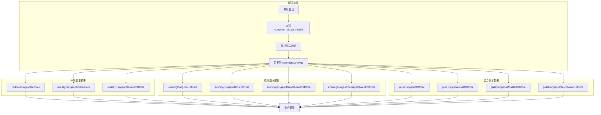

---

## 三、午间副本配表

### 3.1 MiddayDungeonRefObj - 午间副本主表

**文件路径**: `dungeon_refdata.unity3d` -> `midday_dungeon`

**配置类**: `GSOMiddayDungeonRefSet`

| 序号 | 字段名 | 类型 | 说明 | 取值范围 | 必填 | 默认值 | 示例 |
|------|--------|------|------|----------|------|--------|------|
| 1 | dungeon_id | int | 副本ID（唯一标识） | > 0 | 是 | - | 1 |
| 2 | dungeon_name | string | 副本名称 | 非空 | 是 | - | "午间试炼" |
| 3 | dungeon_type | int | 副本类型 | 1 | 是 | 1 | 1 |
| 4 | open_time | string | 开启时间（HH:mm） | 有效时间 | 是 | - | "12:00" |
| 5 | close_time | string | 关闭时间（HH:mm） | 有效时间 | 是 | - | "14:00" |
| 6 | duration | int | 持续时间（分钟） | > 0 | 是 | - | 120 |
| 7 | daily_count | int | 每日挑战次数 | >= 0 | 是 | - | 3 |
| 8 | energy_cost | int | 体力消耗 | >= 0 | 是 | - | 10 |
| 9 | recommended_power | long | 推荐战力 | >= 0 | 是 | 0 | 30000 |
| 10 | reward_pool_id | int | 奖励池ID | > 0 | 是 | - | 1001 |
| 11 | unlock_level | int | 解锁等级 | >= 0 | 是 | 0 | 10 |
| 12 | chapter_id | int | 所属章节 | > 0 | 是 | - | 1 |
| 13 | icon | NPGTextureIndex | 副本图标 | - | 否 | - | - |
| 14 | bg_image | NPGTextureIndex | 背景图片 | - | 否 | - | - |
| 15 | desc | string | 副本描述 | - | 否 | "" | "每日限时开放的副本" |

**索引说明**:
- 主键: `dungeon_id`
- 服务端查询: 按章节查询 `chapter_id`

---

### 3.2 MiddayDungeonBoxRefObj - 午间副本宝箱表

**文件路径**: `dungeon_refdata.unity3d` -> `midday_dungeon_box`

**配置类**: `GSOMiddayDungeonBoxRefSet`

| 序号 | 字段名 | 类型 | 说明 | 取值范围 | 必填 | 默认值 | 示例 |
|------|--------|------|------|----------|------|--------|------|
| 1 | box_id | int | 宝箱ID（唯一标识） | > 0 | 是 | - | 1 |
| 2 | dungeon_id | int | 所属副本ID | > 0 | 是 | - | 1 |
| 3 | box_quality | int | 宝箱品质（1-5星） | 1-5 | 是 | 1 | 3 |
| 4 | reward_list | List\<NPCommonCostItem\> | 奖励列表 | 非空 | 是 | - | [{SILVER, 1000}] |
| 5 | draw_condition | NPPlayerCondition | 领取条件 | - | 否 | - | - |
| 6 | need_attack_count | int | 需要攻击次数 | > 0 | 是 | - | 5 |
| 7 | icon | NPGTextureIndex | 宝箱图标 | - | 否 | - | - |
| 8 | desc | string | 宝箱描述 | - | 否 | "" | "累计攻击5次可领取" |

**索引说明**:
- 主键: `box_id`
- 外键: `dungeon_id` -> MiddayDungeonRefObj

**NPCommonCostItem 结构**:

| 序号 | 字段名 | 类型 | 说明 | 示例 |
|------|--------|------|------|------|
| 1 | type | int | 物品类型（0货币，1道具，2装备） | 0 |
| 2 | id | long | 物品ID | 1 |
| 3 | count | int | 数量 | 1000 |

---

### 3.3 MiddayDungeonRewardRefObj - 午间副本奖励表

**文件路径**: `dungeon_refdata.unity3d` -> `midday_dungeon_reward`

**配置类**: `GSOMiddayDungeonRewardRefSet`

| 序号 | 字段名 | 类型 | 说明 | 取值范围 | 必填 | 默认值 | 示例 |
|------|--------|------|------|----------|------|--------|------|
| 1 | reward_id | int | 奖励ID（唯一标识） | > 0 | 是 | - | 1 |
| 2 | dungeon_id | int | 所属副本ID | > 0 | 是 | - | 1 |
| 3 | reward_type | int | 奖励类型 | 1-3 | 是 | - | 1 |
| 4 | item_id | long | 物品ID | > 0 | 是 | - | 10001 |
| 5 | count_min | int | 最小数量 | > 0 | 是 | - | 1 |
| 6 | count_max | int | 最大数量 | >= count_min | 是 | - | 5 |
| 7 | drop_rate | float | 掉落概率 | 0-1 | 是 | - | 0.5 |
| 8 | guarantee_count | int | 保底次数 | >= 0 | 是 | 0 | 0 |

**奖励类型说明**:

| 值 | 说明 | 描述 |
|----|------|------|
| 1 | 固定奖励 | 每次攻击必定获得 |
| 2 | 随机奖励 | 根据掉落率概率获得 |
| 3 | 首通奖励 | 首次通关获得 |

**索引说明**:
- 主键: `reward_id`
- 外键: `dungeon_id` -> MiddayDungeonRefObj

---

## 四、晚间副本配表

### 4.1 EveningDungeonRefObj - 晚间副本主表

**文件路径**: `dungeon_refdata.unity3d` -> `evening_dungeon`

**配置类**: `GSOEveningDungeonRefSet`

| 序号 | 字段名 | 类型 | 说明 | 取值范围 | 必填 | 默认值 | 示例 |
|------|--------|------|------|----------|------|--------|------|
| 1 | dungeon_id | int | 副本ID（唯一标识） | > 0 | 是 | - | 1 |
| 2 | dungeon_name | string | 副本名称 | 非空 | 是 | - | "晚间世界Boss" |
| 3 | dungeon_type | int | 副本类型 | 2 | 是 | 2 | 2 |
| 4 | open_time | string | 开启时间（HH:mm） | 有效时间 | 是 | - | "20:00" |
| 5 | close_time | string | 关闭时间（HH:mm） | 有效时间 | 是 | - | "22:00" |
| 6 | duration | int | 持续时间（分钟） | > 0 | 是 | - | 120 |
| 7 | boss_id | int | Boss ID | > 0 | 是 | - | 1001 |
| 8 | unlock_level | int | 解锁等级 | >= 0 | 是 | 0 | 20 |
| 9 | daily_count | int | 每日挑战次数 | >= -1 | 是 | -1 | -1（无限制） |
| 10 | energy_cost | int | 体力消耗 | >= 0 | 是 | 0 | 0 |
| 11 | rank_reward_id | int | 排行榜奖励ID | > 0 | 是 | - | 2001 |
| 12 | kill_reward_id | int | 击杀奖励ID | > 0 | 是 | - | 2002 |
| 13 | icon | NPGTextureIndex | 副本图标 | - | 否 | - | - |
| 14 | bg_image | NPGTextureIndex | 背景图片 | - | 否 | - | - |
| 15 | desc | string | 副本描述 | - | 否 | "" | "全服共同挑战世界Boss" |

**索引说明**:
- 主键: `dungeon_id`
- 关联: `boss_id` -> EveningDungeonBossRefObj

---

### 4.2 EveningDungeonBossRefObj - 晚间副本Boss表

**文件路径**: `dungeon_refdata.unity3d` -> `evening_dungeon_boss`

**配置类**: `GSOEveningDungeonBossRefSet`

| 序号 | 字段名 | 类型 | 说明 | 取值范围 | 必填 | 默认值 | 示例 |
|------|--------|------|------|----------|------|--------|------|
| 1 | boss_id | int | Boss ID（唯一标识） | > 0 | 是 | - | 1001 |
| 2 | boss_name | string | Boss名称 | 非空 | 是 | - | "暗影巨龙" |
| 3 | boss_level | int | Boss等级 | > 0 | 是 | - | 50 |
| 4 | hp | long | 基础血量 | > 0 | 是 | - | 100000000 |
| 5 | atk | long | 攻击力 | >= 0 | 是 | 0 | 50000 |
| 6 | def | long | 防御力 | >= 0 | 是 | 0 | 30000 |
| 7 | boss_type | int | Boss类型 | 1-10 | 是 | 1 | 1 |
| 8 | skill_list | List\<long\> | Boss技能列表 | - | 否 | [] | [1001, 1002] |
| 9 | reward_list | List\<NPCommonCostItem\> | 击杀奖励列表 | - | 否 | [] | [{DIAMOND, 100}] |
| 10 | model_id | NPGGoIndex | 模型ID | - | 否 | - | - |
| 11 | icon | NPGTextureIndex | Boss图标 | - | 否 | - | - |
| 12 | desc | string | Boss描述 | - | 否 | "" | "传说中的暗影巨龙" |

**Boss类型说明**:

| 值 | 说明 | 特点 |
|----|------|------|
| 1 | 普通Boss | 基础难度 |
| 2 | 精英Boss | 高难度，奖励丰厚 |
| 3 | 世界Boss | 全服共享血量 |
| 4 | 活动Boss | 限时活动出现 |

---

### 4.3 EveningDungeonRankRewardRefObj - 晚间副本排行奖励表

**文件路径**: `dungeon_refdata.unity3d` -> `evening_dungeon_rank_reward`

**配置类**: `GSOEveningDungeonRankRewardRefSet`

| 序号 | 字段名 | 类型 | 说明 | 取值范围 | 必填 | 默认值 | 示例 |
|------|--------|------|------|----------|------|--------|------|
| 1 | reward_id | int | 奖励ID（唯一标识） | > 0 | 是 | - | 2001 |
| 2 | dungeon_id | int | 所属副本ID | > 0 | 是 | - | 1 |
| 3 | rank_min | int | 最低排名 | >= 1 | 是 | - | 1 |
| 4 | rank_max | int | 最高排名 | >= rank_min | 是 | - | 1 |
| 5 | reward_list | List\<NPCommonCostItem\> | 奖励列表 | 非空 | 是 | - | [{DIAMOND, 500}] |
| 6 | mail_id | int | 邮件模板ID | > 0 | 是 | - | 1001 |
| 7 | mail_title | string | 邮件标题 | - | 否 | "" | "晚间副本排行奖励" |
| 8 | mail_content | string | 邮件内容 | - | 否 | "" | "恭喜您获得排行奖励" |

**索引说明**:
- 主键: `reward_id`
- 外键: `dungeon_id` -> EveningDungeonRefObj

---

### 4.4 EveningDungeonDamageRewardRefObj - 晚间副本伤害奖励表

**文件路径**: `dungeon_refdata.unity3d` -> `evening_dungeon_damage_reward`

**配置类**: `GSOEveningDungeonDamageRewardRefSet`

| 序号 | 字段名 | 类型 | 说明 | 取值范围 | 必填 | 默认值 | 示例 |
|------|--------|------|------|----------|------|--------|------|
| 1 | reward_id | int | 奖励ID（唯一标识） | > 0 | 是 | - | 1 |
| 2 | dungeon_id | int | 所属副本ID | > 0 | 是 | - | 1 |
| 3 | damage_min | long | 最低伤害 | >= 0 | 是 | - | 100000 |
| 4 | damage_max | long | 最高伤害 | >= damage_min | 是 | - | 500000 |
| 5 | reward_list | List\<NPCommonCostItem\> | 奖励列表 | 非空 | 是 | - | [{SILVER, 1000}] |

---

## 五、公会副本配表

### 5.1 GuildDungeonRefObj - 公会副本主表

**文件路径**: `dungeon_refdata.unity3d` -> `guild_dungeon`

**配置类**: `GSOGuildDungeonRefSet`

| 序号 | 字段名 | 类型 | 说明 | 取值范围 | 必填 | 默认值 | 示例 |
|------|--------|------|------|----------|------|--------|------|
| 1 | dungeon_id | int | 副本ID（唯一标识） | > 0 | 是 | - | 1 |
| 2 | dungeon_name | string | 副本名称 | 非空 | 是 | - | "公会试炼" |
| 3 | dungeon_type | int | 副本类型 | 3 | 是 | 3 | 3 |
| 4 | guild_level | int | 公会等级需求 | >= 1 | 是 | - | 3 |
| 5 | max_level | int | 副本最大等级 | >= 1 | 是 | - | 10 |
| 6 | monster_list | List\<int\> | 怪物ID列表 | 非空 | 是 | - | [1001, 1002, 1003] |
| 7 | auto_start | bool | 是否自动开始 | - | 是 | false | true |
| 8 | open_day_list | List\<int\> | 开放日期（周几） | 1-7 | 是 | - | [1, 3, 5] |
| 9 | reward_id | int | 奖励ID | > 0 | 是 | - | 3001 |
| 10 | open_time | string | 自动开启时间（HH:mm） | - | 否 | "" | "20:00" |
| 11 | duration | int | 持续时间（小时） | > 0 | 否 | 24 | 24 |
| 12 | icon | NPGTextureIndex | 副本图标 | - | 否 | - | - |
| 13 | desc | string | 副本描述 | - | 否 | "" | "公会成员协作挑战" |

**开放日期说明**:

| 值 | 说明 |
|----|------|
| 1 | 周一 |
| 2 | 周二 |
| 3 | 周三 |
| 4 | 周四 |
| 5 | 周五 |
| 6 | 周六 |
| 7 | 周日 |

---

### 5.2 GuildDungeonLevelRefObj - 公会副本等级表

**文件路径**: `dungeon_refdata.unity3d` -> `guild_dungeon_level`

**配置类**: `GSOGuildDungeonLevelRefSet`

| 序号 | 字段名 | 类型 | 说明 | 取值范围 | 必填 | 默认值 | 示例 |
|------|--------|------|------|----------|------|--------|------|
| 1 | dungeon_id | int | 副本ID | > 0 | 是 | - | 1 |
| 2 | level | int | 副本等级 | >= 1 | 是 | - | 1 |
| 3 | monster_count | int | 怪物数量 | > 0 | 是 | - | 3 |
| 4 | hp_multiplier | float | 血量倍率 | >= 0 | 是 | 1.0 | 1.0 |
| 5 | atk_multiplier | float | 攻击倍率 | >= 0 | 是 | 1.0 | 1.0 |
| 6 | reward_list | List\<NPCommonCostItem\> | 通关奖励 | - | 否 | [] | [{GUILD_COIN, 100}] |
| 7 | upgrade_cost | NPCommonCostItem | 升级消耗 | - | 是 | - | {GUILD_COIN, 500} |

**复合主键**: `(dungeon_id, level)`

---

### 5.3 GuildDungeonMonsterRefObj - 公会副本怪物表

**文件路径**: `dungeon_refdata.unity3d` -> `guild_dungeon_monster`

**配置类**: `GSOGuildDungeonMonsterRefSet`

| 序号 | 字段名 | 类型 | 说明 | 取值范围 | 必填 | 默认值 | 示例 |
|------|--------|------|------|----------|------|--------|------|
| 1 | monster_id | int | 怪物ID（唯一标识） | > 0 | 是 | - | 1001 |
| 2 | monster_name | string | 怪物名称 | 非空 | 是 | - | "哥布林战士" |
| 3 | monster_level | int | 怪物等级 | > 0 | 是 | - | 30 |
| 4 | hp | long | 基础血量 | > 0 | 是 | - | 500000 |
| 5 | atk | long | 攻击力 | >= 0 | 是 | 0 | 10000 |
| 6 | def | long | 防御力 | >= 0 | 是 | 0 | 5000 |
| 7 | monster_type | int | 怪物类型 | 1-5 | 是 | 1 | 1 |
| 8 | reward_list | List\<NPCommonCostItem\> | 击杀奖励 | - | 否 | [] | [{GUILD_COIN, 50}] |
| 9 | model_id | NPGGoIndex | 模型ID | - | 否 | - | - |
| 10 | icon | NPGTextureIndex | 怪物图标 | - | 否 | - | - |
| 11 | desc | string | 怪物描述 | - | 否 | "" | "凶猛的哥布林战士" |

**怪物类型说明**:

| 值 | 说明 | 特点 |
|----|------|------|
| 1 | 普通怪物 | 基础难度 |
| 2 | 精英怪物 | 较高难度 |
| 3 | 小Boss | 高难度 |
| 4 | 大Boss | 最高难度 |
| 5 | 隐藏怪物 | 特殊触发 |

---

### 5.4 GuildDungeonRankRewardRefObj - 公会副本排行奖励表

**文件路径**: `dungeon_refdata.unity3d` -> `guild_dungeon_rank_reward`

**配置类**: `GSOGuildDungeonRankRewardRefSet`

| 序号 | 字段名 | 类型 | 说明 | 取值范围 | 必填 | 默认值 | 示例 |
|------|--------|------|------|----------|------|--------|------|
| 1 | reward_id | int | 奖励ID（唯一标识） | > 0 | 是 | - | 3001 |
| 2 | dungeon_id | int | 所属副本ID | > 0 | 是 | - | 1 |
| 3 | rank_min | int | 最低排名 | >= 1 | 是 | - | 1 |
| 4 | rank_max | int | 最高排名 | >= rank_min | 是 | - | 3 |
| 5 | reward_list | List\<NPCommonCostItem\> | 奖励列表 | 非空 | 是 | - | [{DIAMOND, 100}] |

---

## 六、副本状态枚举

### 6.1 EDungeonState - 副本状态

```csharp
/// <summary>
/// 副本状态枚举
/// </summary>
public enum EDungeonState
{
    /// <summary>
    /// 未开启
    /// </summary>
    CLOSED = 0,

    /// <summary>
    /// 开启中
    /// </summary>
    OPENING = 1,

    /// <summary>
    /// 已结束
    /// </summary>
    ENDED = 2
}
```

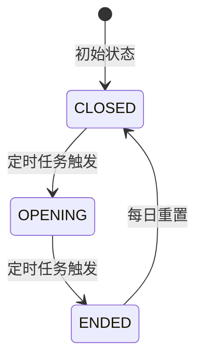

### 6.2 EDungeonType - 副本类型

```csharp
/// <summary>
/// 副本类型枚举
/// </summary>
public enum EDungeonType
{
    /// <summary>
    /// 午间副本
    /// </summary>
    MIDDAY = 1,

    /// <summary>
    /// 晚间副本
    /// </summary>
    EVENING = 2,

    /// <summary>
    /// 公会副本
    /// </summary>
    GUILD = 3,

    /// <summary>
    /// 章节副本
    /// </summary>
    CHAPTER = 4,

    /// <summary>
    /// 无尽副本
    /// </summary>
    ENDLESS = 5
}
```

### 6.3 EBoxState - 宝箱状态

```csharp
/// <summary>
/// 宝箱状态枚举
/// </summary>
public enum EBoxState
{
    /// <summary>
    /// 未达成（条件未满足）
    /// </summary>
    LOCKED = 0,

    /// <summary>
    /// 可领取（条件已满足）
    /// </summary>
    UNLOCKED = 1,

    /// <summary>
    /// 已领取
    /// </summary>
    DRAWN = 2
}
```

### 6.4 EMonsterState - 怪物状态

```csharp
/// <summary>
/// 怪物状态枚举
/// </summary>
public enum EMonsterState
{
    /// <summary>
    /// 存活
    /// </summary>
    ALIVE = 0,

    /// <summary>
    /// 已死亡
    /// </summary>
    DEAD = 1
}
```

### 6.5 EBossState - Boss状态

```csharp
/// <summary>
/// Boss状态枚举
/// </summary>
public enum EBossState
{
    /// <summary>
    /// 存活
    /// </summary>
    ALIVE = 0,

    /// <summary>
    /// 已死亡
    /// </summary>
    DEAD = 1
}
```

### 6.6 EDungeonBoxType - 副本宝箱类型

```csharp
/// <summary>
/// 副本宝箱类型
/// </summary>
public enum EDungeonBoxType
{
    /// <summary>
    /// 午间副本宝箱
    /// </summary>
    MIDDAY = 0,

    /// <summary>
    /// 晚间副本宝箱
    /// </summary>
    EVENING = 1
}
```

---

## 七、配表加载方式

### 7.1 客户端访问方式

```csharp
// ========== 午间副本配表访问 ==========

// 获取午间副本静态配置
MiddayDungeonRefObj dungeonRef = GRefdataCoreMgr.instance.middayDungeonRefCore.getRef(dungeonId);
if (dungeonRef != null)
{
    string name = dungeonRef.dungeon_name;
    int energyCost = dungeonRef.energy_cost;
    int dailyCount = dungeonRef.daily_count;
}

// 获取午间副本宝箱配置列表（按副本ID）
List<MiddayDungeonBoxRefObj> boxList = GRefdataCoreMgr.instance.middayDungeonBoxRefCore.getListByDungeonId(dungeonId);

// 遍历宝箱列表
foreach (var box in boxList)
{
    int boxId = box.box_id;
    int needCount = box.need_attack_count;
    List<NPCommonCostItem> rewards = box.reward_list;
}

// ========== 晚间副本配表访问 ==========

// 获取晚间副本静态配置
EveningDungeonRefObj eveningRef = GRefdataCoreMgr.instance.eveningDungeonRefCore.getRef(dungeonId);

// 获取晚间副本Boss配置
EveningDungeonBossRefObj bossRef = GRefdataCoreMgr.instance.eveningDungeonBossRefCore.getRef(bossId);
if (bossRef != null)
{
    string bossName = bossRef.boss_name;
    long bossHp = bossRef.hp;
    long bossAtk = bossRef.atk;
}

// ========== 公会副本配表访问 ==========

// 获取公会副本静态配置
GuildDungeonRefObj guildRef = GRefdataCoreMgr.instance.guildDungeonRefCore.getRef(dungeonId);

// 获取公会副本怪物配置
GuildDungeonMonsterRefObj monsterRef = GRefdataCoreMgr.instance.guildDungeonMonsterRefCore.getRef(monsterId);

// 获取公会副本等级配置
GuildDungeonLevelRefObj levelRef = GRefdataCoreMgr.instance.guildDungeonLevelRefCore.getByDungeonAndLevel(dungeonId, level);
if (levelRef != null)
{
    int monsterCount = levelRef.monster_count;
    float hpMultiplier = levelRef.hp_multiplier;
}
```

### 7.2 服务端访问方式

```java
// ========== 午间副本配表访问 ==========

// 获取午间副本静态配置
RefMiddayDungeon dungeonRef = RefMiddayDungeon.getMgr().get(dungeonId);
if (dungeonRef != null) {
    String name = dungeonRef.getDungeonName();
    int energyCost = dungeonRef.getEnergyCost();
    int dailyCount = dungeonRef.getDailyCount();
}

// 获取午间副本宝箱配置列表
List<RefMiddayDungeonBox> boxList = RefMiddayDungeonBox.getByDungeonId(dungeonId);

// ========== 晚间副本配表访问 ==========

// 获取晚间副本Boss配置
RefEveningDungeonBoss bossRef = RefEveningDungeonBoss.getMgr().get(bossId);

// 获取排行奖励配置列表
List<RefEveningDungeonRankReward> rankRewards = RefEveningDungeonRankReward.getByDungeonId(dungeonId);

// ========== 公会副本配表访问 ==========

// 获取公会副本静态配置
RefGuildDungeon guildRef = RefGuildDungeon.getMgr().get(dungeonId);

// 获取公会副本怪物配置
RefGuildDungeonMonster monsterRef = RefGuildDungeonMonster.getMgr().get(monsterId);

// 获取公会副本等级配置
RefGuildDungeonLevel levelRef = RefGuildDungeonLevel.getByDungeonAndLevel(dungeonId, level);
```

---

## 八、配表数据加载流程

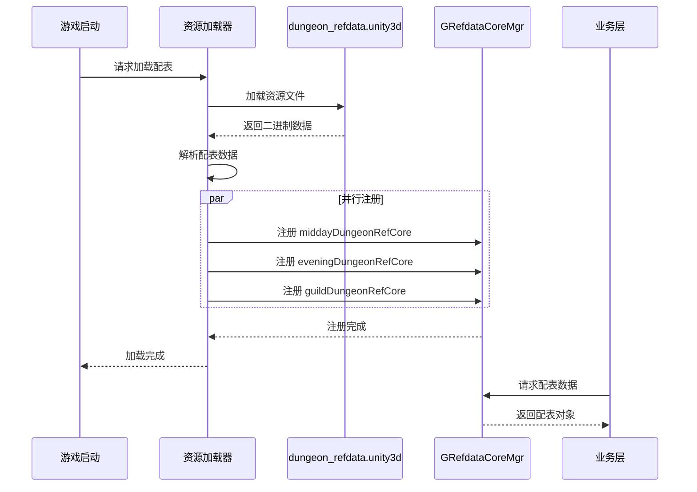

---

## 九、配表数据示例

### 9.1 午间副本配置示例

```json
{
  "dungeon_id": 1,
  "dungeon_name": "午间试炼",
  "dungeon_type": 1,
  "open_time": "12:00",
  "close_time": "14:00",
  "duration": 120,
  "daily_count": 3,
  "energy_cost": 10,
  "recommended_power": 30000,
  "reward_pool_id": 1001,
  "unlock_level": 10,
  "chapter_id": 1,
  "desc": "每日中午12点开启的限时副本，可获得大量奖励"
}
```

### 9.2 午间副本宝箱配置示例

```json
{
  "box_id": 1,
  "dungeon_id": 1,
  "box_quality": 1,
  "need_attack_count": 3,
  "reward_list": [
    {"type": 0, "id": 1, "count": 1000}
  ],
  "desc": "累计攻击3次可领取"
}
```

### 9.3 晚间副本Boss配置示例

```json
{
  "boss_id": 1001,
  "boss_name": "暗影巨龙",
  "boss_level": 50,
  "hp": 100000000,
  "atk": 50000,
  "def": 30000,
  "boss_type": 3,
  "skill_list": [1001, 1002],
  "reward_list": [
    {"type": 0, "id": 2, "count": 100}
  ],
  "desc": "传说中的暗影巨龙，每晚会降临世界"
}
```

### 9.4 晚间副本排行奖励配置示例

```json
[
  {
    "reward_id": 2001,
    "dungeon_id": 1,
    "rank_min": 1,
    "rank_max": 1,
    "reward_list": [
      {"type": 0, "id": 2, "count": 500},
      {"type": 1, "id": 30001, "count": 1}
    ],
    "mail_title": "晚间副本排行奖励",
    "mail_content": "恭喜您获得伤害排行第1名！"
  },
  {
    "reward_id": 2002,
    "dungeon_id": 1,
    "rank_min": 2,
    "rank_max": 10,
    "reward_list": [
      {"type": 0, "id": 2, "count": 200}
    ]
  }
]
```

### 9.5 公会副本配置示例

```json
{
  "dungeon_id": 1,
  "dungeon_name": "公会试炼",
  "dungeon_type": 3,
  "guild_level": 3,
  "max_level": 10,
  "monster_list": [1001, 1002, 1003, 1004, 1005],
  "auto_start": true,
  "open_day_list": [1, 3, 5],
  "reward_id": 3001,
  "open_time": "20:00",
  "duration": 24,
  "desc": "公会成员协作挑战的副本"
}
```

### 9.6 公会副本等级配置示例

```json
[
  {
    "dungeon_id": 1,
    "level": 1,
    "monster_count": 3,
    "hp_multiplier": 1.0,
    "atk_multiplier": 1.0,
    "reward_list": [
      {"type": 0, "id": 3, "count": 100}
    ],
    "upgrade_cost": {"type": 0, "id": 3, "count": 500}
  },
  {
    "dungeon_id": 1,
    "level": 2,
    "monster_count": 4,
    "hp_multiplier": 1.2,
    "atk_multiplier": 1.1,
    "reward_list": [
      {"type": 0, "id": 3, "count": 150}
    ],
    "upgrade_cost": {"type": 0, "id": 3, "count": 1000}
  }
]
```

### 9.7 公会副本怪物配置示例

```json
{
  "monster_id": 1001,
  "monster_name": "哥布林战士",
  "monster_level": 30,
  "hp": 500000,
  "atk": 10000,
  "def": 5000,
  "monster_type": 1,
  "reward_list": [
    {"type": 0, "id": 3, "count": 50}
  ],
  "desc": "凶猛的哥布林战士"
}
```

---

## 十、配表路径汇总

| 配表类型 | 客户端路径 | 服务端路径 | 配置类 |
|----------|------------|------------|--------|
| 午间副本主表 | `dungeon_refdata.unity3d/midday_dungeon` | `config/dungeon/midday_dungeon.json` | GSOMiddayDungeonRefSet |
| 午间宝箱表 | `dungeon_refdata.unity3d/midday_dungeon_box` | `config/dungeon/midday_dungeon_box.json` | GSOMiddayDungeonBoxRefSet |
| 午间奖励表 | `dungeon_refdata.unity3d/midday_dungeon_reward` | `config/dungeon/midday_dungeon_reward.json` | GSOMiddayDungeonRewardRefSet |
| 晚间副本主表 | `dungeon_refdata.unity3d/evening_dungeon` | `config/dungeon/evening_dungeon.json` | GSOEveningDungeonRefSet |
| 晚间Boss表 | `dungeon_refdata.unity3d/evening_dungeon_boss` | `config/dungeon/evening_dungeon_boss.json` | GSOEveningDungeonBossRefSet |
| 晚间排行奖励表 | `dungeon_refdata.unity3d/evening_dungeon_rank_reward` | `config/dungeon/evening_dungeon_rank_reward.json` | GSOEveningDungeonRankRewardRefSet |
| 晚间伤害奖励表 | `dungeon_refdata.unity3d/evening_dungeon_damage_reward` | `config/dungeon/evening_dungeon_damage_reward.json` | GSOEveningDungeonDamageRewardRefSet |
| 公会副本主表 | `dungeon_refdata.unity3d/guild_dungeon` | `config/dungeon/guild_dungeon.json` | GSOGuildDungeonRefSet |
| 公会副本等级表 | `dungeon_refdata.unity3d/guild_dungeon_level` | `config/dungeon/guild_dungeon_level.json` | GSOGuildDungeonLevelRefSet |
| 公会副本怪物表 | `dungeon_refdata.unity3d/guild_dungeon_monster` | `config/dungeon/guild_dungeon_monster.json` | GSOGuildDungeonMonsterRefSet |
| 公会排行奖励表 | `dungeon_refdata.unity3d/guild_dungeon_rank_reward` | `config/dungeon/guild_dungeon_rank_reward.json` | GSOGuildDungeonRankRewardRefSet |

---

## 十一、配表校验规则

### 11.1 数据一致性校验

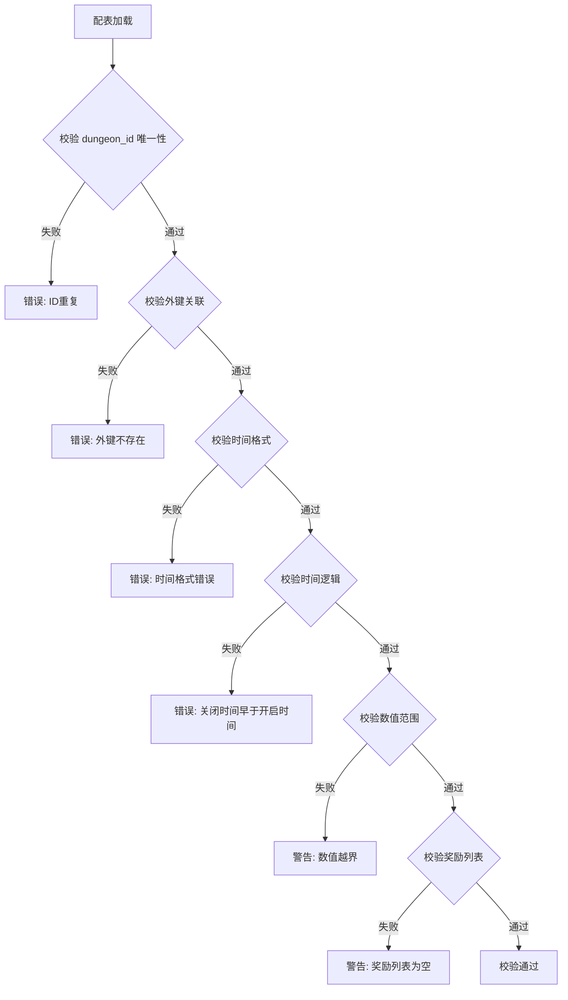

| 校验项 | 校验规则 | 错误级别 | 处理方式 |
|--------|----------|----------|----------|
| dungeon_id 唯一性 | 所有副本ID不可重复 | Error | 阻止加载 |
| 外键关联 | box.dungeon_id 必须存在于主表 | Error | 阻止加载 |
| 时间格式 | open_time/close_time 格式为 HH:mm | Error | 阻止加载 |
| 时间逻辑 | close_time 必须晚于 open_time | Error | 阻止加载 |
| 数值范围 | daily_count >= 0, energy_cost >= 0 | Error | 阻止加载 |
| 奖励列表 | reward_list 不能为空 | Warning | 允许加载 |

### 11.2 配表版本管理

```
版本号格式: v{major}.{minor}.{patch}
示例: v1.0.0

版本更新规则:
- major: 配表结构变更（新增/删除字段）
- minor: 数据内容变更（新增副本/修改数值）
- patch: 数据修复（修复错误数据）
```

---

## 十二、数据流向与加载时序

### 12.1 配表数据流向图

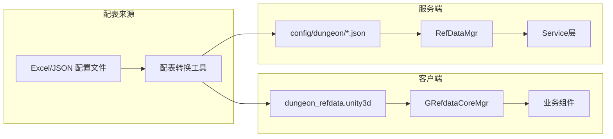

### 12.2 配表热更新流程

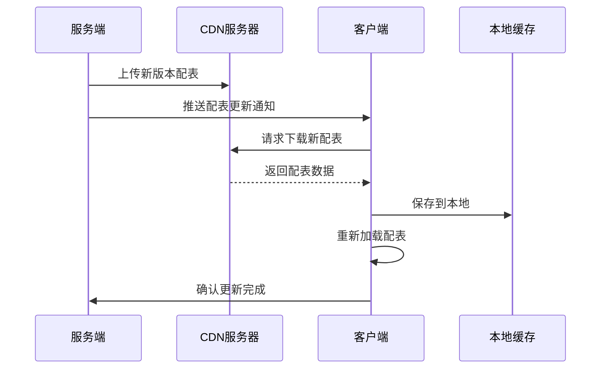

---

## 十三、字段完整索引说明

### 13.1 午间副本配表索引

| 配表类 | 主键字段 | 外键字段 | 索引字段 | 查询方法 |
|--------|----------|----------|----------|----------|
| MiddayDungeonRefObj | dungeon_id | chapter_id | - | getRef(dungeonId) |
| MiddayDungeonBoxRefObj | box_id | dungeon_id | dungeon_id | getListByDungeonId(dungeonId) |
| MiddayDungeonRewardRefObj | reward_id | dungeon_id | dungeon_id | getByDungeonId(dungeonId) |

### 13.2 晚间副本配表索引

| 配表类 | 主键字段 | 外键字段 | 索引字段 | 查询方法 |
|--------|----------|----------|----------|----------|
| EveningDungeonRefObj | dungeon_id | boss_id | - | getRef(dungeonId) |
| EveningDungeonBossRefObj | boss_id | - | - | getRef(bossId) |
| EveningDungeonRankRewardRefObj | reward_id | dungeon_id | dungeon_id, rank_min, rank_max | getByDungeonId(dungeonId) |
| EveningDungeonDamageRewardRefObj | reward_id | dungeon_id | dungeon_id | getByDungeonId(dungeonId) |

### 13.3 公会副本配表索引

| 配表类 | 主键字段 | 外键字段 | 索引字段 | 查询方法 |
|--------|----------|----------|----------|----------|
| GuildDungeonRefObj | dungeon_id | - | guild_level | getRef(dungeonId) |
| GuildDungeonLevelRefObj | (dungeon_id, level) | - | - | getByDungeonAndLevel(dungeonId, level) |
| GuildDungeonMonsterRefObj | monster_id | - | - | getRef(monsterId) |
| GuildDungeonRankRewardRefObj | reward_id | dungeon_id | dungeon_id | getByDungeonId(dungeonId) |

---

## 十四、配表工具函数

### 14.1 客户端工具函数

```csharp
/// <summary>
/// 副本配表工具类
/// </summary>
public static class DungeonRefHelper
{
    /// <summary>
    /// 获取午间副本的所有宝箱
    /// </summary>
    public static List<MiddayDungeonBoxRefObj> GetMiddayBoxes(int dungeonId)
    {
        return GRefdataCoreMgr.instance.middayDungeonBoxRefCore
            .getListByDungeonId(dungeonId)
            .OrderBy(b => b.need_attack_count)
            .ToList();
    }

    /// <summary>
    /// 检查玩家是否可以领取宝箱
    /// </summary>
    public static bool CanDrawBox(int dungeonId, int boxId, int attackCount)
    {
        var box = GRefdataCoreMgr.instance.middayDungeonBoxRefCore.getRef(boxId);
        if (box == null) return false;
        if (box.dungeon_id != dungeonId) return false;
        return attackCount >= box.need_attack_count;
    }

    /// <summary>
    /// 获取晚间副本排行奖励
    /// </summary>
    public static EveningDungeonRankRewardRefObj GetRankReward(int dungeonId, int rank)
    {
        var rewards = GRefdataCoreMgr.instance.eveningDungeonRankRewardRefCore
            .getByDungeonId(dungeonId);
        return rewards?.FirstOrDefault(r => rank >= r.rank_min && rank <= r.rank_max);
    }

    /// <summary>
    /// 获取公会副本当前等级配置
    /// </summary>
    public static GuildDungeonLevelRefObj GetCurrentLevelConfig(int dungeonId, int level)
    {
        return GRefdataCoreMgr.instance.guildDungeonLevelRefCore
            .getByDungeonAndLevel(dungeonId, level);
    }

    /// <summary>
    /// 获取公会副本怪物实际属性（应用倍率）
    /// </summary>
    public static (long hp, long atk, long def) GetMonsterRealStats(
        int monsterId, float hpMultiplier, float atkMultiplier)
    {
        var monster = GRefdataCoreMgr.instance.guildDungeonMonsterRefCore.getRef(monsterId);
        if (monster == null) return (0, 0, 0);

        return (
            (long)(monster.hp * hpMultiplier),
            (long)(monster.atk * atkMultiplier),
            monster.def
        );
    }

    /// <summary>
    /// 检查副本是否今日开放
    /// </summary>
    public static bool IsDungeonOpenToday(int dungeonId)
    {
        var dungeon = GRefdataCoreMgr.instance.guildDungeonRefCore.getRef(dungeonId);
        if (dungeon == null) return false;

        int dayOfWeek = (int)DateTime.Now.DayOfWeek;
        // 转换为周一=1的格式
        if (dayOfWeek == 0) dayOfWeek = 7;

        return dungeon.open_day_list.Contains(dayOfWeek);
    }

    /// <summary>
    /// 计算午间副本奖励预览
    /// </summary>
    public static List<NPCommonCostItem> PreviewMiddayRewards(int dungeonId)
    {
        var rewards = new List<NPCommonCostItem>();
        var rewardList = GRefdataCoreMgr.instance.middayDungeonRewardRefCore
            .getByDungeonId(dungeonId);

        foreach (var reward in rewardList)
        {
            if (reward.reward_type == 1) // 固定奖励
            {
                rewards.Add(new NPCommonCostItem
                {
                    type = 0,
                    id = reward.item_id,
                    count = reward.count_min
                });
            }
        }

        return rewards;
    }
}
```

### 14.2 服务端工具函数

```java
/**
 * 副本配表工具类
 */
public class DungeonRefHelper {

    /**
     * 获取晚间副本Boss实际血量（根据天数递增）
     */
    public static long getBossRealHp(int bossId, int dayIndex) {
        RefEveningDungeonBoss bossRef = RefEveningDungeonBoss.getMgr().get(bossId);
        if (bossRef == null) return 0;

        // 每7天增加50%，最高增加50%
        float dayMultiplier = Math.min(dayIndex / 7.0f, 1.0f) * 0.5f;
        return (long) (bossRef.getHp() * (1 + dayMultiplier));
    }

    /**
     * 计算公会副本升级消耗
     */
    public static NPCommonCostItem getUpgradeCost(int dungeonId, int currentLevel) {
        RefGuildDungeonLevel levelRef = RefGuildDungeonLevel.getByDungeonAndLevel(
            dungeonId, currentLevel + 1);
        if (levelRef == null) return null;
        return levelRef.getUpgradeCost();
    }

    /**
     * 检查公会副本是否可以升级
     */
    public static boolean canUpgrade(int dungeonId, int currentLevel) {
        RefGuildDungeon dungeonRef = RefGuildDungeon.getMgr().get(dungeonId);
        if (dungeonRef == null) return false;
        return currentLevel < dungeonRef.getMaxLevel();
    }

    /**
     * 获取排行奖励配置
     */
    public static RefEveningDungeonRankReward getRankReward(int dungeonId, int rank) {
        List<RefEveningDungeonRankReward> rewards =
            RefEveningDungeonRankReward.getByDungeonId(dungeonId);
        for (RefEveningDungeonRankReward reward : rewards) {
            if (rank >= reward.getRankMin() && rank <= reward.getRankMax()) {
                return reward;
            }
        }
        return null;
    }

    /**
     * 获取伤害奖励配置
     */
    public static List<RefEveningDungeonDamageReward> getDamageRewards(
            int dungeonId, long damage) {
        List<RefEveningDungeonDamageReward> result = new ArrayList<>();
        List<RefEveningDungeonDamageReward> rewards =
            RefEveningDungeonDamageReward.getByDungeonId(dungeonId);

        for (RefEveningDungeonDamageReward reward : rewards) {
            if (damage >= reward.getDamageMin() && damage <= reward.getDamageMax()) {
                result.add(reward);
            }
        }
        return result;
    }
}
```

---

## 十五、配表数据关系详解

### 15.1 午间副本数据关系图

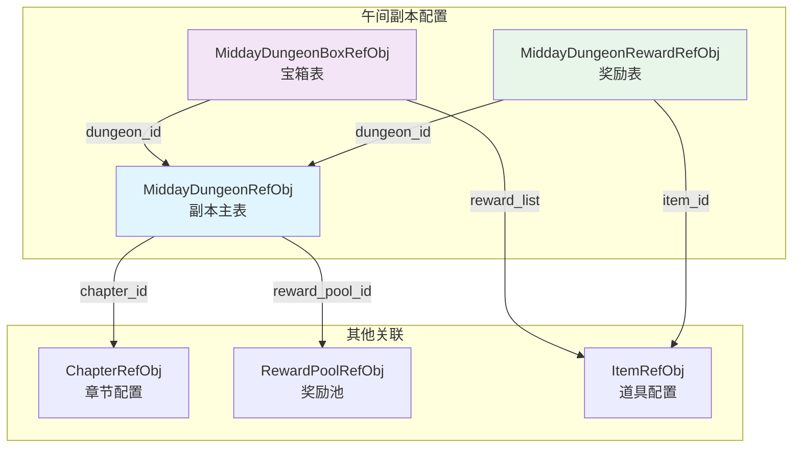

### 15.2 晚间副本数据关系图

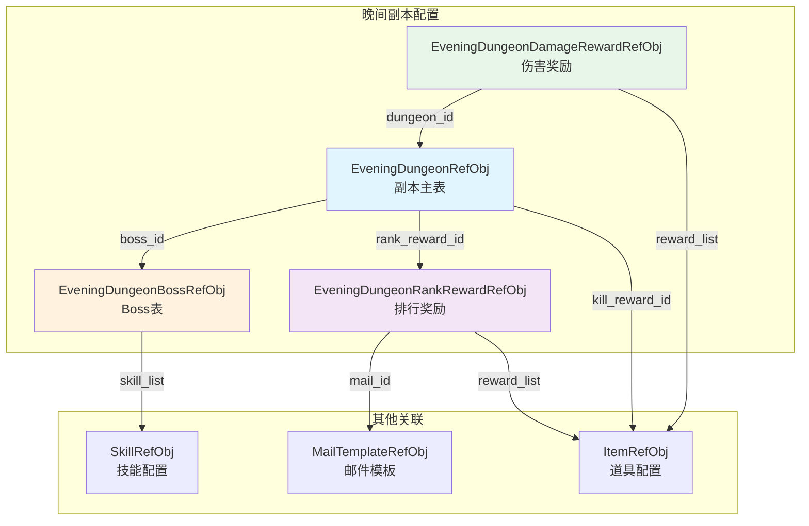

### 15.3 公会副本数据关系图

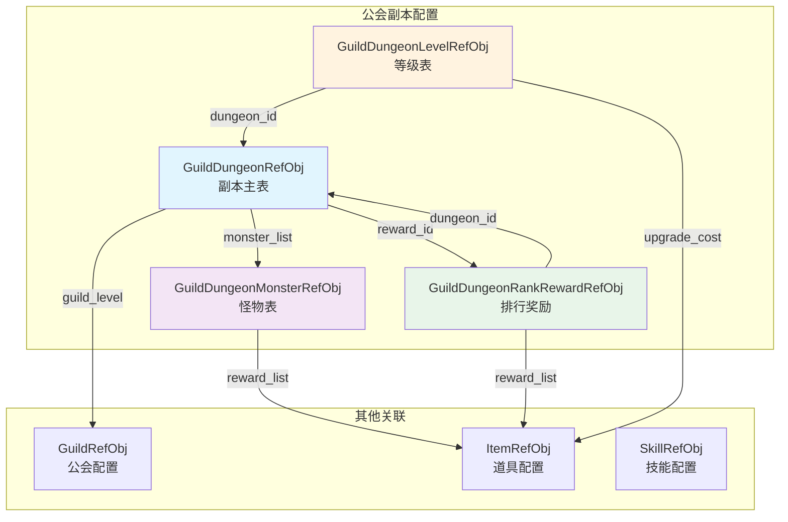

---

## 十六、数据验证器代码示例

### 16.1 客户端数据验证器

```csharp
/// <summary>
/// 副本配置数据验证器
/// </summary>
public static class DungeonConfigValidator
{
    /// <summary>
    /// 验证午间副本配置
    /// </summary>
    public static bool ValidateMiddayDungeon(MiddayDungeonRefObj config, List<string> errors)
    {
        if (config == null)
        {
            errors.Add("配置对象为空");
            return false;
        }

        bool isValid = true;

        // 验证副本ID
        if (config.dungeon_id <= 0)
        {
            errors.Add($"副本ID无效: {config.dungeon_id}");
            isValid = false;
        }

        // 验证时间格式
        if (!IsValidTimeFormat(config.open_time))
        {
            errors.Add($"开启时间格式错误: {config.open_time}");
            isValid = false;
        }

        if (!IsValidTimeFormat(config.close_time))
        {
            errors.Add($"关闭时间格式错误: {config.close_time}");
            isValid = false;
        }

        // 验证时间逻辑
        if (CompareTime(config.open_time, config.close_time) >= 0)
        {
            errors.Add($"关闭时间必须晚于开启时间: {config.open_time} - {config.close_time}");
            isValid = false;
        }

        // 验证持续时间
        if (config.duration <= 0 || config.duration > 1440) // 最大24小时
        {
            errors.Add($"持续时间无效: {config.duration}");
            isValid = false;
        }

        // 验证每日次数
        if (config.daily_count < -1 || config.daily_count > 100)
        {
            errors.Add($"每日次数无效: {config.daily_count}");
            isValid = false;
        }

        // 验证体力消耗
        if (config.energy_cost < 0 || config.energy_cost > 1000)
        {
            errors.Add($"体力消耗无效: {config.energy_cost}");
            isValid = false;
        }

        return isValid;
    }

    /// <summary>
    /// 验证Boss配置
    /// </summary>
    public static bool ValidateBossConfig(EveningDungeonBossRefObj config, List<string> errors)
    {
        if (config == null)
        {
            errors.Add("Boss配置对象为空");
            return false;
        }

        bool isValid = true;

        // 验证Boss ID
        if (config.boss_id <= 0)
        {
            errors.Add($"Boss ID无效: {config.boss_id}");
            isValid = false;
        }

        // 验证名称
        if (string.IsNullOrEmpty(config.boss_name))
        {
            errors.Add("Boss名称不能为空");
            isValid = false;
        }

        // 验证血量
        if (config.hp <= 0)
        {
            errors.Add($"Boss血量无效: {config.hp}");
            isValid = false;
        }

        // 验证属性值范围
        if (config.atk < 0 || config.atk > long.MaxValue / 2)
        {
            errors.Add($"Boss攻击力无效: {config.atk}");
            isValid = false;
        }

        if (config.def < 0 || config.def > long.MaxValue / 2)
        {
            errors.Add($"Boss防御力无效: {config.def}");
            isValid = false;
        }

        return isValid;
    }

    /// <summary>
    /// 验证公会副本配置
    /// </summary>
    public static bool ValidateGuildDungeon(GuildDungeonRefObj config, List<string> errors)
    {
        if (config == null)
        {
            errors.Add("公会副本配置对象为空");
            return false;
        }

        bool isValid = true;

        // 验证怪物列表
        if (config.monster_list == null || config.monster_list.Count == 0)
        {
            errors.Add("怪物列表不能为空");
            isValid = false;
        }
        else if (config.monster_list.Count > 20)
        {
            errors.Add($"怪物数量过多: {config.monster_list.Count}");
            isValid = false;
        }

        // 验证开放日期
        if (config.open_day_list == null || config.open_day_list.Count == 0)
        {
            errors.Add("开放日期列表不能为空");
            isValid = false;
        }
        else
        {
            foreach (int day in config.open_day_list)
            {
                if (day < 1 || day > 7)
                {
                    errors.Add($"开放日期无效: {day}");
                    isValid = false;
                }
            }
        }

        // 验证最大等级
        if (config.max_level <= 0 || config.max_level > 100)
        {
            errors.Add($"最大等级无效: {config.max_level}");
            isValid = false;
        }

        return isValid;
    }

    private static bool IsValidTimeFormat(string time)
    {
        if (string.IsNullOrEmpty(time)) return false;
        string[] parts = time.Split(':');
        if (parts.Length != 2) return false;
        if (!int.TryParse(parts[0], out int hour) || hour < 0 || hour > 23) return false;
        if (!int.TryParse(parts[1], out int minute) || minute < 0 || minute > 59) return false;
        return true;
    }

    private static int CompareTime(string time1, string time2)
    {
        string[] parts1 = time1.Split(':');
        string[] parts2 = time2.Split(':');
        int h1 = int.Parse(parts1[0]), m1 = int.Parse(parts1[1]);
        int h2 = int.Parse(parts2[0]), m2 = int.Parse(parts2[1]);
        return (h1 * 60 + m1).CompareTo(h2 * 60 + m2);
    }
}
```

### 16.2 服务端数据验证器

```java
/**
 * 副本配置数据验证器
 */
public class DungeonConfigValidator {

    /**
     * 验证午间副本配置
     */
    public static ValidationResult validateMiddayDungeon(RefMiddayDungeon config) {
        ValidationResult result = new ValidationResult();

        if (config == null) {
            result.addError("配置对象为空");
            return result;
        }

        // 验证副本ID
        if (config.getDungeonId() <= 0) {
            result.addError("副本ID无效: " + config.getDungeonId());
        }

        // 验证时间格式
        if (!isValidTimeFormat(config.getOpenTime())) {
            result.addError("开启时间格式错误: " + config.getOpenTime());
        }

        if (!isValidTimeFormat(config.getCloseTime())) {
            result.addError("关闭时间格式错误: " + config.getCloseTime());
        }

        // 验证时间逻辑
        if (compareTime(config.getOpenTime(), config.getCloseTime()) >= 0) {
            result.addError("关闭时间必须晚于开启时间");
        }

        // 验证数值范围
        if (config.getDuration() <= 0 || config.getDuration() > 1440) {
            result.addError("持续时间无效: " + config.getDuration());
        }

        if (config.getDailyCount() < -1 || config.getDailyCount() > 100) {
            result.addError("每日次数无效: " + config.getDailyCount());
        }

        if (config.getEnergyCost() < 0 || config.getEnergyCost() > 1000) {
            result.addError("体力消耗无效: " + config.getEnergyCost());
        }

        // 验证关联数据
        if (config.getRewardPoolId() <= 0) {
            result.addError("奖励池ID无效: " + config.getRewardPoolId());
        } else {
            // 验证奖励池是否存在
            if (!RewardPoolManager.exists(config.getRewardPoolId())) {
                result.addError("奖励池不存在: " + config.getRewardPoolId());
            }
        }

        return result;
    }

    /**
     * 批量验证所有配置
     */
    public static Map<String, List<String>> validateAllConfigs() {
        Map<String, List<String>> results = new HashMap<>();

        // 验证午间副本配置
        List<String> middayErrors = new ArrayList<>();
        for (RefMiddayDungeon config : RefMiddayDungeon.getAll()) {
            ValidationResult result = validateMiddayDungeon(config);
            if (!result.isValid()) {
                middayErrors.addAll(result.getErrors());
            }
        }
        results.put("midday_dungeon", middayErrors);

        // 验证晚间副本配置
        List<String> eveningErrors = new ArrayList<>();
        for (RefEveningDungeonBoss config : RefEveningDungeonBoss.getAll()) {
            ValidationResult result = validateBossConfig(config);
            if (!result.isValid()) {
                eveningErrors.addAll(result.getErrors());
            }
        }
        results.put("evening_dungeon", eveningErrors);

        // 验证公会副本配置
        List<String> guildErrors = new ArrayList<>();
        for (RefGuildDungeon config : RefGuildDungeon.getAll()) {
            ValidationResult result = validateGuildDungeon(config);
            if (!result.isValid()) {
                guildErrors.addAll(result.getErrors());
            }
        }
        results.put("guild_dungeon", guildErrors);

        return results;
    }

    private static boolean isValidTimeFormat(String time) {
        if (StringUtils.isEmpty(time)) return false;
        String[] parts = time.split(":");
        if (parts.length != 2) return false;
        try {
            int hour = Integer.parseInt(parts[0]);
            int minute = Integer.parseInt(parts[1]);
            return hour >= 0 && hour <= 23 && minute >= 0 && minute <= 59;
        } catch (NumberFormatException e) {
            return false;
        }
    }

    private static int compareTime(String time1, String time2) {
        String[] parts1 = time1.split(":");
        String[] parts2 = time2.split(":");
        int h1 = Integer.parseInt(parts1[0]), m1 = Integer.parseInt(parts1[1]);
        int h2 = Integer.parseInt(parts2[0]), m2 = Integer.parseInt(parts2[1]);
        return Integer.compare(h1 * 60 + m1, h2 * 60 + m2);
    }
}
```

---

## 十七、配置热更新流程

### 17.1 配置热更新架构

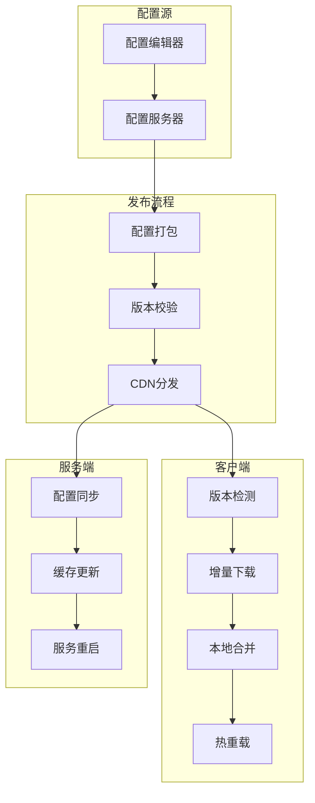

### 17.2 客户端热更新实现

```csharp
/// <summary>
/// 副本配置热更新管理器
/// </summary>
public class DungeonConfigHotUpdater : MonoBehaviour
{
    private static readonly string CONFIG_VERSION_URL = "https://cdn.game.com/config/version.json";
    private static readonly string CONFIG_BUNDLE_URL = "https://cdn.game.com/config/dungeon_refdata.unity3d";

    private int _currentVersion;
    private int _remoteVersion;

    /// <summary>
    /// 检查配置更新
    /// </summary>
    public IEnumerator CheckAndUpdate()
    {
        // 1. 获取本地版本
        _currentVersion = GetLocalConfigVersion();
        Debug.Log($"[ConfigHotUpdate] 本地版本: {_currentVersion}");

        // 2. 获取远程版本
        yield return FetchRemoteVersion();
        Debug.Log($"[ConfigHotUpdate] 远程版本: {_remoteVersion}");

        // 3. 比较版本
        if (_remoteVersion > _currentVersion)
        {
            Debug.Log("[ConfigHotUpdate] 发现新版本，开始更新");
            yield return DownloadAndApplyUpdate();
        }
        else
        {
            Debug.Log("[ConfigHotUpdate] 已是最新版本");
        }
    }

    /// <summary>
    /// 获取远程版本
    /// </summary>
    private IEnumerator FetchRemoteVersion()
    {
        using (UnityWebRequest request = UnityWebRequest.Get(CONFIG_VERSION_URL))
        {
            yield return request.SendWebRequest();

            if (request.result == UnityWebRequest.Result.Success)
            {
                var versionInfo = JsonUtility.FromJson<ConfigVersionInfo>(request.downloadHandler.text);
                _remoteVersion = versionInfo.version;
            }
            else
            {
                Debug.LogError($"[ConfigHotUpdate] 获取远程版本失败: {request.error}");
                _remoteVersion = _currentVersion;
            }
        }
    }

    /// <summary>
    /// 下载并应用更新
    /// </summary>
    private IEnumerator DownloadAndApplyUpdate()
    {
        // 1. 下载新的配置包
        string tempPath = Path.Combine(Application.temporaryCachePath, "dungeon_refdata_new.unity3d");

        using (UnityWebRequest request = UnityWebRequest.Get(CONFIG_BUNDLE_URL))
        {
            yield return request.SendWebRequest();

            if (request.result != UnityWebRequest.Result.Success)
            {
                Debug.LogError($"[ConfigHotUpdate] 下载失败: {request.error}");
                yield break;
            }

            File.WriteAllBytes(tempPath, request.downloadHandler.data);
        }

        // 2. 验证下载的配置
        if (!ValidateConfigBundle(tempPath))
        {
            Debug.LogError("[ConfigHotUpdate] 配置验证失败");
            File.Delete(tempPath);
            yield break;
        }

        // 3. 备份旧配置
        string configPath = Path.Combine(Application.persistentDataPath, "dungeon_refdata.unity3d");
        string backupPath = configPath + ".bak";

        if (File.Exists(configPath))
        {
            File.Copy(configPath, backupPath, true);
        }

        // 4. 应用新配置
        try
        {
            File.Copy(tempPath, configPath, true);
            File.Delete(tempPath);

            // 5. 重新加载配置
            yield return ReloadConfig();

            // 6. 更新版本号
            SaveLocalConfigVersion(_remoteVersion);

            // 7. 删除备份
            if (File.Exists(backupPath))
            {
                File.Delete(backupPath);
            }

            Debug.Log("[ConfigHotUpdate] 更新完成");

            // 8. 通知UI刷新
            WinMsg.SendMsg(WinMsgType.ON_CONFIG_UPDATED);
        }
        catch (Exception e)
        {
            Debug.LogError($"[ConfigHotUpdate] 更新失败: {e.Message}");

            // 恢复备份
            if (File.Exists(backupPath))
            {
                File.Copy(backupPath, configPath, true);
            }
        }
    }

    /// <summary>
    /// 验证配置包
    /// </summary>
    private bool ValidateConfigBundle(string path)
    {
        try
        {
            AssetBundle bundle = AssetBundle.LoadFromFile(path);
            if (bundle == null) return false;

            // 检查必要的配置资源
            string[] requiredAssets = new string[]
            {
                "midday_dungeon",
                "evening_dungeon",
                "guild_dungeon"
            };

            foreach (var asset in requiredAssets)
            {
                if (bundle.LoadAsset(asset) == null)
                {
                    bundle.Unload(true);
                    return false;
                }
            }

            bundle.Unload(true);
            return true;
        }
        catch (Exception e)
        {
            Debug.LogError($"[ConfigHotUpdate] 验证失败: {e.Message}");
            return false;
        }
    }

    /// <summary>
    /// 重新加载配置
    /// </summary>
    private IEnumerator ReloadConfig()
    {
        // 卸载旧的配置
        GRefdataCoreMgr.instance.UnloadDungeonRefData();

        // 加载新配置
        yield return GRefdataCoreMgr.instance.LoadDungeonRefData();

        Debug.Log("[ConfigHotUpdate] 配置重新加载完成");
    }

    private int GetLocalConfigVersion()
    {
        return PlayerPrefs.GetInt("DungeonConfigVersion", 0);
    }

    private void SaveLocalConfigVersion(int version)
    {
        PlayerPrefs.SetInt("DungeonConfigVersion", version);
        PlayerPrefs.Save();
    }
}
```

### 17.3 服务端配置同步

```java
/**
 * 配置热更新服务
 */
@Slf4j
@Service
public class ConfigHotUpdateService {

    @Resource
    private RedisTemplate<String, Object> redisTemplate;

    private static final String CONFIG_VERSION_KEY = "config:dungeon:version";
    private static final String CONFIG_HASH_KEY = "config:dungeon:hash";

    /**
     * 发布新配置
     */
    @Transactional(rollbackFor = Exception.class)
    public void publishNewConfig(ConfigPackage configPackage) {
        log.info("开始发布新配置: version={}", configPackage.getVersion());

        // 1. 验证配置完整性
        ValidationResult result = validateConfigPackage(configPackage);
        if (!result.isValid()) {
            throw new BusinessException("配置验证失败: " + result.getErrorMessage());
        }

        // 2. 备份旧配置
        backupCurrentConfig();

        // 3. 更新配置文件
        updateConfigFiles(configPackage);

        // 4. 更新版本号
        redisTemplate.opsForValue().set(CONFIG_VERSION_KEY, configPackage.getVersion());
        redisTemplate.opsForValue().set(CONFIG_HASH_KEY, configPackage.getHash());

        // 5. 通知所有服务器重新加载
        broadcastConfigReload(configPackage.getVersion());

        log.info("配置发布完成: version={}", configPackage.getVersion());
    }

    /**
     * 验证配置包
     */
    private ValidationResult validateConfigPackage(ConfigPackage configPackage) {
        ValidationResult result = new ValidationResult();

        // 验证版本号
        if (configPackage.getVersion() <= getCurrentVersion()) {
            result.addError("新版本号必须大于当前版本号");
            return result;
        }

        // 验证配置文件完整性
        if (configPackage.getConfigFiles() == null || configPackage.getConfigFiles().isEmpty()) {
            result.addError("配置文件为空");
            return result;
        }

        // 验证每个配置文件
        for (ConfigFile file : configPackage.getConfigFiles()) {
            if (!file.isValid()) {
                result.addError("配置文件无效: " + file.getName());
            }
        }

        // 运行数据验证器
        Map<String, List<String>> validationResults = DungeonConfigValidator.validateAllConfigs();
        for (Map.Entry<String, List<String>> entry : validationResults.entrySet()) {
            if (!entry.getValue().isEmpty()) {
                result.addError(entry.getKey() + ": " + String.join(", ", entry.getValue()));
            }
        }

        return result;
    }

    /**
     * 广播配置重载
     */
    private void broadcastConfigReload(int version) {
        ConfigReloadMessage message = new ConfigReloadMessage();
        message.setVersion(version);
        message.setTimestamp(System.currentTimeMillis());

        // 发送到所有游戏服务器
        GameServerManager.broadcastToAllServers("CONFIG_RELOAD", message);

        log.info("配置重载广播发送完成: version={}", version);
    }

    /**
     * 获取当前版本
     */
    public int getCurrentVersion() {
        Integer version = (Integer) redisTemplate.opsForValue().get(CONFIG_VERSION_KEY);
        return version != null ? version : 0;
    }

    /**
     * 处理配置重载
     */
    public void handleConfigReload(ConfigReloadMessage message) {
        log.info("收到配置重载通知: version={}", message.getVersion());

        try {
            // 1. 清除配置缓存
            RefDataManager.clearAllCache();

            // 2. 重新加载配置
            RefDataManager.loadAll();

            // 3. 验证配置加载成功
            if (RefDataManager.isLoaded()) {
                log.info("配置重载成功: version={}", message.getVersion());
            } else {
                log.error("配置重载失败");
            }
        } catch (Exception e) {
            log.error("配置重载异常", e);
        }
    }
}
```

---

## 十八、配置差异对比工具

### 18.1 版本差异对比

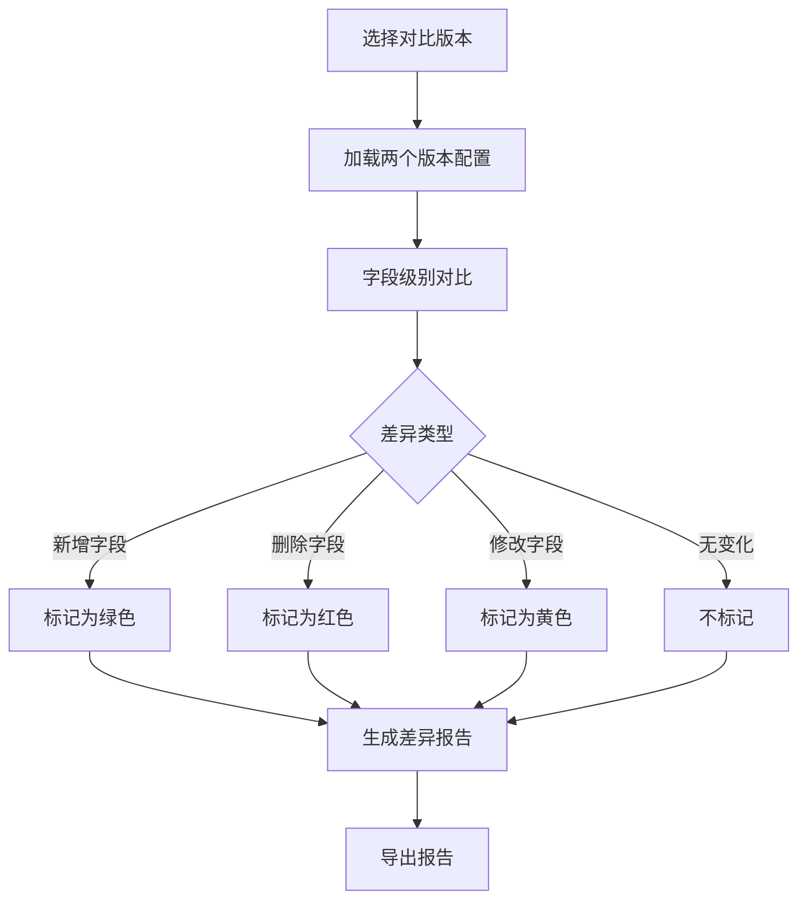

### 18.2 差异对比代码

```csharp
/// <summary>
/// 配置差异对比工具
/// </summary>
public static class DungeonConfigDiffTool
{
    /// <summary>
    /// 对比午间副本配置
    /// </summary>
    public static List<ConfigDiff> CompareMiddayDungeon(
        MiddayDungeonRefObj oldConfig,
        MiddayDungeonRefObj newConfig)
    {
        List<ConfigDiff> diffs = new List<ConfigDiff>();

        if (oldConfig == null && newConfig == null) return diffs;
        if (oldConfig == null)
        {
            diffs.Add(new ConfigDiff
            {
                FieldPath = "root",
                ChangeType = ChangeType.Added,
                OldValue = null,
                NewValue = newConfig
            });
            return diffs;
        }
        if (newConfig == null)
        {
            diffs.Add(new ConfigDiff
            {
                FieldPath = "root",
                ChangeType = ChangeType.Removed,
                OldValue = oldConfig,
                NewValue = null
            });
            return diffs;
        }

        // 对比各字段
        CompareField(diffs, "dungeon_id", oldConfig.dungeon_id, newConfig.dungeon_id);
        CompareField(diffs, "dungeon_name", oldConfig.dungeon_name, newConfig.dungeon_name);
        CompareField(diffs, "open_time", oldConfig.open_time, newConfig.open_time);
        CompareField(diffs, "close_time", oldConfig.close_time, newConfig.close_time);
        CompareField(diffs, "duration", oldConfig.duration, newConfig.duration);
        CompareField(diffs, "daily_count", oldConfig.daily_count, newConfig.daily_count);
        CompareField(diffs, "energy_cost", oldConfig.energy_cost, newConfig.energy_cost);
        CompareField(diffs, "recommended_power", oldConfig.recommended_power, newConfig.recommended_power);
        CompareField(diffs, "reward_pool_id", oldConfig.reward_pool_id, newConfig.reward_pool_id);
        CompareField(diffs, "unlock_level", oldConfig.unlock_level, newConfig.unlock_level);

        return diffs;
    }

    private static void CompareField<T>(List<ConfigDiff> diffs, string fieldName, T oldValue, T newValue)
    {
        if (!Equals(oldValue, newValue))
        {
            diffs.Add(new ConfigDiff
            {
                FieldPath = fieldName,
                ChangeType = oldValue == null ? ChangeType.Added :
                             newValue == null ? ChangeType.Removed : ChangeType.Modified,
                OldValue = oldValue,
                NewValue = newValue
            });
        }
    }

    /// <summary>
    /// 生成差异报告
    /// </summary>
    public static string GenerateDiffReport(List<ConfigDiff> diffs)
    {
        StringBuilder sb = new StringBuilder();
        sb.AppendLine("=== 配置差异报告 ===");
        sb.AppendLine($"生成时间: {DateTime.Now:yyyy-MM-dd HH:mm:ss}");
        sb.AppendLine($"差异总数: {diffs.Count}");
        sb.AppendLine();

        foreach (var diff in diffs)
        {
            string changeTypeStr = diff.ChangeType switch
            {
                ChangeType.Added => "[新增]",
                ChangeType.Removed => "[删除]",
                ChangeType.Modified => "[修改]",
                _ => "[未知]"
            };

            sb.AppendLine($"{changeTypeStr} {diff.FieldPath}");
            sb.AppendLine($"  旧值: {diff.OldValue}");
            sb.AppendLine($"  新值: {diff.NewValue}");
            sb.AppendLine();
        }

        return sb.ToString();
    }
}

public enum ChangeType
{
    Added,
    Removed,
    Modified
}

public class ConfigDiff
{
    public string FieldPath { get; set; }
    public ChangeType ChangeType { get; set; }
    public object OldValue { get; set; }
    public object NewValue { get; set; }
}
```

---

*文档生成时间: 2026-04-11*
