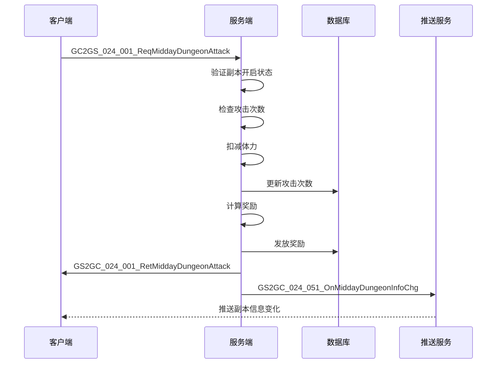
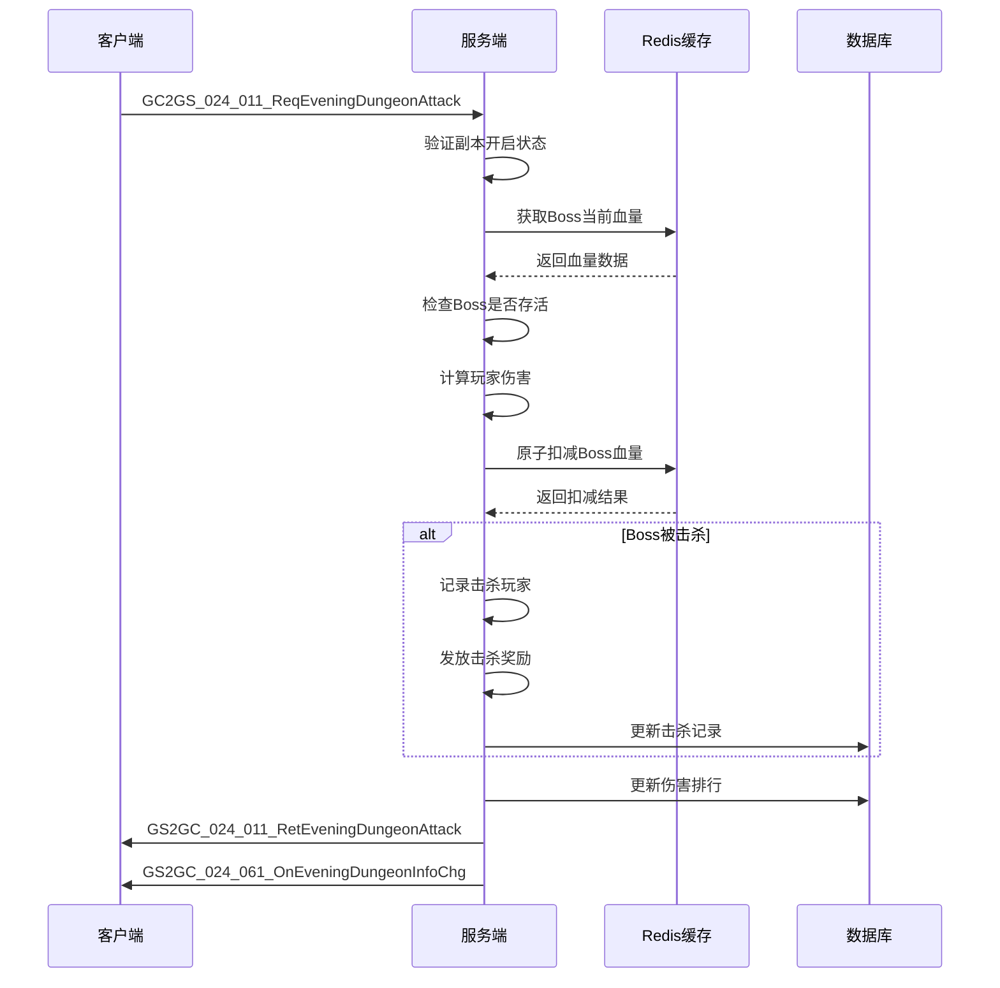
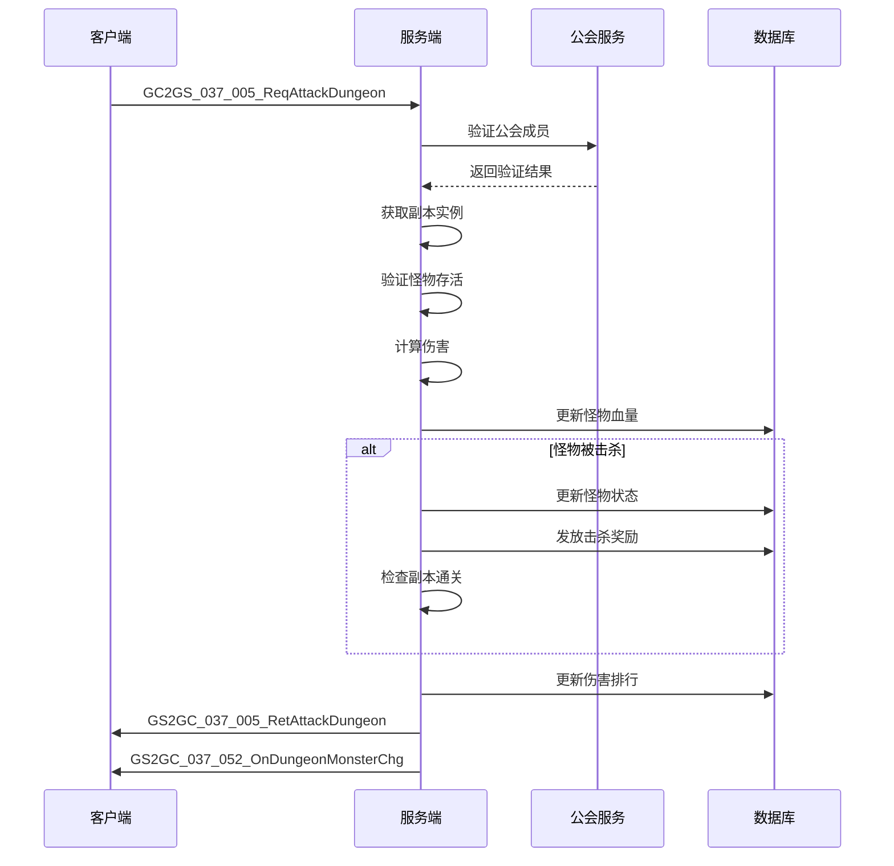
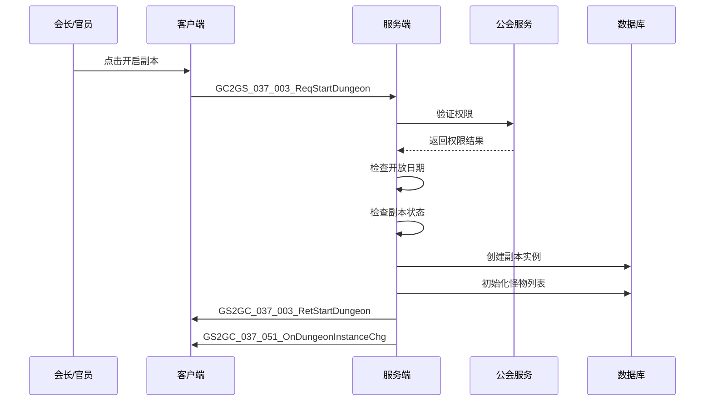

# 副本模块协议文档

## 协议模块编号

模块编号：p024 (DungeonOp) / p037 (GuildDungeonOp)

协议主序号：`24` / `37`

---

## 一、客户端请求协议 (GC2GS)

### 1.1 午间副本协议

#### GC2GS_024_001_ReqMiddayDungeonAttack - 请求午间副本攻击

**功能说明**: 请求玩家对午间副本进行攻击，获取攻击奖励

| 序号 | 字段名 | 类型 | 说明 | 示例 |
|------|--------|------|------|------|
| 1 | dungeonId | int | 副本ID | 1 |

**服务端处理流程**:
1. 验证副本是否开启
2. 检查玩家今日攻击次数
3. 检查玩家体力是否充足
4. 扣减体力
5. 执行攻击，计算奖励
6. 更新攻击次数
7. 返回攻击结果和奖励

**响应**: `GS2GC_024_001_RetMiddayDungeonAttack`

---

#### GC2GS_024_002_ReqMiddayDungeonBorrowAttack - 请求午间副本借用攻击

**功能说明**: 借用好友英雄进行副本攻击

| 序号 | 字段名 | 类型 | 说明 | 示例 |
|------|--------|------|------|------|
| 1 | dungeonId | int | 副本ID | 1 |
| 2 | friendId | long | 好友ID | 10001 |
| 3 | heroId | long | 借用英雄ID | 20001 |

**服务端处理流程**:
1. 验证副本是否开启
2. 验证好友关系
3. 检查借用次数
4. 执行借用攻击
5. 更新借用记录
6. 返回攻击结果

**响应**: `GS2GC_024_002_RetMiddayDungeonBorrowAttack`

---

#### GC2GS_024_003_ReqMiddayDungeonBoxList - 请求午间副本宝箱列表

**功能说明**: 获取当前副本可领取的宝箱列表

| 序号 | 字段名 | 类型 | 说明 | 示例 |
|------|--------|------|------|------|
| 1 | dungeonId | int | 副本ID | 1 |

**服务端处理流程**:
1. 获取副本配置
2. 获取玩家攻击次数
3. 计算可领取宝箱
4. 返回宝箱列表

**响应**: `GS2GC_024_003_RetMiddayDungeonBoxList`

---

#### GC2GS_024_004_ReqMiddayDungeonDrawBox - 请求午间副本领取宝箱

**功能说明**: 领取指定宝箱的奖励

| 序号 | 字段名 | 类型 | 说明 | 示例 |
|------|--------|------|------|------|
| 1 | dungeonId | int | 副本ID | 1 |
| 2 | boxId | int | 宝箱ID | 1 |

**服务端处理流程**:
1. 验证宝箱是否存在
2. 检查宝箱是否已领取
3. 检查领取条件是否满足
4. 发放宝箱奖励
5. 更新领取记录
6. 返回领取结果

**响应**: `GS2GC_024_004_RetMiddayDungeonDrawBox`

---

#### GC2GS_024_005_ReqMiddayDungeonBoxCanDraw - 请求午间副本宝箱可领取状态

**功能说明**: 查询宝箱是否可领取

| 序号 | 字段名 | 类型 | 说明 | 示例 |
|------|--------|------|------|------|
| 1 | dungeonId | int | 副本ID | 1 |
| 2 | boxId | int | 宝箱ID | 1 |

**响应**: `GS2GC_024_005_RetMiddayDungeonBoxCanDraw`

---

#### GC2GS_024_006_ReqMiddayDungeonBoxDrawRecord - 请求午间副本宝箱领取记录

**功能说明**: 获取宝箱领取历史记录

| 序号 | 字段名 | 类型 | 说明 | 示例 |
|------|--------|------|------|------|
| 1 | dungeonId | int | 副本ID | 1 |

**响应**: `GS2GC_024_006_RetMiddayDungeonBoxDrawRecord`

---

### 1.2 晚间副本协议

#### GC2GS_024_011_ReqEveningDungeonAttack - 请求晚间副本攻击

**功能说明**: 请求对世界Boss进行攻击

| 序号 | 字段名 | 类型 | 说明 | 示例 |
|------|--------|------|------|------|
| 1 | bossId | int | Boss ID | 1001 |

**服务端处理流程**:
1. 验证副本是否开启
2. 获取Boss当前血量
3. 检查Boss是否存活
4. 计算玩家伤害
5. 扣减Boss血量（原子操作）
6. 更新伤害排行
7. 检查是否击杀Boss
8. 返回伤害结果

**响应**: `GS2GC_024_011_RetEveningDungeonAttack`

---

#### GC2GS_024_012_ReqEveningDungeonBossInfo - 请求晚间副本Boss信息

**功能说明**: 获取当前Boss的详细信息

| 序号 | 字段名 | 类型 | 说明 | 示例 |
|------|--------|------|------|------|
| 1 | bossId | int | Boss ID | 1001 |

**服务端处理流程**:
1. 获取Boss配置
2. 获取Boss当前状态
3. 返回Boss信息

**响应**: `GS2GC_024_012_RetEveningDungeonBossInfo`

---

#### GC2GS_024_013_ReqEveningDungeonAttackLog - 请求晚间副本攻击日志

**功能说明**: 获取玩家对Boss的攻击记录

| 序号 | 字段名 | 类型 | 说明 | 示例 |
|------|--------|------|------|------|
| 1 | bossId | int | Boss ID | 1001 |

**响应**: `GS2GC_024_013_RetEveningDungeonAttackLog`

---

#### GC2GS_024_014_ReqEveningDungeonRankList - 请求晚间副本排行榜

**功能说明**: 获取伤害排行榜

| 序号 | 字段名 | 类型 | 说明 | 示例 |
|------|--------|------|------|------|
| 1 | bossId | int | Boss ID | 1001 |
| 2 | rankType | int | 排行类型（1伤害，2击杀） | 1 |

**响应**: `GS2GC_024_014_RetEveningDungeonRankList`

---

#### GC2GS_024_015_ReqEveningDungeonDefeatLog - 请求晚间副本击杀日志

**功能说明**: 获取Boss被击杀的历史记录

| 序号 | 字段名 | 类型 | 说明 | 示例 |
|------|--------|------|------|------|
| 1 | count | int | 请求数量 | 10 |

**响应**: `GS2GC_024_015_RetEveningDungeonDefeatLog`

---

### 1.3 公会副本协议

#### GC2GS_037_001_ReqDungeontGlobalSet - 请求公会副本全局设置

**功能说明**: 获取公会副本的全局配置信息

| 序号 | 字段名 | 类型 | 说明 | 示例 |
|------|--------|------|------|------|
| 1 | guildId | long | 公会ID | 10001 |

**响应**: `GS2GC_037_001_RetDungeontGlobalSet`

---

#### GC2GS_037_002_ReqSetAutoStartDungeon - 请求设置自动开始副本

**功能说明**: 设置公会副本是否自动开启

| 序号 | 字段名 | 类型 | 说明 | 示例 |
|------|--------|------|------|------|
| 1 | guildId | long | 公会ID | 10001 |
| 2 | dungeonId | int | 副本ID | 1 |
| 3 | autoStart | bool | 是否自动开始 | true |

**服务端处理流程**:
1. 验证玩家公会权限
2. 检查公会等级
3. 更新自动开始设置
4. 推送设置变更

**响应**: `GS2GC_037_002_RetSetAutoStartDungeon`

---

#### GC2GS_037_003_ReqStartDungeon - 请求开始副本

**功能说明**: 手动开启公会副本

| 序号 | 字段名 | 类型 | 说明 | 示例 |
|------|--------|------|------|------|
| 1 | guildId | long | 公会ID | 10001 |
| 2 | dungeonId | int | 副本ID | 1 |

**服务端处理流程**:
1. 验证玩家公会权限
2. 检查副本是否已开启
3. 检查开放日期
4. 创建副本实例
5. 初始化怪物列表
6. 推送副本开启通知

**响应**: `GS2GC_037_003_RetStartDungeon`

---

#### GC2GS_037_004_ReqUpgradeDungeonLvl - 请求升级副本等级

**功能说明**: 提升公会副本难度等级

| 序号 | 字段名 | 类型 | 说明 | 示例 |
|------|--------|------|------|------|
| 1 | guildId | long | 公会ID | 10001 |
| 2 | dungeonId | int | 副本ID | 1 |

**服务端处理流程**:
1. 验证玩家公会权限
2. 检查当前等级是否已达上限
3. 检查公会资金是否充足
4. 扣除升级费用
5. 更新副本等级
6. 推送等级变更

**响应**: `GS2GC_037_004_RetUpgradeDungeonLvl`

---

#### GC2GS_037_005_ReqAttackDungeon - 请求攻击副本

**功能说明**: 攻击公会副本中的怪物

| 序号 | 字段名 | 类型 | 说明 | 示例 |
|------|--------|------|------|------|
| 1 | guildId | long | 公会ID | 10001 |
| 2 | dungeonId | int | 副本ID | 1 |
| 3 | monsterId | int | 怪物ID | 1001 |

**服务端处理流程**:
1. 验证副本是否开启
2. 验证怪物是否存在且存活
3. 计算玩家伤害
4. 扣减怪物血量（原子操作）
5. 更新伤害排行
6. 检查怪物是否死亡
7. 检查副本是否通关
8. 返回攻击结果

**响应**: `GS2GC_037_005_RetAttackDungeon`

---

#### GC2GS_037_006_ReqRecoverHeroFight - 请求恢复英雄战力

**功能说明**: 恢复副本中已阵亡的英雄

| 序号 | 字段名 | 类型 | 说明 | 示例 |
|------|--------|------|------|------|
| 1 | guildId | long | 公会ID | 10001 |
| 2 | heroId | long | 英雄ID | 20001 |

**响应**: `GS2GC_037_006_RetRecoverHeroFight`

---

#### GC2GS_037_007_ReqDamageRank - 请求伤害排行榜

**功能说明**: 获取公会副本伤害排行

| 序号 | 字段名 | 类型 | 说明 | 示例 |
|------|--------|------|------|------|
| 1 | guildId | long | 公会ID | 10001 |
| 2 | dungeonId | int | 副本ID | 1 |

**响应**: `GS2GC_037_007_RetDamageRank`

---

#### GC2GS_037_008_ReqGainAllDungeonReward - 请求领取所有副本奖励

**功能说明**: 一键领取所有可领取的副本奖励

| 序号 | 字段名 | 类型 | 说明 | 示例 |
|------|--------|------|------|------|
| 1 | guildId | long | 公会ID | 10001 |
| 2 | dungeonId | int | 副本ID | 1 |

**服务端处理流程**:
1. 获取副本信息
2. 计算可领取奖励
3. 发放所有奖励
4. 更新领取记录
5. 推送奖励领取通知

**响应**: `GS2GC_037_008_RetGainAllDungeonReward`

---

#### GC2GS_037_010_ReqGetDungeonLogList - 请求副本日志列表

**功能说明**: 获取公会副本的战斗日志

| 序号 | 字段名 | 类型 | 说明 | 示例 |
|------|--------|------|------|------|
| 1 | guildId | long | 公会ID | 10001 |
| 2 | dungeonId | int | 副本ID | 1 |
| 3 | pageNo | int | 页码 | 1 |
| 4 | pageSize | int | 每页数量 | 20 |

**响应**: `GS2GC_037_010_RetGetDungeonLogList`

---

#### GC2GS_037_011_ReqGainDungeonReward - 请求领取副本奖励

**功能说明**: 领取指定奖励

| 序号 | 字段名 | 类型 | 说明 | 示例 |
|------|--------|------|------|------|
| 1 | guildId | long | 公会ID | 10001 |
| 2 | dungeonId | int | 副本ID | 1 |
| 3 | rewardId | int | 奖励ID | 1 |

**响应**: `GS2GC_037_011_RetGainDungeonReward`

---

#### GC2GS_037_012_ReqSetTagMonsterList - 请求设置标记怪物列表

**功能说明**: 标记重点攻击的怪物

| 序号 | 字段名 | 类型 | 说明 | 示例 |
|------|--------|------|------|------|
| 1 | guildId | long | 公会ID | 10001 |
| 2 | dungeonId | int | 副本ID | 1 |
| 3 | monsterIdList | List\<int\> | 怪物ID列表 | [1001, 1002] |

**响应**: `GS2GC_037_012_RetSetTagMonsterList`

---

## 二、服务端响应协议 (GS2GC)

### 2.1 午间副本响应

| 协议名 | 主序号 | 子序号 | 说明 |
|--------|--------|--------|------|
| GS2GC_024_001_RetMiddayDungeonAttack | 24 | 1 | 午间副本攻击结果 |
| GS2GC_024_002_RetMiddayDungeonBorrowAttack | 24 | 2 | 借用攻击结果 |
| GS2GC_024_003_RetMiddayDungeonBoxList | 24 | 3 | 宝箱列表 |
| GS2GC_024_004_RetMiddayDungeonDrawBox | 24 | 4 | 领取宝箱结果 |
| GS2GC_024_005_RetMiddayDungeonBoxCanDraw | 24 | 5 | 宝箱可领取状态 |
| GS2GC_024_006_RetMiddayDungeonBoxDrawRecord | 24 | 6 | 宝箱领取记录 |

### 2.2 晚间副本响应

| 协议名 | 主序号 | 子序号 | 说明 |
|--------|--------|--------|------|
| GS2GC_024_011_RetEveningDungeonAttack | 24 | 11 | 晚间副本攻击结果 |
| GS2GC_024_012_RetEveningDungeonBossInfo | 24 | 12 | Boss信息 |
| GS2GC_024_013_RetEveningDungeonAttackLog | 24 | 13 | 攻击日志 |
| GS2GC_024_014_RetEveningDungeonRankList | 24 | 14 | 排行榜 |
| GS2GC_024_015_RetEveningDungeonDefeatLog | 24 | 15 | 击杀日志 |

### 2.3 公会副本响应

| 协议名 | 主序号 | 子序号 | 说明 |
|--------|--------|--------|------|
| GS2GC_037_001_RetDungeontGlobalSet | 37 | 1 | 公会副本全局设置 |
| GS2GC_037_002_RetSetAutoStartDungeon | 37 | 2 | 设置自动开始结果 |
| GS2GC_037_003_RetStartDungeon | 37 | 3 | 开始副本结果 |
| GS2GC_037_004_RetUpgradeDungeonLvl | 37 | 4 | 升级副本等级结果 |
| GS2GC_037_005_RetAttackDungeon | 37 | 5 | 攻击副本结果 |
| GS2GC_037_006_RetRecoverHeroFight | 37 | 6 | 恢复英雄战力结果 |
| GS2GC_037_007_RetDamageRank | 37 | 7 | 伤害排行榜 |
| GS2GC_037_008_RetGainAllDungeonReward | 37 | 8 | 领取所有奖励结果 |
| GS2GC_037_010_RetGetDungeonLogList | 37 | 10 | 副本日志列表 |
| GS2GC_037_011_RetGainDungeonReward | 37 | 11 | 领取副本奖励结果 |
| GS2GC_037_012_RetSetTagMonsterList | 37 | 12 | 设置标记怪物结果 |

### 2.4 推送通知协议

| 协议名 | 主序号 | 子序号 | 说明 |
|--------|--------|--------|------|
| GS2GC_024_051_OnMiddayDungeonInfoChg | 24 | 51 | 午间副本信息变化推送 |
| GS2GC_024_052_OnMiddayDungeonTimeInfoChg | 24 | 52 | 午间副本时间信息变化推送 |
| GS2GC_024_061_OnEveningDungeonInfoChg | 24 | 61 | 晚间副本信息变化推送 |
| GS2GC_024_062_OnEveningDungeonTimeInfoChg | 24 | 62 | 晚间副本时间信息变化推送 |
| GS2GC_037_050_OnDungeonSetChg | 37 | 50 | 公会副本设置变化推送 |
| GS2GC_037_051_OnDungeonInstanceChg | 37 | 51 | 公会副本实例变化推送 |
| GS2GC_037_052_OnDungeonMonsterChg | 37 | 52 | 公会副本怪物变化推送 |
| GS2GC_037_053_OnDungeonGainedRewardChg | 37 | 53 | 公会副本奖励领取变化推送 |
| GS2GC_037_054_OnDungeonHeroFightChg | 37 | 54 | 公会副本英雄战力变化推送 |
| GS2GC_037_055_OnDungeonTagMonsterChg | 37 | 55 | 公会副本标记怪物变化推送 |
| GS2GC_037_056_OnDungeonPush | 37 | 56 | 公会副本推送通知 |

---

## 三、协议数据结构

### 3.1 MiddayDungeonInfo - 午间副本信息

| 序号 | 字段名 | 类型 | 说明 |
|------|--------|------|------|
| 1 | dungeonId | int | 副本ID |
| 2 | state | int | 状态（EDungeonState） |
| 3 | boxList | List\<MiddayDungeonBoxInfo\> | 宝箱列表 |
| 4 | attackCount | int | 今日攻击次数 |
| 5 | borrowCount | int | 今日借用次数 |
| 6 | endTime | long | 结束时间戳 |

### 3.2 MiddayDungeonBoxInfo - 午间副本宝箱信息

| 序号 | 字段名 | 类型 | 说明 |
|------|--------|------|------|
| 1 | boxId | int | 宝箱ID |
| 2 | state | int | 状态（EBoxState） |
| 3 | rewardList | List\<NPCommonCostItem\> | 奖励列表 |

### 3.3 EveningDungeonInfo - 晚间副本信息

| 序号 | 字段名 | 类型 | 说明 |
|------|--------|------|------|
| 1 | dungeonId | int | 副本ID |
| 2 | state | int | 状态（EDungeonState） |
| 3 | bossInfo | EveningDungeonBossInfo | Boss信息 |
| 4 | rankList | List\<EveningDungeonRankInfo\> | 排行榜 |
| 5 | myRank | int | 我的排名 |
| 6 | myDamage | long | 我的总伤害 |
| 7 | endTime | long | 结束时间戳 |

### 3.4 EveningDungeonBossInfo - 晚间副本Boss信息

| 序号 | 字段名 | 类型 | 说明 |
|------|--------|------|------|
| 1 | bossId | int | Boss ID |
| 2 | bossName | string | Boss名称 |
| 3 | bossLevel | int | Boss等级 |
| 4 | maxHp | long | 最大血量 |
| 5 | currentHp | long | 当前血量 |
| 6 | isAlive | bool | 是否存活 |
| 7 | killPlayerId | long | 击杀玩家ID（0表示未击杀） |
| 8 | killPlayerName | string | 击杀玩家名称 |

### 3.5 EveningDungeonRankInfo - 晚间副本排行信息

| 序号 | 字段名 | 类型 | 说明 |
|------|--------|------|------|
| 1 | rank | int | 排名 |
| 2 | playerId | long | 玩家ID |
| 3 | playerName | string | 玩家名称 |
| 4 | damage | long | 总伤害 |
| 5 | attackCount | int | 攻击次数 |

### 3.6 GuildDungeonInfo - 公会副本信息

| 序号 | 字段名 | 类型 | 说明 |
|------|--------|------|------|
| 1 | dungeonId | int | 副本ID |
| 2 | dungeonLvl | int | 副本等级 |
| 3 | state | int | 状态（EDungeonState） |
| 4 | monsterList | List\<GuildDungeonMonsterInfo\> | 怪物列表 |
| 5 | damageRank | List\<DamageRankInfo\> | 伤害排行 |
| 6 | isAutoStart | bool | 是否自动开始 |
| 7 | openDayList | List\<int\> | 开放日期 |
| 8 | startTime | long | 开始时间戳 |
| 9 | endTime | long | 结束时间戳 |

### 3.7 GuildDungeonMonsterInfo - 公会副本怪物信息

| 序号 | 字段名 | 类型 | 说明 |
|------|--------|------|------|
| 1 | monsterId | int | 怪物ID |
| 2 | monsterName | string | 怪物名称 |
| 3 | maxHp | long | 最大血量 |
| 4 | currentHp | long | 当前血量 |
| 5 | state | int | 状态（EMonsterState） |
| 6 | isTagged | bool | 是否被标记 |

### 3.8 DamageRankInfo - 伤害排行信息

| 序号 | 字段名 | 类型 | 说明 |
|------|--------|------|------|
| 1 | rank | int | 排名 |
| 2 | playerId | long | 玩家ID |
| 3 | playerName | string | 玩家名称 |
| 4 | damage | long | 总伤害 |
| 5 | killCount | int | 击杀怪物数 |

### 3.9 AttackResultInfo - 攻击结果信息

| 序号 | 字段名 | 类型 | 说明 |
|------|--------|------|------|
| 1 | damage | long | 造成伤害 |
| 2 | isKill | bool | 是否击杀 |
| 3 | rewardList | List\<NPCommonCostItem\> | 获得奖励 |

---

## 四、协议时序图

### 4.1 午间副本攻击流程

### 4.2 晚间副本攻击流程

### 4.3 公会副本攻击流程

### 4.4 公会副本开启流程

---

## 五、错误码定义

| 错误码 | 错误信息 | 说明 |
|--------|----------|------|
| 24001 | DUNGEON_NOT_EXIST | 副本不存在 |
| 24002 | DUNGEON_NOT_OPEN | 副本未开启 |
| 24003 | DUNGEON_ALREADY_ENDED | 副本已结束 |
| 24004 | DUNGEON_ATTACK_COUNT_EXCEEDED | 攻击次数已用完 |
| 24005 | DUNGEON_ENERGY_NOT_ENOUGH | 体力不足 |
| 24006 | DUNGEON_BOX_NOT_EXIST | 宝箱不存在 |
| 24007 | DUNGEON_BOX_ALREADY_DRAWN | 宝箱已领取 |
| 24008 | DUNGEON_BOX_CONDITION_NOT_MET | 宝箱领取条件未满足 |
| 24009 | DUNGEON_BOSS_NOT_EXIST | Boss不存在 |
| 24010 | DUNGEON_BOSS_ALREADY_DEAD | Boss已死亡 |
| 24011 | DUNGEON_MONSTER_NOT_EXIST | 怪物不存在 |
| 24012 | DUNGEON_MONSTER_ALREADY_DEAD | 怪物已死亡 |
| 24013 | DUNGEON_NOT_UNLOCK | 副本未解锁 |
| 24014 | DUNGEON_LEVEL_MAX | 副本等级已达上限 |
| 24015 | DUNGEON_GUILD_LEVEL_NOT_ENOUGH | 公会等级不足 |
| 24016 | DUNGEON_NO_PERMISSION | 无权限操作 |
| 24017 | DUNGEON_BORROW_COUNT_EXCEEDED | 借用次数已用完 |
| 24018 | DUNGEON_FRIEND_NOT_EXIST | 好友不存在 |
| 24019 | DUNGEON_HERO_NOT_AVAILABLE | 英雄不可用 |
| 24020 | DUNGEON_REWARD_ALREADY_GAINED | 奖励已领取 |

---

*文档生成时间: 2026-04-11*
