# 副本模块协议文档

## 协议模块编号

模块编号：p024 (DungeonOp) / p037 (GuildDungeonOp)

协议主序号：`24` / `37`

---

## 一、协议架构总览

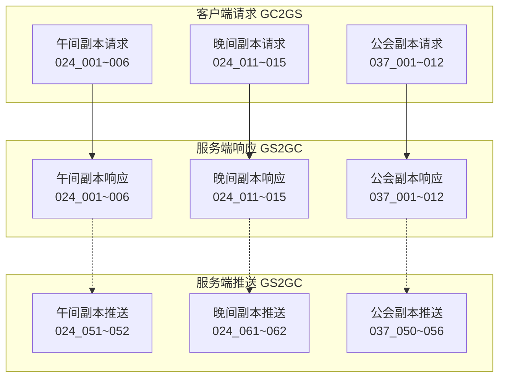

---

## 二、客户端请求协议 (GC2GS)

### 2.1 午间副本协议

#### GC2GS_024_001_ReqMiddayDungeonAttack - 请求午间副本攻击

**功能说明**: 请求玩家对午间副本进行攻击，获取攻击奖励

**协议编号**: 主序号 24, 子序号 1

| 序号 | 字段名 | 类型 | 说明 | 示例 |
|------|--------|------|------|------|
| 1 | dungeonId | int | 副本ID | 1 |

**服务端处理流程**:

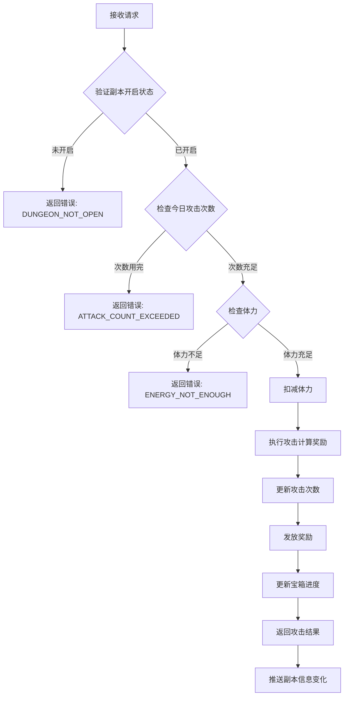

**响应**: `GS2GC_024_001_RetMiddayDungeonAttack`

---

#### GC2GS_024_002_ReqMiddayDungeonBorrowAttack - 请求午间副本借用攻击

**功能说明**: 借用好友英雄进行副本攻击

**协议编号**: 主序号 24, 子序号 2

| 序号 | 字段名 | 类型 | 说明 | 示例 |
|------|--------|------|------|------|
| 1 | dungeonId | int | 副本ID | 1 |
| 2 | friendId | long | 好友ID | 10001 |
| 3 | heroId | long | 借用英雄ID | 20001 |

**服务端处理流程**:
1. 验证副本是否开启
2. 验证好友关系
3. 检查借用次数
4. 执行借用攻击（奖励加成20%）
5. 更新借用记录
6. 返回攻击结果

**响应**: `GS2GC_024_002_RetMiddayDungeonBorrowAttack`

---

#### GC2GS_024_003_ReqMiddayDungeonBoxList - 请求午间副本宝箱列表

**功能说明**: 获取当前副本可领取的宝箱列表

**协议编号**: 主序号 24, 子序号 3

| 序号 | 字段名 | 类型 | 说明 | 示例 |
|------|--------|------|------|------|
| 1 | dungeonId | int | 副本ID | 1 |

**响应**: `GS2GC_024_003_RetMiddayDungeonBoxList`

---

#### GC2GS_024_004_ReqMiddayDungeonDrawBox - 请求午间副本领取宝箱

**功能说明**: 领取指定宝箱的奖励

**协议编号**: 主序号 24, 子序号 4

| 序号 | 字段名 | 类型 | 说明 | 示例 |
|------|--------|------|------|------|
| 1 | dungeonId | int | 副本ID | 1 |
| 2 | boxId | int | 宝箱ID | 1 |

**服务端处理流程**:

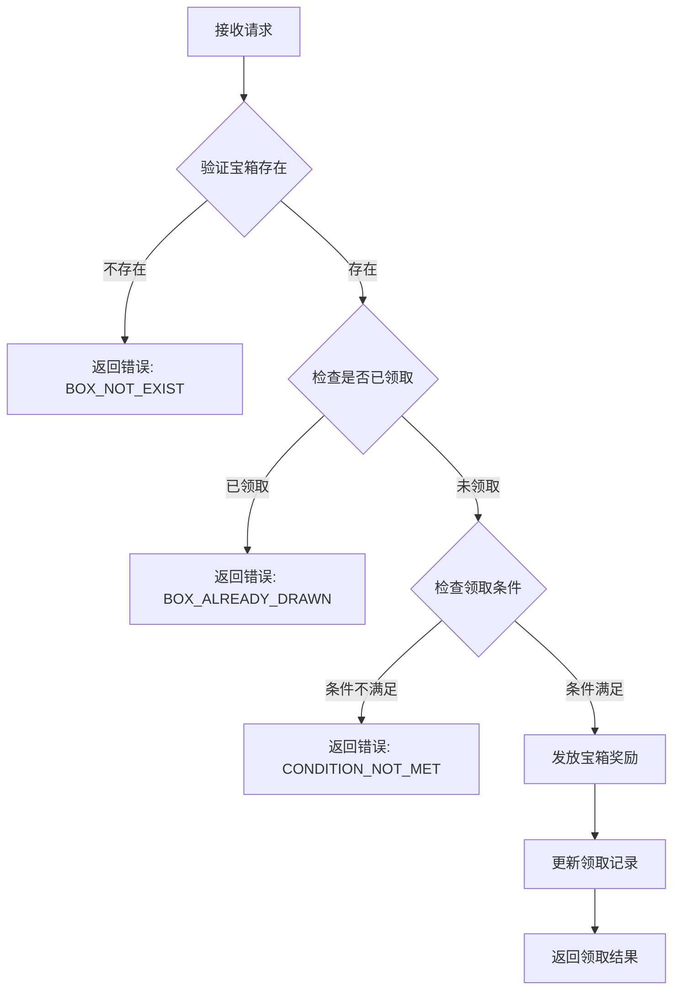

**响应**: `GS2GC_024_004_RetMiddayDungeonDrawBox`

---

#### GC2GS_024_005_ReqMiddayDungeonBoxCanDraw - 请求午间副本宝箱可领取状态

**功能说明**: 查询宝箱是否可领取

**协议编号**: 主序号 24, 子序号 5

| 序号 | 字段名 | 类型 | 说明 | 示例 |
|------|--------|------|------|------|
| 1 | dungeonId | int | 副本ID | 1 |
| 2 | boxId | int | 宝箱ID | 1 |

**响应**: `GS2GC_024_005_RetMiddayDungeonBoxCanDraw`

---

#### GC2GS_024_006_ReqMiddayDungeonBoxDrawRecord - 请求午间副本宝箱领取记录

**功能说明**: 获取宝箱领取历史记录

**协议编号**: 主序号 24, 子序号 6

| 序号 | 字段名 | 类型 | 说明 | 示例 |
|------|--------|------|------|------|
| 1 | dungeonId | int | 副本ID | 1 |

**响应**: `GS2GC_024_006_RetMiddayDungeonBoxDrawRecord`

---

### 2.2 晚间副本协议

#### GC2GS_024_011_ReqEveningDungeonAttack - 请求晚间副本攻击

**功能说明**: 请求对世界Boss进行攻击

**协议编号**: 主序号 24, 子序号 11

| 序号 | 字段名 | 类型 | 说明 | 示例 |
|------|--------|------|------|------|
| 1 | bossId | int | Boss ID | 1001 |

**服务端处理流程**:

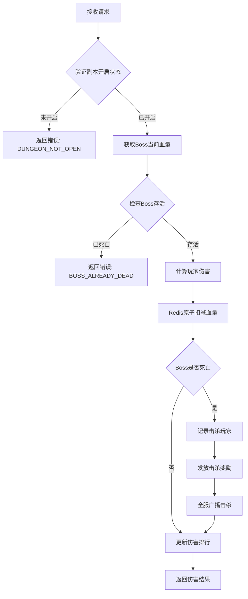

**响应**: `GS2GC_024_011_RetEveningDungeonAttack`

---

#### GC2GS_024_012_ReqEveningDungeonBossInfo - 请求晚间副本Boss信息

**功能说明**: 获取当前Boss的详细信息

**协议编号**: 主序号 24, 子序号 12

| 序号 | 字段名 | 类型 | 说明 | 示例 |
|------|--------|------|------|------|
| 1 | bossId | int | Boss ID | 1001 |

**响应**: `GS2GC_024_012_RetEveningDungeonBossInfo`

---

#### GC2GS_024_013_ReqEveningDungeonAttackLog - 请求晚间副本攻击日志

**功能说明**: 获取玩家对Boss的攻击记录

**协议编号**: 主序号 24, 子序号 13

| 序号 | 字段名 | 类型 | 说明 | 示例 |
|------|--------|------|------|------|
| 1 | bossId | int | Boss ID | 1001 |

**响应**: `GS2GC_024_013_RetEveningDungeonAttackLog`

---

#### GC2GS_024_014_ReqEveningDungeonRankList - 请求晚间副本排行榜

**功能说明**: 获取伤害排行榜

**协议编号**: 主序号 24, 子序号 14

| 序号 | 字段名 | 类型 | 说明 | 示例 |
|------|--------|------|------|------|
| 1 | bossId | int | Boss ID | 1001 |
| 2 | rankType | int | 排行类型（1伤害，2击杀） | 1 |

**响应**: `GS2GC_024_014_RetEveningDungeonRankList`

---

#### GC2GS_024_015_ReqEveningDungeonDefeatLog - 请求晚间副本击杀日志

**功能说明**: 获取Boss被击杀的历史记录

**协议编号**: 主序号 24, 子序号 15

| 序号 | 字段名 | 类型 | 说明 | 示例 |
|------|--------|------|------|------|
| 1 | count | int | 请求数量 | 10 |

**响应**: `GS2GC_024_015_RetEveningDungeonDefeatLog`

---

### 2.3 公会副本协议

#### GC2GS_037_001_ReqDungeontGlobalSet - 请求公会副本全局设置

**功能说明**: 获取公会副本的全局配置信息

**协议编号**: 主序号 37, 子序号 1

| 序号 | 字段名 | 类型 | 说明 | 示例 |
|------|--------|------|------|------|
| 1 | guildId | long | 公会ID | 10001 |

**响应**: `GS2GC_037_001_RetDungeontGlobalSet`

---

#### GC2GS_037_002_ReqSetAutoStartDungeon - 请求设置自动开始副本

**功能说明**: 设置公会副本是否自动开启

**协议编号**: 主序号 37, 子序号 2

| 序号 | 字段名 | 类型 | 说明 | 示例 |
|------|--------|------|------|------|
| 1 | guildId | long | 公会ID | 10001 |
| 2 | dungeonId | int | 副本ID | 1 |
| 3 | autoStart | bool | 是否自动开始 | true |

**服务端处理流程**:
1. 验证玩家公会权限
2. 检查公会等级
3. 更新自动开始设置
4. 推送设置变更

**响应**: `GS2GC_037_002_RetSetAutoStartDungeon`

---

#### GC2GS_037_003_ReqStartDungeon - 请求开始副本

**功能说明**: 手动开启公会副本

**协议编号**: 主序号 37, 子序号 3

| 序号 | 字段名 | 类型 | 说明 | 示例 |
|------|--------|------|------|------|
| 1 | guildId | long | 公会ID | 10001 |
| 2 | dungeonId | int | 副本ID | 1 |

**服务端处理流程**:

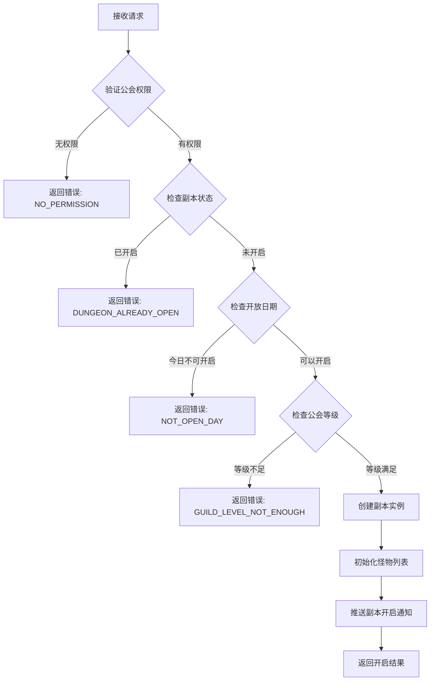

**响应**: `GS2GC_037_003_RetStartDungeon`

---

#### GC2GS_037_004_ReqUpgradeDungeonLvl - 请求升级副本等级

**功能说明**: 提升公会副本难度等级

**协议编号**: 主序号 37, 子序号 4

| 序号 | 字段名 | 类型 | 说明 | 示例 |
|------|--------|------|------|------|
| 1 | guildId | long | 公会ID | 10001 |
| 2 | dungeonId | int | 副本ID | 1 |

**服务端处理流程**:
1. 验证玩家公会权限
2. 检查当前等级是否已达上限
3. 检查公会资金是否充足
4. 扣除升级费用
5. 更新副本等级
6. 推送等级变更

**响应**: `GS2GC_037_004_RetUpgradeDungeonLvl`

---

#### GC2GS_037_005_ReqAttackDungeon - 请求攻击副本

**功能说明**: 攻击公会副本中的怪物

**协议编号**: 主序号 37, 子序号 5

| 序号 | 字段名 | 类型 | 说明 | 示例 |
|------|--------|------|------|------|
| 1 | guildId | long | 公会ID | 10001 |
| 2 | dungeonId | int | 副本ID | 1 |
| 3 | monsterId | int | 怪物ID | 1001 |

**服务端处理流程**:
1. 验证副本是否开启
2. 验证怪物是否存在且存活
3. 计算玩家伤害
4. 扣减怪物血量（原子操作）
5. 更新伤害排行
6. 检查怪物是否死亡
7. 检查副本是否通关
8. 返回攻击结果

**响应**: `GS2GC_037_005_RetAttackDungeon`

---

#### GC2GS_037_006_ReqRecoverHeroFight - 请求恢复英雄战力

**功能说明**: 恢复副本中已阵亡的英雄

**协议编号**: 主序号 37, 子序号 6

| 序号 | 字段名 | 类型 | 说明 | 示例 |
|------|--------|------|------|------|
| 1 | guildId | long | 公会ID | 10001 |
| 2 | heroId | long | 英雄ID | 20001 |

**响应**: `GS2GC_037_006_RetRecoverHeroFight`

---

#### GC2GS_037_007_ReqDamageRank - 请求伤害排行榜

**功能说明**: 获取公会副本伤害排行

**协议编号**: 主序号 37, 子序号 7

| 序号 | 字段名 | 类型 | 说明 | 示例 |
|------|--------|------|------|------|
| 1 | guildId | long | 公会ID | 10001 |
| 2 | dungeonId | int | 副本ID | 1 |

**响应**: `GS2GC_037_007_RetDamageRank`

---

#### GC2GS_037_008_ReqGainAllDungeonReward - 请求领取所有副本奖励

**功能说明**: 一键领取所有可领取的副本奖励

**协议编号**: 主序号 37, 子序号 8

| 序号 | 字段名 | 类型 | 说明 | 示例 |
|------|--------|------|------|------|
| 1 | guildId | long | 公会ID | 10001 |
| 2 | dungeonId | int | 副本ID | 1 |

**服务端处理流程**:
1. 获取副本信息
2. 计算可领取奖励
3. 发放所有奖励
4. 更新领取记录
5. 推送奖励领取通知

**响应**: `GS2GC_037_008_RetGainAllDungeonReward`

---

#### GC2GS_037_010_ReqGetDungeonLogList - 请求副本日志列表

**功能说明**: 获取公会副本的战斗日志

**协议编号**: 主序号 37, 子序号 10

| 序号 | 字段名 | 类型 | 说明 | 示例 |
|------|--------|------|------|------|
| 1 | guildId | long | 公会ID | 10001 |
| 2 | dungeonId | int | 副本ID | 1 |
| 3 | pageNo | int | 页码 | 1 |
| 4 | pageSize | int | 每页数量 | 20 |

**响应**: `GS2GC_037_010_RetGetDungeonLogList`

---

#### GC2GS_037_011_ReqGainDungeonReward - 请求领取副本奖励

**功能说明**: 领取指定奖励

**协议编号**: 主序号 37, 子序号 11

| 序号 | 字段名 | 类型 | 说明 | 示例 |
|------|--------|------|------|------|
| 1 | guildId | long | 公会ID | 10001 |
| 2 | dungeonId | int | 副本ID | 1 |
| 3 | rewardId | int | 奖励ID | 1 |

**响应**: `GS2GC_037_011_RetGainDungeonReward`

---

#### GC2GS_037_012_ReqSetTagMonsterList - 请求设置标记怪物列表

**功能说明**: 标记重点攻击的怪物

**协议编号**: 主序号 37, 子序号 12

| 序号 | 字段名 | 类型 | 说明 | 示例 |
|------|--------|------|------|------|
| 1 | guildId | long | 公会ID | 10001 |
| 2 | dungeonId | int | 副本ID | 1 |
| 3 | monsterIdList | List\<int\> | 怪物ID列表 | [1001, 1002] |

**响应**: `GS2GC_037_012_RetSetTagMonsterList`

---

## 三、服务端响应协议 (GS2GC)

### 3.1 午间副本响应

#### GS2GC_024_001_RetMiddayDungeonAttack - 午间副本攻击结果

**协议编号**: 主序号 24, 子序号 1

| 序号 | 字段名 | 类型 | 说明 |
|------|--------|------|------|
| 1 | errCode | int | 错误码（0表示成功） |
| 2 | rewardList | List\<NPCommonCostItem\> | 获得奖励列表 |
| 3 | attackCount | int | 当前攻击次数 |
| 4 | endTime | long | 副本结束时间戳 |

#### GS2GC_024_002_RetMiddayDungeonBorrowAttack - 借用攻击结果

**协议编号**: 主序号 24, 子序号 2

| 序号 | 字段名 | 类型 | 说明 |
|------|--------|------|------|
| 1 | errCode | int | 错误码（0表示成功） |
| 2 | rewardList | List\<NPCommonCostItem\> | 获得奖励列表 |
| 3 | borrowCount | int | 当前借用次数 |

#### GS2GC_024_003_RetMiddayDungeonBoxList - 宝箱列表

**协议编号**: 主序号 24, 子序号 3

| 序号 | 字段名 | 类型 | 说明 |
|------|--------|------|------|
| 1 | errCode | int | 错误码（0表示成功） |
| 2 | boxList | List\<MiddayDungeonBoxInfo\> | 宝箱信息列表 |

#### GS2GC_024_004_RetMiddayDungeonDrawBox - 领取宝箱结果

**协议编号**: 主序号 24, 子序号 4

| 序号 | 字段名 | 类型 | 说明 |
|------|--------|------|------|
| 1 | errCode | int | 错误码（0表示成功） |
| 2 | rewardList | List\<NPCommonCostItem\> | 宝箱奖励列表 |

#### GS2GC_024_005_RetMiddayDungeonBoxCanDraw - 宝箱可领取状态

**协议编号**: 主序号 24, 子序号 5

| 序号 | 字段名 | 类型 | 说明 |
|------|--------|------|------|
| 1 | errCode | int | 错误码（0表示成功） |
| 2 | canDraw | bool | 是否可领取 |
| 3 | boxState | int | 宝箱状态（EBoxState） |

#### GS2GC_024_006_RetMiddayDungeonBoxDrawRecord - 宝箱领取记录

**协议编号**: 主序号 24, 子序号 6

| 序号 | 字段名 | 类型 | 说明 |
|------|--------|------|------|
| 1 | errCode | int | 错误码（0表示成功） |
| 2 | drawRecordList | List\<int\> | 已领取宝箱ID列表 |

---

### 3.2 晚间副本响应

#### GS2GC_024_011_RetEveningDungeonAttack - 晚间副本攻击结果

**协议编号**: 主序号 24, 子序号 11

| 序号 | 字段名 | 类型 | 说明 |
|------|--------|------|------|
| 1 | errCode | int | 错误码（0表示成功） |
| 2 | damage | long | 本次伤害 |
| 3 | isKill | bool | 是否击杀Boss |
| 4 | rewardList | List\<NPCommonCostItem\> | 获得奖励列表 |
| 5 | myRank | int | 我的当前排名 |
| 6 | currentHp | long | Boss当前血量 |

#### GS2GC_024_012_RetEveningDungeonBossInfo - Boss信息

**协议编号**: 主序号 24, 子序号 12

| 序号 | 字段名 | 类型 | 说明 |
|------|--------|------|------|
| 1 | errCode | int | 错误码（0表示成功） |
| 2 | bossInfo | EveningDungeonBossInfo | Boss详细信息 |

#### GS2GC_024_013_RetEveningDungeonAttackLog - 攻击日志

**协议编号**: 主序号 24, 子序号 13

| 序号 | 字段名 | 类型 | 说明 |
|------|--------|------|------|
| 1 | errCode | int | 错误码（0表示成功） |
| 2 | attackLogList | List\<EveningDungeon_AttackLog\> | 攻击日志列表 |

#### GS2GC_024_014_RetEveningDungeonRankList - 排行榜

**协议编号**: 主序号 24, 子序号 14

| 序号 | 字段名 | 类型 | 说明 |
|------|--------|------|------|
| 1 | errCode | int | 错误码（0表示成功） |
| 2 | rankList | List\<EveningDungeonRankInfo\> | 排行榜列表 |
| 3 | myRank | int | 我的排名 |
| 4 | myDamage | long | 我的总伤害 |

#### GS2GC_024_015_RetEveningDungeonDefeatLog - 击杀日志

**协议编号**: 主序号 24, 子序号 15

| 序号 | 字段名 | 类型 | 说明 |
|------|--------|------|------|
| 1 | errCode | int | 错误码（0表示成功） |
| 2 | defeatLogList | List\<EveningDungeon_DefeatInfo\> | 击杀日志列表 |

---

### 3.3 公会副本响应

#### GS2GC_037_001_RetDungeontGlobalSet - 公会副本全局设置

**协议编号**: 主序号 37, 子序号 1

| 序号 | 字段名 | 类型 | 说明 |
|------|--------|------|------|
| 1 | errCode | int | 错误码（0表示成功） |
| 2 | setInfo | GuildDungeon_SetInfo | 副本设置信息 |

#### GS2GC_037_002_RetSetAutoStartDungeon - 设置自动开始结果

**协议编号**: 主序号 37, 子序号 2

| 序号 | 字段名 | 类型 | 说明 |
|------|--------|------|------|
| 1 | errCode | int | 错误码（0表示成功） |
| 2 | autoStart | bool | 当前自动开始设置 |

#### GS2GC_037_003_RetStartDungeon - 开始副本结果

**协议编号**: 主序号 37, 子序号 3

| 序号 | 字段名 | 类型 | 说明 |
|------|--------|------|------|
| 1 | errCode | int | 错误码（0表示成功） |
| 2 | instanceInfo | GuildDungeon_InstanceInfo | 副本实例信息 |

#### GS2GC_037_004_RetUpgradeDungeonLvl - 升级副本等级结果

**协议编号**: 主序号 37, 子序号 4

| 序号 | 字段名 | 类型 | 说明 |
|------|--------|------|------|
| 1 | errCode | int | 错误码（0表示成功） |
| 2 | newLevel | int | 新等级 |
| 3 | costGuildCoin | long | 消耗公会资金 |

#### GS2GC_037_005_RetAttackDungeon - 攻击副本结果

**协议编号**: 主序号 37, 子序号 5

| 序号 | 字段名 | 类型 | 说明 |
|------|--------|------|------|
| 1 | errCode | int | 错误码（0表示成功） |
| 2 | damage | long | 本次伤害 |
| 3 | isKill | bool | 是否击杀怪物 |
| 4 | rewardList | List\<NPCommonCostItem\> | 获得奖励列表 |
| 5 | monsterCurrentHp | long | 怪物当前血量 |
| 6 | isDungeonCleared | bool | 副本是否通关 |

#### GS2GC_037_006_RetRecoverHeroFight - 恢复英雄战力结果

**协议编号**: 主序号 37, 子序号 6

| 序号 | 字段名 | 类型 | 说明 |
|------|--------|------|------|
| 1 | errCode | int | 错误码（0表示成功） |
| 2 | heroInfo | GuildDungeon_FightHero | 英雄战斗信息 |

#### GS2GC_037_007_RetDamageRank - 伤害排行榜

**协议编号**: 主序号 37, 子序号 7

| 序号 | 字段名 | 类型 | 说明 |
|------|--------|------|------|
| 1 | errCode | int | 错误码（0表示成功） |
| 2 | rankList | List\<GuildDungeon_DamageRankItem\> | 伤害排行列表 |

#### GS2GC_037_008_RetGainAllDungeonReward - 领取所有奖励结果

**协议编号**: 主序号 37, 子序号 8

| 序号 | 字段名 | 类型 | 说明 |
|------|--------|------|------|
| 1 | errCode | int | 错误码（0表示成功） |
| 2 | rewardList | List\<NPCommonCostItem\> | 所有奖励列表 |

#### GS2GC_037_010_RetGetDungeonLogList - 副本日志列表

**协议编号**: 主序号 37, 子序号 10

| 序号 | 字段名 | 类型 | 说明 |
|------|--------|------|------|
| 1 | errCode | int | 错误码（0表示成功） |
| 2 | logList | List\<GuildDungeon_Log\> | 日志列表 |
| 3 | totalCount | int | 总数量 |

#### GS2GC_037_011_RetGainDungeonReward - 领取副本奖励结果

**协议编号**: 主序号 37, 子序号 11

| 序号 | 字段名 | 类型 | 说明 |
|------|--------|------|------|
| 1 | errCode | int | 错误码（0表示成功） |
| 2 | rewardList | List\<NPCommonCostItem\> | 奖励列表 |

#### GS2GC_037_012_RetSetTagMonsterList - 设置标记怪物结果

**协议编号**: 主序号 37, 子序号 12

| 序号 | 字段名 | 类型 | 说明 |
|------|--------|------|------|
| 1 | errCode | int | 错误码（0表示成功） |
| 2 | tagMonsterIdList | List\<long\> | 当前标记的怪物ID列表 |

---

### 3.4 推送通知协议

| 协议名 | 主序号 | 子序号 | 说明 |
|--------|--------|--------|------|
| GS2GC_024_051_OnMiddayDungeonInfoChg | 24 | 51 | 午间副本信息变化推送 |
| GS2GC_024_052_OnMiddayDungeonTimeInfoChg | 24 | 52 | 午间副本时间信息变化推送 |
| GS2GC_024_061_OnEveningDungeonInfoChg | 24 | 61 | 晚间副本信息变化推送 |
| GS2GC_024_062_OnEveningDungeonTimeInfoChg | 24 | 62 | 晚间副本时间信息变化推送 |
| GS2GC_037_050_OnDungeonSetChg | 37 | 50 | 公会副本设置变化推送 |
| GS2GC_037_051_OnDungeonInstanceChg | 37 | 51 | 公会副本实例变化推送 |
| GS2GC_037_052_OnDungeonMonsterChg | 37 | 52 | 公会副本怪物变化推送 |
| GS2GC_037_053_OnDungeonGainedRewardChg | 37 | 53 | 公会副本奖励领取变化推送 |
| GS2GC_037_054_OnDungeonHeroFightChg | 37 | 54 | 公会副本英雄战力变化推送 |
| GS2GC_037_055_OnDungeonTagMonsterChg | 37 | 55 | 公会副本标记怪物变化推送 |
| GS2GC_037_056_OnDungeonPush | 37 | 56 | 公会副本推送通知 |

---

## 四、协议数据结构

### 4.1 MiddayDungeon_Info - 午间副本信息

| 序号 | 字段名 | 类型 | 说明 |
|------|--------|------|------|
| 1 | roundStartTimeMS | long | 本轮开始时间戳 |
| 2 | bossInfo | MiddayDungeon_BossInfo | Boss信息 |
| 3 | hadFightHeroList | List\<MiddayDungeon_FightHero\> | 已战斗过的英雄列表 |
| 4 | borrowCidList | List\<long\> | 借用过大臣的玩家列表 |

### 4.2 MiddayDungeon_BossInfo - 午间副本Boss信息

| 序号 | 字段名 | 类型 | 说明 |
|------|--------|------|------|
| 1 | wave | int | 波数 |
| 2 | deductedHp | long | 扣除血量 |
| 3 | totalHp | long | 总血量 |
| 4 | beDefeatTimeMs | long | 被击败时间戳 |
| 5 | defeatCid | long | 击杀玩家ID |

### 4.3 MiddayDungeon_FightHero - 午间副本出战大臣信息

| 序号 | 字段名 | 类型 | 说明 |
|------|--------|------|------|
| 1 | heroId | long | 大臣ID |
| 2 | num | short | 出战次数 |

### 4.4 MiddayDungeon_BoxInfo - 午间副本宝箱信息

| 序号 | 字段名 | 类型 | 说明 |
|------|--------|------|------|
| 1 | dbId | long | 数据ID |
| 2 | boxId | long | 宝箱ID |
| 3 | senderCid | long | 发送者ID |
| 4 | senderName | string | 发送者名字 |
| 5 | expireTimeMS | long | 过期时间戳 |

### 4.5 EveningDungeon_Info - 晚间副本信息

| 序号 | 字段名 | 类型 | 说明 |
|------|--------|------|------|
| 1 | roundStartTimeMS | long | 本轮开始时间戳 |
| 2 | hadFightHeroList | List\<long\> | 已战斗过的英雄列表 |

### 4.6 EveningDungeon_BossInfo - 晚间副本Boss信息

| 序号 | 字段名 | 类型 | 说明 |
|------|--------|------|------|
| 1 | wave | int | 波数 |
| 2 | deductedHp | long | 扣除血量 |
| 3 | totalHp | long | 总血量 |
| 4 | beDefeatTimeMs | long | 被击败时间戳 |
| 5 | defeatCid | long | 击杀玩家ID |

### 4.7 EveningDungeon_AttackLog - 晚间副本攻击日志

| 序号 | 字段名 | 类型 | 说明 |
|------|--------|------|------|
| 1 | playerId | long | 玩家ID |
| 2 | playerName | string | 玩家名称 |
| 3 | damage | long | 伤害值 |
| 4 | attackTime | long | 攻击时间戳 |

### 4.8 EveningDungeon_DefeatInfo - 晚间副本击杀信息

| 序号 | 字段名 | 类型 | 说明 |
|------|--------|------|------|
| 1 | bossId | int | Boss ID |
| 2 | bossName | string | Boss名称 |
| 3 | defeatCid | long | 击杀玩家ID |
| 4 | defeatPlayerName | string | 击杀玩家名称 |
| 5 | defeatTimeMs | long | 击杀时间戳 |

### 4.9 EveningDungeonRankInfo - 晚间副本排行信息

| 序号 | 字段名 | 类型 | 说明 |
|------|--------|------|------|
| 1 | rank | int | 排名 |
| 2 | playerId | long | 玩家ID |
| 3 | playerName | string | 玩家名称 |
| 4 | damage | long | 总伤害 |
| 5 | attackCount | int | 攻击次数 |

### 4.10 GuildDungeon_InstanceInfo - 公会副本实例数据

| 序号 | 字段名 | 类型 | 说明 |
|------|--------|------|------|
| 1 | id | long | 实例ID |
| 2 | dungeonId | long | 公会副本ID |
| 3 | lvl | int | 公会副本等级 |
| 4 | startMs | long | 开启时间 |
| 5 | monsterList | List\<GuildDungeon_Monster\> | 怪物列表 |
| 6 | tagMonsterIdLiist | List\<long\> | 已标记的怪物ID列表 |

### 4.11 GuildDungeon_Monster - 公会副本怪物数据

| 序号 | 字段名 | 类型 | 说明 |
|------|--------|------|------|
| 1 | monsterId | long | 怪物ID |
| 2 | isReward | bool | 是否有奖励 |
| 3 | hp | long | 当前怪物血量 |

### 4.12 GuildDungeon_SetInfo - 公会副本设置信息

| 序号 | 字段名 | 类型 | 说明 |
|------|--------|------|------|
| 1 | dungeonId | int | 副本ID |
| 2 | lvl | int | 副本等级 |
| 3 | autoStart | bool | 是否自动开始 |
| 4 | openDayList | List\<int\> | 开放日期列表 |

### 4.13 GuildDungeon_DamageRankItem - 公会副本伤害排行项

| 序号 | 字段名 | 类型 | 说明 |
|------|--------|------|------|
| 1 | rank | int | 排名 |
| 2 | playerId | long | 玩家ID |
| 3 | playerName | string | 玩家名称 |
| 4 | damage | long | 总伤害 |
| 5 | killCount | int | 击杀怪物数 |

### 4.14 GuildDungeon_FightHero - 公会副本英雄战斗信息

| 序号 | 字段名 | 类型 | 说明 |
|------|--------|------|------|
| 1 | heroId | long | 英雄ID |
| 2 | hp | long | 当前血量 |
| 3 | state | int | 状态（0存活，1阵亡） |

### 4.15 GuildDungeon_Log - 公会副本日志

| 序号 | 字段名 | 类型 | 说明 |
|------|--------|------|------|
| 1 | logType | int | 日志类型 |
| 2 | logId | long | 日志ID |
| 3 | playerId | long | 玩家ID |
| 4 | playerName | string | 玩家名称 |
| 5 | logData | string | 日志数据（JSON） |
| 6 | createTime | long | 创建时间 |

---

## 五、协议时序图

### 5.1 午间副本攻击流程

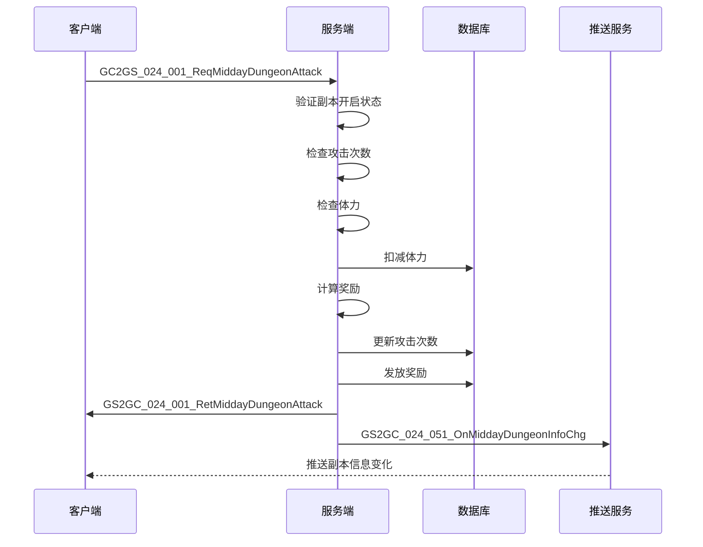

### 5.2 晚间副本攻击流程

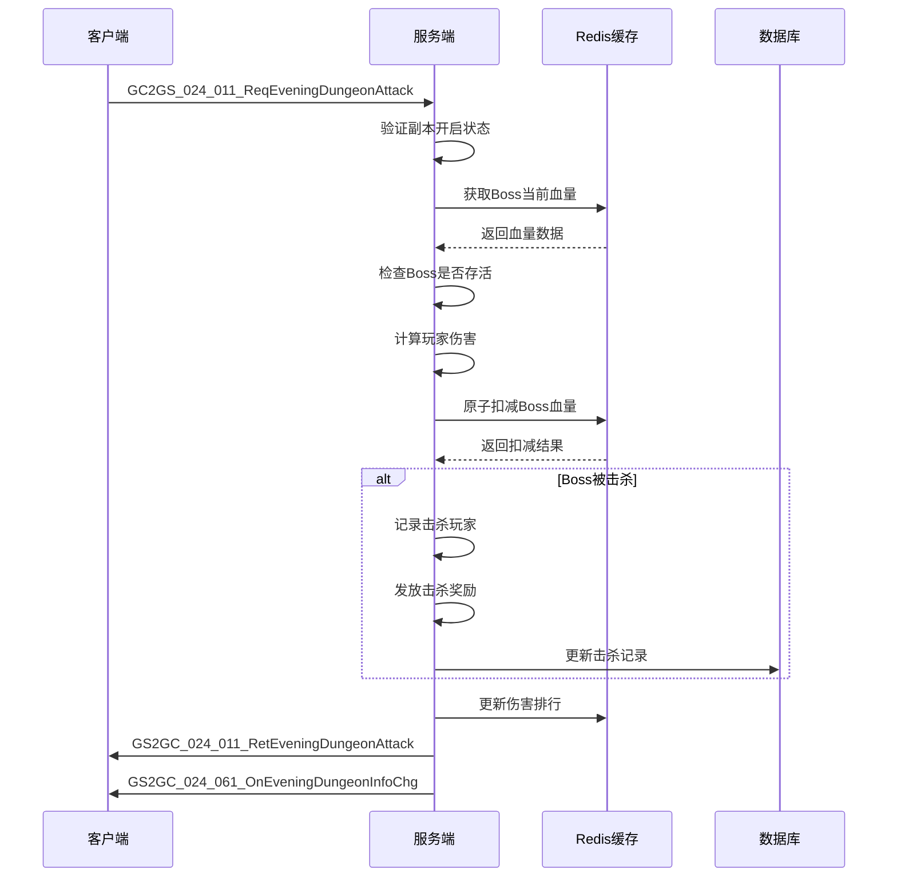

### 5.3 公会副本攻击流程

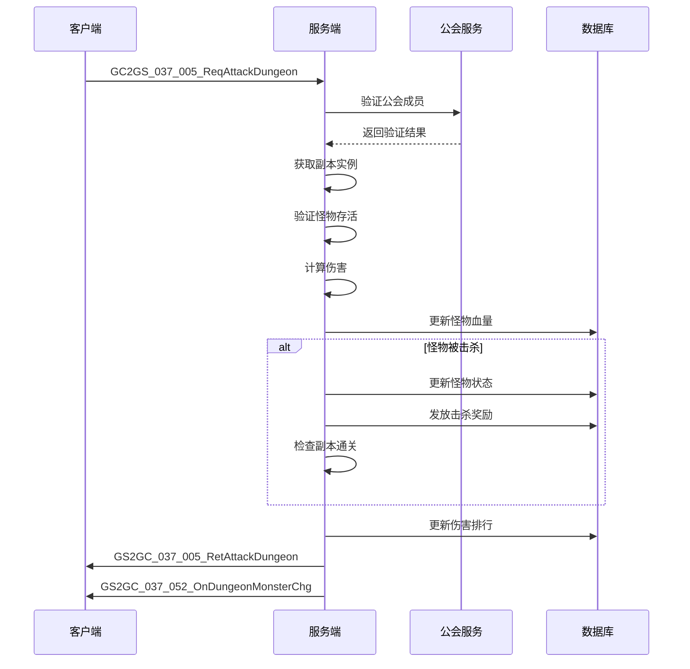

### 5.4 公会副本开启流程

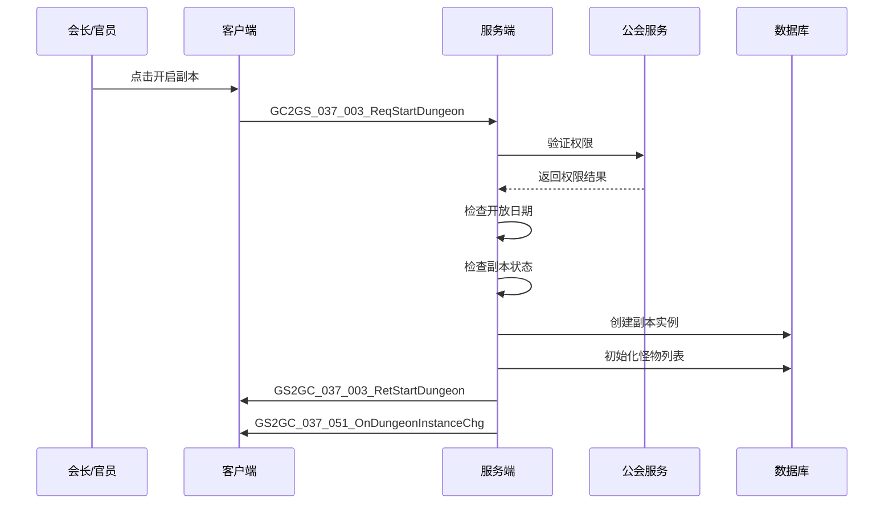

---

## 六、错误码定义

| 错误码 | 错误常量 | 说明 | 处理建议 |
|--------|----------|------|----------|
| 24001 | DUNGEON_NOT_EXIST | 副本不存在 | 刷新副本列表 |
| 24002 | DUNGEON_NOT_OPEN | 副本未开启 | 显示开启时间 |
| 24003 | DUNGEON_ALREADY_ENDED | 副本已结束 | 刷新副本状态 |
| 24004 | DUNGEON_ATTACK_COUNT_EXCEEDED | 攻击次数已用完 | 显示购买选项 |
| 24005 | DUNGEON_ENERGY_NOT_ENOUGH | 体力不足 | 显示体力获取途径 |
| 24006 | DUNGEON_BOX_NOT_EXIST | 宝箱不存在 | 刷新宝箱列表 |
| 24007 | DUNGEON_BOX_ALREADY_DRAWN | 宝箱已领取 | 刷新宝箱状态 |
| 24008 | DUNGEON_BOX_CONDITION_NOT_MET | 宝箱领取条件未满足 | 显示进度 |
| 24009 | DUNGEON_BOSS_NOT_EXIST | Boss不存在 | 刷新Boss信息 |
| 24010 | DUNGEON_BOSS_ALREADY_DEAD | Boss已死亡 | 显示击杀信息 |
| 24011 | DUNGEON_MONSTER_NOT_EXIST | 怪物不存在 | 刷新怪物列表 |
| 24012 | DUNGEON_MONSTER_ALREADY_DEAD | 怪物已死亡 | 刷新怪物状态 |
| 24013 | DUNGEON_NOT_UNLOCK | 副本未解锁 | 显示解锁条件 |
| 24014 | DUNGEON_LEVEL_MAX | 副本等级已达上限 | 无需处理 |
| 24015 | DUNGEON_GUILD_LEVEL_NOT_ENOUGH | 公会等级不足 | 显示公会信息 |
| 24016 | DUNGEON_NO_PERMISSION | 无权限操作 | 显示权限说明 |
| 24017 | DUNGEON_BORROW_COUNT_EXCEEDED | 借用次数已用完 | 显示次数限制 |
| 24018 | DUNGEON_FRIEND_NOT_EXIST | 好友不存在 | 刷新好友列表 |
| 24019 | DUNGEON_HERO_NOT_AVAILABLE | 英雄不可用 | 刷新英雄列表 |
| 24020 | DUNGEON_REWARD_ALREADY_GAINED | 奖励已领取 | 刷新奖励状态 |

---

## 七、协议汇总表

### 7.1 午间副本协议汇总

| 协议名 | 主序号 | 子序号 | 方向 | 说明 |
|--------|--------|--------|------|------|
| GC2GS_024_001_ReqMiddayDungeonAttack | 24 | 1 | C->S | 请求攻击 |
| GS2GC_024_001_RetMiddayDungeonAttack | 24 | 1 | S->C | 攻击结果 |
| GC2GS_024_002_ReqMiddayDungeonBorrowAttack | 24 | 2 | C->S | 请求借用攻击 |
| GS2GC_024_002_RetMiddayDungeonBorrowAttack | 24 | 2 | S->C | 借用攻击结果 |
| GC2GS_024_003_ReqMiddayDungeonBoxList | 24 | 3 | C->S | 请求宝箱列表 |
| GS2GC_024_003_RetMiddayDungeonBoxList | 24 | 3 | S->C | 宝箱列表 |
| GC2GS_024_004_ReqMiddayDungeonDrawBox | 24 | 4 | C->S | 请求领取宝箱 |
| GS2GC_024_004_RetMiddayDungeonDrawBox | 24 | 4 | S->C | 领取结果 |
| GC2GS_024_005_ReqMiddayDungeonBoxCanDraw | 24 | 5 | C->S | 请求宝箱状态 |
| GS2GC_024_005_RetMiddayDungeonBoxCanDraw | 24 | 5 | S->C | 宝箱状态 |
| GC2GS_024_006_ReqMiddayDungeonBoxDrawRecord | 24 | 6 | C->S | 请求领取记录 |
| GS2GC_024_006_RetMiddayDungeonBoxDrawRecord | 24 | 6 | S->C | 领取记录 |
| GS2GC_024_051_OnMiddayDungeonInfoChg | 24 | 51 | S->C | 副本信息推送 |
| GS2GC_024_052_OnMiddayDungeonTimeInfoChg | 24 | 52 | S->C | 时间信息推送 |

### 7.2 晚间副本协议汇总

| 协议名 | 主序号 | 子序号 | 方向 | 说明 |
|--------|--------|--------|------|------|
| GC2GS_024_011_ReqEveningDungeonAttack | 24 | 11 | C->S | 请求攻击Boss |
| GS2GC_024_011_RetEveningDungeonAttack | 24 | 11 | S->C | 攻击结果 |
| GC2GS_024_012_ReqEveningDungeonBossInfo | 24 | 12 | C->S | 请求Boss信息 |
| GS2GC_024_012_RetEveningDungeonBossInfo | 24 | 12 | S->C | Boss信息 |
| GC2GS_024_013_ReqEveningDungeonAttackLog | 24 | 13 | C->S | 请求攻击日志 |
| GS2GC_024_013_RetEveningDungeonAttackLog | 24 | 13 | S->C | 攻击日志 |
| GC2GS_024_014_ReqEveningDungeonRankList | 24 | 14 | C->S | 请求排行榜 |
| GS2GC_024_014_RetEveningDungeonRankList | 24 | 14 | S->C | 排行榜 |
| GC2GS_024_015_ReqEveningDungeonDefeatLog | 24 | 15 | C->S | 请求击杀日志 |
| GS2GC_024_015_RetEveningDungeonDefeatLog | 24 | 15 | S->C | 击杀日志 |
| GS2GC_024_061_OnEveningDungeonInfoChg | 24 | 61 | S->C | 副本信息推送 |
| GS2GC_024_062_OnEveningDungeonTimeInfoChg | 24 | 62 | S->C | 时间信息推送 |

### 7.3 公会副本协议汇总

| 协议名 | 主序号 | 子序号 | 方向 | 说明 |
|--------|--------|--------|------|------|
| GC2GS_037_001_ReqDungeontGlobalSet | 37 | 1 | C->S | 请求全局设置 |
| GS2GC_037_001_RetDungeontGlobalSet | 37 | 1 | S->C | 全局设置 |
| GC2GS_037_002_ReqSetAutoStartDungeon | 37 | 2 | C->S | 请求设置自动开启 |
| GS2GC_037_002_RetSetAutoStartDungeon | 37 | 2 | S->C | 设置结果 |
| GC2GS_037_003_ReqStartDungeon | 37 | 3 | C->S | 请求开启副本 |
| GS2GC_037_003_RetStartDungeon | 37 | 3 | S->C | 开启结果 |
| GC2GS_037_004_ReqUpgradeDungeonLvl | 37 | 4 | C->S | 请求升级等级 |
| GS2GC_037_004_RetUpgradeDungeonLvl | 37 | 4 | S->C | 升级结果 |
| GC2GS_037_005_ReqAttackDungeon | 37 | 5 | C->S | 请求攻击副本 |
| GS2GC_037_005_RetAttackDungeon | 37 | 5 | S->C | 攻击结果 |
| GC2GS_037_006_ReqRecoverHeroFight | 37 | 6 | C->S | 请求恢复英雄 |
| GS2GC_037_006_RetRecoverHeroFight | 37 | 6 | S->C | 恢复结果 |
| GC2GS_037_007_ReqDamageRank | 37 | 7 | C->S | 请求伤害排行 |
| GS2GC_037_007_RetDamageRank | 37 | 7 | S->C | 伤害排行 |
| GC2GS_037_008_ReqGainAllDungeonReward | 37 | 8 | C->S | 请求领取所有奖励 |
| GS2GC_037_008_RetGainAllDungeonReward | 37 | 8 | S->C | 领取结果 |
| GC2GS_037_010_ReqGetDungeonLogList | 37 | 10 | C->S | 请求日志列表 |
| GS2GC_037_010_RetGetDungeonLogList | 37 | 10 | S->C | 日志列表 |
| GC2GS_037_011_ReqGainDungeonReward | 37 | 11 | C->S | 请求领取奖励 |
| GS2GC_037_011_RetGainDungeonReward | 37 | 11 | S->C | 领取结果 |
| GC2GS_037_012_ReqSetTagMonsterList | 37 | 12 | C->S | 请求标记怪物 |
| GS2GC_037_012_RetSetTagMonsterList | 37 | 12 | S->C | 标记结果 |
| GS2GC_037_050_OnDungeonSetChg | 37 | 50 | S->C | 设置变化推送 |
| GS2GC_037_051_OnDungeonInstanceChg | 37 | 51 | S->C | 实例变化推送 |
| GS2GC_037_052_OnDungeonMonsterChg | 37 | 52 | S->C | 怪物变化推送 |
| GS2GC_037_053_OnDungeonGainedRewardChg | 37 | 53 | S->C | 奖励变化推送 |
| GS2GC_037_054_OnDungeonHeroFightChg | 37 | 54 | S->C | 英雄变化推送 |
| GS2GC_037_055_OnDungeonTagMonsterChg | 37 | 55 | S->C | 标记变化推送 |
| GS2GC_037_056_OnDungeonPush | 37 | 56 | S->C | 通用推送 |

---

## 八、协议版本管理

### 8.1 版本兼容策略

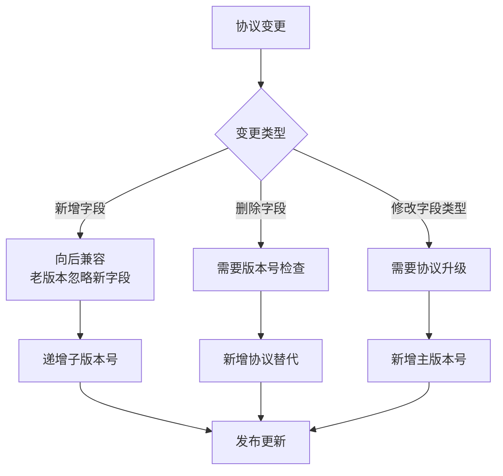

### 8.2 协议版本号规则

| 版本类型 | 格式 | 说明 | 示例 |
|----------|------|------|------|
| 主版本 | v{major} | 协议结构重大变更 | v2 |
| 子版本 | v{major}.{minor} | 新增协议或字段 | v1.5 |
| 补丁版本 | v{major}.{minor}.{patch} | Bug修复 | v1.5.1 |

### 8.3 协议弃用流程

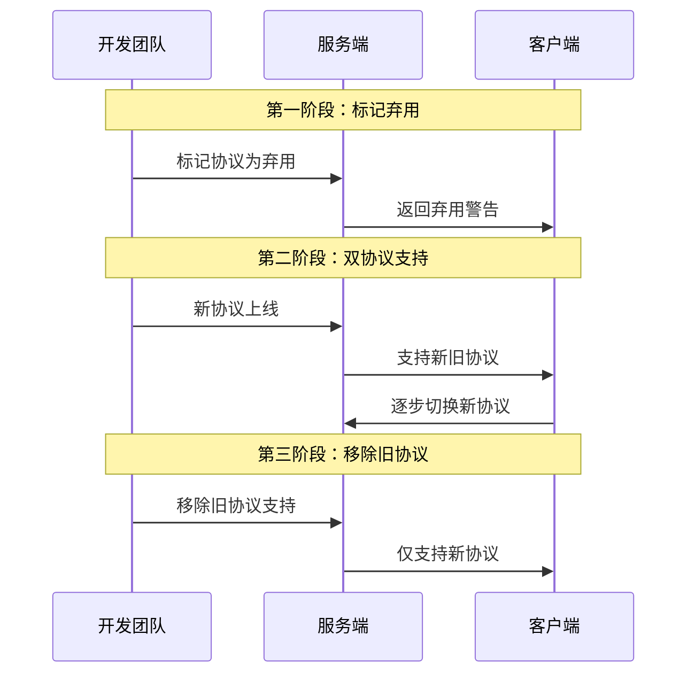

---

## 九、协议安全设计

### 9.1 请求频率限制

| 协议类型 | 频率限制 | 时间窗口 | 处理方式 |
|----------|----------|----------|----------|
| 攻击请求 | 10次/秒 | 1秒 | 拒绝并返回错误码 |
| 查询请求 | 100次/分钟 | 1分钟 | 拒绝并返回错误码 |
| 排行榜请求 | 30次/分钟 | 1分钟 | 拒绝并返回错误码 |

### 9.2 数据校验规则

```java
/**
 * 协议参数校验
 */
public class DungeonProtocolValidator {

    /**
     * 校验副本ID
     */
    public static boolean validateDungeonId(int dungeonId) {
        return dungeonId > 0 && dungeonId < 10000;
    }

    /**
     * 校验Boss ID
     */
    public static boolean validateBossId(int bossId) {
        return bossId > 0 && bossId < 100000;
    }

    /**
     * 校验公会ID
     */
    public static boolean validateGuildId(long guildId) {
        return guildId > 0;
    }

    /**
     * 校验玩家ID
     */
    public static boolean validatePlayerId(long playerId) {
        return playerId > 0;
    }

    /**
     * 校验怪物ID列表
     */
    public static boolean validateMonsterIdList(List<Integer> monsterIdList) {
        if (monsterIdList == null || monsterIdList.isEmpty()) return false;
        if (monsterIdList.size() > 10) return false;
        for (int monsterId : monsterIdList) {
            if (monsterId <= 0) return false;
        }
        return true;
    }
}
```

---

## 十、协议性能优化

### 10.1 数据压缩策略

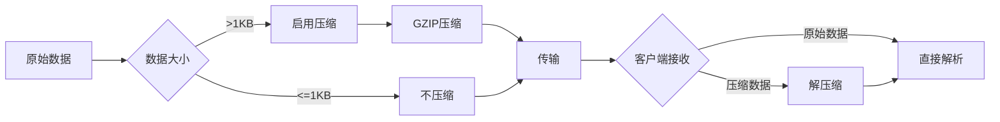

### 10.2 批量协议设计

| 场景 | 单条协议 | 批量协议 | 性能提升 |
|------|----------|----------|----------|
| 领取多个宝箱 | N次请求 | 1次请求 | 90% |
| 批量攻击 | N次请求 | 1次请求 | 80% |
| 查询多个Boss | N次请求 | 1次请求 | 85% |

---

## 十一、协议调试工具

### 11.1 协议日志格式

```
[时间] [协议名] [方向] [玩家ID] [耗时] [状态]
[2026-04-11 12:00:00.123] [GC2GS_024_001_ReqMiddayDungeonAttack] [C->S] [10001] [15ms] [SUCCESS]
[2026-04-11 12:00:00.145] [GS2GC_024_001_RetMiddayDungeonAttack] [S->C] [10001] [22ms] [SUCCESS]
```

### 11.2 协议Mock数据

```json
{
  "protocol": "GS2GC_024_011_RetEveningDungeonAttack",
  "mockData": {
    "errCode": 0,
    "damage": 500000,
    "isKill": false,
    "rewardList": [
      {"type": 0, "id": 2, "count": 10}
    ],
    "myRank": 5,
    "currentHp": 95000000
  }
}
```

---

## 十二、协议完整字段对照表

### 12.1 午间副本请求字段对照

| 协议 | 字段名 | 类型 | 必填 | 取值范围 | 说明 |
|------|--------|------|------|----------|------|
| ReqMiddayDungeonAttack | dungeonId | int | 是 | 1-9999 | 副本ID |
| ReqMiddayDungeonBorrowAttack | dungeonId | int | 是 | 1-9999 | 副本ID |
| ReqMiddayDungeonBorrowAttack | friendId | long | 是 | >0 | 好友ID |
| ReqMiddayDungeonBorrowAttack | heroId | long | 是 | >0 | 英雄ID |
| ReqMiddayDungeonBoxList | dungeonId | int | 是 | 1-9999 | 副本ID |
| ReqMiddayDungeonDrawBox | dungeonId | int | 是 | 1-9999 | 副本ID |
| ReqMiddayDungeonDrawBox | boxId | int | 是 | 1-999 | 宝箱ID |
| ReqMiddayDungeonBoxCanDraw | dungeonId | int | 是 | 1-9999 | 副本ID |
| ReqMiddayDungeonBoxCanDraw | boxId | int | 是 | 1-999 | 宝箱ID |
| ReqMiddayDungeonBoxDrawRecord | dungeonId | int | 是 | 1-9999 | 副本ID |

### 12.2 晚间副本请求字段对照

| 协议 | 字段名 | 类型 | 必填 | 取值范围 | 说明 |
|------|--------|------|------|----------|------|
| ReqEveningDungeonAttack | bossId | int | 是 | 1-99999 | Boss ID |
| ReqEveningDungeonBossInfo | bossId | int | 是 | 1-99999 | Boss ID |
| ReqEveningDungeonAttackLog | bossId | int | 是 | 1-99999 | Boss ID |
| ReqEveningDungeonRankList | bossId | int | 是 | 1-99999 | Boss ID |
| ReqEveningDungeonRankList | rankType | int | 是 | 1-2 | 排行类型 |
| ReqEveningDungeonDefeatLog | count | int | 是 | 1-100 | 请求数量 |

### 12.3 公会副本请求字段对照

| 协议 | 字段名 | 类型 | 必填 | 取值范围 | 说明 |
|------|--------|------|------|----------|------|
| ReqDungeontGlobalSet | guildId | long | 是 | >0 | 公会ID |
| ReqSetAutoStartDungeon | guildId | long | 是 | >0 | 公会ID |
| ReqSetAutoStartDungeon | dungeonId | int | 是 | 1-9999 | 副本ID |
| ReqSetAutoStartDungeon | autoStart | bool | 是 | true/false | 自动开始 |
| ReqStartDungeon | guildId | long | 是 | >0 | 公会ID |
| ReqStartDungeon | dungeonId | int | 是 | 1-9999 | 副本ID |
| ReqUpgradeDungeonLvl | guildId | long | 是 | >0 | 公会ID |
| ReqUpgradeDungeonLvl | dungeonId | int | 是 | 1-9999 | 副本ID |
| ReqAttackDungeon | guildId | long | 是 | >0 | 公会ID |
| ReqAttackDungeon | dungeonId | int | 是 | 1-9999 | 副本ID |
| ReqAttackDungeon | monsterId | int | 是 | 1-99999 | 怪物ID |
| ReqRecoverHeroFight | guildId | long | 是 | >0 | 公会ID |
| ReqRecoverHeroFight | heroId | long | 是 | >0 | 英雄ID |
| ReqDamageRank | guildId | long | 是 | >0 | 公会ID |
| ReqDamageRank | dungeonId | int | 是 | 1-9999 | 副本ID |
| ReqGainAllDungeonReward | guildId | long | 是 | >0 | 公会ID |
| ReqGainAllDungeonReward | dungeonId | int | 是 | 1-9999 | 副本ID |
| ReqGetDungeonLogList | guildId | long | 是 | >0 | 公会ID |
| ReqGetDungeonLogList | dungeonId | int | 是 | 1-9999 | 副本ID |
| ReqGetDungeonLogList | pageNo | int | 是 | >=1 | 页码 |
| ReqGetDungeonLogList | pageSize | int | 是 | 1-100 | 每页数量 |
| ReqGainDungeonReward | guildId | long | 是 | >0 | 公会ID |
| ReqGainDungeonReward | dungeonId | int | 是 | 1-9999 | 副本ID |
| ReqGainDungeonReward | rewardId | int | 是 | >0 | 奖励ID |
| ReqSetTagMonsterList | guildId | long | 是 | >0 | 公会ID |
| ReqSetTagMonsterList | dungeonId | int | 是 | 1-9999 | 副本ID |
| ReqSetTagMonsterList | monsterIdList | List<int> | 是 | 1-10个 | 怪物ID列表 |

---

*文档生成时间: 2026-04-11*
