# 副本模块协议文档

## 协议模块编号

模块编号：p024 (DungeonOp) / p037 (GuildDungeonOp)

协议主序号：`24` / `37`

---

## 一、协议架构总览

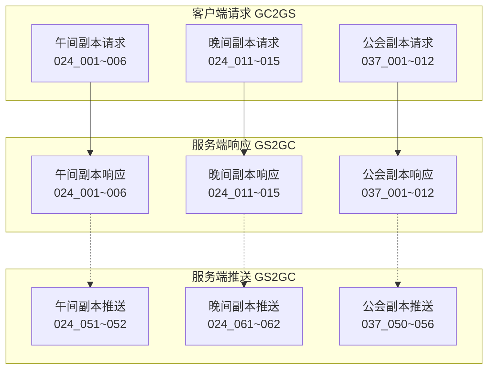

---

## 二、客户端请求协议 (GC2GS)

### 2.1 午间副本协议

#### GC2GS_024_001_ReqMiddayDungeonAttack - 请求午间副本攻击

**功能说明**: 请求玩家对午间副本进行攻击，获取攻击奖励

**协议编号**: 主序号 24, 子序号 1

| 序号 | 字段名 | 类型 | 说明 | 示例 |
|------|--------|------|------|------|
| 1 | dungeonId | int | 副本ID | 1 |

**服务端处理流程**:

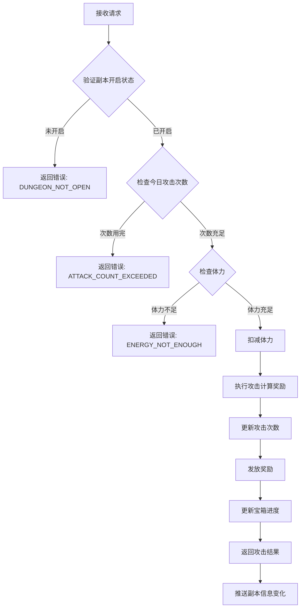

**响应**: `GS2GC_024_001_RetMiddayDungeonAttack`

---

#### GC2GS_024_002_ReqMiddayDungeonBorrowAttack - 请求午间副本借用攻击

**功能说明**: 借用好友英雄进行副本攻击

**协议编号**: 主序号 24, 子序号 2

| 序号 | 字段名 | 类型 | 说明 | 示例 |
|------|--------|------|------|------|
| 1 | dungeonId | int | 副本ID | 1 |
| 2 | friendId | long | 好友ID | 10001 |
| 3 | heroId | long | 借用英雄ID | 20001 |

**服务端处理流程**:
1. 验证副本是否开启
2. 验证好友关系
3. 检查借用次数
4. 执行借用攻击（奖励加成20%）
5. 更新借用记录
6. 返回攻击结果

**响应**: `GS2GC_024_002_RetMiddayDungeonBorrowAttack`

---

#### GC2GS_024_003_ReqMiddayDungeonBoxList - 请求午间副本宝箱列表

**功能说明**: 获取当前副本可领取的宝箱列表

**协议编号**: 主序号 24, 子序号 3

| 序号 | 字段名 | 类型 | 说明 | 示例 |
|------|--------|------|------|------|
| 1 | dungeonId | int | 副本ID | 1 |

**响应**: `GS2GC_024_003_RetMiddayDungeonBoxList`

---

#### GC2GS_024_004_ReqMiddayDungeonDrawBox - 请求午间副本领取宝箱

**功能说明**: 领取指定宝箱的奖励

**协议编号**: 主序号 24, 子序号 4

| 序号 | 字段名 | 类型 | 说明 | 示例 |
|------|--------|------|------|------|
| 1 | dungeonId | int | 副本ID | 1 |
| 2 | boxId | int | 宝箱ID | 1 |

**服务端处理流程**:

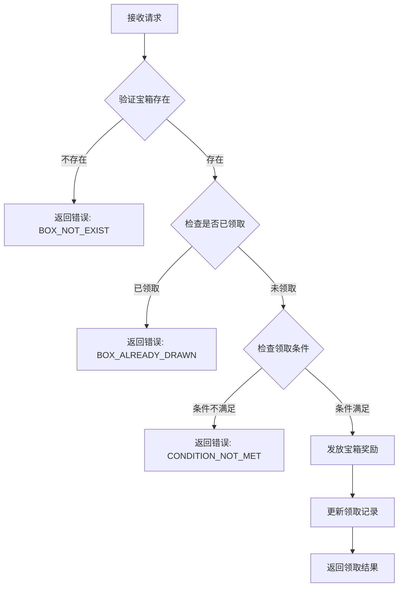

**响应**: `GS2GC_024_004_RetMiddayDungeonDrawBox`

---

#### GC2GS_024_005_ReqMiddayDungeonBoxCanDraw - 请求午间副本宝箱可领取状态

**功能说明**: 查询宝箱是否可领取

**协议编号**: 主序号 24, 子序号 5

| 序号 | 字段名 | 类型 | 说明 | 示例 |
|------|--------|------|------|------|
| 1 | dungeonId | int | 副本ID | 1 |
| 2 | boxId | int | 宝箱ID | 1 |

**响应**: `GS2GC_024_005_RetMiddayDungeonBoxCanDraw`

---

#### GC2GS_024_006_ReqMiddayDungeonBoxDrawRecord - 请求午间副本宝箱领取记录

**功能说明**: 获取宝箱领取历史记录

**协议编号**: 主序号 24, 子序号 6

| 序号 | 字段名 | 类型 | 说明 | 示例 |
|------|--------|------|------|------|
| 1 | dungeonId | int | 副本ID | 1 |

**响应**: `GS2GC_024_006_RetMiddayDungeonBoxDrawRecord`

---

### 2.2 晚间副本协议

#### GC2GS_024_011_ReqEveningDungeonAttack - 请求晚间副本攻击

**功能说明**: 请求对世界Boss进行攻击

**协议编号**: 主序号 24, 子序号 11

| 序号 | 字段名 | 类型 | 说明 | 示例 |
|------|--------|------|------|------|
| 1 | bossId | int | Boss ID | 1001 |

**服务端处理流程**:

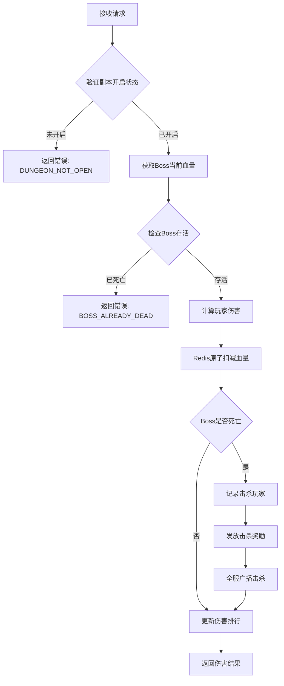

**响应**: `GS2GC_024_011_RetEveningDungeonAttack`

---

#### GC2GS_024_012_ReqEveningDungeonBossInfo - 请求晚间副本Boss信息

**功能说明**: 获取当前Boss的详细信息

**协议编号**: 主序号 24, 子序号 12

| 序号 | 字段名 | 类型 | 说明 | 示例 |
|------|--------|------|------|------|
| 1 | bossId | int | Boss ID | 1001 |

**响应**: `GS2GC_024_012_RetEveningDungeonBossInfo`

---

#### GC2GS_024_013_ReqEveningDungeonAttackLog - 请求晚间副本攻击日志

**功能说明**: 获取玩家对Boss的攻击记录

**协议编号**: 主序号 24, 子序号 13

| 序号 | 字段名 | 类型 | 说明 | 示例 |
|------|--------|------|------|------|
| 1 | bossId | int | Boss ID | 1001 |

**响应**: `GS2GC_024_013_RetEveningDungeonAttackLog`

---

#### GC2GS_024_014_ReqEveningDungeonRankList - 请求晚间副本排行榜

**功能说明**: 获取伤害排行榜

**协议编号**: 主序号 24, 子序号 14

| 序号 | 字段名 | 类型 | 说明 | 示例 |
|------|--------|------|------|------|
| 1 | bossId | int | Boss ID | 1001 |
| 2 | rankType | int | 排行类型（1伤害，2击杀） | 1 |

**响应**: `GS2GC_024_014_RetEveningDungeonRankList`

---

#### GC2GS_024_015_ReqEveningDungeonDefeatLog - 请求晚间副本击杀日志

**功能说明**: 获取Boss被击杀的历史记录

**协议编号**: 主序号 24, 子序号 15

| 序号 | 字段名 | 类型 | 说明 | 示例 |
|------|--------|------|------|------|
| 1 | count | int | 请求数量 | 10 |

**响应**: `GS2GC_024_015_RetEveningDungeonDefeatLog`

---

### 2.3 公会副本协议

#### GC2GS_037_001_ReqDungeontGlobalSet - 请求公会副本全局设置

**功能说明**: 获取公会副本的全局配置信息

**协议编号**: 主序号 37, 子序号 1

| 序号 | 字段名 | 类型 | 说明 | 示例 |
|------|--------|------|------|------|
| 1 | guildId | long | 公会ID | 10001 |

**响应**: `GS2GC_037_001_RetDungeontGlobalSet`

---

#### GC2GS_037_002_ReqSetAutoStartDungeon - 请求设置自动开始副本

**功能说明**: 设置公会副本是否自动开启

**协议编号**: 主序号 37, 子序号 2

| 序号 | 字段名 | 类型 | 说明 | 示例 |
|------|--------|------|------|------|
| 1 | guildId | long | 公会ID | 10001 |
| 2 | dungeonId | int | 副本ID | 1 |
| 3 | autoStart | bool | 是否自动开始 | true |

**服务端处理流程**:
1. 验证玩家公会权限
2. 检查公会等级
3. 更新自动开始设置
4. 推送设置变更

**响应**: `GS2GC_037_002_RetSetAutoStartDungeon`

---

#### GC2GS_037_003_ReqStartDungeon - 请求开始副本

**功能说明**: 手动开启公会副本

**协议编号**: 主序号 37, 子序号 3

| 序号 | 字段名 | 类型 | 说明 | 示例 |
|------|--------|------|------|------|
| 1 | guildId | long | 公会ID | 10001 |
| 2 | dungeonId | int | 副本ID | 1 |

**服务端处理流程**:

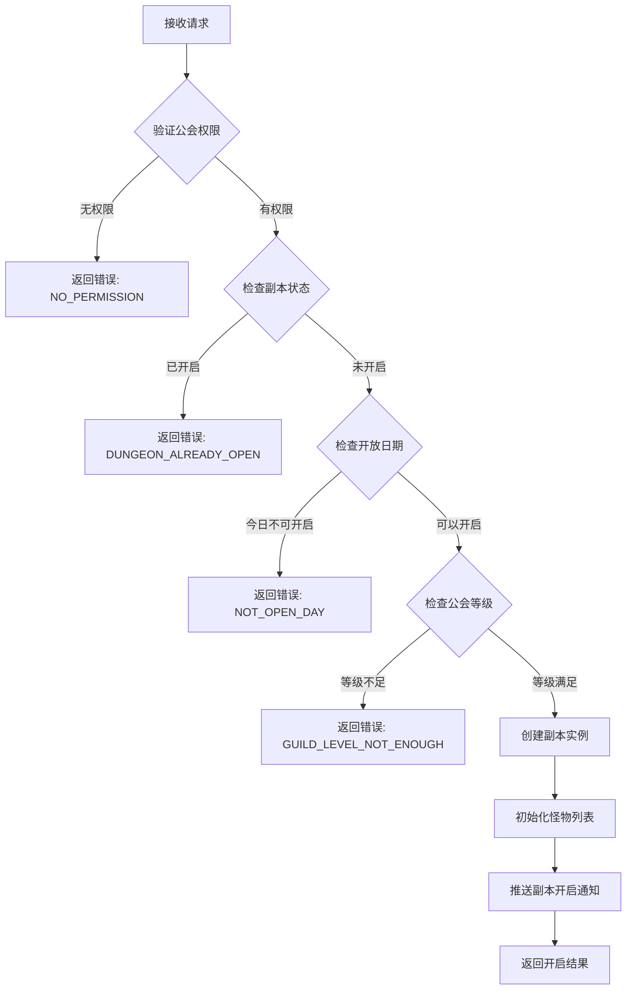

**响应**: `GS2GC_037_003_RetStartDungeon`

---

#### GC2GS_037_004_ReqUpgradeDungeonLvl - 请求升级副本等级

**功能说明**: 提升公会副本难度等级

**协议编号**: 主序号 37, 子序号 4

| 序号 | 字段名 | 类型 | 说明 | 示例 |
|------|--------|------|------|------|
| 1 | guildId | long | 公会ID | 10001 |
| 2 | dungeonId | int | 副本ID | 1 |

**服务端处理流程**:
1. 验证玩家公会权限
2. 检查当前等级是否已达上限
3. 检查公会资金是否充足
4. 扣除升级费用
5. 更新副本等级
6. 推送等级变更

**响应**: `GS2GC_037_004_RetUpgradeDungeonLvl`

---

#### GC2GS_037_005_ReqAttackDungeon - 请求攻击副本

**功能说明**: 攻击公会副本中的怪物

**协议编号**: 主序号 37, 子序号 5

| 序号 | 字段名 | 类型 | 说明 | 示例 |
|------|--------|------|------|------|
| 1 | guildId | long | 公会ID | 10001 |
| 2 | dungeonId | int | 副本ID | 1 |
| 3 | monsterId | int | 怪物ID | 1001 |

**服务端处理流程**:
1. 验证副本是否开启
2. 验证怪物是否存在且存活
3. 计算玩家伤害
4. 扣减怪物血量（原子操作）
5. 更新伤害排行
6. 检查怪物是否死亡
7. 检查副本是否通关
8. 返回攻击结果

**响应**: `GS2GC_037_005_RetAttackDungeon`

---

#### GC2GS_037_006_ReqRecoverHeroFight - 请求恢复英雄战力

**功能说明**: 恢复副本中已阵亡的英雄

**协议编号**: 主序号 37, 子序号 6

| 序号 | 字段名 | 类型 | 说明 | 示例 |
|------|--------|------|------|------|
| 1 | guildId | long | 公会ID | 10001 |
| 2 | heroId | long | 英雄ID | 20001 |

**响应**: `GS2GC_037_006_RetRecoverHeroFight`

---

#### GC2GS_037_007_ReqDamageRank - 请求伤害排行榜

**功能说明**: 获取公会副本伤害排行

**协议编号**: 主序号 37, 子序号 7

| 序号 | 字段名 | 类型 | 说明 | 示例 |
|------|--------|------|------|------|
| 1 | guildId | long | 公会ID | 10001 |
| 2 | dungeonId | int | 副本ID | 1 |

**响应**: `GS2GC_037_007_RetDamageRank`

---

#### GC2GS_037_008_ReqGainAllDungeonReward - 请求领取所有副本奖励

**功能说明**: 一键领取所有可领取的副本奖励

**协议编号**: 主序号 37, 子序号 8

| 序号 | 字段名 | 类型 | 说明 | 示例 |
|------|--------|------|------|------|
| 1 | guildId | long | 公会ID | 10001 |
| 2 | dungeonId | int | 副本ID | 1 |

**服务端处理流程**:
1. 获取副本信息
2. 计算可领取奖励
3. 发放所有奖励
4. 更新领取记录
5. 推送奖励领取通知

**响应**: `GS2GC_037_008_RetGainAllDungeonReward`

---

#### GC2GS_037_010_ReqGetDungeonLogList - 请求副本日志列表

**功能说明**: 获取公会副本的战斗日志

**协议编号**: 主序号 37, 子序号 10

| 序号 | 字段名 | 类型 | 说明 | 示例 |
|------|--------|------|------|------|
| 1 | guildId | long | 公会ID | 10001 |
| 2 | dungeonId | int | 副本ID | 1 |
| 3 | pageNo | int | 页码 | 1 |
| 4 | pageSize | int | 每页数量 | 20 |

**响应**: `GS2GC_037_010_RetGetDungeonLogList`

---

#### GC2GS_037_011_ReqGainDungeonReward - 请求领取副本奖励

**功能说明**: 领取指定奖励

**协议编号**: 主序号 37, 子序号 11

| 序号 | 字段名 | 类型 | 说明 | 示例 |
|------|--------|------|------|------|
| 1 | guildId | long | 公会ID | 10001 |
| 2 | dungeonId | int | 副本ID | 1 |
| 3 | rewardId | int | 奖励ID | 1 |

**响应**: `GS2GC_037_011_RetGainDungeonReward`

---

#### GC2GS_037_012_ReqSetTagMonsterList - 请求设置标记怪物列表

**功能说明**: 标记重点攻击的怪物

**协议编号**: 主序号 37, 子序号 12

| 序号 | 字段名 | 类型 | 说明 | 示例 |
|------|--------|------|------|------|
| 1 | guildId | long | 公会ID | 10001 |
| 2 | dungeonId | int | 副本ID | 1 |
| 3 | monsterIdList | List\<int\> | 怪物ID列表 | [1001, 1002] |

**响应**: `GS2GC_037_012_RetSetTagMonsterList`

---

## 三、服务端响应协议 (GS2GC)

### 3.1 午间副本响应

#### GS2GC_024_001_RetMiddayDungeonAttack - 午间副本攻击结果

**协议编号**: 主序号 24, 子序号 1

| 序号 | 字段名 | 类型 | 说明 |
|------|--------|------|------|
| 1 | errCode | int | 错误码（0表示成功） |
| 2 | rewardList | List\<NPCommonCostItem\> | 获得奖励列表 |
| 3 | attackCount | int | 当前攻击次数 |
| 4 | endTime | long | 副本结束时间戳 |

#### GS2GC_024_002_RetMiddayDungeonBorrowAttack - 借用攻击结果

**协议编号**: 主序号 24, 子序号 2

| 序号 | 字段名 | 类型 | 说明 |
|------|--------|------|------|
| 1 | errCode | int | 错误码（0表示成功） |
| 2 | rewardList | List\<NPCommonCostItem\> | 获得奖励列表 |
| 3 | borrowCount | int | 当前借用次数 |

#### GS2GC_024_003_RetMiddayDungeonBoxList - 宝箱列表

**协议编号**: 主序号 24, 子序号 3

| 序号 | 字段名 | 类型 | 说明 |
|------|--------|------|------|
| 1 | errCode | int | 错误码（0表示成功） |
| 2 | boxList | List\<MiddayDungeonBoxInfo\> | 宝箱信息列表 |

#### GS2GC_024_004_RetMiddayDungeonDrawBox - 领取宝箱结果

**协议编号**: 主序号 24, 子序号 4

| 序号 | 字段名 | 类型 | 说明 |
|------|--------|------|------|
| 1 | errCode | int | 错误码（0表示成功） |
| 2 | rewardList | List\<NPCommonCostItem\> | 宝箱奖励列表 |

#### GS2GC_024_005_RetMiddayDungeonBoxCanDraw - 宝箱可领取状态

**协议编号**: 主序号 24, 子序号 5

| 序号 | 字段名 | 类型 | 说明 |
|------|--------|------|------|
| 1 | errCode | int | 错误码（0表示成功） |
| 2 | canDraw | bool | 是否可领取 |
| 3 | boxState | int | 宝箱状态（EBoxState） |

#### GS2GC_024_006_RetMiddayDungeonBoxDrawRecord - 宝箱领取记录

**协议编号**: 主序号 24, 子序号 6

| 序号 | 字段名 | 类型 | 说明 |
|------|--------|------|------|
| 1 | errCode | int | 错误码（0表示成功） |
| 2 | drawRecordList | List\<int\> | 已领取宝箱ID列表 |

---

### 3.2 晚间副本响应

#### GS2GC_024_011_RetEveningDungeonAttack - 晚间副本攻击结果

**协议编号**: 主序号 24, 子序号 11

| 序号 | 字段名 | 类型 | 说明 |
|------|--------|------|------|
| 1 | errCode | int | 错误码（0表示成功） |
| 2 | damage | long | 本次伤害 |
| 3 | isKill | bool | 是否击杀Boss |
| 4 | rewardList | List\<NPCommonCostItem\> | 获得奖励列表 |
| 5 | myRank | int | 我的当前排名 |
| 6 | currentHp | long | Boss当前血量 |

#### GS2GC_024_012_RetEveningDungeonBossInfo - Boss信息

**协议编号**: 主序号 24, 子序号 12

| 序号 | 字段名 | 类型 | 说明 |
|------|--------|------|------|
| 1 | errCode | int | 错误码（0表示成功） |
| 2 | bossInfo | EveningDungeonBossInfo | Boss详细信息 |

#### GS2GC_024_013_RetEveningDungeonAttackLog - 攻击日志

**协议编号**: 主序号 24, 子序号 13

| 序号 | 字段名 | 类型 | 说明 |
|------|--------|------|------|
| 1 | errCode | int | 错误码（0表示成功） |
| 2 | attackLogList | List\<EveningDungeon_AttackLog\> | 攻击日志列表 |

#### GS2GC_024_014_RetEveningDungeonRankList - 排行榜

**协议编号**: 主序号 24, 子序号 14

| 序号 | 字段名 | 类型 | 说明 |
|------|--------|------|------|
| 1 | errCode | int | 错误码（0表示成功） |
| 2 | rankList | List\<EveningDungeonRankInfo\> | 排行榜列表 |
| 3 | myRank | int | 我的排名 |
| 4 | myDamage | long | 我的总伤害 |

#### GS2GC_024_015_RetEveningDungeonDefeatLog - 击杀日志

**协议编号**: 主序号 24, 子序号 15

| 序号 | 字段名 | 类型 | 说明 |
|------|--------|------|------|
| 1 | errCode | int | 错误码（0表示成功） |
| 2 | defeatLogList | List\<EveningDungeon_DefeatInfo\> | 击杀日志列表 |

---

### 3.3 公会副本响应

#### GS2GC_037_001_RetDungeontGlobalSet - 公会副本全局设置

**协议编号**: 主序号 37, 子序号 1

| 序号 | 字段名 | 类型 | 说明 |
|------|--------|------|------|
| 1 | errCode | int | 错误码（0表示成功） |
| 2 | setInfo | GuildDungeon_SetInfo | 副本设置信息 |

#### GS2GC_037_002_RetSetAutoStartDungeon - 设置自动开始结果

**协议编号**: 主序号 37, 子序号 2

| 序号 | 字段名 | 类型 | 说明 |
|------|--------|------|------|
| 1 | errCode | int | 错误码（0表示成功） |
| 2 | autoStart | bool | 当前自动开始设置 |

#### GS2GC_037_003_RetStartDungeon - 开始副本结果

**协议编号**: 主序号 37, 子序号 3

| 序号 | 字段名 | 类型 | 说明 |
|------|--------|------|------|
| 1 | errCode | int | 错误码（0表示成功） |
| 2 | instanceInfo | GuildDungeon_InstanceInfo | 副本实例信息 |

#### GS2GC_037_004_RetUpgradeDungeonLvl - 升级副本等级结果

**协议编号**: 主序号 37, 子序号 4

| 序号 | 字段名 | 类型 | 说明 |
|------|--------|------|------|
| 1 | errCode | int | 错误码（0表示成功） |
| 2 | newLevel | int | 新等级 |
| 3 | costGuildCoin | long | 消耗公会资金 |

#### GS2GC_037_005_RetAttackDungeon - 攻击副本结果

**协议编号**: 主序号 37, 子序号 5

| 序号 | 字段名 | 类型 | 说明 |
|------|--------|------|------|
| 1 | errCode | int | 错误码（0表示成功） |
| 2 | damage | long | 本次伤害 |
| 3 | isKill | bool | 是否击杀怪物 |
| 4 | rewardList | List\<NPCommonCostItem\> | 获得奖励列表 |
| 5 | monsterCurrentHp | long | 怪物当前血量 |
| 6 | isDungeonCleared | bool | 副本是否通关 |

#### GS2GC_037_006_RetRecoverHeroFight - 恢复英雄战力结果

**协议编号**: 主序号 37, 子序号 6

| 序号 | 字段名 | 类型 | 说明 |
|------|--------|------|------|
| 1 | errCode | int | 错误码（0表示成功） |
| 2 | heroInfo | GuildDungeon_FightHero | 英雄战斗信息 |

#### GS2GC_037_007_RetDamageRank - 伤害排行榜

**协议编号**: 主序号 37, 子序号 7

| 序号 | 字段名 | 类型 | 说明 |
|------|--------|------|------|
| 1 | errCode | int | 错误码（0表示成功） |
| 2 | rankList | List\<GuildDungeon_DamageRankItem\> | 伤害排行列表 |

#### GS2GC_037_008_RetGainAllDungeonReward - 领取所有奖励结果

**协议编号**: 主序号 37, 子序号 8

| 序号 | 字段名 | 类型 | 说明 |
|------|--------|------|------|
| 1 | errCode | int | 错误码（0表示成功） |
| 2 | rewardList | List\<NPCommonCostItem\> | 所有奖励列表 |

#### GS2GC_037_010_RetGetDungeonLogList - 副本日志列表

**协议编号**: 主序号 37, 子序号 10

| 序号 | 字段名 | 类型 | 说明 |
|------|--------|------|------|
| 1 | errCode | int | 错误码（0表示成功） |
| 2 | logList | List\<GuildDungeon_Log\> | 日志列表 |
| 3 | totalCount | int | 总数量 |

#### GS2GC_037_011_RetGainDungeonReward - 领取副本奖励结果

**协议编号**: 主序号 37, 子序号 11

| 序号 | 字段名 | 类型 | 说明 |
|------|--------|------|------|
| 1 | errCode | int | 错误码（0表示成功） |
| 2 | rewardList | List\<NPCommonCostItem\> | 奖励列表 |

#### GS2GC_037_012_RetSetTagMonsterList - 设置标记怪物结果

**协议编号**: 主序号 37, 子序号 12

| 序号 | 字段名 | 类型 | 说明 |
|------|--------|------|------|
| 1 | errCode | int | 错误码（0表示成功） |
| 2 | tagMonsterIdList | List\<long\> | 当前标记的怪物ID列表 |

---

### 3.4 推送通知协议

| 协议名 | 主序号 | 子序号 | 说明 |
|--------|--------|--------|------|
| GS2GC_024_051_OnMiddayDungeonInfoChg | 24 | 51 | 午间副本信息变化推送 |
| GS2GC_024_052_OnMiddayDungeonTimeInfoChg | 24 | 52 | 午间副本时间信息变化推送 |
| GS2GC_024_061_OnEveningDungeonInfoChg | 24 | 61 | 晚间副本信息变化推送 |
| GS2GC_024_062_OnEveningDungeonTimeInfoChg | 24 | 62 | 晚间副本时间信息变化推送 |
| GS2GC_037_050_OnDungeonSetChg | 37 | 50 | 公会副本设置变化推送 |
| GS2GC_037_051_OnDungeonInstanceChg | 37 | 51 | 公会副本实例变化推送 |
| GS2GC_037_052_OnDungeonMonsterChg | 37 | 52 | 公会副本怪物变化推送 |
| GS2GC_037_053_OnDungeonGainedRewardChg | 37 | 53 | 公会副本奖励领取变化推送 |
| GS2GC_037_054_OnDungeonHeroFightChg | 37 | 54 | 公会副本英雄战力变化推送 |
| GS2GC_037_055_OnDungeonTagMonsterChg | 37 | 55 | 公会副本标记怪物变化推送 |
| GS2GC_037_056_OnDungeonPush | 37 | 56 | 公会副本推送通知 |

---

## 四、协议数据结构

### 4.1 MiddayDungeon_Info - 午间副本信息

| 序号 | 字段名 | 类型 | 说明 |
|------|--------|------|------|
| 1 | roundStartTimeMS | long | 本轮开始时间戳 |
| 2 | bossInfo | MiddayDungeon_BossInfo | Boss信息 |
| 3 | hadFightHeroList | List\<MiddayDungeon_FightHero\> | 已战斗过的英雄列表 |
| 4 | borrowCidList | List\<long\> | 借用过大臣的玩家列表 |

### 4.2 MiddayDungeon_BossInfo - 午间副本Boss信息

| 序号 | 字段名 | 类型 | 说明 |
|------|--------|------|------|
| 1 | wave | int | 波数 |
| 2 | deductedHp | long | 扣除血量 |
| 3 | totalHp | long | 总血量 |
| 4 | beDefeatTimeMs | long | 被击败时间戳 |
| 5 | defeatCid | long | 击杀玩家ID |

### 4.3 MiddayDungeon_FightHero - 午间副本出战大臣信息

| 序号 | 字段名 | 类型 | 说明 |
|------|--------|------|------|
| 1 | heroId | long | 大臣ID |
| 2 | num | short | 出战次数 |

### 4.4 MiddayDungeon_BoxInfo - 午间副本宝箱信息

| 序号 | 字段名 | 类型 | 说明 |
|------|--------|------|------|
| 1 | dbId | long | 数据ID |
| 2 | boxId | long | 宝箱ID |
| 3 | senderCid | long | 发送者ID |
| 4 | senderName | string | 发送者名字 |
| 5 | expireTimeMS | long | 过期时间戳 |

### 4.5 EveningDungeon_Info - 晚间副本信息

| 序号 | 字段名 | 类型 | 说明 |
|------|--------|------|------|
| 1 | roundStartTimeMS | long | 本轮开始时间戳 |
| 2 | hadFightHeroList | List\<long\> | 已战斗过的英雄列表 |

### 4.6 EveningDungeon_BossInfo - 晚间副本Boss信息

| 序号 | 字段名 | 类型 | 说明 |
|------|--------|------|------|
| 1 | wave | int | 波数 |
| 2 | deductedHp | long | 扣除血量 |
| 3 | totalHp | long | 总血量 |
| 4 | beDefeatTimeMs | long | 被击败时间戳 |
| 5 | defeatCid | long | 击杀玩家ID |

### 4.7 EveningDungeon_AttackLog - 晚间副本攻击日志

| 序号 | 字段名 | 类型 | 说明 |
|------|--------|------|------|
| 1 | playerId | long | 玩家ID |
| 2 | playerName | string | 玩家名称 |
| 3 | damage | long | 伤害值 |
| 4 | attackTime | long | 攻击时间戳 |

### 4.8 EveningDungeon_DefeatInfo - 晚间副本击杀信息

| 序号 | 字段名 | 类型 | 说明 |
|------|--------|------|------|
| 1 | bossId | int | Boss ID |
| 2 | bossName | string | Boss名称 |
| 3 | defeatCid | long | 击杀玩家ID |
| 4 | defeatPlayerName | string | 击杀玩家名称 |
| 5 | defeatTimeMs | long | 击杀时间戳 |

### 4.9 EveningDungeonRankInfo - 晚间副本排行信息

| 序号 | 字段名 | 类型 | 说明 |
|------|--------|------|------|
| 1 | rank | int | 排名 |
| 2 | playerId | long | 玩家ID |
| 3 | playerName | string | 玩家名称 |
| 4 | damage | long | 总伤害 |
| 5 | attackCount | int | 攻击次数 |

### 4.10 GuildDungeon_InstanceInfo - 公会副本实例数据

| 序号 | 字段名 | 类型 | 说明 |
|------|--------|------|------|
| 1 | id | long | 实例ID |
| 2 | dungeonId | long | 公会副本ID |
| 3 | lvl | int | 公会副本等级 |
| 4 | startMs | long | 开启时间 |
| 5 | monsterList | List\<GuildDungeon_Monster\> | 怪物列表 |
| 6 | tagMonsterIdLiist | List\<long\> | 已标记的怪物ID列表 |

### 4.11 GuildDungeon_Monster - 公会副本怪物数据

| 序号 | 字段名 | 类型 | 说明 |
|------|--------|------|------|
| 1 | monsterId | long | 怪物ID |
| 2 | isReward | bool | 是否有奖励 |
| 3 | hp | long | 当前怪物血量 |

### 4.12 GuildDungeon_SetInfo - 公会副本设置信息

| 序号 | 字段名 | 类型 | 说明 |
|------|--------|------|------|
| 1 | dungeonId | int | 副本ID |
| 2 | lvl | int | 副本等级 |
| 3 | autoStart | bool | 是否自动开始 |
| 4 | openDayList | List\<int\> | 开放日期列表 |

### 4.13 GuildDungeon_DamageRankItem - 公会副本伤害排行项

| 序号 | 字段名 | 类型 | 说明 |
|------|--------|------|------|
| 1 | rank | int | 排名 |
| 2 | playerId | long | 玩家ID |
| 3 | playerName | string | 玩家名称 |
| 4 | damage | long | 总伤害 |
| 5 | killCount | int | 击杀怪物数 |

### 4.14 GuildDungeon_FightHero - 公会副本英雄战斗信息

| 序号 | 字段名 | 类型 | 说明 |
|------|--------|------|------|
| 1 | heroId | long | 英雄ID |
| 2 | hp | long | 当前血量 |
| 3 | state | int | 状态（0存活，1阵亡） |

### 4.15 GuildDungeon_Log - 公会副本日志

| 序号 | 字段名 | 类型 | 说明 |
|------|--------|------|------|
| 1 | logType | int | 日志类型 |
| 2 | logId | long | 日志ID |
| 3 | playerId | long | 玩家ID |
| 4 | playerName | string | 玩家名称 |
| 5 | logData | string | 日志数据（JSON） |
| 6 | createTime | long | 创建时间 |

---

## 五、协议时序图

### 5.1 午间副本攻击流程

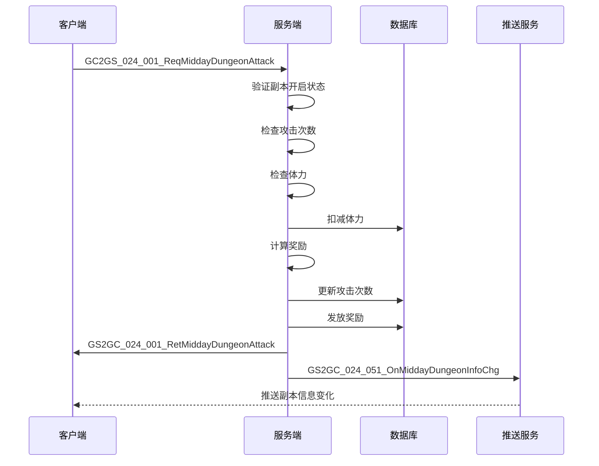

### 5.2 晚间副本攻击流程

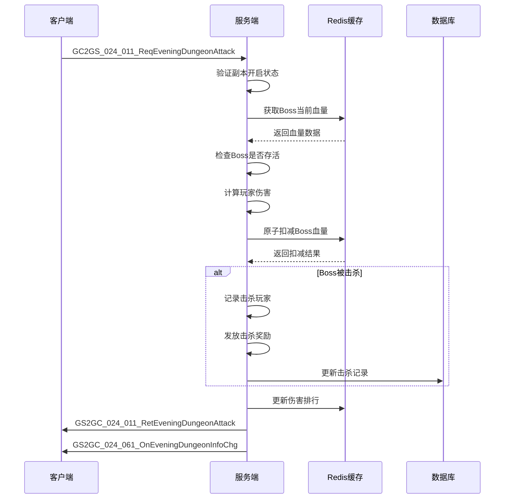

### 5.3 公会副本攻击流程

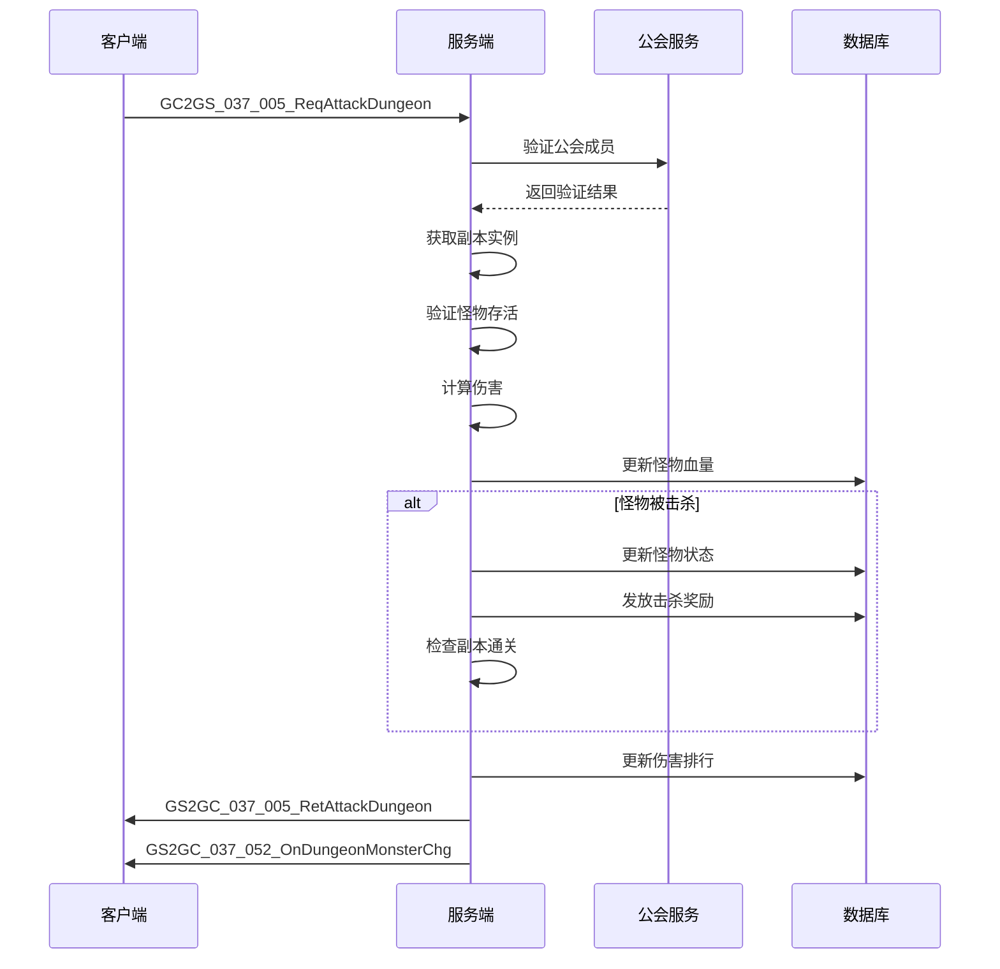

### 5.4 公会副本开启流程

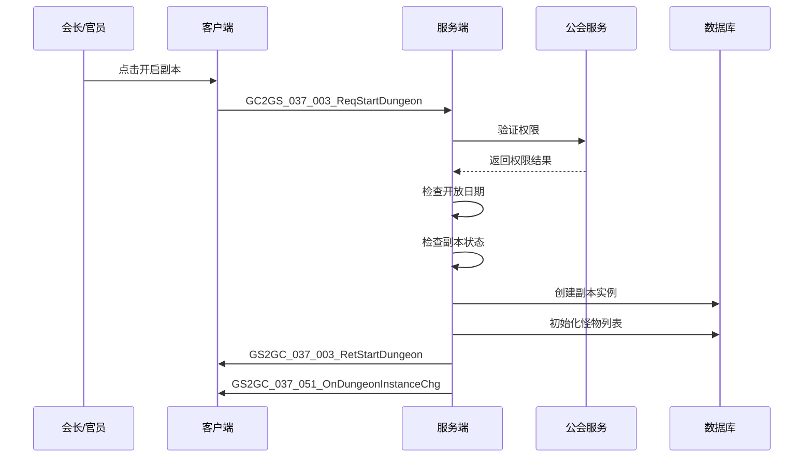

---

## 六、错误码定义

| 错误码 | 错误常量 | 说明 | 处理建议 |
|--------|----------|------|----------|
| 24001 | DUNGEON_NOT_EXIST | 副本不存在 | 刷新副本列表 |
| 24002 | DUNGEON_NOT_OPEN | 副本未开启 | 显示开启时间 |
| 24003 | DUNGEON_ALREADY_ENDED | 副本已结束 | 刷新副本状态 |
| 24004 | DUNGEON_ATTACK_COUNT_EXCEEDED | 攻击次数已用完 | 显示购买选项 |
| 24005 | DUNGEON_ENERGY_NOT_ENOUGH | 体力不足 | 显示体力获取途径 |
| 24006 | DUNGEON_BOX_NOT_EXIST | 宝箱不存在 | 刷新宝箱列表 |
| 24007 | DUNGEON_BOX_ALREADY_DRAWN | 宝箱已领取 | 刷新宝箱状态 |
| 24008 | DUNGEON_BOX_CONDITION_NOT_MET | 宝箱领取条件未满足 | 显示进度 |
| 24009 | DUNGEON_BOSS_NOT_EXIST | Boss不存在 | 刷新Boss信息 |
| 24010 | DUNGEON_BOSS_ALREADY_DEAD | Boss已死亡 | 显示击杀信息 |
| 24011 | DUNGEON_MONSTER_NOT_EXIST | 怪物不存在 | 刷新怪物列表 |
| 24012 | DUNGEON_MONSTER_ALREADY_DEAD | 怪物已死亡 | 刷新怪物状态 |
| 24013 | DUNGEON_NOT_UNLOCK | 副本未解锁 | 显示解锁条件 |
| 24014 | DUNGEON_LEVEL_MAX | 副本等级已达上限 | 无需处理 |
| 24015 | DUNGEON_GUILD_LEVEL_NOT_ENOUGH | 公会等级不足 | 显示公会信息 |
| 24016 | DUNGEON_NO_PERMISSION | 无权限操作 | 显示权限说明 |
| 24017 | DUNGEON_BORROW_COUNT_EXCEEDED | 借用次数已用完 | 显示次数限制 |
| 24018 | DUNGEON_FRIEND_NOT_EXIST | 好友不存在 | 刷新好友列表 |
| 24019 | DUNGEON_HERO_NOT_AVAILABLE | 英雄不可用 | 刷新英雄列表 |
| 24020 | DUNGEON_REWARD_ALREADY_GAINED | 奖励已领取 | 刷新奖励状态 |

---

## 七、协议汇总表

### 7.1 午间副本协议汇总

| 协议名 | 主序号 | 子序号 | 方向 | 说明 |
|--------|--------|--------|------|------|
| GC2GS_024_001_ReqMiddayDungeonAttack | 24 | 1 | C->S | 请求攻击 |
| GS2GC_024_001_RetMiddayDungeonAttack | 24 | 1 | S->C | 攻击结果 |
| GC2GS_024_002_ReqMiddayDungeonBorrowAttack | 24 | 2 | C->S | 请求借用攻击 |
| GS2GC_024_002_RetMiddayDungeonBorrowAttack | 24 | 2 | S->C | 借用攻击结果 |
| GC2GS_024_003_ReqMiddayDungeonBoxList | 24 | 3 | C->S | 请求宝箱列表 |
| GS2GC_024_003_RetMiddayDungeonBoxList | 24 | 3 | S->C | 宝箱列表 |
| GC2GS_024_004_ReqMiddayDungeonDrawBox | 24 | 4 | C->S | 请求领取宝箱 |
| GS2GC_024_004_RetMiddayDungeonDrawBox | 24 | 4 | S->C | 领取结果 |
| GC2GS_024_005_ReqMiddayDungeonBoxCanDraw | 24 | 5 | C->S | 请求宝箱状态 |
| GS2GC_024_005_RetMiddayDungeonBoxCanDraw | 24 | 5 | S->C | 宝箱状态 |
| GC2GS_024_006_ReqMiddayDungeonBoxDrawRecord | 24 | 6 | C->S | 请求领取记录 |
| GS2GC_024_006_RetMiddayDungeonBoxDrawRecord | 24 | 6 | S->C | 领取记录 |
| GS2GC_024_051_OnMiddayDungeonInfoChg | 24 | 51 | S->C | 副本信息推送 |
| GS2GC_024_052_OnMiddayDungeonTimeInfoChg | 24 | 52 | S->C | 时间信息推送 |

### 7.2 晚间副本协议汇总

| 协议名 | 主序号 | 子序号 | 方向 | 说明 |
|--------|--------|--------|------|------|
| GC2GS_024_011_ReqEveningDungeonAttack | 24 | 11 | C->S | 请求攻击Boss |
| GS2GC_024_011_RetEveningDungeonAttack | 24 | 11 | S->C | 攻击结果 |
| GC2GS_024_012_ReqEveningDungeonBossInfo | 24 | 12 | C->S | 请求Boss信息 |
| GS2GC_024_012_RetEveningDungeonBossInfo | 24 | 12 | S->C | Boss信息 |
| GC2GS_024_013_ReqEveningDungeonAttackLog | 24 | 13 | C->S | 请求攻击日志 |
| GS2GC_024_013_RetEveningDungeonAttackLog | 24 | 13 | S->C | 攻击日志 |
| GC2GS_024_014_ReqEveningDungeonRankList | 24 | 14 | C->S | 请求排行榜 |
| GS2GC_024_014_RetEveningDungeonRankList | 24 | 14 | S->C | 排行榜 |
| GC2GS_024_015_ReqEveningDungeonDefeatLog | 24 | 15 | C->S | 请求击杀日志 |
| GS2GC_024_015_RetEveningDungeonDefeatLog | 24 | 15 | S->C | 击杀日志 |
| GS2GC_024_061_OnEveningDungeonInfoChg | 24 | 61 | S->C | 副本信息推送 |
| GS2GC_024_062_OnEveningDungeonTimeInfoChg | 24 | 62 | S->C | 时间信息推送 |

### 7.3 公会副本协议汇总

| 协议名 | 主序号 | 子序号 | 方向 | 说明 |
|--------|--------|--------|------|------|
| GC2GS_037_001_ReqDungeontGlobalSet | 37 | 1 | C->S | 请求全局设置 |
| GS2GC_037_001_RetDungeontGlobalSet | 37 | 1 | S->C | 全局设置 |
| GC2GS_037_002_ReqSetAutoStartDungeon | 37 | 2 | C->S | 请求设置自动开启 |
| GS2GC_037_002_RetSetAutoStartDungeon | 37 | 2 | S->C | 设置结果 |
| GC2GS_037_003_ReqStartDungeon | 37 | 3 | C->S | 请求开启副本 |
| GS2GC_037_003_RetStartDungeon | 37 | 3 | S->C | 开启结果 |
| GC2GS_037_004_ReqUpgradeDungeonLvl | 37 | 4 | C->S | 请求升级等级 |
| GS2GC_037_004_RetUpgradeDungeonLvl | 37 | 4 | S->C | 升级结果 |
| GC2GS_037_005_ReqAttackDungeon | 37 | 5 | C->S | 请求攻击副本 |
| GS2GC_037_005_RetAttackDungeon | 37 | 5 | S->C | 攻击结果 |
| GC2GS_037_006_ReqRecoverHeroFight | 37 | 6 | C->S | 请求恢复英雄 |
| GS2GC_037_006_RetRecoverHeroFight | 37 | 6 | S->C | 恢复结果 |
| GC2GS_037_007_ReqDamageRank | 37 | 7 | C->S | 请求伤害排行 |
| GS2GC_037_007_RetDamageRank | 37 | 7 | S->C | 伤害排行 |
| GC2GS_037_008_ReqGainAllDungeonReward | 37 | 8 | C->S | 请求领取所有奖励 |
| GS2GC_037_008_RetGainAllDungeonReward | 37 | 8 | S->C | 领取结果 |
| GC2GS_037_010_ReqGetDungeonLogList | 37 | 10 | C->S | 请求日志列表 |
| GS2GC_037_010_RetGetDungeonLogList | 37 | 10 | S->C | 日志列表 |
| GC2GS_037_011_ReqGainDungeonReward | 37 | 11 | C->S | 请求领取奖励 |
| GS2GC_037_011_RetGainDungeonReward | 37 | 11 | S->C | 领取结果 |
| GC2GS_037_012_ReqSetTagMonsterList | 37 | 12 | C->S | 请求标记怪物 |
| GS2GC_037_012_RetSetTagMonsterList | 37 | 12 | S->C | 标记结果 |
| GS2GC_037_050_OnDungeonSetChg | 37 | 50 | S->C | 设置变化推送 |
| GS2GC_037_051_OnDungeonInstanceChg | 37 | 51 | S->C | 实例变化推送 |
| GS2GC_037_052_OnDungeonMonsterChg | 37 | 52 | S->C | 怪物变化推送 |
| GS2GC_037_053_OnDungeonGainedRewardChg | 37 | 53 | S->C | 奖励变化推送 |
| GS2GC_037_054_OnDungeonHeroFightChg | 37 | 54 | S->C | 英雄变化推送 |
| GS2GC_037_055_OnDungeonTagMonsterChg | 37 | 55 | S->C | 标记变化推送 |
| GS2GC_037_056_OnDungeonPush | 37 | 56 | S->C | 通用推送 |

---

## 八、协议版本管理

### 8.1 版本兼容策略

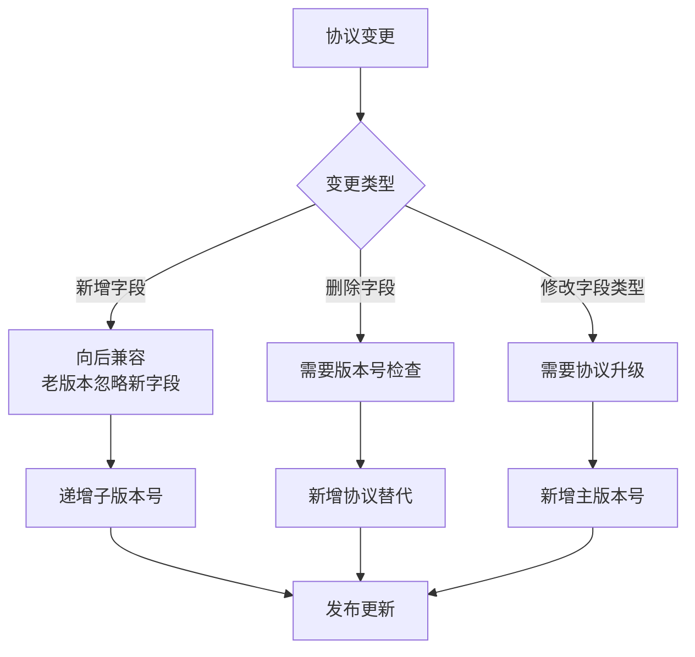

### 8.2 协议版本号规则

| 版本类型 | 格式 | 说明 | 示例 |
|----------|------|------|------|
| 主版本 | v{major} | 协议结构重大变更 | v2 |
| 子版本 | v{major}.{minor} | 新增协议或字段 | v1.5 |
| 补丁版本 | v{major}.{minor}.{patch} | Bug修复 | v1.5.1 |

### 8.3 协议弃用流程

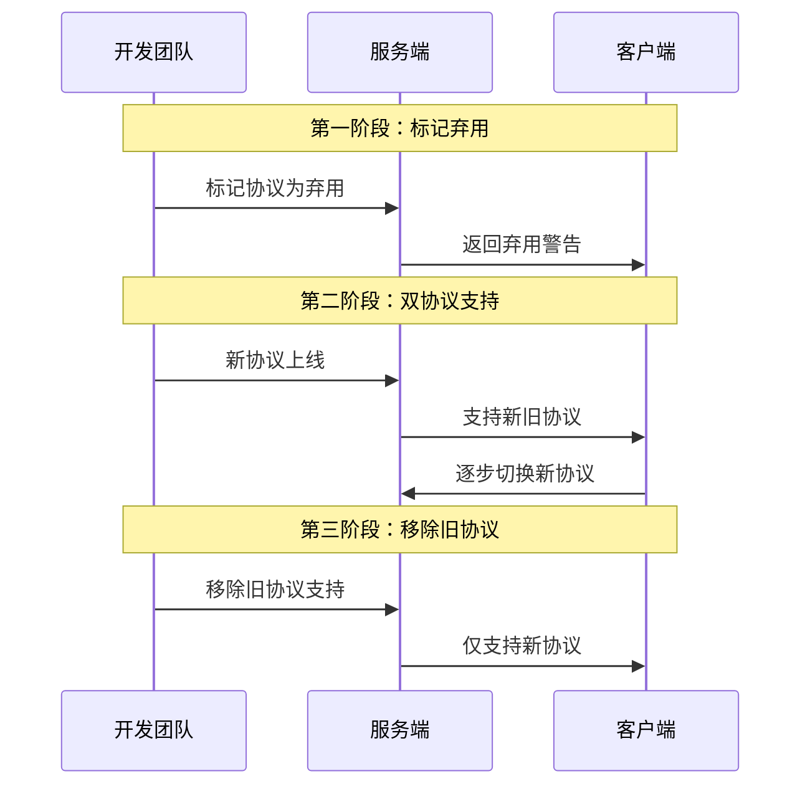

---

## 九、协议安全设计

### 9.1 请求频率限制

| 协议类型 | 频率限制 | 时间窗口 | 处理方式 |
|----------|----------|----------|----------|
| 攻击请求 | 10次/秒 | 1秒 | 拒绝并返回错误码 |
| 查询请求 | 100次/分钟 | 1分钟 | 拒绝并返回错误码 |
| 排行榜请求 | 30次/分钟 | 1分钟 | 拒绝并返回错误码 |

### 9.2 数据校验规则

```java
/**
 * 协议参数校验
 */
public class DungeonProtocolValidator {

    /**
     * 校验副本ID
     */
    public static boolean validateDungeonId(int dungeonId) {
        return dungeonId > 0 && dungeonId < 10000;
    }

    /**
     * 校验Boss ID
     */
    public static boolean validateBossId(int bossId) {
        return bossId > 0 && bossId < 100000;
    }

    /**
     * 校验公会ID
     */
    public static boolean validateGuildId(long guildId) {
        return guildId > 0;
    }

    /**
     * 校验玩家ID
     */
    public static boolean validatePlayerId(long playerId) {
        return playerId > 0;
    }

    /**
     * 校验怪物ID列表
     */
    public static boolean validateMonsterIdList(List<Integer> monsterIdList) {
        if (monsterIdList == null || monsterIdList.isEmpty()) return false;
        if (monsterIdList.size() > 10) return false;
        for (int monsterId : monsterIdList) {
            if (monsterId <= 0) return false;
        }
        return true;
    }
}
```

---

## 十、协议性能优化

### 10.1 数据压缩策略

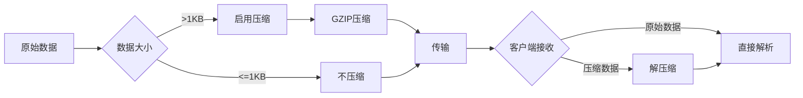

### 10.2 批量协议设计

| 场景 | 单条协议 | 批量协议 | 性能提升 |
|------|----------|----------|----------|
| 领取多个宝箱 | N次请求 | 1次请求 | 90% |
| 批量攻击 | N次请求 | 1次请求 | 80% |
| 查询多个Boss | N次请求 | 1次请求 | 85% |

---

## 十一、协议调试工具

### 11.1 协议日志格式

```
[时间] [协议名] [方向] [玩家ID] [耗时] [状态]
[2026-04-11 12:00:00.123] [GC2GS_024_001_ReqMiddayDungeonAttack] [C->S] [10001] [15ms] [SUCCESS]
[2026-04-11 12:00:00.145] [GS2GC_024_001_RetMiddayDungeonAttack] [S->C] [10001] [22ms] [SUCCESS]
```

### 11.2 协议Mock数据

```json
{
  "protocol": "GS2GC_024_011_RetEveningDungeonAttack",
  "mockData": {
    "errCode": 0,
    "damage": 500000,
    "isKill": false,
    "rewardList": [
      {"type": 0, "id": 2, "count": 10}
    ],
    "myRank": 5,
    "currentHp": 95000000
  }
}
```

---

## 十二、协议完整字段对照表

### 12.1 午间副本请求字段对照

| 协议 | 字段名 | 类型 | 必填 | 取值范围 | 说明 |
|------|--------|------|------|----------|------|
| ReqMiddayDungeonAttack | dungeonId | int | 是 | 1-9999 | 副本ID |
| ReqMiddayDungeonBorrowAttack | dungeonId | int | 是 | 1-9999 | 副本ID |
| ReqMiddayDungeonBorrowAttack | friendId | long | 是 | >0 | 好友ID |
| ReqMiddayDungeonBorrowAttack | heroId | long | 是 | >0 | 英雄ID |
| ReqMiddayDungeonBoxList | dungeonId | int | 是 | 1-9999 | 副本ID |
| ReqMiddayDungeonDrawBox | dungeonId | int | 是 | 1-9999 | 副本ID |
| ReqMiddayDungeonDrawBox | boxId | int | 是 | 1-999 | 宝箱ID |
| ReqMiddayDungeonBoxCanDraw | dungeonId | int | 是 | 1-9999 | 副本ID |
| ReqMiddayDungeonBoxCanDraw | boxId | int | 是 | 1-999 | 宝箱ID |
| ReqMiddayDungeonBoxDrawRecord | dungeonId | int | 是 | 1-9999 | 副本ID |

### 12.2 晚间副本请求字段对照

| 协议 | 字段名 | 类型 | 必填 | 取值范围 | 说明 |
|------|--------|------|------|----------|------|
| ReqEveningDungeonAttack | bossId | int | 是 | 1-99999 | Boss ID |
| ReqEveningDungeonBossInfo | bossId | int | 是 | 1-99999 | Boss ID |
| ReqEveningDungeonAttackLog | bossId | int | 是 | 1-99999 | Boss ID |
| ReqEveningDungeonRankList | bossId | int | 是 | 1-99999 | Boss ID |
| ReqEveningDungeonRankList | rankType | int | 是 | 1-2 | 排行类型 |
| ReqEveningDungeonDefeatLog | count | int | 是 | 1-100 | 请求数量 |

### 12.3 公会副本请求字段对照

| 协议 | 字段名 | 类型 | 必填 | 取值范围 | 说明 |
|------|--------|------|------|----------|------|
| ReqDungeontGlobalSet | guildId | long | 是 | >0 | 公会ID |
| ReqSetAutoStartDungeon | guildId | long | 是 | >0 | 公会ID |
| ReqSetAutoStartDungeon | dungeonId | int | 是 | 1-9999 | 副本ID |
| ReqSetAutoStartDungeon | autoStart | bool | 是 | true/false | 自动开始 |
| ReqStartDungeon | guildId | long | 是 | >0 | 公会ID |
| ReqStartDungeon | dungeonId | int | 是 | 1-9999 | 副本ID |
| ReqUpgradeDungeonLvl | guildId | long | 是 | >0 | 公会ID |
| ReqUpgradeDungeonLvl | dungeonId | int | 是 | 1-9999 | 副本ID |
| ReqAttackDungeon | guildId | long | 是 | >0 | 公会ID |
| ReqAttackDungeon | dungeonId | int | 是 | 1-9999 | 副本ID |
| ReqAttackDungeon | monsterId | int | 是 | 1-99999 | 怪物ID |
| ReqRecoverHeroFight | guildId | long | 是 | >0 | 公会ID |
| ReqRecoverHeroFight | heroId | long | 是 | >0 | 英雄ID |
| ReqDamageRank | guildId | long | 是 | >0 | 公会ID |
| ReqDamageRank | dungeonId | int | 是 | 1-9999 | 副本ID |
| ReqGainAllDungeonReward | guildId | long | 是 | >0 | 公会ID |
| ReqGainAllDungeonReward | dungeonId | int | 是 | 1-9999 | 副本ID |
| ReqGetDungeonLogList | guildId | long | 是 | >0 | 公会ID |
| ReqGetDungeonLogList | dungeonId | int | 是 | 1-9999 | 副本ID |
| ReqGetDungeonLogList | pageNo | int | 是 | >=1 | 页码 |
| ReqGetDungeonLogList | pageSize | int | 是 | 1-100 | 每页数量 |
| ReqGainDungeonReward | guildId | long | 是 | >0 | 公会ID |
| ReqGainDungeonReward | dungeonId | int | 是 | 1-9999 | 副本ID |
| ReqGainDungeonReward | rewardId | int | 是 | >0 | 奖励ID |
| ReqSetTagMonsterList | guildId | long | 是 | >0 | 公会ID |
| ReqSetTagMonsterList | dungeonId | int | 是 | 1-9999 | 副本ID |
| ReqSetTagMonsterList | monsterIdList | List<int> | 是 | 1-10个 | 怪物ID列表 |

---

## 十三、协议消息处理器代码示例

### 13.1 服务端协议处理器

```java
/**
 * 午间副本协议处理器
 */
@Slf4j
@Component
public class MiddayDungeonProtocolHandler {

    @Resource
    private MiddayDungeonService middayDungeonService;

    @Resource
    private PlayerService playerService;

    /**
     * 处理午间副本攻击请求
     */
    @ProtocolHandler(protocolId = 024001)
    public void handleMiddayDungeonAttack(GC2GS_024_001_ReqMiddayDungeonAttack req, GameSession session) {
        long playerId = session.getPlayerId();
        int dungeonId = req.getDungeonId();

        log.debug("处理午间副本攻击请求: playerId={}, dungeonId={}", playerId, dungeonId);

        GS2GC_024_001_RetMiddayDungeonAttack response = new GS2GC_024_001_RetMiddayDungeonAttack();

        try {
            // 1. 参数验证
            if (dungeonId <= 0) {
                response.setErrCode(ErrorCode.PARAM_ERROR);
                session.sendMessage(response);
                return;
            }

            // 2. 执行攻击
            AttackResult result = middayDungeonService.middayAttack(playerId, dungeonId);

            // 3. 构造响应
            response.setErrCode(ErrorCode.SUCCESS);
            response.setRewardList(result.getRewards());
            response.setAttackCount(result.getAttackCount());
            response.setEndTime(result.getEndTime());

            // 4. 发送响应
            session.sendMessage(response);

            // 5. 推送状态变化
            pushDungeonInfoChange(playerId, dungeonId);

            log.debug("午间副本攻击处理完成: playerId={}, rewards={}", playerId, result.getRewards().size());

        } catch (BusinessException e) {
            log.warn("午间副本攻击业务异常: playerId={}, error={}", playerId, e.getMessage());
            response.setErrCode(e.getErrorCode());
            session.sendMessage(response);
        } catch (Exception e) {
            log.error("午间副本攻击系统异常: playerId={}", playerId, e);
            response.setErrCode(ErrorCode.SYSTEM_ERROR);
            session.sendMessage(response);
        }
    }

    /**
     * 处理借用攻击请求
     */
    @ProtocolHandler(protocolId = 024002)
    public void handleMiddayDungeonBorrowAttack(GC2GS_024_002_ReqMiddayDungeonBorrowAttack req, GameSession session) {
        long playerId = session.getPlayerId();
        int dungeonId = req.getDungeonId();
        long friendId = req.getFriendId();
        long heroId = req.getHeroId();

        log.debug("处理借用攻击请求: playerId={}, dungeonId={}, friendId={}, heroId={}",
            playerId, dungeonId, friendId, heroId);

        GS2GC_024_002_RetMiddayDungeonBorrowAttack response = new GS2GC_024_002_RetMiddayDungeonBorrowAttack();

        try {
            // 执行借用攻击
            AttackResult result = middayDungeonService.borrowAttack(playerId, dungeonId, friendId, heroId);

            response.setErrCode(ErrorCode.SUCCESS);
            response.setRewardList(result.getRewards());
            response.setBorrowCount(result.getBorrowCount());

            session.sendMessage(response);

        } catch (BusinessException e) {
            response.setErrCode(e.getErrorCode());
            session.sendMessage(response);
        }
    }

    /**
     * 处理宝箱领取请求
     */
    @ProtocolHandler(protocolId = 024004)
    public void handleMiddayDungeonDrawBox(GC2GS_024_004_ReqMiddayDungeonDrawBox req, GameSession session) {
        long playerId = session.getPlayerId();
        int dungeonId = req.getDungeonId();
        int boxId = req.getBoxId();

        log.debug("处理宝箱领取请求: playerId={}, dungeonId={}, boxId={}", playerId, dungeonId, boxId);

        GS2GC_024_004_RetMiddayDungeonDrawBox response = new GS2GC_024_004_RetMiddayDungeonDrawBox();

        try {
            List<ItemInfo> rewards = middayDungeonService.drawBox(playerId, dungeonId, boxId);

            response.setErrCode(ErrorCode.SUCCESS);
            response.setRewardList(rewards);

            session.sendMessage(response);

            // 推送宝箱状态变化
            pushBoxStateChange(playerId, dungeonId, boxId);

        } catch (BusinessException e) {
            response.setErrCode(e.getErrorCode());
            session.sendMessage(response);
        }
    }

    /**
     * 推送副本信息变化
     */
    private void pushDungeonInfoChange(long playerId, int dungeonId) {
        GS2GC_024_051_OnMiddayDungeonInfoChg push = new GS2GC_024_051_OnMiddayDungeonInfoChg();
        // 设置推送数据...
        sessionManager.getSession(playerId).sendMessage(push);
    }

    /**
     * 推送宝箱状态变化
     */
    private void pushBoxStateChange(long playerId, int dungeonId, int boxId) {
        GS2GC_024_051_OnMiddayDungeonInfoChg push = new GS2GC_024_051_OnMiddayDungeonInfoChg();
        // 设置宝箱状态...
        sessionManager.getSession(playerId).sendMessage(push);
    }
}
```

### 13.2 晚间副本协议处理器

```java
/**
 * 晚间副本协议处理器
 */
@Slf4j
@Component
public class EveningDungeonProtocolHandler {

    @Resource
    private EveningDungeonService eveningDungeonService;

    @Resource
    private BroadcastService broadcastService;

    /**
     * 处理晚间副本攻击请求
     */
    @ProtocolHandler(protocolId = 024011)
    public void handleEveningDungeonAttack(GC2GS_024_011_ReqEveningDungeonAttack req, GameSession session) {
        long playerId = session.getPlayerId();
        int bossId = req.getBossId();

        log.debug("处理晚间副本攻击请求: playerId={}, bossId={}", playerId, bossId);

        GS2GC_024_011_RetEveningDungeonAttack response = new GS2GC_024_011_RetEveningDungeonAttack();

        try {
            // 执行攻击
            AttackResult result = eveningDungeonService.eveningAttack(playerId, bossId);

            response.setErrCode(ErrorCode.SUCCESS);
            response.setDamage(result.getDamage());
            response.setIsKill(result.isKill());
            response.setRewardList(result.getRewards());
            response.setMyRank(result.getMyRank());
            response.setCurrentHp(result.getCurrentHp());

            session.sendMessage(response);

            // 如果击杀Boss，广播击杀信息
            if (result.isKill()) {
                broadcastBossKill(bossId, playerId, result.getPlayerName());
            }

        } catch (BusinessException e) {
            response.setErrCode(e.getErrorCode());
            session.sendMessage(response);
        }
    }

    /**
     * 广播Boss击杀
     */
    private void broadcastBossKill(int bossId, long playerId, String playerName) {
        // 构造击杀广播消息
        String message = String.format("恭喜 %s 击杀了世界Boss！", playerName);
        broadcastService.broadcastSystemMessage(message);

        log.info("Boss击杀广播: bossId={}, playerId={}", bossId, playerId);
    }

    /**
     * 处理排行榜请求
     */
    @ProtocolHandler(protocolId = 024014)
    public void handleEveningDungeonRankList(GC2GS_024_014_ReqEveningDungeonRankList req, GameSession session) {
        int bossId = req.getBossId();
        int rankType = req.getRankType();

        GS2GC_024_014_RetEveningDungeonRankList response = new GS2GC_024_014_RetEveningDungeonRankList();

        try {
            List<EveningDungeonRankInfo> rankList = eveningDungeonService.getDamageRankList(bossId, 100);

            response.setErrCode(ErrorCode.SUCCESS);
            response.setRankList(rankList);
            response.setMyRank(getPlayerRank(session.getPlayerId(), bossId));
            response.setMyDamage(getPlayerDamage(session.getPlayerId(), bossId));

            session.sendMessage(response);

        } catch (Exception e) {
            response.setErrCode(ErrorCode.SYSTEM_ERROR);
            session.sendMessage(response);
        }
    }
}
```

### 13.3 公会副本协议处理器

```java
/**
 * 公会副本协议处理器
 */
@Slf4j
@Component
public class GuildDungeonProtocolHandler {

    @Resource
    private GuildDungeonService guildDungeonService;

    @Resource
    private GuildService guildService;

    /**
     * 处理开启副本请求
     */
    @ProtocolHandler(protocolId = 037003)
    public void handleStartDungeon(GC2GS_037_003_ReqStartDungeon req, GameSession session) {
        long playerId = session.getPlayerId();
        long guildId = req.getGuildId();
        int dungeonId = req.getDungeonId();

        log.info("处理开启副本请求: playerId={}, guildId={}, dungeonId={}", playerId, guildId, dungeonId);

        GS2GC_037_003_RetStartDungeon response = new GS2GC_037_003_RetStartDungeon();

        try {
            // 执行开启
            GuildDungeon dungeon = guildDungeonService.startDungeon(playerId, guildId, dungeonId);

            response.setErrCode(ErrorCode.SUCCESS);
            response.setInstanceInfo(buildInstanceInfo(dungeon));

            session.sendMessage(response);

            // 推送给所有公会成员
            pushDungeonStartToGuild(guildId, dungeonId);

        } catch (BusinessException e) {
            response.setErrCode(e.getErrorCode());
            session.sendMessage(response);
        }
    }

    /**
     * 处理攻击副本请求
     */
    @ProtocolHandler(protocolId = 037005)
    public void handleAttackDungeon(GC2GS_037_005_ReqAttackDungeon req, GameSession session) {
        long playerId = session.getPlayerId();
        long guildId = req.getGuildId();
        int dungeonId = req.getDungeonId();
        int monsterId = req.getMonsterId();

        log.debug("处理攻击副本请求: playerId={}, guildId={}, dungeonId={}, monsterId={}",
            playerId, guildId, dungeonId, monsterId);

        GS2GC_037_005_RetAttackDungeon response = new GS2GC_037_005_RetAttackDungeon();

        try {
            AttackResult result = guildDungeonService.attackDungeon(playerId, guildId, dungeonId, monsterId);

            response.setErrCode(ErrorCode.SUCCESS);
            response.setDamage(result.getDamage());
            response.setIsKill(result.isKill());
            response.setRewardList(result.getRewards());
            response.setMonsterCurrentHp(result.getMonsterCurrentHp());
            response.setIsDungeonCleared(result.isDungeonCleared());

            session.sendMessage(response);

            // 推送怪物状态变化
            pushMonsterStateChange(guildId, dungeonId, monsterId, result.getMonsterCurrentHp());

            // 如果副本通关，推送通关通知
            if (result.isDungeonCleared()) {
                pushDungeonCleared(guildId, dungeonId);
            }

        } catch (BusinessException e) {
            response.setErrCode(e.getErrorCode());
            session.sendMessage(response);
        }
    }

    /**
     * 推送副本开启通知给公会成员
     */
    private void pushDungeonStartToGuild(long guildId, int dungeonId) {
        List<Long> memberIds = guildService.getOnlineMemberIds(guildId);
        for (Long memberId : memberIds) {
            GS2GC_037_051_OnDungeonInstanceChg push = new GS2GC_037_051_OnDungeonInstanceChg();
            // 设置推送数据...
            sessionManager.getSession(memberId).sendMessage(push);
        }
    }

    /**
     * 推送怪物状态变化
     */
    private void pushMonsterStateChange(long guildId, int dungeonId, int monsterId, long currentHp) {
        List<Long> memberIds = guildService.getOnlineMemberIds(guildId);
        for (Long memberId : memberIds) {
            GS2GC_037_052_OnDungeonMonsterChg push = new GS2GC_037_052_OnDungeonMonsterChg();
            push.setDungeonId(dungeonId);
            push.setMonsterId(monsterId);
            push.setCurrentHp(currentHp);
            sessionManager.getSession(memberId).sendMessage(push);
        }
    }

    /**
     * 推送副本通关通知
     */
    private void pushDungeonCleared(long guildId, int dungeonId) {
        List<Long> memberIds = guildService.getOnlineMemberIds(guildId);
        for (Long memberId : memberIds) {
            GS2GC_037_056_OnDungeonPush push = new GS2GC_037_056_OnDungeonPush();
            push.setPushType(DungeonPushType.CLEARED);
            push.setDungeonId(dungeonId);
            sessionManager.getSession(memberId).sendMessage(push);
        }

        log.info("副本通关推送: guildId={}, dungeonId={}", guildId, dungeonId);
    }
}
```

---

## 十四、协议集成测试示例

### 14.1 午间副本集成测试

```java
/**
 * 午间副本协议集成测试
 */
@SpringBootTest
@Slf4j
public class MiddayDungeonProtocolTest {

    @Autowired
    private MiddayDungeonService middayDungeonService;

    @Autowired
    private PlayerService playerService;

    private long testPlayerId = 10001L;
    private int testDungeonId = 1;

    @BeforeEach
    public void setup() {
        // 初始化测试数据
        initTestData();
    }

    @Test
    public void testMiddayDungeonAttack() {
        log.info("=== 测试午间副本攻击 ===");

        // 1. 设置副本开启状态
        middayDungeonService.setDungeonState(EDungeonState.OPENING);

        // 2. 记录初始状态
        int initialEnergy = playerService.getPlayer(testPlayerId).getEnergy();
        int initialAttackCount = getAttackCount(testPlayerId, testDungeonId);

        // 3. 执行攻击
        AttackResult result = middayDungeonService.middayAttack(testPlayerId, testDungeonId);

        // 4. 验证结果
        assertNotNull(result);
        assertTrue(result.getAttackCount() > 0);
        assertFalse(result.getRewards().isEmpty());

        // 5. 验证体力消耗
        int afterEnergy = playerService.getPlayer(testPlayerId).getEnergy();
        assertTrue(afterEnergy < initialEnergy);

        // 6. 验证攻击次数增加
        int afterAttackCount = getAttackCount(testPlayerId, testDungeonId);
        assertEquals(initialAttackCount + 1, afterAttackCount);

        log.info("测试通过: attackCount={}, rewards={}", result.getAttackCount(), result.getRewards().size());
    }

    @Test
    public void testBorrowAttack() {
        log.info("=== 测试借用攻击 ===");

        // 设置副本开启状态
        middayDungeonService.setDungeonState(EDungeonState.OPENING);

        // 准备好友数据
        long friendId = 10002L;
        long heroId = 20001L;

        // 执行借用攻击
        AttackResult result = middayDungeonService.borrowAttack(
            testPlayerId, testDungeonId, friendId, heroId);

        // 验证结果
        assertNotNull(result);
        assertTrue(result.getBorrowCount() > 0);

        log.info("测试通过: borrowCount={}", result.getBorrowCount());
    }

    @Test
    public void testDrawBox() {
        log.info("=== 测试宝箱领取 ===");

        // 设置副本开启状态
        middayDungeonService.setDungeonState(EDungeonState.OPENING);

        // 先执行攻击满足宝箱条件
        for (int i = 0; i < 5; i++) {
            middayDungeonService.middayAttack(testPlayerId, testDungeonId);
        }

        // 领取宝箱
        int boxId = 1;
        List<ItemInfo> rewards = middayDungeonService.drawBox(testPlayerId, testDungeonId, boxId);

        // 验证结果
        assertNotNull(rewards);
        assertFalse(rewards.isEmpty());

        log.info("测试通过: rewards={}", rewards.size());
    }

    @Test
    public void testAttackCountExceeded() {
        log.info("=== 测试攻击次数超限 ===");

        // 设置副本开启状态
        middayDungeonService.setDungeonState(EDungeonState.OPENING);

        // 消耗完所有攻击次数
        for (int i = 0; i < 10; i++) {
            try {
                middayDungeonService.middayAttack(testPlayerId, testDungeonId);
            } catch (BusinessException e) {
                if (e.getErrorCode() == ErrorCode.DUNGEON_ATTACK_COUNT_EXCEEDED) {
                    log.info("测试通过: 攻击次数超限正确抛出异常");
                    return;
                }
            }
        }

        fail("应该抛出攻击次数超限异常");
    }

    @Test
    public void testDungeonNotOpen() {
        log.info("=== 测试副本未开启 ===");

        // 设置副本关闭状态
        middayDungeonService.setDungeonState(EDungeonState.CLOSED);

        // 尝试攻击
        assertThrows(BusinessException.class, () -> {
            middayDungeonService.middayAttack(testPlayerId, testDungeonId);
        });

        log.info("测试通过: 副本未开启正确抛出异常");
    }

    private void initTestData() {
        // 初始化测试玩家数据
        // ...
    }

    private int getAttackCount(long playerId, int dungeonId) {
        PlayerMiddayDungeon data = middayDungeonService.getPlayerData(playerId, dungeonId);
        return data != null ? data.getAttackCount() : 0;
    }
}
```

### 14.2 晚间副本集成测试

```java
/**
 * 晚间副本协议集成测试
 */
@SpringBootTest
@Slf4j
public class EveningDungeonProtocolTest {

    @Autowired
    private EveningDungeonService eveningDungeonService;

    private long testPlayerId = 10001L;
    private int testBossId = 1001;

    @Test
    public void testEveningDungeonAttack() {
        log.info("=== 测试晚间副本攻击 ===");

        // 1. 创建Boss
        eveningDungeonService.createEveningBoss();

        // 2. 设置副本开启状态
        eveningDungeonService.setDungeonState(EDungeonState.OPENING);

        // 3. 执行攻击
        AttackResult result = eveningDungeonService.eveningAttack(testPlayerId, testBossId);

        // 4. 验证结果
        assertNotNull(result);
        assertTrue(result.getDamage() > 0);
        assertNotNull(result.getMyRank());

        log.info("测试通过: damage={}, rank={}", result.getDamage(), result.getMyRank());
    }

    @Test
    public void testBossKill() {
        log.info("=== 测试Boss击杀 ===");

        // 1. 创建低血量Boss用于测试
        createLowHpBoss(testBossId, 100);

        // 2. 设置副本开启状态
        eveningDungeonService.setDungeonState(EDungeonState.OPENING);

        // 3. 执行攻击（应击杀Boss）
        AttackResult result = eveningDungeonService.eveningAttack(testPlayerId, testBossId);

        // 4. 验证击杀
        assertTrue(result.isKill());
        assertFalse(result.getRewards().isEmpty());

        log.info("测试通过: Boss被击杀");
    }

    @Test
    public void testDamageRank() {
        log.info("=== 测试伤害排行 ===");

        // 1. 创建Boss并设置开启
        eveningDungeonService.createEveningBoss();
        eveningDungeonService.setDungeonState(EDungeonState.OPENING);

        // 2. 多玩家攻击
        for (int i = 0; i < 10; i++) {
            long playerId = 10001L + i;
            eveningDungeonService.eveningAttack(playerId, testBossId);
        }

        // 3. 获取排行榜
        List<EveningDungeonDamage> rankList = eveningDungeonService.getDamageRankList(testBossId, 10);

        // 4. 验证排行榜
        assertNotNull(rankList);
        assertEquals(10, rankList.size());

        // 5. 验证排序
        for (int i = 1; i < rankList.size(); i++) {
            assertTrue(rankList.get(i - 1).getTotalDamage() >= rankList.get(i).getTotalDamage());
        }

        log.info("测试通过: 排行榜数量={}, 排序正确", rankList.size());
    }

    @Test
    public void testConcurrentAttack() throws InterruptedException {
        log.info("=== 测试并发攻击 ===");

        // 1. 创建Boss
        eveningDungeonService.createEveningBoss();
        eveningDungeonService.setDungeonState(EDungeonState.OPENING);

        // 2. 并发攻击
        int threadCount = 100;
        CountDownLatch latch = new CountDownLatch(threadCount);
        AtomicInteger successCount = new AtomicInteger(0);

        ExecutorService executor = Executors.newFixedThreadPool(threadCount);

        for (int i = 0; i < threadCount; i++) {
            final long playerId = 10001L + i;
            executor.submit(() -> {
                try {
                    AttackResult result = eveningDungeonService.eveningAttack(playerId, testBossId);
                    if (result != null) {
                        successCount.incrementAndGet();
                    }
                } finally {
                    latch.countDown();
                }
            });
        }

        latch.await(10, TimeUnit.SECONDS);
        executor.shutdown();

        // 3. 验证并发安全
        assertEquals(threadCount, successCount.get());
        log.info("测试通过: 并发攻击成功次数={}", successCount.get());
    }

    private void createLowHpBoss(int bossId, long hp) {
        // 创建测试用低血量Boss
        // ...
    }
}
```

### 14.3 公会副本集成测试

```java
/**
 * 公会副本协议集成测试
 */
@SpringBootTest
@Slf4j
public class GuildDungeonProtocolTest {

    @Autowired
    private GuildDungeonService guildDungeonService;

    @Autowired
    private GuildService guildService;

    private long testGuildId = 1L;
    private long testPlayerId = 10001L;
    private int testDungeonId = 1;

    @Test
    public void testStartDungeon() {
        log.info("=== 测试开启副本 ===");

        // 执行开启
        GuildDungeon dungeon = guildDungeonService.startDungeon(testPlayerId, testGuildId, testDungeonId);

        // 验证结果
        assertNotNull(dungeon);
        assertEquals(EDungeonState.OPENING.getValue(), dungeon.getState());
        assertFalse(dungeon.getMonsterList().isEmpty());

        log.info("测试通过: dungeonId={}, monsterCount={}",
            dungeon.getDungeonId(), dungeon.parseMonsterList().size());
    }

    @Test
    public void testAttackMonster() {
        log.info("=== 测试攻击怪物 ===");

        // 先开启副本
        GuildDungeon dungeon = guildDungeonService.startDungeon(testPlayerId, testGuildId, testDungeonId);
        int monsterId = dungeon.parseMonsterList().get(0).getMonsterId();

        // 执行攻击
        AttackResult result = guildDungeonService.attackDungeon(
            testPlayerId, testGuildId, testDungeonId, monsterId);

        // 验证结果
        assertNotNull(result);
        assertTrue(result.getDamage() > 0);

        log.info("测试通过: damage={}", result.getDamage());
    }

    @Test
    public void testDungeonClear() {
        log.info("=== 测试副本通关 ===");

        // 创建低血量怪物副本
        GuildDungeon dungeon = createLowHpDungeon();

        // 攻击所有怪物直到通关
        for (MonsterInfo monster : dungeon.parseMonsterList()) {
            while (monster.getCurrentHp() > 0) {
                AttackResult result = guildDungeonService.attackDungeon(
                    testPlayerId, testGuildId, testDungeonId, monster.getMonsterId());
                monster.setCurrentHp(result.getMonsterCurrentHp());
            }
        }

        // 验证通关
        GuildDungeon clearedDungeon = guildDungeonService.getDungeon(testGuildId, testDungeonId);
        assertEquals(EDungeonState.ENDED.getValue(), clearedDungeon.getState());

        log.info("测试通过: 副本已通关");
    }

    @Test
    public void testUpgradeDungeonLevel() {
        log.info("=== 测试升级副本等级 ===");

        // 执行升级
        int newLevel = guildDungeonService.upgradeDungeonLvl(testPlayerId, testGuildId, testDungeonId);

        // 验证结果
        assertTrue(newLevel > 1);

        log.info("测试通过: newLevel={}", newLevel);
    }

    private GuildDungeon createLowHpDungeon() {
        // 创建测试用低血量副本
        return null;
    }
}
```

### 14.4 协议压力测试

```java
/**
 * 协议压力测试
 */
@SpringBootTest
@Slf4j
public class DungeonProtocolStressTest {

    @Autowired
    private EveningDungeonService eveningDungeonService;

    @Test
    public void stressTestEveningAttack() throws InterruptedException {
        log.info("=== 晚间副本攻击压力测试 ===");

        // 初始化
        eveningDungeonService.createEveningBoss();
        eveningDungeonService.setDungeonState(EDungeonState.OPENING);

        // 压测参数
        int threadCount = 1000;
        int requestsPerThread = 100;
        AtomicInteger totalRequests = new AtomicInteger(0);
        AtomicInteger successRequests = new AtomicInteger(0);
        AtomicLong totalLatency = new AtomicLong(0);

        CountDownLatch startLatch = new CountDownLatch(1);
        CountDownLatch endLatch = new CountDownLatch(threadCount);

        ExecutorService executor = Executors.newFixedThreadPool(threadCount);

        // 启动压测线程
        for (int i = 0; i < threadCount; i++) {
            final long playerId = 10001L + i;
            executor.submit(() -> {
                try {
                    startLatch.await();
                    for (int j = 0; j < requestsPerThread; j++) {
                        long startTime = System.currentTimeMillis();
                        try {
                            AttackResult result = eveningDungeonService.eveningAttack(playerId, 1001);
                            if (result != null) {
                                successRequests.incrementAndGet();
                            }
                        } catch (Exception e) {
                            // 忽略错误
                        }
                        long latency = System.currentTimeMillis() - startTime;
                        totalLatency.addAndGet(latency);
                        totalRequests.incrementAndGet();
                    }
                } catch (InterruptedException e) {
                    Thread.currentThread().interrupt();
                } finally {
                    endLatch.countDown();
                }
            });
        }

        // 开始压测
        long testStartTime = System.currentTimeMillis();
        startLatch.countDown();

        // 等待完成
        endLatch.await(5, TimeUnit.MINUTES);
        executor.shutdown();

        long testEndTime = System.currentTimeMillis();

        // 计算结果
        int total = totalRequests.get();
        int success = successRequests.get();
        long avgLatency = total > 0 ? totalLatency.get() / total : 0;
        double qps = total * 1000.0 / (testEndTime - testStartTime);
        double successRate = total > 0 ? success * 100.0 / total : 0;

        log.info("压力测试结果:");
        log.info("  总请求数: {}", total);
        log.info("  成功请求数: {}", success);
        log.info("  成功率: {:.2f}%", successRate);
        log.info("  平均延迟: {} ms", avgLatency);
        log.info("  QPS: {:.2f}", qps);
    }
}
```

---

## 十五、协议监控与日志

### 15.1 协议监控指标

```java
/**
 * 协议监控服务
 */
@Slf4j
@Component
public class ProtocolMonitorService {

    @Resource
    private MeterRegistry meterRegistry;

    // 协议计数器
    private final Counter requestCounter;
    private final Counter successCounter;
    private final Counter errorCounter;

    // 延迟分布
    private final Timer requestTimer;

    public ProtocolMonitorService(MeterRegistry meterRegistry) {
        this.meterRegistry = meterRegistry;

        this.requestCounter = Counter.builder("protocol.request.count")
            .description("协议请求总数")
            .register(meterRegistry);

        this.successCounter = Counter.builder("protocol.success.count")
            .description("协议成功数")
            .register(meterRegistry);

        this.errorCounter = Counter.builder("protocol.error.count")
            .description("协议错误数")
            .register(meterRegistry);

        this.requestTimer = Timer.builder("protocol.request.latency")
            .description("协议请求延迟")
            .register(meterRegistry);
    }

    /**
     * 记录协议请求
     */
    public void recordRequest(String protocolName, long latencyMs, boolean success, int errorCode) {
        requestCounter.increment();

        if (success) {
            successCounter.increment();
        } else {
            errorCounter.increment();
        }

        requestTimer.record(latencyMs, TimeUnit.MILLISECONDS);

        // 记录到监控标签
        Tags tags = Tags.of(
            "protocol", protocolName,
            "success", String.valueOf(success),
            "errorCode", String.valueOf(errorCode)
        );

        meterRegistry.counter("protocol.request.detail", tags).increment();
    }

    /**
     * 获取协议统计
     */
    public ProtocolStats getStats(String protocolName) {
        // 获取统计数据
        // ...
        return new ProtocolStats();
    }
}
```

### 15.2 协议日志记录

```java
/**
 * 协议日志切面
 */
@Aspect
@Slf4j
@Component
public class ProtocolLogAspect {

    @Resource
    private ProtocolMonitorService monitorService;

    @Around("@annotation(protocolHandler)")
    public Object logProtocolExecution(ProceedingJoinPoint joinPoint, ProtocolHandler protocolHandler) throws Throwable {
        String protocolName = joinPoint.getSignature().getName();
        long startTime = System.currentTimeMillis();

        try {
            // 执行协议处理
            Object result = joinPoint.proceed();

            // 记录成功日志
            long latency = System.currentTimeMillis() - startTime;
            logSuccess(protocolName, latency);

            return result;

        } catch (BusinessException e) {
            // 记录业务异常
            long latency = System.currentTimeMillis() - startTime;
            logError(protocolName, latency, e.getErrorCode());
            throw e;

        } catch (Exception e) {
            // 记录系统异常
            long latency = System.currentTimeMillis() - startTime;
            logError(protocolName, latency, ErrorCode.SYSTEM_ERROR);
            throw e;
        }
    }

    private void logSuccess(String protocolName, long latency) {
        log.info("[PROTOCOL] {} success, latency={}ms", protocolName, latency);
        monitorService.recordRequest(protocolName, latency, true, 0);
    }

    private void logError(String protocolName, long latency, int errorCode) {
        log.warn("[PROTOCOL] {} error, latency={}ms, errorCode={}", protocolName, latency, errorCode);
        monitorService.recordRequest(protocolName, latency, false, errorCode);
    }
}
```

---

## 十六、协议安全与防护

### 16.1 协议安全设计

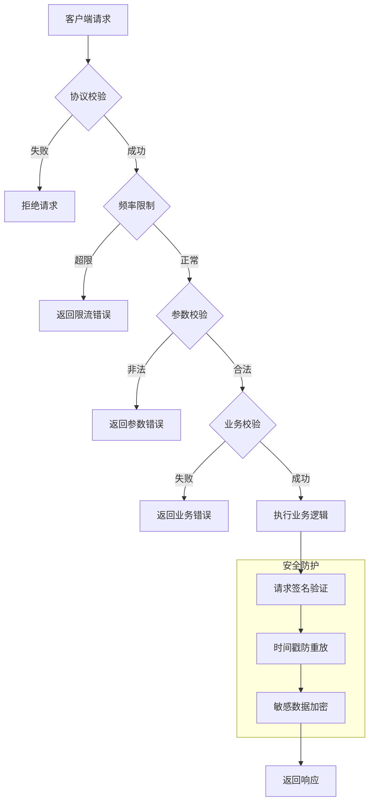

### 16.2 请求签名实现

```java
/**
 * 协议签名验证
 */
@Component
public class ProtocolSignValidator {

    private static final String SECRET_KEY = "dungeon_protocol_secret_2026";

    /**
     * 验证请求签名
     */
    public boolean validateSign(long playerId, String protocolName,
            String requestBody, String sign, long timestamp) {
        // 检查时间戳（防重放，5分钟内有效）
        long now = System.currentTimeMillis();
        if (Math.abs(now - timestamp) > 5 * 60 * 1000) {
            log.warn("协议时间戳过期: playerId={}, protocol={}, timestamp={}",
                playerId, protocolName, timestamp);
            return false;
        }

        // 计算签名
        String data = playerId + protocolName + requestBody + timestamp + SECRET_KEY;
        String expectedSign = DigestUtils.md5Hex(data);

        if (!expectedSign.equals(sign)) {
            log.warn("协议签名错误: playerId={}, protocol={}, expected={}, actual={}",
                playerId, protocolName, expectedSign, sign);
            return false;
        }

        return true;
    }

    /**
     * 生成响应签名
     */
    public String generateSign(long playerId, String protocolName, String responseBody) {
        String data = playerId + protocolName + responseBody + SECRET_KEY;
        return DigestUtils.md5Hex(data);
    }
}
```

### 16.3 协议限流实现

```java
/**
 * 协议限流器
 */
@Component
public class ProtocolRateLimiter {

    @Resource
    private RedisTemplate<String, Object> redisTemplate;

    // 限流配置
    private static final Map<String, RateLimitConfig> RATE_LIMITS = Map.of(
        "ReqEveningDungeonAttack", new RateLimitConfig(10, 1),  // 10次/秒
        "ReqMiddayDungeonAttack", new RateLimitConfig(10, 1),
        "ReqMiddayDungeonDrawBox", new RateLimitConfig(5, 1),    // 5次/秒
        "ReqEveningDungeonRankList", new RateLimitConfig(30, 60) // 30次/分钟
    );

    /**
     * 检查是否限流
     */
    public boolean allowRequest(long playerId, String protocolName) {
        RateLimitConfig config = RATE_LIMITS.get(protocolName);
        if (config == null) {
            return true; // 无限制
        }

        String key = "rate_limit:" + protocolName + ":" + playerId;
        long currentTime = System.currentTimeMillis() / 1000;
        long windowStart = currentTime - config.getWindowSeconds();

        try {
            // 使用Redis滑动窗口限流
            RedisAtomicInteger counter = new RedisAtomicInteger(key, redisTemplate.getConnectionFactory());
            long count = counter.get();

            if (count >= config.getMaxRequests()) {
                log.warn("协议限流: playerId={}, protocol={}, count={}",
                    playerId, protocolName, count);
                return false;
            }

            counter.incrementAndGet();
            counter.expire(config.getWindowSeconds(), TimeUnit.SECONDS);

            return true;
        } catch (Exception e) {
            log.error("限流检查异常: playerId={}, protocol={}", playerId, protocolName, e);
            return true; // 异常时放行
        }
    }

    @Data
    @AllArgsConstructor
    static class RateLimitConfig {
        private int maxRequests;
        private int windowSeconds;
    }
}
```

### 16.4 协议日志审计

```java
/**
 * 协议审计日志
 */
@Aspect
@Component
@Slf4j
public class ProtocolAuditAspect {

    @Resource
    private AuditLogService auditLogService;

    // 需要审计的敏感协议
    private static final Set<String> AUDIT_PROTOCOLS = Set.of(
        "ReqStartDungeon",
        "ReqUpgradeDungeonLvl",
        "ReqGainAllDungeonReward",
        "ReqMiddayDungeonDrawBox"
    );

    @AfterReturning(pointcut = "@annotation(protocolHandler)", returning = "result")
    public void auditProtocol(JoinPoint joinPoint, Object result, ProtocolHandler protocolHandler) {
        String protocolName = joinPoint.getSignature().getName();

        if (!AUDIT_PROTOCOLS.contains(protocolName)) {
            return;
        }

        try {
            // 获取参数
            Object[] args = joinPoint.getArgs();
            long playerId = extractPlayerId(args);

            // 记录审计日志
            AuditLog auditLog = new AuditLog();
            auditLog.setPlayerId(playerId);
            auditLog.setProtocolName(protocolName);
            auditLog.setRequestData(JSON.toJSONString(args));
            auditLog.setResponseData(JSON.toJSONString(result));
            auditLog.setCreateTime(new Date());
            auditLog.setIp(getClientIp());

            auditLogService.saveAsync(auditLog);

        } catch (Exception e) {
            log.error("审计日志记录异常: protocol={}", protocolName, e);
        }
    }

    private long extractPlayerId(Object[] args) {
        for (Object arg : args) {
            if (arg instanceof GameSession) {
                return ((GameSession) arg).getPlayerId();
            }
        }
        return 0;
    }

    private String getClientIp() {
        // 获取客户端IP
        RequestAttributes attrs = RequestContextHolder.getRequestAttributes();
        if (attrs instanceof ServletRequestAttributes) {
            HttpServletRequest request = ((ServletRequestAttributes) attrs).getRequest();
            return request.getRemoteAddr();
        }
        return "unknown";
    }
}
```

---

*文档生成时间: 2026-04-11*
