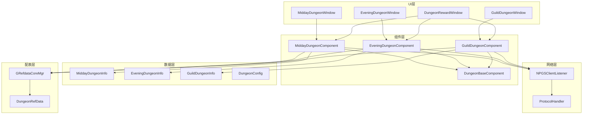
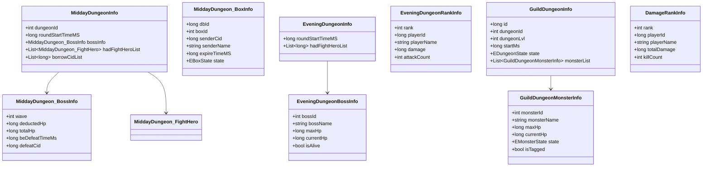
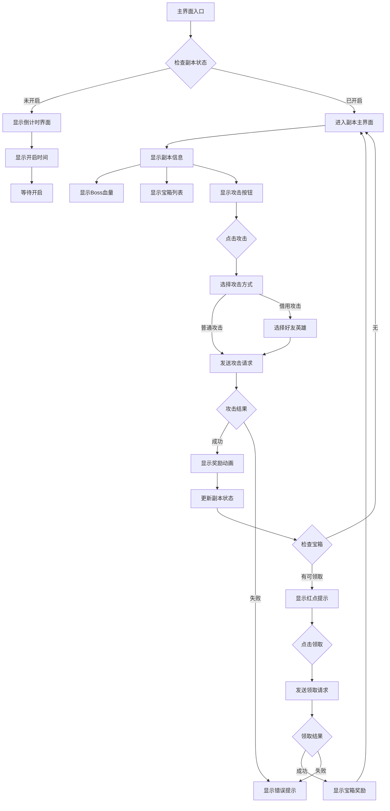
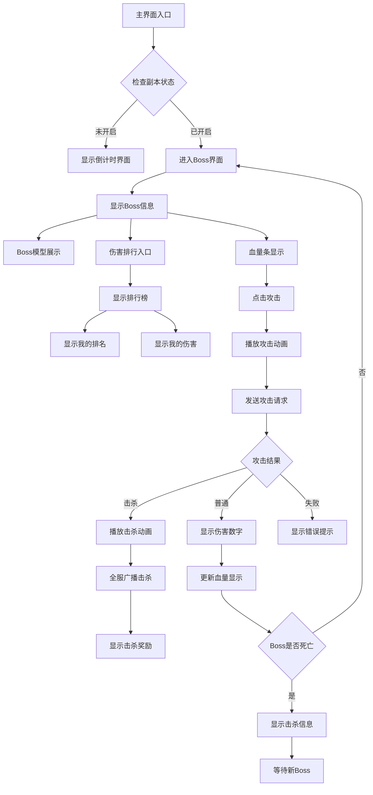
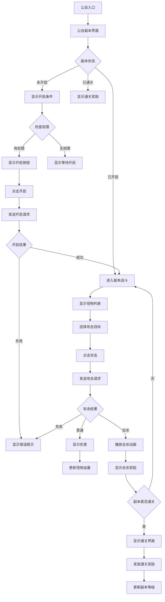

# 副本模块客户端开发文档

## 组件架构

```
GameComponent/Dungeon/
├── MiddayDungeonComponent.cs      # 午间副本组件
├── EveningDungeonComponent.cs     # 晚间副本组件
├── GuildDungeonComponent.cs       # 公会副本组件
├── DungeonBaseComponent.cs        # 副本基类组件
├── MiddayDungeonInfo.cs           # 午间副本数据结构
├── EveningDungeonInfo.cs          # 晚间副本数据结构
├── GuildDungeonInfo.cs            # 公会副本数据结构
└── DungeonConfig.cs               # 副本配置管理
```

---

## 一、午间副本组件

### 1.1 MiddayDungeonComponent - 核心实现

```csharp
using System;
using System.Collections.Generic;
using UnityEngine;

/// <summary>
/// 午间副本管理组件
/// </summary>
public class MiddayDungeonComponent : _ANPBasicPlayerComponent
{
    #region 数据成员

    // 副本信息
    private MiddayDungeonInfo _m_dungeonInfo;

    // 宝箱列表
    private List<MiddayDungeonBoxInfo> _m_boxList = new List<MiddayDungeonBoxInfo>();

    // 今日攻击次数
    private int _m_attackCount;

    // 今日借用次数
    private int _m_borrowCount;

    // 副本状态
    private EDungeonState _m_state = EDungeonState.CLOSED;

    // 结束时间
    private long _m_endTime;

    #endregion

    #region 属性访问

    /// <summary>
    /// 获取副本状态
    /// </summary>
    public EDungeonState State => _m_state;

    /// <summary>
    /// 获取今日攻击次数
    /// </summary>
    public int AttackCount => _m_attackCount;

    /// <summary>
    /// 获取剩余攻击次数
    /// </summary>
    public int RemainAttackCount
    {
        get
        {
            var dungeonRef = GRefdataCoreMgr.instance.middayDungeonRefCore.getRef(_m_dungeonInfo?.dungeonId ?? 0);
            if (dungeonRef == null) return 0;
            return Mathf.Max(0, dungeonRef.daily_count - _m_attackCount);
        }
    }

    /// <summary>
    /// 是否可以攻击
    /// </summary>
    public bool CanAttack => _m_state == EDungeonState.OPENING && RemainAttackCount > 0;

    /// <summary>
    /// 获取宝箱列表
    /// </summary>
    public List<MiddayDungeonBoxInfo> BoxList => _m_boxList;

    #endregion

    #region 请求接口

    /// <summary>
    /// 请求攻击
    /// </summary>
    /// <param name="callback">回调</param>
    public void reqAttack(Action<bool, List<NPCommonCostItem>> callback)
    {
        if (!CanAttack)
        {
            callback?.Invoke(false, null);
            return;
        }

        NPGSClientListener.sendRequest(
            NPGSWriter_024_DungeonOp.make_001_ReqMiddayDungeonAttack(_m_dungeonInfo.dungeonId),
            new CommonErrCodeRequestCallbackProtocolDealer<GS2GC_024_001_RetMiddayDungeonAttack>((msg) =>
            {
                bool success = msg.getErrCode() == 0;
                if (success)
                {
                    // 更新本地数据
                    _m_attackCount++;
                    _m_endTime = msg.getEndTime();

                    // 触发事件
                    WinMsg.SendMsg(WinMsgType.ON_MIDDAY_DUNGEON_ATTACK, msg);
                }
                callback?.Invoke(success, msg.getRewardList());
            }));
    }

    /// <summary>
    /// 请求借用好友攻击
    /// </summary>
    /// <param name="friendId">好友ID</param>
    /// <param name="heroId">英雄ID</param>
    /// <param name="callback">回调</param>
    public void reqBorrowAttack(long friendId, long heroId, Action<bool, List<NPCommonCostItem>> callback)
    {
        NPGSClientListener.sendRequest(
            NPGSWriter_024_DungeonOp.make_002_ReqMiddayDungeonBorrowAttack(
                _m_dungeonInfo.dungeonId, friendId, heroId),
            new CommonErrCodeRequestCallbackProtocolDealer<GS2GC_024_002_RetMiddayDungeonBorrowAttack>((msg) =>
            {
                bool success = msg.getErrCode() == 0;
                if (success)
                {
                    _m_borrowCount++;
                    WinMsg.SendMsg(WinMsgType.ON_MIDDAY_DUNGEON_BORROW_ATTACK, msg);
                }
                callback?.Invoke(success, msg.getRewardList());
            }));
    }

    /// <summary>
    /// 请求宝箱列表
    /// </summary>
    /// <param name="callback">回调</param>
    public void reqBoxList(Action<List<MiddayDungeonBoxInfo>> callback)
    {
        NPGSClientListener.sendRequest(
            NPGSWriter_024_DungeonOp.make_003_ReqMiddayDungeonBoxList(_m_dungeonInfo.dungeonId),
            new CommonErrCodeRequestCallbackProtocolDealer<GS2GC_024_003_RetMiddayDungeonBoxList>((msg) =>
            {
                _m_boxList = msg.getBoxList();
                callback?.Invoke(_m_boxList);
            }));
    }

    /// <summary>
    /// 请求领取宝箱
    /// </summary>
    /// <param name="boxId">宝箱ID</param>
    /// <param name="callback">回调</param>
    public void reqDrawBox(int boxId, Action<bool, List<NPCommonCostItem>> callback)
    {
        var box = _m_boxList.Find(b => b.boxId == boxId);
        if (box == null || box.state != EBoxState.UNLOCKED)
        {
            callback?.Invoke(false, null);
            return;
        }

        NPGSClientListener.sendRequest(
            NPGSWriter_024_DungeonOp.make_004_ReqMiddayDungeonDrawBox(_m_dungeonInfo.dungeonId, boxId),
            new CommonErrCodeRequestCallbackProtocolDealer<GS2GC_024_004_RetMiddayDungeonDrawBox>((msg) =>
            {
                bool success = msg.getErrCode() == 0;
                if (success)
                {
                    // 更新宝箱状态
                    box.state = EBoxState.DRAWN;
                    WinMsg.SendMsg(WinMsgType.ON_MIDDAY_DUNGEON_DRAW_BOX, boxId);
                }
                callback?.Invoke(success, msg.getRewardList());
            }));
    }

    #endregion

    #region 协议处理

    /// <summary>
    /// 处理副本信息变化
    /// </summary>
    public void onMiddayDungeonInfoChg(GS2GC_024_051_OnMiddayDungeonInfoChg msg)
    {
        _m_dungeonInfo = msg.getDungeonInfo();
        _m_attackCount = msg.getAttackCount();
        _m_borrowCount = msg.getBorrowCount();
        _m_state = (EDungeonState)msg.getState();
        _m_endTime = msg.getEndTime();

        WinMsg.SendMsg(WinMsgType.ON_MIDDAY_DUNGEON_CHG);
    }

    /// <summary>
    /// 处理副本时间变化
    /// </summary>
    public void onMiddayDungeonTimeInfoChg(GS2GC_024_052_OnMiddayDungeonTimeInfoChg msg)
    {
        _m_state = (EDungeonState)msg.getState();
        _m_endTime = msg.getEndTime();

        WinMsg.SendMsg(WinMsgType.ON_MIDDAY_DUNGEON_TIME_CHG);
    }

    #endregion

    #region 辅助方法

    /// <summary>
    /// 检查副本是否开启
    /// </summary>
    public bool CheckDungeonOpen()
    {
        var now = TimeUtil.GetCurrentTimestamp();
        return _m_state == EDungeonState.OPENING && now < _m_endTime;
    }

    /// <summary>
    /// 获取剩余时间（秒）
    /// </summary>
    public long GetRemainTime()
    {
        if (_m_endTime <= 0) return 0;
        var now = TimeUtil.GetCurrentTimestamp();
        return Math.Max(0, _m_endTime - now);
    }

    #endregion
}
```

---

## 二、晚间副本组件

### 2.1 EveningDungeonComponent - 核心实现

```csharp
using System;
using System.Collections.Generic;
using UnityEngine;

/// <summary>
/// 晚间副本管理组件
/// </summary>
public class EveningDungeonComponent : _ANPBasicPlayerComponent
{
    #region 数据成员

    // Boss信息
    private EveningDungeonBossInfo _m_bossInfo;

    // 排行榜
    private List<EveningDungeonRankInfo> _m_rankList = new List<EveningDungeonRankInfo>();

    // 我的排名
    private int _m_myRank;

    // 我的总伤害
    private long _m_myTotalDamage;

    // 副本状态
    private EDungeonState _m_state = EDungeonState.CLOSED;

    // 结束时间
    private long _m_endTime;

    #endregion

    #region 属性访问

    /// <summary>
    /// 获取Boss信息
    /// </summary>
    public EveningDungeonBossInfo BossInfo => _m_bossInfo;

    /// <summary>
    /// 获取排行榜
    /// </summary>
    public List<EveningDungeonRankInfo> RankList => _m_rankList;

    /// <summary>
    /// 获取我的排名
    /// </summary>
    public int MyRank => _m_myRank;

    /// <summary>
    /// 获取我的总伤害
    /// </summary>
    public long MyTotalDamage => _m_myTotalDamage;

    /// <summary>
    /// Boss是否存活
    /// </summary>
    public bool IsBossAlive => _m_bossInfo?.isAlive ?? false;

    /// <summary>
    /// 副本是否开启
    /// </summary>
    public bool IsOpen => _m_state == EDungeonState.OPENING;

    #endregion

    #region 请求接口

    /// <summary>
    /// 请求攻击Boss
    /// </summary>
    /// <param name="callback">回调（伤害，是否击杀）</param>
    public void reqAttackBoss(Action<long, bool, List<NPCommonCostItem>> callback)
    {
        if (!IsOpen || !IsBossAlive)
        {
            callback?.Invoke(0, false, null);
            return;
        }

        NPGSClientListener.sendRequest(
            NPGSWriter_024_DungeonOp.make_011_ReqEveningDungeonAttack(_m_bossInfo.bossId),
            new CommonErrCodeRequestCallbackProtocolDealer<GS2GC_024_011_RetEveningDungeonAttack>((msg) =>
            {
                bool success = msg.getErrCode() == 0;
                if (success)
                {
                    // 更新伤害
                    _m_myTotalDamage += msg.getDamage();
                    _m_myRank = msg.getMyRank();

                    // 检查是否击杀
                    bool isKill = msg.getIsKill();
                    if (isKill)
                    {
                        WinMsg.SendMsg(WinMsgType.ON_EVENING_DUNGEON_BOSS_KILL, _m_bossInfo.bossId);
                    }

                    WinMsg.SendMsg(WinMsgType.ON_EVENING_DUNGEON_ATTACK, msg);
                }
                callback?.Invoke(msg.getDamage(), msg.getIsKill(), msg.getRewardList());
            }));
    }

    /// <summary>
    /// 请求Boss信息
    /// </summary>
    /// <param name="bossId">Boss ID</param>
    /// <param name="callback">回调</param>
    public void reqBossInfo(int bossId, Action<EveningDungeonBossInfo> callback)
    {
        NPGSClientListener.sendRequest(
            NPGSWriter_024_DungeonOp.make_012_ReqEveningDungeonBossInfo(bossId),
            new CommonErrCodeRequestCallbackProtocolDealer<GS2GC_024_012_RetEveningDungeonBossInfo>((msg) =>
            {
                _m_bossInfo = msg.getBossInfo();
                callback?.Invoke(_m_bossInfo);
            }));
    }

    /// <summary>
    /// 请求排行榜
    /// </summary>
    /// <param name="bossId">Boss ID</param>
    /// <param name="callback">回调</param>
    public void reqRankList(int bossId, Action<List<EveningDungeonRankInfo>> callback)
    {
        NPGSClientListener.sendRequest(
            NPGSWriter_024_DungeonOp.make_014_ReqEveningDungeonRankList(bossId, 1),
            new CommonErrCodeRequestCallbackProtocolDealer<GS2GC_024_014_RetEveningDungeonRankList>((msg) =>
            {
                _m_rankList = msg.getRankList();
                _m_myRank = msg.getMyRank();
                callback?.Invoke(_m_rankList);
            }));
    }

    /// <summary>
    /// 请求击杀日志
    /// </summary>
    /// <param name="count">请求数量</param>
    /// <param name="callback">回调</param>
    public void reqDefeatLog(int count, Action<List<DefeatLogInfo>> callback)
    {
        NPGSClientListener.sendRequest(
            NPGSWriter_024_DungeonOp.make_015_ReqEveningDungeonDefeatLog(count),
            new CommonErrCodeRequestCallbackProtocolDealer<GS2GC_024_015_RetEveningDungeonDefeatLog>((msg) =>
            {
                callback?.Invoke(msg.getDefeatLogList());
            }));
    }

    #endregion

    #region 协议处理

    /// <summary>
    /// 处理副本信息变化
    /// </summary>
    public void onEveningDungeonInfoChg(GS2GC_024_061_OnEveningDungeonInfoChg msg)
    {
        _m_bossInfo = msg.getBossInfo();
        _m_state = (EDungeonState)msg.getState();
        _m_endTime = msg.getEndTime();
        _m_myTotalDamage = msg.getMyDamage();

        WinMsg.SendMsg(WinMsgType.ON_EVENING_DUNGEON_CHG);
    }

    /// <summary>
    /// 处理副本时间变化
    /// </summary>
    public void onEveningDungeonTimeInfoChg(GS2GC_024_062_OnEveningDungeonTimeInfoChg msg)
    {
        _m_state = (EDungeonState)msg.getState();
        _m_endTime = msg.getEndTime();

        WinMsg.SendMsg(WinMsgType.ON_EVENING_DUNGEON_TIME_CHG);
    }

    #endregion

    #region 辅助方法

    /// <summary>
    /// 获取Boss血量百分比
    /// </summary>
    public float GetBossHpPercent()
    {
        if (_m_bossInfo == null || _m_bossInfo.maxHp <= 0) return 0f;
        return (float)_m_bossInfo.currentHp / _m_bossInfo.maxHp;
    }

    /// <summary>
    /// 格式化伤害显示
    /// </summary>
    public string FormatDamage(long damage)
    {
        if (damage >= 100000000) // 1亿
            return $"{damage / 100000000f:F2}亿";
        else if (damage >= 10000) // 1万
            return $"{damage / 10000f:F2}万";
        else
            return damage.ToString();
    }

    #endregion
}
```

---

## 三、公会副本组件

### 3.1 GuildDungeonComponent - 核心实现

```csharp
using System;
using System.Collections.Generic;
using UnityEngine;

/// <summary>
/// 公会副本管理组件
/// </summary>
public class GuildDungeonComponent : _ANPBasicPlayerComponent
{
    #region 数据成员

    // 公会ID
    private long _m_guildId;

    // 副本信息字典
    private Dictionary<int, GuildDungeonInfo> _m_dungeonDict = new Dictionary<int, GuildDungeonInfo>();

    // 当前副本
    private int _m_currentDungeonId;

    // 伤害排行
    private List<DamageRankInfo> _m_damageRankList = new List<DamageRankInfo>();

    #endregion

    #region 属性访问

    /// <summary>
    /// 获取当前副本信息
    /// </summary>
    public GuildDungeonInfo CurrentDungeon
    {
        get
        {
            if (_m_dungeonDict.TryGetValue(_m_currentDungeonId, out var info))
                return info;
            return null;
        }
    }

    /// <summary>
    /// 获取伤害排行
    /// </summary>
    public List<DamageRankInfo> DamageRankList => _m_damageRankList;

    #endregion

    #region 请求接口

    /// <summary>
    /// 请求攻击怪物
    /// </summary>
    /// <param name="monsterId">怪物ID</param>
    /// <param name="callback">回调</param>
    public void reqAttack(int monsterId, Action<AttackResultInfo> callback)
    {
        var dungeon = CurrentDungeon;
        if (dungeon == null || dungeon.state != EDungeonState.OPENING)
        {
            callback?.Invoke(null);
            return;
        }

        var monster = dungeon.monsterList.Find(m => m.monsterId == monsterId);
        if (monster == null || monster.state != EMonsterState.ALIVE)
        {
            callback?.Invoke(null);
            return;
        }

        NPGSClientListener.sendRequest(
            NPGSWriter_037_GuildDungeonOp.make_005_ReqAttackDungeon(_m_guildId, dungeon.dungeonId, monsterId),
            new CommonErrCodeRequestCallbackProtocolDealer<GS2GC_037_005_RetAttackDungeon>((msg) =>
            {
                var result = msg.getAttackResult();
                if (result != null)
                {
                    // 更新怪物血量
                    monster.currentHp = msg.getMonsterCurrentHp();

                    // 检查是否击杀
                    if (result.isKill)
                    {
                        monster.state = EMonsterState.DEAD;
                        WinMsg.SendMsg(WinMsgType.ON_GUILD_DUNGEON_MONSTER_KILL, monsterId);
                    }

                    WinMsg.SendMsg(WinMsgType.ON_GUILD_DUNGEON_ATTACK, result);
                }
                callback?.Invoke(result);
            }));
    }

    /// <summary>
    /// 请求开启副本
    /// </summary>
    /// <param name="dungeonId">副本ID</param>
    /// <param name="callback">回调</param>
    public void reqStartDungeon(int dungeonId, Action<bool> callback)
    {
        NPGSClientListener.sendRequest(
            NPGSWriter_037_GuildDungeonOp.make_003_ReqStartDungeon(_m_guildId, dungeonId),
            new CommonErrCodeRequestCallbackProtocolDealer<GS2GC_037_003_RetStartDungeon>((msg) =>
            {
                bool success = msg.getErrCode() == 0;
                if (success)
                {
                    _m_currentDungeonId = dungeonId;
                    UpdateDungeonInfo(msg.getDungeonInfo());
                    WinMsg.SendMsg(WinMsgType.ON_GUILD_DUNGEON_START, dungeonId);
                }
                callback?.Invoke(success);
            }));
    }

    /// <summary>
    /// 请求升级副本等级
    /// </summary>
    /// <param name="dungeonId">副本ID</param>
    /// <param name="callback">回调</param>
    public void reqUpgradeDungeonLvl(int dungeonId, Action<bool, int> callback)
    {
        NPGSClientListener.sendRequest(
            NPGSWriter_037_GuildDungeonOp.make_004_ReqUpgradeDungeonLvl(_m_guildId, dungeonId),
            new CommonErrCodeRequestCallbackProtocolDealer<GS2GC_037_004_RetUpgradeDungeonLvl>((msg) =>
            {
                bool success = msg.getErrCode() == 0;
                int newLevel = 0;
                if (success)
                {
                    newLevel = msg.getNewLevel();
                    if (_m_dungeonDict.TryGetValue(dungeonId, out var info))
                    {
                        info.dungeonLvl = newLevel;
                    }
                    WinMsg.SendMsg(WinMsgType.ON_GUILD_DUNGEON_LEVEL_UP, dungeonId);
                }
                callback?.Invoke(success, newLevel);
            }));
    }

    /// <summary>
    /// 请求伤害排行榜
    /// </summary>
    /// <param name="dungeonId">副本ID</param>
    /// <param name="callback">回调</param>
    public void reqDamageRank(int dungeonId, Action<List<DamageRankInfo>> callback)
    {
        NPGSClientListener.sendRequest(
            NPGSWriter_037_GuildDungeonOp.make_007_ReqDamageRank(_m_guildId, dungeonId),
            new CommonErrCodeRequestCallbackProtocolDealer<GS2GC_037_007_RetDamageRank>((msg) =>
            {
                _m_damageRankList = msg.getDamageRankList();
                callback?.Invoke(_m_damageRankList);
            }));
    }

    /// <summary>
    /// 请求领取所有奖励
    /// </summary>
    /// <param name="dungeonId">副本ID</param>
    /// <param name="callback">回调</param>
    public void reqGainAllReward(int dungeonId, Action<List<NPCommonCostItem>> callback)
    {
        NPGSClientListener.sendRequest(
            NPGSWriter_037_GuildDungeonOp.make_008_ReqGainAllDungeonReward(_m_guildId, dungeonId),
            new CommonErrCodeRequestCallbackProtocolDealer<GS2GC_037_008_RetGainAllDungeonReward>((msg) =>
            {
                var rewards = msg.getRewardList();
                WinMsg.SendMsg(WinMsgType.ON_GUILD_DUNGEON_GAIN_REWARD, rewards);
                callback?.Invoke(rewards);
            }));
    }

    /// <summary>
    /// 请求设置标记怪物
    /// </summary>
    /// <param name="dungeonId">副本ID</param>
    /// <param name="monsterIdList">怪物ID列表</param>
    /// <param name="callback">回调</param>
    public void reqSetTagMonster(int dungeonId, List<int> monsterIdList, Action<bool> callback)
    {
        NPGSClientListener.sendRequest(
            NPGSWriter_037_GuildDungeonOp.make_012_ReqSetTagMonsterList(_m_guildId, dungeonId, monsterIdList),
            new CommonErrCodeRequestCallbackProtocolDealer<GS2GC_037_012_RetSetTagMonsterList>((msg) =>
            {
                bool success = msg.getErrCode() == 0;
                if (success)
                {
                    // 更新怪物标记状态
                    if (_m_dungeonDict.TryGetValue(dungeonId, out var info))
                    {
                        foreach (var monster in info.monsterList)
                        {
                            monster.isTagged = monsterIdList.Contains(monster.monsterId);
                        }
                    }
                    WinMsg.SendMsg(WinMsgType.ON_GUILD_DUNGEON_TAG_MONSTER, monsterIdList);
                }
                callback?.Invoke(success);
            }));
    }

    #endregion

    #region 协议处理

    /// <summary>
    /// 处理副本设置变化
    /// </summary>
    public void onDungeonSetChg(GS2GC_037_050_OnDungeonSetChg msg)
    {
        var info = msg.getDungeonInfo();
        if (info != null)
        {
            UpdateDungeonInfo(info);
        }
        WinMsg.SendMsg(WinMsgType.ON_GUILD_DUNGEON_SET_CHG);
    }

    /// <summary>
    /// 处理副本实例变化
    /// </summary>
    public void onDungeonInstanceChg(GS2GC_037_051_OnDungeonInstanceChg msg)
    {
        var info = msg.getDungeonInfo();
        if (info != null)
        {
            UpdateDungeonInfo(info);
        }
        WinMsg.SendMsg(WinMsgType.ON_GUILD_DUNGEON_INSTANCE_CHG);
    }

    /// <summary>
    /// 处理怪物变化
    /// </summary>
    public void onDungeonMonsterChg(GS2GC_037_052_OnDungeonMonsterChg msg)
    {
        if (_m_dungeonDict.TryGetValue(msg.getDungeonId(), out var info))
        {
            var monsterList = msg.getMonsterList();
            foreach (var newMonster in monsterList)
            {
                var monster = info.monsterList.Find(m => m.monsterId == newMonster.monsterId);
                if (monster != null)
                {
                    monster.currentHp = newMonster.currentHp;
                    monster.state = newMonster.state;
                }
            }
        }
        WinMsg.SendMsg(WinMsgType.ON_GUILD_DUNGEON_MONSTER_CHG);
    }

    #endregion

    #region 辅助方法

    private void UpdateDungeonInfo(GuildDungeonInfo info)
    {
        if (info == null) return;
        _m_dungeonDict[info.dungeonId] = info;
    }

    /// <summary>
    /// 获取存活的怪物列表
    /// </summary>
    public List<GuildDungeonMonsterInfo> GetAliveMonsters()
    {
        var dungeon = CurrentDungeon;
        if (dungeon == null) return new List<GuildDungeonMonsterInfo>();
        return dungeon.monsterList.FindAll(m => m.state == EMonsterState.ALIVE);
    }

    /// <summary>
    /// 检查副本是否通关
    /// </summary>
    public bool IsDungeonCleared()
    {
        var dungeon = CurrentDungeon;
        if (dungeon == null) return false;
        return dungeon.monsterList.TrueForAll(m => m.state == EMonsterState.DEAD);
    }

    #endregion
}
```

---

## 四、UI 窗口实现

### 4.1 午间副本界面

```csharp
using UnityEngine;
using UnityEngine.UI;

/// <summary>
/// 午间副本窗口
/// </summary>
public class MiddayDungeonWindow : BaseWindow
{
    [Header("UI组件")]
    [SerializeField] private Text _titleText;
    [SerializeField] private Text _stateText;
    [SerializeField] private Text _countText;
    [SerializeField] private Text _timerText;
    [SerializeField] private Button _attackBtn;
    [SerializeField] private Transform _boxContainer;
    [SerializeField] private GameObject _boxItemPrefab;

    private MiddayDungeonComponent _component;

    protected override void OnInit()
    {
        _component = MiddayDungeonComponent.instance;
        _attackBtn.onClick.AddListener(OnClickAttack);
    }

    protected override void OnOpen()
    {
        RefreshUI();
        RegisterEvents();
    }

    protected override void OnClose()
    {
        UnregisterEvents();
    }

    private void RegisterEvents()
    {
        WinMsg.Register(WinMsgType.ON_MIDDAY_DUNGEON_CHG, OnDungeonChg);
        WinMsg.Register(WinMsgType.ON_MIDDAY_DUNGEON_ATTACK, OnAttackResult);
        WinMsg.Register(WinMsgType.ON_MIDDAY_DUNGEON_DRAW_BOX, OnDrawBox);
    }

    private void UnregisterEvents()
    {
        WinMsg.Unregister(WinMsgType.ON_MIDDAY_DUNGEON_CHG, OnDungeonChg);
        WinMsg.Unregister(WinMsgType.ON_MIDDAY_DUNGEON_ATTACK, OnAttackResult);
        WinMsg.Unregister(WinMsgType.ON_MIDDAY_DUNGEON_DRAW_BOX, OnDrawBox);
    }

    private void RefreshUI()
    {
        // 更新状态
        _stateText.text = GetStateText(_component.State);
        _countText.text = $"今日次数: {_component.AttackCount}/{GetMaxCount()}";

        // 更新按钮状态
        _attackBtn.interactable = _component.CanAttack;

        // 更新宝箱列表
        RefreshBoxList();

        // 更新计时器
        UpdateTimer();
    }

    private void RefreshBoxList()
    {
        // 清空现有项
        foreach (Transform child in _boxContainer)
        {
            Destroy(child.gameObject);
        }

        // 创建宝箱项
        foreach (var box in _component.BoxList)
        {
            var item = Instantiate(_boxItemPrefab, _boxContainer).GetComponent<MiddayDungeonBoxItem>();
            item.SetData(box, OnClickBox);
        }
    }

    private void OnClickAttack()
    {
        if (!_component.CanAttack) return;

        // 播放攻击动画
        PlayAttackAnimation();

        _component.reqAttack((success, rewards) =>
        {
            if (success)
            {
                ShowRewards(rewards);
                RefreshUI();
            }
            else
            {
                ShowErrorTip("攻击失败");
            }
        });
    }

    private void OnClickBox(int boxId)
    {
        _component.reqDrawBox(boxId, (success, rewards) =>
        {
            if (success)
            {
                ShowRewards(rewards);
                RefreshBoxList();
            }
            else
            {
                ShowErrorTip("领取失败");
            }
        });
    }

    private void UpdateTimer()
    {
        var remainTime = _component.GetRemainTime();
        if (remainTime > 0)
        {
            var ts = TimeSpan.FromSeconds(remainTime);
            _timerText.text = $"剩余时间: {ts.Hours:D2}:{ts.Minutes:D2}:{ts.Seconds:D2}";
        }
        else
        {
            _timerText.text = "副本已结束";
        }
    }

    private void OnDungeonChg()
    {
        RefreshUI();
    }

    private void OnAttackResult()
    {
        RefreshUI();
    }

    private void OnDrawBox(int boxId)
    {
        RefreshBoxList();
    }

    private string GetStateText(EDungeonState state)
    {
        switch (state)
        {
            case EDungeonState.CLOSED: return "未开启";
            case EDungeonState.OPENING: return "进行中";
            case EDungeonState.ENDED: return "已结束";
            default: return "";
        }
    }

    private int GetMaxCount()
    {
        var dungeonRef = GRefdataCoreMgr.instance.middayDungeonRefCore.getRef(1);
        return dungeonRef?.daily_count ?? 0;
    }
}
```

### 4.2 晚间副本界面

```csharp
using UnityEngine;
using UnityEngine.UI;

/// <summary>
/// 晚间副本窗口
/// </summary>
public class EveningDungeonWindow : BaseWindow
{
    [Header("Boss信息")]
    [SerializeField] private Text _bossNameText;
    [SerializeField] private Slider _hpSlider;
    [SerializeField] private Text _hpText;
    [SerializeField] private Text _hpPercentText;

    [Header("我的信息")]
    [SerializeField] private Text _myRankText;
    [SerializeField] private Text _myDamageText;

    [Header("按钮")]
    [SerializeField] private Button _attackBtn;
    [SerializeField] private Button _rankBtn;

    [Header("排行榜")]
    [SerializeField] private GameObject _rankPanel;
    [SerializeField] private Transform _rankContainer;
    [SerializeField] private GameObject _rankItemPrefab;

    private EveningDungeonComponent _component;

    protected override void OnInit()
    {
        _component = EveningDungeonComponent.instance;
        _attackBtn.onClick.AddListener(OnClickAttack);
        _rankBtn.onClick.AddListener(OnClickViewRank);
    }

    protected override void OnOpen()
    {
        RefreshUI();
        RegisterEvents();
    }

    protected override void OnClose()
    {
        UnregisterEvents();
    }

    private void RefreshUI()
    {
        var bossInfo = _component.BossInfo;
        if (bossInfo != null)
        {
            _bossNameText.text = bossInfo.bossName;
            _hpSlider.value = _component.GetBossHpPercent();
            _hpText.text = $"{_component.FormatDamage(bossInfo.currentHp)} / {_component.FormatDamage(bossInfo.maxHp)}";
            _hpPercentText.text = $"{_component.GetBossHpPercent() * 100:F1}%";
        }

        _myRankText.text = $"排名: {_component.MyRank}";
        _myDamageText.text = $"总伤害: {_component.FormatDamage(_component.MyTotalDamage)}";

        _attackBtn.interactable = _component.IsOpen && _component.IsBossAlive;
    }

    private void OnClickAttack()
    {
        // 播放攻击特效
        PlayAttackEffect();

        _component.reqAttackBoss((damage, isKill, rewards) =>
        {
            // 显示伤害
            ShowDamageNumber(damage);

            if (isKill)
            {
                // Boss被击杀
                PlayBossDeathEffect();
                ShowKillNotification();
            }

            if (rewards != null && rewards.Count > 0)
            {
                ShowRewards(rewards);
            }

            RefreshUI();
        });
    }

    private void OnClickViewRank()
    {
        _component.reqRankList(_component.BossInfo?.bossId ?? 0, (rankList) =>
        {
            ShowRankList(rankList);
        });
    }

    private void ShowRankList(List<EveningDungeonRankInfo> rankList)
    {
        _rankPanel.SetActive(true);

        // 清空现有项
        foreach (Transform child in _rankContainer)
        {
            Destroy(child.gameObject);
        }

        // 创建排行项
        foreach (var rank in rankList)
        {
            var item = Instantiate(_rankItemPrefab, _rankContainer).GetComponent<EveningDungeonRankItem>();
            item.SetData(rank);
        }
    }

    private void ShowDamageNumber(long damage)
    {
        // 显示伤害飘字
        var text = _component.FormatDamage(damage);
        FloatingTextManager.Show(text, Color.red, Vector3.up * 100);
    }

    private void PlayAttackEffect()
    {
        // 播放攻击特效
        EffectManager.Play("AttackEffect");
    }

    private void PlayBossDeathEffect()
    {
        // 播放Boss死亡特效
        EffectManager.Play("BossDeathEffect");
    }

    private void ShowKillNotification()
    {
        // 显示击杀通知
        UIManager.ShowTip("恭喜击杀Boss！");
    }
}
```

---

## 五、事件消息定义

```csharp
/// <summary>
/// 副本相关消息类型
/// </summary>
public static partial class WinMsgType
{
    // 午间副本
    public const string ON_MIDDAY_DUNGEON_CHG = "ON_MIDDAY_DUNGEON_CHG";
    public const string ON_MIDDAY_DUNGEON_TIME_CHG = "ON_MIDDAY_DUNGEON_TIME_CHG";
    public const string ON_MIDDAY_DUNGEON_ATTACK = "ON_MIDDAY_DUNGEON_ATTACK";
    public const string ON_MIDDAY_DUNGEON_BORROW_ATTACK = "ON_MIDDAY_DUNGEON_BORROW_ATTACK";
    public const string ON_MIDDAY_DUNGEON_DRAW_BOX = "ON_MIDDAY_DUNGEON_DRAW_BOX";

    // 晚间副本
    public const string ON_EVENING_DUNGEON_CHG = "ON_EVENING_DUNGEON_CHG";
    public const string ON_EVENING_DUNGEON_TIME_CHG = "ON_EVENING_DUNGEON_TIME_CHG";
    public const string ON_EVENING_DUNGEON_ATTACK = "ON_EVENING_DUNGEON_ATTACK";
    public const string ON_EVENING_DUNGEON_BOSS_KILL = "ON_EVENING_DUNGEON_BOSS_KILL";

    // 公会副本
    public const string ON_GUILD_DUNGEON_START = "ON_GUILD_DUNGEON_START";
    public const string ON_GUILD_DUNGEON_LEVEL_UP = "ON_GUILD_DUNGEON_LEVEL_UP";
    public const string ON_GUILD_DUNGEON_ATTACK = "ON_GUILD_DUNGEON_ATTACK";
    public const string ON_GUILD_DUNGEON_MONSTER_KILL = "ON_GUILD_DUNGEON_MONSTER_KILL";
    public const string ON_GUILD_DUNGEON_GAIN_REWARD = "ON_GUILD_DUNGEON_GAIN_REWARD";
    public const string ON_GUILD_DUNGEON_TAG_MONSTER = "ON_GUILD_DUNGEON_TAG_MONSTER";
    public const string ON_GUILD_DUNGEON_SET_CHG = "ON_GUILD_DUNGEON_SET_CHG";
    public const string ON_GUILD_DUNGEON_INSTANCE_CHG = "ON_GUILD_DUNGEON_INSTANCE_CHG";
    public const string ON_GUILD_DUNGEON_MONSTER_CHG = "ON_GUILD_DUNGEON_MONSTER_CHG";
    public const string ON_GUILD_DUNGEON_PUSH = "ON_GUILD_DUNGEON_PUSH";
}
```

---

## 六、注意事项

1. **时间限制**：午间副本和晚间副本有固定的开启时间，需要检查 `state` 和 `endTime`
2. **Boss血量**：晚间副本Boss血量全服共享，需要实时更新显示
3. **公会权限**：公会副本的操作需要检查玩家权限（会长/官员）
4. **借用功能**：午间副本的借用攻击有每日次数限制
5. **怪物标记**：公会副本支持标记重点攻击的怪物，便于公会成员协作
6. **奖励领取**：宝箱和奖励需要检查领取条件是否满足

---

## 七、组件架构图

### 7.1 客户端组件依赖关系



### 7.2 数据模型类图



---

## 八、UI流程图

### 8.1 午间副本UI流程



### 8.2 晚间副本UI流程



### 8.3 公会副本UI流程



---

## 九、完整字段列表

### 9.1 MiddayDungeonInfo 完整字段

| 序号 | 字段名 | 类型 | 说明 | 默认值 |
|------|--------|------|------|--------|
| 1 | dungeonId | int | 副本ID | 0 |
| 2 | roundStartTimeMS | long | 本轮开始时间戳 | 0 |
| 3 | bossInfo | MiddayDungeon_BossInfo | Boss信息 | null |
| 4 | hadFightHeroList | List\<MiddayDungeon_FightHero\> | 已战斗英雄列表 | [] |
| 5 | borrowCidList | List\<long\> | 借用过大臣的玩家列表 | [] |
| 6 | attackCount | int | 今日攻击次数 | 0 |
| 7 | borrowCount | int | 今日借用次数 | 0 |
| 8 | state | EDungeonState | 副本状态 | CLOSED |
| 9 | endTime | long | 结束时间戳 | 0 |

### 9.2 EveningDungeonBossInfo 完整字段

| 序号 | 字段名 | 类型 | 说明 | 默认值 |
|------|--------|------|------|--------|
| 1 | bossId | int | Boss ID | 0 |
| 2 | bossName | string | Boss名称 | "" |
| 3 | bossLevel | int | Boss等级 | 0 |
| 4 | maxHp | long | 最大血量 | 0 |
| 5 | currentHp | long | 当前血量 | 0 |
| 6 | atk | long | 攻击力 | 0 |
| 7 | def | long | 防御力 | 0 |
| 8 | isAlive | bool | 是否存活 | true |
| 9 | killPlayerId | long | 击杀玩家ID | 0 |
| 10 | killPlayerName | string | 击杀玩家名称 | "" |
| 11 | killTime | long | 击杀时间戳 | 0 |

### 9.3 GuildDungeonInfo 完整字段

| 序号 | 字段名 | 类型 | 说明 | 默认值 |
|------|--------|------|------|--------|
| 1 | id | long | 实例ID | 0 |
| 2 | dungeonId | int | 副本ID | 0 |
| 3 | dungeonLvl | int | 副本等级 | 1 |
| 4 | state | EDungeonState | 副本状态 | CLOSED |
| 5 | autoStart | bool | 是否自动开始 | false |
| 6 | startMs | long | 开启时间戳 | 0 |
| 7 | endMs | long | 结束时间戳 | 0 |
| 8 | monsterList | List\<GuildDungeonMonsterInfo\> | 怪物列表 | [] |
| 9 | tagMonsterIdList | List\<long\> | 标记怪物列表 | [] |

### 9.4 GuildDungeonMonsterInfo 完整字段

| 序号 | 字段名 | 类型 | 说明 | 默认值 |
|------|--------|------|------|--------|
| 1 | monsterId | int | 怪物ID | 0 |
| 2 | monsterName | string | 怪物名称 | "" |
| 3 | monsterLevel | int | 怪物等级 | 0 |
| 4 | maxHp | long | 最大血量 | 0 |
| 5 | currentHp | long | 当前血量 | 0 |
| 6 | atk | long | 攻击力 | 0 |
| 7 | def | long | 防御力 | 0 |
| 8 | state | EMonsterState | 怪物状态 | ALIVE |
| 9 | isTagged | bool | 是否被标记 | false |
| 10 | killPlayerId | long | 击杀玩家ID | 0 |
| 11 | killPlayerName | string | 击杀玩家名称 | "" |

---

## 十、客户端性能优化

### 10.1 UI渲染优化

```csharp
/// <summary>
/// 副本列表虚拟列表实现
/// </summary>
public class DungeonListVirtualScroll : MonoBehaviour
{
    [SerializeField] private RectTransform _viewport;
    [SerializeField] private RectTransform _content;
    [SerializeField] private GameObject _itemPrefab;

    private List<DungeonData> _dataList = new List<DungeonData>();
    private Dictionary<int, GameObject> _itemDict = new Dictionary<int, GameObject>();

    private float _itemHeight = 100f;
    private int _visibleCount;
    private int _startIndex;

    private void Start()
    {
        _visibleCount = Mathf.CeilToInt(_viewport.rect.height / _itemHeight) + 2;
    }

    private void Update()
    {
        UpdateVisibleItems();
    }

    private void UpdateVisibleItems()
    {
        int newStartIndex = Mathf.FloorToInt(_content.anchoredPosition.y / _itemHeight);
        newStartIndex = Mathf.Max(0, newStartIndex);

        if (newStartIndex != _startIndex)
        {
            _startIndex = newStartIndex;
            RefreshVisibleItems();
        }
    }

    private void RefreshVisibleItems()
    {
        // 隐藏所有可见项
        foreach (var item in _itemDict.Values)
        {
            item.SetActive(false);
        }

        // 显示当前可见项
        for (int i = 0; i < _visibleCount; i++)
        {
            int dataIndex = _startIndex + i;
            if (dataIndex >= _dataList.Count) break;

            if (!_itemDict.TryGetValue(i, out var item))
            {
                item = Instantiate(_itemPrefab, _content);
                _itemDict[i] = item;
            }

            item.SetActive(true);
            item.GetComponent<RectTransform>().anchoredPosition =
                new Vector2(0, -dataIndex * _itemHeight);
            item.GetComponent<DungeonItem>().SetData(_dataList[dataIndex]);
        }
    }
}
```

### 10.2 资源预加载

```csharp
/// <summary>
/// 副本资源预加载管理
/// </summary>
public class DungeonResourcePreloader : MonoBehaviour
{
    private Dictionary<int, AssetBundle> _loadedBundles = new Dictionary<int, AssetBundle>();

    /// <summary>
    /// 预加载副本资源
    /// </summary>
    public void PreloadDungeonResources(int dungeonId)
    {
        StartCoroutine(DoPreload(dungeonId));
    }

    private IEnumerator DoPreload(int dungeonId)
    {
        // 获取副本配置
        var dungeonRef = GRefdataCoreMgr.instance.middayDungeonRefCore.getRef(dungeonId);
        if (dungeonRef == null) yield break;

        // 预加载背景图
        if (dungeonRef.bg_image != null)
        {
            yield return LoadAssetAsync(dungeonRef.bg_image);
        }

        // 预加载Boss模型
        var bossRef = GRefdataCoreMgr.instance.eveningDungeonBossRefCore.getRef(dungeonRef.boss_id);
        if (bossRef != null && bossRef.model_id != null)
        {
            yield return LoadAssetAsync(bossRef.model_id);
        }

        // 预加载特效
        yield return PreloadEffects(dungeonId);
    }

    private IEnumerator PreloadEffects(int dungeonId)
    {
        string[] effectPaths = new string[]
        {
            "Effects/Dungeon/AttackEffect",
            "Effects/Dungeon/CritEffect",
            "Effects/Dungeon/KillEffect",
            "Effects/Dungeon/RewardEffect"
        };

        foreach (var path in effectPaths)
        {
            var request = Resources.LoadAsync<GameObject>(path);
            yield return request;
        }
    }
}
```

---

## 十一、错误处理与用户提示

### 11.1 错误码处理映射

```csharp
/// <summary>
/// 副本错误码处理
/// </summary>
public static class DungeonErrorHandler
{
    private static readonly Dictionary<int, string> ErrorMessages = new Dictionary<int, string>
    {
        { 24001, "副本数据异常，请刷新重试" },
        { 24002, "副本尚未开启，请等待开启时间" },
        { 24003, "副本已结束，请明天再来" },
        { 24004, "今日挑战次数已用完" },
        { 24005, "体力不足，请补充体力" },
        { 24006, "宝箱数据异常" },
        { 24007, "宝箱已领取" },
        { 24008, "领取条件未满足" },
        { 24009, "Boss数据异常" },
        { 24010, "Boss已被击杀" },
        { 24011, "怪物数据异常" },
        { 24012, "怪物已被击杀" },
        { 24013, "副本未解锁" },
        { 24014, "等级已达上限" },
        { 24015, "公会等级不足" },
        { 24016, "无权限操作" },
        { 24017, "借用次数已用完" },
        { 24018, "好友不存在" },
        { 24019, "英雄不可用" },
        { 24020, "奖励已领取" }
    };

    public static string GetErrorMessage(int errorCode)
    {
        if (ErrorMessages.TryGetValue(errorCode, out var message))
        {
            return message;
        }
        return "操作失败，请稍后重试";
    }

    public static void HandleError(int errorCode)
    {
        string message = GetErrorMessage(errorCode);
        UIManager.ShowTip(message);

        // 根据错误码执行特定操作
        switch (errorCode)
        {
            case 24002: // 副本未开启
                // 跳转到倒计时界面
                break;
            case 24004: // 次数用完
                // 显示购买选项
                break;
            case 24005: // 体力不足
                // 显示体力获取途径
                break;
        }
    }
}
```

---

*文档生成时间: 2026-04-11*
