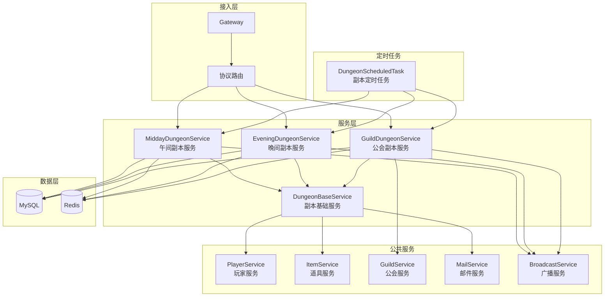
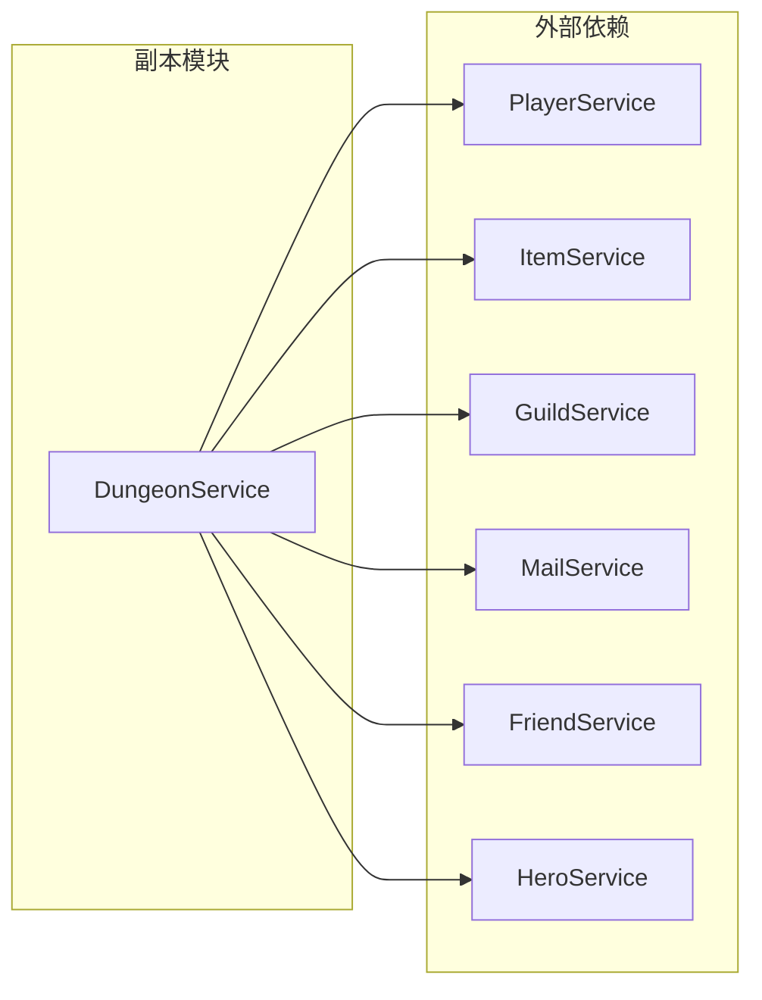
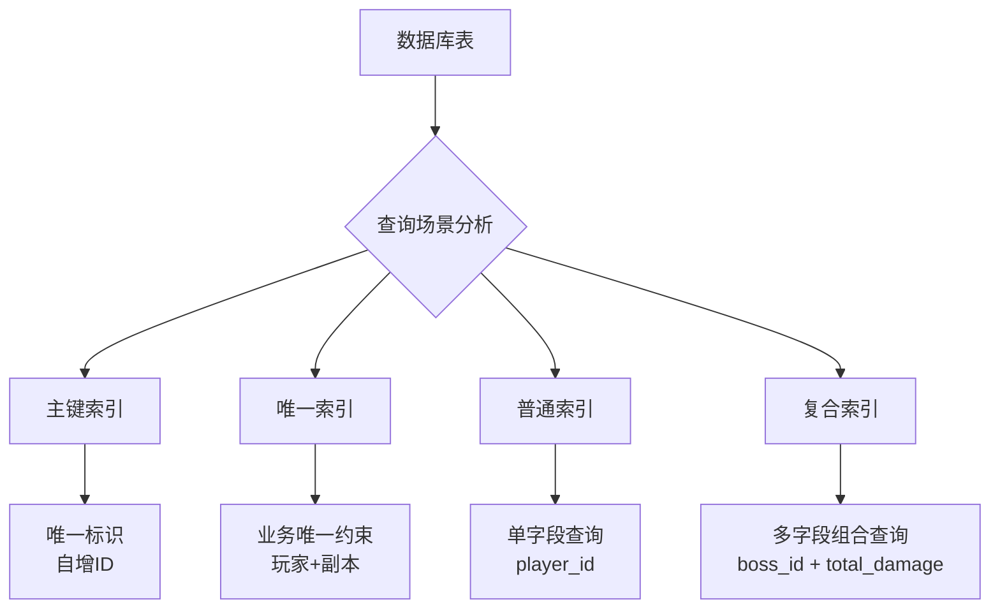
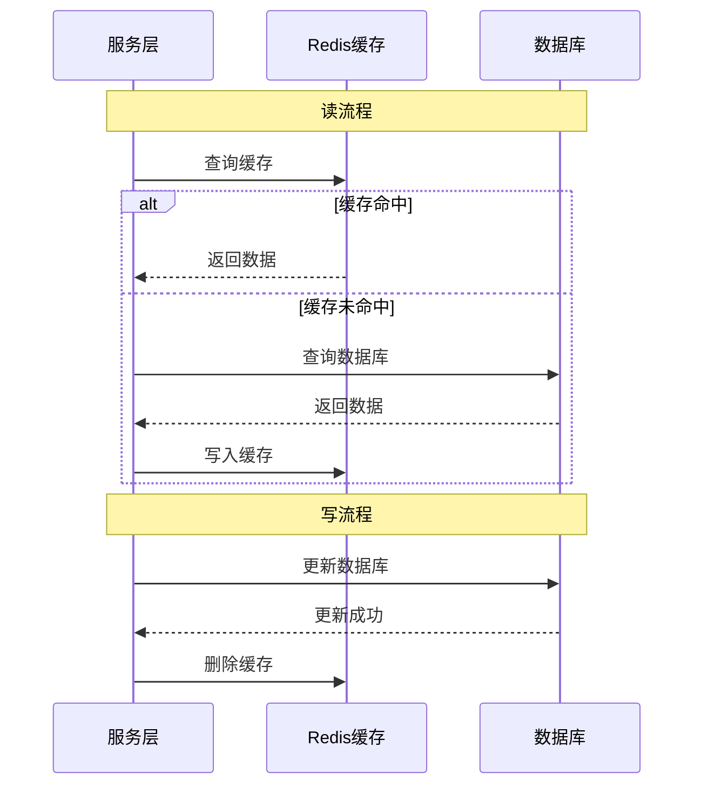

# 副本模块服务端开发文档

## 模块架构

```
GameServer/
├── module/
│   └── dungeon/
│       ├── MiddayDungeonService.java      # 午间副本服务
│       ├── EveningDungeonService.java     # 晚间副本服务
│       ├── GuildDungeonService.java       # 公会副本服务
│       ├── DungeonBaseService.java        # 副本基础服务
│       └── DungeonScheduledTask.java      # 副本定时任务
├── dao/
│   └── dungeon/
│       ├── MiddayDungeonDao.java          # 午间副本DAO
│       ├── EveningDungeonBossDao.java     # 晚间Boss DAO
│       ├── EveningDungeonDamageDao.java   # 晚间伤害DAO
│       └── GuildDungeonDao.java           # 公会副本DAO
└── entity/
    └── dungeon/
        ├── PlayerMiddayDungeon.java       # 玩家午间副本实体
        ├── EveningDungeonBoss.java        # 晚间Boss实体
        ├── EveningDungeonDamage.java      # 晚间伤害实体
        └── GuildDungeon.java              # 公会副本实体
```

---

## 一、数据库设计

### 1.1 午间副本表 (player_midday_dungeon)

```sql
CREATE TABLE `player_midday_dungeon` (
    `id` bigint(20) NOT NULL AUTO_INCREMENT COMMENT '主键',
    `player_id` bigint(20) NOT NULL COMMENT '玩家ID',
    `dungeon_id` int(11) NOT NULL COMMENT '副本ID',
    `attack_count` int(11) DEFAULT 0 COMMENT '今日攻击次数',
    `borrow_count` int(11) DEFAULT 0 COMMENT '今日借用次数',
    `box_draw_record` json COMMENT '宝箱领取记录',
    `last_reset_time` datetime COMMENT '最后重置时间',
    `create_time` datetime DEFAULT CURRENT_TIMESTAMP COMMENT '创建时间',
    `update_time` datetime DEFAULT CURRENT_TIMESTAMP ON UPDATE CURRENT_TIMESTAMP COMMENT '更新时间',
    PRIMARY KEY (`id`),
    UNIQUE KEY `uk_player_dungeon` (`player_id`, `dungeon_id`),
    KEY `idx_player_id` (`player_id`)
) ENGINE=InnoDB DEFAULT CHARSET=utf8mb4 COMMENT='玩家午间副本表';
```

### 1.2 晚间副本Boss表 (evening_dungeon_boss)

```sql
CREATE TABLE `evening_dungeon_boss` (
    `id` bigint(20) NOT NULL AUTO_INCREMENT COMMENT '主键',
    `boss_id` int(11) NOT NULL COMMENT 'Boss ID',
    `dungeon_id` int(11) NOT NULL COMMENT '副本ID',
    `boss_name` varchar(64) NOT NULL COMMENT 'Boss名称',
    `max_hp` bigint(20) NOT NULL COMMENT '最大血量',
    `current_hp` bigint(20) NOT NULL COMMENT '当前血量',
    `kill_player_id` bigint(20) DEFAULT 0 COMMENT '击杀玩家ID',
    `kill_player_name` varchar(64) DEFAULT '' COMMENT '击杀玩家名称',
    `state` tinyint(4) DEFAULT 0 COMMENT '状态：0存活，1死亡',
    `create_time` datetime DEFAULT CURRENT_TIMESTAMP COMMENT '创建时间',
    `update_time` datetime DEFAULT CURRENT_TIMESTAMP ON UPDATE CURRENT_TIMESTAMP COMMENT '更新时间',
    PRIMARY KEY (`id`),
    UNIQUE KEY `uk_boss` (`boss_id`, `create_time`),
    KEY `idx_dungeon` (`dungeon_id`)
) ENGINE=InnoDB DEFAULT CHARSET=utf8mb4 COMMENT='晚间副本Boss表';
```

### 1.3 晚间副本伤害表 (evening_dungeon_damage)

```sql
CREATE TABLE `evening_dungeon_damage` (
    `id` bigint(20) NOT NULL AUTO_INCREMENT COMMENT '主键',
    `player_id` bigint(20) NOT NULL COMMENT '玩家ID',
    `player_name` varchar(64) NOT NULL COMMENT '玩家名称',
    `boss_id` int(11) NOT NULL COMMENT 'Boss ID',
    `dungeon_id` int(11) NOT NULL COMMENT '副本ID',
    `total_damage` bigint(20) DEFAULT 0 COMMENT '总伤害',
    `attack_count` int(11) DEFAULT 0 COMMENT '攻击次数',
    `create_time` datetime DEFAULT CURRENT_TIMESTAMP COMMENT '创建时间',
    `update_time` datetime DEFAULT CURRENT_TIMESTAMP ON UPDATE CURRENT_TIMESTAMP COMMENT '更新时间',
    PRIMARY KEY (`id`),
    UNIQUE KEY `uk_player_boss` (`player_id`, `boss_id`),
    KEY `idx_boss_damage` (`boss_id`, `total_damage` DESC)
) ENGINE=InnoDB DEFAULT CHARSET=utf8mb4 COMMENT='晚间副本伤害表';
```

### 1.4 公会副本表 (guild_dungeon)

```sql
CREATE TABLE `guild_dungeon` (
    `id` bigint(20) NOT NULL AUTO_INCREMENT COMMENT '主键',
    `guild_id` bigint(20) NOT NULL COMMENT '公会ID',
    `dungeon_id` int(11) NOT NULL COMMENT '副本ID',
    `dungeon_lvl` int(11) DEFAULT 1 COMMENT '副本等级',
    `state` tinyint(4) DEFAULT 0 COMMENT '状态：0关闭，1开启，2结束',
    `auto_start` tinyint(4) DEFAULT 0 COMMENT '自动开始：0否，1是',
    `monster_list` json COMMENT '怪物列表',
    `start_time` datetime COMMENT '开始时间',
    `end_time` datetime COMMENT '结束时间',
    `create_time` datetime DEFAULT CURRENT_TIMESTAMP COMMENT '创建时间',
    `update_time` datetime DEFAULT CURRENT_TIMESTAMP ON UPDATE CURRENT_TIMESTAMP COMMENT '更新时间',
    PRIMARY KEY (`id`),
    UNIQUE KEY `uk_guild_dungeon` (`guild_id`, `dungeon_id`),
    KEY `idx_guild_id` (`guild_id`)
) ENGINE=InnoDB DEFAULT CHARSET=utf8mb4 COMMENT='公会副本表';
```

### 1.5 公会副本伤害排行表 (guild_dungeon_damage_rank)

```sql
CREATE TABLE `guild_dungeon_damage_rank` (
    `id` bigint(20) NOT NULL AUTO_INCREMENT COMMENT '主键',
    `guild_id` bigint(20) NOT NULL COMMENT '公会ID',
    `dungeon_id` int(11) NOT NULL COMMENT '副本ID',
    `player_id` bigint(20) NOT NULL COMMENT '玩家ID',
    `player_name` varchar(64) NOT NULL COMMENT '玩家名称',
    `total_damage` bigint(20) DEFAULT 0 COMMENT '总伤害',
    `kill_count` int(11) DEFAULT 0 COMMENT '击杀数',
    `create_time` datetime DEFAULT CURRENT_TIMESTAMP COMMENT '创建时间',
    `update_time` datetime DEFAULT CURRENT_TIMESTAMP ON UPDATE CURRENT_TIMESTAMP COMMENT '更新时间',
    PRIMARY KEY (`id`),
    UNIQUE KEY `uk_guild_player` (`guild_id`, `dungeon_id`, `player_id`),
    KEY `idx_guild_damage` (`guild_id`, `dungeon_id`, `total_damage` DESC)
) ENGINE=InnoDB DEFAULT CHARSET=utf8mb4 COMMENT='公会副本伤害排行表';
```

---

## 二、午间副本服务

### 2.1 MiddayDungeonService - 核心实现

```java
package com.game.server.module.dungeon;

import java.util.*;
import java.util.concurrent.TimeUnit;
import javax.annotation.Resource;
import org.springframework.stereotype.Service;
import org.springframework.transaction.annotation.Transactional;
import lombok.extern.slf4j.Slf4j;

/**
 * 午间副本服务
 */
@Slf4j
@Service
public class MiddayDungeonService extends DungeonBaseService {

    @Resource
    private MiddayDungeonDao middayDungeonDao;

    @Resource
    private PlayerService playerService;

    @Resource
    private ItemService itemService;

    @Resource
    private RedisTemplate<String, Object> redisTemplate;

    // Redis Key前缀
    private static final String REDIS_KEY_DUNGEON_STATE = "dungeon:midday:state:";
    private static final String REDIS_KEY_DUNGEON_END_TIME = "dungeon:midday:end_time:";

    /**
     * 午间副本攻击
     * @param playerId 玩家ID
     * @param dungeonId 副本ID
     * @return 攻击结果
     */
    @Transactional(rollbackFor = Exception.class)
    public AttackResult middayAttack(long playerId, int dungeonId) {
        // 1. 检查副本是否开启
        if (!isMiddayDungeonOpen(dungeonId)) {
            throw new BusinessException(ErrorCode.DUNGEON_NOT_OPEN, "副本未开启");
        }

        // 2. 获取副本配置
        RefMiddayDungeon dungeonRef = RefMiddayDungeon.getMgr().get(dungeonId);
        if (dungeonRef == null) {
            throw new BusinessException(ErrorCode.DUNGEON_NOT_EXIST, "副本不存在");
        }

        // 3. 获取玩家副本数据
        PlayerMiddayDungeon playerData = middayDungeonDao.selectByPlayerAndDungeon(playerId, dungeonId);
        if (playerData == null) {
            playerData = createPlayerMiddayDungeon(playerId, dungeonId);
        }

        // 4. 检查攻击次数
        int maxAttackCount = getMaxAttackCount(playerId, dungeonRef);
        if (playerData.getAttackCount() >= maxAttackCount) {
            throw new BusinessException(ErrorCode.DUNGEON_ATTACK_COUNT_EXCEEDED, "攻击次数已用完");
        }

        // 5. 检查体力
        PlayerInfo player = playerService.getPlayer(playerId);
        if (player.getEnergy() < dungeonRef.getEnergyCost()) {
            throw new BusinessException(ErrorCode.DUNGEON_ENERGY_NOT_ENOUGH, "体力不足");
        }

        // 6. 扣减体力
        playerService.costEnergy(playerId, dungeonRef.getEnergyCost());

        // 7. 执行攻击，计算奖励
        List<ItemInfo> rewards = calculateMiddayRewards(dungeonRef);

        // 8. 增加攻击次数
        playerData.setAttackCount(playerData.getAttackCount() + 1);
        playerData.setUpdateTime(new Date());
        middayDungeonDao.updateById(playerData);

        // 9. 发放奖励
        itemService.giveItems(playerId, rewards);

        // 10. 更新宝箱状态
        updateBoxState(playerId, dungeonId, playerData.getAttackCount());

        // 11. 构造返回结果
        AttackResult result = new AttackResult();
        result.setRewards(rewards);
        result.setAttackCount(playerData.getAttackCount());
        result.setEndTime(getDungeonEndTime(dungeonId));

        return result;
    }

    /**
     * 借用好友攻击
     * @param playerId 玩家ID
     * @param dungeonId 副本ID
     * @param friendId 好友ID
     * @param heroId 英雄ID
     * @return 攻击结果
     */
    @Transactional(rollbackFor = Exception.class)
    public AttackResult borrowAttack(long playerId, int dungeonId, long friendId, long heroId) {
        // 1. 检查副本是否开启
        if (!isMiddayDungeonOpen(dungeonId)) {
            throw new BusinessException(ErrorCode.DUNGEON_NOT_OPEN, "副本未开启");
        }

        // 2. 验证好友关系
        if (!friendService.isFriend(playerId, friendId)) {
            throw new BusinessException(ErrorCode.DUNGEON_FRIEND_NOT_EXIST, "好友不存在");
        }

        // 3. 获取玩家副本数据
        PlayerMiddayDungeon playerData = middayDungeonDao.selectByPlayerAndDungeon(playerId, dungeonId);
        if (playerData == null) {
            playerData = createPlayerMiddayDungeon(playerId, dungeonId);
        }

        // 4. 检查借用次数
        int maxBorrowCount = getDailyBorrowLimit();
        if (playerData.getBorrowCount() >= maxBorrowCount) {
            throw new BusinessException(ErrorCode.DUNGEON_BORROW_COUNT_EXCEEDED, "借用次数已用完");
        }

        // 5. 获取好友英雄
        HeroInfo hero = heroService.getHero(friendId, heroId);
        if (hero == null) {
            throw new BusinessException(ErrorCode.DUNGEON_HERO_NOT_AVAILABLE, "英雄不可用");
        }

        // 6. 计算借用攻击奖励（加成）
        RefMiddayDungeon dungeonRef = RefMiddayDungeon.getMgr().get(dungeonId);
        List<ItemInfo> rewards = calculateMiddayRewards(dungeonRef);
        // 借用加成：奖励增加20%
        rewards = applyBonus(rewards, 1.2f);

        // 7. 增加借用次数
        playerData.setBorrowCount(playerData.getBorrowCount() + 1);
        middayDungeonDao.updateById(playerData);

        // 8. 发放奖励
        itemService.giveItems(playerId, rewards);

        // 9. 记录借用日志
        logBorrowAttack(playerId, dungeonId, friendId, heroId);

        AttackResult result = new AttackResult();
        result.setRewards(rewards);
        result.setBorrowCount(playerData.getBorrowCount());
        return result;
    }

    /**
     * 领取宝箱
     * @param playerId 玩家ID
     * @param dungeonId 副本ID
     * @param boxId 宝箱ID
     * @return 奖励列表
     */
    @Transactional(rollbackFor = Exception.class)
    public List<ItemInfo> drawBox(long playerId, int dungeonId, int boxId) {
        // 1. 获取宝箱配置
        RefMiddayDungeonBox boxRef = RefMiddayDungeonBox.getMgr().get(boxId);
        if (boxRef == null) {
            throw new BusinessException(ErrorCode.DUNGEON_BOX_NOT_EXIST, "宝箱不存在");
        }

        // 2. 获取玩家数据
        PlayerMiddayDungeon playerData = middayDungeonDao.selectByPlayerAndDungeon(playerId, dungeonId);
        if (playerData == null) {
            throw new BusinessException(ErrorCode.DUNGEON_BOX_CONDITION_NOT_MET, "条件未满足");
        }

        // 3. 检查是否已领取
        Set<Integer> drawnBoxIds = parseBoxDrawRecord(playerData.getBoxDrawRecord());
        if (drawnBoxIds.contains(boxId)) {
            throw new BusinessException(ErrorCode.DUNGEON_BOX_ALREADY_DRAWN, "宝箱已领取");
        }

        // 4. 检查领取条件
        if (playerData.getAttackCount() < boxRef.getNeedAttackCount()) {
            throw new BusinessException(ErrorCode.DUNGEON_BOX_CONDITION_NOT_MET, "条件未满足");
        }

        // 5. 发放宝箱奖励
        List<ItemInfo> rewards = new ArrayList<>();
        for (NPCommonCostItem item : boxRef.getRewardList()) {
            rewards.add(new ItemInfo(item.getType(), item.getId(), item.getCount()));
        }
        itemService.giveItems(playerId, rewards);

        // 6. 更新领取记录
        drawnBoxIds.add(boxId);
        playerData.setBoxDrawRecord(JSON.toJSONString(drawnBoxIds));
        middayDungeonDao.updateById(playerData);

        return rewards;
    }

    /**
     * 检查副本是否开启
     */
    public boolean isMiddayDungeonOpen(int dungeonId) {
        // 从Redis获取状态
        Integer state = (Integer) redisTemplate.opsForValue().get(REDIS_KEY_DUNGEON_STATE + dungeonId);
        return state != null && state == EDungeonState.OPENING.getValue();
    }

    /**
     * 获取副本结束时间
     */
    public long getDungeonEndTime(int dungeonId) {
        Long endTime = (Long) redisTemplate.opsForValue().get(REDIS_KEY_DUNGEON_END_TIME + dungeonId);
        return endTime != null ? endTime : 0L;
    }

    /**
     * 计算午间副本奖励
     */
    private List<ItemInfo> calculateMiddayRewards(RefMiddayDungeon dungeonRef) {
        List<ItemInfo> rewards = new ArrayList<>();
        
        // 从奖励池随机
        List<RefMiddayDungeonReward> rewardPool = RefMiddayDungeonReward.getByDungeonId(dungeonRef.getDungeonId());
        for (RefMiddayDungeonReward rewardRef : rewardPool) {
            if (RandomUtil.randomFloat() < rewardRef.getDropRate()) {
                int count = RandomUtil.randomInt(rewardRef.getCountMin(), rewardRef.getCountMax() + 1);
                rewards.add(new ItemInfo(rewardRef.getItemId(), count));
            }
        }
        
        return rewards;
    }

    /**
     * 每日重置
     */
    @Transactional(rollbackFor = Exception.class)
    public void dailyReset() {
        log.info("开始午间副本每日重置");
        middayDungeonDao.resetDailyData();
        log.info("午间副本每日重置完成");
    }
}
```

---

## 三、晚间副本服务

### 3.1 EveningDungeonService - 核心实现

```java
package com.game.server.module.dungeon;

import java.util.*;
import java.util.concurrent.TimeUnit;
import javax.annotation.Resource;
import org.springframework.stereotype.Service;
import org.springframework.transaction.annotation.Transactional;
import lombok.extern.slf4j.Slf4j;
import redis.clients.jedis.Jedis;
import redis.clients.jedis.Transaction;

/**
 * 晚间副本服务
 */
@Slf4j
@Service
public class EveningDungeonService extends DungeonBaseService {

    @Resource
    private EveningDungeonBossDao bossDao;

    @Resource
    private EveningDungeonDamageDao damageDao;

    @Resource
    private PlayerService playerService;

    @Resource
    private ItemService itemService;

    @Resource
    private JedisPool jedisPool;

    // Redis Key前缀
    private static final String REDIS_KEY_BOSS_HP = "dungeon:evening:boss:hp:";
    private static final String REDIS_KEY_BOSS_STATE = "dungeon:evening:boss:state:";
    private static final String REDIS_KEY_DAMAGE_RANK = "dungeon:evening:damage_rank:";

    /**
     * 晚间副本攻击
     * @param playerId 玩家ID
     * @param bossId Boss ID
     * @return 攻击结果
     */
    @Transactional(rollbackFor = Exception.class)
    public AttackResult eveningAttack(long playerId, int bossId) {
        // 1. 检查副本是否开启
        if (!isEveningDungeonOpen(bossId)) {
            throw new BusinessException(ErrorCode.DUNGEON_NOT_OPEN, "副本未开启");
        }

        // 2. 获取Boss信息
        EveningDungeonBoss boss = bossDao.selectById(bossId);
        if (boss == null) {
            throw new BusinessException(ErrorCode.DUNGEON_BOSS_NOT_EXIST, "Boss不存在");
        }

        // 3. 检查Boss是否存活
        if (boss.getState() == 1) {
            throw new BusinessException(ErrorCode.DUNGEON_BOSS_ALREADY_DEAD, "Boss已死亡");
        }

        // 4. 获取玩家信息
        PlayerInfo player = playerService.getPlayer(playerId);

        // 5. 计算伤害
        long damage = calculateDamage(player);

        // 6. 使用Redis原子操作扣减Boss血量
        boolean isKill = false;
        try (Jedis jedis = jedisPool.getResource()) {
            String hpKey = REDIS_KEY_BOSS_HP + bossId;
            
            // 监听Boss血量
            jedis.watch(hpKey);
            String hpStr = jedis.get(hpKey);
            long currentHp = hpStr != null ? Long.parseLong(hpStr) : boss.getCurrentHp();
            
            if (currentHp <= 0) {
                jedis.unwatch();
                throw new BusinessException(ErrorCode.DUNGEON_BOSS_ALREADY_DEAD, "Boss已死亡");
            }
            
            // 开启事务
            Transaction tx = jedis.multi();
            long newHp = Math.max(0, currentHp - damage);
            tx.set(hpKey, String.valueOf(newHp));
            
            if (tx.exec() != null) {
                // 更新成功
                if (newHp <= 0) {
                    isKill = true;
                    // 记录击杀
                    boss.setKillPlayerId(playerId);
                    boss.setKillPlayerName(player.getPlayerName());
                    boss.setState(1);
                }
                boss.setCurrentHp(newHp);
            }
        }

        // 7. 更新数据库
        bossDao.updateById(boss);

        // 8. 更新玩家伤害
        updatePlayerDamage(playerId, player.getPlayerName(), bossId, damage);

        // 9. 如果击杀，发放击杀奖励
        List<ItemInfo> rewards = new ArrayList<>();
        if (isKill) {
            rewards = giveKillReward(playerId, boss);
            // 推送Boss死亡通知
            pushBossDeath(bossId, playerId, player.getPlayerName());
        }

        // 10. 构造返回结果
        AttackResult result = new AttackResult();
        result.setDamage(damage);
        result.setKill(isKill);
        result.setRewards(rewards);
        result.setMyRank(getPlayerRank(bossId, playerId));

        return result;
    }

    /**
     * 获取Boss信息
     * @param bossId Boss ID
     * @return Boss信息
     */
    public EveningDungeonBoss getBossInfo(int bossId) {
        EveningDungeonBoss boss = bossDao.selectById(bossId);
        if (boss == null) {
            return null;
        }

        // 从Redis获取实时血量
        try (Jedis jedis = jedisPool.getResource()) {
            String hpStr = jedis.get(REDIS_KEY_BOSS_HP + bossId);
            if (hpStr != null) {
                boss.setCurrentHp(Long.parseLong(hpStr));
            }
            
            String stateStr = jedis.get(REDIS_KEY_BOSS_STATE + bossId);
            if (stateStr != null) {
                boss.setState(Integer.parseInt(stateStr));
            }
        }

        return boss;
    }

    /**
     * 获取伤害排行榜
     * @param bossId Boss ID
     * @param limit 限制数量
     * @return 排行榜
     */
    public List<EveningDungeonDamage> getDamageRankList(int bossId, int limit) {
        List<EveningDungeonDamage> rankList = damageDao.selectRankByBossId(bossId, limit);
        return rankList;
    }

    /**
     * 计算伤害
     */
    private long calculateDamage(PlayerInfo player) {
        // 基础伤害 = 攻击力 × 倍率
        long baseDamage = player.getAtk() * 10L;
        
        // 加入随机因素
        float randomFactor = 0.8f + RandomUtil.randomFloat() * 0.4f; // 0.8 ~ 1.2
        
        // 暴击判定
        boolean isCrit = RandomUtil.randomFloat() < player.getCritRate();
        float critFactor = isCrit ? 1.5f : 1.0f;
        
        long damage = (long) (baseDamage * randomFactor * critFactor);
        
        return Math.max(1, damage);
    }

    /**
     * 更新玩家伤害
     */
    private void updatePlayerDamage(long playerId, String playerName, int bossId, long damage) {
        // 更新数据库
        damageDao.updateOrInsertDamage(playerId, playerName, bossId, damage);
        
        // 更新Redis排行
        try (Jedis jedis = jedisPool.getResource()) {
            String rankKey = REDIS_KEY_DAMAGE_RANK + bossId;
            jedis.zincrby(rankKey, damage, String.valueOf(playerId));
        }
    }

    /**
     * 获取玩家排名
     */
    private int getPlayerRank(int bossId, long playerId) {
        try (Jedis jedis = jedisPool.getResource()) {
            String rankKey = REDIS_KEY_DAMAGE_RANK + bossId;
            Long rank = jedis.zrevrank(rankKey, String.valueOf(playerId));
            return rank != null ? rank.intValue() + 1 : 0;
        }
    }

    /**
     * 发放击杀奖励
     */
    private List<ItemInfo> giveKillReward(long playerId, EveningDungeonBoss boss) {
        RefEveningDungeonBoss bossRef = RefEveningDungeonBoss.getMgr().get(boss.getBossId());
        if (bossRef == null) return new ArrayList<>();
        
        List<ItemInfo> rewards = new ArrayList<>();
        for (NPCommonCostItem item : bossRef.getRewardList()) {
            rewards.add(new ItemInfo(item.getType(), item.getId(), item.getCount()));
        }
        itemService.giveItems(playerId, rewards);
        
        return rewards;
    }

    /**
     * 创建晚间Boss
     */
    @Transactional(rollbackFor = Exception.class)
    public void createEveningBoss() {
        log.info("开始创建晚间副本Boss");
        
        // 获取当天配置
        List<RefEveningDungeon> dungeonList = RefEveningDungeon.getAll();
        for (RefEveningDungeon dungeonRef : dungeonList) {
            EveningDungeonBoss boss = new EveningDungeonBoss();
            boss.setBossId(dungeonRef.getBossId());
            boss.setDungeonId(dungeonRef.getDungeonId());
            
            RefEveningDungeonBoss bossRef = RefEveningDungeonBoss.getMgr().get(dungeonRef.getBossId());
            boss.setBossName(bossRef.getBossName());
            boss.setMaxHp(bossRef.getHp());
            boss.setCurrentHp(bossRef.getHp());
            boss.setState(0);
            boss.setCreateTime(new Date());
            
            bossDao.insert(boss);
            
            // 初始化Redis缓存
            try (Jedis jedis = jedisPool.getResource()) {
                jedis.set(REDIS_KEY_BOSS_HP + boss.getBossId(), String.valueOf(bossRef.getHp()));
                jedis.set(REDIS_KEY_BOSS_STATE + boss.getBossId(), "0");
            }
        }
        
        log.info("晚间副本Boss创建完成");
    }

    /**
     * 结算晚间副本
     */
    @Transactional(rollbackFor = Exception.class)
    public void settleEveningDungeon() {
        log.info("开始结算晚间副本");
        
        List<EveningDungeonBoss> bossList = bossDao.selectAllAlive();
        for (EveningDungeonBoss boss : bossList) {
            // 标记Boss死亡
            boss.setState(1);
            bossDao.updateById(boss);
            
            // 发放排行奖励
            giveRankRewards(boss.getBossId());
            
            // 清理Redis缓存
            try (Jedis jedis = jedisPool.getResource()) {
                jedis.del(REDIS_KEY_BOSS_HP + boss.getBossId());
                jedis.del(REDIS_KEY_BOSS_STATE + boss.getBossId());
                jedis.del(REDIS_KEY_DAMAGE_RANK + boss.getBossId());
            }
        }
        
        log.info("晚间副本结算完成");
    }

    /**
     * 发放排行奖励
     */
    private void giveRankRewards(int bossId) {
        List<RefEveningDungeonRankReward> rewards = RefEveningDungeonRankReward.getAll();
        for (RefEveningDungeonRankReward reward : rewards) {
            List<EveningDungeonDamage> rankList = damageDao.selectRankByBossId(bossId, reward.getRankMax());
            
            for (EveningDungeonDamage damage : rankList) {
                int rank = damage.getRank();
                if (rank >= reward.getRankMin() && rank <= reward.getRankMax()) {
                    // 发送邮件奖励
                    mailService.sendMail(
                        damage.getPlayerId(),
                        "晚间副本排行奖励",
                        String.format("恭喜您在第%d名，获得排行奖励！", rank),
                        reward.getRewardList()
                    );
                }
            }
        }
    }
}
```

---

## 四、公会副本服务

### 4.1 GuildDungeonService - 核心实现

```java
package com.game.server.module.dungeon;

import java.util.*;
import javax.annotation.Resource;
import org.springframework.stereotype.Service;
import org.springframework.transaction.annotation.Transactional;
import lombok.extern.slf4j.Slf4j;

/**
 * 公会副本服务
 */
@Slf4j
@Service
public class GuildDungeonService extends DungeonBaseService {

    @Resource
    private GuildDungeonDao guildDungeonDao;

    @Resource
    private GuildDungeonDamageRankDao damageRankDao;

    @Resource
    private GuildService guildService;

    @Resource
    private PlayerService playerService;

    @Resource
    private ItemService itemService;

    /**
     * 开启公会副本
     * @param playerId 玩家ID
     * @param guildId 公会ID
     * @param dungeonId 副本ID
     * @return 副本信息
     */
    @Transactional(rollbackFor = Exception.class)
    public GuildDungeon startDungeon(long playerId, long guildId, int dungeonId) {
        // 1. 验证权限
        if (!guildService.hasPermission(playerId, guildId, GuildPermission.START_DUNGEON)) {
            throw new BusinessException(ErrorCode.DUNGEON_NO_PERMISSION, "无权限操作");
        }

        // 2. 获取副本配置
        RefGuildDungeon dungeonRef = RefGuildDungeon.getMgr().get(dungeonId);
        if (dungeonRef == null) {
            throw new BusinessException(ErrorCode.DUNGEON_NOT_EXIST, "副本不存在");
        }

        // 3. 检查公会等级
        GuildInfo guild = guildService.getGuild(guildId);
        if (guild.getLevel() < dungeonRef.getGuildLevel()) {
            throw new BusinessException(ErrorCode.DUNGEON_GUILD_LEVEL_NOT_ENOUGH, "公会等级不足");
        }

        // 4. 检查开放日期
        if (!isDungeonOpenToday(dungeonRef)) {
            throw new BusinessException(ErrorCode.DUNGEON_NOT_OPEN, "今日不可开启");
        }

        // 5. 检查是否已开启
        GuildDungeon existDungeon = guildDungeonDao.selectByGuildAndDungeon(guildId, dungeonId);
        if (existDungeon != null && existDungeon.getState() == EDungeonState.OPENING.getValue()) {
            throw new BusinessException(ErrorCode.DUNGEON_ALREADY_OPEN, "副本已开启");
        }

        // 6. 创建副本实例
        GuildDungeon dungeon = new GuildDungeon();
        dungeon.setGuildId(guildId);
        dungeon.setDungeonId(dungeonId);
        dungeon.setDungeonLvl(existDungeon != null ? existDungeon.getDungeonLvl() : 1);
        dungeon.setState(EDungeonState.OPENING.getValue());
        dungeon.setAutoStart(dungeonRef.isAutoStart());
        dungeon.setStartTime(new Date());
        dungeon.setEndTime(calculateEndTime(dungeonRef));

        // 7. 初始化怪物列表
        List<MonsterInfo> monsterList = initMonsterList(dungeon);
        dungeon.setMonsterList(JSON.toJSONString(monsterList));

        guildDungeonDao.insertOrUpdate(dungeon);

        // 8. 推送通知
        pushDungeonStart(guildId, dungeonId);

        log.info("公会副本开启: guildId={}, dungeonId={}", guildId, dungeonId);

        return dungeon;
    }

    /**
     * 攻击公会副本
     * @param playerId 玩家ID
     * @param guildId 公会ID
     * @param dungeonId 副本ID
     * @param monsterId 怪物ID
     * @return 攻击结果
     */
    @Transactional(rollbackFor = Exception.class)
    public AttackResult attackDungeon(long playerId, long guildId, int dungeonId, int monsterId) {
        // 1. 验证公会成员
        if (!guildService.isMember(playerId, guildId)) {
            throw new BusinessException(ErrorCode.NOT_GUILD_MEMBER, "非公会成员");
        }

        // 2. 获取副本实例
        GuildDungeon dungeon = guildDungeonDao.selectByGuildAndDungeon(guildId, dungeonId);
        if (dungeon == null || dungeon.getState() != EDungeonState.OPENING.getValue()) {
            throw new BusinessException(ErrorCode.DUNGEON_NOT_OPEN, "副本未开启");
        }

        // 3. 获取怪物列表
        List<MonsterInfo> monsterList = JSON.parseArray(dungeon.getMonsterList(), MonsterInfo.class);
        MonsterInfo monster = findMonster(monsterList, monsterId);
        if (monster == null || monster.getState() == EMonsterState.DEAD.getValue()) {
            throw new BusinessException(ErrorCode.DUNGEON_MONSTER_ALREADY_DEAD, "怪物已死亡");
        }

        // 4. 获取玩家信息
        PlayerInfo player = playerService.getPlayer(playerId);

        // 5. 计算伤害
        long damage = calculateGuildDungeonDamage(player, dungeon.getDungeonLvl());

        // 6. 更新怪物血量
        monster.setCurrentHp(Math.max(0, monster.getCurrentHp() - damage));
        if (monster.getCurrentHp() <= 0) {
            monster.setState(EMonsterState.DEAD.getValue());
        }

        dungeon.setMonsterList(JSON.toJSONString(monsterList));
        guildDungeonDao.updateById(dungeon);

        // 7. 更新伤害排行
        updateGuildDamageRank(guildId, dungeonId, playerId, player.getPlayerName(), damage, monster.getCurrentHp() <= 0);

        // 8. 检查副本是否通关
        boolean isCleared = checkDungeonCleared(monsterList);

        // 9. 如果击杀怪物，发放奖励
        List<ItemInfo> rewards = new ArrayList<>();
        if (monster.getCurrentHp() <= 0) {
            rewards = giveMonsterKillReward(playerId, guildId, monster);
            pushMonsterKill(guildId, dungeonId, monsterId, playerId);
        }

        // 10. 如果副本通关
        if (isCleared) {
            onDungeonCleared(guildId, dungeonId);
        }

        // 11. 构造返回结果
        AttackResult result = new AttackResult();
        result.setDamage(damage);
        result.setKill(monster.getCurrentHp() <= 0);
        result.setRewards(rewards);
        result.setMonsterCurrentHp(monster.getCurrentHp());
        result.setDungeonCleared(isCleared);

        return result;
    }

    /**
     * 升级副本等级
     * @param playerId 玩家ID
     * @param guildId 公会ID
     * @param dungeonId 副本ID
     * @return 新等级
     */
    @Transactional(rollbackFor = Exception.class)
    public int upgradeDungeonLvl(long playerId, long guildId, int dungeonId) {
        // 1. 验证权限
        if (!guildService.hasPermission(playerId, guildId, GuildPermission.UPGRADE_DUNGEON)) {
            throw new BusinessException(ErrorCode.DUNGEON_NO_PERMISSION, "无权限操作");
        }

        // 2. 获取副本
        GuildDungeon dungeon = guildDungeonDao.selectByGuildAndDungeon(guildId, dungeonId);
        if (dungeon == null) {
            throw new BusinessException(ErrorCode.DUNGEON_NOT_EXIST, "副本不存在");
        }

        // 3. 检查等级上限
        RefGuildDungeon dungeonRef = RefGuildDungeon.getMgr().get(dungeonId);
        if (dungeon.getDungeonLvl() >= dungeonRef.getMaxLevel()) {
            throw new BusinessException(ErrorCode.DUNGEON_LEVEL_MAX, "等级已达上限");
        }

        // 4. 获取升级消耗
        RefGuildDungeonLevel levelRef = RefGuildDungeonLevel.getByDungeonAndLevel(dungeonId, dungeon.getDungeonLvl() + 1);
        if (levelRef == null) {
            throw new BusinessException(ErrorCode.DUNGEON_LEVEL_MAX, "等级已达上限");
        }

        // 5. 扣除公会资金
        guildService.costGuildFunds(guildId, levelRef.getUpgradeCost());

        // 6. 更新等级
        dungeon.setDungeonLvl(dungeon.getDungeonLvl() + 1);
        guildDungeonDao.updateById(dungeon);

        log.info("公会副本升级: guildId={}, dungeonId={}, newLevel={}", guildId, dungeonId, dungeon.getDungeonLvl());

        return dungeon.getDungeonLvl();
    }

    /**
     * 初始化怪物列表
     */
    private List<MonsterInfo> initMonsterList(GuildDungeon dungeon) {
        List<MonsterInfo> monsterList = new ArrayList<>();
        
        RefGuildDungeon dungeonRef = RefGuildDungeon.getMgr().get(dungeon.getDungeonId());
        RefGuildDungeonLevel levelRef = RefGuildDungeonLevel.getByDungeonAndLevel(
            dungeon.getDungeonId(), dungeon.getDungeonLvl());
        
        for (int monsterId : dungeonRef.getMonsterList()) {
            RefGuildDungeonMonster monsterRef = RefGuildDungeonMonster.getMgr().get(monsterId);
            if (monsterRef != null) {
                MonsterInfo monster = new MonsterInfo();
                monster.setMonsterId(monsterId);
                monster.setMonsterName(monsterRef.getMonsterName());
                monster.setMaxHp((long) (monsterRef.getHp() * levelRef.getHpMultiplier()));
                monster.setCurrentHp(monster.getMaxHp());
                monster.setState(EMonsterState.ALIVE.getValue());
                monster.setTagged(false);
                monsterList.add(monster);
            }
        }
        
        return monsterList;
    }

    /**
     * 计算公会副本伤害
     */
    private long calculateGuildDungeonDamage(PlayerInfo player, int dungeonLevel) {
        // 基础伤害
        long baseDamage = player.getAtk() * 10L;
        
        // 副本等级加成
        float levelFactor = 1.0f + (dungeonLevel - 1) * 0.1f;
        
        // 随机因素
        float randomFactor = 0.8f + RandomUtil.randomFloat() * 0.4f;
        
        return (long) (baseDamage * levelFactor * randomFactor);
    }

    /**
     * 更新伤害排行
     */
    private void updateGuildDamageRank(long guildId, int dungeonId, long playerId, 
            String playerName, long damage, boolean isKill) {
        GuildDungeonDamageRank rank = damageRankDao.selectByGuildDungeonPlayer(guildId, dungeonId, playerId);
        
        if (rank == null) {
            rank = new GuildDungeonDamageRank();
            rank.setGuildId(guildId);
            rank.setDungeonId(dungeonId);
            rank.setPlayerId(playerId);
            rank.setPlayerName(playerName);
            rank.setTotalDamage(damage);
            rank.setKillCount(isKill ? 1 : 0);
            damageRankDao.insert(rank);
        } else {
            rank.setTotalDamage(rank.getTotalDamage() + damage);
            if (isKill) {
                rank.setKillCount(rank.getKillCount() + 1);
            }
            damageRankDao.updateById(rank);
        }
    }

    /**
     * 检查副本是否通关
     */
    private boolean checkDungeonCleared(List<MonsterInfo> monsterList) {
        return monsterList.stream().allMatch(m -> m.getState() == EMonsterState.DEAD.getValue());
    }

    /**
     * 副本通关处理
     */
    private void onDungeonCleared(long guildId, int dungeonId) {
        log.info("公会副本通关: guildId={}, dungeonId={}", guildId, dungeonId);
        
        // 更新副本状态
        GuildDungeon dungeon = guildDungeonDao.selectByGuildAndDungeon(guildId, dungeonId);
        dungeon.setState(EDungeonState.ENDED.getValue());
        guildDungeonDao.updateById(dungeon);
        
        // 发放通关奖励给公会
        giveDungeonClearReward(guildId, dungeonId);
        
        // 推送通关通知
        pushDungeonCleared(guildId, dungeonId);
    }

    /**
     * 发放怪物击杀奖励
     */
    private List<ItemInfo> giveMonsterKillReward(long playerId, long guildId, MonsterInfo monster) {
        RefGuildDungeonMonster monsterRef = RefGuildDungeonMonster.getMgr().get(monster.getMonsterId());
        if (monsterRef == null) return new ArrayList<>();
        
        List<ItemInfo> rewards = new ArrayList<>();
        for (NPCommonCostItem item : monsterRef.getRewardList()) {
            rewards.add(new ItemInfo(item.getType(), item.getId(), item.getCount()));
        }
        itemService.giveItems(playerId, rewards);
        
        return rewards;
    }

    /**
     * 获取伤害排行榜
     */
    public List<GuildDungeonDamageRank> getDamageRank(long guildId, int dungeonId) {
        return damageRankDao.selectRankByGuildDungeon(guildId, dungeonId);
    }
}
```

---

## 五、定时任务

### 5.1 DungeonScheduledTask - 定时任务实现

```java
package com.game.server.module.dungeon;

import javax.annotation.Resource;
import org.springframework.scheduling.annotation.Scheduled;
import org.springframework.stereotype.Component;
import lombok.extern.slf4j.Slf4j;

/**
 * 副本定时任务
 */
@Slf4j
@Component
public class DungeonScheduledTask {

    @Resource
    private MiddayDungeonService middayDungeonService;

    @Resource
    private EveningDungeonService eveningDungeonService;

    @Resource
    private GuildDungeonService guildDungeonService;

    /**
     * 午间副本开启 - 每天12:00
     */
    @Scheduled(cron = "0 0 12 * * ?")
    public void openMiddayDungeon() {
        log.info("定时任务：开启午间副本");
        middayDungeonService.openDungeon();
        // 广播副本开启
        broadcastDungeonOpen(EDungeonType.MIDDAY);
    }

    /**
     * 午间副本关闭 - 每天14:00
     */
    @Scheduled(cron = "0 0 14 * * ?")
    public void closeMiddayDungeon() {
        log.info("定时任务：关闭午间副本");
        middayDungeonService.closeDungeon();
        broadcastDungeonClose(EDungeonType.MIDDAY);
    }

    /**
     * 晚间副本开启 - 每天20:00
     */
    @Scheduled(cron = "0 0 20 * * ?")
    public void openEveningDungeon() {
        log.info("定时任务：开启晚间副本");
        // 创建Boss
        eveningDungeonService.createEveningBoss();
        // 开启副本
        eveningDungeonService.openDungeon();
        // 广播副本开启
        broadcastDungeonOpen(EDungeonType.EVENING);
    }

    /**
     * 晚间副本关闭 - 每天22:00
     */
    @Scheduled(cron = "0 0 22 * * ?")
    public void closeEveningDungeon() {
        log.info("定时任务：关闭晚间副本");
        // 结算副本
        eveningDungeonService.settleEveningDungeon();
        // 关闭副本
        eveningDungeonService.closeDungeon();
        // 广播副本关闭
        broadcastDungeonClose(EDungeonType.EVENING);
    }

    /**
     * 每日重置 - 每天0点
     */
    @Scheduled(cron = "0 0 0 * * ?")
    public void dailyReset() {
        log.info("定时任务：副本每日重置");
        
        // 重置午间副本攻击次数
        middayDungeonService.dailyReset();
        
        // 重置晚间副本伤害数据
        eveningDungeonService.dailyReset();
        
        // 重置公会副本
        guildDungeonService.dailyReset();
    }

    /**
     * 公会副本自动开启检查 - 每小时
     */
    @Scheduled(cron = "0 0 * * * ?")
    public void checkGuildDungeonAutoStart() {
        log.info("定时任务：检查公会副本自动开启");
        guildDungeonService.checkAndAutoStart();
    }

    /**
     * 广播副本开启
     */
    private void broadcastDungeonOpen(EDungeonType type) {
        // 发送全服广播
        String message = getOpenMessage(type);
        chatService.broadcastSystemMessage(message);
    }

    /**
     * 广播副本关闭
     */
    private void broadcastDungeonClose(EDungeonType type) {
        String message = getCloseMessage(type);
        chatService.broadcastSystemMessage(message);
    }

    private String getOpenMessage(EDungeonType type) {
        switch (type) {
            case MIDDAY: return "午间副本已开启，快来挑战吧！";
            case EVENING: return "晚间副本已开启，世界Boss降临！";
            default: return "";
        }
    }

    private String getCloseMessage(EDungeonType type) {
        switch (type) {
            case MIDDAY: return "午间副本已结束，明天再来吧！";
            case EVENING: return "晚间副本已结束，明天再来吧！";
            default: return "";
        }
    }
}
```

---

## 六、性能优化

### 6.1 缓存策略

```java
/**
 * Redis缓存Key设计
 */
public class DungeonCacheKeys {
    // 午间副本状态（按副本ID）
    public static final String MIDDAY_STATE = "dungeon:midday:state:";
    public static final String MIDDAY_END_TIME = "dungeon:midday:end_time:";
    
    // 晚间Boss血量（按Boss ID）
    public static final String EVENING_BOSS_HP = "dungeon:evening:boss:hp:";
    public static final String EVENING_BOSS_STATE = "dungeon:evening:boss:state:";
    
    // 晚间伤害排行（按Boss ID，使用ZSet）
    public static final String EVENING_DAMAGE_RANK = "dungeon:evening:damage_rank:";
    
    // 公会副本信息（按公会ID+副本ID）
    public static final String GUILD_DUNGEON = "dungeon:guild:info:";
    
    // 公会副本怪物列表（按公会ID+副本ID）
    public static final String GUILD_MONSTER_LIST = "dungeon:guild:monster:";
}

/**
 * 缓存过期时间设置
 */
public class DungeonCacheExpire {
    // 副本状态：2小时
    public static final int STATE_EXPIRE = 7200;
    
    // Boss血量：4小时
    public static final int BOSS_HP_EXPIRE = 14400;
    
    // 排行榜：4小时
    public static final int RANK_EXPIRE = 14400;
}
```

### 6.2 并发控制

```java
/**
 * Boss血量原子操作示例
 */
public long atomicDecrementBossHp(int bossId, long damage) {
    try (Jedis jedis = jedisPool.getResource()) {
        String key = DungeonCacheKeys.EVENING_BOSS_HP + bossId;
        
        // 使用Lua脚本保证原子性
        String script = 
            "local current = tonumber(redis.call('GET', KEYS[1])) " +
            "if current and current > 0 then " +
            "    local newHp = math.max(0, current - tonumber(ARGV[1])) " +
            "    redis.call('SET', KEYS[1], newHp) " +
            "    return newHp " +
            "end " +
            "return -1";
        
        Object result = jedis.eval(script, 
            Collections.singletonList(key), 
            Collections.singletonList(String.valueOf(damage)));
        
        return result != null ? ((Long) result) : -1;
    }
}
```

---

## 七、服务架构图

### 7.1 服务层架构



### 7.2 服务依赖关系



---

## 八、数据库索引详解

### 8.1 索引设计原则



### 8.2 完整索引配置

#### player_midday_dungeon 表索引

```sql
-- 主键索引
PRIMARY KEY (`id`)

-- 唯一索引：保证玩家在同一副本中只有一条记录
UNIQUE KEY `uk_player_dungeon` (`player_id`, `dungeon_id`)

-- 普通索引：按玩家ID查询
KEY `idx_player_id` (`player_id`)

-- 普通索引：按副本ID统计
KEY `idx_dungeon_id` (`dungeon_id`)

-- 联合索引：按玩家和重置时间查询（用于每日重置）
KEY `idx_player_reset` (`player_id`, `last_reset_time`)
```

#### evening_dungeon_boss 表索引

```sql
-- 主键索引
PRIMARY KEY (`id`)

-- 唯一索引：保证每个Boss每天只有一条记录
UNIQUE KEY `uk_boss_date` (`boss_id`, `dungeon_id`, DATE(`create_time`))

-- 普通索引：按副本ID查询
KEY `idx_dungeon` (`dungeon_id`)

-- 普通索引：按状态查询存活的Boss
KEY `idx_state` (`state`)

-- 联合索引：查询存活的Boss
KEY `idx_dungeon_state` (`dungeon_id`, `state`)
```

#### evening_dungeon_damage 表索引

```sql
-- 主键索引
PRIMARY KEY (`id`)

-- 唯一索引：保证玩家对每个Boss只有一条伤害记录
UNIQUE KEY `uk_player_boss` (`player_id`, `boss_id`)

-- 联合索引：按Boss查询排行榜（伤害倒序）
KEY `idx_boss_damage` (`boss_id`, `total_damage` DESC)

-- 联合索引：按副本和Boss查询
KEY `idx_dungeon_boss` (`dungeon_id`, `boss_id`)

-- 普通索引：按玩家查询
KEY `idx_player_id` (`player_id`)
```

#### guild_dungeon 表索引

```sql
-- 主键索引
PRIMARY KEY (`id`)

-- 唯一索引：保证每个公会每个副本只有一条记录
UNIQUE KEY `uk_guild_dungeon` (`guild_id`, `dungeon_id`)

-- 普通索引：按公会查询
KEY `idx_guild_id` (`guild_id`)

-- 联合索引：按公会和状态查询
KEY `idx_guild_state` (`guild_id`, `state`)

-- 联合索引：自动开启检查
KEY `idx_auto_start` (`auto_start`, `start_time`)
```

#### guild_dungeon_damage_rank 表索引

```sql
-- 主键索引
PRIMARY KEY (`id`)

-- 唯一索引：保证每个玩家在每个副本中只有一条记录
UNIQUE KEY `uk_guild_player` (`guild_id`, `dungeon_id`, `player_id`)

-- 联合索引：按公会和副本查询排行榜
KEY `idx_guild_damage` (`guild_id`, `dungeon_id`, `total_damage` DESC)

-- 联合索引：按击杀数排序
KEY `idx_guild_kill` (`guild_id`, `dungeon_id`, `kill_count` DESC)
```

---

## 九、Redis缓存设计

### 9.1 缓存Key设计规范

```java
/**
 * Redis Key 设计规范
 */
public class DungeonRedisKeys {
    // Key格式: 业务模块:子模块:标识:ID

    // ========== 午间副本 ==========
    /** 副本状态: dungeon:midday:state:{dungeonId} */
    public static final String MIDDAY_STATE = "dungeon:midday:state:";
    /** 副本结束时间: dungeon:midday:end_time:{dungeonId} */
    public static final String MIDDAY_END_TIME = "dungeon:midday:end_time:";
    /** 玩家副本数据: dungeon:midday:player:{playerId}:{dungeonId} */
    public static final String MIDDAY_PLAYER = "dungeon:midday:player:";

    // ========== 晚间副本 ==========
    /** Boss血量: dungeon:evening:boss:hp:{bossId} */
    public static final String EVENING_BOSS_HP = "dungeon:evening:boss:hp:";
    /** Boss状态: dungeon:evening:boss:state:{bossId} */
    public static final String EVENING_BOSS_STATE = "dungeon:evening:boss:state:";
    /** 伤害排行(ZSet): dungeon:evening:damage_rank:{bossId} */
    public static final String EVENING_DAMAGE_RANK = "dungeon:evening:damage_rank:";
    /** 玩家伤害: dungeon:evening:player_damage:{bossId}:{playerId} */
    public static final String EVENING_PLAYER_DAMAGE = "dungeon:evening:player_damage:";

    // ========== 公会副本 ==========
    /** 副本信息: dungeon:guild:info:{guildId}:{dungeonId} */
    public static final String GUILD_DUNGEON_INFO = "dungeon:guild:info:";
    /** 怪物列表: dungeon:guild:monsters:{guildId}:{dungeonId} */
    public static final String GUILD_MONSTERS = "dungeon:guild:monsters:";
    /** 伤害排行(ZSet): dungeon:guild:damage_rank:{guildId}:{dungeonId} */
    public static final String GUILD_DAMAGE_RANK = "dungeon:guild:damage_rank:";
}
```

### 9.2 缓存过期策略

| 缓存类型 | Key前缀 | 过期时间 | 更新策略 |
|----------|---------|----------|----------|
| 副本状态 | dungeon:midday:state: | 4小时 | 定时任务更新 |
| Boss血量 | dungeon:evening:boss:hp: | 4小时 | 实时更新 |
| 伤害排行 | dungeon:evening:damage_rank: | 4小时 | 实时更新 |
| 玩家数据 | dungeon:midday:player: | 1天 | 写穿透 |
| 公会副本 | dungeon:guild:info: | 4小时 | 事件更新 |

### 9.3 缓存更新流程



---

## 十、实体类完整定义

### 10.1 PlayerMiddayDungeon 实体

```java
/**
 * 玩家午间副本实体
 */
@Data
@Table(name = "player_midday_dungeon")
public class PlayerMiddayDungeon {

    /** 主键 */
    @Id
    @Auto
    private Long id;

    /** 玩家ID */
    @Column(name = "player_id")
    private Long playerId;

    /** 副本ID */
    @Column(name = "dungeon_id")
    private Integer dungeonId;

    /** 今日攻击次数 */
    @Column(name = "attack_count")
    private Integer attackCount = 0;

    /** 今日借用次数 */
    @Column(name = "borrow_count")
    private Integer borrowCount = 0;

    /** 宝箱领取记录 JSON */
    @Column(name = "box_draw_record")
    private String boxDrawRecord;

    /** 最后重置时间 */
    @Column(name = "last_reset_time")
    private Date lastResetTime;

    /** 创建时间 */
    @Column(name = "create_time")
    private Date createTime;

    /** 更新时间 */
    @Column(name = "update_time")
    private Date updateTime;

    // ========== 非持久化字段 ==========

    /** 宝箱领取记录集合 */
    @Transient
    private Set<Integer> drawnBoxIds;

    /**
     * 解析宝箱领取记录
     */
    public Set<Integer> parseBoxDrawRecord() {
        if (StringUtils.isBlank(boxDrawRecord)) {
            return new HashSet<>();
        }
        try {
            return JSON.parseObject(boxDrawRecord,
                new TypeReference<Set<Integer>>() {});
        } catch (Exception e) {
            return new HashSet<>();
        }
    }

    /**
     * 序列化宝箱领取记录
     */
    public void serializeBoxDrawRecord(Set<Integer> drawnBoxIds) {
        this.boxDrawRecord = JSON.toJSONString(drawnBoxIds);
    }
}
```

### 10.2 EveningDungeonBoss 实体

```java
/**
 * 晚间副本Boss实体
 */
@Data
@Table(name = "evening_dungeon_boss")
public class EveningDungeonBoss {

    /** 主键 */
    @Id
    @Auto
    private Long id;

    /** Boss ID */
    @Column(name = "boss_id")
    private Integer bossId;

    /** 副本ID */
    @Column(name = "dungeon_id")
    private Integer dungeonId;

    /** Boss名称 */
    @Column(name = "boss_name")
    private String bossName;

    /** 最大血量 */
    @Column(name = "max_hp")
    private Long maxHp;

    /** 当前血量 */
    @Column(name = "current_hp")
    private Long currentHp;

    /** 击杀玩家ID */
    @Column(name = "kill_player_id")
    private Long killPlayerId = 0L;

    /** 击杀玩家名称 */
    @Column(name = "kill_player_name")
    private String killPlayerName = "";

    /** 状态：0存活，1死亡 */
    @Column(name = "state")
    private Integer state = 0;

    /** 创建时间 */
    @Column(name = "create_time")
    private Date createTime;

    /** 更新时间 */
    @Column(name = "update_time")
    private Date updateTime;

    /**
     * Boss是否存活
     */
    public boolean isAlive() {
        return state == 0 && currentHp > 0;
    }
}
```

### 10.3 GuildDungeon 实体

```java
/**
 * 公会副本实体
 */
@Data
@Table(name = "guild_dungeon")
public class GuildDungeon {

    /** 主键 */
    @Id
    @Auto
    private Long id;

    /** 公会ID */
    @Column(name = "guild_id")
    private Long guildId;

    /** 副本ID */
    @Column(name = "dungeon_id")
    private Integer dungeonId;

    /** 副本等级 */
    @Column(name = "dungeon_lvl")
    private Integer dungeonLvl = 1;

    /** 状态：0关闭，1开启，2结束 */
    @Column(name = "state")
    private Integer state = 0;

    /** 自动开始：0否，1是 */
    @Column(name = "auto_start")
    private Integer autoStart = 0;

    /** 怪物列表 JSON */
    @Column(name = "monster_list")
    private String monsterList;

    /** 开始时间 */
    @Column(name = "start_time")
    private Date startTime;

    /** 结束时间 */
    @Column(name = "end_time")
    private Date endTime;

    /** 创建时间 */
    @Column(name = "create_time")
    private Date createTime;

    /** 更新时间 */
    @Column(name = "update_time")
    private Date updateTime;

    // ========== 非持久化字段 ==========

    /** 怪物信息列表 */
    @Transient
    private List<MonsterInfo> monsterInfoList;

    /**
     * 解析怪物列表
     */
    public List<MonsterInfo> parseMonsterList() {
        if (StringUtils.isBlank(monsterList)) {
            return new ArrayList<>();
        }
        try {
            return JSON.parseArray(monsterList, MonsterInfo.class);
        } catch (Exception e) {
            return new ArrayList<>();
        }
    }

    /**
     * 序列化怪物列表
     */
    public void serializeMonsterList(List<MonsterInfo> monsterInfoList) {
        this.monsterList = JSON.toJSONString(monsterInfoList);
    }

    /**
     * 副本是否开启
     */
    public boolean isOpen() {
        return state == EDungeonState.OPENING.getValue();
    }

    /**
     * 副本是否通关
     */
    public boolean isCleared() {
        List<MonsterInfo> monsters = parseMonsterList();
        return monsters.stream()
            .allMatch(m -> m.getState() == EMonsterState.DEAD.getValue());
    }
}
```

---

## 十一、API接口完整定义

### 11.1 午间副本API

| 方法名 | 参数 | 返回值 | 说明 |
|--------|------|--------|------|
| middayAttack | playerId, dungeonId | AttackResult | 普通攻击 |
| borrowAttack | playerId, dungeonId, friendId, heroId | AttackResult | 借用攻击 |
| drawBox | playerId, dungeonId, boxId | List\<ItemInfo\> | 领取宝箱 |
| getBoxList | playerId, dungeonId | List\<BoxInfo\> | 获取宝箱列表 |
| getDungeonState | dungeonId | EDungeonState | 获取副本状态 |
| dailyReset | - | void | 每日重置 |

### 11.2 晚间副本API

| 方法名 | 参数 | 返回值 | 说明 |
|--------|------|--------|------|
| eveningAttack | playerId, bossId | AttackResult | 攻击Boss |
| getBossInfo | bossId | EveningDungeonBoss | 获取Boss信息 |
| getDamageRank | bossId, limit | List\<EveningDungeonDamage\> | 获取伤害排行 |
| createEveningBoss | - | void | 创建Boss |
| settleEveningDungeon | - | void | 结算副本 |
| giveRankRewards | bossId | void | 发放排行奖励 |

### 11.3 公会副本API

| 方法名 | 参数 | 返回值 | 说明 |
|--------|------|--------|------|
| startDungeon | playerId, guildId, dungeonId | GuildDungeon | 开启副本 |
| attackDungeon | playerId, guildId, dungeonId, monsterId | AttackResult | 攻击怪物 |
| upgradeDungeonLvl | playerId, guildId, dungeonId | int | 升级副本 |
| getDamageRank | guildId, dungeonId | List\<GuildDungeonDamageRank\> | 获取排行 |
| setTagMonsterList | playerId, guildId, dungeonId, monsterIdList | void | 标记怪物 |
| onDungeonCleared | guildId, dungeonId | void | 副本通关处理 |

---

*文档生成时间: 2026-04-11*
