# 副本模块完整说明

## 一、模块概述

### 1.1 业务背景

副本模块是 K2C 游戏的核心 PVE（玩家对环境）系统，包含三种类型的副本：
- **午间副本**：每日定时开放，玩家挑战获取宝箱奖励
- **晚间副本**：全服玩家共同挑战世界Boss，伤害排行获取奖励
- **公会副本**：公会成员协作挑战怪物，获取公会资源和奖励

副本系统是玩家日常获取资源的重要途径，提供了多样的玩法体验。

### 1.2 目标用户

| 用户类型 | 特征描述 | 主要诉求 |
|----------|----------|----------|
| 日常玩家 | 每日稳定上线 | 快速获取日常资源 |
| 挑战玩家 | 追求高伤害排名 | 展示实力，获取排名奖励 |
| 公会成员 | 参与公会活动 | 公会贡献，协作挑战 |
| 收集玩家 | 收集稀有道具 | 获取副本专属奖励 |

### 1.3 核心价值

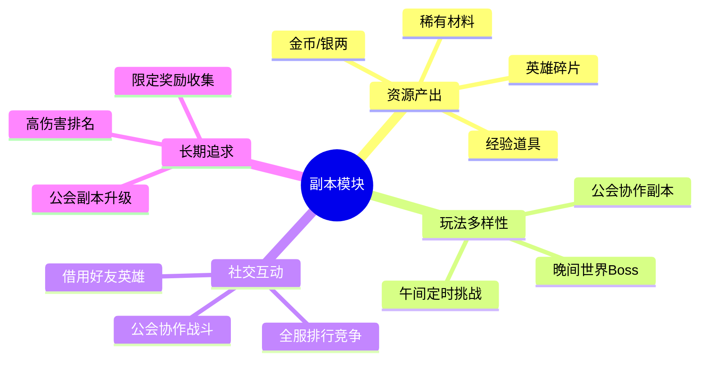

---

## 二、功能清单

### 2.1 午间副本功能

| 功能名称 | 功能描述 | 用户价值 |
|---------|---------|---------|
| 定时开启 | 每日固定时间段开启 | 形成固定游戏习惯 |
| 攻击挑战 | 消耗体力攻击副本 | 获取基础奖励 |
| 借用攻击 | 借用好友英雄攻击 | 社交互动，额外奖励加成 |
| 宝箱领取 | 累计攻击次数解锁宝箱 | 长期目标，额外奖励 |
| 次数限制 | 每日挑战次数有限 | 控制资源产出节奏 |

### 2.2 晚间副本功能

| 功能名称 | 功能描述 | 用户价值 |
|---------|---------|---------|
| 世界Boss | 全服共享Boss血量 | 全服协作挑战 |
| 伤害累计 | 记录玩家总伤害 | 个人贡献可视化 |
| 排行榜 | 按伤害排名 | 竞争激励 |
| 击杀奖励 | 最后一击获得额外奖励 | 运气因素增加趣味 |
| 排行奖励 | 根据排名发放奖励 | 追求高排名动力 |

### 2.3 公会副本功能

| 功能名称 | 功能描述 | 用户价值 |
|---------|---------|---------|
| 副本开启 | 会长/官员手动开启 | 灵活安排活动时间 |
| 自动开启 | 设置自动开启时间 | 减少管理负担 |
| 等级提升 | 消耗公会资金提升难度 | 长期成长目标 |
| 怪物标记 | 标记重点攻击目标 | 协作指挥 |
| 伤害排行 | 公会内伤害排名 | 内部竞争激励 |
| 通关奖励 | 击杀所有怪物通关 | 团队成就感 |

---

## 三、业务流程详解

### 3.1 午间副本挑战流程

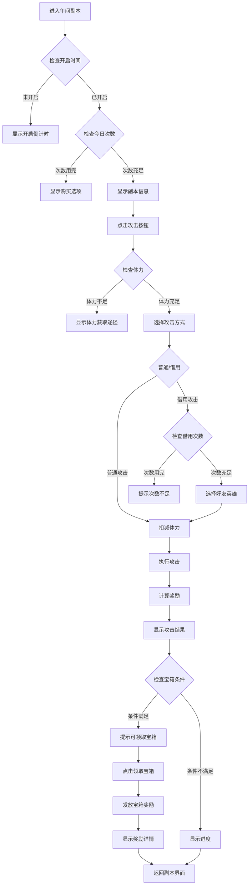

**详细步骤说明**：

1. **副本进入**
   - 检查玩家等级是否满足解锁条件
   - 显示副本信息：名称、推荐战力、奖励预览
   - 显示今日剩余次数

2. **攻击准备**
   - 检查体力是否充足
   - 选择攻击方式：普通攻击或借用好友英雄
   - 借用攻击有额外奖励加成

3. **攻击执行**
   - 扣减体力
   - 计算攻击奖励
   - 更新今日攻击次数

4. **宝箱领取**
   - 累计攻击次数达到条件解锁宝箱
   - 点击领取发放宝箱奖励

### 3.2 晚间副本挑战流程

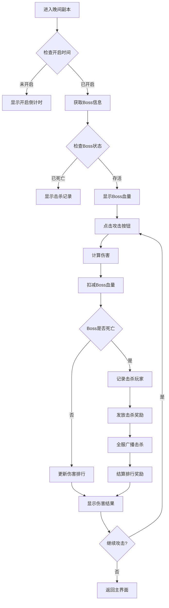

**关键机制说明**：

1. **Boss血量共享**
   - 全服玩家攻击同一Boss
   - 血量实时同步更新
   - 使用Redis原子操作保证数据一致性

2. **伤害计算**
   - 基于玩家攻击力计算基础伤害
   - 加入随机因素增加趣味性
   - 暴击判定提升爽快感

3. **击杀奖励**
   - 最后一击玩家获得额外奖励
   - 全服广播击杀信息
   - 根据伤害排名发放排行奖励

### 3.3 公会副本挑战流程

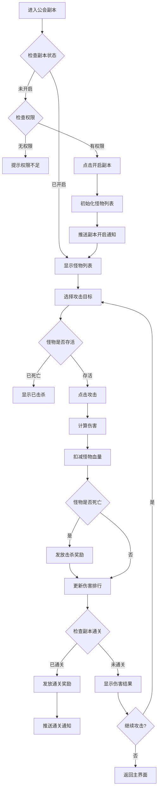

**公会协作机制**：

1. **怪物标记**
   - 会长/官员可标记重点攻击目标
   - 帮助成员集中火力
   - 提高通关效率

2. **伤害排行**
   - 公会内部伤害排名
   - 激励成员积极参与
   - 便于奖励分配

3. **副本升级**
   - 消耗公会资金提升副本等级
   - 提高怪物难度和奖励
   - 长期成长目标

---

## 四、关键规则

### 4.1 午间副本规则

| 规则类型 | 规则说明 | 参数配置 |
|----------|----------|----------|
| 开启时间 | 每日12:00-14:00 | 配表可配 |
| 挑战次数 | 每日3次，VIP增加 | 配表+VIP权益 |
| 体力消耗 | 每次10点体力 | 配表可配 |
| 借用次数 | 每日3次借用好友英雄 | 全局配置 |
| 借用加成 | 奖励增加20% | 全局配置 |
| 宝箱解锁 | 累计攻击次数达标解锁 | 配表配置 |

### 4.2 晚间副本规则

| 规则类型 | 规则说明 | 参数配置 |
|----------|----------|----------|
| 开启时间 | 每日20:00-22:00 | 配表可配 |
| 挑战次数 | 无限制 | - |
| Boss血量 | 全服共享，根据天数递增 | 配表配置 |
| 击杀奖励 | 最后一击获得额外奖励 | 配表配置 |
| 排行奖励 | 根据排名发放奖励 | 配表配置 |
| 伤害奖励 | 达到指定伤害获得奖励 | 配表配置 |

### 4.3 公会副本规则

| 规则类型 | 规则说明 | 参数配置 |
|----------|----------|----------|
| 开启权限 | 会长、副会长可开启 | 职位配置 |
| 开启条件 | 公会等级达标 | 配表配置 |
| 开放日期 | 指定周几开放（如周一三五） | 配表配置 |
| 副本等级 | 最高10级 | 配表配置 |
| 升级消耗 | 消耗公会资金 | 配表配置 |
| 自动开启 | 可设置自动开启时间 | 配置选项 |

---

## 五、用户故事

### 5.1 午间副本用户故事

> **作为日常玩家**，我每天中午12点上线，先完成午间副本。我先用普通攻击打3次，获得了银两和经验书。然后我发现攻击次数达到5次可以领取一个宝箱，于是我又借用好友的英雄攻击了2次，不仅完成了宝箱条件，还获得了额外的奖励加成。领取宝箱后，我获得了大量金币和稀有材料，感觉非常满足。

### 5.2 晚间副本用户故事

> **作为追求排名的玩家**，我非常关注晚间副本的世界Boss活动。每晚8点Boss开启时，我都会第一时间参与。我的战力较高，每次攻击都能打出很高的伤害。昨晚我打了100多次，累计伤害达到了第一名，最终获得了排行第一的丰厚奖励。而且有一次我运气很好，最后一击击杀了Boss，还额外获得了击杀奖励！

### 5.3 公会副本用户故事

> **作为公会会长**，我负责管理公会的副本活动。我们公会的副本设置为每周一三五自动开启，这样成员们都知道什么时候有活动。我经常使用怪物标记功能，告诉成员优先攻击哪个怪物。我们的副本已经升到了5级，难度虽然高了，但奖励也更丰厚了。每次通关后，公会成员都很开心，大家的配合也越来越默契。

---

## 六、示例数据

### 6.1 午间副本配置示例

```json
{
  "dungeon_id": 1,
  "dungeon_name": "午间试炼",
  "dungeon_type": 1,
  "open_time": "12:00",
  "close_time": "14:00",
  "duration": 120,
  "daily_count": 3,
  "energy_cost": 10,
  "recommended_power": 30000,
  "reward_pool_id": 1001,
  "unlock_level": 10,
  "chapter_id": 1,
  "box_list": [
    {
      "box_id": 1,
      "box_quality": 1,
      "need_attack_count": 3,
      "reward_list": [
        {"type": "SILVER", "id": 0, "count": 1000}
      ]
    },
    {
      "box_id": 2,
      "box_quality": 2,
      "need_attack_count": 5,
      "reward_list": [
        {"type": "SILVER", "id": 0, "count": 2000},
        {"type": "ITEM", "id": 10001, "count": 1}
      ]
    },
    {
      "box_id": 3,
      "box_quality": 3,
      "need_attack_count": 8,
      "reward_list": [
        {"type": "DIAMOND", "id": 0, "count": 50}
      ]
    }
  ]
}
```

### 6.2 晚间副本Boss配置示例

```json
{
  "boss_id": 1001,
  "boss_name": "暗影巨龙",
  "boss_level": 50,
  "hp": 100000000,
  "atk": 50000,
  "def": 30000,
  "boss_type": 1,
  "skill_list": [1001, 1002],
  "reward_list": [
    {"type": "DIAMOND", "id": 0, "count": 100},
    {"type": "ITEM", "id": 20001, "count": 1}
  ],
  "rank_reward": [
    {
      "rank_min": 1,
      "rank_max": 1,
      "reward_list": [
        {"type": "DIAMOND", "id": 0, "count": 500},
        {"type": "ITEM", "id": 30001, "count": 1}
      ]
    },
    {
      "rank_min": 2,
      "rank_max": 10,
      "reward_list": [
        {"type": "DIAMOND", "id": 0, "count": 200}
      ]
    }
  ]
}
```

### 6.3 公会副本配置示例

```json
{
  "dungeon_id": 1,
  "dungeon_name": "公会试炼",
  "dungeon_type": 3,
  "guild_level": 3,
  "max_level": 10,
  "monster_list": [1001, 1002, 1003, 1004, 1005],
  "auto_start": true,
  "open_day_list": [1, 3, 5],
  "reward_id": 3001,
  "level_config": [
    {
      "level": 1,
      "hp_multiplier": 1.0,
      "atk_multiplier": 1.0,
      "monster_count": 3,
      "upgrade_cost": {"type": "GUILD_COIN", "id": 0, "count": 500}
    },
    {
      "level": 2,
      "hp_multiplier": 1.2,
      "atk_multiplier": 1.1,
      "monster_count": 4,
      "upgrade_cost": {"type": "GUILD_COIN", "id": 0, "count": 1000}
    }
  ]
}
```

---

## 七、系统架构图

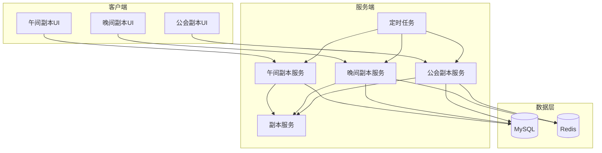

---

## 八、数据流向图

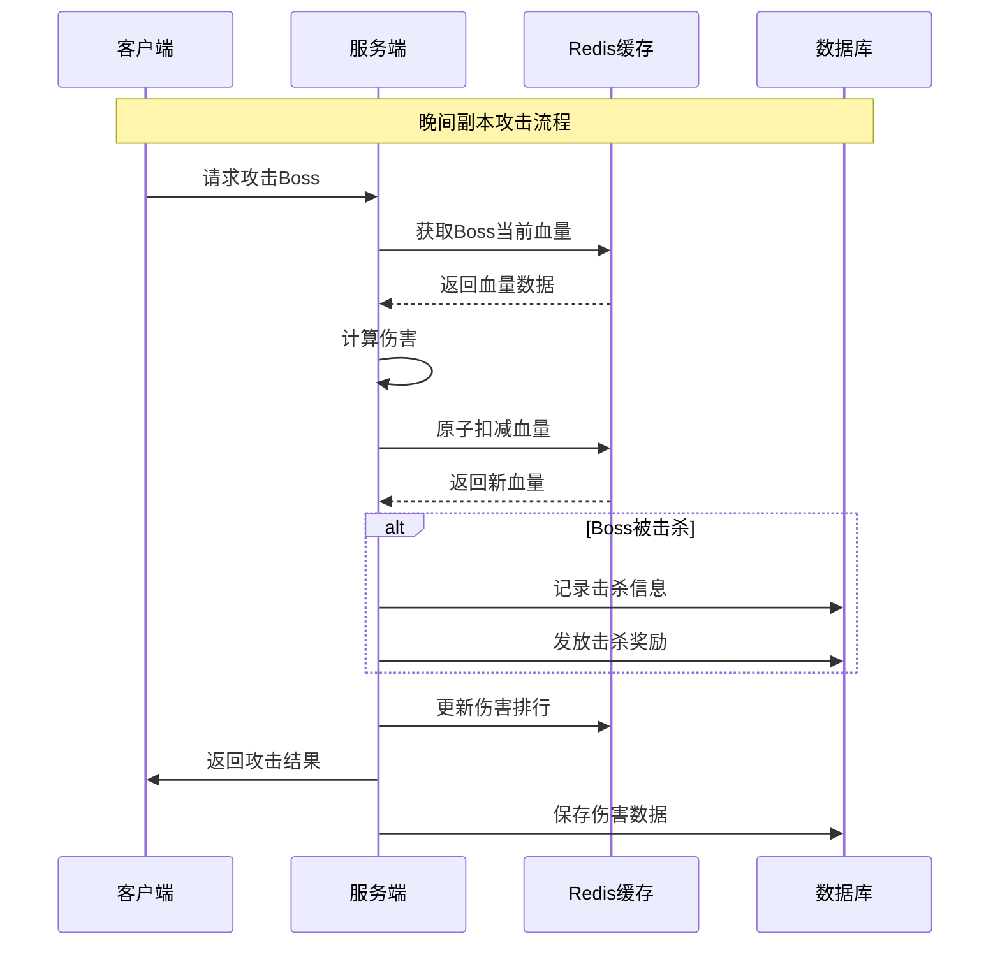

---

## 九、模块关联图

### 9.1 与其他模块的依赖关系

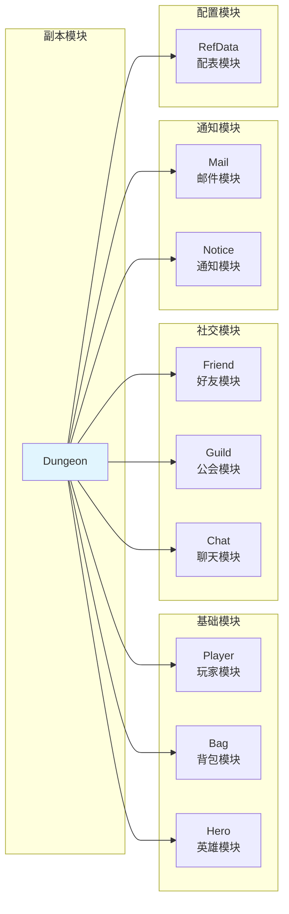

### 9.2 模块交互说明

| 关联模块 | 交互场景 | 数据流向 |
|----------|----------|----------|
| Player | 消耗体力、获取经验 | 双向 |
| Bag | 发放奖励、消耗道具 | 双向 |
| Hero | 使用英雄战斗 | 读取 |
| Friend | 借用好友英雄 | 双向 |
| Guild | 公会副本管理 | 双向 |
| Chat | Boss击杀广播 | 写入 |
| Mail | 排行奖励发放 | 写入 |
| Notice | 副本开启通知 | 写入 |

---

## 十、用户旅程图

### 10.1 午间副本用户旅程

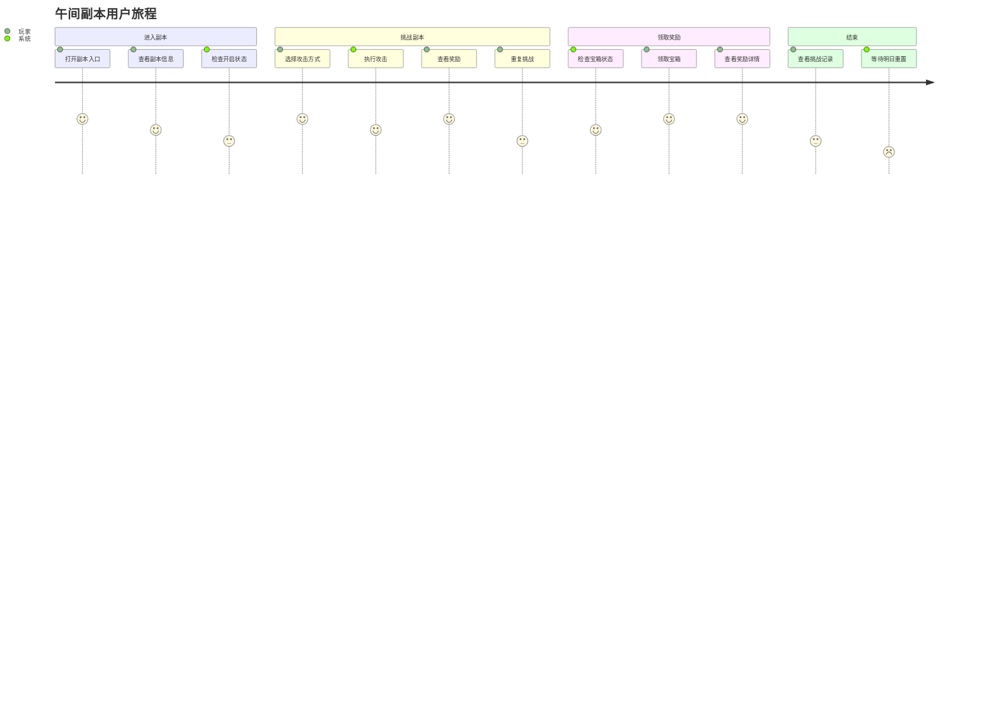

### 10.2 晚间副本用户旅程


### 10.3 公会副本用户旅程

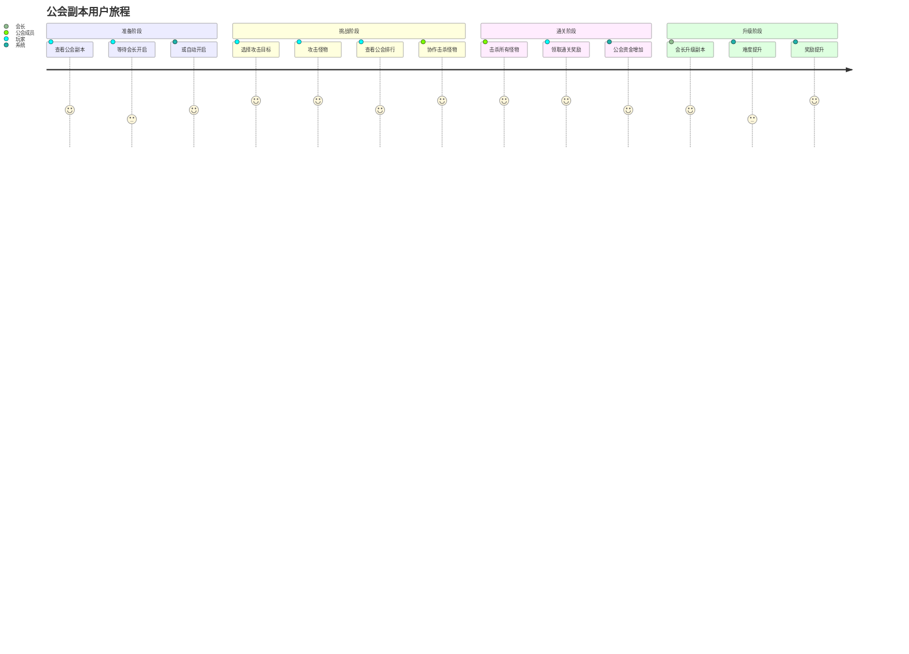

---

## 十一、完整字段列表汇总

### 11.1 午间副本字段汇总

| 分类 | 字段名 | 类型 | 说明 |
|------|--------|------|------|
| 副本信息 | dungeon_id | int | 副本ID |
| 副本信息 | dungeon_name | string | 副本名称 |
| 副本信息 | open_time | string | 开启时间 |
| 副本信息 | close_time | string | 关闭时间 |
| 副本信息 | duration | int | 持续时间 |
| 副本信息 | daily_count | int | 每日次数 |
| 副本信息 | energy_cost | int | 体力消耗 |
| 副本信息 | recommended_power | long | 推荐战力 |
| 副本信息 | unlock_level | int | 解锁等级 |
| 宝箱信息 | box_id | int | 宝箱ID |
| 宝箱信息 | box_quality | int | 宝箱品质 |
| 宝箱信息 | need_attack_count | int | 需要攻击次数 |
| 宝箱信息 | reward_list | List | 奖励列表 |
| 玩家数据 | attack_count | int | 今日攻击次数 |
| 玩家数据 | borrow_count | int | 今日借用次数 |
| 玩家数据 | box_draw_record | json | 宝箱领取记录 |

### 11.2 晚间副本字段汇总

| 分类 | 字段名 | 类型 | 说明 |
|------|--------|------|------|
| Boss信息 | boss_id | int | Boss ID |
| Boss信息 | boss_name | string | Boss名称 |
| Boss信息 | boss_level | int | Boss等级 |
| Boss信息 | hp | long | 基础血量 |
| Boss信息 | atk | long | 攻击力 |
| Boss信息 | def | long | 防御力 |
| Boss信息 | boss_type | int | Boss类型 |
| Boss信息 | skill_list | List | 技能列表 |
| 排行信息 | rank_min | int | 最低排名 |
| 排行信息 | rank_max | int | 最高排名 |
| 排行信息 | reward_list | List | 奖励列表 |
| 排行信息 | mail_id | int | 邮件模板 |
| 伤害数据 | player_id | long | 玩家ID |
| 伤害数据 | total_damage | long | 总伤害 |
| 伤害数据 | attack_count | int | 攻击次数 |

### 11.3 公会副本字段汇总

| 分类 | 字段名 | 类型 | 说明 |
|------|--------|------|------|
| 副本信息 | dungeon_id | int | 副本ID |
| 副本信息 | guild_level | int | 公会等级需求 |
| 副本信息 | max_level | int | 最大等级 |
| 副本信息 | monster_list | List | 怪物列表 |
| 副本信息 | auto_start | bool | 自动开始 |
| 副本信息 | open_day_list | List | 开放日期 |
| 等级配置 | level | int | 副本等级 |
| 等级配置 | monster_count | int | 怪物数量 |
| 等级配置 | hp_multiplier | float | 血量倍率 |
| 等级配置 | atk_multiplier | float | 攻击倍率 |
| 等级配置 | upgrade_cost | Item | 升级消耗 |
| 怪物信息 | monster_id | int | 怪物ID |
| 怪物信息 | monster_name | string | 怪物名称 |
| 怪物信息 | monster_level | int | 怪物等级 |
| 怪物信息 | hp | long | 基础血量 |
| 怪物信息 | monster_type | int | 怪物类型 |

---

## 十二、常见问题与解决方案

### 12.1 常见问题

| 问题 | 原因 | 解决方案 |
|------|------|----------|
| 副本无法进入 | 等级未达标 | 显示解锁条件引导 |
| 攻击次数用完 | VIP等级不足 | 显示购买选项或等待重置 |
| Boss已被击杀 | 其他玩家先击杀 | 提示参与下一轮 |
| 公会副本无法开启 | 权限不足 | 显示权限说明 |
| 奖励未收到 | 邮件发送延迟 | 检查邮件列表并刷新 |

### 12.2 异常处理流程

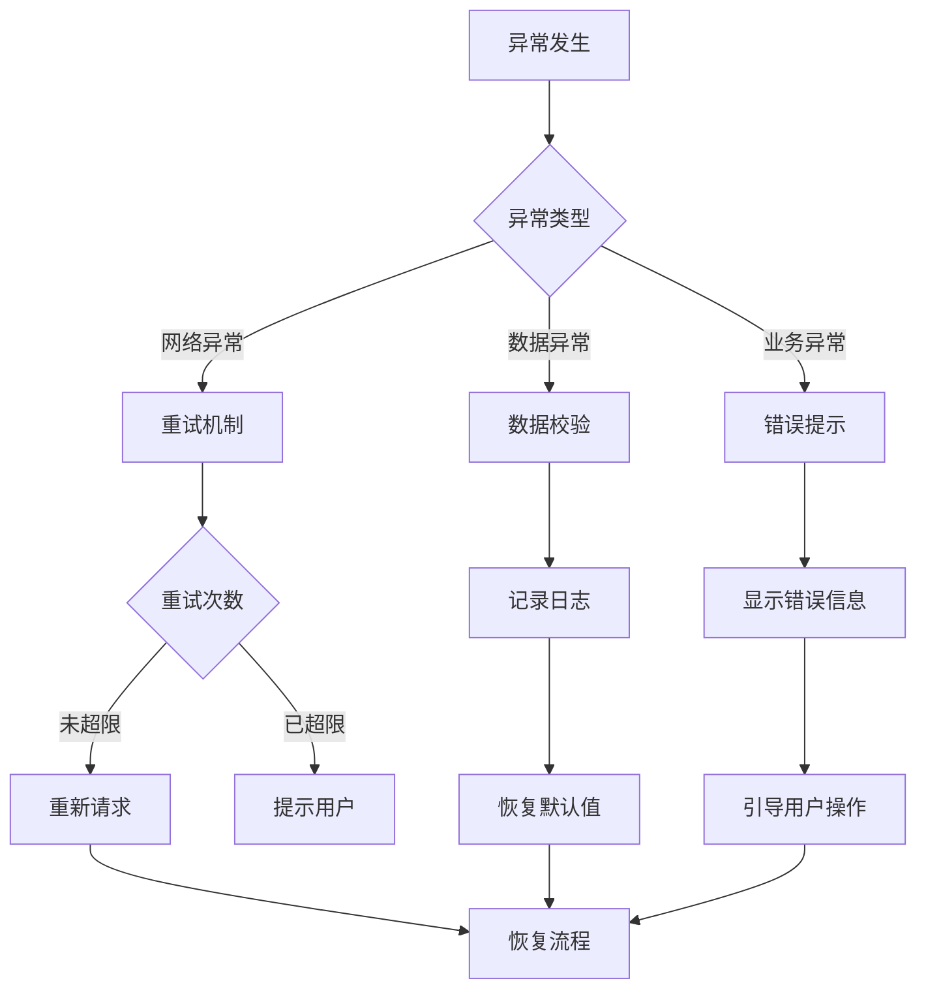

---

## 十三、版本更新记录

### 13.1 版本历史

| 版本 | 日期 | 更新内容 |
|------|------|----------|
| v1.0.0 | 2026-01-01 | 初始版本，支持午间/晚间副本 |
| v1.1.0 | 2026-02-01 | 新增公会副本功能 |
| v1.2.0 | 2026-03-01 | 新增借用好友英雄功能 |
| v1.3.0 | 2026-04-01 | 新增副本等级系统 |

### 13.2 功能规划

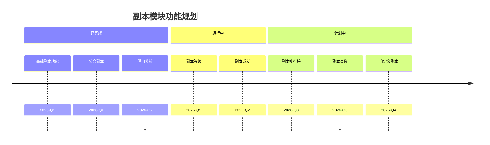

---

*文档生成时间: 2026-04-11*
