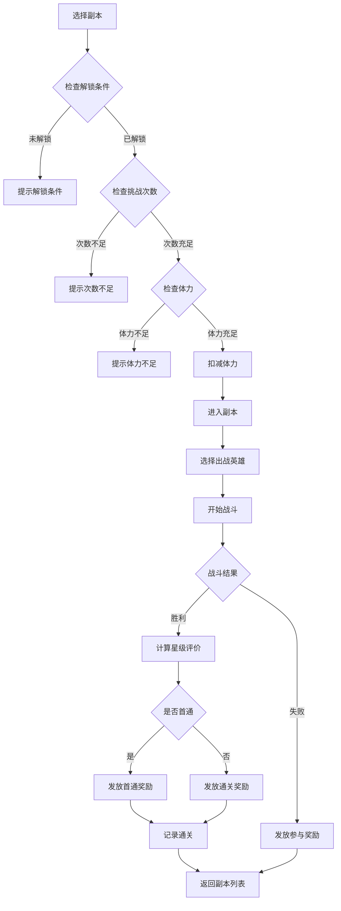
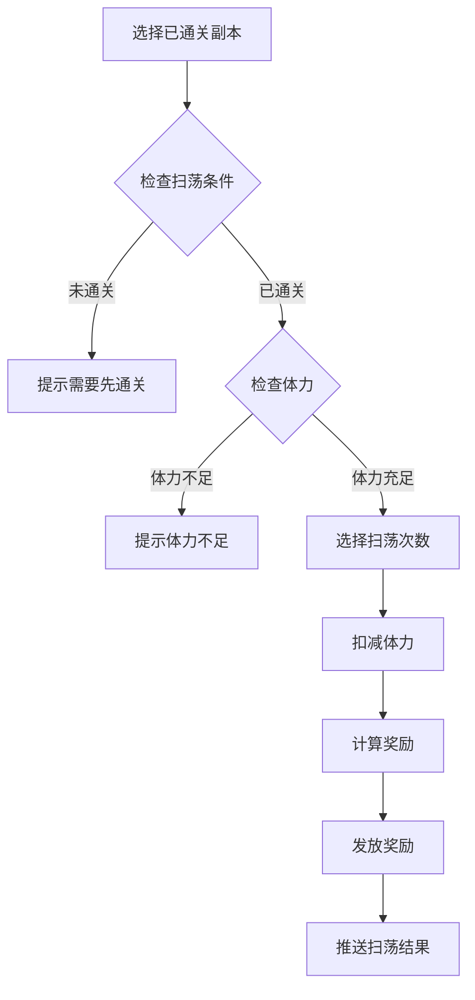
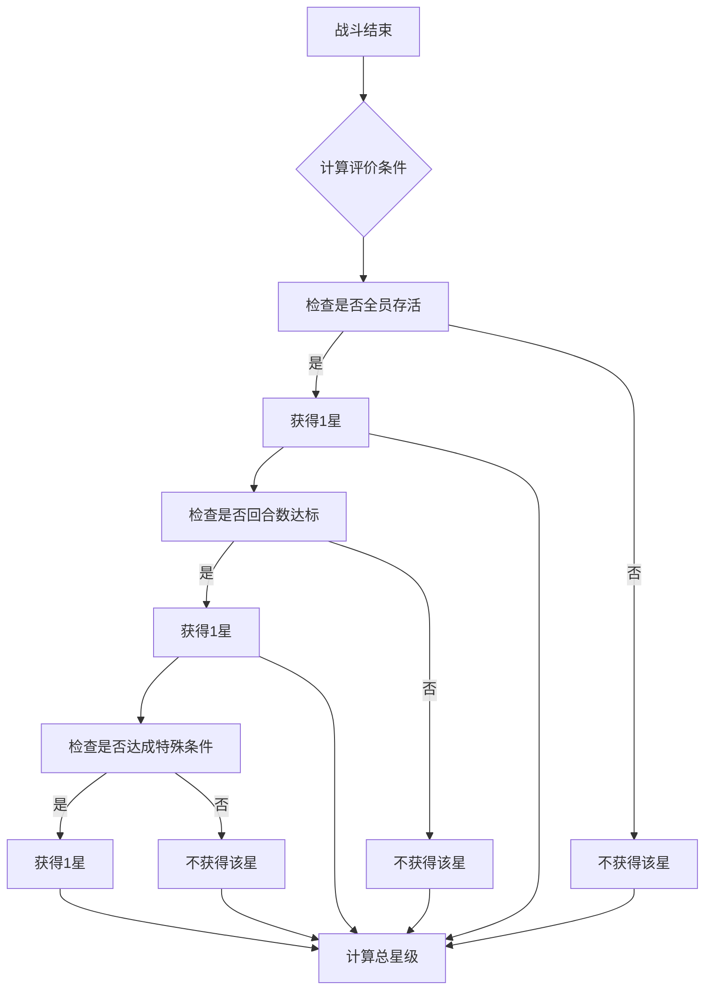

# 副本模块完整说明

## 一、模块概述

### 1.1 业务背景

副本模块是 K2C 游戏的核心 PVE（玩家对环境）系统。玩家可以挑战各种类型的副本，获取丰富的奖励和资源。副本系统提供了多种难度和玩法，是玩家日常获取资源的重要途径。

### 1.2 目标用户

- **所有玩家**：获取游戏资源的必经之路
- **挑战型玩家**：追求高难度副本通关
- **收集型玩家**：获取副本专属奖励

### 1.3 核心价值

1. **资源产出**：副本是主要资源获取途径
2. **玩法多样性**：不同类型副本提供不同体验
3. **难度梯度**：由易到难引导玩家成长
4. **长期追求**：高难度副本提供挑战目标

---

## 二、功能清单

### 2.1 副本类型功能

| 功能名称 | 功能描述 | 用户价值 |
|---------|---------|---------|
| 主线副本 | 推进游戏剧情的副本 | 了解故事，获取基础资源 |
| 材料副本 | 获取特定材料的副本 | 定向收集资源 |
| 经验副本 | 获取大量经验的副本 | 快速提升等级 |
| 金币副本 | 获取大量银两的副本 | 积累游戏货币 |
| 限时副本 | 特定时间开放的副本 | 稀有资源获取 |

### 2.2 副本挑战功能

| 功能名称 | 功能描述 | 用户价值 |
|---------|---------|---------|
| 进入副本 | 消耗体力进入副本 | 开始挑战 |
| 战斗过程 | 自动或手动战斗 | 游戏体验 |
| 扫荡功能 | 快速完成已通关副本 | 节省时间 |
| 重置副本 | 重置挑战次数 | 再次挑战 |

### 2.3 奖励系统功能

| 功能名称 | 功能描述 | 用户价值 |
|---------|---------|---------|
| 首通奖励 | 首次通关额外奖励 | 激励探索 |
| 通关奖励 | 每次通关获得奖励 | 基础收益 |
| 星级评价 | 根据表现给予星级 | 追求完美 |
| 宝箱奖励 | 累计星级开启宝箱 | 长期目标 |

---

## 三、业务流程详解

### 3.1 副本挑战流程



**详细步骤说明**：

1. **副本选择**
   - 查看副本信息和推荐战力
   - 查看副本奖励预览
   - 确认挑战次数剩余

2. **进入条件**
   - 副本是否已解锁
   - 挑战次数是否充足
   - 体力是否足够

3. **战斗执行**
   - 选择出战英雄阵容
   - 执行自动战斗
   - 计算战斗结果

4. **奖励发放**
   - 根据通关结果发放奖励
   - 首通额外奖励
   - 星级评价奖励

### 3.2 副本扫荡流程



### 3.3 星级评价流程



---

## 四、关键规则

### 4.1 副本解锁规则

1. **主线解锁**：完成前置关卡解锁
2. **等级解锁**：达到指定等级解锁
3. **时间解锁**：特定时间段开放
4. **任务解锁**：完成特定任务解锁

### 4.2 挑战次数规则

1. **每日次数**：每种副本每日限制挑战次数
2. **次数恢复**：每日凌晨5点恢复次数
3. **额外购买**：可消耗钻石购买额外次数
4. **VIP加成**：VIP等级增加每日次数

### 4.3 体力消耗规则

1. **基础消耗**：每个副本消耗固定体力
2. **扫荡消耗**：扫荡消耗与手动相同
3. **体力恢复**：每5分钟恢复1点
4. **体力购买**：每日可购买体力次数有限

### 4.4 奖励规则

1. **固定奖励**：每次通关固定获得
2. **随机奖励**：从奖励池随机抽取
3. **首通奖励**：首次通关额外获得
4. **星级宝箱**：累计星级开启宝箱

---

## 五、用户故事

### 5.1 日常玩家故事

> 作为一名日常玩家，我每天上线后先完成各种材料副本。先用体力打完金币副本，获得银两用于升级英雄。然后打经验副本，获取英雄升级材料。扫荡功能让我可以快速完成，节省了很多时间。

### 5.2 挑战玩家故事

> 作为一名追求挑战的玩家，我专注于攻克高难度副本。最近开放的"深渊试炼"副本难度很高，我已经尝试了很多次。通过调整阵容和策略，我终于找到了通关方法，获得了三星评价和丰厚奖励。

### 5.3 收集玩家故事

> 作为一名喜欢收集的玩家，我关注每个副本的专属奖励。某些副本有独特的英雄碎片掉落，我每天都会挑战，终于集齐了碎片招募到了心仪的英雄。副本宝箱的累计星级奖励也让我很有成就感。

---

## 六、示例

### 6.1 材料副本示例

**副本信息**：
```
副本名称：英雄试炼 - 第一章
副本类型：材料副本
推荐战力：30,000
体力消耗：12点
每日次数：3次
```

**奖励配置**：
```
通关奖励：
  - 固定：银两×2000
  - 随机：英雄经验书×2-5
首通奖励：
  - 钻石×50
  - 英雄碎片×10
```

### 6.2 星级评价示例

**评价条件**：
```
一星：通关副本
二星：5回合内通关
三星：全员存活
```

**评价结果**：
```
玩家战斗情况：
  - 通关成功
  - 使用8回合
  - 1名英雄阵亡

获得星级：1星（仅满足通关条件）
```

### 6.3 扫荡示例

**初始状态**：
```
体力：100/120
副本今日次数：2/3
```

**扫荡操作**：
- 扫荡2次
- 消耗体力：12×2=24

**结果状态**：
```
体力：76/120
副本今日次数：0/3
获得奖励：银两×4000、经验书×6
```

---

*文档生成时间: 2026-04-06*
