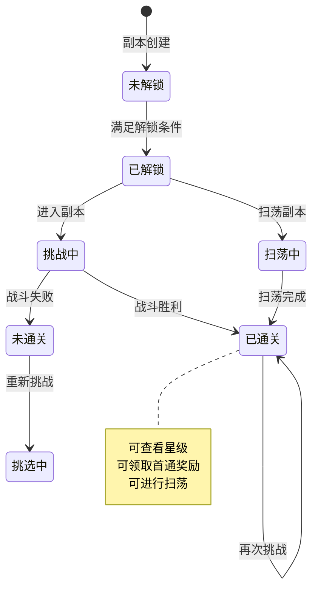
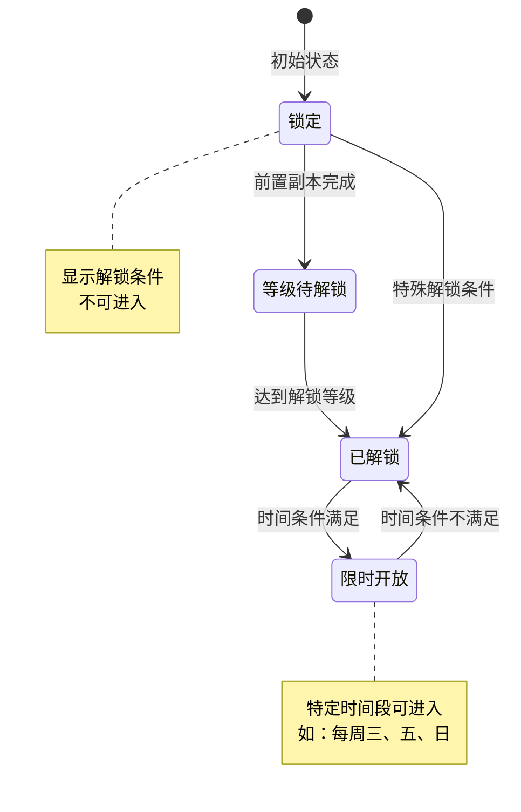
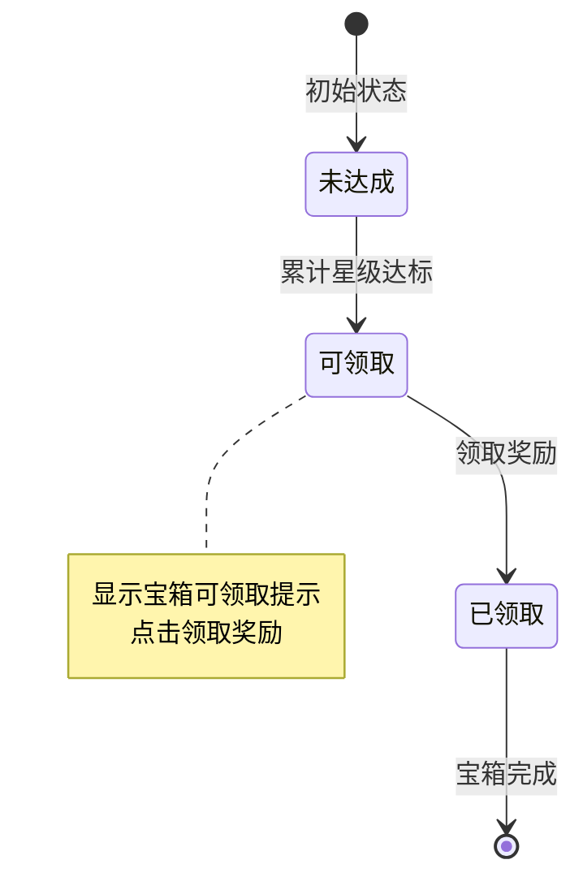

# 副本模块实现细节

## 一、计算公式

### 1.1 战斗结果计算

```
战斗结果 = 综合战力比较 + 随机因素
胜率 = 己方战力 / (己方战力 + 敌方战力)
最终判定 = random() < 胜率 ? 胜利 : 失败
```

**示例**：
```
己方战力：60,000
敌方战力：40,000
胜率 = 60000 / (60000 + 40000) = 60%
```

### 1.2 星级评价计算

```
星级 = 0
if 通关成功: 星级 += 1
if 回合数 <= 目标回合: 星级 += 1
if 全员存活: 星级 += 1
```

### 1.3 奖励计算

```
基础奖励 = 配置固定奖励
随机奖励 = 随机从奖励池选取(count: 配置数量)
首通奖励 = 首次通关时额外发放
总奖励 = 基础奖励 + 随机奖励 + 首通奖励(如适用)
```

### 1.4 掉落概率计算

```
单次掉落概率 = base_drop_rate × (1 + 幸运加成)
保底机制：连续N次未掉落则必定掉落
```

**示例**：
```
基础掉落率：5%
幸运加成：20%
实际掉落率 = 5% × 1.2 = 6%
保底次数：50次
```

---

## 二、状态机定义

### 2.1 副本挑战状态机



### 2.2 副本解锁状态机



### 2.3 宝箱状态机



---

## 三、数据约束

### 3.1 副本配置数据约束

| 字段名 | 数据类型 | 取值范围 | 必填 | 说明 |
|--------|----------|----------|------|------|
| dungeonId | long | > 0 | 是 | 副本配置ID |
| name | string | 非空 | 是 | 副本名称 |
| type | int | 1-5 | 是 | 类型：1主线,2材料,3经验,4金币,5限时 |
| chapter | int | >= 1 | 是 | 所属章节 |
| difficulty | int | 1-5 | 是 | 难度等级 |
| energyCost | int | > 0 | 是 | 体力消耗 |
| dailyLimit | int | > 0 | 是 | 每日次数限制 |
| recommendedPower | long | > 0 | 是 | 推荐战力 |

### 3.2 副本进度数据约束

| 字段名 | 数据类型 | 取值范围 | 必填 | 说明 |
|--------|----------|----------|------|------|
| playerId | long | > 0 | 是 | 玩家ID |
| dungeonId | long | > 0 | 是 | 副本ID |
| stars | int | 0-3 | 是 | 获得星级 |
| bestTime | int | >= 0 | 是 | 最快通关时间（秒） |
| challengeCount | int | >= 0 | 是 | 累计挑战次数 |
| todayCount | int | >= 0 | 是 | 今日挑战次数 |
| firstClearTime | datetime | - | 否 | 首次通关时间 |

### 3.3 奖励配置数据约束

| 字段名 | 数据类型 | 取值范围 | 必填 | 说明 |
|--------|----------|----------|------|------|
| dungeonId | long | > 0 | 是 | 副本ID |
| rewardType | int | 1-3 | 是 | 类型：1通关,2首通,3宝箱 |
| itemId | long | > 0 | 是 | 物品ID |
| count | int | > 0 | 是 | 物品数量 |
| dropRate | float | 0-1 | 否 | 掉落概率 |

---

## 四、错误处理策略

### 4.1 副本模块错误码

| 错误码 | 错误信息 | 处理策略 | 用户提示 |
|--------|----------|----------|----------|
| 24001 | 副本不存在 | 检查副本配置 | "副本数据异常" |
| 24002 | 副本未解锁 | 显示解锁条件 | "副本尚未解锁" |
| 24003 | 体力不足 | 显示体力获取途径 | "体力不足，请补充" |
| 24004 | 今日次数已用完 | 显示购买选项 | "今日次数已用完" |
| 24005 | 未通关无法扫荡 | 引导先通关 | "请先通关该副本" |
| 24006 | 英雄阵容为空 | 引导设置阵容 | "请设置出战英雄" |
| 24007 | 副本已过期 | 刷新副本列表 | "副本已结束" |
| 24008 | 战斗数据异常 | 重新进入副本 | "战斗异常，请重试" |

### 4.2 战斗异常处理

| 异常场景 | 处理方式 | 用户影响 |
|----------|----------|----------|
| 战斗中断 | 保存当前状态 | 可恢复继续 |
| 奖励发放失败 | 重试机制 | 可能延迟到账 |
| 数据不同步 | 重新加载 | 可能丢失进度 |

---

## 五、关键代码示例

### 5.1 进入副本伪代码

```csharp
public Result EnterDungeon(long playerId, long dungeonId)
{
    // 1. 获取副本配置
    DungeonRefObj dungeonRef = GetDungeonRef(dungeonId);
    if (dungeonRef == null)
        return Result.Error(24001, "副本不存在");

    // 2. 检查解锁条件
    if (!CheckUnlockCondition(playerId, dungeonRef))
        return Result.Error(24002, "副本未解锁");

    // 3. 获取玩家副本进度
    DungeonProgress progress = dungeonService.GetProgress(playerId, dungeonId);
    if (progress == null)
    {
        progress = new DungeonProgress {
            playerId = playerId,
            dungeonId = dungeonId,
            stars = 0,
            todayCount = 0
        };
    }

    // 4. 检查今日次数
    int maxCount = GetMaxChallengeCount(playerId, dungeonRef);
    if (progress.todayCount >= maxCount)
        return Result.Error(24004, "今日次数已用完");

    // 5. 检查体力
    PlayerInfo player = playerService.GetPlayer(playerId);
    if (player.energy < dungeonRef.energyCost)
        return Result.Error(24003, "体力不足");

    // 6. 扣减体力
    playerService.CostEnergy(playerId, dungeonRef.energyCost);

    // 7. 增加今日次数
    progress.todayCount++;
    dungeonService.UpdateProgress(progress);

    // 8. 返回副本数据
    return Result.Success(new {
        dungeon = dungeonRef,
        progress = progress
    });
}
```

### 5.2 战斗结算伪代码

```csharp
public Result BattleSettle(long playerId, long dungeonId, BattleResult result)
{
    // 1. 获取副本配置
    DungeonRefObj dungeonRef = GetDungeonRef(dungeonId);

    // 2. 获取副本进度
    DungeonProgress progress = dungeonService.GetProgress(playerId, dungeonId);

    // 3. 计算星级
    int stars = CalculateStars(result);

    // 4. 更新最高星级
    bool isNewRecord = false;
    if (stars > progress.stars)
    {
        progress.stars = stars;
        isNewRecord = true;
    }

    // 5. 更新最快通关时间
    if (result.isWin && (progress.bestTime == 0 || result.time < progress.bestTime))
    {
        progress.bestTime = result.time;
    }

    // 6. 计算奖励
    List<RewardItem> rewards = new List<RewardItem>();

    // 通关奖励
    if (result.isWin)
    {
        rewards.AddRange(CalculateClearReward(dungeonRef));

        // 首通奖励
        if (progress.firstClearTime == null)
        {
            progress.firstClearTime = DateTime.Now;
            rewards.AddRange(CalculateFirstClearReward(dungeonRef));
        }
    }

    // 7. 发放奖励
    bagService.AddItems(playerId, rewards);

    // 8. 更新进度
    progress.challengeCount++;
    dungeonService.UpdateProgress(progress);

    // 9. 检查宝箱
    CheckStarBox(playerId, dungeonRef.chapter);

    // 10. 推送结算结果
    PushBattleSettle(playerId, new {
        isWin = result.isWin,
        stars = stars,
        isNewRecord = isNewRecord,
        rewards = rewards
    });

    return Result.Success(new { stars, rewards });
}
```

### 5.3 扫荡副本伪代码

```csharp
public Result SweepDungeon(long playerId, long dungeonId, int count)
{
    // 1. 获取副本配置
    DungeonRefObj dungeonRef = GetDungeonRef(dungeonId);

    // 2. 检查是否已通关
    DungeonProgress progress = dungeonService.GetProgress(playerId, dungeonId);
    if (progress == null || progress.stars < 1)
        return Result.Error(24005, "未通关无法扫荡");

    // 3. 检查今日次数
    int maxCount = GetMaxChallengeCount(playerId, dungeonRef);
    int availableCount = maxCount - progress.todayCount;
    int actualCount = Math.Min(count, availableCount);

    if (actualCount <= 0)
        return Result.Error(24004, "今日次数已用完");

    // 4. 检查体力
    int totalEnergy = dungeonRef.energyCost * actualCount;
    PlayerInfo player = playerService.GetPlayer(playerId);
    if (player.energy < totalEnergy)
        return Result.Error(24003, "体力不足");

    // 5. 扣减体力
    playerService.CostEnergy(playerId, totalEnergy);

    // 6. 更新次数
    progress.todayCount += actualCount;
    dungeonService.UpdateProgress(progress);

    // 7. 计算奖励
    List<RewardItem> totalRewards = new List<RewardItem>();
    for (int i = 0; i < actualCount; i++)
    {
        totalRewards.AddRange(CalculateClearReward(dungeonRef));
    }

    // 8. 发放奖励
    bagService.AddItems(playerId, totalRewards);

    // 9. 推送扫荡结果
    PushSweepResult(playerId, new {
        count = actualCount,
        rewards = totalRewards
    });

    return Result.Success(new { count = actualCount, rewards = totalRewards });
}
```

---

## 六、性能优化建议

### 6.1 缓存策略

1. **副本配置缓存**：全量加载副本配置
2. **进度缓存**：玩家副本进度缓存到 Redis
3. **奖励预计算**：常见扫荡场景预计算奖励

### 6.2 数据库优化

1. **分表策略**：按玩家ID分表存储进度
2. **索引设计**：(playerId, dungeonId) 复合索引
3. **定期清理**：清理过期的限时副本数据

### 6.3 并发控制

1. **次数检查**：使用 Redis 原子操作
2. **体力扣减**：乐观锁机制
3. **奖励发放**：幂等性保证

---

*文档生成时间: 2026-04-06*
