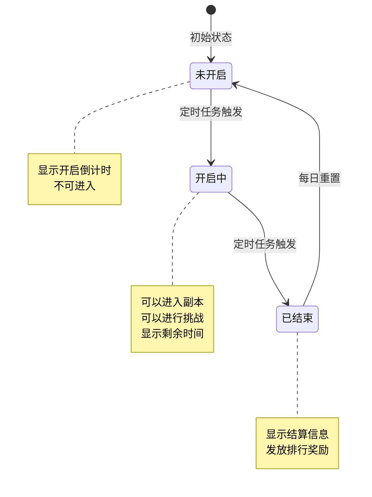
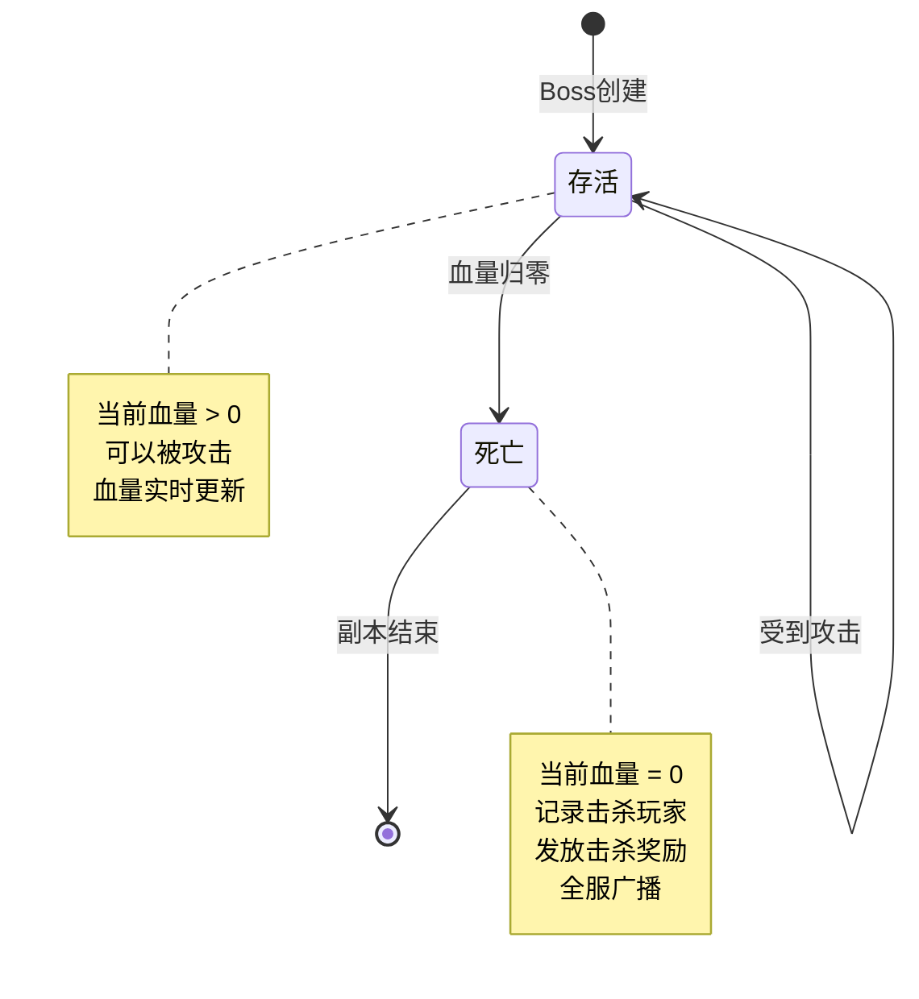
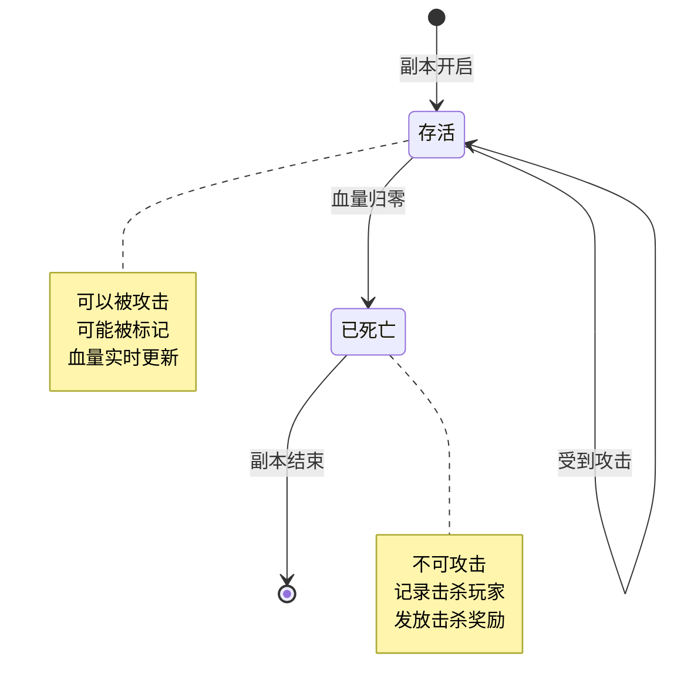
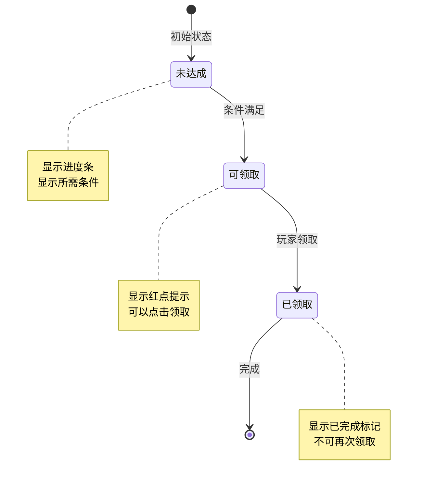
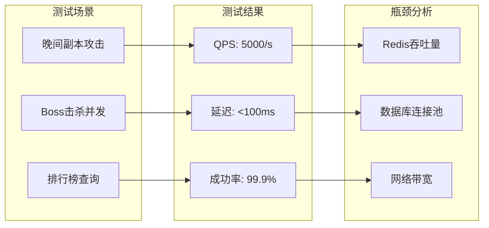

# 副本模块实现细节

## 一、计算公式

### 1.1 伤害计算公式

```
基础伤害 = 玩家攻击力 × 伤害系数

伤害系数 = 副本类型系数 × 随机因子 × 暴击因子

其中：
- 副本类型系数：午间副本=10，晚间副本=10，公会副本=10×(1+副本等级×0.1)
- 随机因子：0.8 ~ 1.2 均匀分布
- 暴击因子：暴击时=1.5，否则=1.0
```

**示例计算**：

```
玩家攻击力：50,000
副本类型：晚间副本
随机因子：1.1（随机生成）
暴击判定：触发暴击

伤害 = 50,000 × 10 × 1.1 × 1.5 = 825,000
```

### 1.2 Boss血量计算

```
Boss基础血量 = 配置血量

实际血量 = Boss基础血量 × (1 + 天数系数)

天数系数 = min(当前天数 / 7, 1) × 0.5

即：每7天血量增加50%，最高增加50%
```

**示例计算**：

```
配置血量：100,000,000
当前天数：14天

天数系数 = min(14/7, 1) × 0.5 = 0.5
实际血量 = 100,000,000 × 1.5 = 150,000,000
```

### 1.3 奖励计算

```
午间副本奖励：
- 基础奖励 = 从奖励池随机选取
- 借用加成 = 基础奖励 × 1.2

晚间副本奖励：
- 攻击奖励 = 根据伤害值计算（每10万伤害获得1次抽奖机会）
- 击杀奖励 = 配置的固定奖励
- 排行奖励 = 根据排名发放

公会副本奖励：
- 击杀奖励 = 怪物配置的固定奖励
- 通关奖励 = 副本配置的固定奖励 × 副本等级系数
```

### 1.4 掉落概率计算

```
单次掉落概率 = 基础掉落率 × (1 + 幸运加成)

保底机制：
- 连续N次未掉落必定掉落
- 保底次数后重置计数器

幸运加成来源：
- VIP等级加成
- 装备特效加成
- 活动加成
```

**示例计算**：

```
基础掉落率：5%
VIP加成：10%
装备加成：5%
活动加成：0%

总幸运加成 = 10% + 5% = 15%
实际掉落率 = 5% × 1.15 = 5.75%
保底次数：50次
```

---

## 二、状态机定义

### 2.1 副本状态机



### 2.2 Boss状态机



### 2.3 怪物状态机



### 2.4 宝箱状态机



---

## 三、数据约束

### 3.1 副本配置数据约束

| 字段名 | 数据类型 | 取值范围 | 必填 | 说明 |
|--------|----------|----------|------|------|
| dungeon_id | int | > 0 | 是 | 副本配置ID |
| dungeon_name | string | 1-64字符 | 是 | 副本名称 |
| dungeon_type | int | 1-3 | 是 | 类型：1午间,2晚间,3公会 |
| open_time | string | HH:mm格式 | 是 | 开启时间 |
| close_time | string | HH:mm格式 | 是 | 关闭时间 |
| duration | int | > 0 | 是 | 持续时间（分钟） |
| daily_count | int | -1或>0 | 是 | 每日次数（-1表示无限制） |
| energy_cost | int | >= 0 | 是 | 体力消耗 |
| recommended_power | long | > 0 | 否 | 推荐战力 |
| unlock_level | int | >= 1 | 是 | 解锁等级 |
| guild_level | int | >= 1 | 否 | 公会等级需求 |

### 3.2 Boss配置数据约束

| 字段名 | 数据类型 | 取值范围 | 必填 | 说明 |
|--------|----------|----------|------|------|
| boss_id | int | > 0 | 是 | Boss ID |
| boss_name | string | 1-64字符 | 是 | Boss名称 |
| boss_level | int | >= 1 | 是 | Boss等级 |
| hp | long | > 0 | 是 | 基础血量 |
| atk | long | >= 0 | 是 | 攻击力 |
| def | long | >= 0 | 是 | 防御力 |
| boss_type | int | >= 1 | 是 | Boss类型 |

### 3.3 怪物配置数据约束

| 字段名 | 数据类型 | 取值范围 | 必填 | 说明 |
|--------|----------|----------|------|------|
| monster_id | int | > 0 | 是 | 怪物ID |
| monster_name | string | 1-64字符 | 是 | 怪物名称 |
| monster_level | int | >= 1 | 是 | 怪物等级 |
| hp | long | > 0 | 是 | 基础血量 |
| atk | long | >= 0 | 是 | 攻击力 |
| def | long | >= 0 | 是 | 防御力 |
| monster_type | int | >= 1 | 是 | 怪物类型 |

### 3.4 玩家副本数据约束

| 字段名 | 数据类型 | 取值范围 | 必填 | 说明 |
|--------|----------|----------|------|------|
| player_id | long | > 0 | 是 | 玩家ID |
| dungeon_id | int | > 0 | 是 | 副本ID |
| attack_count | int | >= 0 | 是 | 今日攻击次数 |
| borrow_count | int | >= 0 | 是 | 今日借用次数 |
| box_draw_record | json | - | 否 | 宝箱领取记录 |
| last_reset_time | datetime | - | 是 | 最后重置时间 |

### 3.5 伤害数据约束

| 字段名 | 数据类型 | 取值范围 | 必填 | 说明 |
|--------|----------|----------|------|------|
| player_id | long | > 0 | 是 | 玩家ID |
| boss_id | int | > 0 | 是 | Boss ID |
| total_damage | long | >= 0 | 是 | 总伤害 |
| attack_count | int | >= 0 | 是 | 攻击次数 |

---

## 四、错误处理策略

### 4.1 副本模块错误码

| 错误码 | 错误信息 | 处理策略 | 用户提示 |
|--------|----------|----------|----------|
| 24001 | DUNGEON_NOT_EXIST | 检查副本配置 | "副本数据异常" |
| 24002 | DUNGEON_NOT_OPEN | 显示开启时间 | "副本尚未开启" |
| 24003 | DUNGEON_ALREADY_ENDED | 刷新副本列表 | "副本已结束" |
| 24004 | DUNGEON_ATTACK_COUNT_EXCEEDED | 显示购买选项 | "今日次数已用完" |
| 24005 | DUNGEON_ENERGY_NOT_ENOUGH | 显示体力获取途径 | "体力不足，请补充" |
| 24006 | DUNGEON_BOX_NOT_EXIST | 刷新宝箱列表 | "宝箱数据异常" |
| 24007 | DUNGEON_BOX_ALREADY_DRAWN | 刷新宝箱状态 | "宝箱已领取" |
| 24008 | DUNGEON_BOX_CONDITION_NOT_MET | 显示进度 | "条件未满足" |
| 24009 | DUNGEON_BOSS_NOT_EXIST | 刷新Boss信息 | "Boss数据异常" |
| 24010 | DUNGEON_BOSS_ALREADY_DEAD | 显示击杀信息 | "Boss已被击杀" |
| 24011 | DUNGEON_MONSTER_NOT_EXIST | 刷新怪物列表 | "怪物数据异常" |
| 24012 | DUNGEON_MONSTER_ALREADY_DEAD | 刷新怪物状态 | "怪物已被击杀" |
| 24013 | DUNGEON_NOT_UNLOCK | 显示解锁条件 | "副本未解锁" |
| 24014 | DUNGEON_LEVEL_MAX | 无需处理 | "等级已达上限" |
| 24015 | DUNGEON_GUILD_LEVEL_NOT_ENOUGH | 显示公会信息 | "公会等级不足" |
| 24016 | DUNGEON_NO_PERMISSION | 显示权限说明 | "无权限操作" |
| 24017 | DUNGEON_BORROW_COUNT_EXCEEDED | 显示次数限制 | "借用次数已用完" |
| 24018 | DUNGEON_FRIEND_NOT_EXIST | 刷新好友列表 | "好友不存在" |
| 24019 | DUNGEON_HERO_NOT_AVAILABLE | 刷新英雄列表 | "英雄不可用" |
| 24020 | DUNGEON_REWARD_ALREADY_GAINED | 刷新奖励状态 | "奖励已领取" |

### 4.2 异常处理场景

| 异常场景 | 处理方式 | 用户影响 | 数据一致性保证 |
|----------|----------|----------|----------------|
| 网络中断 | 重试机制 | 可能延迟响应 | 事务回滚 |
| 数据库异常 | 降级处理 | 功能暂时不可用 | 缓存补偿 |
| Redis异常 | 直接读写数据库 | 响应变慢 | 最终一致 |
| 并发冲突 | 乐观锁重试 | 可能需要重试 | 原子操作 |

### 4.3 并发处理策略

```java
/**
 * Boss血量并发更新示例
 */
public AttackResult attackBossWithConcurrency(long playerId, int bossId) {
    int maxRetries = 3;
    int retryCount = 0;
    
    while (retryCount < maxRetries) {
        try {
            // 使用乐观锁获取Boss信息
            EveningDungeonBoss boss = bossDao.selectByIdForUpdate(bossId);
            
            if (boss == null || boss.getState() == 1) {
                throw new BusinessException(ErrorCode.DUNGEON_BOSS_ALREADY_DEAD);
            }
            
            // 计算伤害
            long damage = calculateDamage(playerId);
            
            // 更新血量
            boss.setCurrentHp(Math.max(0, boss.getCurrentHp() - damage));
            
            // 使用版本号乐观锁更新
            int updated = bossDao.updateWithVersion(boss);
            if (updated == 0) {
                // 版本冲突，重试
                retryCount++;
                continue;
            }
            
            // 成功，返回结果
            return buildResult(damage, boss.getCurrentHp() <= 0);
            
        } catch (OptimisticLockException e) {
            retryCount++;
            if (retryCount >= maxRetries) {
                throw new BusinessException(ErrorCode.CONCURRENT_CONFLICT, "系统繁忙，请重试");
            }
        }
    }
    
    throw new BusinessException(ErrorCode.SYSTEM_ERROR);
}
```

---

## 五、关键代码示例

### 5.1 午间副本攻击实现

```java
/**
 * 午间副本攻击
 */
@Transactional(rollbackFor = Exception.class)
public AttackResult middayAttack(long playerId, int dungeonId) {
    // 1. 验证副本状态
    validateDungeonOpen(dungeonId, EDungeonType.MIDDAY);

    // 2. 获取配置
    RefMiddayDungeon dungeonRef = getDungeonRef(dungeonId);
    PlayerMiddayDungeon playerData = getOrCreatePlayerData(playerId, dungeonId);

    // 3. 检查次数
    int maxCount = getMaxAttackCount(playerId, dungeonRef);
    if (playerData.getAttackCount() >= maxCount) {
        throw new BusinessException(ErrorCode.DUNGEON_ATTACK_COUNT_EXCEEDED);
    }

    // 4. 检查体力
    PlayerInfo player = playerService.getPlayer(playerId);
    if (player.getEnergy() < dungeonRef.getEnergyCost()) {
        throw new BusinessException(ErrorCode.DUNGEON_ENERGY_NOT_ENOUGH);
    }

    // 5. 扣减体力
    playerService.costEnergy(playerId, dungeonRef.getEnergyCost());

    // 6. 计算奖励
    List<ItemInfo> rewards = calculateRewards(dungeonRef);

    // 7. 更新数据
    playerData.setAttackCount(playerData.getAttackCount() + 1);
    playerData.setUpdateTime(new Date());
    middayDungeonDao.updateById(playerData);

    // 8. 发放奖励
    itemService.giveItems(playerId, rewards);

    // 9. 更新宝箱状态
    updateBoxProgress(playerId, dungeonId, playerData.getAttackCount());

    // 10. 返回结果
    return AttackResult.builder()
        .rewards(rewards)
        .attackCount(playerData.getAttackCount())
        .endTime(getDungeonEndTime(dungeonId))
        .build();
}
```

### 5.2 晚间副本攻击实现（Redis原子操作）

```java
/**
 * 晚间副本攻击（使用Redis保证原子性）
 */
@Transactional(rollbackFor = Exception.class)
public AttackResult eveningAttack(long playerId, int bossId) {
    // 1. 验证副本状态
    validateDungeonOpen(bossId, EDungeonType.EVENING);

    // 2. 获取玩家信息
    PlayerInfo player = playerService.getPlayer(playerId);

    // 3. 计算伤害
    long damage = calculateDamage(player);

    // 4. 使用Redis Lua脚本原子更新血量
    String luaScript = 
        "local current = tonumber(redis.call('GET', KEYS[1])) " +
        "if not current or current <= 0 then " +
        "    return -1 " +
        "end " +
        "local newHp = math.max(0, current - tonumber(ARGV[1])) " +
        "redis.call('SET', KEYS[1], newHp) " +
        "return newHp";

    Long newHp;
    try (Jedis jedis = jedisPool.getResource()) {
        Object result = jedis.eval(
            luaScript,
            Collections.singletonList("dungeon:evening:boss:hp:" + bossId),
            Collections.singletonList(String.valueOf(damage))
        );
        newHp = result != null ? ((Long) result) : -1L;
    }

    if (newHp < 0) {
        throw new BusinessException(ErrorCode.DUNGEON_BOSS_ALREADY_DEAD);
    }

    // 5. 更新伤害排行
    updateDamageRank(bossId, playerId, player.getPlayerName(), damage);

    // 6. 判断是否击杀
    boolean isKill = newHp == 0;
    List<ItemInfo> rewards = new ArrayList<>();

    if (isKill) {
        // 7. 记录击杀
        EveningDungeonBoss boss = bossDao.selectById(bossId);
        boss.setKillPlayerId(playerId);
        boss.setKillPlayerName(player.getPlayerName());
        boss.setState(1);
        boss.setCurrentHp(0L);
        bossDao.updateById(boss);

        // 8. 发放击杀奖励
        rewards = giveKillReward(playerId, boss);

        // 9. 全服广播
        broadcastBossKill(bossId, playerId, player.getPlayerName());
    }

    // 10. 返回结果
    return AttackResult.builder()
        .damage(damage)
        .kill(isKill)
        .rewards(rewards)
        .myRank(getPlayerRank(bossId, playerId))
        .build();
}
```

### 5.3 公会副本攻击实现

```java
/**
 * 公会副本攻击
 */
@Transactional(rollbackFor = Exception.class)
public AttackResult attackGuildDungeon(long playerId, long guildId, 
        int dungeonId, int monsterId) {
    // 1. 验证公会成员
    if (!guildService.isMember(playerId, guildId)) {
        throw new BusinessException(ErrorCode.NOT_GUILD_MEMBER);
    }

    // 2. 获取副本实例
    GuildDungeon dungeon = guildDungeonDao.selectByGuildAndDungeon(guildId, dungeonId);
    if (dungeon == null || dungeon.getState() != EDungeonState.OPENING.getValue()) {
        throw new BusinessException(ErrorCode.DUNGEON_NOT_OPEN);
    }

    // 3. 获取怪物列表
    List<MonsterInfo> monsterList = JSON.parseArray(
        dungeon.getMonsterList(), MonsterInfo.class);

    // 4. 查找目标怪物
    MonsterInfo monster = monsterList.stream()
        .filter(m -> m.getMonsterId() == monsterId)
        .findFirst()
        .orElse(null);

    if (monster == null || monster.getState() == EMonsterState.DEAD.getValue()) {
        throw new BusinessException(ErrorCode.DUNGEON_MONSTER_ALREADY_DEAD);
    }

    // 5. 计算伤害
    PlayerInfo player = playerService.getPlayer(playerId);
    long damage = calculateGuildDungeonDamage(player, dungeon.getDungeonLvl());

    // 6. 更新怪物血量
    monster.setCurrentHp(Math.max(0, monster.getCurrentHp() - damage));
    if (monster.getCurrentHp() <= 0) {
        monster.setState(EMonsterState.DEAD.getValue());
    }

    // 7. 保存更新
    dungeon.setMonsterList(JSON.toJSONString(monsterList));
    guildDungeonDao.updateById(dungeon);

    // 8. 更新伤害排行
    updateGuildDamageRank(guildId, dungeonId, playerId, 
        player.getPlayerName(), damage, monster.getCurrentHp() <= 0);

    // 9. 判断击杀
    boolean isKill = monster.getCurrentHp() <= 0;
    List<ItemInfo> rewards = new ArrayList<>();

    if (isKill) {
        // 发放击杀奖励
        rewards = giveMonsterKillReward(playerId, monster);
        
        // 推送击杀通知
        pushMonsterKillToGuild(guildId, dungeonId, monsterId, playerId);
    }

    // 10. 检查副本通关
    boolean isCleared = monsterList.stream()
        .allMatch(m -> m.getState() == EMonsterState.DEAD.getValue());

    if (isCleared) {
        // 副本通关处理
        onDungeonCleared(guildId, dungeonId);
    }

    // 11. 返回结果
    return AttackResult.builder()
        .damage(damage)
        .kill(isKill)
        .rewards(rewards)
        .monsterCurrentHp(monster.getCurrentHp())
        .dungeonCleared(isCleared)
        .build();
}
```

### 5.4 定时任务实现

```java
/**
 * 副本定时任务
 */
@Component
@Slf4j
public class DungeonScheduledTask {

    @Resource
    private MiddayDungeonService middayDungeonService;

    @Resource
    private EveningDungeonService eveningDungeonService;

    /**
     * 午间副本开启 - 每天12:00
     */
    @Scheduled(cron = "0 0 12 * * ?")
    public void openMiddayDungeon() {
        log.info("[Scheduled] 午间副本开启");
        
        try {
            // 设置副本状态
            middayDungeonService.setDungeonState(EDungeonState.OPENING);
            
            // 全服广播
            broadcastService.sendSystemMessage(
                "午间副本已开启，快来挑战吧！");
            
            log.info("[Scheduled] 午间副本开启成功");
            
        } catch (Exception e) {
            log.error("[Scheduled] 午间副本开启失败", e);
        }
    }

    /**
     * 午间副本关闭 - 每天14:00
     */
    @Scheduled(cron = "0 0 14 * * ?")
    public void closeMiddayDungeon() {
        log.info("[Scheduled] 午间副本关闭");
        
        try {
            middayDungeonService.setDungeonState(EDungeonState.ENDED);
            broadcastService.sendSystemMessage("午间副本已结束");
            
            log.info("[Scheduled] 午间副本关闭成功");
            
        } catch (Exception e) {
            log.error("[Scheduled] 午间副本关闭失败", e);
        }
    }

    /**
     * 晚间副本开启 - 每天20:00
     */
    @Scheduled(cron = "0 0 20 * * ?")
    public void openEveningDungeon() {
        log.info("[Scheduled] 晚间副本开启");
        
        try {
            // 创建Boss
            eveningDungeonService.createEveningBoss();
            
            // 开启副本
            eveningDungeonService.setDungeonState(EDungeonState.OPENING);
            
            // 全服广播
            broadcastService.sendSystemMessage(
                "晚间副本已开启，世界Boss降临！");
            
            log.info("[Scheduled] 晚间副本开启成功");
            
        } catch (Exception e) {
            log.error("[Scheduled] 晚间副本开启失败", e);
        }
    }

    /**
     * 晚间副本关闭 - 每天22:00
     */
    @Scheduled(cron = "0 0 22 * * ?")
    public void closeEveningDungeon() {
        log.info("[Scheduled] 晚间副本关闭");
        
        try {
            // 结算副本
            eveningDungeonService.settleEveningDungeon();
            
            // 关闭副本
            eveningDungeonService.setDungeonState(EDungeonState.ENDED);
            
            // 全服广播
            broadcastService.sendSystemMessage("晚间副本已结束");
            
            log.info("[Scheduled] 晚间副本关闭成功");
            
        } catch (Exception e) {
            log.error("[Scheduled] 晚间副本关闭失败", e);
        }
    }

    /**
     * 每日重置 - 每天0点
     */
    @Scheduled(cron = "0 0 0 * * ?")
    public void dailyReset() {
        log.info("[Scheduled] 副本每日重置");
        
        try {
            // 重置午间副本
            middayDungeonService.dailyReset();
            
            // 重置晚间副本
            eveningDungeonService.dailyReset();
            
            log.info("[Scheduled] 副本每日重置成功");
            
        } catch (Exception e) {
            log.error("[Scheduled] 副本每日重置失败", e);
        }
    }
}
```

---

## 六、性能优化建议

### 6.1 缓存策略

| 缓存内容 | 缓存类型 | 过期时间 | 更新策略 |
|----------|----------|----------|----------|
| 副本状态 | Redis String | 4小时 | 定时更新 |
| Boss血量 | Redis String | 4小时 | 实时更新 |
| 伤害排行 | Redis ZSet | 4小时 | 实时更新 |
| 公会副本信息 | Redis Hash | 4小时 | 事件更新 |
| 玩家副本数据 | Redis Hash | 1天 | 写穿透 |

### 6.2 数据库优化

| 优化项 | 优化方式 | 说明 |
|--------|----------|------|
| 索引设计 | 复合索引 | (player_id, dungeon_id), (boss_id, total_damage) |
| 分表策略 | 按时间分表 | 晚间伤害数据按月分表 |
| 批量操作 | 批量插入 | 伤害排行批量更新 |
| 连接池 | HikariCP | 配置合理的连接数 |

### 6.3 并发优化

| 场景 | 优化方式 | 说明 |
|------|----------|------|
| Boss血量更新 | Redis Lua脚本 | 原子操作，避免竞态 |
| 伤害排行更新 | Redis ZSet | 有序集合，自动排序 |
| 副本状态检查 | 本地缓存+Redis | 减少Redis访问 |
| 奖励发放 | 异步队列 | 削峰填谷 |

### 6.4 监控指标

| 指标名称 | 指标类型 | 告警阈值 |
|----------|----------|----------|
| 副本攻击QPS | 实时 | > 5000/s |
| Boss血量更新延迟 | 实时 | > 100ms |
| 伤害排行更新延迟 | 实时 | > 200ms |
| Redis命中率 | 实时 | < 95% |
| 数据库慢查询 | 实时 | > 1s |

---

## 七、测试用例

### 7.1 午间副本测试用例

```java
@Test
public void testMiddayDungeonAttack() {
    // 准备数据
    long playerId = 10001L;
    int dungeonId = 1;
    
    // 模拟副本开启
    middayDungeonService.setDungeonState(EDungeonState.OPENING);
    
    // 执行攻击
    AttackResult result = middayDungeonService.middayAttack(playerId, dungeonId);
    
    // 验证结果
    assertNotNull(result);
    assertTrue(result.getAttackCount() > 0);
    assertFalse(result.getRewards().isEmpty());
}

@Test(expected = BusinessException.class)
public void testMiddayDungeonAttackCountExceeded() {
    long playerId = 10001L;
    int dungeonId = 1;
    
    // 模拟副本开启
    middayDungeonService.setDungeonState(EDungeonState.OPENING);
    
    // 消耗完攻击次数
    for (int i = 0; i < 10; i++) {
        middayDungeonService.middayAttack(playerId, dungeonId);
    }
}
```

### 7.2 晚间副本测试用例

```java
@Test
public void testEveningDungeonAttack() {
    long playerId = 10001L;
    int bossId = 1001;
    
    // 创建Boss
    eveningDungeonService.createEveningBoss();
    
    // 执行攻击
    AttackResult result = eveningDungeonService.eveningAttack(playerId, bossId);
    
    // 验证结果
    assertNotNull(result);
    assertTrue(result.getDamage() > 0);
}

@Test
public void testEveningDungeonBossKill() {
    long playerId = 10001L;
    int bossId = 1001;
    
    // 创建血量为1的Boss
    EveningDungeonBoss boss = new EveningDungeonBoss();
    boss.setBossId(bossId);
    boss.setMaxHp(1L);
    boss.setCurrentHp(1L);
    bossDao.insert(boss);
    
    // 执行攻击
    AttackResult result = eveningDungeonService.eveningAttack(playerId, bossId);
    
    // 验证击杀
    assertTrue(result.isKill());
    assertFalse(result.getRewards().isEmpty());
}
```

---

## 八、压测与容量规划

### 8.1 压力测试报告



### 8.2 压测代码示例

```java
/**
 * 副本压力测试
 */
@SpringBootTest
@Slf4j
public class DungeonPressureTest {

    @Resource
    private EveningDungeonService eveningDungeonService;

    @Test
    public void pressureTestEveningAttack() {
        log.info("=== 晚间副本压力测试 ===");

        // 初始化Boss
        eveningDungeonService.createEveningBoss();
        eveningDungeonService.setDungeonState(EDungeonState.OPENING);

        // 压测参数
        int threadCount = 100;
        int requestsPerThread = 50;
        int totalCount = threadCount * requestsPerThread;

        CountDownLatch startLatch = new CountDownLatch(1);
        CountDownLatch endLatch = new CountDownLatch(threadCount);

        AtomicInteger successCount = new AtomicInteger(0);
        AtomicInteger failCount = new AtomicInteger(0);
        AtomicLong totalLatency = new AtomicLong(0);

        ExecutorService executor = Executors.newFixedThreadPool(threadCount);

        // 启动压测线程
        for (int i = 0; i < threadCount; i++) {
            final long playerId = 10001L + i;
            executor.submit(() -> {
                try {
                    startLatch.await();

                    for (int j = 0; j < requestsPerThread; j++) {
                        long startTime = System.nanoTime();

                        try {
                            AttackResult result = eveningDungeonService.eveningAttack(playerId, 1001);
                            successCount.incrementAndGet();
                        } catch (Exception e) {
                            failCount.incrementAndGet();
                        }

                        long latency = (System.nanoTime() - startTime) / 1_000_000; // ms
                        totalLatency.addAndGet(latency);
                    }
                } catch (InterruptedException e) {
                    Thread.currentThread().interrupt();
                } finally {
                    endLatch.countDown();
                }
            });
        }

        // 开始压测
        long testStartTime = System.currentTimeMillis();
        startLatch.countDown();

        // 等待完成
        try {
            endLatch.await(5, TimeUnit.MINUTES);
        } catch (InterruptedException e) {
            Thread.currentThread().interrupt();
        }

        executor.shutdown();

        long testEndTime = System.currentTimeMillis();
        long duration = testEndTime - testStartTime;

        // 计算统计结果
        int success = successCount.get();
        int fail = failCount.get();
        double successRate = success * 100.0 / totalCount;
        double avgLatency = totalLatency.get() * 1.0 / totalCount;
        double qps = totalCount * 1000.0 / duration;

        log.info("压力测试结果:");
        log.info("  总请求数: {}", totalCount);
        log.info("  成功数: {}", success);
        log.info("  失败数: {}", fail);
        log.info("  成功率: {:.2f}%", successRate);
        log.info("  平均延迟: {:.2f} ms", avgLatency);
        log.info("  QPS: {:.2f}", qps);
        log.info("  测试时长: {} ms", duration);
    }
}
```

### 8.3 容量规划表

| 指标 | 单服容量 | 集群容量 | 扩容阈值 |
|------|----------|----------|----------|
| 同时在线玩家 | 5000 | 50000 | 80% |
| 每秒攻击请求 | 2000 | 20000 | 70% |
| Boss血量更新QPS | 5000 | 50000 | 75% |
| 排行榜查询QPS | 1000 | 10000 | 80% |
| Redis内存占用 | 2GB | 20GB | 80% |
| 数据库连接数 | 50 | 500 | 70% |

### 8.4 监控告警配置

```java
/**
 * 副本监控服务
 */
@Service
@Slf4j
public class DungeonMonitorService {

    @Resource
    private MeterRegistry meterRegistry;

    // 监控指标
    private final Counter attackCounter;
    private final Counter damageCounter;
    private final Counter killCounter;
    private final Timer attackLatencyTimer;

    public DungeonMonitorService(MeterRegistry meterRegistry) {
        this.meterRegistry = meterRegistry;

        this.attackCounter = Counter.builder("dungeon.attack.count")
            .description("副本攻击次数")
            .register(meterRegistry);

        this.damageCounter = Counter.builder("dungeon.damage.total")
            .description("累计伤害值")
            .register(meterRegistry);

        this.killCounter = Counter.builder("dungeon.kill.count")
            .description("Boss击杀次数")
            .register(meterRegistry);

        this.attackLatencyTimer = Timer.builder("dungeon.attack.latency")
            .description("攻击请求延迟")
            .register(meterRegistry);
    }

    /**
     * 记录攻击事件
     */
    public void recordAttack(long damage, boolean isKill, long latencyMs) {
        attackCounter.increment();
        damageCounter.increment(damage);
        attackLatencyTimer.record(latencyMs, TimeUnit.MILLISECONDS);

        if (isKill) {
            killCounter.increment();
        }

        // 检查告警
        checkAlerts();
    }

    /**
     * 检查告警条件
     */
    private void checkAlerts() {
        // 检查延迟告警
        double avgLatency = attackLatencyTimer.mean(TimeUnit.MILLISECONDS);
        if (avgLatency > 100) {
            sendAlert("DUNGEON_LATENCY_HIGH",
                String.format("副本攻击延迟过高: %.2fms", avgLatency));
        }

        // 检查失败率告警
        // ...
    }

    private void sendAlert(String alertType, String message) {
        log.warn("[ALERT] {}: {}", alertType, message);
        // 发送告警通知（邮件/短信/钉钉等）
    }
}
```

---

*文档生成时间: 2026-04-11*
