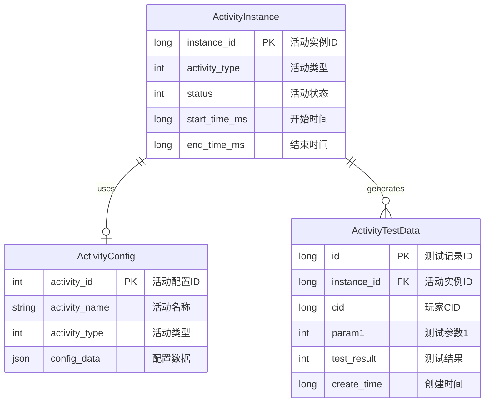
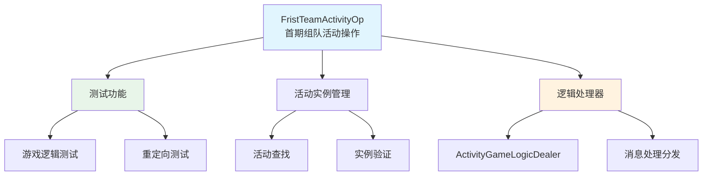
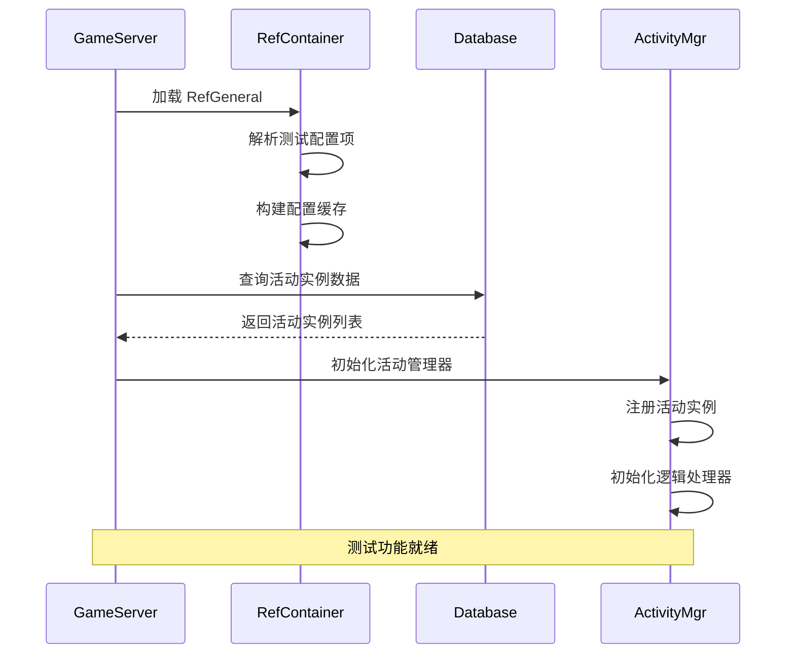
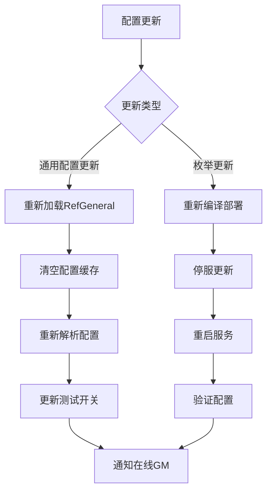

# 首期组队活动模块 - 数据配表

**模块名称**: FristTeamActivityOp（首期组队活动操作）
**模块编号**: p003
**文档版本**: 2.0
**更新日期**: 2026-04-12

---

## 一、配表总览



---

## 二、核心概念



---

## 三、配表文件列表

| 配表名称 | 文件路径 | 说明 |
|---------|---------|------|
| RefGeneral | GameRes/Refs/General/RefGeneral.java | 通用配置（含活动测试参数） |
| ActivityConfig | GameRes/Refs/Activity/ | 活动配置表 |
| ActivityInstanceConfig | GameRes/Refs/Activity/ | 活动实例配置 |

---

## 四、通用配置 (RefGeneral)

### 4.1 活动测试相关配置项

| 配置项 | 类型 | 默认值 | 说明 |
|--------|------|--------|------|
| activity_test_enabled | bool | false | 是否启用活动测试功能 |
| activity_test_env_whitelist | List&lt;string&gt; | ["Development", "Test"] | 允许测试的环境列表 |
| activity_test_admin_only | bool | true | 生产环境是否仅限管理员使用 |

### 4.2 配置项详解

#### activity_test_enabled

**类型**: bool
**默认值**: false
**说明**: 全局开关，控制活动测试功能是否可用

**使用场景**:
```java
// 检查测试功能是否启用
boolean testEnabled = RefGeneral.Ref().activity_test_enabled;
if (!testEnabled) {
    return ActivityErr.TEST_DISABLED;
}
```

#### activity_test_env_whitelist

**类型**: List&lt;string&gt;
**默认值**: ["Development", "Test"]
**说明**: 允许使用测试功能的环境白名单

**取值范围**:
- Development: 开发环境
- Test: 测试环境
- Staging: 预发布环境
- Production: 生产环境

#### activity_test_admin_only

**类型**: bool
**默认值**: true
**说明**: 生产环境中是否仅限管理员使用测试功能

**设计意图**:
- 生产环境默认限制测试权限
- 仅管理员可执行测试操作
- 防止普通玩家误操作

### 4.3 配置示例

```json
{
    "activity_test_enabled": true,
    "activity_test_env_whitelist": ["Development", "Test", "Staging"],
    "activity_test_admin_only": true
}
```

---

## 五、枚举定义

### 5.1 EActivityTestType - 测试类型

**文件路径**: `Common/Enum/EActivityTestType.java`

| 枚举值 | 数值 | 说明 | 使用场景 |
|--------|------|------|----------|
| NONE | 0 | 无 | 默认值 |
| GAME_LOGIC | 1 | 游戏逻辑测试 | 测试活动核心逻辑 |
| REDIRECT | 2 | 重定向测试 | 测试逻辑重定向功能 |

```java
public enum EActivityTestType {
    NONE(0, "无"),
    GAME_LOGIC(1, "游戏逻辑测试"),
    REDIRECT(2, "重定向测试");

    private final int value;
    private final String desc;

    EActivityTestType(int value, String desc) {
        this.value = value;
        this.desc = desc;
    }

    public int getValue() { return value; }
    public String getDesc() { return desc; }

    public static EActivityTestType fromInt(int value) {
        for (EActivityTestType type : values()) {
            if (type.value == value) return type;
        }
        return NONE;
    }
}
```

### 5.2 EActivityTestResult - 测试结果

**文件路径**: `Common/Enum/EActivityTestResult.java`

| 枚举值 | 数值 | 说明 | 处理建议 |
|--------|------|------|----------|
| SUCCESS | 0 | 成功 | 无需处理 |
| ACTIVITY_NOT_FOUND | 1 | 活动未找到 | 检查活动实例ID |
| OBJ_ERROR | 2 | 对象错误 | 检查内部对象状态 |
| PERMISSION_DENIED | 3 | 权限不足 | 检查用户权限 |
| ENV_RESTRICTED | 4 | 环境受限 | 检查环境配置 |

```java
public enum EActivityTestResult {
    SUCCESS(0, "成功"),
    ACTIVITY_NOT_FOUND(1, "活动未找到"),
    OBJ_ERROR(2, "对象错误"),
    PERMISSION_DENIED(3, "权限不足"),
    ENV_RESTRICTED(4, "环境受限");

    private final int value;
    private final String desc;

    EActivityTestResult(int value, String desc) {
        this.value = value;
        this.desc = desc;
    }

    public int getValue() { return value; }
    public String getDesc() { return desc; }
}
```

### 5.3 EActivityStatus - 活动状态

**文件路径**: `Common/Enum/EActivityStatus.java`

| 枚举值 | 数值 | 说明 | 可操作 |
|--------|------|------|--------|
| NOT_INITIALIZED | 0 | 未初始化 | 否 |
| INITIALIZED | 1 | 已初始化 | 可开始 |
| RUNNING | 2 | 运行中 | 可测试 |
| ENDED | 3 | 已结束 | 否 |
| DESTROYED | 4 | 已销毁 | 否 |

```java
public enum EActivityStatus {
    NOT_INITIALIZED(0, "未初始化"),
    INITIALIZED(1, "已初始化"),
    RUNNING(2, "运行中"),
    ENDED(3, "已结束"),
    DESTROYED(4, "已销毁");

    private final int value;
    private final String desc;

    EActivityStatus(int value, String desc) {
        this.value = value;
        this.desc = desc;
    }

    public int getValue() { return value; }
    public String getDesc() { return desc; }

    public boolean canTest() {
        return this == RUNNING;
    }
}
```

---

## 六、数据结构

### 6.1 ActivityTestRequest - 测试请求数据

**路径**: `ClientProtocol/Common/ActivityObj/ActivityTestRequest.cs`

| 字段名 | 类型 | 必填 | 默认值 | 说明 | 示例值 |
|--------|------|------|--------|------|--------|
| instanceId | long | 是 | 0 | 活动实例ID | 100001 |
| testType | EActivityTestType | 是 | NONE | 测试类型 | GAME_LOGIC |
| param1 | int | 否 | 0 | 测试参数1 | 100 |
| redirectTarget | int | 否 | 0 | 重定向目标 | 2 |

```csharp
public class ActivityTestRequest : _IALProtocolStructure
{
    private long instanceId;              // 活动实例ID
    private EActivityTestType testType;   // 测试类型
    private int param1;                   // 测试参数1
    private int redirectTarget;           // 重定向目标

    public byte getMainOrder() { return (byte)3; }
    public byte getSubOrder() { return (byte)0; }

    /// <summary>
    /// 验证请求参数
    /// </summary>
    public bool isValid()
    {
        if (instanceId <= 0) return false;
        if (testType == EActivityTestType.NONE) return false;
        return true;
    }
}
```

### 6.2 ActivityTestResponse - 测试响应数据

**路径**: `ClientProtocol/Common/ActivityObj/ActivityTestResponse.cs`

| 字段名 | 类型 | 必填 | 说明 |
|--------|------|------|------|
| resultCode | EActivityTestResult | 是 | 测试结果码 |
| param1 | int | 否 | 返回参数1 |
| errorMsg | string | 否 | 错误信息 |

```csharp
public class ActivityTestResponse : _IALProtocolStructure
{
    private EActivityTestResult resultCode;  // 测试结果码
    private int param1;                       // 返回参数1
    private string errorMsg;                  // 错误信息

    public byte getMainOrder() { return (byte)3; }
    public byte getSubOrder() { return (byte)1; }

    /// <summary>
    /// 判断测试是否成功
    /// </summary>
    public bool isSuccess()
    {
        return resultCode == EActivityTestResult.SUCCESS;
    }

    /// <summary>
    /// 获取错误描述
    /// </summary>
    public string getErrorDesc()
    {
        if (isSuccess()) return "成功";
        return string.IsNullOrEmpty(errorMsg) ? resultCode.getDesc() : errorMsg;
    }
}
```

### 6.3 ActivityInstanceInfo - 活动实例信息

**路径**: `ClientProtocol/Common/ActivityObj/ActivityInstanceInfo.cs`

| 字段名 | 类型 | 必填 | 说明 |
|--------|------|------|------|
| instanceId | long | 是 | 活动实例ID |
| activityType | int | 是 | 活动类型 |
| status | EActivityStatus | 是 | 活动状态 |
| startTimeMs | long | 是 | 开始时间(毫秒) |
| endTimeMs | long | 是 | 结束时间(毫秒) |

```csharp
public class ActivityInstanceInfo : _IALProtocolStructure
{
    private long instanceId;              // 活动实例ID
    private int activityType;             // 活动类型
    private EActivityStatus status;       // 活动状态
    private long startTimeMs;             // 开始时间(毫秒)
    private long endTimeMs;               // 结束时间(毫秒)

    public byte getMainOrder() { return (byte)3; }
    public byte getSubOrder() { return (byte)2; }

    /// <summary>
    /// 判断活动是否可测试
    /// </summary>
    public bool canTest()
    {
        return status.canTest();
    }

    /// <summary>
    /// 获取剩余时间(毫秒)
    /// </summary>
    public long getRemainTimeMs(long currentTimeMs)
    {
        return Math.Max(0, endTimeMs - currentTimeMs);
    }
}
```

---

## 七、数据库设计

### 7.1 活动实例数据表 (activity_instance)

```sql
CREATE TABLE IF NOT EXISTS `activity_instance` (
    `id` bigint(20) NOT NULL AUTO_INCREMENT COMMENT '自增主键',
    `instance_id` bigint(20) NOT NULL DEFAULT '0' COMMENT '活动实例ID',
    `activity_type` int(11) NOT NULL DEFAULT '0' COMMENT '活动类型',
    `status` int(11) NOT NULL DEFAULT '0' COMMENT '活动状态(0未初始化,1已初始化,2运行中,3已结束,4已销毁)',
    `start_time_ms` bigint(20) NOT NULL DEFAULT '0' COMMENT '开始时间(毫秒)',
    `end_time_ms` bigint(20) NOT NULL DEFAULT '0' COMMENT '结束时间(毫秒)',
    `config_data` json COMMENT '配置数据',
    `create_time` datetime DEFAULT CURRENT_TIMESTAMP COMMENT '创建时间',
    `update_time` datetime DEFAULT CURRENT_TIMESTAMP ON UPDATE CURRENT_TIMESTAMP COMMENT '更新时间',
    PRIMARY KEY (`id`),
    UNIQUE KEY `uk_instance_id` (`instance_id`),
    KEY `idx_activity_type` (`activity_type`),
    KEY `idx_status` (`status`),
    KEY `idx_end_time` (`end_time_ms`)
) COMMENT='活动实例数据表' engine=InnoDB DEFAULT CHARSET=utf8mb4;
```

### 7.2 活动测试记录表 (activity_test_log)

```sql
CREATE TABLE IF NOT EXISTS `activity_test_log` (
    `id` bigint(20) NOT NULL AUTO_INCREMENT COMMENT '自增主键',
    `instance_id` bigint(20) NOT NULL DEFAULT '0' COMMENT '活动实例ID',
    `cid` bigint(20) NOT NULL DEFAULT '0' COMMENT '玩家CID',
    `test_type` int(11) NOT NULL DEFAULT '0' COMMENT '测试类型(1游戏逻辑,2重定向)',
    `param1` int(11) NOT NULL DEFAULT '0' COMMENT '测试参数1',
    `redirect_target` int(11) NOT NULL DEFAULT '0' COMMENT '重定向目标',
    `result_code` int(11) NOT NULL DEFAULT '0' COMMENT '测试结果码',
    `error_msg` varchar(255) DEFAULT NULL COMMENT '错误信息',
    `execute_time_ms` bigint(20) NOT NULL DEFAULT '0' COMMENT '执行耗时(毫秒)',
    `create_time` datetime DEFAULT CURRENT_TIMESTAMP COMMENT '创建时间',
    PRIMARY KEY (`id`),
    KEY `idx_instance_id` (`instance_id`),
    KEY `idx_cid` (`cid`),
    KEY `idx_create_time` (`create_time`)
) COMMENT='活动测试记录表' engine=InnoDB DEFAULT CHARSET=utf8mb4;
```

---

## 八、数据关系图

```mermaid
flowchart LR
    subgraph 配置数据
        A[RefGeneral<br/>通用配置]
        B[ActivityConfig<br/>活动配置]
        C[EActivityTestType<br/>测试类型枚举]
    end

    subgraph 运行时数据
        D[ActivityInstance<br/>活动实例]
        E[ActivityTestLog<br/>测试记录]
        F[ActivityTestRequest<br/>测试请求(内存)]
    end

    subgraph 关联模块
        G[CommonActivityMgr<br/>活动管理器]
        H[ActivityGameLogicDealer<br/>逻辑处理器]
    end

    A --> D
    B --> D
    C --> F

    D --> G
    G --> H
    F --> E
```

---

## 九、配表加载流程



---

## 十、配置热更新



---

## 十一、配置校验规则

| 配置项 | 校验规则 | 错误级别 |
|--------|----------|----------|
| activity_test_enabled | 必须为布尔值 | WARN |
| activity_test_env_whitelist | 不能为空列表 | ERROR |
| activity_test_admin_only | 必须为布尔值 | INFO |

---

## 十二、代码示例

### 12.1 Java服务端 - 获取配置

```java
// 获取测试配置
boolean testEnabled = RefGeneral.Ref().activity_test_enabled;
List<String> envWhitelist = RefGeneral.Ref().activity_test_env_whitelist;
boolean adminOnly = RefGeneral.Ref().activity_test_admin_only;

// 检查当前环境是否允许测试
String currentEnv = ServerConfig.getEnvironment();
boolean envAllowed = envWhitelist.contains(currentEnv);

// 检查权限
boolean hasPermission = checkPermission(cid, adminOnly, envAllowed);
if (!hasPermission) {
    return ActivityErr.PERMISSION_DENIED;
}
```

### 12.2 C#客户端 - 获取配置

```csharp
// 获取测试配置
bool testEnabled = GRefdataCoreMgr.instance.generalRef.activity_test_enabled;
List<string> envWhitelist = GRefdataCoreMgr.instance.generalRef.activity_test_env_whitelist;

// 判断是否可用
bool canTest = testEnabled && envWhitelist.Contains(CurrentEnvironment.Name);
Debug.Log($"活动测试功能可用: {canTest}");
```

---

## 十三、配表路径汇总

| 文件名 | 路径 | 说明 |
|--------|------|------|
| RefGeneral.java | GameRes/Refs/General/ | 通用配置 |
| EActivityTestType.java | Common/Enum/ | 测试类型枚举 |
| EActivityTestResult.java | Common/Enum/ | 测试结果枚举 |
| EActivityStatus.java | Common/Enum/ | 活动状态枚举 |
| ActivityTestRequest.cs | ClientProtocol/Common/ActivityObj/ | 测试请求协议 |
| ActivityTestResponse.cs | ClientProtocol/Common/ActivityObj/ | 测试响应协议 |
| ActivityInstanceInfo.cs | ClientProtocol/Common/ActivityObj/ | 活动实例信息协议 |

---

*文档生成时间: 2026-04-12*
*文档版本: v2.0*
