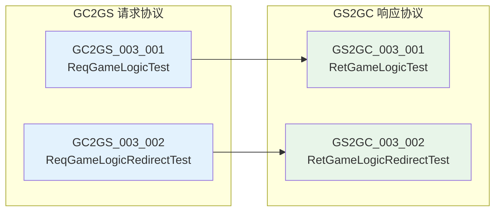
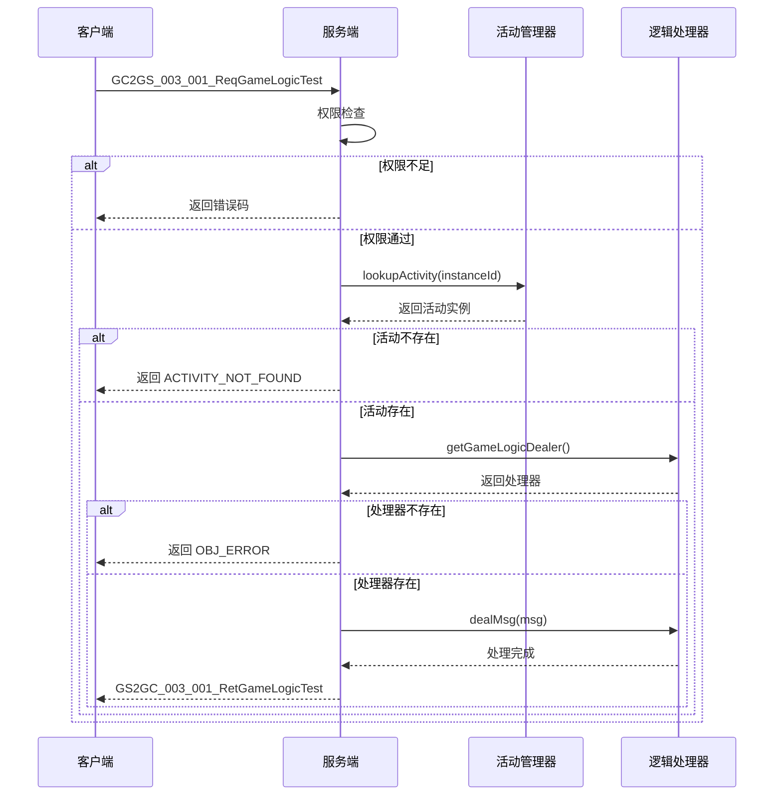
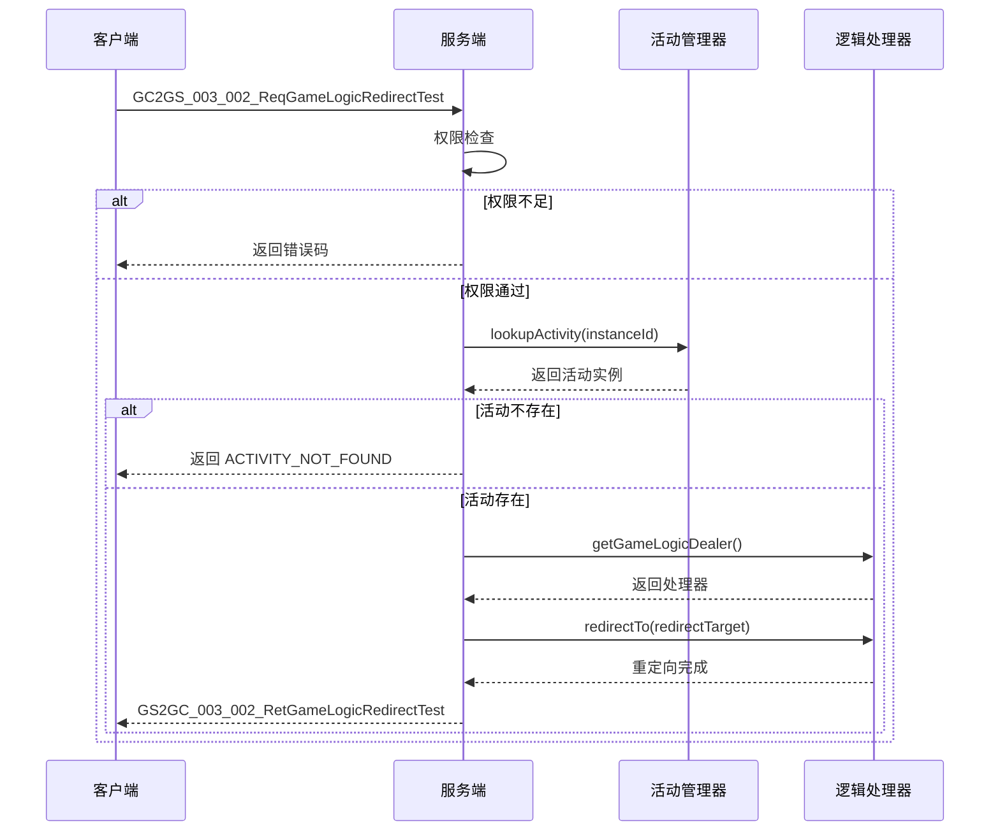
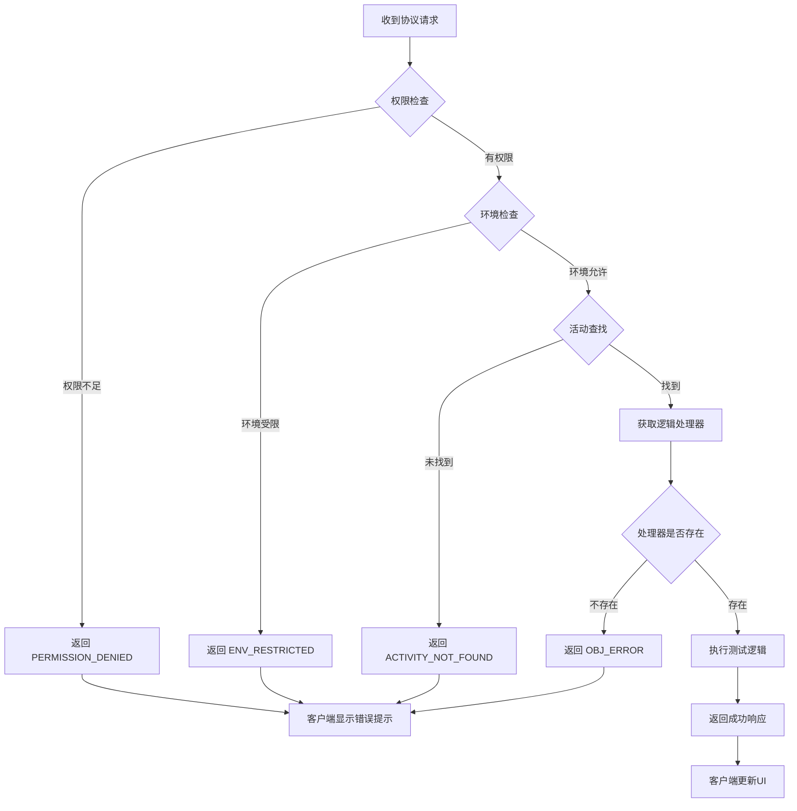
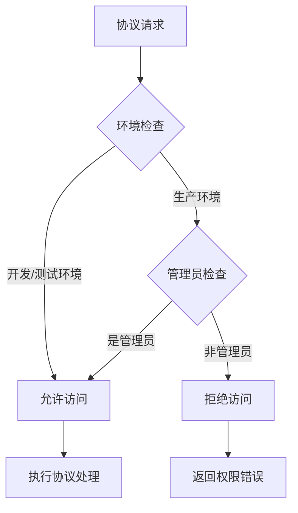

# 首期组队活动模块 - 协议文档

**模块名称**: FristTeamActivityOp（首期组队活动操作）
**协议模块编号**: p003
**文档版本**: 2.0
**更新日期**: 2026-04-12

---

## 一、协议总览



---

## 二、客户端请求协议 (GC2GS)

### 2.1 GC2GS_003_001_ReqGameLogicTest - 游戏逻辑测试请求

**协议编号**: `003_001`
**功能说明**: 测试游戏主体逻辑，验证活动逻辑的正确性
**权限要求**: 开发环境可用 / 生产环境需管理员权限

#### 请求参数

| 字段名 | 类型 | 必填 | 默认值 | 说明 | 示例值 |
|--------|------|------|--------|------|--------|
| instanceId | long | 是 | - | 活动实例ID | 100001 |
| param1 | int | 否 | 0 | 测试参数1 | 100 |

#### 参数详解

##### instanceId

**类型**: long
**必填**: 是
**说明**: 要测试的活动实例的唯一标识符

**取值范围**: > 0

**验证规则**:
```java
// 服务端验证
if (instanceId <= 0) {
    return ActivityErr.INVALID_INSTANCE_ID;
}
```

##### param1

**类型**: int
**必填**: 否
**默认值**: 0
**说明**: 传递给活动逻辑处理器的测试参数

**取值范围**: Integer范围

#### 协议结构

```csharp
/// <summary>
/// 游戏逻辑测试请求
/// </summary>
public class GC2GS_003_001_ReqGameLogicTest : _IALProtocolMessage
{
    /// <summary>
    /// 活动实例ID
    /// </summary>
    private long instanceId;

    /// <summary>
    /// 测试参数1
    /// </summary>
    private int param1;

    public byte getMainOrder() { return (byte)3; }
    public byte getSubOrder() { return (byte)1; }

    // Getter/Setter
    public long getInstanceId() { return instanceId; }
    public void setInstanceId(long value) { instanceId = value; }

    public int getParam1() { return param1; }
    public void setParam1(int value) { param1 = value; }
}
```

#### 客户端调用示例

```csharp
// 创建测试请求
var req = new GC2GS_003_001_ReqGameLogicTest();
req.setInstanceId(activityInstanceId);
req.setParam1(testValue);

// 发送协议
NetworkManager.Instance.Send(req);

// 或使用回调方式
NPPlayer.instance.sendMsg(req, (response) =>
{
    var retMsg = response as GS2GC_003_001_RetGameLogicTest;
    if (retMsg != null)
    {
        Debug.Log($"测试结果: {retMsg.getParam1()}");
    }
});
```

#### GM命令调用

```bash
# 测试游戏逻辑
/gm activity test_logic <instanceId> <param1>

# 示例
/gm activity test_logic 100001 100
```

---

### 2.2 GC2GS_003_002_ReqGameLogicRedirectTest - 游戏逻辑重定向测试请求

**协议编号**: `003_002`
**功能说明**: 测试游戏逻辑重定向功能，验证重定向机制的正确性
**权限要求**: 开发环境可用 / 生产环境需管理员权限

#### 请求参数

| 字段名 | 类型 | 必填 | 默认值 | 说明 | 示例值 |
|--------|------|------|--------|------|--------|
| instanceId | long | 是 | - | 活动实例ID | 100001 |
| redirectTarget | int | 是 | - | 重定向目标 | 2 |

#### 参数详解

##### instanceId

**类型**: long
**必填**: 是
**说明**: 要测试的活动实例的唯一标识符

##### redirectTarget

**类型**: int
**必填**: 是
**说明**: 重定向目标标识，用于指定逻辑重定向的目标位置

**取值范围**: > 0

#### 协议结构

```csharp
/// <summary>
/// 游戏逻辑重定向测试请求
/// </summary>
public class GC2GS_003_002_ReqGameLogicRedirectTest : _IALProtocolMessage
{
    /// <summary>
    /// 活动实例ID
    /// </summary>
    private long instanceId;

    /// <summary>
    /// 重定向目标
    /// </summary>
    private int redirectTarget;

    public byte getMainOrder() { return (byte)3; }
    public byte getSubOrder() { return (byte)2; }

    // Getter/Setter
    public long getInstanceId() { return instanceId; }
    public void setInstanceId(long value) { instanceId = value; }

    public int getRedirectTarget() { return redirectTarget; }
    public void setRedirectTarget(int value) { redirectTarget = value; }
}
```

#### 客户端调用示例

```csharp
// 创建重定向测试请求
var req = new GC2GS_003_002_ReqGameLogicRedirectTest();
req.setInstanceId(activityInstanceId);
req.setRedirectTarget(2);

// 发送协议
NetworkManager.Instance.Send(req);

// 或使用回调方式
NPPlayer.instance.sendMsg(req, (response) =>
{
    var retMsg = response as GS2GC_003_002_RetGameLogicRedirectTest;
    if (retMsg != null)
    {
        Debug.Log($"重定向测试成功");
    }
});
```

---

## 三、服务端响应协议 (GS2GC)

### 3.1 GS2GC_003_001_RetGameLogicTest - 游戏逻辑测试响应

**协议编号**: `003_001`
**功能说明**: 返回游戏逻辑测试的结果

#### 响应参数

| 字段名 | 类型 | 必填 | 说明 |
|--------|------|------|------|
| param1 | int | 否 | 测试参数1（返回值） |

#### 响应结构

```csharp
/// <summary>
/// 游戏逻辑测试响应
/// </summary>
public class GS2GC_003_001_RetGameLogicTest : _IALProtocolMessage
{
    /// <summary>
    /// 测试参数1（返回值）
    /// </summary>
    private int param1;

    public byte getMainOrder() { return (byte)3; }
    public byte getSubOrder() { return (byte)1; }

    // Getter/Setter
    public int getParam1() { return param1; }
    public void setParam1(int value) { param1 = value; }
}
```

#### 响应示例

```json
{
    "mainOrder": 3,
    "subOrder": 1,
    "param1": 100
}
```

---

### 3.2 GS2GC_003_002_RetGameLogicRedirectTest - 游戏逻辑重定向测试响应

**协议编号**: `003_002`
**功能说明**: 返回游戏逻辑重定向测试的结果

#### 响应参数

此协议无额外参数，仅表示重定向测试执行成功。

#### 响应结构

```csharp
/// <summary>
/// 游戏逻辑重定向测试响应
/// </summary>
public class GS2GC_003_002_RetGameLogicRedirectTest : _IALProtocolMessage
{
    public byte getMainOrder() { return (byte)3; }
    public byte getSubOrder() { return (byte)2; }
}
```

---

## 四、协议调用流程

### 4.1 游戏逻辑测试流程



### 4.2 游戏逻辑重定向测试流程



---

## 五、错误码定义

### 5.1 模块错误码

| 错误码 | 错误名 | 说明 | 客户端提示 |
|--------|--------|------|-----------|
| 30001 | ACTIVITY_NOT_FOUND | 活动未找到 | "指定的活动实例不存在" |
| 30002 | OBJ_ERROR | 对象错误 | "内部对象获取失败" |
| 30003 | PERMISSION_DENIED | 权限不足 | "无测试权限" |
| 30004 | ENV_RESTRICTED | 环境受限 | "当前环境禁止测试" |
| 30005 | TEST_DISABLED | 测试功能禁用 | "测试功能已禁用" |
| 30006 | INVALID_INSTANCE_ID | 无效实例ID | "活动实例ID无效" |

### 5.2 错误码枚举定义

```java
public enum FristTeamActivityErr {
    ACTIVITY_NOT_FOUND(30001, "活动未找到"),
    OBJ_ERROR(30002, "对象错误"),
    PERMISSION_DENIED(30003, "权限不足"),
    ENV_RESTRICTED(30004, "环境受限"),
    TEST_DISABLED(30005, "测试功能禁用"),
    INVALID_INSTANCE_ID(30006, "无效实例ID");

    private final int code;
    private final String desc;

    FristTeamActivityErr(int code, String desc) {
        this.code = code;
        this.desc = desc;
    }

    public int getCode() { return code; }
    public String getDesc() { return desc; }
}
```

### 5.3 错误处理流程



---

## 六、协议数据结构详解

### 6.1 完整请求协议定义

```csharp
/// <summary>
/// 首期组队活动操作 - 游戏逻辑测试请求
/// </summary>
/// <remarks>
/// 协议号: 003_001
/// 方向: GC2GS (客户端 -> 服务端)
/// 权限: 开发环境可用 / 生产环境需管理员权限
/// </remarks>
public class GC2GS_003_001_ReqGameLogicTest : _IALProtocolMessage
{
    private long instanceId;  // 活动实例ID，必填，>0
    private int param1;       // 测试参数1，选填

    public byte getMainOrder() { return (byte)3; }
    public byte getSubOrder() { return (byte)1; }

    public long getInstanceId() { return instanceId; }
    public void setInstanceId(long value) { instanceId = value; }

    public int getParam1() { return param1; }
    public void setParam1(int value) { param1 = value; }

    /// <summary>
    /// 验证协议参数
    /// </summary>
    public bool isValid()
    {
        return instanceId > 0;
    }
}

/// <summary>
/// 首期组队活动操作 - 游戏逻辑重定向测试请求
/// </summary>
/// <remarks>
/// 协议号: 003_002
/// 方向: GC2GS (客户端 -> 服务端)
/// 权限: 开发环境可用 / 生产环境需管理员权限
/// </remarks>
public class GC2GS_003_002_ReqGameLogicRedirectTest : _IALProtocolMessage
{
    private long instanceId;      // 活动实例ID，必填，>0
    private int redirectTarget;   // 重定向目标，必填，>0

    public byte getMainOrder() { return (byte)3; }
    public byte getSubOrder() { return (byte)2; }

    public long getInstanceId() { return instanceId; }
    public void setInstanceId(long value) { instanceId = value; }

    public int getRedirectTarget() { return redirectTarget; }
    public void setRedirectTarget(int value) { redirectTarget = value; }

    /// <summary>
    /// 验证协议参数
    /// </summary>
    public bool isValid()
    {
        return instanceId > 0 && redirectTarget > 0;
    }
}
```

### 6.2 完整响应协议定义

```csharp
/// <summary>
/// 首期组队活动操作 - 游戏逻辑测试响应
/// </summary>
/// <remarks>
/// 协议号: 003_001
/// 方向: GS2GC (服务端 -> 客户端)
/// </remarks>
public class GS2GC_003_001_RetGameLogicTest : _IALProtocolMessage
{
    private int param1;  // 测试参数1返回值

    public byte getMainOrder() { return (byte)3; }
    public byte getSubOrder() { return (byte)1; }

    public int getParam1() { return param1; }
    public void setParam1(int value) { param1 = value; }
}

/// <summary>
/// 首期组队活动操作 - 游戏逻辑重定向测试响应
/// </summary>
/// <remarks>
/// 协议号: 003_002
/// 方向: GS2GC (服务端 -> 客户端)
/// </remarks>
public class GS2GC_003_002_RetGameLogicRedirectTest : _IALProtocolMessage
{
    public byte getMainOrder() { return (byte)3; }
    public byte getSubOrder() { return (byte)2; }
}
```

---

## 七、服务端协议构造示例

### 7.1 构造游戏逻辑测试响应

```java
/**
 * 构造游戏逻辑测试响应
 */
public GS2GC_003_001_RetGameLogicTest makeGameLogicTestResponse(int param1)
{
    GS2GC_003_001_RetGameLogicTest response = new GS2GC_003_001_RetGameLogicTest();
    response.setParam1(param1);
    return response;
}
```

### 7.2 构造游戏逻辑重定向测试响应

```java
/**
 * 构造游戏逻辑重定向测试响应
 */
public GS2GC_003_002_RetGameLogicRedirectTest makeRedirectTestResponse()
{
    GS2GC_003_002_RetGameLogicRedirectTest response = new GS2GC_003_002_RetGameLogicRedirectTest();
    return response;
}
```

### 7.3 发送错误响应

```java
/**
 * 发送错误响应
 */
public void sendError(_ANPUSUserBasicMsgItem commiter, int errorCode, String errorMsg)
{
    // 记录错误日志
    Logger.Error($"FristTeamActivityOp 错误: code={errorCode}, msg={errorMsg}");

    // 发送通用错误响应
    US2GCWriter_003_FristTeamActivityOp.sendError(commiter, errorCode, errorMsg);
}
```

---

## 八、客户端协议处理示例

### 8.1 游戏逻辑测试请求处理

```csharp
/// <summary>
/// 发送游戏逻辑测试请求
/// </summary>
/// <param name="instanceId">活动实例ID</param>
/// <param name="param1">测试参数</param>
/// <param name="callback">回调函数</param>
public void sendGameLogicTest(long instanceId, int param1,
    Action<GS2GC_003_001_RetGameLogicTest> callback)
{
    var req = new GC2GS_003_001_ReqGameLogicTest();
    req.setInstanceId(instanceId);
    req.setParam1(param1);

    NPPlayer.instance.sendMsg(req, (response) =>
    {
        var retMsg = response as GS2GC_003_001_RetGameLogicTest;
        if (retMsg != null)
        {
            Debug.Log($"游戏逻辑测试成功，返回值: {retMsg.getParam1()}");
        }
        callback?.Invoke(retMsg);
    });
}
```

### 8.2 重定向测试请求处理

```csharp
/// <summary>
/// 发送游戏逻辑重定向测试请求
/// </summary>
/// <param name="instanceId">活动实例ID</param>
/// <param name="redirectTarget">重定向目标</param>
/// <param name="callback">回调函数</param>
public void sendRedirectTest(long instanceId, int redirectTarget,
    Action<GS2GC_003_002_RetGameLogicRedirectTest> callback)
{
    var req = new GC2GS_003_002_ReqGameLogicRedirectTest();
    req.setInstanceId(instanceId);
    req.setRedirectTarget(redirectTarget);

    NPPlayer.instance.sendMsg(req, (response) =>
    {
        var retMsg = response as GS2GC_003_002_RetGameLogicRedirectTest;
        if (retMsg != null)
        {
            Debug.Log($"重定向测试成功");
        }
        callback?.Invoke(retMsg);
    });
}
```

---

## 九、协议调试工具

### 9.1 协议日志格式

```
[FristTeamActivityOp] 请求: GC2GS_003_001_ReqGameLogicTest, cid=12345, instanceId=100001, param1=100
[FristTeamActivityOp] 响应: GS2GC_003_001_RetGameLogicTest, cid=12345, param1=100
[FristTeamActivityOp] 错误: ACTIVITY_NOT_FOUND, cid=12345, instanceId=999999
```

### 9.2 协议调试命令

```bash
# 测试游戏逻辑
/gm activity test_logic <instanceId> <param1>

# 测试重定向
/gm activity test_redirect <instanceId> <redirectTarget>

# 查看活动实例信息
/gm activity info <instanceId>

# 列出所有活动实例
/gm activity list

# 启用/禁用测试功能
/gm activity test_enable <true/false>
```

---

## 十、协议安全说明

### 10.1 权限控制



### 10.2 安全建议

1. **环境隔离**: 测试协议仅在开发和测试环境开放
2. **权限验证**: 生产环境必须验证管理员权限
3. **日志记录**: 所有测试操作必须记录日志
4. **频率限制**: 建议对测试请求添加频率限制

---

## 十一、协议文件路径

| 文件名 | 路径 | 说明 |
|--------|------|------|
| GC2GS_003_001_ReqGameLogicTest.java | ServerProtocol/src/GC2GS/p003_FristTeamActivityOp/ | 游戏逻辑测试请求(服务端) |
| GC2GS_003_002_ReqGameLogicRedirectTest.java | ServerProtocol/src/GC2GS/p003_FristTeamActivityOp/ | 重定向测试请求(服务端) |
| GS2GC_003_001_RetGameLogicTest.java | ServerProtocol/src/GS2GC/p003_FristTeamActivityOp/ | 游戏逻辑测试响应(服务端) |
| GS2GC_003_002_RetGameLogicRedirectTest.java | ServerProtocol/src/GS2GC/p003_FristTeamActivityOp/ | 重定向测试响应(服务端) |
| GC2GS_003_001_ReqGameLogicTest.cs | ClientProtocol/GC2GS/p003_FristTeamActivityOp/ | 游戏逻辑测试请求(客户端) |
| GC2GS_003_002_ReqGameLogicRedirectTest.cs | ClientProtocol/GC2GS/p003_FristTeamActivityOp/ | 重定向测试请求(客户端) |
| GS2GC_003_001_RetGameLogicTest.cs | ClientProtocol/GS2GC/p003_FristTeamActivityOp/ | 游戏逻辑测试响应(客户端) |
| GS2GC_003_002_RetGameLogicRedirectTest.cs | ClientProtocol/GS2GC/p003_FristTeamActivityOp/ | 重定向测试响应(客户端) |

---

*文档生成时间: 2026-04-12*
*文档版本: v2.0*
