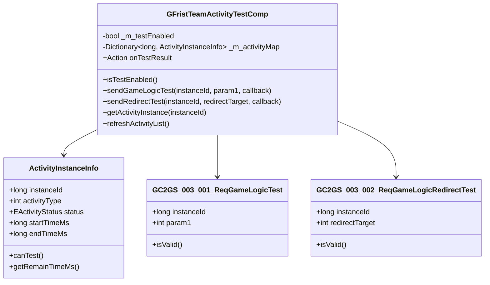

# 首期组队活动模块 - 客户端开发文档

**模块名称**: FristTeamActivityOp（首期组队活动操作）
**文档版本**: 2.0
**更新日期**: 2026-04-12

---

## 一、模块架构



---

## 二、组件数据层

### 2.1 核心组件类

#### GFristTeamActivityTestComp

**路径**: `GameComponent/FristTeamActivity/GFristTeamActivityTestComp.cs`

**继承关系**:
```
GFristTeamActivityTestComp : _ANPBasicPlayerComponent
```

**主要属性**:

| 属性名 | 类型 | 说明 |
|--------|------|------|
| _m_testEnabled | bool | 测试功能是否启用 |
| _m_activityMap | Dictionary&lt;long, ActivityInstanceInfo&gt; | 活动实例映射表 |
| onTestResult | Action&lt;int, int&gt; | 测试结果回调事件 |

**主要方法**:

| 方法名 | 返回类型 | 说明 |
|--------|----------|------|
| isTestEnabled() | bool | 检查测试功能是否启用 |
| sendGameLogicTest(long, int, Action) | void | 发送游戏逻辑测试请求 |
| sendRedirectTest(long, int, Action) | void | 发送重定向测试请求 |
| getActivityInstance(long) | ActivityInstanceInfo | 获取活动实例信息 |
| refreshActivityList() | void | 刷新活动实例列表 |

---

## 三、协议类文件位置

### 3.1 目录结构

```
game_client/Assets/Scripts/
├── ClientProtocol/
│   ├── GC2GS/p003_FristTeamActivityOp/
│   │   ├── GC2GS_003_001_ReqGameLogicTest.cs
│   │   └── GC2GS_003_002_ReqGameLogicRedirectTest.cs
│   └── GS2GC/p003_FristTeamActivityOp/
│       ├── GS2GC_003_001_RetGameLogicTest.cs
│       └── GS2GC_003_002_RetGameLogicRedirectTest.cs
├── GameComponent/
│   └── FristTeamActivity/
│       └── GFristTeamActivityTestComp.cs
└── GameWndGui/
    └── FristTeamActivity/
        ├── GGUIWndFristTeamActivityTest.cs
        └── GGUIFristTeamActivityTestItem.cs
```

---

## 四、协议发送详解

### 4.1 发送游戏逻辑测试请求

```csharp
using GC2GS.p003_FristTeamActivityOp;

/// <summary>
/// 发送游戏逻辑测试请求
/// </summary>
/// <param name="instanceId">活动实例ID</param>
/// <param name="testParam">测试参数</param>
/// <param name="callback">回调函数</param>
public void sendGameLogicTest(long instanceId, int testParam,
    Action<GS2GC_003_001_RetGameLogicTest> callback)
{
    // 1. 检查测试功能是否启用
    if (!isTestEnabled())
    {
        Debug.LogWarning("测试功能未启用");
        callback?.Invoke(null);
        return;
    }

    // 2. 创建请求协议
    var req = new GC2GS_003_001_ReqGameLogicTest();
    req.setInstanceId(instanceId);
    req.setParam1(testParam);

    // 3. 验证参数
    if (!req.isValid())
    {
        Debug.LogError($"请求参数无效: instanceId={instanceId}");
        callback?.Invoke(null);
        return;
    }

    // 4. 发送协议
    NPPlayer.instance.sendMsg(req, (response) =>
    {
        var retMsg = response as GS2GC_003_001_RetGameLogicTest;
        if (retMsg != null)
        {
            Debug.Log($"游戏逻辑测试成功，返回值: {retMsg.getParam1()}");
            onTestResult?.Invoke((int)EActivityTestType.GAME_LOGIC, retMsg.getParam1());
        }
        callback?.Invoke(retMsg);
    });
}
```

### 4.2 发送重定向测试请求

```csharp
using GC2GS.p003_FristTeamActivityOp;

/// <summary>
/// 发送游戏逻辑重定向测试请求
/// </summary>
/// <param name="instanceId">活动实例ID</param>
/// <param name="redirectTarget">重定向目标</param>
/// <param name="callback">回调函数</param>
public void sendRedirectTest(long instanceId, int redirectTarget,
    Action<GS2GC_003_002_RetGameLogicRedirectTest> callback)
{
    // 1. 检查测试功能是否启用
    if (!isTestEnabled())
    {
        Debug.LogWarning("测试功能未启用");
        callback?.Invoke(null);
        return;
    }

    // 2. 创建请求协议
    var req = new GC2GS_003_002_ReqGameLogicRedirectTest();
    req.setInstanceId(instanceId);
    req.setRedirectTarget(redirectTarget);

    // 3. 验证参数
    if (!req.isValid())
    {
        Debug.LogError($"请求参数无效: instanceId={instanceId}, redirectTarget={redirectTarget}");
        callback?.Invoke(null);
        return;
    }

    // 4. 发送协议
    NPPlayer.instance.sendMsg(req, (response) =>
    {
        var retMsg = response as GS2GC_003_002_RetGameLogicRedirectTest;
        if (retMsg != null)
        {
            Debug.Log($"重定向测试成功");
            onTestResult?.Invoke((int)EActivityTestType.REDIRECT, 0);
        }
        callback?.Invoke(retMsg);
    });
}
```

---

## 五、协议监听器

### 5.1 协议分发注册

**文件**: `GSProtocolDispather.cs`

```csharp
// 在协议分发器中注册
// 主序号3 -> FristTeamActivityOp 模块

/// <summary>
/// 注册 FristTeamActivityOp 模块协议监听
/// </summary>
public static void registerFristTeamActivityOpHandlers()
{
    // 注册游戏逻辑测试响应
    NPPlayer.instance.registerMsgHandler<GS2GC_003_001_RetGameLogicTest>(_onRetGameLogicTest);

    // 注册重定向测试响应
    NPPlayer.instance.registerMsgHandler<GS2GC_003_002_RetGameLogicRedirectTest>(_onRetRedirectTest);
}

/// <summary>
/// 取消注册 FristTeamActivityOp 模块协议监听
/// </summary>
public static void unregisterFristTeamActivityOpHandlers()
{
    NPPlayer.instance.unregisterMsgHandler<GS2GC_003_001_RetGameLogicTest>();
    NPPlayer.instance.unregisterMsgHandler<GS2GC_003_002_RetGameLogicRedirectTest>();
}
```

### 5.2 响应处理

```csharp
/// <summary>
/// 游戏逻辑测试响应处理
/// </summary>
private static void _onRetGameLogicTest(GS2GC_003_001_RetGameLogicTest msg)
{
    if (msg == null)
    {
        Debug.LogError("游戏逻辑测试响应为空");
        return;
    }

    int result = msg.getParam1();
    Debug.Log($"Game logic test result: {result}");

    // 触发事件
    NPPlayer.instance.fristTeamActivityTestComp?.onTestResult?.Invoke(
        (int)EActivityTestType.GAME_LOGIC, result);
}

/// <summary>
/// 重定向测试响应处理
/// </summary>
private static void _onRetRedirectTest(GS2GC_003_002_RetGameLogicRedirectTest msg)
{
    if (msg == null)
    {
        Debug.LogError("重定向测试响应为空");
        return;
    }

    Debug.Log("Redirect test completed successfully");

    // 触发事件
    NPPlayer.instance.fristTeamActivityTestComp?.onTestResult?.Invoke(
        (int)EActivityTestType.REDIRECT, 0);
}
```

---

## 六、调试工具集成

### 6.1 GM命令支持

```csharp
/// <summary>
/// GM命令处理器 - 活动测试
/// </summary>
public class GMActivityTestHandler
{
    /// <summary>
    /// 测试游戏逻辑
    /// 用法: /test activity_logic <instanceId> <param1>
    /// </summary>
    [GMCommand("activity_logic", "测试活动游戏逻辑", GMCommandLevel.Developer)]
    public static void testActivityLogic(string[] args)
    {
        if (args.Length < 2)
        {
            Debug.LogError("用法: /test activity_logic <instanceId> <param1>");
            return;
        }

        if (!long.TryParse(args[0], out long instanceId))
        {
            Debug.LogError("instanceId 必须是数字");
            return;
        }

        if (!int.TryParse(args[1], out int param1))
        {
            Debug.LogError("param1 必须是数字");
            return;
        }

        NPPlayer.instance.fristTeamActivityTestComp?.sendGameLogicTest(
            instanceId, param1, (msg) =>
            {
                if (msg != null)
                {
                    GCommon.showToast($"测试成功，返回值: {msg.getParam1()}");
                }
            });
    }

    /// <summary>
    /// 测试重定向
    /// 用法: /test activity_redirect <instanceId> <redirectTarget>
    /// </summary>
    [GMCommand("activity_redirect", "测试活动重定向", GMCommandLevel.Developer)]
    public static void testActivityRedirect(string[] args)
    {
        if (args.Length < 2)
        {
            Debug.LogError("用法: /test activity_redirect <instanceId> <redirectTarget>");
            return;
        }

        if (!long.TryParse(args[0], out long instanceId))
        {
            Debug.LogError("instanceId 必须是数字");
            return;
        }

        if (!int.TryParse(args[1], out int redirectTarget))
        {
            Debug.LogError("redirectTarget 必须是数字");
            return;
        }

        NPPlayer.instance.fristTeamActivityTestComp?.sendRedirectTest(
            instanceId, redirectTarget, (msg) =>
            {
                if (msg != null)
                {
                    GCommon.showToast("重定向测试成功");
                }
            });
    }
}
```

### 6.2 调试面板

```csharp
/// <summary>
/// 活动测试调试面板
/// </summary>
public class GGUIWndFristTeamActivityDebug : GGUIWndBase
{
    [SerializeField]
    private InputField _instanceIdInput;     // 活动实例ID输入框

    [SerializeField]
    private InputField _param1Input;          // 参数1输入框

    [SerializeField]
    private InputField _redirectTargetInput;  // 重定向目标输入框

    [SerializeField]
    private Button _testLogicBtn;             // 测试逻辑按钮

    [SerializeField]
    private Button _testRedirectBtn;          // 测试重定向按钮

    [SerializeField]
    private Text _resultText;                 // 结果文本

    protected override void _onInit()
    {
        base._onInit();

        // 绑定按钮事件
        _testLogicBtn.onClick.AddListener(_onClickTestLogic);
        _testRedirectBtn.onClick.AddListener(_onClickTestRedirect);

        // 注册事件
        NPPlayer.instance.fristTeamActivityTestComp.onTestResult += _onTestResult;
    }

    protected override void _onDestroy()
    {
        // 取消注册事件
        NPPlayer.instance.fristTeamActivityTestComp.onTestResult -= _onTestResult;

        base._onDestroy();
    }

    /// <summary>
    /// 点击测试逻辑按钮
    /// </summary>
    private void _onClickTestLogic()
    {
        if (!long.TryParse(_instanceIdInput.text, out long instanceId))
        {
            GCommon.showToast("请输入有效的活动实例ID");
            return;
        }

        int param1 = 0;
        if (!string.IsNullOrEmpty(_param1Input.text))
        {
            int.TryParse(_param1Input.text, out param1);
        }

        _resultText.text = "测试中...";
        NPPlayer.instance.fristTeamActivityTestComp.sendGameLogicTest(
            instanceId, param1, null);
    }

    /// <summary>
    /// 点击测试重定向按钮
    /// </summary>
    private void _onClickTestRedirect()
    {
        if (!long.TryParse(_instanceIdInput.text, out long instanceId))
        {
            GCommon.showToast("请输入有效的活动实例ID");
            return;
        }

        if (!int.TryParse(_redirectTargetInput.text, out int redirectTarget))
        {
            GCommon.showToast("请输入有效的重定向目标");
            return;
        }

        _resultText.text = "测试中...";
        NPPlayer.instance.fristTeamActivityTestComp.sendRedirectTest(
            instanceId, redirectTarget, null);
    }

    /// <summary>
    /// 测试结果回调
    /// </summary>
    private void _onTestResult(int testType, int result)
    {
        var type = (EActivityTestType)testType;
        _resultText.text = $"测试类型: {type}, 结果: {result}";
    }
}
```

---

## 七、状态检查

### 7.1 测试功能状态检查

```csharp
/// <summary>
/// 检查测试功能是否启用
/// </summary>
public bool isTestEnabled()
{
    // 1. 检查配置开关
    bool configEnabled = GRefdataCoreMgr.instance.generalRef.activity_test_enabled;
    if (!configEnabled)
    {
        return false;
    }

    // 2. 检查环境白名单
    List<string> envWhitelist = GRefdataCoreMgr.instance.generalRef.activity_test_env_whitelist;
    string currentEnv = CurrentEnvironment.Name;
    if (envWhitelist.Contains(currentEnv))
    {
        return true;
    }

    // 3. 生产环境检查管理员权限
    bool adminOnly = GRefdataCoreMgr.instance.generalRef.activity_test_admin_only;
    if (adminOnly)
    {
        return NPPlayer.instance.playerComp.isAdmin();
    }

    return false;
}

/// <summary>
/// 获取测试功能状态描述
/// </summary>
public string getTestStatusDesc()
{
    if (!GRefdataCoreMgr.instance.generalRef.activity_test_enabled)
    {
        return "测试功能已禁用";
    }

    List<string> envWhitelist = GRefdataCoreMgr.instance.generalRef.activity_test_env_whitelist;
    string currentEnv = CurrentEnvironment.Name;

    if (envWhitelist.Contains(currentEnv))
    {
        return "测试功能可用";
    }

    if (NPPlayer.instance.playerComp.isAdmin())
    {
        return "管理员权限可用";
    }

    return "当前环境禁止测试";
}
```

---

## 八、UI窗口开发

### 8.1 窗口目录结构

```
GameWndGui/GGui/FristTeamActivity/
├── GGUIWndFristTeamActivityTest.cs    # 测试主界面
├── GGUIWndFristTeamActivityDebug.cs   # 调试面板
├── ActivityTestItem.cs                # 测试项组件
└── ActivityTestResultItem.cs          # 测试结果组件
```

### 8.2 测试主界面

```csharp
/// <summary>
/// 首期组队活动测试主界面
/// </summary>
public class GGUIWndFristTeamActivityTest : GGUIWndBase
{
    [SerializeField]
    private Text _statusText;            // 状态文本

    [SerializeField]
    private Transform _activityListRoot; // 活动列表根节点

    [SerializeField]
    private GameObject _testPanel;       // 测试面板

    [SerializeField]
    private InputField _instanceIdInput; // 实例ID输入框

    [SerializeField]
    private InputField _param1Input;     // 参数输入框

    [SerializeField]
    private Button _executeBtn;          // 执行按钮

    [SerializeField]
    private Text _resultText;            // 结果文本

    private List<ActivityTestItem> _activityItems = new List<ActivityTestItem>();

    protected override void _onInit()
    {
        base._onInit();
        _executeBtn.onClick.AddListener(_onClickExecute);

        // 注册事件
        NPPlayer.instance.fristTeamActivityTestComp.onTestResult += _onTestResult;
    }

    protected override void _onDestroy()
    {
        NPPlayer.instance.fristTeamActivityTestComp.onTestResult -= _onTestResult;
        base._onDestroy();
    }

    protected override void _onOpen(object param)
    {
        base._onOpen(param);
        _refreshUI();
    }

    /// <summary>
    /// 刷新UI
    /// </summary>
    private void _refreshUI()
    {
        // 更新状态
        _statusText.text = NPPlayer.instance.fristTeamActivityTestComp.getTestStatusDesc();

        // 检查功能是否可用
        bool canTest = NPPlayer.instance.fristTeamActivityTestComp.isTestEnabled();
        _testPanel.SetActive(canTest);

        // 刷新活动列表
        _refreshActivityList();
    }

    /// <summary>
    /// 刷新活动列表
    /// </summary>
    private void _refreshActivityList()
    {
        // 清空旧数据
        foreach (var item in _activityItems)
        {
            Destroy(item.gameObject);
        }
        _activityItems.Clear();

        // TODO: 从活动管理器获取活动列表
        // 暂无活动列表接口
    }

    /// <summary>
    /// 点击执行按钮
    /// </summary>
    private void _onClickExecute()
    {
        if (!long.TryParse(_instanceIdInput.text, out long instanceId))
        {
            GCommon.showToast("请输入有效的活动实例ID");
            return;
        }

        int param1 = 0;
        if (!string.IsNullOrEmpty(_param1Input.text))
        {
            int.TryParse(_param1Input.text, out param1);
        }

        _resultText.text = "执行中...";
        NPPlayer.instance.fristTeamActivityTestComp.sendGameLogicTest(
            instanceId, param1, (msg) =>
            {
                if (msg != null)
                {
                    _resultText.text = $"测试成功，返回值: {msg.getParam1()}";
                }
                else
                {
                    _resultText.text = "测试失败";
                }
            });
    }

    /// <summary>
    /// 测试结果回调
    /// </summary>
    private void _onTestResult(int testType, int result)
    {
        _resultText.text = $"测试完成: 类型={testType}, 结果={result}";
    }
}
```

---

## 九、错误处理

### 9.1 错误码处理

```csharp
/// <summary>
/// 处理测试错误
/// </summary>
private void _handleTestError(int errorCode)
{
    string errorMsg = string.Empty;

    switch (errorCode)
    {
        case 30001:
            errorMsg = "活动未找到";
            break;
        case 30002:
            errorMsg = "对象错误";
            break;
        case 30003:
            errorMsg = "权限不足";
            break;
        case 30004:
            errorMsg = "环境受限";
            break;
        case 30005:
            errorMsg = "测试功能禁用";
            break;
        case 30006:
            errorMsg = "无效实例ID";
            break;
        default:
            errorMsg = $"未知错误: {errorCode}";
            break;
    }

    Debug.LogError($"活动测试错误: {errorMsg}");
    GCommon.showToast(errorMsg);
}
```

### 9.2 错误提示映射

```csharp
/// <summary>
/// 错误提示配置
/// </summary>
public static class FristTeamActivityErrorConfig
{
    private static readonly Dictionary<int, string> _errorMessages = new Dictionary<int, string>
    {
        { 30001, "指定的活动实例不存在" },
        { 30002, "内部对象获取失败" },
        { 30003, "无测试权限" },
        { 30004, "当前环境禁止测试" },
        { 30005, "测试功能已禁用" },
        { 30006, "活动实例ID无效" }
    };

    /// <summary>
    /// 获取错误消息
    /// </summary>
    public static string getErrorMessage(int errorCode)
    {
        if (_errorMessages.TryGetValue(errorCode, out string msg))
        {
            return msg;
        }
        return $"未知错误 ({errorCode})";
    }
}
```

---

## 十、性能优化建议

### 10.1 减少协议请求

```csharp
// 推荐：缓存测试结果
private Dictionary<long, int> _testResultCache = new Dictionary<long, int>();

public void sendGameLogicTestWithCache(long instanceId, int param1,
    Action<GS2GC_003_001_RetGameLogicTest> callback)
{
    // 检查缓存
    long cacheKey = instanceId * 1000 + param1;
    if (_testResultCache.TryGetValue(cacheKey, out int cachedResult))
    {
        var cachedMsg = new GS2GC_003_001_RetGameLogicTest();
        cachedMsg.setParam1(cachedResult);
        callback?.Invoke(cachedMsg);
        return;
    }

    // 发送请求
    sendGameLogicTest(instanceId, param1, (msg) =>
    {
        if (msg != null)
        {
            _testResultCache[cacheKey] = msg.getParam1();
        }
        callback?.Invoke(msg);
    });
}
```

### 10.2 事件监听管理

```csharp
/// <summary>
/// 正确管理事件监听生命周期
/// </summary>
public class FristTeamActivityTestUI : MonoBehaviour
{
    private bool _isEventRegistered = false;

    private void OnEnable()
    {
        if (!_isEventRegistered)
        {
            NPPlayer.instance.fristTeamActivityTestComp.onTestResult += _onTestResult;
            _isEventRegistered = true;
        }
    }

    private void OnDisable()
    {
        if (_isEventRegistered)
        {
            NPPlayer.instance.fristTeamActivityTestComp.onTestResult -= _onTestResult;
            _isEventRegistered = false;
        }
    }
}
```

---

## 十一、注意事项

1. **环境限制**: 本模块仅用于开发测试阶段，生产环境默认禁用
2. **权限验证**: 生产环境需要管理员权限才能使用测试功能
3. **日志记录**: 所有测试操作建议记录日志以便调试
4. **数据安全**: 测试操作不应影响正式业务数据
5. **性能考虑**: 避免频繁发送测试请求

---

*文档生成时间: 2026-04-12*
*文档版本: v2.0*
