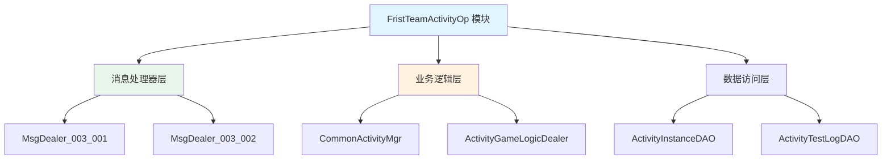
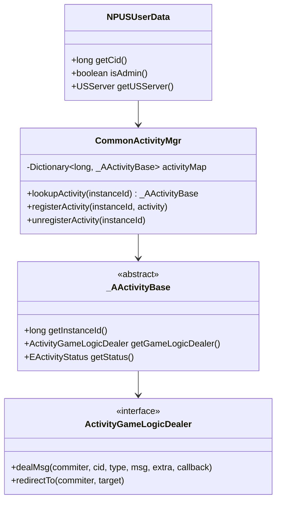

# 首期组队活动模块 - 服务端开发文档

**模块名称**: FristTeamActivityOp（首期组队活动操作）
**文档版本**: 2.0
**更新日期**: 2026-04-12

---

## 一、模块架构



---

## 二、目录结构

```
game_server/UserServer/src/NPUSServer/
├── NPUserMsgDispather/
│   └── p003_FristTeamActivityOp/
│       ├── MsgDealer_GC2GS_003_001_ReqGameLogicTest.java
│       └── MsgDealer_GC2GS_003_002_ReqGameLogicRedirectTest.java
└── NPUserMsgDispather/Write/
    └── US2GCWriter_003_FristTeamActivityOp.java

game_server/ServerProtocol/src/
├── GC2GS/p003_FristTeamActivityOp/
│   ├── GC2GS_003_001_ReqGameLogicTest.java
│   └── GC2GS_003_002_ReqGameLogicRedirectTest.java
└── GS2GC/p003_FristTeamActivityOp/
    ├── GS2GC_003_001_RetGameLogicTest.java
    └── GS2GC_003_002_RetGameLogicRedirectTest.java

game_server/Common/src/
└── Enum/
    ├── EActivityTestType.java
    ├── EActivityTestResult.java
    └── EActivityStatus.java
```

---

## 三、消息处理器

### 3.1 MsgDealer_GC2GS_003_001_ReqGameLogicTest

**文件位置**: `NPUserMsgDispather/p003_FristTeamActivityOp/MsgDealer_GC2GS_003_001_ReqGameLogicTest.java`

**功能说明**: 处理游戏逻辑测试请求

#### 完整实现

```java
package com.game.server.NPUserMsgDispather.p003_FristTeamActivityOp;

import com.game.protocol.GC2GS.p003_FristTeamActivityOp.*;
import com.game.protocol.GS2GC.p003_FristTeamActivityOp.*;
import com.game.server.NPUserMsgDealer;
import com.game.server._ANPUSUserBasicMsgItem;
import com.game.server.NPUSUserData;
import com.game.activity._AActivityBase;
import com.game.activity.ActivityGameLogicDealer;
import com.game.activity.CommonActivityMgr;

/**
 * 游戏逻辑测试请求处理器
 *
 * 协议号: 003_001
 * 功能: 测试活动游戏逻辑的正确性
 * 权限: 开发环境可用 / 生产环境需管理员权限
 */
public class MsgDealer_GC2GS_003_001_ReqGameLogicTest
    extends NPUserMsgDealer<GC2GS_003_001_ReqGameLogicTest>
{
    @Override
    protected void _dealMessage(_ANPUSUserBasicMsgItem _commiter,
                                GC2GS_003_001_ReqGameLogicTest _msg)
    {
        // 1. 获取用户数据
        NPUSUserData userData = _commiter.getUserData();
        if (userData == null)
        {
            _sendError(_commiter, FristTeamActivityErr.OBJ_ERROR, "用户数据为空");
            return;
        }

        // 2. 权限检查
        if (!_checkPermission(_commiter, userData))
        {
            _sendError(_commiter, FristTeamActivityErr.PERMISSION_DENIED, "权限不足");
            return;
        }

        // 3. 参数验证
        long instanceId = _msg.getInstanceId();
        if (instanceId <= 0)
        {
            _sendError(_commiter, FristTeamActivityErr.INVALID_INSTANCE_ID, "无效实例ID");
            return;
        }

        // 4. 查找活动实例
        _AActivityBase activity = userData.getUSServer()
            .getCommActivityMgr()
            .lookupActivity(instanceId);

        if (activity == null)
        {
            _sendError(_commiter, FristTeamActivityErr.ACTIVITY_NOT_FOUND, "活动未找到");
            return;
        }

        // 5. 获取活动逻辑处理器
        ActivityGameLogicDealer dealer = activity.getGameLogicDealer();
        if (dealer == null)
        {
            _sendError(_commiter, FristTeamActivityErr.OBJ_ERROR, "逻辑处理器为空");
            return;
        }

        // 6. 执行逻辑处理
        try
        {
            int param1 = _msg.getParam1();

            // 调用逻辑处理器
            dealer.dealMsg(_commiter, userData.getCid(), 0, _msg, null, (result) -> {
                // 7. 构造响应
                GS2GC_003_001_RetGameLogicTest response = new GS2GC_003_001_RetGameLogicTest();
                response.setParam1(param1);

                // 8. 发送响应
                US2GCWriter_003_FristTeamActivityOp.sendResponse(_commiter, response);

                // 9. 记录测试日志
                _logTest(userData.getCid(), instanceId, EActivityTestType.GAME_LOGIC, param1, 0);
            });
        }
        catch (Exception ex)
        {
            _logError(_commiter, "游戏逻辑测试异常", ex);
            _sendError(_commiter, FristTeamActivityErr.OBJ_ERROR, "处理异常");
        }
    }

    /**
     * 检查权限
     */
    private boolean _checkPermission(_ANPUSUserBasicMsgItem commiter, NPUSUserData userData)
    {
        // 1. 检查测试功能是否启用
        boolean testEnabled = RefGeneral.Ref().activity_test_enabled;
        if (!testEnabled)
        {
            return false;
        }

        // 2. 检查环境白名单
        List<String> envWhitelist = RefGeneral.Ref().activity_test_env_whitelist;
        String currentEnv = ServerConfig.getEnvironment();
        if (envWhitelist.contains(currentEnv))
        {
            return true;
        }

        // 3. 生产环境检查管理员权限
        boolean adminOnly = RefGeneral.Ref().activity_test_admin_only;
        if (adminOnly)
        {
            return userData.isAdmin();
        }

        return false;
    }

    /**
     * 发送错误响应
     */
    private void _sendError(_ANPUSUserBasicMsgItem commiter,
                           FristTeamActivityErr error, String msg)
    {
        Logger.Error($"FristTeamActivityOp 错误: {error.getDesc()}, {msg}");
        US2GCWriter_003_FristTeamActivityOp.sendError(commiter, error.getCode(), msg);
    }

    /**
     * 记录测试日志
     */
    private void _logTest(long cid, long instanceId, EActivityTestType type, int param1, int result)
    {
        ActivityTestLogDAO.insert(new ActivityTestLog()
        {{
            setCid(cid);
            setInstanceId(instanceId);
            setTestType(type.getValue());
            setParam1(param1);
            setResultCode(result);
            setCreateTime(System.currentTimeMillis());
        }});
    }
}
```

---

### 3.2 MsgDealer_GC2GS_003_002_ReqGameLogicRedirectTest

**文件位置**: `NPUserMsgDispather/p003_FristTeamActivityOp/MsgDealer_GC2GS_003_002_ReqGameLogicRedirectTest.java`

**功能说明**: 处理游戏逻辑重定向测试请求

#### 完整实现

```java
package com.game.server.NPUserMsgDispather.p003_FristTeamActivityOp;

import com.game.protocol.GC2GS.p003_FristTeamActivityOp.*;
import com.game.protocol.GS2GC.p003_FristTeamActivityOp.*;
import com.game.server.NPUserMsgDealer;
import com.game.server._ANPUSUserBasicMsgItem;
import com.game.server.NPUSUserData;
import com.game.activity._AActivityBase;
import com.game.activity.ActivityGameLogicDealer;

/**
 * 游戏逻辑重定向测试请求处理器
 *
 * 协议号: 003_002
 * 功能: 测试活动逻辑重定向功能
 * 权限: 开发环境可用 / 生产环境需管理员权限
 */
public class MsgDealer_GC2GS_003_002_ReqGameLogicRedirectTest
    extends NPUserMsgDealer<GC2GS_003_002_ReqGameLogicRedirectTest>
{
    @Override
    protected void _dealMessage(_ANPUSUserBasicMsgItem _commiter,
                                GC2GS_003_002_ReqGameLogicRedirectTest _msg)
    {
        // 1. 获取用户数据
        NPUSUserData userData = _commiter.getUserData();
        if (userData == null)
        {
            _sendError(_commiter, FristTeamActivityErr.OBJ_ERROR, "用户数据为空");
            return;
        }

        // 2. 权限检查
        if (!_checkPermission(_commiter, userData))
        {
            _sendError(_commiter, FristTeamActivityErr.PERMISSION_DENIED, "权限不足");
            return;
        }

        // 3. 参数验证
        long instanceId = _msg.getInstanceId();
        int redirectTarget = _msg.getRedirectTarget();

        if (instanceId <= 0)
        {
            _sendError(_commiter, FristTeamActivityErr.INVALID_INSTANCE_ID, "无效实例ID");
            return;
        }

        if (redirectTarget <= 0)
        {
            _sendError(_commiter, FristTeamActivityErr.OBJ_ERROR, "无效重定向目标");
            return;
        }

        // 4. 查找活动实例
        _AActivityBase activity = userData.getUSServer()
            .getCommActivityMgr()
            .lookupActivity(instanceId);

        if (activity == null)
        {
            _sendError(_commiter, FristTeamActivityErr.ACTIVITY_NOT_FOUND, "活动未找到");
            return;
        }

        // 5. 获取活动逻辑处理器
        ActivityGameLogicDealer dealer = activity.getGameLogicDealer();
        if (dealer == null)
        {
            _sendError(_commiter, FristTeamActivityErr.OBJ_ERROR, "逻辑处理器为空");
            return;
        }

        // 6. 执行重定向
        try
        {
            dealer.redirectTo(_commiter, redirectTarget);

            // 7. 构造响应
            GS2GC_003_002_RetGameLogicRedirectTest response =
                new GS2GC_003_002_RetGameLogicRedirectTest();

            // 8. 发送响应
            US2GCWriter_003_FristTeamActivityOp.sendResponse(_commiter, response);

            // 9. 记录测试日志
            _logTest(userData.getCid(), instanceId, EActivityTestType.REDIRECT, redirectTarget, 0);

            Logger.Info($"重定向测试成功: cid={userData.getCid()}, instanceId={instanceId}, target={redirectTarget}");
        }
        catch (Exception ex)
        {
            _logError(_commiter, "重定向测试异常", ex);
            _sendError(_commiter, FristTeamActivityErr.OBJ_ERROR, "处理异常");
        }
    }

    /**
     * 检查权限（同上）
     */
    private boolean _checkPermission(_ANPUSUserBasicMsgItem commiter, NPUSUserData userData)
    {
        boolean testEnabled = RefGeneral.Ref().activity_test_enabled;
        if (!testEnabled) return false;

        List<String> envWhitelist = RefGeneral.Ref().activity_test_env_whitelist;
        String currentEnv = ServerConfig.getEnvironment();
        if (envWhitelist.contains(currentEnv)) return true;

        boolean adminOnly = RefGeneral.Ref().activity_test_admin_only;
        if (adminOnly) return userData.isAdmin();

        return false;
    }

    /**
     * 发送错误响应
     */
    private void _sendError(_ANPUSUserBasicMsgItem commiter,
                           FristTeamActivityErr error, String msg)
    {
        Logger.Error($"FristTeamActivityOp 错误: {error.getDesc()}, {msg}");
        US2GCWriter_003_FristTeamActivityOp.sendError(commiter, error.getCode(), msg);
    }

    /**
     * 记录测试日志
     */
    private void _logTest(long cid, long instanceId, EActivityTestType type, int param, int result)
    {
        ActivityTestLogDAO.insert(new ActivityTestLog()
        {{
            setCid(cid);
            setInstanceId(instanceId);
            setTestType(type.getValue());
            setRedirectTarget(param);
            setResultCode(result);
            setCreateTime(System.currentTimeMillis());
        }});
    }
}
```

---

## 四、协议写入器

### 4.1 US2GCWriter_003_FristTeamActivityOp

**文件位置**: `NPUserMsgDispather/Write/US2GCWriter_003_FristTeamActivityOp.java`

```java
package com.game.server.NPUserMsgDispather.Write;

import com.game.protocol.GS2GC.p003_FristTeamActivityOp.*;
import com.game.server._ANPUSUserBasicMsgItem;

/**
 * FristTeamActivityOp 模块协议写入器
 */
public class US2GCWriter_003_FristTeamActivityOp
{
    /**
     * 发送游戏逻辑测试响应
     */
    public static void sendResponse(_ANPUSUserBasicMsgItem commiter,
                                    GS2GC_003_001_RetGameLogicTest response)
    {
        commiter.sendMsg(response);
    }

    /**
     * 发送重定向测试响应
     */
    public static void sendResponse(_ANPUSUserBasicMsgItem commiter,
                                    GS2GC_003_002_RetGameLogicRedirectTest response)
    {
        commiter.sendMsg(response);
    }

    /**
     * 发送错误响应
     */
    public static void sendError(_ANPUSUserBasicMsgItem commiter,
                                 int errorCode, String errorMsg)
    {
        // 使用通用错误协议
        commiter.sendError(errorCode, errorMsg);
    }
}
```

---

## 五、关键依赖类

### 5.1 依赖类关系图



### 5.2 依赖类说明

| 类名 | 说明 | 所在模块 |
|------|------|----------|
| _AActivityBase | 活动基类 | Activity |
| ActivityGameLogicDealer | 活动游戏逻辑处理器 | Activity |
| CommonActivityMgr | 通用活动管理器 | Activity |
| NPUSUserData | 用户数据 | Player |
| RefGeneral | 通用配置引用 | Config |

---

## 六、数据存储

### 6.1 数据访问对象

#### ActivityTestLogDAO

```java
/**
 * 活动测试日志数据访问对象
 */
public class ActivityTestLogDAO
{
    /**
     * 插入测试日志
     */
    public static void insert(ActivityTestLog log)
    {
        String sql = "INSERT INTO activity_test_log " +
            "(instance_id, cid, test_type, param1, redirect_target, result_code, error_msg, create_time) " +
            "VALUES (?, ?, ?, ?, ?, ?, ?, ?)";

        DBHelper.execute(sql,
            log.getInstanceId(),
            log.getCid(),
            log.getTestType(),
            log.getParam1(),
            log.getRedirectTarget(),
            log.getResultCode(),
            log.getErrorMsg(),
            log.getCreateTime());
    }

    /**
     * 查询测试日志
     */
    public static List<ActivityTestLog> queryByCid(long cid, int limit)
    {
        String sql = "SELECT * FROM activity_test_log WHERE cid = ? ORDER BY create_time DESC LIMIT ?";
        return DBHelper.queryList(ActivityTestLog.class, sql, cid, limit);
    }

    /**
     * 统计测试次数
     */
    public static int countByInstanceId(long instanceId)
    {
        String sql = "SELECT COUNT(*) FROM activity_test_log WHERE instance_id = ?";
        return DBHelper.queryInt(sql, instanceId);
    }
}
```

### 6.2 数据实体

#### ActivityTestLog

```java
/**
 * 活动测试日志实体
 */
public class ActivityTestLog
{
    private long id;              // 主键
    private long instanceId;      // 活动实例ID
    private long cid;             // 玩家CID
    private int testType;         // 测试类型
    private int param1;           // 测试参数1
    private int redirectTarget;   // 重定向目标
    private int resultCode;       // 结果码
    private String errorMsg;      // 错误信息
    private long createTime;      // 创建时间

    // Getter/Setter
    public long getId() { return id; }
    public void setId(long id) { this.id = id; }

    public long getInstanceId() { return instanceId; }
    public void setInstanceId(long instanceId) { this.instanceId = instanceId; }

    public long getCid() { return cid; }
    public void setCid(long cid) { this.cid = cid; }

    public int getTestType() { return testType; }
    public void setTestType(int testType) { this.testType = testType; }

    public int getParam1() { return param1; }
    public void setParam1(int param1) { this.param1 = param1; }

    public int getRedirectTarget() { return redirectTarget; }
    public void setRedirectTarget(int redirectTarget) { this.redirectTarget = redirectTarget; }

    public int getResultCode() { return resultCode; }
    public void setResultCode(int resultCode) { this.resultCode = resultCode; }

    public String getErrorMsg() { return errorMsg; }
    public void setErrorMsg(String errorMsg) { this.errorMsg = errorMsg; }

    public long getCreateTime() { return createTime; }
    public void setCreateTime(long createTime) { this.createTime = createTime; }
}
```

---

## 七、业务逻辑

### 7.1 活动实例查找

```java
/**
 * 查找活动实例
 */
public _AActivityBase lookupActivity(long instanceId)
{
    // 1. 从内存缓存查找
    if (_activityMap.containsKey(instanceId))
    {
        return _activityMap.get(instanceId);
    }

    // 2. 从数据库加载（如果配置了持久化）
    _AActivityBase activity = _loadActivityFromDB(instanceId);
    if (activity != null)
    {
        _activityMap.put(instanceId, activity);
    }

    return activity;
}

/**
 * 从数据库加载活动实例
 */
private _AActivityBase _loadActivityFromDB(long instanceId)
{
    String sql = "SELECT * FROM activity_instance WHERE instance_id = ?";
    ActivityInstancePO po = DBHelper.queryOne(ActivityInstancePO.class, sql, instanceId);

    if (po == null)
    {
        return null;
    }

    // 根据活动类型创建实例
    return _createActivityByType(po);
}
```

### 7.2 逻辑分发

```java
/**
 * 活动逻辑处理器接口
 */
public interface ActivityGameLogicDealer
{
    /**
     * 处理消息
     * @param commiter 提交者
     * @param cid 玩家CID
     * @param type 消息类型
     * @param msg 消息对象
     * @param extra 额外参数
     * @param callback 回调函数
     */
    void dealMsg(_ANPUSUserBasicMsgItem commiter, long cid, int type,
                 Object msg, Object extra, Consumer<Object> callback);

    /**
     * 重定向到目标
     * @param commiter 提交者
     * @param target 重定向目标
     */
    void redirectTo(_ANPUSUserBasicMsgItem commiter, int target);
}
```

---

## 八、扩展开发

### 8.1 添加新的测试协议

**步骤**:

1. 在 `ServerProtocol` 中定义协议类

```java
// GC2GS_003_003_ReqNewTest.java
public class GC2GS_003_003_ReqNewTest extends _IALProtocolMessage
{
    private long instanceId;
    private String testParam;

    public byte getMainOrder() { return (byte)3; }
    public byte getSubOrder() { return (byte)3; }

    // Getter/Setter...
}
```

2. 创建消息处理器

```java
// MsgDealer_GC2GS_003_003_ReqNewTest.java
public class MsgDealer_GC2GS_003_003_ReqNewTest
    extends NPUserMsgDealer<GC2GS_003_003_ReqNewTest>
{
    @Override
    protected void _dealMessage(_ANPUSUserBasicMsgItem _commiter,
                                GC2GS_003_003_ReqNewTest _msg)
    {
        // 实现处理逻辑
    }
}
```

3. 注册到消息分发器

```java
// NPUserMsgDispather.java
dispatcher.register(3, 3, MsgDealer_GC2GS_003_003_ReqNewTest.class);
```

### 8.2 扩展示例

```java
/**
 * 扩展测试处理器示例
 */
public class MsgDealer_GC2GS_003_003_ReqNewTest
    extends NPUserMsgDealer<GC2GS_003_003_ReqNewTest>
{
    @Override
    protected void _dealMessage(_ANPUSUserBasicMsgItem _commiter,
                                GC2GS_003_003_ReqNewTest _msg)
    {
        // 1. 权限检查
        if (!_checkPermission(_commiter))
        {
            return;
        }

        // 2. 业务处理
        long instanceId = _msg.getInstanceId();
        String testParam = _msg.getTestParam();

        // 3. 自定义逻辑...

        // 4. 发送响应
        GS2GC_003_003_RetNewTest response = new GS2GC_003_003_RetNewTest();
        response.setResult("success");
        _commiter.sendMsg(response);
    }
}
```

---

## 九、GM命令

### 9.1 GM命令实现

```java
/**
 * 活动测试GM命令
 */
public class ActivityTestGMCommand
{
    /**
     * 测试游戏逻辑
     * 用法: /gm activity test_logic <instanceId> <param1>
     */
    @GMCommand(name = "activity test_logic", level = GMLevel.Developer)
    public static void testLogic(long cid, String[] args)
    {
        if (args.length < 2)
        {
            GMCommandUtil.sendResult(cid, "用法: /gm activity test_logic <instanceId> <param1>");
            return;
        }

        long instanceId = Long.parseLong(args[0]);
        int param1 = Integer.parseInt(args[1]);

        // 执行测试逻辑
        _AActivityBase activity = ActivityMgr.lookupActivity(instanceId);
        if (activity == null)
        {
            GMCommandUtil.sendResult(cid, "活动未找到: " + instanceId);
            return;
        }

        ActivityGameLogicDealer dealer = activity.getGameLogicDealer();
        if (dealer == null)
        {
            GMCommandUtil.sendResult(cid, "逻辑处理器为空");
            return;
        }

        // 执行测试
        dealer.dealMsg(null, cid, 0, null, null, (result) -> {
            GMCommandUtil.sendResult(cid, "测试成功: " + result);
        });
    }

    /**
     * 查看活动信息
     * 用法: /gm activity info <instanceId>
     */
    @GMCommand(name = "activity info", level = GMLevel.Developer)
    public static void activityInfo(long cid, String[] args)
    {
        if (args.length < 1)
        {
            GMCommandUtil.sendResult(cid, "用法: /gm activity info <instanceId>");
            return;
        }

        long instanceId = Long.parseLong(args[0]);
        _AActivityBase activity = ActivityMgr.lookupActivity(instanceId);

        if (activity == null)
        {
            GMCommandUtil.sendResult(cid, "活动未找到: " + instanceId);
            return;
        }

        StringBuilder sb = new StringBuilder();
        sb.append("活动信息:\n");
        sb.append("  实例ID: ").append(activity.getInstanceId()).append("\n");
        sb.append("  状态: ").append(activity.getStatus()).append("\n");
        sb.append("  类型: ").append(activity.getActivityType()).append("\n");

        GMCommandUtil.sendResult(cid, sb.toString());
    }

    /**
     * 启用/禁用测试功能
     * 用法: /gm activity test_enable <true/false>
     */
    @GMCommand(name = "activity test_enable", level = GMLevel.Admin)
    public static void setTestEnable(long cid, String[] args)
    {
        if (args.length < 1)
        {
            GMCommandUtil.sendResult(cid, "用法: /gm activity test_enable <true/false>");
            return;
        }

        boolean enabled = Boolean.parseBoolean(args[0]);
        RefGeneral.Ref().activity_test_enabled = enabled;

        GMCommandUtil.sendResult(cid, "测试功能已" + (enabled ? "启用" : "禁用"));
    }
}
```

---

## 十、性能优化建议

### 10.1 活动查找优化

```java
/**
 * 使用缓存优化活动查找
 */
public class ActivityCache
{
    private static final ConcurrentHashMap<Long, _AActivityBase> _cache =
        new ConcurrentHashMap<>();

    private static final LoadingCache<Long, _AActivityBase> _loadingCache =
        CacheBuilder.newBuilder()
            .maximumSize(1000)
            .expireAfterAccess(30, TimeUnit.MINUTES)
            .build(new CacheLoader<Long, _AActivityBase>()
            {
                @Override
                public _AActivityBase load(Long instanceId)
                {
                    return _loadFromDB(instanceId);
                }
            });

    public static _AActivityBase get(long instanceId)
    {
        try
        {
            return _loadingCache.get(instanceId);
        }
        catch (Exception e)
        {
            return null;
        }
    }
}
```

### 10.2 日志异步写入

```java
/**
 * 异步日志写入器
 */
public class AsyncLogWriter
{
    private static final ExecutorService _executor =
        Executors.newSingleThreadExecutor();

    public static void write(ActivityTestLog log)
    {
        _executor.submit(() -> {
            ActivityTestLogDAO.insert(log);
        });
    }
}
```

---

## 十一、注意事项

1. **权限验证**: 所有测试功能需要权限验证
2. **环境检查**: 生产环境建议禁用或限制测试协议
3. **异常处理**: 注意异常处理和日志记录
4. **数据隔离**: 测试操作不应影响正式业务数据
5. **日志审计**: 所有测试操作应记录日志以便审计

---

*文档生成时间: 2026-04-12*
*文档版本: v2.0*
