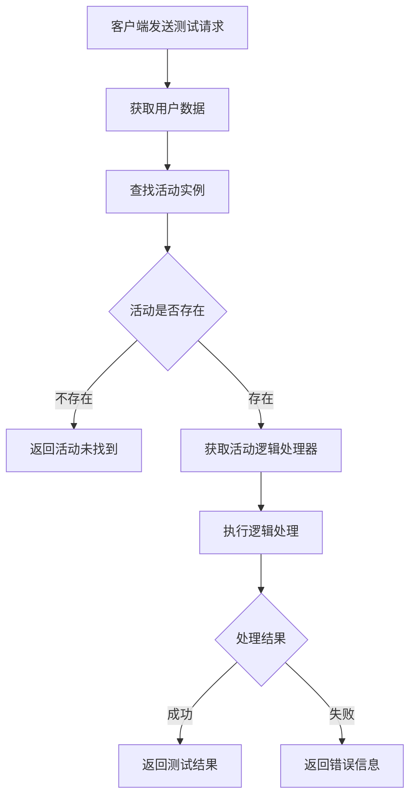
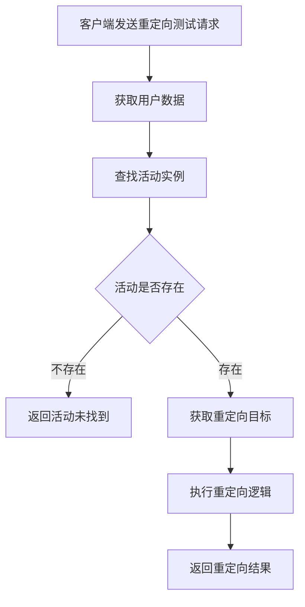

# 首次组队活动模块完整说明

## 一、模块概述

### 1.1 业务背景

首次组队活动模块（FristTeamActivityOp, p003）是 K2C 游戏框架的测试调试模块，主要用于活动系统的开发测试和逻辑验证。该模块提供了活动逻辑测试接口，帮助开发人员在开发阶段验证活动系统的正确性。

### 1.2 目标用户

- **开发人员**：测试活动逻辑的正确性
- **测试人员**：验证活动系统的功能
- **运维人员**：调试生产环境问题

### 1.3 核心价值

1. **测试验证**：提供活动逻辑的测试入口
2. **问题定位**：帮助快速定位活动相关问题
3. **开发辅助**：加速活动系统的开发迭代

---

## 二、功能清单

### 2.1 测试功能

| 功能名称 | 功能描述 | 用户价值 |
|---------|---------|---------|
| 游戏逻辑测试 | 测试活动游戏逻辑 | 验证活动逻辑正确性 |
| 游戏逻辑重定向测试 | 测试逻辑重定向功能 | 验证重定向机制 |

---

## 三、业务流程详解

### 3.1 游戏逻辑测试流程



**详细步骤说明**：

1. **用户验证**
   - 获取当前用户数据
   - 验证用户权限

2. **活动查找**
   - 根据实例ID查找活动
   - 验证活动存在性

3. **逻辑执行**
   - 获取活动的逻辑处理器
   - 执行测试逻辑
   - 返回执行结果

### 3.2 游戏逻辑重定向测试流程



---

## 四、关键规则

### 4.1 权限规则

1. **测试权限**：仅限开发/测试环境使用
2. **管理员权限**：生产环境需要管理员权限
3. **访问控制**：生产环境默认禁用测试协议

### 4.2 安全规则

1. **环境隔离**：测试接口不影响正式数据
2. **权限验证**：所有测试请求需要权限验证
3. **日志记录**：所有测试操作记录日志

---

## 五、用户故事

### 5.1 开发调试故事

> 作为一名开发人员，我正在开发一个新的活动功能。通过首次组队活动模块的测试接口，我可以快速验证活动逻辑是否正确。测试请求发送后，我立即得到了返回结果，帮助我快速定位和修复了问题。

### 5.2 问题排查故事

> 作为一名运维人员，生产环境出现了一个活动相关的问题。通过重定向测试接口，我成功复现了问题场景，并收集了必要的调试信息，帮助开发团队快速定位问题根源。

---

## 六、示例

### 6.1 游戏逻辑测试示例

**输入数据**：
- 活动实例ID：100001
- 测试参数1：100

**测试结果**：
```
活动实例ID：100001
测试参数1：100
返回参数1：100
状态：测试成功
```

### 6.2 重定向测试示例

**输入数据**：
- 活动实例ID：100001
- 重定向目标：2

**测试结果**：
```
活动实例ID：100001
重定向目标：2
状态：重定向成功
```

---

## 七、注意事项

1. 本模块仅用于开发和测试阶段
2. 生产环境应禁用或限制访问测试接口
3. 所有测试操作应记录日志以便审计
4. 测试接口不应影响正式业务数据

---

*文档生成时间: 2026-04-07*
