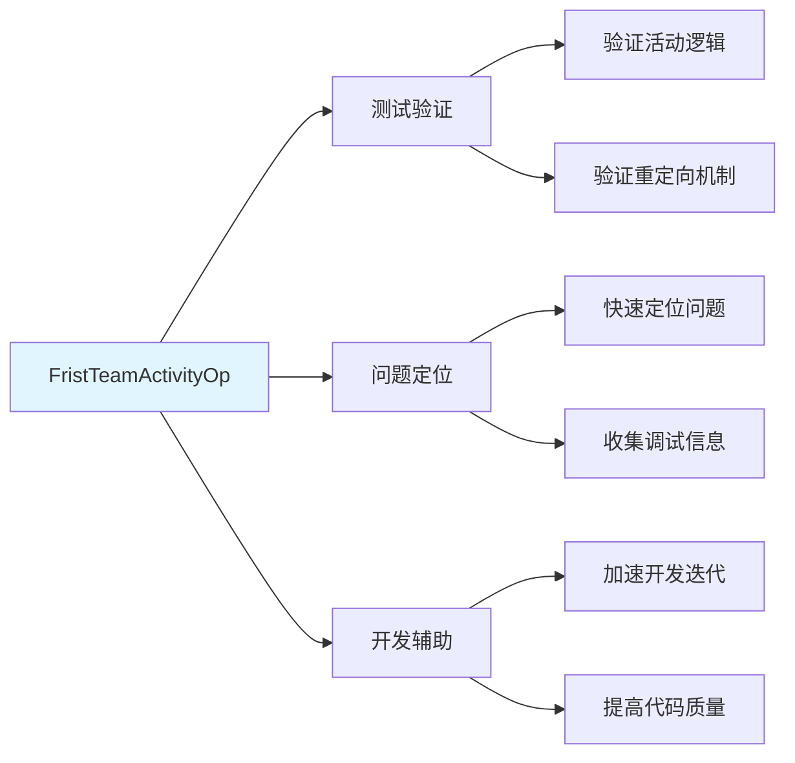
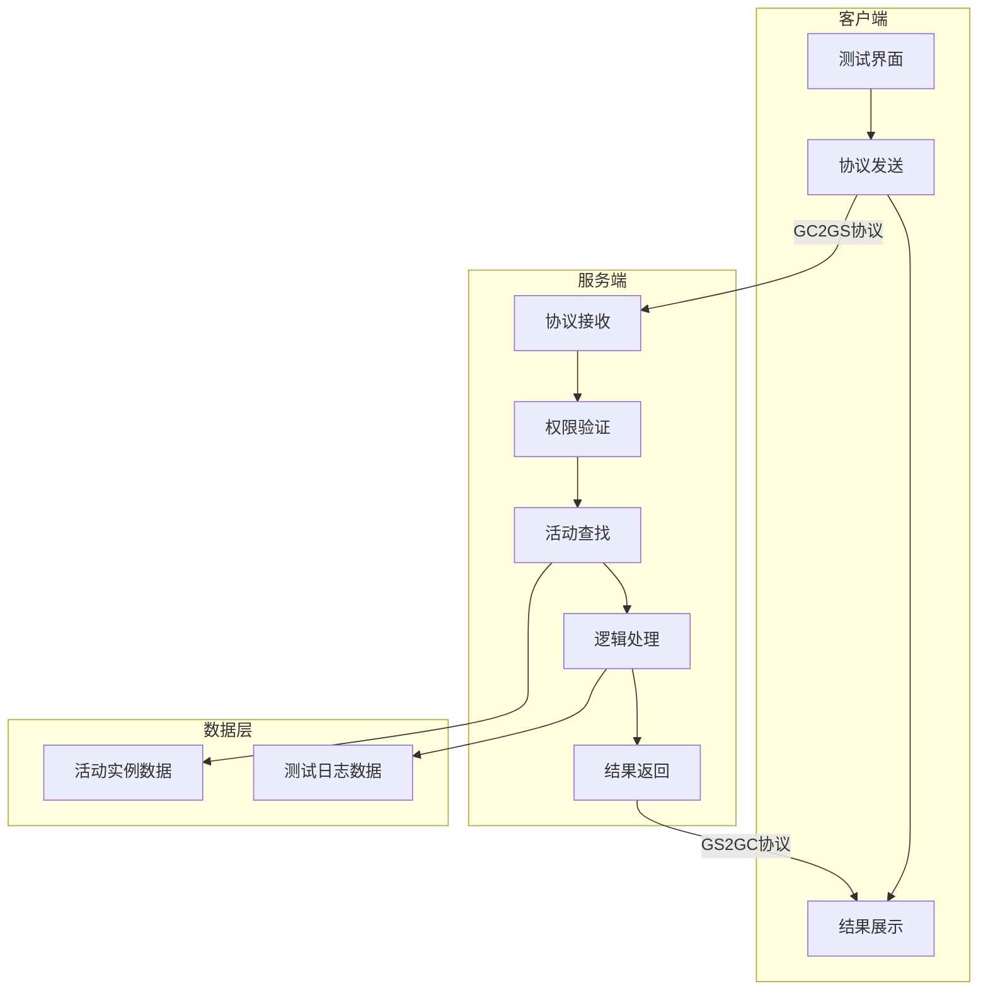
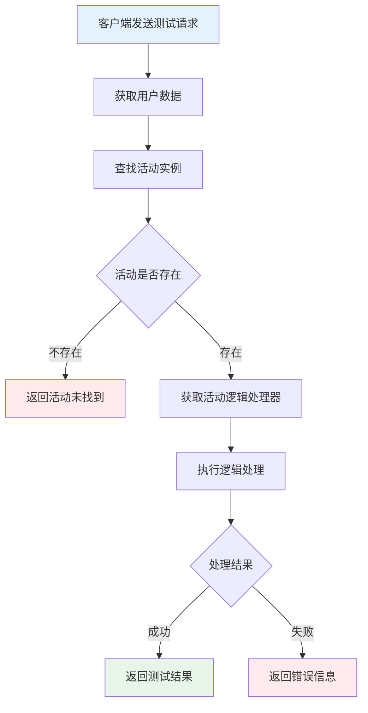
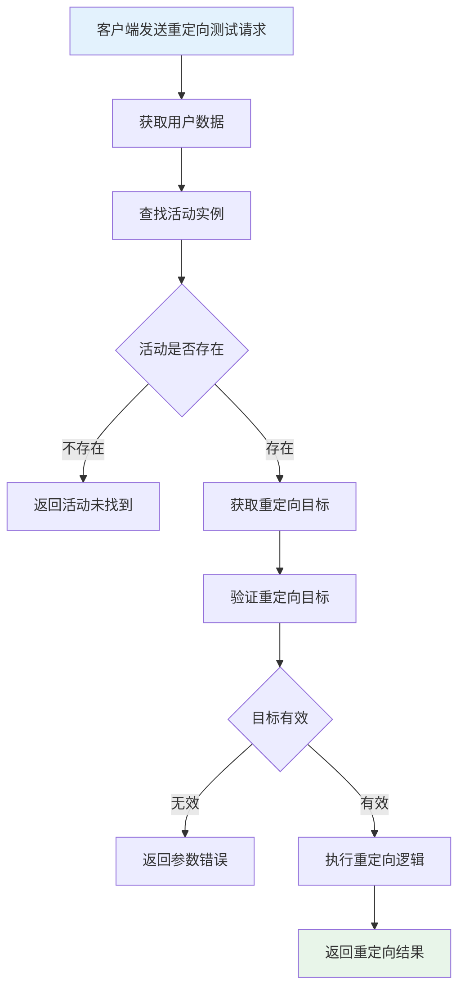
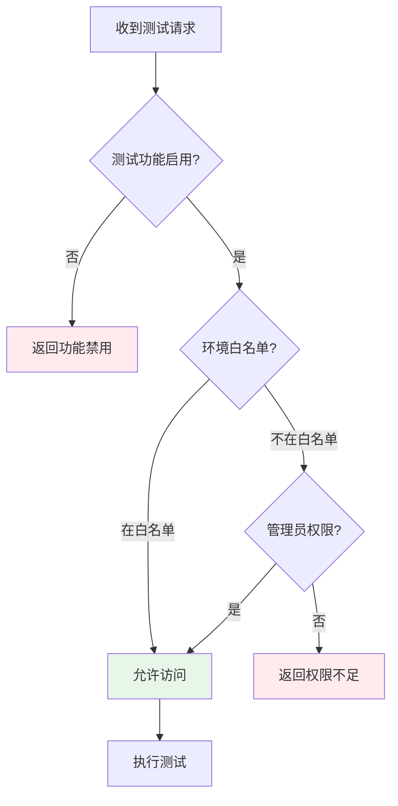
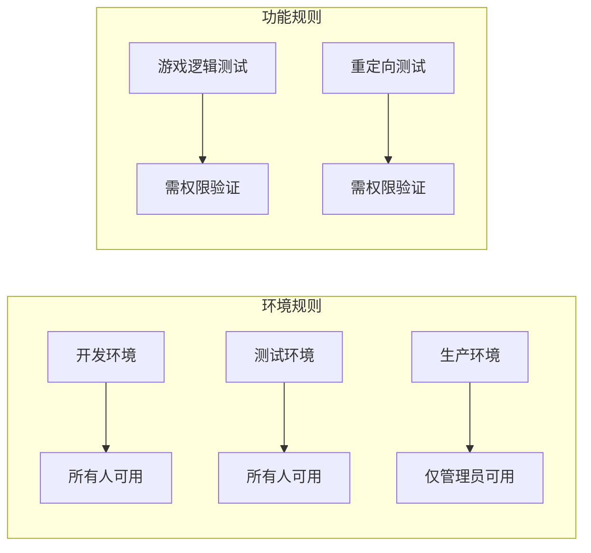
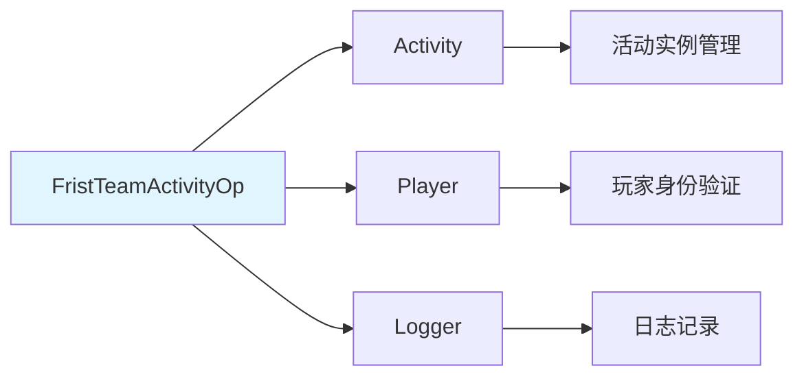

# 首期组队活动模块完整说明

**模块名称**: FristTeamActivityOp（首期组队活动操作）
**模块编号**: p003
**文档版本**: 2.0
**更新日期**: 2026-04-12

---

## 一、模块概述

### 1.1 业务背景

首次组队活动模块（FristTeamActivityOp, p003）是 K2C 游戏框架的测试调试模块，主要用于活动系统的开发测试和逻辑验证。该模块提供了活动逻辑测试接口，帮助开发人员在开发阶段验证活动系统的正确性。

### 1.2 目标用户

| 用户类型 | 使用场景 | 价值获取 |
|----------|----------|----------|
| 开发人员 | 测试活动逻辑的正确性 | 快速定位和修复问题 |
| 测试人员 | 验证活动系统的功能 | 确保功能符合预期 |
| 运维人员 | 调试生产环境问题 | 快速定位问题根源 |
| GM管理员 | 执行活动相关操作 | 高效管理活动状态 |

### 1.3 核心价值



---

## 二、功能清单

### 2.1 测试功能

| 功能名称 | 功能描述 | 用户价值 |
|---------|---------|----------|
| 游戏逻辑测试 | 测试活动游戏逻辑 | 验证活动逻辑正确性 |
| 游戏逻辑重定向测试 | 测试逻辑重定向功能 | 验证重定向机制 |

### 2.2 功能架构图



---

## 三、业务流程详解

### 3.1 游戏逻辑测试流程



**详细步骤说明**：

#### 步骤1: 用户验证

```
目的: 确保请求来自有效用户
处理: 获取当前用户数据，验证用户权限
```

#### 步骤2: 活动查找

```
目的: 定位要测试的活动实例
处理: 根据实例ID查找活动，验证活动存在性
```

#### 步骤3: 逻辑执行

```
目的: 执行测试逻辑
处理: 获取活动的逻辑处理器，执行测试逻辑，返回执行结果
```

### 3.2 游戏逻辑重定向测试流程



### 3.3 权限验证流程



---

## 四、关键规则

### 4.1 权限规则



| 规则名称 | 规则描述 | 应用场景 |
|----------|----------|----------|
| 测试权限 | 仅限开发/测试环境使用 | 所有测试功能 |
| 管理员权限 | 生产环境需要管理员权限 | 生产环境测试 |
| 访问控制 | 生产环境默认禁用测试协议 | 安全控制 |

### 4.2 安全规则

| 规则名称 | 规则描述 | 实现方式 |
|----------|----------|----------|
| 环境隔离 | 测试接口不影响正式数据 | 数据库隔离 |
| 权限验证 | 所有测试请求需要权限验证 | 权限中间件 |
| 日志记录 | 所有测试操作记录日志 | 审计日志 |
| 频率限制 | 限制测试请求频率 | 限流器 |

### 4.3 数据规则

| 规则名称 | 规则描述 | 说明 |
|----------|----------|------|
| 实例ID有效性 | instanceId 必须 > 0 | 参数验证 |
| 活动状态检查 | 活动必须处于可测试状态 | 状态验证 |
| 参数范围检查 | 参数必须在有效范围内 | 边界验证 |

---

## 五、用户故事

### 5.1 开发调试故事

> 作为一名开发人员，我正在开发一个新的活动功能。通过首次组队活动模块的测试接口，我可以快速验证活动逻辑是否正确。测试请求发送后，我立即得到了返回结果，帮助我快速定位和修复了问题。

**验收标准**:
- [ ] 可以发送测试请求
- [ ] 可以接收测试结果
- [ ] 错误信息清晰明确

### 5.2 问题排查故事

> 作为一名运维人员，生产环境出现了一个活动相关的问题。通过重定向测试接口，我成功复现了问题场景，并收集了必要的调试信息，帮助开发团队快速定位问题根源。

**验收标准**:
- [ ] 可以在生产环境使用（需权限）
- [ ] 操作记录完整
- [ ] 不影响正式数据

### 5.3 功能验证故事

> 作为一名测试人员，我需要验证新活动功能的正确性。通过测试模块，我可以在测试环境全面验证活动的各种场景，确保功能上线后的稳定性。

**验收标准**:
- [ ] 测试环境可用
- [ ] 覆盖主要场景
- [ ] 结果可追溯

---

## 六、示例

### 6.1 游戏逻辑测试示例

**输入数据**：
- 活动实例ID：100001
- 测试参数1：100

**测试结果**：
```
活动实例ID：100001
测试参数1：100
返回参数1：100
状态：测试成功
```

### 6.2 重定向测试示例

**输入数据**：
- 活动实例ID：100001
- 重定向目标：2

**测试结果**：
```
活动实例ID：100001
重定向目标：2
状态：重定向成功
```

### 6.3 错误处理示例

**场景**: 活动未找到

**输入数据**：
- 活动实例ID：999999

**错误结果**：
```
错误码：30001
错误信息：活动未找到
用户提示：指定的活动实例不存在
```

---

## 七、接口概览

### 7.1 协议接口

| 协议名称 | 方向 | 功能描述 |
|----------|------|----------|
| GC2GS_003_001_ReqGameLogicTest | 客户端→服务端 | 游戏逻辑测试请求 |
| GC2GS_003_002_ReqGameLogicRedirectTest | 客户端→服务端 | 重定向测试请求 |
| GS2GC_003_001_RetGameLogicTest | 服务端→客户端 | 游戏逻辑测试响应 |
| GS2GC_003_002_RetGameLogicRedirectTest | 服务端→客户端 | 重定向测试响应 |

### 7.2 GM命令

| 命令 | 用法 | 说明 |
|------|------|------|
| /gm activity test_logic | /gm activity test_logic `<instanceId>` `<param1>` | 测试活动逻辑 |
| /gm activity test_redirect | /gm activity test_redirect `<instanceId>` `<target>` | 测试重定向 |
| /gm activity info | /gm activity info `<instanceId>` | 查看活动信息 |
| /gm activity test_enable | /gm activity test_enable `<true/false>` | 启用/禁用测试 |

---

## 八、配置说明

### 8.1 配置项列表

| 配置项 | 类型 | 默认值 | 说明 |
|--------|------|--------|------|
| activity_test_enabled | bool | false | 是否启用测试功能 |
| activity_test_env_whitelist | List&lt;string&gt; | ["Development", "Test"] | 允许测试的环境 |
| activity_test_admin_only | bool | true | 生产环境仅管理员可用 |

### 8.2 配置示例

```json
{
    "activity_test_enabled": true,
    "activity_test_env_whitelist": ["Development", "Test", "Staging"],
    "activity_test_admin_only": true
}
```

---

## 九、错误码汇总

| 错误码 | 错误名 | 说明 | 处理建议 |
|--------|--------|------|----------|
| 30001 | ACTIVITY_NOT_FOUND | 活动未找到 | 检查活动实例ID |
| 30002 | OBJ_ERROR | 对象错误 | 检查内部对象状态 |
| 30003 | PERMISSION_DENIED | 权限不足 | 检查用户权限 |
| 30004 | ENV_RESTRICTED | 环境受限 | 检查环境配置 |
| 30005 | TEST_DISABLED | 测试功能禁用 | 启用测试功能 |
| 30006 | INVALID_INSTANCE_ID | 无效实例ID | 检查实例ID格式 |

---

## 十、跨模块依赖

### 10.1 依赖模块



### 10.2 模块依赖说明

| 模块名称 | 依赖方式 | 依赖内容 |
|----------|----------|----------|
| Activity | 强依赖 | 活动实例管理 |
| Player | 强依赖 | 玩家身份验证 |
| Logger | 强依赖 | 日志记录 |
| Config | 弱依赖 | 配置读取 |

---

## 十一、注意事项

### 11.1 开发注意事项

1. 本模块仅用于开发和测试阶段
2. 生产环境应禁用或限制访问测试接口
3. 所有测试操作应记录日志以便审计
4. 测试接口不应影响正式业务数据
5. 注意异常处理和边界情况

### 11.2 运维注意事项

1. 生产环境默认禁用测试功能
2. 需要管理员权限才能启用测试
3. 定期检查测试日志，发现异常操作
4. 测试操作可能影响性能，谨慎使用
5. 建议在维护窗口进行测试操作

### 11.3 安全注意事项

1. 不要在生产环境开启测试功能
2. 严格限制管理员权限
3. 定期审计测试日志
4. 测试接口不应暴露给普通用户
5. 敏感操作需要二次确认

---

## 十二、版本历史

| 版本 | 日期 | 变更内容 |
|------|------|----------|
| v2.0 | 2026-04-12 | 完善文档，添加详细说明 |
| v1.0 | 2026-04-06 | 初始版本 |

---

*文档生成时间: 2026-04-12*
*文档版本: v2.0*
