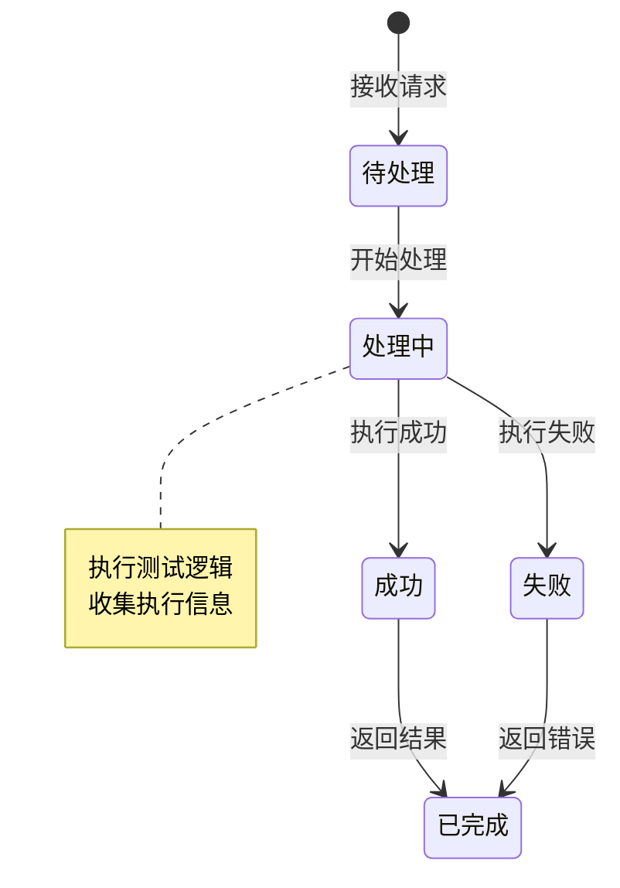
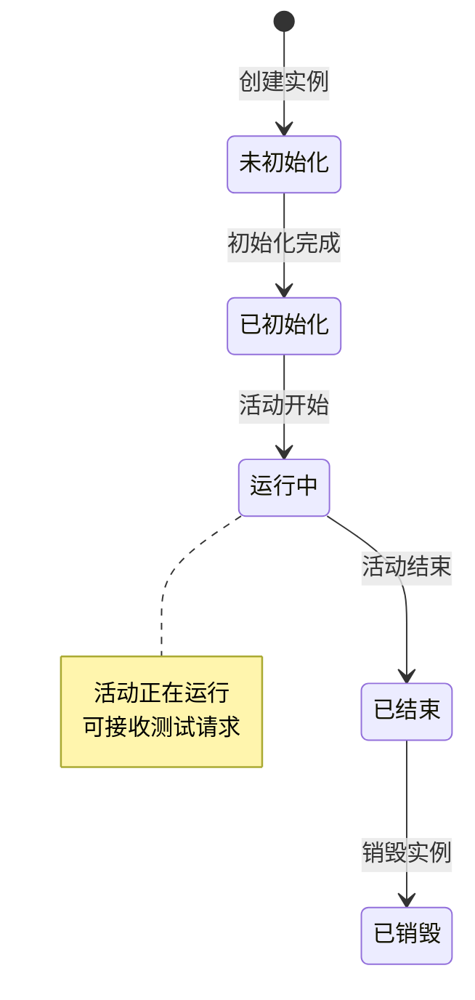
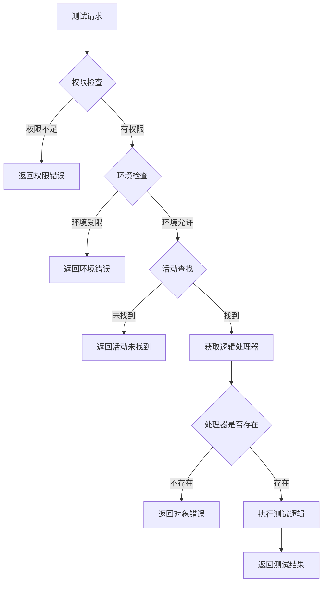

# 首次组队活动模块实现细节

## 一、计算公式

本模块为测试模块，无特定计算公式。

---

## 二、状态机定义

### 2.1 测试请求状态机



### 2.2 活动实例状态机



---

## 三、数据约束

### 3.1 测试请求数据约束

| 字段名 | 数据类型 | 取值范围 | 必填 | 说明 |
|--------|----------|----------|------|------|
| instanceId | long | > 0 | 是 | 活动实例ID |
| param1 | int | - | 否 | 测试参数1 |
| redirectTarget | int | > 0 | 否 | 重定向目标 |

### 3.2 测试响应数据约束

| 字段名 | 数据类型 | 取值范围 | 必填 | 说明 |
|--------|----------|----------|------|------|
| param1 | int | - | 否 | 返回参数1 |
| errorCode | int | >= 0 | 是 | 错误码 |
| errorMsg | string | - | 否 | 错误信息 |

---

## 四、错误处理策略

### 4.1 模块错误码

| 错误码 | 错误信息 | 处理策略 | 用户提示 |
|--------|----------|----------|----------|
| 30001 | 活动未找到 | 检查活动实例ID | "指定的活动实例不存在" |
| 30002 | 对象错误 | 检查内部对象状态 | "内部对象获取失败" |
| 30003 | 权限不足 | 检查用户权限 | "无测试权限" |
| 30004 | 环境受限 | 检查环境配置 | "当前环境禁止测试" |

### 4.2 测试请求错误处理流程



---

## 五、关键代码示例

### 5.1 游戏逻辑测试处理伪代码

```csharp
public void DealMessage(_ANPUSUserBasicMsgItem commiter, GC2GS_003_001_ReqGameLogicTest msg)
{
    // 1. 获取用户数据
    NPUSUserData userData = commiter.GetUserData();
    if (userData == null)
    {
        SendError(commiter, 30002, "对象错误");
        return;
    }

    // 2. 查找活动实例
    _AActivityBase activity = userData.GetUSServer()
        .GetCommActivityMgr()
        .LookupActivity(msg.GetInstanceId());

    if (activity == null)
    {
        SendError(commiter, 30001, "活动未找到");
        return;
    }

    // 3. 获取活动逻辑处理器
    ActivityGameLogicDealer dealer = activity.GetGameLogicDealer();
    if (dealer == null)
    {
        SendError(commiter, 30002, "对象错误");
        return;
    }

    // 4. 执行逻辑处理
    try
    {
        dealer.DealMsg(commiter, userData.GetCid(), 0, msg, null, callback);

        // 5. 返回成功结果
        GS2GC_003_001_RetGameLogicTest response = new GS2GC_003_001_RetGameLogicTest();
        response.SetParam1(msg.GetParam1());
        SendResponse(commiter, response);
    }
    catch (Exception ex)
    {
        // 6. 记录错误日志
        Logger.Error($"游戏逻辑测试异常: {ex.Message}");

        // 7. 返回错误信息
        SendError(commiter, 30002, "处理异常");
    }
}
```

### 5.2 游戏逻辑重定向测试伪代码

```csharp
public void DealMessage(_ANPUSUserBasicMsgItem commiter, GC2GS_003_002_ReqGameLogicRedirectTest msg)
{
    // 1. 获取用户数据
    NPUSUserData userData = commiter.GetUserData();
    if (userData == null)
    {
        SendError(commiter, 30002, "对象错误");
        return;
    }

    // 2. 查找活动实例
    _AActivityBase activity = userData.GetUSServer()
        .GetCommActivityMgr()
        .LookupActivity(msg.GetInstanceId());

    if (activity == null)
    {
        SendError(commiter, 30001, "活动未找到");
        return;
    }

    // 3. 获取重定向目标
    int redirectTarget = msg.GetRedirectTarget();

    // 4. 执行重定向逻辑
    ActivityGameLogicDealer dealer = activity.GetGameLogicDealer();
    if (dealer == null)
    {
        SendError(commiter, 30002, "对象错误");
        return;
    }

    try
    {
        dealer.RedirectTo(commiter, redirectTarget);

        // 5. 返回成功结果
        GS2GC_003_002_RetGameLogicRedirectTest response = new GS2GC_003_002_RetGameLogicRedirectTest();
        SendResponse(commiter, response);
    }
    catch (Exception ex)
    {
        Logger.Error($"重定向测试异常: {ex.Message}");
        SendError(commiter, 30002, "处理异常");
    }
}
```

### 5.3 活动管理器查找伪代码

```csharp
public class CommonActivityMgr
{
    private Dictionary<long, _AActivityBase> activityMap;

    public _AActivityBase LookupActivity(long instanceId)
    {
        if (activityMap.TryGetValue(instanceId, out var activity))
        {
            return activity;
        }
        return null;
    }

    public void RegisterActivity(long instanceId, _AActivityBase activity)
    {
        activityMap[instanceId] = activity;
    }

    public void UnregisterActivity(long instanceId)
    {
        activityMap.Remove(instanceId);
    }
}
```

### 5.4 权限检查伪代码

```csharp
public bool CheckTestPermission(long playerId)
{
    // 1. 检查环境
    if (!IsDevOrTestEnv())
    {
        // 2. 生产环境检查管理员权限
        PlayerInfo player = playerDao.GetById(playerId);
        if (player == null || !player.IsAdmin)
        {
            return false;
        }
    }

    return true;
}

private bool IsDevOrTestEnv()
{
    string env = ConfigurationManager.Get("Environment");
    return env == "Development" || env == "Test";
}
```

---

## 六、跨模块依赖

### 6.1 依赖模块

| 模块名称 | 依赖方式 | 依赖内容 |
|----------|----------|----------|
| Activity | 强依赖 | 活动实例管理 |
| Player | 强依赖 | 玩家身份验证 |
| Logger | 强依赖 | 日志记录 |

### 6.2 被依赖模块

本模块为测试模块，不被其他业务模块依赖。

### 6.3 接口定义

```csharp
// 活动基类接口
interface _AActivityBase
{
    long GetInstanceId();
    ActivityGameLogicDealer GetGameLogicDealer();
}

// 活动逻辑处理器接口
interface ActivityGameLogicDealer
{
    void DealMsg(_ANPUSUserBasicMsgItem commiter, long cid, int type, object msg, object extra, Action callback);
    void RedirectTo(_ANPUSUserBasicMsgItem commiter, int target);
}

// 活动管理器接口
interface ICommonActivityMgr
{
    _AActivityBase LookupActivity(long instanceId);
    void RegisterActivity(long instanceId, _AActivityBase activity);
    void UnregisterActivity(long instanceId);
}
```

---

## 七、性能优化建议

### 7.1 活动查找优化

1. **缓存策略**
   - 活动实例缓存到内存
   - 避免频繁数据库查询

2. **并发控制**
   - 活动操作加锁
   - 防止并发冲突

### 7.2 日志优化

1. **异步日志**
   - 日志异步写入
   - 不阻塞主流程

2. **日志分级**
   - 测试环境详细日志
   - 生产环境精简日志

### 7.3 安全建议

1. **环境隔离**
   - 生产环境默认禁用
   - 管理员白名单访问

2. **请求限流**
   - 限制测试请求频率
   - 防止滥用

---

*文档生成时间: 2026-04-07*
