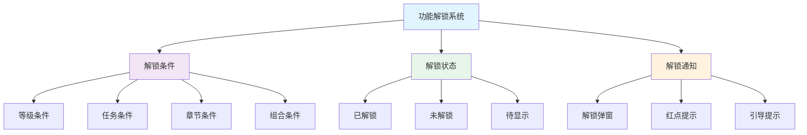
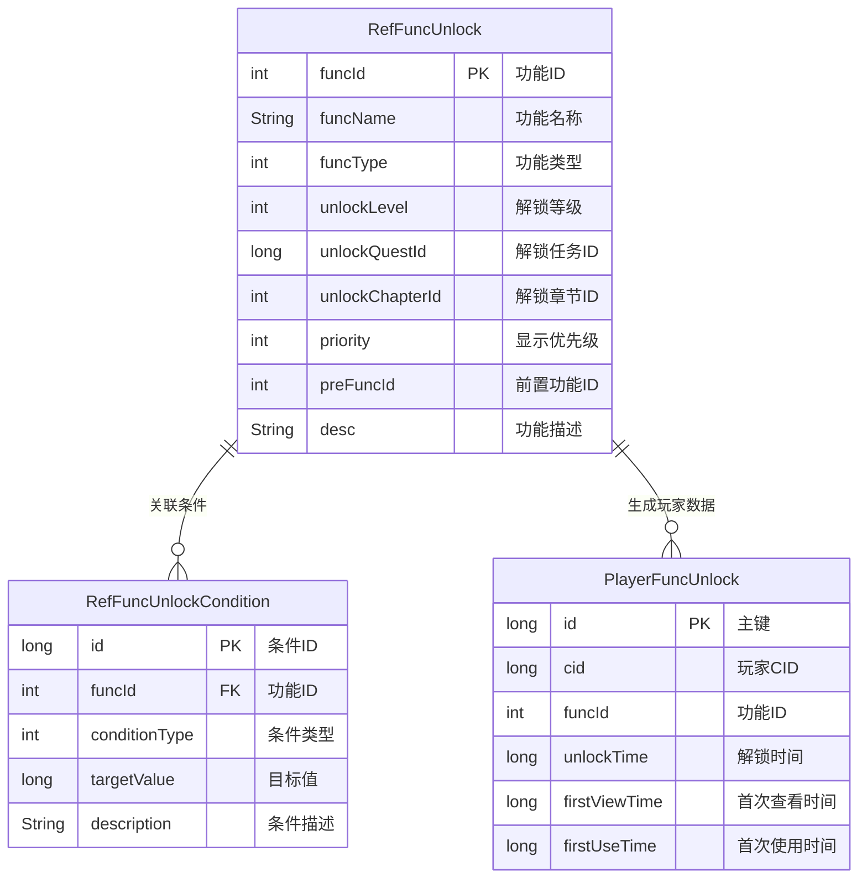
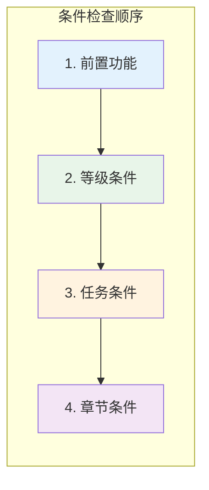
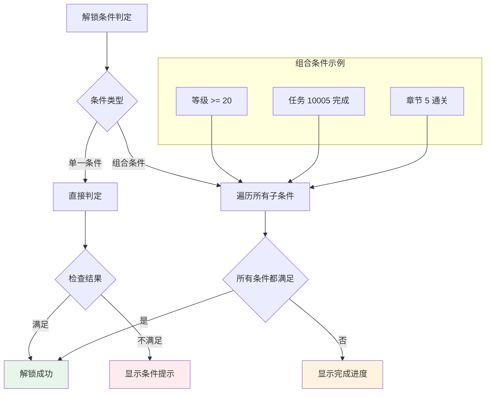
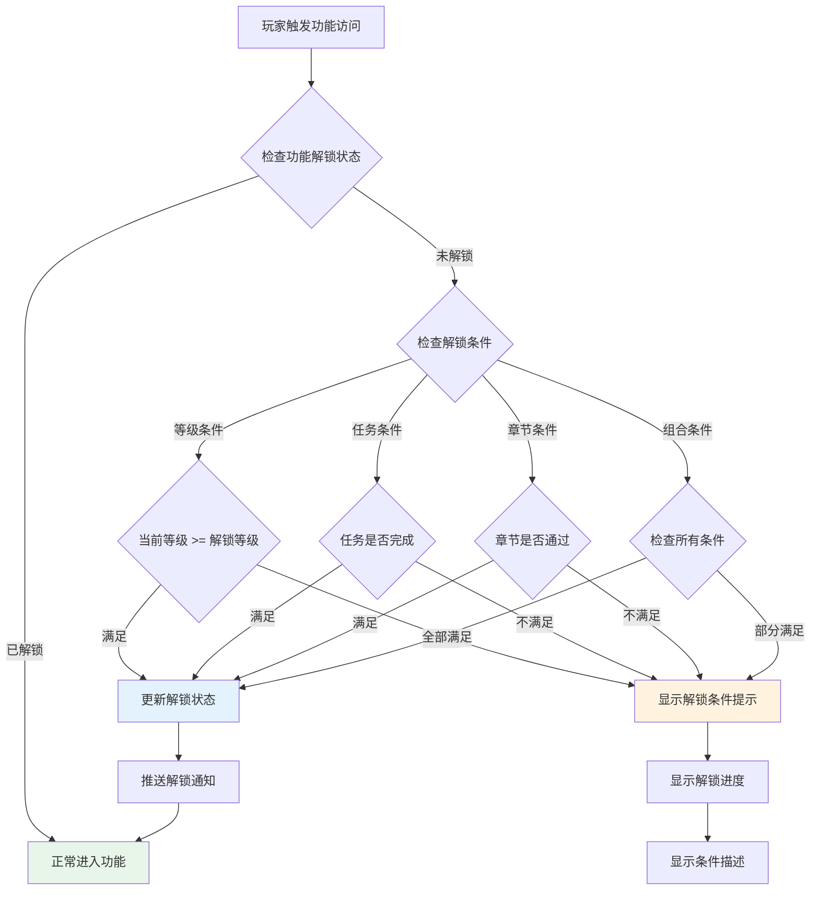

# FuncUnlock 功能解锁模块 - 数据配表文档

## 模块概述

**模块名称**: FuncUnlock (功能解锁)
**模块类型**: 客户端独立组件
**主要功能**: 管理游戏功能解锁条件和解锁状态，控制游戏功能开放节奏

---

## 核心概念



---

## 配表文件列表

| 配表名称 | 文件路径 | 说明 |
|---------|---------|------|
| RefFuncUnlock | GameRes/Refs/FuncUnlock/RefFuncUnlock.java | 功能解锁配置 |
| RefFuncUnlockCondition | GameRes/Refs/FuncUnlock/RefFuncUnlockCondition.java | 解锁条件配置 |

---

## 配表关系图



---

## 1. 功能解锁配置 (RefFuncUnlock)

**配表名**: `func_unlock`

### 完整字段列表

| 字段名 | 类型 | 必填 | 默认值 | 说明 |
|--------|------|------|--------|------|
| funcId | int | 是 | - | 功能ID（主键） |
| funcName | String | 是 | - | 功能名称 |
| funcType | int | 是 | 1 | 功能类型（1-5） |
| unlockLevel | int | 否 | 1 | 解锁等级（1-100） |
| unlockQuestId | long | 否 | 0 | 解锁任务ID（>0有效） |
| unlockChapterId | int | 否 | 0 | 解锁章节ID（>0有效） |
| priority | int | 是 | 50 | 显示优先级（1-100） |
| preFuncId | int | 否 | 0 | 前置功能ID（>0有效） |
| desc | String | 否 | "" | 功能描述 |
| iconRes | String | 否 | "" | 图标资源路径 |
| uiResId | int | 否 | 0 | UI资源ID |
| sortId | long | 否 | 0 | 排序ID |

### 功能类型枚举

| 类型ID | 类型名 | 说明 | 典型功能 |
|--------|--------|------|----------|
| 1 | SYSTEM | 系统功能 | 背包、阵容、邮件 |
| 2 | BUILDING | 建筑功能 | 客栈、铁匠铺、炼丹房 |
| 3 | ACTIVITY | 活动功能 | 精英副本、限时活动 |
| 4 | SOCIAL | 社交功能 | 好友、公会、组队 |
| 5 | SHOP | 商店功能 | 商城、兑换、充值 |

### 解锁条件优先级



### 配置示例

```json
{
    "funcId": 101,
    "funcName": "公会系统",
    "funcType": 4,
    "unlockLevel": 10,
    "unlockQuestId": 0,
    "unlockChapterId": 0,
    "priority": 80,
    "preFuncId": 0,
    "desc": "加入或创建公会，参与公会活动",
    "iconRes": "UI/Icon/Func/guild",
    "uiResId": 0,
    "sortId": 101
}
```

```json
{
    "funcId": 201,
    "funcName": "精英副本",
    "funcType": 3,
    "unlockLevel": 20,
    "unlockQuestId": 10005,
    "unlockChapterId": 5,
    "priority": 70,
    "preFuncId": 102,
    "desc": "挑战高难度副本，获取稀有装备",
    "iconRes": "UI/Icon/Func/elite_dungeon",
    "uiResId": 0,
    "sortId": 201
}
```

### 代码示例

```java
// 获取功能解锁配置
RefFuncUnlock funcRef = RefFuncUnlock.getMgr().get(funcId);
if (funcRef == null) {
    return CommErr.REF_NOT_FOUND;
}

// 获取功能名称
String funcName = funcRef.funcName;

// 获取功能类型
int funcType = funcRef.funcType;
```

```csharp
// 客户端获取功能解锁配置
NPFuncUnlockRefObj funcRef = GRefdataCoreMgr.instance.funcUnlockMap.getRef(funcId);
if (funcRef == null)
{
    Debug.LogError($"功能解锁配置不存在: {funcId}");
    return;
}

// 获取功能名称
string funcName = funcRef.funcName;

// 获取解锁等级
int unlockLevel = funcRef.unlockLevel;
```

---

## 2. 解锁条件配置 (RefFuncUnlockCondition)

**配表名**: `func_unlock_condition`

### 完整字段列表

| 字段名 | 类型 | 必填 | 默认值 | 说明 |
|--------|------|------|--------|------|
| id | long | 是 | - | 条件ID（主键） |
| funcId | int | 是 | - | 关联功能ID |
| conditionType | int | 是 | 1 | 条件类型 |
| targetValue | long | 是 | 0 | 目标值 |
| description | String | 否 | "" | 条件描述 |
| sortId | long | 否 | 0 | 排序ID |

### 条件类型枚举

| 类型值 | 类型名 | 说明 | 目标值含义 |
|--------|--------|------|-----------|
| 1 | LEVEL | 等级条件 | 玩家等级 |
| 2 | QUEST | 任务条件 | 任务ID |
| 3 | CHAPTER | 章节条件 | 章节ID |
| 4 | COMPOSITE | 组合条件 | 条件组ID |

### 条件组合关系图



### 配置示例

```json
{
    "id": 1001,
    "funcId": 201,
    "conditionType": 1,
    "targetValue": 20,
    "description": "达到20级",
    "sortId": 1
}
```

```json
{
    "id": 1002,
    "funcId": 201,
    "conditionType": 3,
    "targetValue": 5,
    "description": "通关第5章",
    "sortId": 2
}
```

---

## 协议数据结构

### FuncUnlockInfo - 功能解锁信息

**路径**: `ClientProtocol/Common/FuncUnlockObj/FuncUnlock_Info.cs`

| 字段名 | 类型 | 说明 | 示例值 |
|--------|------|------|--------|
| funcId | int | 功能ID | 101 |
| isUnlocked | bool | 是否已解锁 | true |
| unlockTime | long | 解锁时间戳 | 1640000000000 |
| firstViewTime | long | 首次查看时间 | 1640000001000 |
| firstUseTime | long | 首次使用时间 | 1640000002000 |

```csharp
public class FuncUnlock_Info : _IALProtocolStructure
{
    private int funcId;            // 功能ID
    private bool isUnlocked;       // 是否已解锁
    private long unlockTime;       // 解锁时间
    private long firstViewTime;    // 首次查看时间
    private long firstUseTime;     // 首次使用时间

    public byte getMainOrder() { return (byte)0; }
    public byte getSubOrder() { return (byte)0; }
}
```

### UnlockConditionProgress - 解锁条件进度

**路径**: `ClientProtocol/Common/FuncUnlockObj/UnlockConditionProgress.cs`

| 字段名 | 类型 | 说明 | 示例值 |
|--------|------|------|--------|
| conditionType | int | 条件类型 | 1 |
| currentValue | long | 当前进度值 | 15 |
| targetValue | long | 目标值 | 20 |
| isSatisfied | bool | 是否满足 | false |

```csharp
public class UnlockConditionProgress : _IALProtocolStructure
{
    private int conditionType;     // 条件类型
    private long currentValue;     // 当前进度值
    private long targetValue;      // 目标值
    private bool isSatisfied;      // 是否满足

    public byte getMainOrder() { return (byte)0; }
    public byte getSubOrder() { return (byte)0; }
}
```

---

## 功能解锁流程



---

## 数据字典

### 功能类型映射

| 类型ID | 枚举名 | 说明 | 典型功能 |
|--------|--------|------|----------|
| 1 | SYSTEM | 系统功能 | 背包、阵容、邮件、设置 |
| 2 | BUILDING | 建筑功能 | 客栈、铁匠铺、炼丹房、商铺 |
| 3 | ACTIVITY | 活动功能 | 精英副本、限时活动、竞技场 |
| 4 | SOCIAL | 社交功能 | 好友、公会、组队、聊天 |
| 5 | SHOP | 商店功能 | 商城、兑换、充值、神秘商店 |

### 条件类型映射

| 条件类型 | 数据来源 | 检查时机 | 示例 |
|----------|----------|----------|------|
| 等级(1) | PlayerOp | 玩家升级 | 等级 >= 10 |
| 任务(2) | QuestOp | 任务完成 | 完成任务 10005 |
| 章节(3) | ChapterOp | 章节通关 | 通关第5章 |
| 组合(4) | 多模块 | 任意条件变化 | 等级 >= 20 AND 章节 >= 5 |

---

## 配表校验规则

### 功能解锁配置校验

| 字段名 | 校验规则 | 异常处理 |
|--------|----------|----------|
| funcId | 大于0，必须唯一 | 加载时报错 |
| funcName | 非空，1-50字符 | 使用默认名称 |
| funcType | 范围1-5 | 使用默认值1 |
| unlockLevel | 范围1-100 | 使用默认值1 |
| priority | 范围1-100 | 使用默认值50 |

### 解锁条件配置校验

| 字段名 | 校验规则 | 异常处理 |
|--------|----------|----------|
| id | 大于0，必须唯一 | 加载时报错 |
| funcId | 必须存在于功能配置 | 忽略该条件 |
| conditionType | 范围1-4 | 使用默认值1 |
| targetValue | 大于等于0 | 使用默认值0 |

---

## 配置文件位置

```
game_server/GameRes/src/NPGameRes/Refs/FuncUnlock/
├── RefFuncUnlock.java            # 功能解锁配置
└── RefFuncUnlockCondition.java   # 解锁条件配置

game_server/GameRes/src/NPGameRes/GameObjs/FuncUnlock/
├── FuncUnlockInfo.java           # 功能解锁信息对象
└── UnlockConditionInfo.java      # 解锁条件信息对象

game_client/Assets/Scripts/ClientProtocol/Common/FuncUnlockObj/
├── FuncUnlock_Info.cs            # 功能解锁信息协议
└── UnlockConditionProgress.cs    # 解锁条件进度协议
```

---

## 完整代码示例

### Java服务端 - 功能解锁配置获取

```java
/**
 * 功能解锁配置服务
 */
public class FuncUnlockConfigService
{
    /**
     * 获取功能解锁配置
     */
    public RefFuncUnlock getFuncConfig(int funcId)
    {
        return RefFuncUnlock.getMgr().get(funcId);
    }

    /**
     * 获取某类型的所有功能
     */
    public List<RefFuncUnlock> getFuncsByType(int funcType)
    {
        return RefFuncUnlock.getMgr().getByType(funcType);
    }

    /**
     * 获取以某等级为解锁条件的功能列表
     */
    public List<RefFuncUnlock> getFuncsByUnlockLevel(int level)
    {
        return RefFuncUnlock.getMgr().getByUnlockLevel(level);
    }
}
```

### C#客户端 - 功能解锁数据解析

```csharp
/// <summary>
/// 功能解锁数据管理器
/// </summary>
public class FuncUnlockDataManager
{
    /// <summary>
    /// 获取功能解锁配置
    /// </summary>
    public NPFuncUnlockRefObj GetFuncConfig(int funcId)
    {
        return GRefdataCoreMgr.instance.funcUnlockMap.getRef(funcId);
    }

    /// <summary>
    /// 获取某类型的所有功能
    /// </summary>
    public List<NPFuncUnlockRefObj> GetFuncsByType(int funcType)
    {
        List<NPFuncUnlockRefObj> result = new List<NPFuncUnlockRefObj>();
        var allFuncs = GRefdataCoreMgr.instance.funcUnlockMap.getAllRef();
        foreach (var func in allFuncs)
        {
            if (func.funcType == funcType)
            {
                result.Add(func);
            }
        }
        return result;
    }

    /// <summary>
    /// 获取解锁条件描述
    /// </summary>
    public string GetUnlockConditionDesc(NPFuncUnlockRefObj funcRef)
    {
        List<string> conditions = new List<string>();

        if (funcRef.unlockLevel > 1)
        {
            conditions.Add($"达到{funcRef.unlockLevel}级");
        }

        if (funcRef.unlockQuestId > 0)
        {
            var questRef = GRefdataCoreMgr.instance.questMap.getRef(funcRef.unlockQuestId);
            if (questRef != null)
            {
                conditions.Add($"完成任务：{questRef.questName}");
            }
        }

        if (funcRef.unlockChapterId > 0)
        {
            conditions.Add($"通关第{funcRef.unlockChapterId}章");
        }

        if (funcRef.preFuncId > 0)
        {
            var preFuncRef = GetFuncConfig(funcRef.preFuncId);
            if (preFuncRef != null)
            {
                conditions.Add($"解锁{preFuncRef.funcName}");
            }
        }

        return string.Join("、", conditions);
    }
}
```

---

## 组件位置

```
game_client/Assets/Scripts/LogicScripts/GameComponent/FuncUnlock/
└── FuncUnlockInfo.cs

game_client/Assets/Scripts/ClientProtocol/RemarkData/
└── FuncUnlockData.cs
```

---

*文档生成时间: 2026-04-12*
*文档版本: v1.4.0*
