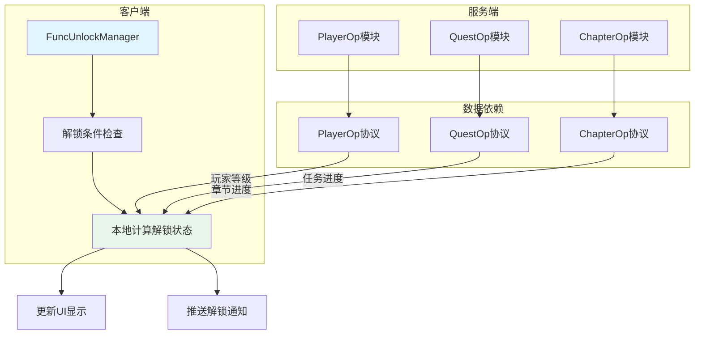
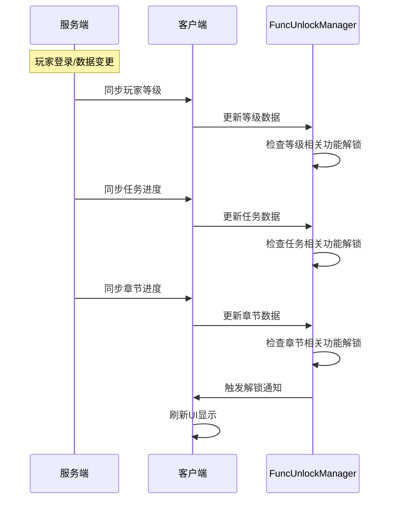
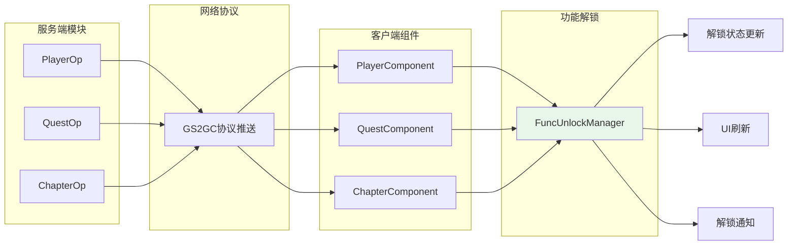
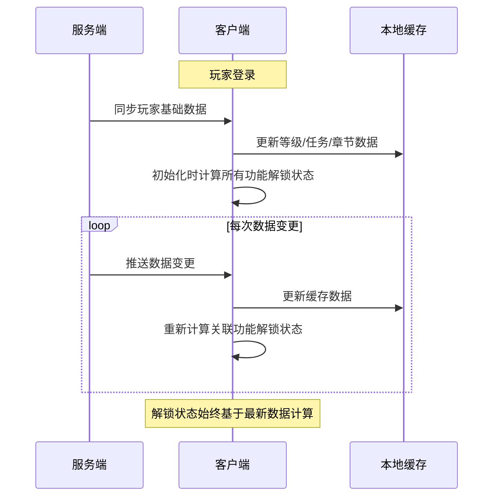
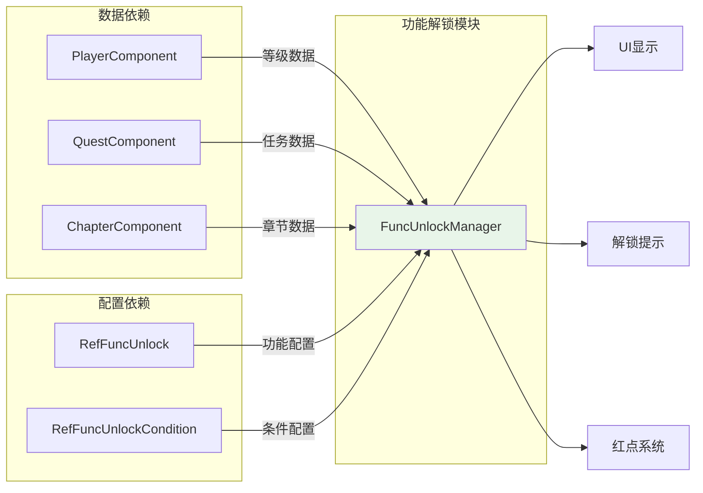

# FuncUnlock 功能解锁模块 - 协议文档

## 模块说明

本模块为客户端独立组件，不直接定义网络协议。解锁状态通过其他模块数据同步后，客户端本地计算解锁状态。

---

## 协议架构



---

## 数据同步机制

### 解锁状态计算流程



---

## 关联协议

### 1. 玩家数据协议 (PlayerOp)

功能解锁依赖玩家等级数据，等级数据通过以下协议同步：

| 协议模块 | 协议号 | 数据字段 | 说明 |
|----------|--------|----------|------|
| InitOp | p002 | playerLevel | 玩家等级初始化 |
| PlayerInfoOp | p021 | level | 等级变更推送 |

**等级变更推送示例**:

```csharp
// GS2GC_021_xxx_OnPlayerLevelUp
public class GS2GC_021_xxx_OnPlayerLevelUp : _IALProtocolStructure
{
    private int oldLevel;     // 旧等级
    private int newLevel;     // 新等级

    public byte getMainOrder() { return (byte)21; }
}
```

**客户端处理**:

```csharp
// 等级变更监听
public void OnPlayerLevelUp(int oldLevel, int newLevel)
{
    // 触发功能解锁检查
    FuncUnlockManager.Instance.CheckLevelUnlock(newLevel);
}
```

---

### 2. 任务数据协议 (QuestOp)

功能解锁依赖任务完成状态，任务数据通过以下协议同步：

| 协议模块 | 协议号 | 数据字段 | 说明 |
|----------|--------|----------|------|
| QuestOp | p015 | questList | 任务列表 |
| QuestOp | p015 | completedQuests | 已完成任务 |

**任务完成推送示例**:

```csharp
// GS2GC_015_xxx_OnQuestComplete
public class GS2GC_015_xxx_OnQuestComplete : _IALProtocolStructure
{
    private long questId;     // 完成的任务ID
    private int questType;    // 任务类型

    public byte getMainOrder() { return (byte)15; }
}
```

**客户端处理**:

```csharp
// 任务完成监听
public void OnQuestComplete(long questId, int questType)
{
    // 触发功能解锁检查
    FuncUnlockManager.Instance.CheckQuestUnlock(questId);
}
```

---

### 3. 章节数据协议 (ChapterOp)

功能解锁依赖章节通关进度，章节数据通过以下协议同步：

| 协议模块 | 协议号 | 数据字段 | 说明 |
|----------|--------|----------|------|
| ChapterOp | p025 | maxChapter | 最大通关章节 |
| ChapterOp | p025 | chapterProgress | 章节进度 |

**章节通关推送示例**:

```csharp
// GS2GC_025_xxx_OnChapterPass
public class GS2GC_025_xxx_OnChapterPass : _IALProtocolStructure
{
    private int chapterId;    // 通关的章节ID
    private int starCount;    // 星星数量

    public byte getMainOrder() { return (byte)25; }
}
```

**客户端处理**:

```csharp
// 章节通关监听
public void OnChapterPass(int chapterId, int starCount)
{
    // 触发功能解锁检查
    FuncUnlockManager.Instance.CheckChapterUnlock(chapterId);
}
```

---

## 协议数据流向



---

## 本地数据缓存

### 解锁状态缓存结构

```csharp
/// <summary>
/// 功能解锁缓存数据
/// </summary>
public class FuncUnlockCache
{
    // 解锁状态缓存
    private Dictionary<int, FuncUnlockInfo> _unlockCache;

    // 条件进度缓存
    private Dictionary<int, List<UnlockConditionProgress>> _conditionCache;

    // 最后更新时间
    private long _lastUpdateTime;

    /// <summary>
    /// 检查功能是否解锁
    /// </summary>
    public bool IsFuncUnlocked(int funcId)
    {
        if (_unlockCache.TryGetValue(funcId, out var info))
        {
            return info.isUnlocked;
        }
        return false;
    }

    /// <summary>
    /// 获取解锁进度
    /// </summary>
    public List<UnlockConditionProgress> GetUnlockProgress(int funcId)
    {
        if (_conditionCache.TryGetValue(funcId, out var progress))
        {
            return progress;
        }
        return new List<UnlockConditionProgress>();
    }
}
```

---

## 事件驱动机制

### 解锁事件定义

```csharp
/// <summary>
/// 功能解锁事件
/// </summary>
public class FuncUnlockEvent
{
    /// <summary>
    /// 解锁的功能ID
    /// </summary>
    public int funcId;

    /// <summary>
    /// 功能名称
    /// </summary>
    public string funcName;

    /// <summary>
    /// 功能类型
    /// </summary>
    public int funcType;

    /// <summary>
    /// 解锁时间
    /// </summary>
    public long unlockTime;
}

/// <summary>
/// 解锁条件变更事件
/// </summary>
public class UnlockConditionChangeEvent
{
    /// <summary>
    /// 功能ID
    /// </summary>
    public int funcId;

    /// <summary>
    /// 条件类型
    /// </summary>
    public int conditionType;

    /// <summary>
    /// 当前进度
    /// </summary>
    public long currentValue;

    /// <summary>
    /// 目标值
    /// </summary>
    public long targetValue;
}
```

### 事件监听注册

```csharp
/// <summary>
/// 注册功能解锁事件监听
/// </summary>
public void RegisterUnlockEvents()
{
    // 监听玩家等级变化
    EventManager.Instance.Subscribe<PlayerLevelUpEvent>(OnPlayerLevelUp);

    // 监听任务完成
    EventManager.Instance.Subscribe<QuestCompleteEvent>(OnQuestComplete);

    // 监听章节通关
    EventManager.Instance.Subscribe<ChapterPassEvent>(OnChapterPass);
}

/// <summary>
/// 玩家升级事件处理
/// </summary>
private void OnPlayerLevelUp(PlayerLevelUpEvent evt)
{
    // 检查以该等级为解锁条件的功能
    var funcList = GetFuncsByUnlockLevel(evt.newLevel);

    foreach (var funcId in funcList)
    {
        if (CheckUnlockConditions(funcId))
        {
            TriggerUnlock(funcId);
        }
    }
}
```

---

## 协议监听配置

### 客户端监听器注册

```csharp
/// <summary>
/// 功能解锁协议监听配置
/// </summary>
public static class FuncUnlockProtocolConfig
{
    /// <summary>
    /// 注册所有数据同步监听
    /// </summary>
    public static void RegisterListeners()
    {
        // PlayerOp 监听
        NPGSClientListener.registSubDealer(
            new GSSubDealer_021_xxx_OnPlayerLevelUp());

        // QuestOp 监听
        NPGSClientListener.registSubDealer(
            new GSSubDealer_015_xxx_OnQuestComplete());

        // ChapterOp 监听
        NPGSClientListener.registSubDealer(
            new GSSubDealer_025_xxx_OnChapterPass());
    }
}
```

---

## 数据一致性保证

### 本地计算与服务端数据同步



### 缓存更新策略

| 触发事件 | 更新策略 | 影响范围 |
|----------|----------|----------|
| 玩家升级 | 检查等级条件功能 | unlockLevel == newLevel |
| 任务完成 | 检查任务条件功能 | unlockQuestId == questId |
| 章节通关 | 检查章节条件功能 | unlockChapterId == chapterId |
| 登录初始化 | 全量检查所有功能 | 所有功能 |

---

## 完整示例

### 客户端解锁检查流程

```csharp
/// <summary>
/// 功能解锁管理器
/// </summary>
public class FuncUnlockManager : MonoBehaviour
{
    private static FuncUnlockManager _instance;
    public static FuncUnlockManager Instance => _instance;

    // 解锁状态缓存
    private Dictionary<int, FuncUnlockInfo> _unlockCache = new Dictionary<int, FuncUnlockInfo>();

    // 待推送的解锁列表
    private Queue<int> _pendingUnlockQueue = new Queue<int>();

    // 是否正在显示解锁提示
    private bool _isShowingNotification = false;

    /// <summary>
    /// 初始化
    /// </summary>
    public void Init()
    {
        // 注册事件监听
        RegisterEvents();

        // 初始化所有功能解锁状态
        InitAllFuncUnlockState();
    }

    /// <summary>
    /// 注册事件监听
    /// </summary>
    private void RegisterEvents()
    {
        EventManager.Instance.Subscribe<PlayerLevelUpEvent>(OnPlayerLevelUp);
        EventManager.Instance.Subscribe<QuestCompleteEvent>(OnQuestComplete);
        EventManager.Instance.Subscribe<ChapterPassEvent>(OnChapterPass);
    }

    /// <summary>
    /// 初始化所有功能解锁状态
    /// </summary>
    private void InitAllFuncUnlockState()
    {
        var allFuncs = GRefdataCoreMgr.instance.funcUnlockMap.getAllRef();
        foreach (var funcRef in allFuncs)
        {
            bool unlocked = CheckUnlockConditions(funcRef);
            _unlockCache[funcRef.funcId] = new FuncUnlockInfo
            {
                funcId = funcRef.funcId,
                isUnlocked = unlocked
            };
        }
    }

    /// <summary>
    /// 检查功能是否解锁
    /// </summary>
    public bool IsFuncUnlocked(int funcId)
    {
        if (_unlockCache.TryGetValue(funcId, out var info))
        {
            return info.isUnlocked;
        }
        return false;
    }

    /// <summary>
    /// 玩家升级事件处理
    /// </summary>
    private void OnPlayerLevelUp(PlayerLevelUpEvent evt)
    {
        var funcList = GetFuncsByUnlockLevel(evt.newLevel);
        foreach (var funcId in funcList)
        {
            TryUnlock(funcId);
        }
    }

    /// <summary>
    /// 任务完成事件处理
    /// </summary>
    private void OnQuestComplete(QuestCompleteEvent evt)
    {
        var funcList = GetFuncsByUnlockQuest(evt.questId);
        foreach (var funcId in funcList)
        {
            TryUnlock(funcId);
        }
    }

    /// <summary>
    /// 章节通关事件处理
    /// </summary>
    private void OnChapterPass(ChapterPassEvent evt)
    {
        var funcList = GetFuncsByUnlockChapter(evt.chapterId);
        foreach (var funcId in funcList)
        {
            TryUnlock(funcId);
        }
    }

    /// <summary>
    /// 尝试解锁功能
    /// </summary>
    private void TryUnlock(int funcId)
    {
        if (IsFuncUnlocked(funcId))
            return;

        var funcRef = GRefdataCoreMgr.instance.funcUnlockMap.getRef(funcId);
        if (funcRef == null)
            return;

        if (CheckUnlockConditions(funcRef))
        {
            TriggerUnlock(funcId, funcRef);
        }
    }

    /// <summary>
    /// 触发解锁
    /// </summary>
    private void TriggerUnlock(int funcId, NPFuncUnlockRefObj funcRef)
    {
        // 更新缓存
        _unlockCache[funcId] = new FuncUnlockInfo
        {
            funcId = funcId,
            isUnlocked = true,
            unlockTime = FpsAndPingMgr.instance.serverTimeTag
        };

        // 加入推送队列
        _pendingUnlockQueue.Enqueue(funcId);

        // 尝试显示解锁提示
        TryShowNextUnlockNotification();

        // 发送解锁事件
        EventManager.Instance.Publish(new FuncUnlockEvent
        {
            funcId = funcId,
            funcName = funcRef.funcName,
            funcType = funcRef.funcType
        });
    }
}
```

---

## 模块依赖关系



---

*文档生成时间: 2026-04-12*
*文档版本: v1.4.0*
