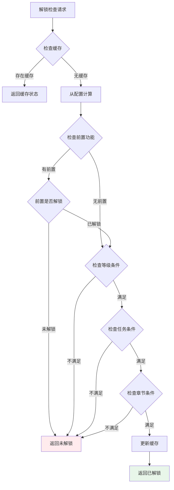
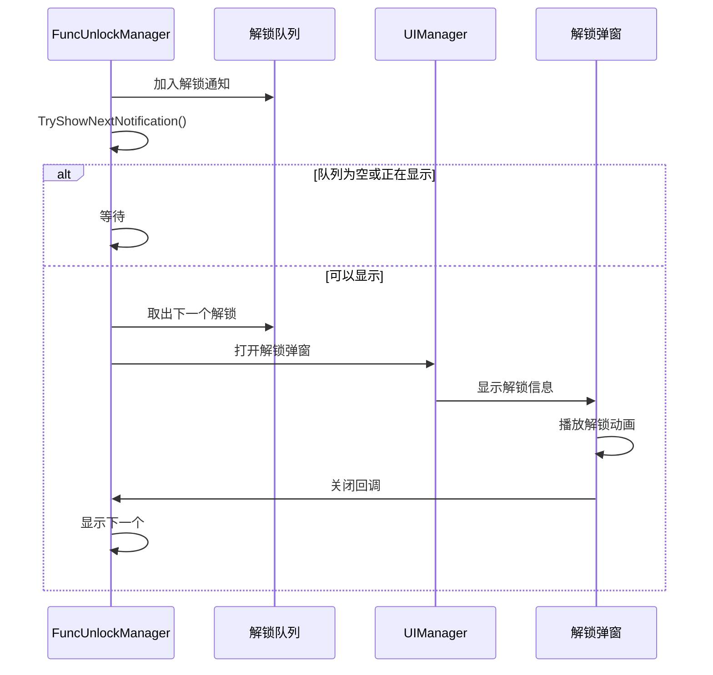
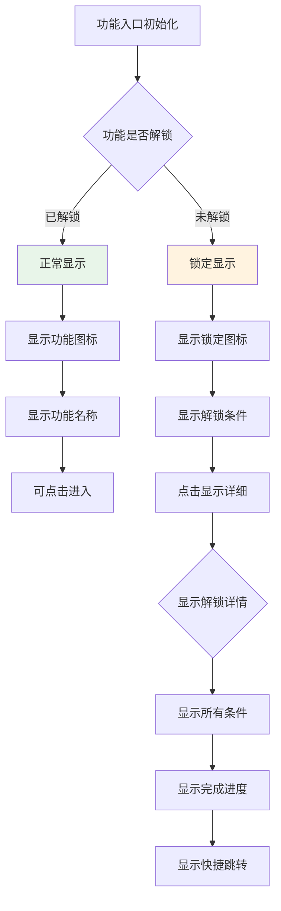

# FuncUnlock 功能解锁模块 - 客户端开发文档

## 客户端组件

### 组件结构

```
game_client/Assets/Scripts/LogicScripts/GameComponent/FuncUnlock/
├── FuncUnlockInfo.cs           # 功能解锁信息类
├── FuncUnlockManager.cs        # 功能解锁管理器
└── FuncUnlockHelper.cs         # 功能解锁辅助工具

game_client/Assets/Scripts/ClientProtocol/RemarkData/
└── FuncUnlockData.cs           # 功能解锁数据类

game_client/Assets/Scripts/ClientProtocol/Common/FuncUnlockObj/
├── FuncUnlock_Info.cs          # 功能解锁信息协议
└── UnlockConditionProgress.cs  # 解锁条件进度协议
```

---

## 核心类说明

### FuncUnlockInfo

功能解锁信息类，存储单个功能的解锁状态和进度信息。

```csharp
/// <summary>
/// 功能解锁信息
/// </summary>
public class FuncUnlockInfo
{
    /// <summary>
    /// 功能ID
    /// </summary>
    public int funcId;

    /// <summary>
    /// 功能名称
    /// </summary>
    public string funcName;

    /// <summary>
    /// 解锁等级
    /// </summary>
    public int unlockLevel;

    /// <summary>
    /// 是否已解锁
    /// </summary>
    public bool isUnlocked;

    /// <summary>
    /// 解锁时间
    /// </summary>
    public long unlockTime;

    /// <summary>
    /// 首次查看时间
    /// </summary>
    public long firstViewTime;

    /// <summary>
    /// 首次使用时间
    /// </summary>
    public long firstUseTime;

    /// <summary>
    /// 检查是否解锁
    /// </summary>
    public bool CheckUnlock()
    {
        return isUnlocked;
    }

    /// <summary>
    /// 获取解锁描述
    /// </summary>
    public string GetUnlockDesc()
    {
        if (isUnlocked)
            return "已解锁";

        if (unlockLevel > 0)
            return $"{unlockLevel}级解锁";

        return "未解锁";
    }
}
```

### FuncUnlockManager

功能解锁管理器，负责管理所有功能的解锁状态和解锁流程。

```csharp
/// <summary>
/// 功能解锁管理器
/// </summary>
public class FuncUnlockManager : SingletonMonoBehaviour<FuncUnlockManager>
{
    // 解锁状态缓存
    private Dictionary<int, FuncUnlockInfo> _unlockCache;

    // 条件进度缓存
    private Dictionary<int, List<UnlockConditionProgress>> _conditionCache;

    // 待推送的解锁队列
    private Queue<int> _pendingUnlockQueue;

    // 是否正在显示解锁提示
    private bool _isShowingNotification;

    // 解锁事件
    public event Action<int> OnFuncUnlocked;
    public event Action<int, UnlockConditionProgress> OnConditionProgress;

    /// <summary>
    /// 检查功能是否解锁
    /// </summary>
    public bool IsFuncUnlocked(int funcId);

    /// <summary>
    /// 获取解锁进度
    /// </summary>
    public UnlockProgressInfo GetUnlockProgress(int funcId);

    /// <summary>
    /// 获取解锁条件描述
    /// </summary>
    public string GetUnlockConditionDesc(int funcId);
}
```

---

## 主要功能

### 1. 解锁检查

检查特定功能是否已解锁，支持多种解锁条件组合判断。



### 2. 解锁提示

显示功能解锁提示和引导，支持队列化显示。



### 3. 条件判断

判断是否满足解锁条件，支持单一条件和组合条件。

```csharp
/// <summary>
/// 检查解锁条件
/// </summary>
private bool CheckUnlockConditions(NPFuncUnlockRefObj config)
{
    // 检查前置功能
    if (config.preFuncId > 0)
    {
        if (!IsFuncUnlocked(config.preFuncId))
            return false;
    }

    // 检查等级条件
    if (config.unlockLevel > 0)
    {
        if (NPPlayer.instance.level < config.unlockLevel)
            return false;
    }

    // 检查任务条件
    if (config.unlockQuestId > 0)
    {
        if (!QuestManager.Instance.IsQuestCompleted(config.unlockQuestId))
            return false;
    }

    // 检查章节条件
    if (config.unlockChapterId > 0)
    {
        if (!ChapterManager.Instance.IsChapterPassed(config.unlockChapterId))
            return false;
    }

    return true;
}
```

---

## 使用示例

### 检查功能解锁

```csharp
/// <summary>
/// 示例：检查商店功能是否解锁
/// </summary>
public class ShopEntrance : MonoBehaviour
{
    [SerializeField]
    private GameObject lockIcon;

    [SerializeField]
    private Text unlockConditionText;

    [SerializeField]
    private Button enterButton;

    private void Start()
    {
        RefreshUnlockStatus();
    }

    private void OnEnable()
    {
        // 监听解锁事件
        FuncUnlockManager.Instance.OnFuncUnlocked += OnFuncUnlocked;
        RefreshUnlockStatus();
    }

    private void OnDisable()
    {
        FuncUnlockManager.Instance.OnFuncUnlocked -= OnFuncUnlocked;
    }

    /// <summary>
    /// 刷新解锁状态
    /// </summary>
    private void RefreshUnlockStatus()
    {
        int shopFuncId = (int)EFuncType.SHOP;

        if (FuncUnlockManager.Instance.IsFuncUnlocked(shopFuncId))
        {
            // 已解锁
            lockIcon.SetActive(false);
            unlockConditionText.gameObject.SetActive(false);
            enterButton.interactable = true;
        }
        else
        {
            // 未解锁
            lockIcon.SetActive(true);
            unlockConditionText.gameObject.SetActive(true);
            unlockConditionText.text = FuncUnlockManager.Instance.GetUnlockConditionDesc(shopFuncId);
            enterButton.interactable = false;
        }
    }

    /// <summary>
    /// 解锁事件回调
    /// </summary>
    private void OnFuncUnlocked(int funcId)
    {
        if (funcId == (int)EFuncType.SHOP)
        {
            RefreshUnlockStatus();
            PlayUnlockAnimation();
        }
    }

    /// <summary>
    /// 播放解锁动画
    /// </summary>
    private void PlayUnlockAnimation()
    {
        // 播放解锁特效
        // ...
    }
}
```

### 监听解锁事件

```csharp
/// <summary>
/// 示例：监听功能解锁事件
/// </summary>
public class FuncUnlockEventListener : MonoBehaviour
{
    private void OnEnable()
    {
        // 注册解锁事件
        FuncUnlockManager.Instance.OnFuncUnlocked += HandleFuncUnlocked;
    }

    private void OnDisable()
    {
        // 注销解锁事件
        FuncUnlockManager.Instance.OnFuncUnlocked -= HandleFuncUnlocked;
    }

    /// <summary>
    /// 处理功能解锁
    /// </summary>
    private void HandleFuncUnlocked(int funcId)
    {
        Debug.Log($"功能 {funcId} 已解锁");

        // 根据功能类型处理
        var funcRef = GRefdataCoreMgr.instance.funcUnlockMap.getRef(funcId);
        if (funcRef == null) return;

        switch ((EFuncType)funcRef.funcType)
        {
            case EFuncType.SYSTEM:
                HandleSystemFuncUnlock(funcId);
                break;
            case EFuncType.BUILDING:
                HandleBuildingFuncUnlock(funcId);
                break;
            case EFuncType.ACTIVITY:
                HandleActivityFuncUnlock(funcId);
                break;
            case EFuncType.SOCIAL:
                HandleSocialFuncUnlock(funcId);
                break;
            case EFuncType.SHOP:
                HandleShopFuncUnlock(funcId);
                break;
        }

        // 更新UI
        UpdateUI();
    }

    private void HandleSystemFuncUnlock(int funcId)
    {
        // 系统功能解锁处理
        WinMsg.SendMsg(WinMsgType.SYSTEM_FUNC_UNLOCK, funcId);
    }

    private void HandleBuildingFuncUnlock(int funcId)
    {
        // 建筑功能解锁处理
        WinMsg.SendMsg(WinMsgType.BUILDING_FUNC_UNLOCK, funcId);
    }

    private void HandleActivityFuncUnlock(int funcId)
    {
        // 活动功能解锁处理
        WinMsg.SendMsg(WinMsgType.ACTIVITY_FUNC_UNLOCK, funcId);
    }

    private void HandleSocialFuncUnlock(int funcId)
    {
        // 社交功能解锁处理
        WinMsg.SendMsg(WinMsgType.SOCIAL_FUNC_UNLOCK, funcId);
    }

    private void HandleShopFuncUnlock(int funcId)
    {
        // 商店功能解锁处理
        WinMsg.SendMsg(WinMsgType.SHOP_FUNC_UNLOCK, funcId);
    }
}
```

### 显示解锁进度

```csharp
/// <summary>
/// 示例：显示功能解锁进度
/// </summary>
public class FuncUnlockProgressUI : MonoBehaviour
{
    [SerializeField]
    private Text funcNameText;

    [SerializeField]
    private Slider progressSlider;

    [SerializeField]
    private Text progressText;

    [SerializeField]
    private Transform conditionContainer;

    [SerializeField]
    private GameObject conditionItemPrefab;

    /// <summary>
    /// 设置功能解锁进度
    /// </summary>
    public void SetFuncId(int funcId)
    {
        var funcRef = GRefdataCoreMgr.instance.funcUnlockMap.getRef(funcId);
        if (funcRef == null) return;

        // 设置功能名称
        funcNameText.text = funcRef.funcName;

        // 获取解锁进度
        var progress = FuncUnlockManager.Instance.GetUnlockProgress(funcId);

        // 计算总体进度
        int satisfiedCount = progress.conditions.Count(c => c.isSatisfied);
        int totalCount = progress.conditions.Count;

        if (totalCount > 0)
        {
            progressSlider.value = (float)satisfiedCount / totalCount;
            progressText.text = $"{satisfiedCount}/{totalCount}";
        }

        // 清空条件列表
        foreach (Transform child in conditionContainer)
        {
            Destroy(child.gameObject);
        }

        // 创建条件项
        foreach (var condition in progress.conditions)
        {
            var item = Instantiate(conditionItemPrefab, conditionContainer);
            var conditionItem = item.GetComponent<UnlockConditionItem>();
            conditionItem.SetCondition(condition);
        }
    }
}

/// <summary>
/// 解锁条件项UI
/// </summary>
public class UnlockConditionItem : MonoBehaviour
{
    [SerializeField]
    private Image conditionIcon;

    [SerializeField]
    private Text conditionText;

    [SerializeField]
    private Image checkIcon;

    [SerializeField]
    private Color satisfiedColor = Color.green;

    [SerializeField]
    private Color unsatisfiedColor = Color.red;

    /// <summary>
    /// 设置条件信息
    /// </summary>
    public void SetCondition(UnlockConditionProgress condition)
    {
        // 设置条件文本
        conditionText.text = GetConditionDesc(condition);

        // 设置是否满足状态
        checkIcon.gameObject.SetActive(condition.isSatisfied);
        conditionText.color = condition.isSatisfied ? satisfiedColor : unsatisfiedColor;
    }

    /// <summary>
    /// 获取条件描述
    /// </summary>
    private string GetConditionDesc(UnlockConditionProgress condition)
    {
        switch ((EConditionType)condition.conditionType)
        {
            case EConditionType.LEVEL:
                return $"达到 {condition.targetValue} 级 (当前: {condition.currentValue})";

            case EConditionType.QUEST:
                return $"完成任务";

            case EConditionType.CHAPTER:
                return $"通关第 {condition.targetValue} 章 (当前: 第 {condition.currentValue} 章)";

            default:
                return "未知条件";
        }
    }
}
```

### 解锁弹窗管理

```csharp
/// <summary>
/// 功能解锁弹窗管理器
/// </summary>
public class FuncUnlockNotificationManager : MonoBehaviour
{
    [SerializeField]
    private GameObject unlockWindowPrefab;

    private Queue<FuncUnlockInfo> _notificationQueue = new Queue<FuncUnlockInfo>();
    private bool _isShowing = false;

    /// <summary>
    /// 添加解锁通知
    /// </summary>
    public void AddNotification(FuncUnlockInfo info)
    {
        _notificationQueue.Enqueue(info);
        TryShowNext();
    }

    /// <summary>
    /// 尝试显示下一个通知
    /// </summary>
    private void TryShowNext()
    {
        if (_isShowing || _notificationQueue.Count == 0)
            return;

        var info = _notificationQueue.Dequeue();
        ShowNotification(info);
    }

    /// <summary>
    /// 显示解锁通知
    /// </summary>
    private void ShowNotification(FuncUnlockInfo info)
    {
        _isShowing = true;

        var window = Instantiate(unlockWindowPrefab, transform);
        var unlockWindow = window.GetComponent<FuncUnlockWindow>();
        unlockWindow.SetData(info);
        unlockWindow.OnClose = () =>
        {
            _isShowing = false;
            TryShowNext();
        };
    }
}

/// <summary>
/// 功能解锁弹窗
/// </summary>
public class FuncUnlockWindow : MonoBehaviour
{
    [SerializeField]
    private Text funcNameText;

    [SerializeField]
    private Text funcDescText;

    [SerializeField]
    private Image funcIcon;

    [SerializeField]
    private Button confirmButton;

    [SerializeField]
    private Animation unlockAnimation;

    public Action OnClose;

    private void Awake()
    {
        confirmButton.onClick.AddListener(Close);
    }

    /// <summary>
    /// 设置解锁数据
    /// </summary>
    public void SetData(FuncUnlockInfo info)
    {
        var funcRef = GRefdataCoreMgr.instance.funcUnlockMap.getRef(info.funcId);
        if (funcRef == null) return;

        funcNameText.text = funcRef.funcName;
        funcDescText.text = funcRef.desc;

        // 播放解锁动画
        unlockAnimation.Play();
    }

    /// <summary>
    /// 关闭弹窗
    /// </summary>
    private void Close()
    {
        OnClose?.Invoke();
        Destroy(gameObject);
    }
}
```

---

## 功能类型枚举

```csharp
/// <summary>
/// 功能类型枚举
/// </summary>
public enum EFuncType
{
    /// <summary>
    /// 系统功能
    /// </summary>
    SYSTEM = 1,

    /// <summary>
    /// 建筑功能
    /// </summary>
    BUILDING = 2,

    /// <summary>
    /// 活动功能
    /// </summary>
    ACTIVITY = 3,

    /// <summary>
    /// 社交功能
    /// </summary>
    SOCIAL = 4,

    /// <summary>
    /// 商店功能
    /// </summary>
    SHOP = 5
}

/// <summary>
/// 常用功能ID定义
/// </summary>
public static class FuncType
{
    public const int BAG = 101;              // 背包
    public const int TEAM = 102;             // 阵容
    public const int MAIL = 103;             // 邮件
    public const int GUILD = 104;            // 公会
    public const int ARENA = 105;            // 竞技场
    public const int SHOP = 106;             // 商店
    public const int ELITE_DUNGEON = 201;    // 精英副本
    public const int WORLD_BOSS = 202;       // 世界BOSS
    public const int FRIEND = 301;           // 好友
    public const int TEAM_BOSS = 302;        // 组队BOSS
}
```

---

## 解锁条件枚举

```csharp
/// <summary>
/// 解锁条件类型枚举
/// </summary>
public enum EConditionType
{
    /// <summary>
    /// 等级条件
    /// </summary>
    LEVEL = 1,

    /// <summary>
    /// 任务条件
    /// </summary>
    QUEST = 2,

    /// <summary>
    /// 章节条件
    /// </summary>
    CHAPTER = 3,

    /// <summary>
    /// 组合条件
    /// </summary>
    COMPOSITE = 4
}
```

---

## UI集成

### 功能入口显示规则



### 红点规则

```csharp
/// <summary>
/// 功能解锁红点管理
/// </summary>
public class FuncUnlockRedDotManager
{
    /// <summary>
    /// 检查功能解锁红点
    /// </summary>
    public static bool CheckUnlockRedDot(int funcId)
    {
        var info = FuncUnlockManager.Instance.GetFuncUnlockInfo(funcId);
        if (info == null) return false;

        // 已解锁但未查看过
        if (info.isUnlocked && info.firstViewTime == 0)
        {
            return true;
        }

        return false;
    }

    /// <summary>
    /// 标记功能已查看
    /// </summary>
    public static void MarkAsViewed(int funcId)
    {
        FuncUnlockManager.Instance.MarkFirstView(funcId);
    }
}
```

---

## 性能优化

### 缓存策略

```csharp
/// <summary>
/// 功能解锁缓存优化
/// </summary>
public class FuncUnlockCache
{
    // 解锁状态缓存
    private Dictionary<int, bool> _unlockStatusCache;

    // 条件进度缓存
    private Dictionary<int, UnlockProgressInfo> _progressCache;

    // 等级索引（快速查找以某等级为条件的功能）
    private Dictionary<int, List<int>> _levelIndex;

    // 任务索引（快速查找以某任务为条件的功能）
    private Dictionary<long, List<int>> _questIndex;

    // 章节索引（快速查找以某章节为条件的功能）
    private Dictionary<int, List<int>> _chapterIndex;

    /// <summary>
    /// 初始化索引
    /// </summary>
    public void InitIndexes()
    {
        var allFuncs = GRefdataCoreMgr.instance.funcUnlockMap.getAllRef();

        foreach (var func in allFuncs)
        {
            // 建立等级索引
            if (func.unlockLevel > 0)
            {
                if (!_levelIndex.ContainsKey(func.unlockLevel))
                {
                    _levelIndex[func.unlockLevel] = new List<int>();
                }
                _levelIndex[func.unlockLevel].Add(func.funcId);
            }

            // 建立任务索引
            if (func.unlockQuestId > 0)
            {
                if (!_questIndex.ContainsKey(func.unlockQuestId))
                {
                    _questIndex[func.unlockQuestId] = new List<int>();
                }
                _questIndex[func.unlockQuestId].Add(func.funcId);
            }

            // 建立章节索引
            if (func.unlockChapterId > 0)
            {
                if (!_chapterIndex.ContainsKey(func.unlockChapterId))
                {
                    _chapterIndex[func.unlockChapterId] = new List<int>();
                }
                _chapterIndex[func.unlockChapterId].Add(func.funcId);
            }
        }
    }

    /// <summary>
    /// 快速获取以某等级为条件的功能列表
    /// </summary>
    public List<int> GetFuncsByUnlockLevel(int level)
    {
        if (_levelIndex.TryGetValue(level, out var list))
        {
            return list;
        }
        return new List<int>();
    }
}
```

---

*文档生成时间: 2026-04-12*
*文档版本: v1.4.0*
