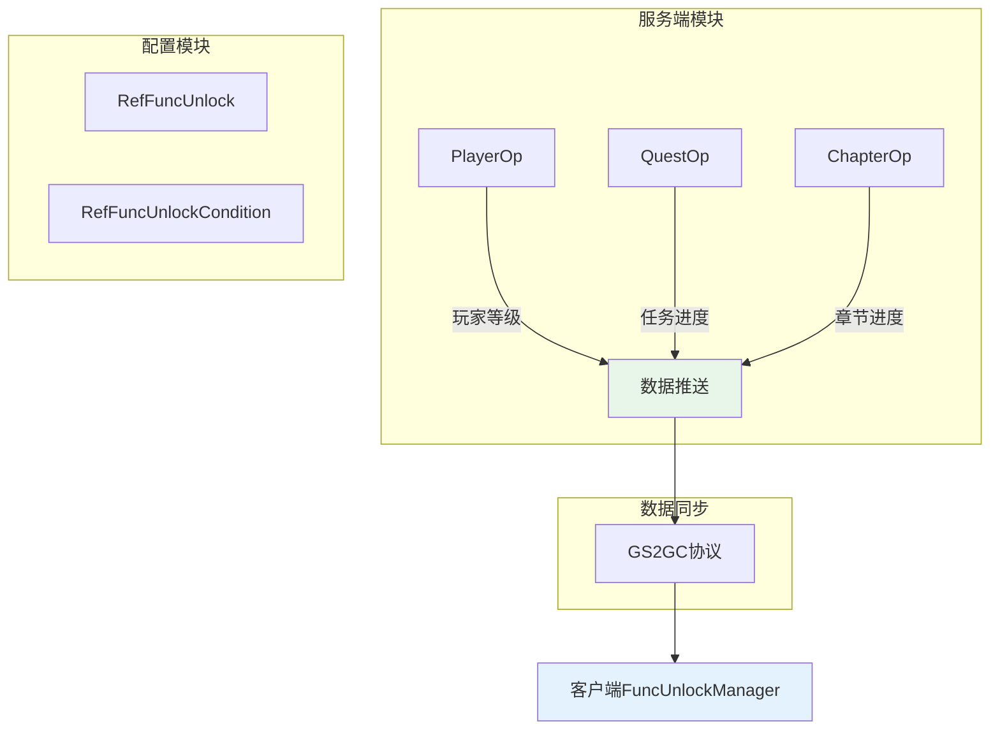
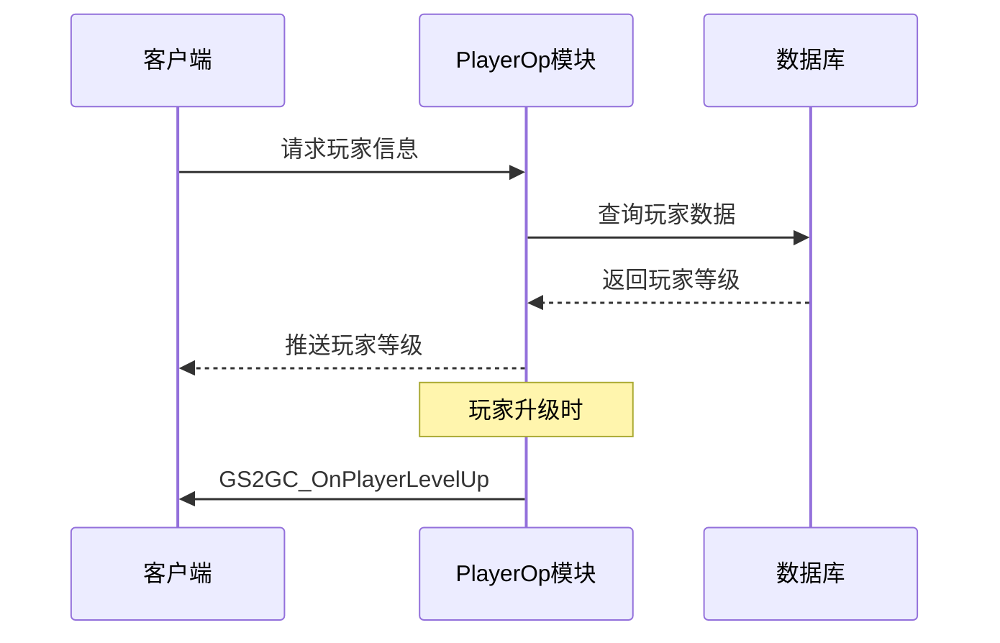
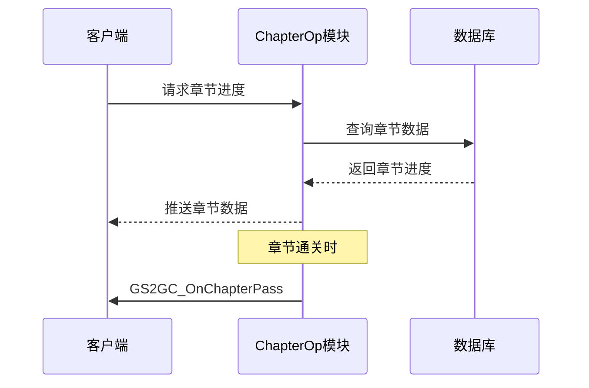
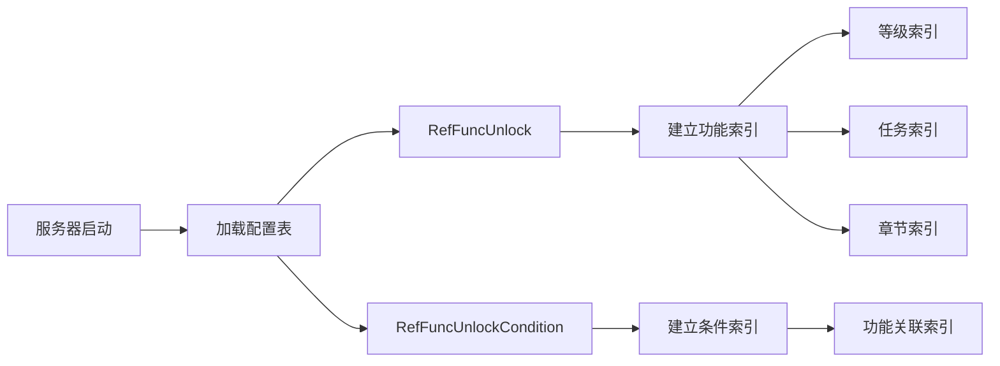
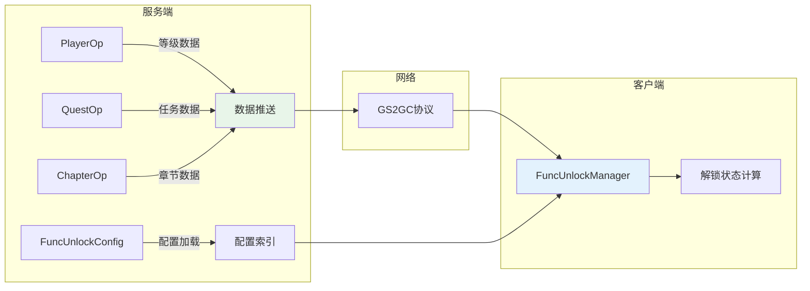

# FuncUnlock 功能解锁模块 - 服务端开发文档

## 模块说明

本模块为客户端独立组件，服务端不直接提供功能解锁协议。服务端通过提供玩家等级、任务进度、章节进度等基础数据，由客户端本地计算解锁状态。

---

## 服务端架构



---

## 服务端支持模块

### 1. PlayerOp 模块

提供玩家等级数据，用于等级条件判断。



**关键数据字段**:

| 字段名 | 类型 | 说明 |
|--------|------|------|
| level | int | 玩家当前等级 |
| exp | long | 当前经验值 |
| levelUpTime | long | 升级时间戳 |

**服务端代码示例**:

```java
/**
 * 玩家等级服务
 */
public class PlayerLevelService
{
    /**
     * 获取玩家等级
     */
    public int getPlayerLevel(long cid)
    {
        NPUSUserData userData = userDao.getByCid(cid);
        return userData.getPlayerComponent().getLevel();
    }

    /**
     * 玩家升级处理
     */
    public void onPlayerLevelUp(long cid, int oldLevel, int newLevel)
    {
        // 推送等级变更
        pushLevelChange(cid, oldLevel, newLevel);

        // 触发等级相关功能解锁检查（仅客户端处理）
        // 客户端收到等级变更后会自动检查功能解锁
    }

    /**
     * 推送等级变更
     */
    private void pushLevelChange(long cid, int oldLevel, int newLevel)
    {
        GS2GC_021_xxx_OnPlayerLevelUp push = new GS2GC_021_xxx_OnPlayerLevelUp();
        push.setOldLevel(oldLevel);
        push.setNewLevel(newLevel);

        NPSessionManager.getSessionByCid(cid).sendMessage(push);
    }
}
```

---

### 2. QuestOp 模块

提供任务完成状态数据，用于任务条件判断。


**关键数据字段**:

| 字段名 | 类型 | 说明 |
|--------|------|------|
| questId | long | 任务ID |
| status | int | 任务状态 |
| progress | long | 当前进度 |
| completeTime | long | 完成时间 |

**服务端代码示例**:

```java
/**
 * 任务服务
 */
public class QuestService
{
    /**
     * 检查任务是否完成
     */
    public boolean isQuestCompleted(long cid, long questId)
    {
        PlayerQuest quest = questDao.getByCidAndQuestId(cid, questId);
        if (quest == null) return false;

        return quest.status == ENPQuestStatus.COMPLETED.ordinal();
    }

    /**
     * 任务完成处理
     */
    public void onQuestComplete(long cid, long questId)
    {
        // 更新任务状态
        PlayerQuest quest = questDao.getByCidAndQuestId(cid, questId);
        if (quest != null)
        {
            quest.status = ENPQuestStatus.COMPLETED.ordinal();
            quest.completeTime = System.currentTimeMillis();
            questDao.update(quest);
        }

        // 推送任务完成
        pushQuestComplete(cid, questId);
    }

    /**
     * 推送任务完成
     */
    private void pushQuestComplete(long cid, long questId)
    {
        GS2GC_015_xxx_OnQuestComplete push = new GS2GC_015_xxx_OnQuestComplete();
        push.setQuestId(questId);
        push.setQuestType(ENPQuestType.MAIN.ordinal());

        NPSessionManager.getSessionByCid(cid).sendMessage(push);
    }

    /**
     * 获取已完成的任务ID列表
     */
    public List<Long> getCompletedQuestIds(long cid)
    {
        return questDao.getCompletedQuestIdsByCid(cid);
    }
}
```

---

### 3. ChapterOp 模块

提供章节通关进度数据，用于章节条件判断。



**关键数据字段**:

| 字段名 | 类型 | 说明 |
|--------|------|------|
| chapterId | int | 章节ID |
| maxChapter | int | 最大通关章节 |
| starCount | int | 星星数量 |
| passTime | long | 通关时间 |

**服务端代码示例**:

```java
/**
 * 章节服务
 */
public class ChapterService
{
    /**
     * 检查章节是否通过
     */
    public boolean isChapterPassed(long cid, int chapterId)
    {
        PlayerChapter chapter = chapterDao.getByCid(cid);
        if (chapter == null) return false;

        return chapter.maxChapter >= chapterId;
    }

    /**
     * 章节通关处理
     */
    public void onChapterPass(long cid, int chapterId, int starCount)
    {
        // 更新章节进度
        PlayerChapter chapter = chapterDao.getByCid(cid);
        if (chapter != null)
        {
            if (chapterId > chapter.maxChapter)
            {
                chapter.maxChapter = chapterId;
            }
            chapter.passTime = System.currentTimeMillis();
            chapterDao.update(chapter);
        }

        // 推送章节通关
        pushChapterPass(cid, chapterId, starCount);
    }

    /**
     * 推送章节通关
     */
    private void pushChapterPass(long cid, int chapterId, int starCount)
    {
        GS2GC_025_xxx_OnChapterPass push = new GS2GC_025_xxx_OnChapterPass();
        push.setChapterId(chapterId);
        push.setStarCount(starCount);

        NPSessionManager.getSessionByCid(cid).sendMessage(push);
    }

    /**
     * 获取最大通关章节
     */
    public int getMaxChapter(long cid)
    {
        PlayerChapter chapter = chapterDao.getByCid(cid);
        if (chapter == null) return 0;

        return chapter.maxChapter;
    }
}
```

---

## 配置表加载



### 配置加载代码

```java
/**
 * 功能解锁配置加载器
 */
public class FuncUnlockConfigLoader
{
    /**
     * 加载功能解锁配置
     */
    public void loadFuncUnlockConfigs()
    {
        // 加载功能配置
        List<RefFuncUnlock> funcConfigs = RefFuncUnlock.getMgr().getAll();
        for (RefFuncUnlock config : funcConfigs)
        {
            // 建立索引
            buildFuncIndexes(config);
        }

        // 加载条件配置
        List<RefFuncUnlockCondition> conditionConfigs = RefFuncUnlockCondition.getMgr().getAll();
        for (RefFuncUnlockCondition config : conditionConfigs)
        {
            // 建立条件索引
            buildConditionIndexes(config);
        }
    }

    /**
     * 建立功能索引
     */
    private void buildFuncIndexes(RefFuncUnlock config)
    {
        // 等级索引
        if (config.unlockLevel > 0)
        {
            levelIndex.computeIfAbsent(config.unlockLevel, k -> new ArrayList<>())
                .add(config.funcId);
        }

        // 任务索引
        if (config.unlockQuestId > 0)
        {
            questIndex.computeIfAbsent(config.unlockQuestId, k -> new ArrayList<>())
                .add(config.funcId);
        }

        // 章节索引
        if (config.unlockChapterId > 0)
        {
            chapterIndex.computeIfAbsent(config.unlockChapterId, k -> new ArrayList<>())
                .add(config.funcId);
        }
    }
}
```

---

## 数据库表结构

### 玩家数据表（供客户端计算使用）

功能解锁不需要独立的数据库表，解锁状态由客户端根据以下数据实时计算：

```sql
-- 玩家等级数据（player表或player_component表）
-- 提供等级条件判断依据

-- 任务完成数据（player_quest表）
-- 提供任务条件判断依据

-- 章节进度数据（player_chapter表）
-- 提供章节条件判断依据
```

---

## 模块关系图



---

## 配置查询接口

### Java服务端配置查询

```java
/**
 * 功能解锁配置查询服务
 */
public class FuncUnlockConfigService
{
    /**
     * 获取功能配置
     */
    public RefFuncUnlock getFuncConfig(int funcId)
    {
        return RefFuncUnlock.getMgr().get(funcId);
    }

    /**
     * 获取某等级解锁的功能列表
     */
    public List<Integer> getFuncsByUnlockLevel(int level)
    {
        return RefFuncUnlock.getMgr().getByUnlockLevel(level);
    }

    /**
     * 获取某任务解锁的功能列表
     */
    public List<Integer> getFuncsByUnlockQuest(long questId)
    {
        return RefFuncUnlock.getMgr().getByUnlockQuest(questId);
    }

    /**
     * 获取某章节解锁的功能列表
     */
    public List<Integer> getFuncsByUnlockChapter(int chapterId)
    {
        return RefFuncUnlock.getMgr().getByUnlockChapter(chapterId);
    }

    /**
     * 获取某类型的所有功能
     */
    public List<RefFuncUnlock> getFuncsByType(int funcType)
    {
        return RefFuncUnlock.getMgr().getByType(funcType);
    }

    /**
     * 获取所有功能配置
     */
    public List<RefFuncUnlock> getAllFuncConfigs()
    {
        return RefFuncUnlock.getMgr().getAll();
    }
}
```

---

## 配置表定义

### RefFuncUnlock.java

```java
/**
 * 功能解锁配置表
 */
public class RefFuncUnlock extends NPBaseRefObj
{
    /** 功能ID */
    public int funcId;

    /** 功能名称 */
    public String funcName;

    /** 功能类型 */
    public int funcType;

    /** 解锁等级 */
    public int unlockLevel;

    /** 解锁任务ID */
    public long unlockQuestId;

    /** 解锁章节ID */
    public int unlockChapterId;

    /** 显示优先级 */
    public int priority;

    /** 前置功能ID */
    public int preFuncId;

    /** 功能描述 */
    public String desc;

    /** 图标资源 */
    public String iconRes;

    /** UI资源ID */
    public int uiResId;

    /** 排序ID */
    public long sortId;

    /**
     * 获取管理器
     */
    public static RefFuncUnlockMgr getMgr()
    {
        return RefFuncUnlockMgr.getInstance();
    }

    @Override
    public long getId()
    {
        return funcId;
    }
}
```

### RefFuncUnlockMgr.java

```java
/**
 * 功能解锁配置管理器
 */
public class RefFuncUnlockMgr extends NPBaseRefMgr<RefFuncUnlock>
{
    // 等级索引
    private Map<Integer, List<Integer>> levelIndex = new HashMap<>();

    // 任务索引
    private Map<Long, List<Integer>> questIndex = new HashMap<>();

    // 章节索引
    private Map<Integer, List<Integer>> chapterIndex = new HashMap<>();

    // 类型索引
    private Map<Integer, List<RefFuncUnlock>> typeIndex = new HashMap<>();

    @Override
    protected void buildIndexes(RefFuncUnlock ref)
    {
        // 建立等级索引
        if (ref.unlockLevel > 0)
        {
            levelIndex.computeIfAbsent(ref.unlockLevel, k -> new ArrayList<>())
                .add(ref.funcId);
        }

        // 建立任务索引
        if (ref.unlockQuestId > 0)
        {
            questIndex.computeIfAbsent(ref.unlockQuestId, k -> new ArrayList<>())
                .add(ref.funcId);
        }

        // 建立章节索引
        if (ref.unlockChapterId > 0)
        {
            chapterIndex.computeIfAbsent(ref.unlockChapterId, k -> new ArrayList<>())
                .add(ref.funcId);
        }

        // 建立类型索引
        typeIndex.computeIfAbsent(ref.funcType, k -> new ArrayList<>())
            .add(ref);
    }

    /**
     * 根据解锁等级获取功能列表
     */
    public List<Integer> getByUnlockLevel(int level)
    {
        return levelIndex.getOrDefault(level, Collections.emptyList());
    }

    /**
     * 根据解锁任务获取功能列表
     */
    public List<Integer> getByUnlockQuest(long questId)
    {
        return questIndex.getOrDefault(questId, Collections.emptyList());
    }

    /**
     * 根据解锁章节获取功能列表
     */
    public List<Integer> getByUnlockChapter(int chapterId)
    {
        return chapterIndex.getOrDefault(chapterId, Collections.emptyList());
    }

    /**
     * 根据类型获取功能列表
     */
    public List<RefFuncUnlock> getByType(int funcType)
    {
        return typeIndex.getOrDefault(funcType, Collections.emptyList());
    }
}
```

---

## 配置文件位置

```
game_server/GameRes/src/NPGameRes/Refs/FuncUnlock/
├── RefFuncUnlock.java            # 功能解锁配置
├── RefFuncUnlockMgr.java         # 功能解锁配置管理器
├── RefFuncUnlockCondition.java   # 解锁条件配置
└── RefFuncUnlockConditionMgr.java # 解锁条件配置管理器
```

---

## 注意事项

1. **客户端独立计算**: 功能解锁状态完全由客户端根据服务端推送的数据本地计算，服务端不存储解锁状态。

2. **数据同步时机**: 服务端需要在玩家登录、升级、完成任务、通关章节时推送相关数据变更。

3. **配置加载**: 服务端需要加载功能解锁配置表，用于运营后台查询和配置管理。

4. **无需专门协议**: 功能解锁模块不需要定义专门的请求/响应协议，依赖其他模块的数据推送。

---

*文档生成时间: 2026-04-12*
*文档版本: v1.4.0*