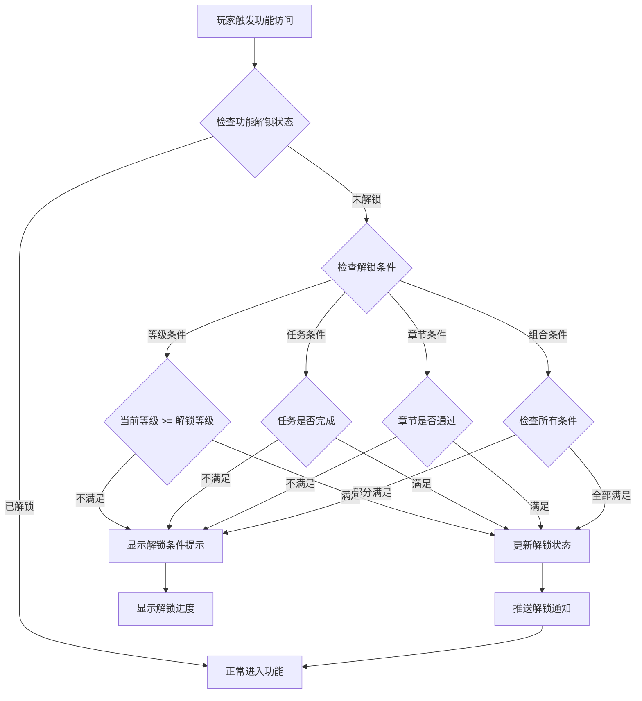
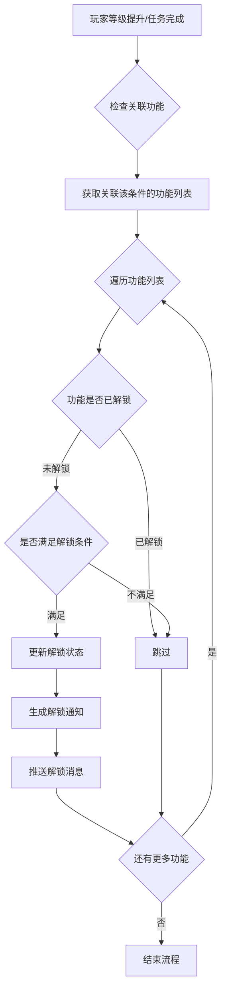
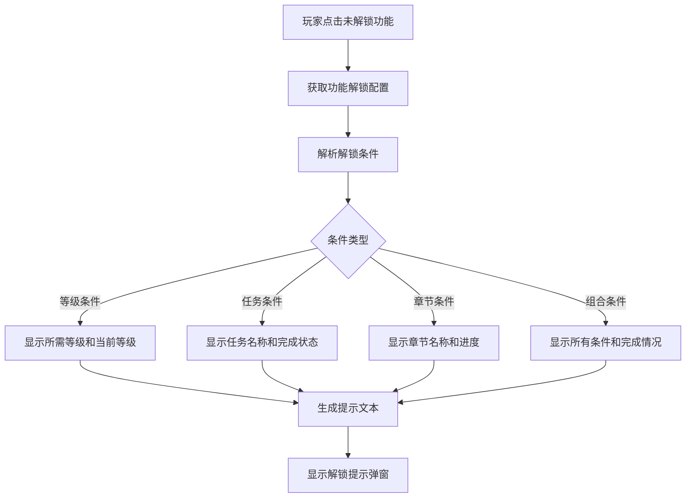

# 功能解锁模块完整说明

## 一、模块概述

### 1.1 业务背景

功能解锁模块是 K2C 游戏的引导系统核心组件，负责管理游戏内各功能模块的逐步开放。通过合理的解锁条件设计，引导玩家循序渐进地体验游戏内容，避免新玩家面对过多功能时产生困惑，同时为玩家提供明确的成长目标。

### 1.2 目标用户

- **新玩家**：通过逐步解锁功能，降低游戏入门门槛
- **活跃玩家**：通过解锁条件获得持续的游戏目标
- **运营人员**：通过解锁配置控制游戏节奏和内容开放

### 1.3 核心价值

1. **游戏引导**：控制功能开放节奏，引导玩家逐步深入游戏
2. **目标驱动**：为玩家提供明确的短期目标
3. **体验优化**：避免信息过载，提升新手体验
4. **数据驱动**：通过解锁条件分析玩家行为

---

## 二、功能清单

### 2.1 解锁条件管理

| 功能名称 | 功能描述 | 用户价值 |
|---------|---------|---------|
| 等级解锁 | 玩家达到指定等级解锁功能 | 明确升级目标 |
| 任务解锁 | 完成指定任务解锁功能 | 引导任务参与 |
| 章节解锁 | 通过指定章节解锁功能 | 推进剧情体验 |
| 条件组合 | 多条件组合解锁 | 增加挑战性 |

### 2.2 解锁状态管理

| 功能名称 | 功能描述 | 用户价值 |
|---------|---------|---------|
| 解锁检查 | 实时检查功能解锁状态 | 精确显示可用功能 |
| 解锁提示 | 显示解锁条件和进度 | 明确解锁目标 |
| 解锁通知 | 功能解锁时推送通知 | 即时知晓新功能 |
| 解锁记录 | 记录历史解锁信息 | 追踪游戏进度 |

### 2.3 功能类型管理

| 功能名称 | 功能描述 | 用户价值 |
|---------|---------|---------|
| 系统功能 | 核心游戏系统解锁 | 基础游戏体验 |
| 建筑功能 | 建筑相关功能解锁 | 扩展玩法 |
| 活动功能 | 活动相关功能解锁 | 限时玩法体验 |
| 社交功能 | 社交相关功能解锁 | 社交互动 |
| 商店功能 | 商店相关功能解锁 | 消费渠道 |

---

## 三、业务流程详解

### 3.1 功能解锁检查流程



**详细步骤说明**：

1. **状态检查**
   - 查询功能解锁状态缓存
   - 未缓存时从配置计算解锁状态

2. **条件判定**
   - 等级条件：玩家当前等级 >= 配置解锁等级
   - 任务条件：指定任务状态为已完成
   - 章节条件：指定章节已通关
   - 组合条件：所有子条件同时满足

3. **状态更新**
   - 标记功能为已解锁
   - 记录解锁时间
   - 推送解锁通知

### 3.2 新功能解锁推送流程



**详细步骤说明**：

1. **事件监听**
   - 监听玩家等级变化事件
   - 监听任务完成事件
   - 监听章节通关事件

2. **关联查询**
   - 查询以该条件为解锁条件的功能列表
   - 按优先级排序

3. **批量解锁**
   - 遍历所有关联功能
   - 检查是否满足解锁条件
   - 批量更新解锁状态
   - 推送解锁通知

### 3.3 解锁提示展示流程



---

## 四、关键规则

### 4.1 解锁条件规则

1. **等级条件**
   - 玩家等级达到指定值时解锁
   - 最常用的解锁条件
   - 默认解锁等级为1级

2. **任务条件**
   - 完成指定主线任务后解锁
   - 任务必须为主线任务
   - 支持多个任务组合

3. **章节条件**
   - 通过指定章节后解锁
   - 章节进度必须完全通关
   - 支持多章节条件

4. **组合条件**
   - 多个条件同时满足时解锁
   - 条件之间为AND关系
   - 最多支持5个条件组合

### 4.2 功能类型规则

| 类型ID | 类型名 | 说明 |
|--------|--------|------|
| 1 | SYSTEM | 系统功能（背包、阵容等） |
| 2 | BUILDING | 建筑功能（客栈、铁匠铺等） |
| 3 | ACTIVITY | 活动功能（限时活动等） |
| 4 | SOCIAL | 社交功能（好友、公会等） |
| 5 | SHOP | 商店功能（商城、兑换等） |

### 4.3 解锁显示规则

1. **入口显示**
   - 未解锁功能入口显示锁定图标
   - 显示解锁条件简要描述
   - 点击显示详细解锁条件

2. **红点规则**
   - 新解锁功能显示红点提示
   - 红点持续到玩家首次点击
   - 红点可配置显示时长

---

## 五、用户故事

### 5.1 新玩家故事

> 作为一名新玩家，我刚进入游戏时只能看到基础功能。随着等级提升，每升几级就会解锁新功能，系统会提示"恭喜解锁xxx功能"，让我对升级充满期待。当我到达10级时，公会系统解锁了，我迫不及待地加入了好友的公会，开始了社交玩法。

### 5.2 活跃玩家故事

> 作为一名活跃玩家，我一直在努力推进主线任务。当完成第5章后，精英副本功能解锁了，我可以挑战更高难度的副本获取稀有装备。解锁条件清晰显示在功能入口，让我知道下一步该做什么。

### 5.3 回归玩家故事

> 作为一名回归玩家，我看到很多新功能被锁定。通过查看解锁条件，我了解到需要先完成前置内容才能体验。系统逐步引导我补齐进度，让我不会感到迷茫。

---

## 六、示例

### 6.1 功能解锁配置示例

**配置数据**：
```
功能ID: 101
功能名称: 公会系统
功能类型: SOCIAL (4)
解锁条件: 等级 >= 10
前置功能: 无
```

**解锁判定**：
```
玩家等级: 8
判定结果: 未解锁
提示信息: "公会系统将在10级解锁"
```

### 6.2 组合条件解锁示例

**配置数据**：
```
功能ID: 201
功能名称: 精英副本
功能类型: ACTIVITY (3)
解锁条件: 等级 >= 20 AND 章节 >= 5
```

**解锁判定**：
```
玩家等级: 22
章节进度: 4
判定结果: 未解锁
进度显示:
  - 等级条件: 已满足 (22/20)
  - 章节条件: 未满足 (4/5)
提示信息: "通关第5章后解锁"
```

### 6.3 批量解锁示例

**玩家升级场景**：
```
玩家从9级升到10级:
解锁功能列表:
  - 公会系统 (ID: 101)
  - 竞技场 (ID: 102)
  - 每日签到 (ID: 103)

推送通知: "恭喜解锁公会系统、竞技场、每日签到！"
```

---

*文档生成时间: 2026-04-07*
