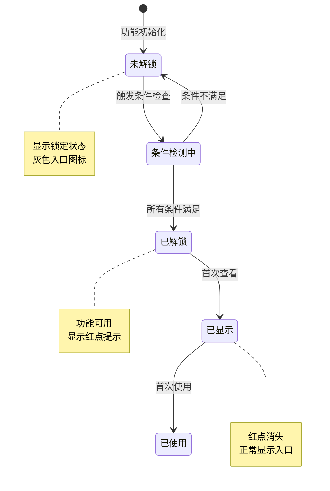
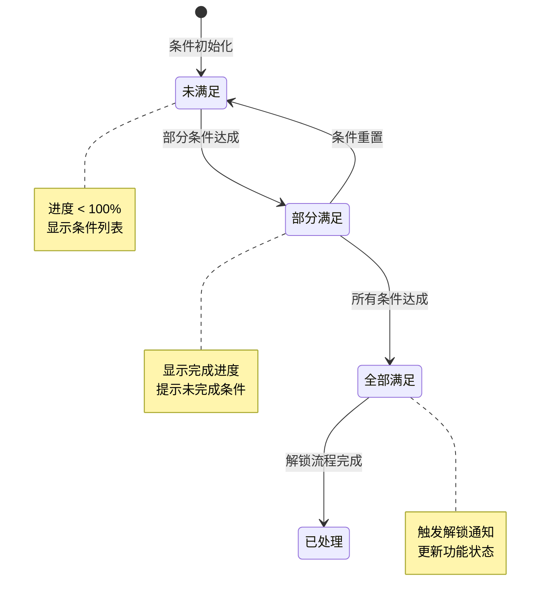
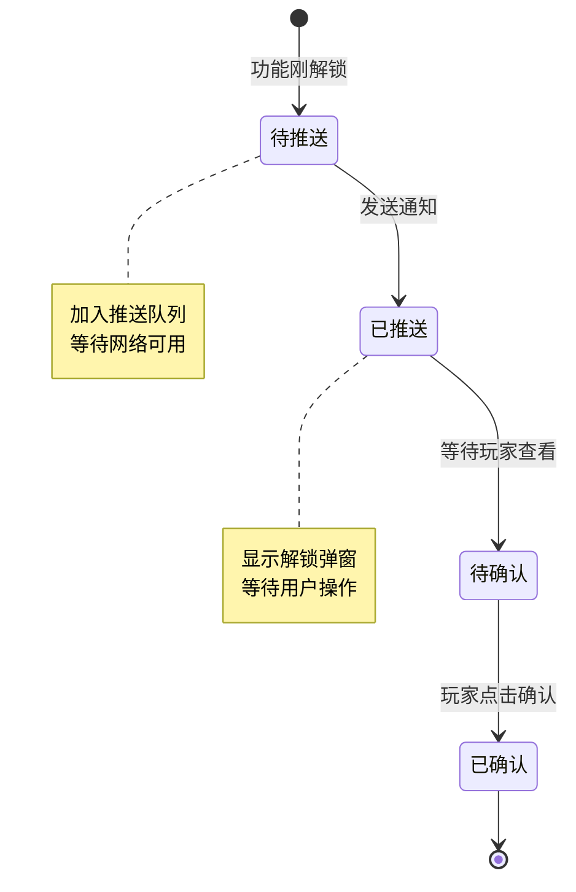
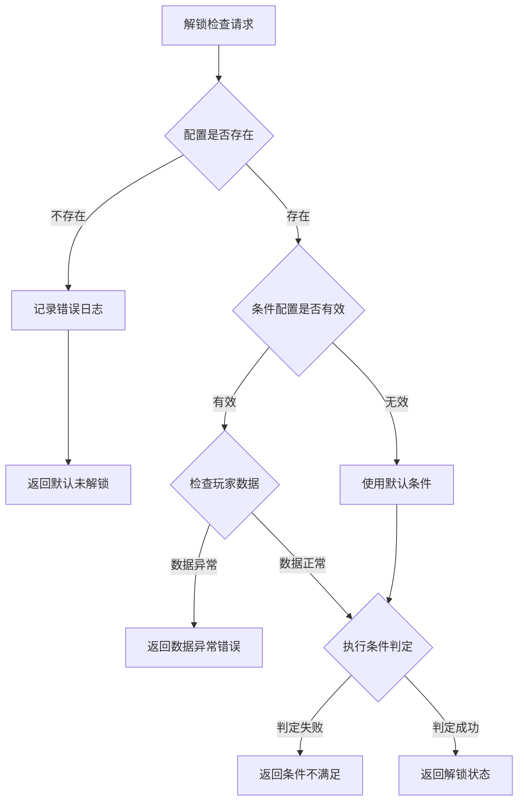

# 功能解锁模块实现细节

## 一、计算公式

### 1.1 解锁进度计算公式

```
解锁进度 = 当前值 / 目标值 × 100%
```

**参数说明**：
- `当前值`：玩家当前进度值（等级、任务数等）
- `目标值`：解锁条件要求的目标值

**示例计算**：
```
等级解锁条件: 等级 >= 20
玩家当前等级: 15
解锁进度: 15 / 20 × 100% = 75%
```

### 1.2 组合条件完成度公式

```
完成度 = 已满足条件数 / 总条件数 × 100%
```

**示例计算**：
```
组合条件:
  - 等级 >= 20 (当前: 22, 满足)
  - 章节 >= 5 (当前: 4, 不满足)
  - 任务完成 (当前: 已完成, 满足)

已满足条件数: 2
总条件数: 3
完成度: 2 / 3 × 100% = 66.7%
```

### 1.3 解锁优先级计算

```
显示优先级 = 基础优先级 × 类型权重 + 等级权重
```

**参数说明**：
- `基础优先级`：配置表设定的基础优先级
- `类型权重`：功能类型对应的权重系数
- `等级权重`：解锁等级影响的权重

---

## 二、状态机定义

### 2.1 功能解锁状态机



### 2.2 解锁条件状态机



### 2.3 解锁通知状态机



---

## 三、数据约束

### 3.1 功能解锁配置约束

| 字段名 | 数据类型 | 取值范围 | 必填 | 唯一性 | 说明 |
|--------|----------|----------|------|--------|------|
| funcId | int | > 0 | 是 | 是 | 功能唯一ID |
| funcName | string | 1-50字符 | 是 | 否 | 功能名称 |
| funcType | int | 1-5 | 是 | 否 | 功能类型 |
| unlockLevel | int | 1-100 | 否 | 否 | 解锁等级 |
| unlockQuestId | long | > 0 | 否 | 否 | 解锁任务ID |
| unlockChapterId | int | > 0 | 否 | 否 | 解锁章节ID |
| priority | int | 1-100 | 是 | 否 | 显示优先级 |
| preFuncId | int | >= 0 | 否 | 否 | 前置功能ID |

### 3.2 解锁条件配置约束

| 字段名 | 数据类型 | 取值范围 | 必填 | 说明 |
|--------|----------|----------|------|------|
| conditionId | long | > 0 | 是 | 条件ID |
| conditionType | int | 1-4 | 是 | 条件类型 |
| targetValue | int | >= 0 | 是 | 目标值 |
| description | string | 0-100字符 | 否 | 条件描述 |

### 3.3 玩家解锁数据约束

| 字段名 | 数据类型 | 取值范围 | 必填 | 说明 |
|--------|----------|----------|------|------|
| playerId | long | > 0 | 是 | 玩家ID |
| funcId | int | > 0 | 是 | 功能ID |
| unlockTime | datetime | - | 是 | 解锁时间 |
| firstViewTime | datetime | - | 否 | 首次查看时间 |
| firstUseTime | datetime | - | 否 | 首次使用时间 |

### 3.4 条件类型枚举

| 类型值 | 类型名 | 说明 |
|--------|--------|------|
| 1 | LEVEL | 等级条件 |
| 2 | QUEST | 任务条件 |
| 3 | CHAPTER | 章节条件 |
| 4 | COMPOSITE | 组合条件 |

---

## 四、错误处理策略

### 4.1 功能解锁错误码

| 错误码 | 错误信息 | 处理策略 | 用户提示 |
|--------|----------|----------|----------|
| 50001 | 功能不存在 | 检查功能ID有效性 | "功能暂未开放" |
| 50002 | 功能未解锁 | 显示解锁条件 | "该功能尚未解锁，需要完成xxx" |
| 50003 | 前置功能未解锁 | 显示前置条件 | "请先解锁xxx功能" |
| 50004 | 等级不足 | 显示所需等级 | "等级不足，需要达到X级" |
| 50005 | 任务未完成 | 显示任务信息 | "需要完成任务：xxx" |
| 50006 | 章节未通关 | 显示章节信息 | "需要通关第X章" |

### 4.2 解锁检查异常处理流程



### 4.3 配置错误处理

| 错误场景 | 处理策略 | 影响 |
|----------|----------|------|
| 功能配置缺失 | 使用默认配置，记录警告日志 | 功能显示为未解锁 |
| 条件配置无效 | 忽略该条件，继续检查其他条件 | 可能提前解锁 |
| 循环依赖 | 检测并报错，阻止功能解锁 | 功能无法解锁 |
| 类型值非法 | 默认为系统类型 | 功能可正常使用 |

---

## 五、关键代码示例

### 5.1 解锁检查伪代码

```csharp
public class FuncUnlockManager
{
    // 解锁状态缓存
    private Dictionary<int, FuncUnlockInfo> _unlockCache;

    // 检查功能是否解锁
    public bool IsFuncUnlocked(int funcId)
    {
        // 检查缓存
        if (_unlockCache.TryGetValue(funcId, out var info))
        {
            return info.isUnlocked;
        }

        // 从配置计算解锁状态
        var config = GetFuncConfig(funcId);
        if (config == null)
        {
            Debug.LogWarning($"功能配置不存在: {funcId}");
            return false;
        }

        // 检查解锁条件
        bool unlocked = CheckUnlockConditions(config);

        // 更新缓存
        _unlockCache[funcId] = new FuncUnlockInfo
        {
            funcId = funcId,
            isUnlocked = unlocked
        };

        return unlocked;
    }

    // 检查解锁条件
    private bool CheckUnlockConditions(FuncConfig config)
    {
        // 检查等级条件
        if (config.unlockLevel > 0)
        {
            if (PlayerManager.Instance.level < config.unlockLevel)
                return false;
        }

        // 检查前置功能
        if (config.preFuncId > 0)
        {
            if (!IsFuncUnlocked(config.preFuncId))
                return false;
        }

        // 检查任务条件
        if (config.unlockQuestId > 0)
        {
            if (!QuestManager.Instance.IsQuestCompleted(config.unlockQuestId))
                return false;
        }

        // 检查章节条件
        if (config.unlockChapterId > 0)
        {
            if (!ChapterManager.Instance.IsChapterPassed(config.unlockChapterId))
                return false;
        }

        return true;
    }
}
```

### 5.2 获取解锁进度伪代码

```csharp
public class FuncUnlockManager
{
    // 获取解锁进度信息
    public UnlockProgressInfo GetUnlockProgress(int funcId)
    {
        var config = GetFuncConfig(funcId);
        if (config == null)
            return null;

        var progress = new UnlockProgressInfo
        {
            funcId = funcId,
            funcName = config.funcName,
            conditions = new List<ConditionProgress>()
        };

        // 等级条件进度
        if (config.unlockLevel > 0)
        {
            progress.conditions.Add(new ConditionProgress
            {
                type = ConditionType.LEVEL,
                current = PlayerManager.Instance.level,
                target = config.unlockLevel,
                isSatisfied = PlayerManager.Instance.level >= config.unlockLevel,
                description = $"达到{config.unlockLevel}级"
            });
        }

        // 任务条件进度
        if (config.unlockQuestId > 0)
        {
            var questConfig = QuestManager.Instance.GetQuestConfig(config.unlockQuestId);
            bool completed = QuestManager.Instance.IsQuestCompleted(config.unlockQuestId);
            progress.conditions.Add(new ConditionProgress
            {
                type = ConditionType.QUEST,
                current = completed ? 1 : 0,
                target = 1,
                isSatisfied = completed,
                description = $"完成任务：{questConfig.questName}"
            });
        }

        // 章节条件进度
        if (config.unlockChapterId > 0)
        {
            int chapterProgress = ChapterManager.Instance.GetMaxChapter();
            bool passed = chapterProgress >= config.unlockChapterId;
            progress.conditions.Add(new ConditionProgress
            {
                type = ConditionType.CHAPTER,
                current = chapterProgress,
                target = config.unlockChapterId,
                isSatisfied = passed,
                description = $"通关第{config.unlockChapterId}章"
            });
        }

        // 计算总进度
        progress.totalProgress = progress.conditions.Count(c => c.isSatisfied) * 100 /
                                  progress.conditions.Count;

        return progress;
    }
}
```

### 5.3 解锁事件监听伪代码

```csharp
public class FuncUnlockManager
{
    // 初始化事件监听
    public void InitEventListeners()
    {
        // 监听等级变化
        EventManager.Instance.Subscribe<PlayerLevelUpEvent>(OnPlayerLevelUp);

        // 监听任务完成
        EventManager.Instance.Subscribe<QuestCompletedEvent>(OnQuestCompleted);

        // 监听章节通关
        EventManager.Instance.Subscribe<ChapterPassedEvent>(OnChapterPassed);
    }

    // 玩家升级事件处理
    private void OnPlayerLevelUp(PlayerLevelUpEvent evt)
    {
        // 获取以该等级为条件的功能列表
        var funcList = GetFuncsByUnlockLevel(evt.newLevel);

        foreach (var funcId in funcList)
        {
            // 检查是否满足所有条件
            if (CheckUnlockConditions(GetFuncConfig(funcId)))
            {
                // 触发解锁
                TriggerUnlock(funcId);
            }
        }
    }

    // 触发解锁
    private void TriggerUnlock(int funcId)
    {
        // 更新缓存
        if (_unlockCache.ContainsKey(funcId))
        {
            _unlockCache[funcId].isUnlocked = true;
            _unlockCache[funcId].unlockTime = DateTime.Now;
        }
        else
        {
            _unlockCache[funcId] = new FuncUnlockInfo
            {
                funcId = funcId,
                isUnlocked = true,
                unlockTime = DateTime.Now
            };
        }

        // 发送解锁事件
        EventManager.Instance.Publish(new FuncUnlockedEvent { funcId = funcId });

        // 显示解锁提示
        ShowUnlockNotification(funcId);
    }
}
```

### 5.4 解锁提示显示伪代码

```csharp
public class FuncUnlockManager
{
    // 显示解锁提示
    private void ShowUnlockNotification(int funcId)
    {
        var config = GetFuncConfig(funcId);
        if (config == null) return;

        // 创建通知数据
        var notification = new UnlockNotification
        {
            funcId = funcId,
            funcName = config.funcName,
            funcType = config.funcType,
            description = GetUnlockDescription(config)
        };

        // 加入通知队列
        _notificationQueue.Enqueue(notification);

        // 尝试显示下一个通知
        TryShowNextNotification();
    }

    // 尝试显示下一个通知
    private void TryShowNextNotification()
    {
        // 当前有通知显示中则等待
        if (_isShowingNotification) return;

        // 队列为空则结束
        if (_notificationQueue.Count == 0) return;

        // 获取下一个通知
        var notification = _notificationQueue.Dequeue();
        _isShowingNotification = true;

        // 显示解锁弹窗
        UIManager.Instance.OpenWindow<UnlockNotificationWindow>((win) =>
        {
            win.SetData(notification);
            win.OnClose = () =>
            {
                _isShowingNotification = false;
                TryShowNextNotification();
            };
        });
    }
}
```

---

## 六、跨模块依赖

### 6.1 依赖模块

| 模块名称 | 依赖类型 | 依赖说明 |
|----------|----------|----------|
| PlayerOp | 数据依赖 | 获取玩家等级数据 |
| QuestOp | 数据依赖 | 获取任务完成状态 |
| ChapterOp | 数据依赖 | 获取章节通关进度 |

### 6.2 被依赖说明

功能解锁模块是一个客户端独立组件，不依赖服务端模块，其他模块通过以下方式使用：

```csharp
// 其他模块检查功能解锁状态
if (FuncUnlockManager.Instance.IsFuncUnlocked(FuncType.GUILD))
{
    // 显示公会入口
    ShowGuildEntrance();
}
else
{
    // 显示解锁条件
    ShowUnlockCondition(FuncType.GUILD);
}
```

### 6.3 数据同步说明

功能解锁状态不需要单独同步，由客户端根据以下数据实时计算：

- 玩家等级（PlayerOp 同步）
- 任务进度（QuestOp 同步）
- 章节进度（ChapterOp 同步）

---

*文档生成时间: 2026-04-07*
