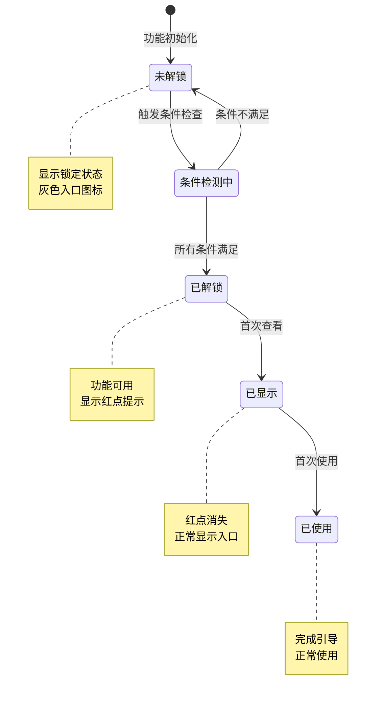
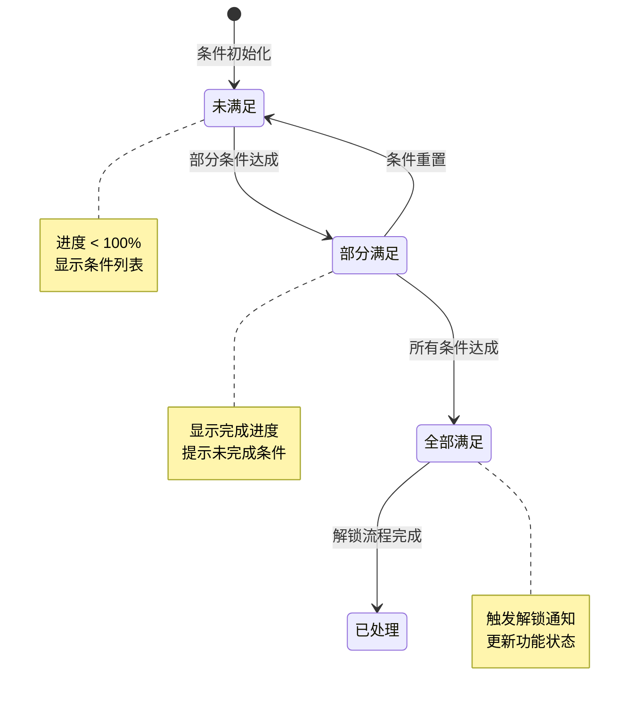
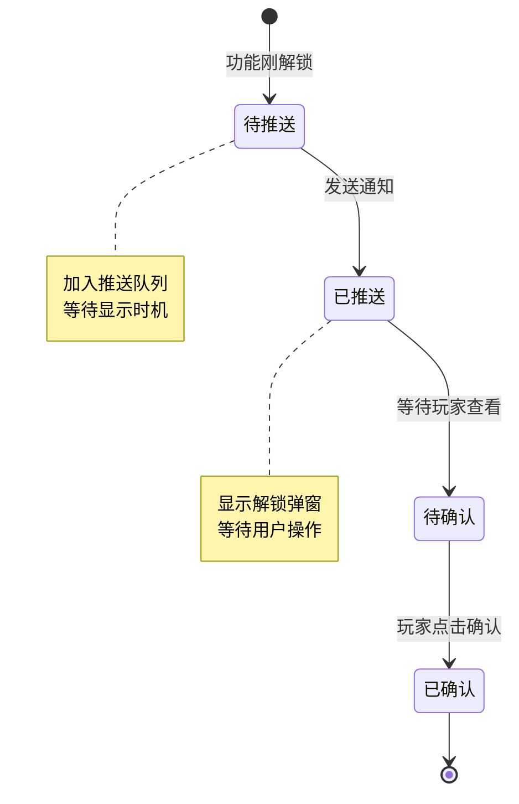
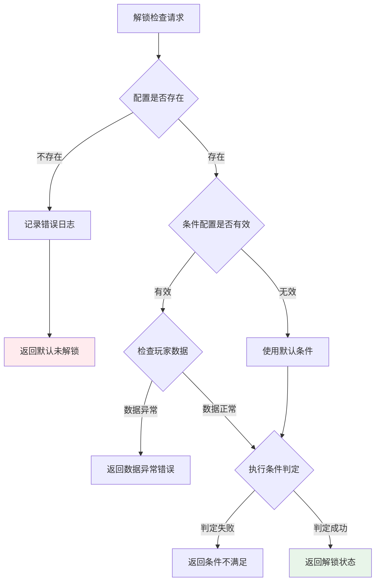
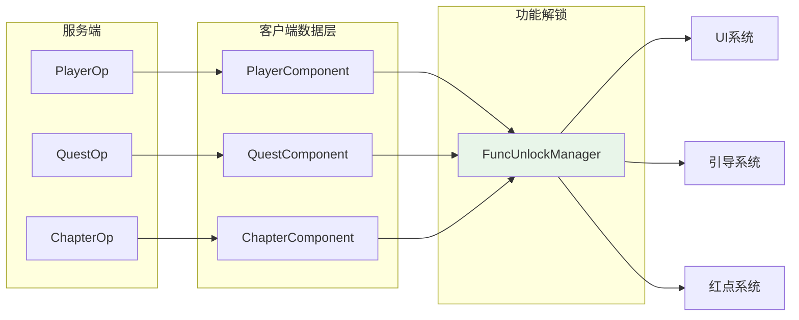

# 功能解锁模块实现细节

## 一、计算公式

### 1.1 解锁进度计算公式

```
解锁进度 = 当前值 / 目标值 × 100%
```

**参数说明**：
- `当前值`：玩家当前进度值（等级、任务数等）
- `目标值`：解锁条件要求的目标值

**示例计算**：
```
等级解锁条件: 等级 >= 20
玩家当前等级: 15
解锁进度: 15 / 20 × 100% = 75%
```

### 1.2 组合条件完成度公式

```
完成度 = 已满足条件数 / 总条件数 × 100%
```

**示例计算**：
```
组合条件:
  - 等级 >= 20 (当前: 22, 满足) ✓
  - 章节 >= 5 (当前: 4, 不满足) ✗
  - 任务完成 (当前: 已完成, 满足) ✓

已满足条件数: 2
总条件数: 3
完成度: 2 / 3 × 100% = 66.7%
```

### 1.3 解锁优先级计算

```
显示优先级 = 基础优先级 × 类型权重 + 等级权重
```

**参数说明**：
- `基础优先级`：配置表设定的基础优先级
- `类型权重`：功能类型对应的权重系数
- `等级权重`：解锁等级影响的权重

**类型权重定义**：

| 功能类型 | 权重系数 | 说明 |
|----------|----------|------|
| SYSTEM | 1.0 | 系统功能优先级最高 |
| BUILDING | 0.8 | 建筑功能次之 |
| SHOP | 0.7 | 商店功能 |
| SOCIAL | 0.6 | 社交功能 |
| ACTIVITY | 0.5 | 活动功能 |

---

## 二、状态机定义

### 2.1 功能解锁状态机



### 2.2 解锁条件状态机



### 2.3 解锁通知状态机



---

## 三、数据约束

### 3.1 功能解锁配置约束

| 字段名 | 数据类型 | 取值范围 | 必填 | 唯一性 | 说明 |
|--------|----------|----------|------|--------|------|
| funcId | int | > 0 | 是 | 是 | 功能唯一ID |
| funcName | string | 1-50字符 | 是 | 否 | 功能名称 |
| funcType | int | 1-5 | 是 | 否 | 功能类型 |
| unlockLevel | int | 1-100 | 否 | 否 | 解锁等级 |
| unlockQuestId | long | > 0 | 否 | 否 | 解锁任务ID |
| unlockChapterId | int | > 0 | 否 | 否 | 解锁章节ID |
| priority | int | 1-100 | 是 | 否 | 显示优先级 |
| preFuncId | int | >= 0 | 否 | 否 | 前置功能ID |

### 3.2 解锁条件配置约束

| 字段名 | 数据类型 | 取值范围 | 必填 | 说明 |
|--------|----------|----------|------|------|
| conditionId | long | > 0 | 是 | 条件ID |
| conditionType | int | 1-4 | 是 | 条件类型 |
| targetValue | int | >= 0 | 是 | 目标值 |
| description | string | 0-100字符 | 否 | 条件描述 |

### 3.3 玩家解锁数据约束

| 字段名 | 数据类型 | 取值范围 | 必填 | 说明 |
|--------|----------|----------|------|------|
| playerId | long | > 0 | 是 | 玩家ID |
| funcId | int | > 0 | 是 | 功能ID |
| unlockTime | datetime | - | 是 | 解锁时间 |
| firstViewTime | datetime | - | 否 | 首次查看时间 |
| firstUseTime | datetime | - | 否 | 首次使用时间 |

### 3.4 条件类型枚举

| 类型值 | 类型名 | 说明 |
|--------|--------|------|
| 1 | LEVEL | 等级条件 |
| 2 | QUEST | 任务条件 |
| 3 | CHAPTER | 章节条件 |
| 4 | COMPOSITE | 组合条件 |

---

## 四、错误处理策略

### 4.1 功能解锁错误码

| 错误码 | 错误信息 | 处理策略 | 用户提示 |
|--------|----------|----------|----------|
| 50001 | 功能不存在 | 检查功能ID有效性 | "功能暂未开放" |
| 50002 | 功能未解锁 | 显示解锁条件 | "该功能尚未解锁，需要完成xxx" |
| 50003 | 前置功能未解锁 | 显示前置条件 | "请先解锁xxx功能" |
| 50004 | 等级不足 | 显示所需等级 | "等级不足，需要达到X级" |
| 50005 | 任务未完成 | 显示任务信息 | "需要完成任务：xxx" |
| 50006 | 章节未通关 | 显示章节信息 | "需要通关第X章" |

### 4.2 解锁检查异常处理流程



### 4.3 配置错误处理

| 错误场景 | 处理策略 | 影响 |
|----------|----------|------|
| 功能配置缺失 | 使用默认配置，记录警告日志 | 功能显示为未解锁 |
| 条件配置无效 | 忽略该条件，继续检查其他条件 | 可能提前解锁 |
| 循环依赖 | 检测并报错，阻止功能解锁 | 功能无法解锁 |
| 类型值非法 | 默认为系统类型 | 功能可正常使用 |

---

## 五、关键代码示例

### 5.1 解锁检查完整实现

```csharp
/// <summary>
/// 功能解锁管理器
/// </summary>
public class FuncUnlockManager : SingletonMonoBehaviour<FuncUnlockManager>
{
    // 解锁状态缓存
    private Dictionary<int, FuncUnlockInfo> _unlockCache = new Dictionary<int, FuncUnlockInfo>();

    // 条件进度缓存
    private Dictionary<int, List<UnlockConditionProgress>> _conditionCache = new Dictionary<int, List<UnlockConditionProgress>>();

    // 等级索引
    private Dictionary<int, List<int>> _levelIndex = new Dictionary<int, List<int>>();

    // 任务索引
    private Dictionary<long, List<int>> _questIndex = new Dictionary<long, List<int>>();

    // 章节索引
    private Dictionary<int, List<int>> _chapterIndex = new Dictionary<int, List<int>>();

    // 解锁事件
    public event Action<int> OnFuncUnlocked;
    public event Action<int, List<UnlockConditionProgress>> OnConditionProgressChanged;

    /// <summary>
    /// 初始化
    /// </summary>
    public void Init()
    {
        BuildIndexes();
        InitAllFuncUnlockState();
        RegisterEvents();
    }

    /// <summary>
    /// 建立索引
    /// </summary>
    private void BuildIndexes()
    {
        var allFuncs = GRefdataCoreMgr.instance.funcUnlockMap.getAllRef();

        foreach (var func in allFuncs)
        {
            // 等级索引
            if (func.unlockLevel > 0)
            {
                if (!_levelIndex.ContainsKey(func.unlockLevel))
                {
                    _levelIndex[func.unlockLevel] = new List<int>();
                }
                _levelIndex[func.unlockLevel].Add(func.funcId);
            }

            // 任务索引
            if (func.unlockQuestId > 0)
            {
                if (!_questIndex.ContainsKey(func.unlockQuestId))
                {
                    _questIndex[func.unlockQuestId] = new List<int>();
                }
                _questIndex[func.unlockQuestId].Add(func.funcId);
            }

            // 章节索引
            if (func.unlockChapterId > 0)
            {
                if (!_chapterIndex.ContainsKey(func.unlockChapterId))
                {
                    _chapterIndex[func.unlockChapterId] = new List<int>();
                }
                _chapterIndex[func.unlockChapterId].Add(func.funcId);
            }
        }
    }

    /// <summary>
    /// 初始化所有功能解锁状态
    /// </summary>
    private void InitAllFuncUnlockState()
    {
        var allFuncs = GRefdataCoreMgr.instance.funcUnlockMap.getAllRef();

        foreach (var funcRef in allFuncs)
        {
            bool unlocked = CheckUnlockConditions(funcRef);

            _unlockCache[funcRef.funcId] = new FuncUnlockInfo
            {
                funcId = funcRef.funcId,
                funcName = funcRef.funcName,
                unlockLevel = funcRef.unlockLevel,
                isUnlocked = unlocked,
                unlockTime = unlocked ? FpsAndPingMgr.instance.serverTimeTag : 0
            };

            // 计算条件进度
            UpdateConditionProgress(funcRef);
        }
    }

    /// <summary>
    /// 注册事件监听
    /// </summary>
    private void RegisterEvents()
    {
        EventManager.Instance.Subscribe<PlayerLevelUpEvent>(OnPlayerLevelUp);
        EventManager.Instance.Subscribe<QuestCompleteEvent>(OnQuestComplete);
        EventManager.Instance.Subscribe<ChapterPassEvent>(OnChapterPass);
    }

    /// <summary>
    /// 检查功能是否解锁
    /// </summary>
    public bool IsFuncUnlocked(int funcId)
    {
        if (_unlockCache.TryGetValue(funcId, out var info))
        {
            return info.isUnlocked;
        }
        return false;
    }

    /// <summary>
    /// 检查解锁条件
    /// </summary>
    private bool CheckUnlockConditions(NPFuncUnlockRefObj config)
    {
        if (config == null) return false;

        // 检查前置功能
        if (config.preFuncId > 0)
        {
            if (!IsFuncUnlocked(config.preFuncId))
                return false;
        }

        // 检查等级条件
        if (config.unlockLevel > 0)
        {
            if (NPPlayer.instance.level < config.unlockLevel)
                return false;
        }

        // 检查任务条件
        if (config.unlockQuestId > 0)
        {
            if (!QuestManager.Instance.IsQuestCompleted(config.unlockQuestId))
                return false;
        }

        // 检查章节条件
        if (config.unlockChapterId > 0)
        {
            if (!ChapterManager.Instance.IsChapterPassed(config.unlockChapterId))
                return false;
        }

        return true;
    }

    /// <summary>
    /// 获取解锁进度
    /// </summary>
    public UnlockProgressInfo GetUnlockProgress(int funcId)
    {
        var funcRef = GRefdataCoreMgr.instance.funcUnlockMap.getRef(funcId);
        if (funcRef == null) return null;

        var progress = new UnlockProgressInfo
        {
            funcId = funcId,
            funcName = funcRef.funcName,
            conditions = new List<UnlockConditionProgress>()
        };

        // 等级条件进度
        if (funcRef.unlockLevel > 0)
        {
            int currentLevel = NPPlayer.instance.level;
            progress.conditions.Add(new UnlockConditionProgress
            {
                conditionType = (int)EConditionType.LEVEL,
                currentValue = currentLevel,
                targetValue = funcRef.unlockLevel,
                isSatisfied = currentLevel >= funcRef.unlockLevel,
                description = $"达到{funcRef.unlockLevel}级"
            });
        }

        // 任务条件进度
        if (funcRef.unlockQuestId > 0)
        {
            bool completed = QuestManager.Instance.IsQuestCompleted(funcRef.unlockQuestId);
            var questRef = GRefdataCoreMgr.instance.questMap.getRef(funcRef.unlockQuestId);
            progress.conditions.Add(new UnlockConditionProgress
            {
                conditionType = (int)EConditionType.QUEST,
                currentValue = completed ? 1 : 0,
                targetValue = 1,
                isSatisfied = completed,
                description = $"完成任务：{questRef?.questName ?? "未知任务"}"
            });
        }

        // 章节条件进度
        if (funcRef.unlockChapterId > 0)
        {
            int maxChapter = ChapterManager.Instance.GetMaxChapter();
            bool passed = maxChapter >= funcRef.unlockChapterId;
            progress.conditions.Add(new UnlockConditionProgress
            {
                conditionType = (int)EConditionType.CHAPTER,
                currentValue = maxChapter,
                targetValue = funcRef.unlockChapterId,
                isSatisfied = passed,
                description = $"通关第{funcRef.unlockChapterId}章"
            });
        }

        // 前置功能条件
        if (funcRef.preFuncId > 0)
        {
            bool preUnlocked = IsFuncUnlocked(funcRef.preFuncId);
            var preFuncRef = GRefdataCoreMgr.instance.funcUnlockMap.getRef(funcRef.preFuncId);
            progress.conditions.Add(new UnlockConditionProgress
            {
                conditionType = 0, // 自定义类型
                currentValue = preUnlocked ? 1 : 0,
                targetValue = 1,
                isSatisfied = preUnlocked,
                description = $"解锁{preFuncRef?.funcName ?? "前置功能"}"
            });
        }

        // 计算总进度
        int satisfiedCount = progress.conditions.Count(c => c.isSatisfied);
        progress.totalProgress = progress.conditions.Count > 0
            ? satisfiedCount * 100 / progress.conditions.Count
            : 100;

        return progress;
    }

    /// <summary>
    /// 玩家升级事件处理
    /// </summary>
    private void OnPlayerLevelUp(PlayerLevelUpEvent evt)
    {
        // 获取以该等级为条件的功能列表
        if (_levelIndex.TryGetValue(evt.newLevel, out var funcList))
        {
            foreach (var funcId in funcList)
            {
                TryUnlock(funcId);
            }
        }
    }

    /// <summary>
    /// 任务完成事件处理
    /// </summary>
    private void OnQuestComplete(QuestCompleteEvent evt)
    {
        // 获取以该任务为条件的功能列表
        if (_questIndex.TryGetValue(evt.questId, out var funcList))
        {
            foreach (var funcId in funcList)
            {
                TryUnlock(funcId);
            }
        }
    }

    /// <summary>
    /// 章节通关事件处理
    /// </summary>
    private void OnChapterPass(ChapterPassEvent evt)
    {
        // 获取以该章节为条件的功能列表
        if (_chapterIndex.TryGetValue(evt.chapterId, out var funcList))
        {
            foreach (var funcId in funcList)
            {
                TryUnlock(funcId);
            }
        }
    }

    /// <summary>
    /// 尝试解锁功能
    /// </summary>
    private void TryUnlock(int funcId)
    {
        if (IsFuncUnlocked(funcId))
            return;

        var funcRef = GRefdataCoreMgr.instance.funcUnlockMap.getRef(funcId);
        if (funcRef == null)
            return;

        if (CheckUnlockConditions(funcRef))
        {
            TriggerUnlock(funcId, funcRef);
        }
        else
        {
            // 更新条件进度
            UpdateConditionProgress(funcRef);
        }
    }

    /// <summary>
    /// 触发解锁
    /// </summary>
    private void TriggerUnlock(int funcId, NPFuncUnlockRefObj funcRef)
    {
        long now = FpsAndPingMgr.instance.serverTimeTag;

        // 更新缓存
        _unlockCache[funcId] = new FuncUnlockInfo
        {
            funcId = funcId,
            funcName = funcRef.funcName,
            unlockLevel = funcRef.unlockLevel,
            isUnlocked = true,
            unlockTime = now
        };

        // 发送解锁事件
        OnFuncUnlocked?.Invoke(funcId);

        // 显示解锁提示
        ShowUnlockNotification(funcId, funcRef);
    }

    /// <summary>
    /// 显示解锁提示
    /// </summary>
    private void ShowUnlockNotification(int funcId, NPFuncUnlockRefObj funcRef)
    {
        var notification = new UnlockNotification
        {
            funcId = funcId,
            funcName = funcRef.funcName,
            funcType = funcRef.funcType,
            description = funcRef.desc
        };

        // 推送到通知队列
        NotificationManager.Instance.EnqueueUnlockNotification(notification);
    }

    /// <summary>
    /// 更新条件进度
    /// </summary>
    private void UpdateConditionProgress(NPFuncUnlockRefObj funcRef)
    {
        var progress = GetUnlockProgress(funcRef.funcId);
        if (progress != null)
        {
            _conditionCache[funcRef.funcId] = progress.conditions;
            OnConditionProgressChanged?.Invoke(funcRef.funcId, progress.conditions);
        }
    }

    /// <summary>
    /// 获取解锁条件描述
    /// </summary>
    public string GetUnlockConditionDesc(int funcId)
    {
        var progress = GetUnlockProgress(funcId);
        if (progress == null || progress.conditions.Count == 0)
            return "";

        var unsatisfied = progress.conditions.Where(c => !c.isSatisfied).ToList();
        if (unsatisfied.Count == 0)
            return "已满足所有条件";

        return string.Join("、", unsatisfied.Select(c => c.description));
    }

    /// <summary>
    /// 标记首次查看
    /// </summary>
    public void MarkFirstView(int funcId)
    {
        if (_unlockCache.TryGetValue(funcId, out var info))
        {
            if (info.firstViewTime == 0)
            {
                info.firstViewTime = FpsAndPingMgr.instance.serverTimeTag;
            }
        }
    }

    /// <summary>
    /// 标记首次使用
    /// </summary>
    public void MarkFirstUse(int funcId)
    {
        if (_unlockCache.TryGetValue(funcId, out var info))
        {
            if (info.firstUseTime == 0)
            {
                info.firstUseTime = FpsAndPingMgr.instance.serverTimeTag;
            }
        }
    }

    /// <summary>
    /// 检查是否有新解锁未查看
    /// </summary>
    public bool HasNewUnlock(int funcId)
    {
        if (_unlockCache.TryGetValue(funcId, out var info))
        {
            return info.isUnlocked && info.firstViewTime == 0;
        }
        return false;
    }

    /// <summary>
    /// 获取所有已解锁功能
    /// </summary>
    public List<int> GetUnlockedFuncs()
    {
        return _unlockCache.Where(kv => kv.Value.isUnlocked).Select(kv => kv.Key).ToList();
    }

    /// <summary>
    /// 获取某类型的已解锁功能
    /// </summary>
    public List<int> GetUnlockedFuncsByType(int funcType)
    {
        var result = new List<int>();
        foreach (var kv in _unlockCache)
        {
            if (kv.Value.isUnlocked)
            {
                var funcRef = GRefdataCoreMgr.instance.funcUnlockMap.getRef(kv.Key);
                if (funcRef != null && funcRef.funcType == funcType)
                {
                    result.Add(kv.Key);
                }
            }
        }
        return result;
    }
}
```

### 5.2 解锁进度信息类

```csharp
/// <summary>
/// 解锁进度信息
/// </summary>
public class UnlockProgressInfo
{
    /// <summary>
    /// 功能ID
    /// </summary>
    public int funcId;

    /// <summary>
    /// 功能名称
    /// </summary>
    public string funcName;

    /// <summary>
    /// 条件进度列表
    /// </summary>
    public List<UnlockConditionProgress> conditions;

    /// <summary>
    /// 总进度百分比
    /// </summary>
    public int totalProgress;

    /// <summary>
    /// 是否已解锁
    /// </summary>
    public bool isUnlocked => conditions.All(c => c.isSatisfied);
}

/// <summary>
/// 解锁条件进度
/// </summary>
public class UnlockConditionProgress
{
    /// <summary>
    /// 条件类型
    /// </summary>
    public int conditionType;

    /// <summary>
    /// 当前进度值
    /// </summary>
    public long currentValue;

    /// <summary>
    /// 目标值
    /// </summary>
    public long targetValue;

    /// <summary>
    /// 是否满足
    /// </summary>
    public bool isSatisfied;

    /// <summary>
    /// 条件描述
    /// </summary>
    public string description;

    /// <summary>
    /// 获取进度百分比
    /// </summary>
    public float progressPercent
    {
        get
        {
            if (targetValue <= 0) return 0;
            return Mathf.Min((float)currentValue / targetValue, 1f) * 100f;
        }
    }
}
```

### 5.3 解锁通知管理器

```csharp
/// <summary>
/// 解锁通知管理器
/// </summary>
public class UnlockNotificationManager : MonoBehaviour
{
    [SerializeField] private GameObject notificationWindowPrefab;

    private Queue<UnlockNotification> _notificationQueue = new Queue<UnlockNotification>();
    private bool _isShowing = false;

    private static UnlockNotificationManager _instance;
    public static UnlockNotificationManager Instance => _instance;

    private void Awake()
    {
        _instance = this;
    }

    /// <summary>
    /// 加入解锁通知队列
    /// </summary>
    public void EnqueueUnlockNotification(UnlockNotification notification)
    {
        _notificationQueue.Enqueue(notification);
        TryShowNext();
    }

    /// <summary>
    /// 批量加入通知
    /// </summary>
    public void EnqueueUnlockNotifications(List<UnlockNotification> notifications)
    {
        foreach (var notification in notifications)
        {
            _notificationQueue.Enqueue(notification);
        }
        TryShowNext();
    }

    /// <summary>
    /// 尝试显示下一个通知
    /// </summary>
    private void TryShowNext()
    {
        if (_isShowing || _notificationQueue.Count == 0)
            return;

        var notification = _notificationQueue.Dequeue();
        ShowNotification(notification);
    }

    /// <summary>
    /// 显示通知
    /// </summary>
    private void ShowNotification(UnlockNotification notification)
    {
        _isShowing = true;

        var go = Instantiate(notificationWindowPrefab, transform);
        var window = go.GetComponent<FuncUnlockNotificationWindow>();
        window.SetData(notification);
        window.OnClose = () =>
        {
            _isShowing = false;
            TryShowNext();
        };
    }
}

/// <summary>
/// 解锁通知数据
/// </summary>
public class UnlockNotification
{
    public int funcId;
    public string funcName;
    public int funcType;
    public string description;
}
```

---

## 六、跨模块依赖

### 6.1 依赖模块

| 模块名称 | 依赖类型 | 依赖说明 |
|----------|----------|----------|
| PlayerOp | 数据依赖 | 获取玩家等级数据 |
| QuestOp | 数据依赖 | 获取任务完成状态 |
| ChapterOp | 数据依赖 | 获取章节通关进度 |

### 6.2 被依赖说明

功能解锁模块是一个客户端独立组件，不依赖服务端模块，其他模块通过以下方式使用：

```csharp
// 其他模块检查功能解锁状态
if (FuncUnlockManager.Instance.IsFuncUnlocked(FuncType.GUILD))
{
    // 显示公会入口
    ShowGuildEntrance();
}
else
{
    // 显示解锁条件
    ShowUnlockCondition(FuncType.GUILD);
}
```

### 6.3 数据同步说明

功能解锁状态不需要单独同步，由客户端根据以下数据实时计算：

- 玩家等级（PlayerOp 同步）
- 任务进度（QuestOp 同步）
- 章节进度（ChapterOp 同步）

### 6.4 模块依赖图



---

## 七、性能优化

### 7.1 缓存策略

```csharp
/// <summary>
/// 功能解锁缓存配置
/// </summary>
public static class FuncUnlockCacheConfig
{
    // 缓存有效时间（秒）
    public const int CACHE_TTL = 300;

    // 是否启用缓存
    public const bool ENABLE_CACHE = true;
}
```

### 7.2 索引优化

| 索引类型 | 用途 | 查询复杂度 |
|----------|------|-----------|
| 等级索引 | 快速查找以某等级为条件的功能 | O(1) |
| 任务索引 | 快速查找以某任务为条件的功能 | O(1) |
| 章节索引 | 快速查找以某章节为条件的功能 | O(1) |

### 7.3 事件驱动优化

- 使用事件驱动机制，只在数据变更时检查相关功能
- 避免每帧轮询所有功能解锁状态
- 批量处理多个解锁通知

---

*文档生成时间: 2026-04-12*
*文档版本: v1.4.0*