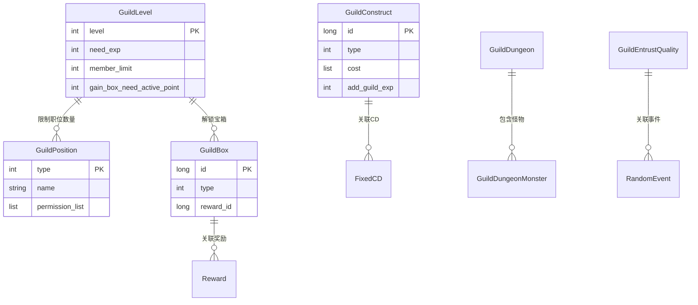
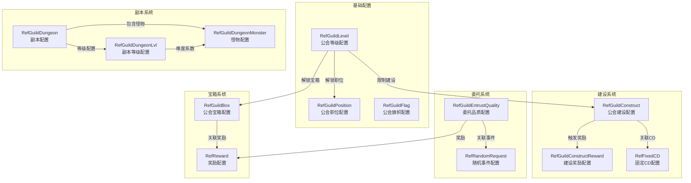
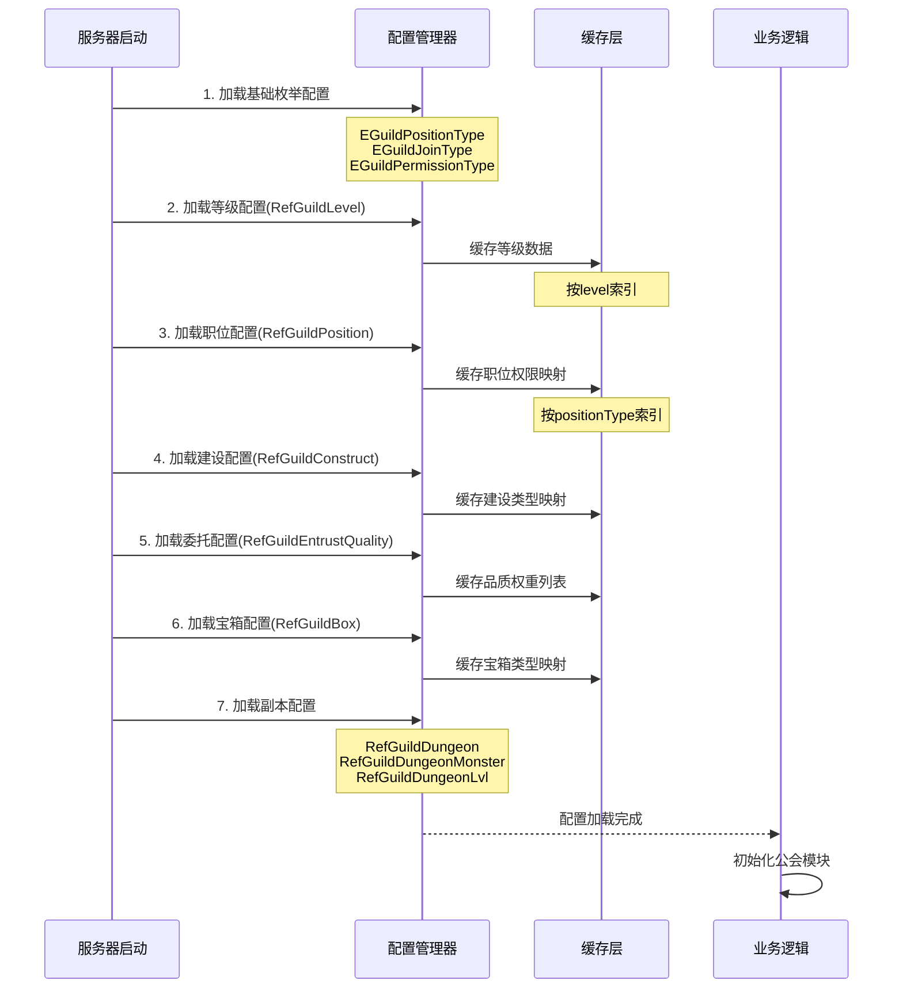

# 公会模块数据配表文档

## 配表说明

公会模块相关的配置数据主要存储在以下配表中，配表文件格式为 JSON。

---

## 一、公会等级配表

### RefGuildLevel - 公会等级配置
**文件**: `guild_level.json`
**表名**: `guild_level`
**管理类**: `NPGameRes.Refs.Guild.RefGuildLevel.RefGuildLevelMgr`

| 字段名 | 类型 | 说明 | 示例值 |
|--------|------|------|--------|
| level | int | 公会等级（唯一ID） | 1 |
| need_exp | int | 升级所需经验 | 1000 |
| member_limit | int | 联盟人员总数量上限 | 30 |
| position_limit_list | List<GuildPositionNumPair> | 职位数量限制列表 | [{"type":"DEPUTY_LEADER","num":2}] |
| mail_reward_list | List<NPCommonCostItem> | 升级邮件奖励列表 | [{"type":"CURRENCY","id":1,"count":100}] |
| gain_box_need_active_point | int | 获得宝箱需要的联盟活跃点 | 1000 |
| gain_guild_box_id | long | 联盟等级对应的联盟宝箱id | 10001 |
| construct_gain_guild_exp_limit | long | 建造联盟经验获得上限（金币建造） | 500 |
| construct_gain_guild_wealth_limit | long | 建造联盟财富获得上限（金币建造） | 1000 |

**关键方法**:
```java
// 获取指定职位的人数上限
public int getPositionLimit(EGuildPositionType _positionType)
```

**配置示例**:
```json
{
  "level": 1,
  "need_exp": 1000,
  "member_limit": 30,
  "position_limit_list": [
    {"type": "DEPUTY_LEADER", "num": 2},
    {"type": "ELITE", "num": 5}
  ],
  "mail_reward_list": [],
  "gain_box_need_active_point": 1000,
  "gain_guild_box_id": 10001,
  "construct_gain_guild_exp_limit": 500,
  "construct_gain_guild_wealth_limit": 1000
}
```

---

## 二、公会职位配表

### RefGuildPosition - 公会职位配置
**文件**: `guild_position.json`
**表名**: `guild_position`
**管理类**: `NPGameRes.Refs.Guild.RefGuildPosition.RefGuildPositionMgr`

| 字段名 | 类型 | 说明 | 示例值 |
|--------|------|------|--------|
| type | EGuildPositionType | 职位类型枚举 | LEADER |
| name | String | 职位名称 | "盟主" |
| pre_position | EGuildPositionType | 前置职位 | DEPUTY_LEADER |
| permission_list | List<EGuildPermissionType> | 权限列表 | ["KICK_MEMBER","APPOINT_POSITION"] |
| can_appoint_position_list | List<EGuildPositionType> | 可任命的职位列表 | ["DEPUTY_LEADER","ELITE","MEMBER"] |
| leader_passive_transfer_priority | int | 盟主被动转让优先级 | 1 |
| trans_need_historical_contributions | int | 转让需要的历史贡献度 | 1000 |

**职位枚举定义**:
| 枚举值 | Ordinal | 名称 | 说明 |
|--------|---------|------|------|
| NONE | 0 | 无 | 默认值 |
| MEMBER | 1 | 成员 | 普通成员 |
| ELITE | 2 | 精英 | 精英成员 |
| DEPUTY_LEADER | 3 | 副盟主 | 管理权限 |
| LEADER | 4 | 盟主 | 最高权限 |

**权限枚举定义**:
| 枚举值 | 说明 |
|--------|------|
| KICK_MEMBER | 踢出成员 |
| APPOINT_POSITION | 任命职位 |
| PROCESS_JOIN_REQUEST | 处理入会申请 |
| CHG_ANNOUNCEMENT | 修改公告 |
| CHG_JOIN_TYPE | 修改加入方式 |
| DISSOLVE_GUILD | 解散公会 |

**关键方法**:
```java
// 检查是否有某个权限
public boolean checkPermission(EGuildPermissionType _needPermission)

// 是否可以任命某个职位
public boolean checkCanAppoint(EGuildPositionType _positionType)
```

---

## 三、公会建设配表

### RefGuildConstruct - 公会建设配置
**文件**: `guild_construct.json`
**表名**: `guild_construct`
**管理类**: `NPGameRes.Refs.Guild.RefGuildConstruct.RefGuildConstructMgr`

| 字段名 | 类型 | 说明 | 示例值 |
|--------|------|------|--------|
| id | long | 唯一ID | 1 |
| type | EGuildConstructType | 建设类型 | GOLD |
| fix_cd_id | long | 固定CD消耗ID | 100 |
| free_condition | NPPlayerConditionGroupObj | 免建设花费条件 | null |
| cost | List<NPCommonCostItem> | 建设花费 | [{"type":"CURRENCY","id":1,"count":10000}] |
| add_guild_exp | int | 增加联盟经验 | 100 |
| add_guild_wealth | int | 增加联盟财富 | 200 |
| add_devote | int | 增加个人贡献 | 50 |
| add_personal_guild_coin | int | 个人联盟币 | 10 |
| add_reward_point | int | 增加奖励进度 | 10 |

**建设类型枚举**:
| 枚举值 | 说明 |
|--------|------|
| GOLD | 金币建设 |
| DIAMOND | 钻石建设 |
| FREE | 免费建设 |

**配置示例**:
```json
{
  "id": 1,
  "type": "GOLD",
  "fix_cd_id": 100,
  "free_condition": null,
  "cost": [{"type": "CURRENCY", "id": 1, "count": 10000}],
  "add_guild_exp": 100,
  "add_guild_wealth": 200,
  "add_devote": 50,
  "add_personal_guild_coin": 10,
  "add_reward_point": 10
}
```

---

## 四、公会宝箱配表

### RefGuildBox - 公会宝箱配置
**文件**: `guild_box.json`
**表名**: `guild_box`
**管理类**: `NPGameRes.Refs.Guild.RefGuildBox.RefGuildBoxMgr`

| 字段名 | 类型 | 说明 | 示例值 |
|--------|------|------|--------|
| id | long | 唯一ID | 10001 |
| type | EGuildBoxType | 宝箱类型 | ACTIVE_BOX |
| reward_id | long | 奖励配置ID | 20001 |
| gain_guild_active_point | int | 获得的联盟活跃点 | 100 |

**宝箱类型枚举**:
| 枚举值 | 说明 |
|--------|------|
| NONE | 无 |
| ACTIVE_BOX | 活跃宝箱 |
| RANK_BOX | 排名宝箱 |

---

## 五、公会旗帜配表

### RefGuildFlag - 公会旗帜配置
**文件**: `guild_flag.json`
**表名**: `guild_flag`
**管理类**: `NPGameRes.Refs.Guild.RefGuildFlag.RefGuildFlagMgr`

| 字段名 | 类型 | 说明 |
|--------|------|------|
| id | long | 旗帜ID |
| icon | String | 图标资源路径 |
| unlock_condition | NPPlayerConditionGroupObj | 解锁条件 |

---

## 六、公会委托品质配表

### RefGuildEntrustQuality - 公会委托品质配置
**文件**: `guild_entrust_quality.json`
**表名**: `guild_entrust_quality`

| 字段名 | 类型 | 说明 |
|--------|------|------|
| id | long | 品质ID |
| count | int | 完成所需次数 |
| gain_currency_per | int | 获得货币比例（万分比） |
| guild_random_requests_id_list | List<Long> | 随机事件ID列表 |
| reawrd_item_list | List<NPCommonCostItem> | 完成奖励列表 |

---

## 七、公会建设奖励配表

### RefGuildConstructReward - 公会建设奖励配置
**文件**: `guild_construct_reward.json`
**表名**: `guild_construct_reward`

| 字段名 | 类型 | 说明 |
|--------|------|------|
| num | int | 所需进度点数 |
| reward_list | List<NPCommonCostItem> | 奖励列表 |

---

## 八、公会协作区域配表

### RefGuildCooperateArea - 公会协作区域配置
**文件**: `guild_cooperate_area.json`
**表名**: `guild_cooperate_area`

| 字段名 | 类型 | 说明 |
|--------|------|------|
| id | long | 区域ID |
| name | String | 区域名称 |
| position | Position | 区域位置 |
| reward_point | int | 奖励积分 |

---

## 九、公会副本配表

### RefGuildDungeon - 公会副本配置
**文件**: `guild_dungeon.json`
**表名**: `guild_dungeon`

| 字段名 | 类型 | 说明 |
|--------|------|------|
| id | long | 副本ID |
| level | int | 副本等级 |
| name | String | 副本名称 |
| monster_list | List<Long> | 怪物ID列表 |
| reward_list | List<NPCommonCostItem> | 通关奖励 |

### RefGuildDungeonMonster - 公会副本怪物配置
**文件**: `guild_dungeon_monster.json`
**表名**: `guild_dungeon_monster`

| 字段名 | 类型 | 说明 |
|--------|------|------|
| id | long | 怪物ID |
| hp | long | 怪物血量 |
| attack | int | 攻击力 |
| defense | int | 防御力 |

### RefGuildDungeonLvl - 公会副本等级配置
**文件**: `guild_dungeon_lvl.json`
**表名**: `guild_dungeon_lvl`

| 字段名 | 类型 | 说明 |
|--------|------|------|
| level | int | 等级 |
| difficulty_mult | float | 难度系数 |
| reward_mult | float | 奖励系数 |

---

## 十、公会日志配表

### RefGuildLog - 公会日志配置
**文件**: `guild_log.json`
**表名**: `guild_log`

| 字段名 | 类型 | 说明 |
|--------|------|------|
| type | EGuildLogType | 日志类型 |
| template | String | 日志模板 |
| show_type_list | List<EGuildLogShowType> | 显示类型列表 |

---

## 十一、配表加载方式

### 客户端加载方式 (C#)
```csharp
// 获取公会等级配置
GuildLevelRefObj levelRef = GRefdataCoreMgr.instance.guildLevelRefCore.getRef(level);

// 获取公会职位配置
GuildPositionRefObj positionRef = GRefdataCoreMgr.instance.guildPositionRefCore.getRef((int)positionType);

// 获取公会建设配置
GuildConstructRefObj constructRef = GRefdataCoreMgr.instance.guildConstructRefCore.getRef(constructId);

// 遍历所有建设配置
GRefdataCoreMgr.instance.guildConstructRefCore.dealAllRef(_constructRef => {
    // 处理建设配置
});

// 获取公会宝箱配置
GuildBoxRefObj boxRef = GRefdataCoreMgr.instance.guildBoxRefCore.getRef(boxId);
```

### 服务端加载方式 (Java)
```java
// 获取公会等级配置
RefGuildLevel levelRef = RefGuildLevel.getMgr().get(level);

// 获取公会职位配置
RefGuildPosition positionRef = RefGuildPosition.getMgr().get(positionType.ordinal());

// 获取公会建设配置
RefGuildConstruct constructRef = RefGuildConstruct.getMgr().get(constructId);

// 获取公会宝箱配置
RefGuildBox boxRef = RefGuildBox.getMgr().get(boxId);
```

---

## 十二、配表关系图



---

## 十三、字段验证规则

### 13.1 公会名称验证规则

| 字段 | 规则类型 | 最小值 | 最大值 | 正则表达式 | 说明 |
|------|----------|--------|--------|------------|------|
| name | 长度 | 2 | 10 | - | 公会名称长度限制 |
| simpleName | 长度 | 2 | 4 | - | 公会简称长度限制 |
| declaration | 长度 | 0 | 100 | - | 宣言长度限制 |
| announcement | 长度 | 0 | 200 | - | 公告长度限制 |

**名称验证逻辑**：
```java
// 名称长度检查
if (!RefGeneral.Ref().guild_name_length_limit.inRange(RefUnicodeLengthCheck.getMgr().getCharLength(_name)))
    return GuildErr.STRING_LENGTH_OVER_LIMIT;

// 称号唯一性检查
if (_m_mgr.getNameChecker().nameExists(_name))
    return GuildErr.GUILD_NAME_EXIST;

// 简称唯一性检查
if (_m_mgr.getNameChecker().simpleNameExists(_simpleName))
    return GuildErr.GUILD_SIMPLE_NAME_EXIST;
```

### 13.2 数值范围验证

| 字段 | 数据类型 | 最小值 | 最大值 | 默认值 | 说明 |
|------|----------|--------|--------|--------|------|
| level | int | 1 | 30 | 1 | 公会等级范围 |
| member_limit | int | 10 | 100 | 30 | 成员上限范围 |
| need_exp | int | 0 | 1000000 | 0 | 升级经验需求 |
| wealth | long | 0 | Long.MAX_VALUE | 0 | 公会财富 |
| exp | long | 0 | Long.MAX_VALUE | 0 | 公会经验 |

---

## 十四、配置依赖关系图



---

## 十五、配置加载顺序



---

## 十六、配置热更新策略

| 配置类型 | 是否支持热更 | 热更时机 | 影响范围 |
|----------|--------------|----------|----------|
| RefGuildLevel | 是 | 维护时 | 所有公会升级逻辑 |
| RefGuildPosition | 是 | 维护时 | 权限检查逻辑 |
| RefGuildConstruct | 是 | 维护时 | 建设奖励计算 |
| RefGuildEntrustQuality | 是 | 维护时 | 委托刷新逻辑 |
| RefGuildBox | 是 | 维护时 | 宝箱奖励发放 |
| RefGuildFlag | 是 | 实时 | 旗帜展示 |

**热更新注意事项**：
1. 等级配置变更需检查现有公会等级上限
2. 职位配置变更需重新计算权限
3. 建设配置变更需通知在线玩家刷新

---

## 十七、完整枚举定义

### 17.1 EGuildPositionType - 公会职位类型

```java
public enum EGuildPositionType {
    NONE,           // 0 - 无效
    MEMBER,         // 1 - 成员
    ELITE,          // 2 - 精英
    DEPUTY_LEADER,  // 3 - 副盟主
    LEADER          // 4 - 盟主
}
```

### 17.2 EGuildJoinType - 加入类型

```java
public enum EGuildJoinType {
    NONE,           // 0 - 无效
    FREE_JOIN,      // 1 - 自由加入
    APPROVAL_JOIN,  // 2 - 审批加入
    DECLINE_JOIN    // 3 - 拒绝加入
}
```

### 17.3 EGuildJoinLimitType - 加入限制类型

| 枚举值 | Ordinal | 名称 | 说明 |
|--------|---------|------|------|
| NONE | 0 | 无 | 默认值 |
| NATION_POWER | 1 | 国力限制 | 玩家总赚速要求 |
| LEVEL | 2 | 等级限制 | 玩家等级要求 |

### 17.4 EGuildConstructType - 建设类型

| 枚举值 | Ordinal | 名称 | 说明 |
|--------|---------|------|------|
| NONE | 0 | 无 | 默认值 |
| GOLD | 1 | 金币建设 | 消耗银两 |
| DIAMOND | 2 | 钻石建设 | 消耗钻石 |
| FREE | 3 | 免费建设 | 无消耗 |

### 17.5 EGuildBoxType - 宝箱类型

| 枚举值 | Ordinal | 名称 | 说明 |
|--------|---------|------|------|
| NONE | 0 | 无 | 默认值 |
| ACTIVE_BOX | 1 | 活跃宝箱 | 公会活跃度奖励 |
| RANK_BOX | 2 | 排名宝箱 | 排名奖励 |

---

## 十八、配置数据结构详解

### 18.1 GuildPositionNumPair 职位数量配对

```java
public class GuildPositionNumPair {
    public EGuildPositionType type;  // 职位类型
    public int num;                  // 职位数量上限
}
```

### 18.2 NPCommonCostItem 通用消耗物品

```java
public class NPCommonCostItem {
    public ENPItemType type;   // 物品类型(CURRENCY/ITEM)
    public int id;            // 物品ID
    public long count;        // 物品数量
}
```

### 18.3 NPPlayerConditionGroupObj 玩家条件组

```json
{
  "conditionList": [
    {
      "type": "LEVEL",
      "value": 10,
      "compareType": "GE"
    }
  ],
  "logicType": "AND"
}
```

---

*文档生成时间: 2026-04-11*
