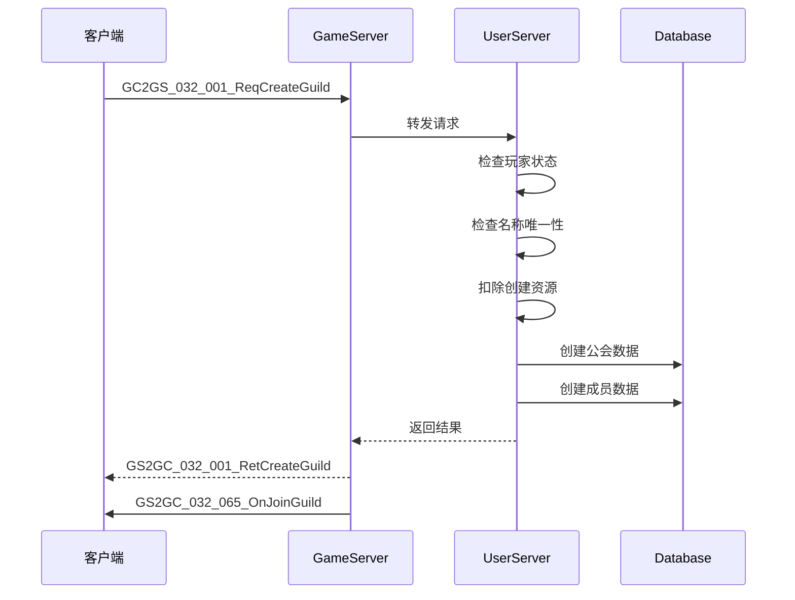
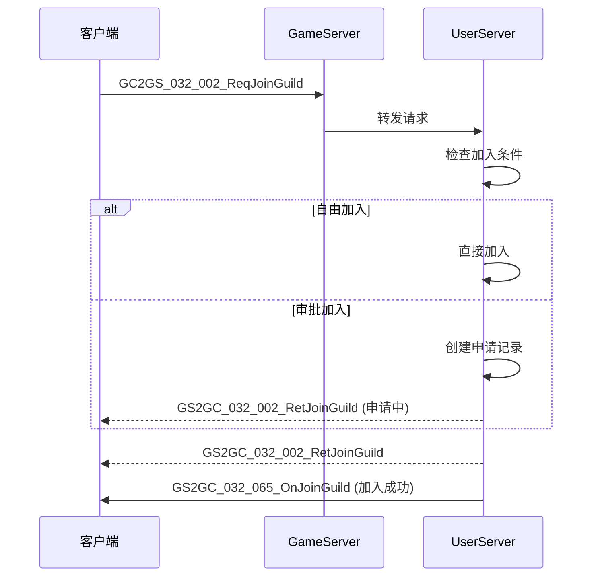
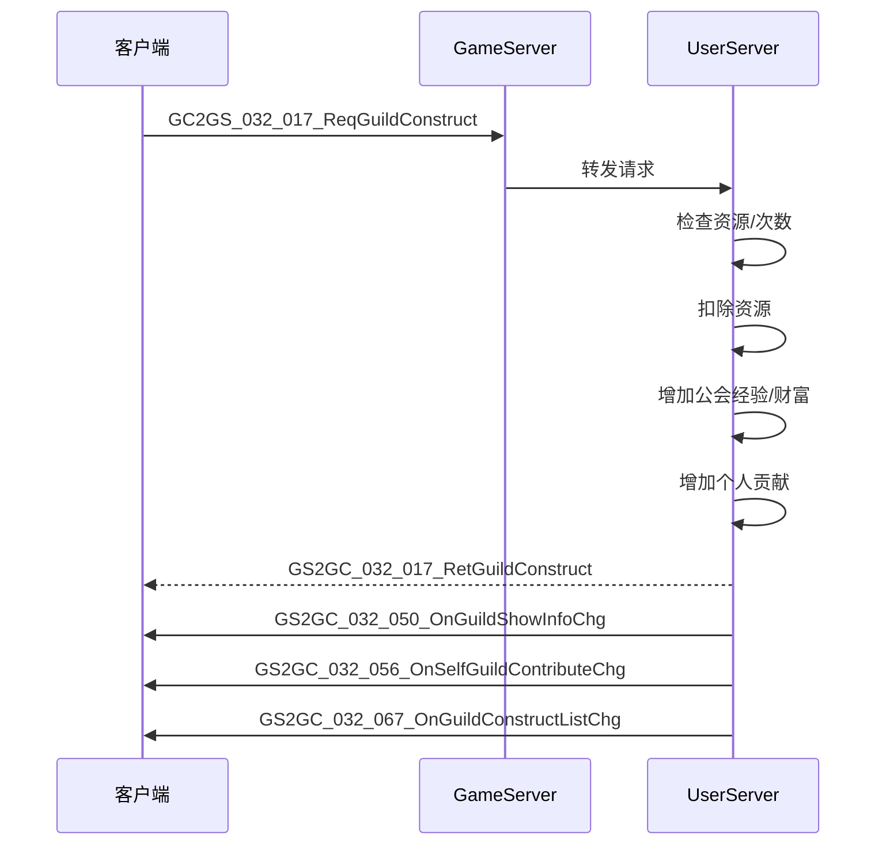
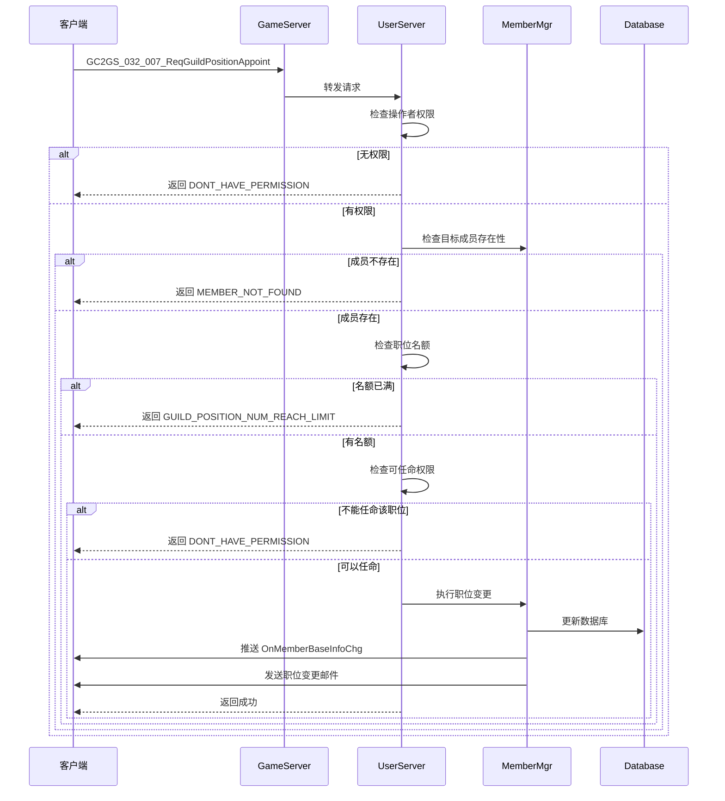
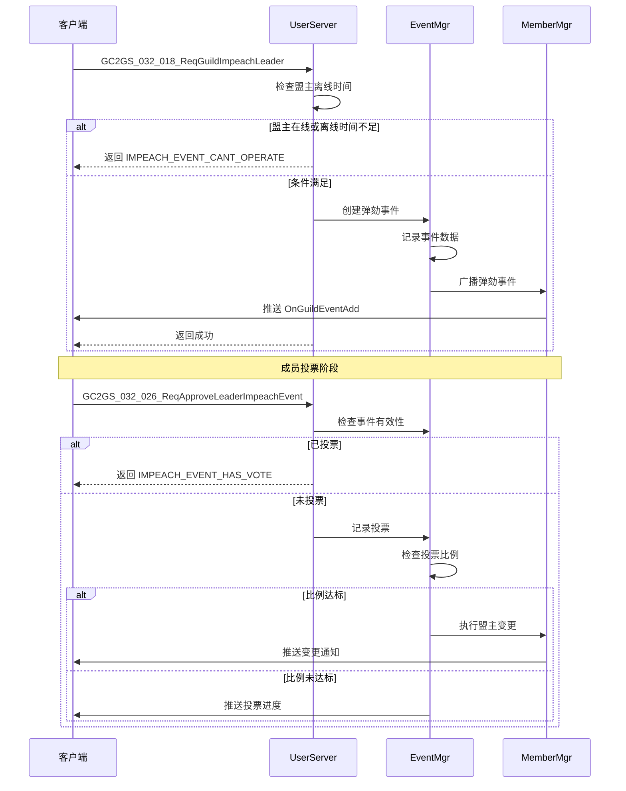
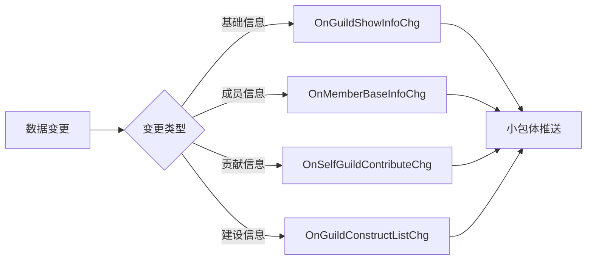

# 公会模块协议文档

## 协议模块编号: p032, p042

- **p032**: 公会操作协议 (GuildOp)
- **p042**: 公会相关操作协议 (GuildRelatedOp)

---

## 一、公会操作协议 (p032)

### 1.1 创建与加入

#### GC2GS_032_001_ReqCreateGuild - 创建公会
| 字段名 | 类型 | 说明 | 必填 |
|--------|------|------|------|
| flagId | long | 旗帜ID | 是 |
| name | string | 公会名称 | 是 |
| simpleName | string | 公会简称 | 是 |
| declaration | string | 宣言 | 否 |
| canFreeJoin | bool | 是否允许自由加入 | 是 |

#### GC2GS_032_002_ReqJoinGuild - 加入公会
| 字段名 | 类型 | 说明 | 必填 |
|--------|------|------|------|
| guildId | long | 公会ID | 是 |

#### GC2GS_032_003_ReqRandomJoinGuild - 随机加入公会
| 字段名 | 类型 | 说明 | 必填 |
|--------|------|------|------|
| - | - | 无参数 | - |

#### GC2GS_032_004_ReqOtherGuildInfo - 获取其他公会信息
| 字段名 | 类型 | 说明 | 必填 |
|--------|------|------|------|
| guildId | long | 公会ID | 是 |

#### GC2GS_032_021_ReqSearchGuild - 搜索公会
| 字段名 | 类型 | 说明 | 必填 |
|--------|------|------|------|
| searchData | string | 搜索数据（名称/简称） | 是 |

#### GC2GS_032_022_ReqGuildRankList - 获取公会排行列表
| 字段名 | 类型 | 说明 | 必填 |
|--------|------|------|------|
| - | - | 无参数 | - |

---

### 1.2 成员管理

#### GC2GS_032_005_ReqTransferGuild - 转让盟主
| 字段名 | 类型 | 说明 | 必填 |
|--------|------|------|------|
| memberId | long | 目标成员ID | 是 |

#### GC2GS_032_006_ReqDissolveGuild - 解散公会
| 字段名 | 类型 | 说明 | 必填 |
|--------|------|------|------|
| - | - | 无参数 | - |

#### GC2GS_032_007_ReqGuildPositionAppoint - 职位任命
| 字段名 | 类型 | 说明 | 必填 |
|--------|------|------|------|
| memberId | long | 成员ID | 是 |
| positionId | long | 职位ID | 是 |

#### GC2GS_032_014_ReqGuildKickOutMember - 踢出成员
| 字段名 | 类型 | 说明 | 必填 |
|--------|------|------|------|
| memberId | long | 成员ID | 是 |

#### GC2GS_032_016_ReqLeaveGuild - 退出公会
| 字段名 | 类型 | 说明 | 必填 |
|--------|------|------|------|
| - | - | 无参数 | - |

---

### 1.3 信息修改

#### GC2GS_032_008_ReqChgGuildFlag - 修改旗帜
| 字段名 | 类型 | 说明 | 必填 |
|--------|------|------|------|
| flagId | long | 旗帜ID | 是 |

#### GC2GS_032_009_ReqChgGuildName - 修改名称
| 字段名 | 类型 | 说明 | 必填 |
|--------|------|------|------|
| name | string | 公会名称 | 是 |
| simpleName | string | 公会简称 | 是 |

#### GC2GS_032_010_ReqChgGuildDeclaration - 修改宣言
| 字段名 | 类型 | 说明 | 必填 |
|--------|------|------|------|
| declaration | string | 宣言内容 | 是 |

#### GC2GS_032_011_ReqChgGuildAnnouncement - 修改公告
| 字段名 | 类型 | 说明 | 必填 |
|--------|------|------|------|
| announcement | string | 公告内容 | 是 |

#### GC2GS_032_012_ReqSetGuildJoinType - 设置加入方式
| 字段名 | 类型 | 说明 | 必填 |
|--------|------|------|------|
| type | EGuildJoinType | 加入类型 | 是 |
| joinLimitInfoList | List<Guild_JoinLimitInfo> | 加入限制列表 | 否 |

---

### 1.4 申请处理

#### GC2GS_032_013_ReqProcessGuildJoinRequest - 处理入会申请
| 字段名 | 类型 | 说明 | 必填 |
|--------|------|------|------|
| requestId | long | 申请ID | 是 |
| isAccept | bool | 是否同意 | 是 |

#### GC2GS_032_023_ReqGuildJoinRequestAKeyDeal - 一键处理入会申请
| 字段名 | 类型 | 说明 | 必填 |
|--------|------|------|------|
| isAgree | bool | 是否全部同意 | 是 |

#### GC2GS_032_024_ReqCancelSelfJoinRequest - 取消自己的入会申请
| 字段名 | 类型 | 说明 | 必填 |
|--------|------|------|------|
| guildId | long | 公会ID | 是 |

---

### 1.5 公会建设

#### GC2GS_032_017_ReqGuildConstruct - 公会建设（捐献）
| 字段名 | 类型 | 说明 | 必填 |
|--------|------|------|------|
| refId | long | 建设配置ID | 是 |

#### GC2GS_032_037_ReqDrawConstructReward - 领取建设奖励
| 字段名 | 类型 | 说明 | 必填 |
|--------|------|------|------|
| num | int | 奖励进度点数 | 是 |

---

### 1.6 公会弹劾

#### GC2GS_032_018_ReqGuildImpeachLeader - 弹劾盟主
| 字段名 | 类型 | 说明 | 必填 |
|--------|------|------|------|
| eventDbId | long | 事件数据库ID | 是 |

#### GC2GS_032_025_ReqCancelLeaderImpeachEvent - 取消弹劾事件
| 字段名 | 类型 | 说明 | 必填 |
|--------|------|------|------|
| eventDbId | long | 事件数据库ID | 是 |

#### GC2GS_032_026_ReqApproveLeaderImpeachEvent - 批准弹劾事件
| 字段名 | 类型 | 说明 | 必填 |
|--------|------|------|------|
| eventDbId | long | 事件数据库ID | 是 |

---

### 1.7 其他功能

#### GC2GS_032_015_ReqGuildBroadcastMessage - 群发消息
| 字段名 | 类型 | 说明 | 必填 |
|--------|------|------|------|
| cidList | List<long> | 成员ID列表 | 是 |
| message | string | 消息内容 | 是 |

#### GC2GS_032_019_ReqMemberContribute - 查询成员贡献
| 字段名 | 类型 | 说明 | 必填 |
|--------|------|------|------|
| cid | long | 成员ID | 是 |

#### GC2GS_032_027_ReqOpenRecruit - 公开招募
| 字段名 | 类型 | 说明 | 必填 |
|--------|------|------|------|
| - | - | 无参数 | - |

#### GC2GS_032_033_ReqGuildEntrust - 处理杂物委托
| 字段名 | 类型 | 说明 | 必填 |
|--------|------|------|------|
| - | - | 无参数 | - |

#### GC2GS_032_034_ReqGuildDispatchHero - 派遣大臣
| 字段名 | 类型 | 说明 | 必填 |
|--------|------|------|------|
| heroId | long | 伙伴ID | 是 |

#### GC2GS_032_035_ReqGuildAllMemberEntrustInfo - 所有成员委托信息
| 字段名 | 类型 | 说明 | 必填 |
|--------|------|------|------|
| - | - | 无参数 | - |

#### GC2GS_032_039_ReqGuildDispatchHeroList - 派遣大臣列表
| 字段名 | 类型 | 说明 | 必填 |
|--------|------|------|------|
| - | - | 无参数 | - |

#### GC2GS_032_040_ReqGuildLogList - 获取日志列表
| 字段名 | 类型 | 说明 | 必填 |
|--------|------|------|------|
| lastDbId | long | 上次查询的最后ID | 否 |
| num | int | 查询数量 | 是 |

#### GC2GS_032_041_ReqGuildCooperateAttackLogList - 协作攻击日志
| 字段名 | 类型 | 说明 | 必填 |
|--------|------|------|------|
| - | - | 无参数 | - |

#### GC2GS_032_047_ReqGuildIconShow - 获取公会图标信息
| 字段名 | 类型 | 说明 | 必填 |
|--------|------|------|------|
| guildId | long | 公会ID | 是 |

#### GC2GS_032_048_ReqGuildMarsBattleReportList - 火星矿战报列表
| 字段名 | 类型 | 说明 | 必填 |
|--------|------|------|------|
| - | - | 无参数 | - |

---

## 二、公会相关协议 (p042)

### 2.1 火星求助

#### GC2GS_042_001_ReqSendMarsHelp - 发送火星求助
| 字段名 | 类型 | 说明 | 必填 |
|--------|------|------|------|
| helpType | int | 求助类型 | 是 |
| targetId | long | 目标ID | 是 |

#### GC2GS_042_002_ReqDealMarsHelp - 处理火星求助
| 字段名 | 类型 | 说明 | 必填 |
|--------|------|------|------|
| helpId | long | 求助ID | 是 |
| agree | bool | 是否同意 | 是 |

#### GC2GS_042_003_ReqMarsHelpList - 火星求助列表
| 字段名 | 类型 | 说明 | 必填 |
|--------|------|------|------|
| - | - | 无参数 | - |

#### GC2GS_042_004_ReqMarsHelpDealedList - 已处理的求助列表
| 字段名 | 类型 | 说明 | 必填 |
|--------|------|------|------|
| - | - | 无参数 | - |

#### GC2GS_042_009_ReqMarsHelpAutoDailyRecord - 自动求助每日记录
| 字段名 | 类型 | 说明 | 必填 |
|--------|------|------|------|
| - | - | 无参数 | - |

---

### 2.2 公会宝箱

#### GC2GS_042_005_ReqGetGuildBoxList - 获取公会宝箱列表
| 字段名 | 类型 | 说明 | 必填 |
|--------|------|------|------|
| - | - | 无参数 | - |

#### GC2GS_042_006_ReqGainGuildRewardBoxList - 领取公会奖励宝箱列表
| 字段名 | 类型 | 说明 | 必填 |
|--------|------|------|------|
| boxType | EGuildBoxType | 宝箱类型 | 是 |

#### GC2GS_042_007_ReqGainGuildRewardBox - 领取公会奖励宝箱
| 字段名 | 类型 | 说明 | 必填 |
|--------|------|------|------|
| boxType | EGuildBoxType | 宝箱类型 | 是 |
| boxId | long | 宝箱ID | 是 |

#### GC2GS_042_008_ReqSetGuildBoxShareAnonymous - 设置宝箱分享匿名
| 字段名 | 类型 | 说明 | 必填 |
|--------|------|------|------|
| isAnonymous | bool | 是否匿名 | 是 |

---

### 2.3 集结功能

#### GC2GS_042_060_ReqCreateRally - 创建集结
| 字段名 | 类型 | 说明 | 必填 |
|--------|------|------|------|
| targetId | long | 目标ID | 是 |
| rallyTime | int | 集结时间（秒） | 是 |

#### GC2GS_042_061_ReqJoinRally - 加入集结
| 字段名 | 类型 | 说明 | 必填 |
|--------|------|------|------|
| rallyId | long | 集结ID | 是 |

#### GC2GS_042_062_ReqQueryRallyInfo - 查询集结信息
| 字段名 | 类型 | 说明 | 必填 |
|--------|------|------|------|
| rallyId | long | 集结ID | 是 |

---

## 三、服务端推送协议 (GS2GC)

### 3.1 公会信息推送

#### GS2GC_032_050_OnGuildShowInfoChg - 公会展示信息变更
| 字段名 | 类型 | 说明 |
|--------|------|------|
| showInfo | Guild_ShowInfo | 公会展示信息 |

#### GS2GC_032_051_OnMemberBaseInfoChg - 成员基础信息变更
| 字段名 | 类型 | 说明 |
|--------|------|------|
| baseInfo | Guild_MemberBaseInfo | 成员基础信息 |

#### GS2GC_032_052_OnGuildAnnouncementChg - 公告变更
| 字段名 | 类型 | 说明 |
|--------|------|------|
| announcement | string | 公告内容 |

#### GS2GC_032_053_OnGuildWealthChg - 财富变更
| 字段名 | 类型 | 说明 |
|--------|------|------|
| guildWealth | long | 联盟财富 |

#### GS2GC_032_062_OnGuildTotalEarningsChg - 总收益变更
| 字段名 | 类型 | 说明 |
|--------|------|------|
| totalEarnings | long | 成员总赚速 |

---

### 3.2 成员管理推送

#### GS2GC_032_054_OnGuildMemberAdd - 成员新增
| 字段名 | 类型 | 说明 |
|--------|------|------|
| baseInfo | Guild_MemberBaseInfo | 成员基础信息 |

#### GS2GC_032_055_OnGuildMemberRemove - 成员移除
| 字段名 | 类型 | 说明 |
|--------|------|------|
| memberId | long | 成员ID |

#### GS2GC_032_065_OnJoinGuild - 加入公会推送
| 字段名 | 类型 | 说明 |
|--------|------|------|
| isCreate | bool | 是否创建 |
| guildInfo | Guild_DetailInfo | 公会详细信息 |

#### GS2GC_032_066_OnLeaveGuild - 退出公会推送
| 字段名 | 类型 | 说明 |
|--------|------|------|
| isKick | bool | 是否被踢出 |

---

### 3.3 贡献相关推送

#### GS2GC_032_056_OnSelfGuildContributeChg - 自己贡献变更
| 字段名 | 类型 | 说明 |
|--------|------|------|
| contributeInfo | Guild_MemberContributeInfo | 贡献信息 |

#### GS2GC_032_058_OnJoinGuildCdChg - 加入CD变更
| 字段名 | 类型 | 说明 |
|--------|------|------|
| joinCdInfo | Guild_JoinCdInfo | 加入CD信息 |

---

### 3.4 事件相关推送

#### GS2GC_032_059_OnGuildEventAdd - 事件新增
| 字段名 | 类型 | 说明 |
|--------|------|------|
| eventInfo | Guild_EventInfo | 事件信息 |

#### GS2GC_032_060_OnGuildEventChg - 事件变更
| 字段名 | 类型 | 说明 |
|--------|------|------|
| eventInfo | Guild_EventInfo | 事件信息 |

#### GS2GC_032_061_OnGuildEventRemove - 事件移除
| 字段名 | 类型 | 说明 |
|--------|------|------|
| eventDbId | long | 事件数据库ID |

---

### 3.5 申请相关推送

#### GS2GC_032_057_OnSelfRequestJoinGuildListChg - 自己的申请列表变更
| 字段名 | 类型 | 说明 |
|--------|------|------|
| selfRequestJoinGuildList | List<long> | 申请的公会ID列表 |

#### GS2GC_032_063_OnGuildJoinRequestAdd - 入盟请求新增
| 字段名 | 类型 | 说明 |
|--------|------|------|
| joinRequestList | Guild_JoinRequestInfo | 入盟请求信息 |

#### GS2GC_032_064_OnGuildJoinRequestRemove - 入盟请求移除
| 字段名 | 类型 | 说明 |
|--------|------|------|
| requestDbIdList | List<long> | 请求ID列表 |

---

### 3.6 建设相关推送

#### GS2GC_032_067_OnGuildConstructListChg - 建造次数变更
| 字段名 | 类型 | 说明 |
|--------|------|------|
| constructList | Guild_ConstructList | 建造信息列表 |

#### GS2GC_032_068_OnOpenRecruitCdChg - 招募CD变更
| 字段名 | 类型 | 说明 |
|--------|------|------|
| nextCanRecruitTimeMs | long | 下次可招募时间 |

#### GS2GC_032_071_OnGuildEntrustChg - 委托变更
| 字段名 | 类型 | 说明 |
|--------|------|------|
| data | Guild_EntrustInfo | 委托信息 |

#### GS2GC_032_072_OnGuildDispatchChg - 派遣变更
| 字段名 | 类型 | 说明 |
|--------|------|------|
| data | Guild_AttrDispatchInfo | 属性派遣信息 |

#### GS2GC_032_073_OnSelfDailyDataChg - 每日数据变更
| 字段名 | 类型 | 说明 |
|--------|------|------|
| data | Guild_MemberDailyData | 每日数据 |

---

## 四、协议数据结构

### 4.1 公会展示信息 (Guild_ShowInfo)
| 字段名 | 类型 | 说明 |
|--------|------|------|
| guidId | long | 公会ID |
| flagId | long | 旗帜ID |
| name | string | 公会名称 |
| simpleName | string | 公会简称 |
| declaration | string | 宣言 |
| leaderId | long | 盟主ID |
| level | int | 等级 |
| exp | long | 经验 |
| totalEarnings | long | 成员总赚速 |
| joinType | EGuildJoinType | 加入类型 |
| joinLimitInfo | List<Guild_JoinLimitInfo> | 加入限制列表 |

### 4.2 公会详细信息 (Guild_DetailInfo)
| 字段名 | 类型 | 说明 |
|--------|------|------|
| guildInfo | Guild_ShowInfo | 公会展示信息 |
| guildWealth | long | 联盟财富 |
| announcement | string | 公告 |
| memberList | List<Guild_MemberBaseInfo> | 成员列表 |
| joinRequestList | List<Guild_JoinRequestInfo> | 入盟请求列表 |
| constructList | Guild_ConstructList | 建造信息列表 |
| eventList | List<Guild_EventInfo> | 事件列表 |
| nextCanRecruitTimeMs | long | 下次可招募时间 |
| entrustInfo | Guild_EntrustInfo | 委托信息 |
| dispatchData | Guild_DispatchData | 派遣信息 |
| selfContributeInfo | Guild_MemberContributeInfo | 贡献信息 |
| latestMarsMineBattleReportId | long | 最新火星矿战报ID |

### 4.3 成员基础信息 (Guild_MemberBaseInfo)
| 字段名 | 类型 | 说明 |
|--------|------|------|
| cid | long | 成员角色ID |
| positionId | int | 职位ID |

### 4.4 成员贡献信息 (Guild_MemberContributeInfo)
| 字段名 | 类型 | 说明 |
|--------|------|------|
| cid | long | 成员ID |
| totalContribute | long | 总贡献 |
| sevenDaysContribute | int | 7日贡献 |

### 4.5 加入限制信息 (Guild_JoinLimitInfo)
| 字段名 | 类型 | 说明 |
|--------|------|------|
| type | EGuildJoinLimitType | 限制类型 |
| value | long | 限制值 |

### 4.6 加入CD信息 (Guild_JoinCdInfo)
| 字段名 | 类型 | 说明 |
|--------|------|------|
| guildFreeJoinCdNum | int | 免CD加入次数 |
| joinGuildCdEndTimeMs | long | 加入CD结束时间 |

---

## 五、协议流程图

### 5.1 创建公会流程


### 5.2 加入公会流程


### 5.3 公会建设流程


---

## 六、错误码定义

| 错误码 | 错误名 | 说明 |
|--------|--------|------|
| 32001 | GUILD_NOT_EXIST | 公会不存在 |
| 32002 | PLAYER_ALREADY_IN_GUILD | 玩家已加入公会 |
| 32003 | GUILD_NAME_EXISTS | 公会名称已存在 |
| 32004 | GUILD_CREATE_CONDITION_NOT_MET | 创建条件不满足 |
| 32005 | GUILD_MEMBER_NUM_REACH_LIMIT | 公会成员已满 |
| 32006 | NOT_FIT_GUILD_JOIN_LIMIT | 入会条件不满足 |
| 32007 | GUILD_NOT_ALLOW_TO_JOIN | 公会未开放招募 |
| 32008 | DONT_HAVE_PERMISSION | 无权限操作 |
| 32009 | GUILD_WEALTH_NOT_ENOUGH | 公会财富不足 |
| 32010 | GUILD_CONTRIBUTION_NOT_ENOUGH | 个人贡献不足 |
| 32011 | GUILD_SKILL_NOT_UNLOCK | 公会技能未解锁 |
| 32012 | GUILD_POSITION_NUM_REACH_LIMIT | 职位人数已达上限 |
| 32013 | GUILD_HAD_DRAW_CONSTRUCT_REWARD | 已领取建设奖励 |
| 32014 | GUILD_CONSTRUCT_REWARD_POINT_NOT_ENOUGH | 建设奖励点数不足 |
| 32015 | MEMBER_NOT_FOUND | 成员不存在 |
| 32016 | LEADER_NOT_FOUND | 盟主不存在 |
| 32017 | MEMBER_NOT_DEPUTY_LEADER | 成员不是副盟主 |
| 32018 | GUILD_LEADER_PROACTIVE_TRANSFER_CD | 盟主转让CD中 |
| 32019 | GUILD_HAD_DISSOLVE | 公会已解散 |
| 32020 | STILL_HAVE_OTHER_MEMBER | 还有其他成员 |
| 32021 | GUILD_RECRUIT_CD | 招募CD中 |
| 32022 | JOIN_REQUEST_REACH_LIMIT | 申请数量达上限 |
| 32023 | NO_GUILD_TO_JOIN | 没有可加入的公会 |

---

## 七、协议返回值详解

### 7.1 创建公会返回

#### GS2GC_032_001_RetCreateGuild
| 字段名 | 类型 | 说明 |
|--------|------|------|
| errCode | int | 错误码，0表示成功 |
| guildInfo | Guild_ShowInfo | 公会展示信息（成功时返回） |

### 7.2 加入公会返回

#### GS2GC_032_002_RetJoinGuild
| 字段名 | 类型 | 说明 |
|--------|------|------|
| errCode | int | 错误码 |
| status | int | 状态：0=失败, 1=直接加入成功, 2=申请中 |

### 7.3 公会建设返回

#### GS2GC_032_017_RetGuildConstruct
| 字段名 | 类型 | 说明 |
|--------|------|------|
| errCode | int | 错误码 |
| constructInfo | Guild_ConstructInfo | 建设信息（成功时返回） |

### 7.4 派遣大臣返回

#### GS2GC_032_034_RetGuildDispatchHero
| 字段名 | 类型 | 说明 |
|--------|------|------|
| errCode | int | 错误码 |
| attrType | ESpecAttrType | 属性类型 |
| addPer | int | 增加的百分比 |
| dispatchInfo | Guild_DispatchHeroDetailInfo | 派遣详情 |

### 7.5 处理委托返回

#### GS2GC_032_033_RetGuildEntrust
| 字段名 | 类型 | 说明 |
|--------|------|------|
| errCode | int | 错误码 |
| itemList | List<NPCommon_ItemInfo> | 获得的物品列表 |
| critMul | int | 暴击倍数（1=无暴击） |

---

## 八、协议处理时序图

### 8.1 公会职位任命流程



### 8.2 公会弹劾流程



---

## 九、错误码完整列表

### 9.1 公会基础错误码 (370xxx)

| 错误码 | 常量名 | 错误信息 | 处理建议 |
|--------|--------|----------|----------|
| 370001 | GUILD_NAME_EXIST | 联盟名称已存在 | 提示用户更换名称 |
| 370002 | GUILD_NOT_EXIST | 联盟不存在 | 刷新公会列表 |
| 370003 | NOT_MEMBER_OF_GUILD | 不是联盟成员 | 检查公会状态 |
| 370004 | DONT_HAVE_PERMISSION | 没有权限 | 检查用户职位权限 |
| 370005 | GUILD_SIMPLE_NAME_EXIST | 联盟简称已存在 | 提示用户更换简称 |
| 370006 | JOIN_REQUEST_NOT_FOUND | 加入请求不存在 | 刷新申请列表 |
| 370007 | JOIN_REQUEST_REACH_LIMIT | 加入请求已达上限 | 等待申请处理或取消 |
| 370008 | PLAYER_ALREADY_IN_GUILD | 玩家已加入其它联盟 | 先退出当前公会 |
| 370009 | GUILD_MEMBER_NUM_REACH_LIMIT | 联盟成员已达上限 | 选择其他公会 |
| 370010 | NOT_FIT_GUILD_JOIN_LIMIT | 不符合联盟加入条件 | 提升条件后重试 |
| 370011 | GUILD_NOT_ALLOW_TO_JOIN | 联盟不允许加入 | 选择其他公会 |
| 370012 | NO_GUILD_TO_JOIN | 没有可加入的联盟 | 稍后重试 |
| 370013 | GUILD_HAD_DISSOLVE | 联盟已解散 | 刷新公会列表 |
| 370014 | MEMBER_NOT_FOUND | 成员不存在 | 刷新成员列表 |
| 370015 | MEMBER_NOT_DEPUTY_LEADER | 不是副盟主 | 选择副盟主职位 |
| 370016 | STILL_HAVE_OTHER_MEMBER | 还有其他成员 | 先移除所有成员 |
| 370017 | GUILD_POSITION_NOT_EXIST | 联盟职位不存在 | 检查配置 |
| 370018 | GUILD_CONTRIBUTION_NOT_ENOUGH | 联盟贡献度不足 | 增加贡献度 |
| 370019 | CANT_HANDLE_NON_GUILD_REQUEST | 不能处理非本盟的请求 | 检查请求来源 |
| 370020 | LEADER_NOT_FOUND | 找不到盟主 | 检查公会状态 |
| 370021 | GUILD_POSITION_NUM_REACH_LIMIT | 联盟职位已达上限 | 升级公会或调整职位 |
| 370022 | STRING_LENGTH_OVER_LIMIT | 字符长度超过限制 | 缩短输入内容 |
| 370023 | JOIN_GUILD_CD | 加入联盟冷却中 | 显示剩余冷却时间 |
| 370024 | NO_JOIN_REQUESTS_TO_PROCESS | 没有可以处理的加入请求 | 刷新申请列表 |
| 370025 | IMPEACH_EVENT_CANT_OPERATE | 弹劾事件不能操作 | 检查弹劾条件 |
| 370026 | IMPEACH_EVENT_HAS_VOTE | 弹劾事件已经投票 | 无需重复投票 |
| 370027 | EVENT_NOT_FOUND | 事件不存在 | 刷新事件列表 |
| 370028 | GUILD_LEADER_PROACTIVE_TRANSFER_CD | 盟主主动转让冷却中 | 显示剩余冷却时间 |
| 370029 | JOIN_REQUEST_ALREADY_EXIST | 重复申请加入 | 等待处理 |
| 370030 | GUILD_FULL | 联盟满员 | 选择其他公会 |
| 370031 | GUILD_RECRUIT_CD | 联盟公开招募冷却中 | 显示剩余冷却时间 |

### 9.2 公会建设相关错误码

| 错误码 | 常量名 | 错误信息 | 处理建议 |
|--------|--------|----------|----------|
| 370032 | GUILD_HAD_DRAW_CONSTRUCT_REWARD | 联盟已领取建设阶段奖励 | 无需重复领取 |
| 370042 | GUILD_CONSTRUCT_REWARD_POINT_NOT_ENOUGH | 联盟建设阶段积分不足 | 继续建设 |
| 370043 | GUILD_HERO_DISPATCH_ATTR_LIMIT | 联盟大臣派遣属性上限 | 选择其他属性 |

### 9.3 公会宝箱相关错误码

| 错误码 | 常量名 | 错误信息 | 处理建议 |
|--------|--------|----------|----------|
| 370033 | GUILD_HAD_DRAW_ACTIVE_BOX_LIMIT | 超过领取联盟活跃宝箱上限 | 等待下次刷新 |
| 370034 | GUILD_HAD_DRAW_ACTIVE_BOX | 已领取联盟活跃宝箱 | 无需重复领取 |
| 370036 | GUILD_ACTIVE_BOX_NOT_EXIST | 联盟活跃宝箱不存在 | 刷新宝箱列表 |
| 370038 | NO_GUILD_ACTIVE_BOX_CAN_DRAW | 没有可以领取的联盟活跃宝箱 | 等待宝箱生成 |
| 370039 | GUILD_ACTIVE_BOX_EXPIRED | 联盟活跃宝箱已过期 | 无法领取 |
| 370040 | GUILD_HAD_DRAW_GREAT_REWARD | 已领取联盟大礼 | 无需重复领取 |
| 370041 | GUILD_GREAT_REWARD_EXPIRED | 联盟大礼已过期 | 无法领取 |
| 370090 | GUILD_BOX_TYPE_ERR | 公会宝箱类型错误 | 检查宝箱类型 |
| 370091 | GUILD_BOX_NOT_FOUND | 公会宝箱不存在 | 刷新宝箱列表 |
| 370092 | GUILD_BOX_NOT_REWARD | 公会宝箱不存在可领取的宝箱 | 等待宝箱生成 |

### 9.4 公会副本相关错误码

| 错误码 | 常量名 | 错误信息 | 处理建议 |
|--------|--------|----------|----------|
| 370050 | GUILD_DUNGEON_ERR | 公会副本数据错误 | 联系客服 |
| 370051 | GUILD_DUNGEON_NOT_FOUND | 无法找到公会副本 | 刷新副本数据 |
| 370052 | GUILD_DUNGEON_NOT_UNLOCK | 公会副本没有解锁 | 提升公会等级 |
| 370053 | GUILD_DUNGEON_AUTO_TIME_ERROR | 公会副本自动启动时间不符合要求 | 调整启动时间 |
| 370054 | GUILD_DUNGEON_NOT_START | 公会副本没有开启 | 先开启副本 |
| 370055 | GUILD_DUNGEON_STARTED | 公会副本已开启 | 无需重复开启 |
| 370056 | GUILD_DUNGEON_START_FAIL | 公会副本开启失败 | 检查条件后重试 |
| 370057 | GUILD_DUNGEON_SET_LVL_FAIL | 公会副本设置等级失败 | 检查等级配置 |
| 370058 | GUILD_DUNGEON_LVL_UPDATED | 公会副本等级已变化 | 刷新副本数据 |
| 370059 | GUILD_DUNGEON_ATTACK_FAIL | 公会副本攻击失败 | 检查战斗条件 |
| 370060 | GUILD_DUNGEON_MONSTER_NOT_FOUND | 公会副本怪物不存在 | 刷新怪物列表 |
| 370061 | GUILD_DUNGEON_FIGHT_HERO_FAIL | 公会副本出战大臣失败 | 检查大臣状态 |
| 370062 | GUILD_DUNGEON_MONSTER_KILLED | 公会副本怪物已击杀 | 无需重复攻击 |
| 370063 | GUILD_DUNGEON_MONSTER_PRE_MONSTER_NOT_FOUND | 公会副本怪物前置怪物不存在 | 先击杀前置怪物 |
| 370064 | GUILD_DUNGEON_MONSTER_PRE_MONSTER_NOT_KILLED | 公会副本怪物前置怪物未击杀 | 先击杀前置怪物 |
| 370065 | GUILD_DUNGEON_NOT_RECOVER_HERO | 公会副本出战大臣无需恢复 | 无需操作 |
| 370066 | GUILD_DUNGEON_RECOVER_LIMIT | 公会副本恢复次数超过上限 | 等待次数刷新 |

### 9.5 火星求助相关错误码

| 错误码 | 常量名 | 错误信息 | 处理建议 |
|--------|--------|----------|----------|
| 370075 | GUILD_MARS_HELP_BUILDING_NOT_FOUND | 公会火星求助建筑不存在 | 检查建筑状态 |
| 370076 | GUILD_MARS_HELP_NOT_FOUND | 公会火星求助目标不存在 | 刷新求助列表 |
| 370077 | GUILD_MARS_HELP_SELF | 公会火星求助自身数据 | 不能求助自己 |
| 370078 | GUILD_MARS_HELP_OBJ_EXISTED | 公会火星求助目标已发起 | 无需重复发起 |
| 370079 | GUILD_MARS_HELP_OBJ_FAIL | 公会火星求助目标不能求助 | 检查求助条件 |
| 370080 | GUILD_MARS_HELP_SEND_FAIL | 公会火星求助目标发起失败 | 稍后重试 |

---

## 十、协议数据校验规则

### 10.1 输入参数校验

| 协议 | 参数 | 校验规则 | 失败处理 |
|------|------|----------|----------|
| ReqCreateGuild | name | 2-10字符,唯一 | STRING_LENGTH_OVER_LIMIT |
| ReqCreateGuild | simpleName | 2-4字符,唯一 | STRING_LENGTH_OVER_LIMIT |
| ReqChgGuildDeclaration | declaration | 0-100字符 | STRING_LENGTH_OVER_LIMIT |
| ReqChgGuildAnnouncement | announcement | 0-200字符 | STRING_LENGTH_OVER_LIMIT |
| ReqGuildPositionAppoint | memberId | 必须是公会成员 | MEMBER_NOT_FOUND |
| ReqGuildPositionAppoint | positionId | 必须是有效职位 | GUILD_POSITION_NOT_EXIST |
| ReqTransferGuild | memberId | 必须是副盟主 | MEMBER_NOT_DEPUTY_LEADER |

### 10.2 业务逻辑校验

```java
// 职位任命校验示例
public Result appointPosition(long _memberId, EGuildPositionType _positionType) {
    // 1. 检查操作者权限
    if (!checkPermission(EGuildPermissionType.POSITION_APPOINT))
        return GuildErr.DONT_HAVE_PERMISSION;

    // 2. 检查目标成员存在
    GuildMemberInfo memberInfo = lookup(_memberId);
    if (memberInfo == null)
        return GuildErr.MEMBER_NOT_FOUND;

    // 3. 检查是否可以任命该职位
    if (!checkCanAppoint(_positionType))
        return GuildErr.DONT_HAVE_PERMISSION;

    // 4. 检查职位名额
    if (getPositionCount(_positionType) >= getPositionLimit(_positionType))
        return GuildErr.GUILD_POSITION_NUM_REACH_LIMIT;

    // 5. 执行任命
    return _chgPosition(memberInfo, _positionType);
}
```

---

## 十一、协议性能优化建议

### 11.1 批量操作协议

| 协议 | 说明 | 使用场景 |
|------|------|----------|
| ReqGuildJoinRequestAKeyDeal | 一键处理申请 | 批量审批 |
| ReqGainGuildRewardBoxList | 批量领取宝箱 | 批量领取 |

### 11.2 增量推送优化



---

*文档生成时间: 2026-04-11*
