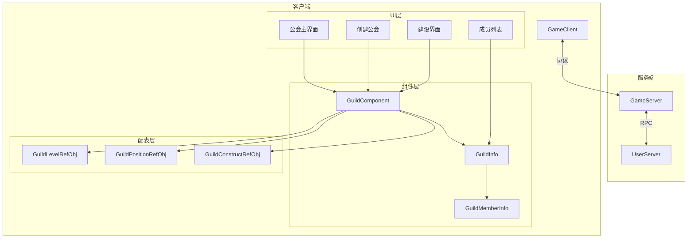
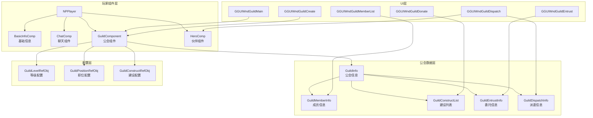
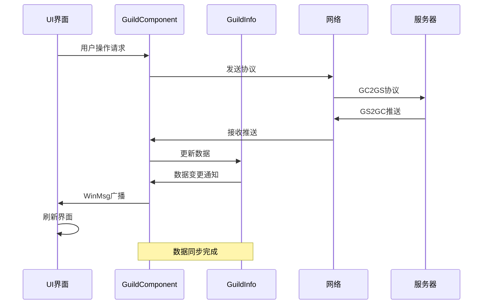
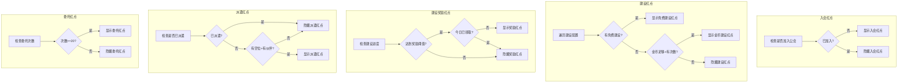

# 公会模块客户端开发文档

## 一、组件数据层

### 1.1 核心组件类

#### GuildComponent
**路径**: `game_client/Assets/Scripts/LogicScripts/GameComponent/Guild/GuildComponent.cs`

**功能**: 联盟管理器，管理玩家公会相关数据

**继承关系**:
```
GuildComponent : _ANPBasicPlayerComponent
```

**协议模块**: p032_GuildOp, p042_GuildRelatedOp

**依赖组件**:
- `ENPPlayerCompType.BASIC_INFO`
- `ENPPlayerCompType.CHAT`

**主要属性**:

| 属性名 | 类型 | 说明 |
|--------|------|------|
| guildInfo | GuildInfo | 联盟信息 |
| joinGuildCdEndTimeMs | long | 加入联盟CD结束时间 |
| selfSevenDaysContribution | long | 自己的7日贡献度 |
| selfTotalContribution | long | 自己的总贡献度 |
| reqJoinGuildNum | int | 正在请求加入联盟数量 |
| selfDailyData | GuildMemberDailyData | 自身每日更新数据 |
| recordLastSelectDispatchHeroId | long | 记录上次选择派遣的伙伴id |
| latestMarsMineBattleReportId | long | 最新火星矿战报ID |
| unionBonusMgr | CommonUnionBonusMgr | 联盟加成管理器 |

**主要方法**:

| 方法名 | 参数 | 返回值 | 说明 |
|--------|------|--------|------|
| isJoinGuild | - | bool | 是否加入联盟 |
| isSameGuild | guildId | bool | 判断是否是同一个联盟 |
| isApplyJoinGuild | guildId | bool | 是否正在请求加入该联盟 |
| checkHavePermission | type, needTip | bool | 检查是否拥有权限 |
| getTargetPositionMemberCount | type | long | 根据职位获取成员数量 |
| getIsConstructById | constructRefId | bool | 是否已捐献建设 |
| getHaveGuildEvent | type | bool | 是否有对应事件 |
| getEventInfo | type | Guild_EventInfo | 获取事件信息 |

---

### 1.2 公会信息类

#### GuildInfo
**路径**: `game_client/Assets/Scripts/LogicScripts/GameComponent/Guild/GuildInfo.cs`

**主要属性**:

| 属性名 | 类型 | 说明 |
|--------|------|------|
| guildId | long | 公会ID |
| guildName | string | 公会名称 |
| simpleName | string | 公会简称 |
| level | int | 公会等级 |
| exp | long | 公会经验 |
| guildWealth | long | 公会财富 |
| totalEarnings | long | 成员总赚速 |
| leaderId | long | 盟主ID |
| memberList | List<GuildMemberInfo> | 成员列表 |
| joinRequestList | List<GuildJoinRequestInfo> | 入盟请求列表 |
| guildConstructList | Guild_ConstructList | 建设信息列表 |
| guildEventList | List<Guild_EventInfo> | 事件列表 |
| entrustInfo | Guild_EntrustInfo | 委托信息 |
| dispatchInfoList | List<GuildDispatchInfo> | 派遣信息列表 |

#### GuildMemberInfo
**主要属性**:

| 属性名 | 类型 | 说明 |
|--------|------|------|
| cid | long | 玩家ID |
| positionId | int | 职位 |
| totalContribution | long | 总贡献度 |
| sevenDaysContribution | int | 7日贡献度 |
| joinTime | long | 加入时间 |
| lastOnlineTime | long | 最后在线时间 |

---

### 1.3 数据更新类

#### GuildMemberDailyData
每日更新的数据，包含：
- 当日已领取的建设奖励列表
- 自动重置功能（跨天时自动重置）

#### GuildConstructRemarkInfo
建设记录信息，记录当天已捐献的建设ID列表

---

## 二、协议接口

### 2.1 公会操作协议 (p032)

#### 请求方法

| 方法名 | 参数 | 回调 | 说明 |
|--------|------|------|------|
| reqCreateGuild | flagId, name, simpleName, declaration, canFreeJoin, callback | Action | 创建公会 |
| reqJoinGuild | guildId, callback | Action<bool> | 加入公会 |
| reqRandomJoinGuild | callback | Action | 随机加入公会 |
| reqOtherGuildInfo | guildId, callback, onFail | Action<GS2GC_032_004_RetOtherGuildInfo> | 获取其他公会信息 |
| reqTransferGuild | memberId, callback | Action<bool> | 转让盟主 |
| reqDissolveGuild | callback | Action | 解散公会 |
| reqGuildPositionAppoint | memberId, positionId, callback | Action<bool> | 职位任命 |
| reqChgGuildFlag | flagId, callback | Action | 修改旗帜 |
| reqChgGuildName | name, simpleName, callback | Action | 修改名称 |
| reqChgGuildDeclaration | declaration, callback | Action | 修改宣言 |
| reqChgGuildAnnouncement | announcement, callback | Action | 修改公告 |
| reqSetGuildJoinType | type, joinLimitInfoList, callback | Action | 设置加入方式 |
| reqProcessGuildJoinRequest | requestId, isAccept, callback | Action | 处理入会申请 |
| reqGuildKickOutMember | memberId, callback | Action<bool> | 踢出成员 |
| reqLeaveGuild | callback | Action | 退出公会 |
| reqGuildConstruct | refId, callback | Action | 公会建设 |
| reqDrawConstructReward | num, onSucc, onFail | Action<GS2GC_032_037_RetDrawConstructReward> | 领取建设奖励 |
| reqSearchGuild | searchData, callback | Action<bool, GS2GC_032_021_RetSearchGuild> | 搜索公会 |
| reqGuildJoinRequestAKeyDeal | isAgree, callback | Action | 一键处理入会申请 |
| reqCancelSelfJoinRequest | guildId, callback | Action<bool> | 取消入会申请 |
| reqGuildImpeachLeader | eventDbId, callback | Action | 弹劾盟主 |
| reqCancelLeaderImpeachEvent | eventDbId, callback | Action | 取消弹劾事件 |
| reqApproveLeaderImpeachEvent | eventDbId, callback | Action | 批准弹劾事件 |
| reqOpenRecruit | callback | Action | 公开招募 |
| reqGuildEntrust | onSucc, onFail | Action<GS2GC_032_033_RetGuildEntrust> | 处理杂物委托 |
| reqGuildDispatchHero | heroId, onSucc, onFail | Action<GS2GC_032_034_RetGuildDispatchHero> | 派遣大臣 |
| reqGuildAllMemberEntrustInfo | onSucc, onFail | Action<GS2GC_032_035_RetGuildAllMemberEntrustInfo> | 所有成员委托信息 |
| reqGuildDispatchHeroList | callback | Action<bool, List<Guild_DispatchHeroDetailInfo>> | 派遣大臣列表 |
| reqGuildLogList | lastDbId, num, callback | Action<List<Guild_LogInfo>> | 获取日志列表 |
| reqGuildBattleReport | callback | Action<List<Mars_GuildBattleReportIdx>> | 联盟战报列表 |

#### 推送处理方法

| 方法名 | 参数 | 说明 |
|--------|------|------|
| onGuildShowInfoChg | GS2GC_032_050_OnGuildShowInfoChg | 公会展示信息变更 |
| onMemberBaseInfoChg | GS2GC_032_051_OnMemberBaseInfoChg | 成员基础信息变更 |
| onGuildAnnouncementChg | GS2GC_032_052_OnGuildAnnouncementChg | 公告变更 |
| onGuildWealthChg | GS2GC_032_053_OnGuildWealthChg | 财富变更 |
| onGuildMemberAdd | GS2GC_032_054_OnGuildMemberAdd | 成员新增 |
| onGuildMemberRemove | GS2GC_032_055_OnGuildMemberRemove | 成员移除 |
| onSelfGuildContributeChg | GS2GC_032_056_OnSelfGuildContributeChg | 自己贡献变更 |
| onSelfRequestJoinGuildListChg | GS2GC_032_057_OnSelfRequestJoinGuildListChg | 申请列表变更 |
| onJoinGuildCdChg | GS2GC_032_058_OnJoinGuildCdChg | 加入CD变更 |
| onGuildEventAdd | GS2GC_032_059_OnGuildEventAdd | 事件新增 |
| onGuildEventChg | GS2GC_032_060_OnGuildEventChg | 事件变更 |
| onGuildEventRemove | GS2GC_032_061_OnGuildEventRemove | 事件移除 |
| onGuildTotalEarningsChg | GS2GC_032_062_OnGuildTotalEarningsChg | 总收益变更 |
| onGuildJoinRequestAdd | GS2GC_032_063_OnGuildJoinRequestAdd | 入盟请求新增 |
| onGuildJoinRequestRemove | GS2GC_032_064_OnGuildJoinRequestRemove | 入盟请求移除 |
| onJoinGuild | GS2GC_032_065_OnJoinGuild | 加入公会推送 |
| onLeaveGuild | GS2GC_032_066_OnLeaveGuild | 退出公会推送 |
| onGuildConstructListChg | GS2GC_032_067_OnGuildConstructListChg | 建造次数变更 |
| onOpenRecruitCdChg | GS2GC_032_068_OnOpenRecruitCdChg | 招募CD变更 |
| onGuildEntrustChg | GS2GC_032_071_OnGuildEntrustChg | 委托变更 |
| onGuildDispatchChg | GS2GC_032_072_OnGuildDispatchChg | 派遣变更 |
| onSelfDailyDataChg | GS2GC_032_073_OnSelfDailyDataChg | 每日数据变更 |
| onGuildMarsBattleReportAdd | GS2GC_032_081_OnGuildMarsBattleReportAdd | 战报新增 |

---

## 三、UI窗口

**窗口目录**: `game_client/Assets/Scripts/LogicScripts/GameWndGui/GGui/Guild/`

| 类名 | 说明 |
|------|------|
| GGUIWndGuildMain | 公会主界面 |
| GGUIWndGuildInfo | 公会信息 |
| GGUIWndGuildMemberList | 成员列表 |
| GGUIWndGuildCreate | 创建公会 |
| GGUIWndGuildSearch | 搜索公会 |
| GGUIWndGuildBox | 公会宝箱 |
| GGUIWndGuildHelp | 公会帮助 |
| GGUIWndGuildDungeon | 公会副本 |

---

## 四、消息事件

### 4.1 窗口消息类型

| 消息类型 | 说明 |
|----------|------|
| WinMsgType.ON_JOIN_GUILD | 加入公会 |
| WinMsgType.ON_LEAVE_GUILD | 退出公会 |
| WinMsgType.ON_GUILD_SHOW_INFO_CHG | 公会展示信息变化 |
| WinMsgType.ON_GUILD_MEMBER_BASE_INFO_CHG | 成员基础信息变化 |
| WinMsgType.ON_GUILD_MEMBER_ADD | 成员新增 |
| WinMsgType.ON_GUILD_MEMBER_REMOVE | 成员移除 |
| WinMsgType.ON_GUILD_EVENT_ADD | 事件新增 |
| WinMsgType.ON_GUILD_EVENT_CHG | 事件变化 |
| WinMsgType.ON_GUILD_EVENT_REMOVE | 事件移除 |
| WinMsgType.ON_GUILD_JOIN_REQUEST_ADD | 入盟请求新增 |
| WinMsgType.ON_GUILD_JOIN_REQUEST_REMOVE | 入盟请求移除 |
| WinMsgType.ON_GUILD_CAN_RECRUIT_TIME_CHG | 招募时间变化 |
| WinMsgType.ON_GUILD_CONSTRUCT_DONE | 建设完成 |
| WinMsgType.ON_GUILD_WEALTH_CHG | 财富变化 |

### 4.2 消息监听示例

```csharp
// 监听公会加入事件
WinMsg.RegisterMsg(WinMsgType.ON_JOIN_GUILD, _onJoinGuild);

private void _onJoinGuild(params object[] _objs)
{
    bool isCreate = (bool)_objs[0];
    // 处理加入公会逻辑
}
```

---

## 五、红点系统

### 5.1 红点类型

| 红点常量 | 说明 |
|----------|------|
| RedTipConst.RED_GUILD_NOT_JOIN | 未加入公会 |
| RedTipConst.RED_GUILD_FREE_DONATE | 免费捐赠次数 |
| RedTipConst.RED_GUILD_DONATE_REWARD | 捐赠奖励可领取 |
| RedTipConst.RED_GUILD_CAN_DONATE_BY_COIN | 可金币捐赠 |
| RedTipConst.RED_GUILD_CAN_DISPATCH | 可派遣大臣 |
| RedTipConst.RED_GUILD_HAVE_ENTRUST | 有联盟事务 |
| RedTipConst.RED_GUILD_APPLY | 有入盟申请 |
| RedTipConst.RED_MARS_EXPLORE_GUILD_BATTLE_REPORT | 联盟火星矿战报 |

### 5.2 红点刷新逻辑

```csharp
// 刷新所有红点
private void _refreshAllRedTip()
{
    _refreshJoinRedTip();
    _refreshFreeDonateRedTip();
    _refreshDonateRewardRedTip();
    _refreshDonateByCoinRedTip();
    _refreshDispatchRedTip();
    _refreshEntrustRedTip();
    _refreshApplyRedTip();
    _refreshGuildBattleReportRedTip();
}
```

---

## 六、访问方式

### 6.1 基本访问

```csharp
// 获取公会组件
GuildComponent guildComp = NPPlayer.instance.guildComp;

// 获取公会信息
GuildInfo guildInfo = guildComp.guildInfo;

// 检查是否在公会中
bool isInGuild = guildComp.isJoinGuild();

// 获取贡献度
long contribution = guildComp.selfTotalContribution;

// 检查权限
bool hasPermission = guildComp.checkHavePermission(EGuildPermissionType.KICK_MEMBER, true);

// 获取职位人数
long eliteCount = guildComp.getTargetPositionMemberCount(EGuildPositionType.ELITE);
```

### 6.2 发送协议示例

```csharp
// 创建公会
NPPlayer.instance.guildComp.reqCreateGuild(
    flagId: 10001,
    name: "王者之路",
    simpleName: "WZZL",
    declaration: "欢迎加入",
    canFreeJoin: true,
    callback: () => {
        // 创建成功回调
        NPGUIAddSceneCenterTip.instance.showTransTextInfo("创建公会成功");
    }
);

// 加入公会
NPPlayer.instance.guildComp.reqJoinGuild(
    guildId: 50001,
    callback: (success) => {
        if (success) {
            NPGUIAddSceneCenterTip.instance.showTransTextInfo("加入公会成功");
        }
    }
);

// 公会建设
NPPlayer.instance.guildComp.reqGuildConstruct(
    refId: 1,
    callback: () => {
        // 建设成功
    }
);

// 派遣大臣
NPPlayer.instance.guildComp.reqGuildDispatchHero(
    heroId: 10001,
    onSucc: (msg) => {
        // 派遣成功
    },
    onFail: () => {
        // 派遣失败
    }
);
```

---

## 七、客户端数据流图



---

## 八、关键实现细节

### 8.1 组件初始化

```csharp
public override void presendInitProtocol()
{
    // 提前发送初始化协议
    reqGuildInit();
}

protected override void _dealInit()
{
    // 初始化建设记录
    _m_constructRemarkInfo = new GuildConstructRemarkInfo();
    _m_constructRemarkInfo.sendRequest();

    _m_unionBonusMgr.clear();
}

public void retGuildInit(GS2GC_002_063_RetGuildInit _msg)
{
    // 设置联盟信息
    _m_guildInfo = new GuildInfo(_msg);

    // 设置加入联盟cd
    if (_msg.getJoinCdInfo() != null)
    {
        _m_iGuildFreeJoinCdNum = _msg.getJoinCdInfo().getGuildFreeJoinCdNum();
        _m_lJoinGuildCdEndTimeMs = _msg.getJoinCdInfo().getJoinGuildCdEndTimeMs();
    }

    // 设置请求入盟记录
    _m_lReqJoinGuildList = new HashSet<long>();
    if (_msg.getSelfRequestJoinGuildList() != null)
        _m_lReqJoinGuildList.AddAll(_msg.getSelfRequestJoinGuildList().ToArray());

    // 更新自己的贡献度
    if (_msg.getGuildInfo()?.getSelfContributeInfo() != null)
    {
        _m_lSelfSevenDaysContribution = _msg.getGuildInfo().getSelfContributeInfo().getSevenDaysContribute();
        _m_lSelfTotalContribution = _msg.getGuildInfo().getSelfContributeInfo().getTotalContribute();
    }

    // 加入联盟聊天室
    if (isJoinGuild())
    {
        NPPlayer.instance.chatComp.joinChatRoom(ENPChatRoomType.GUILD, 0, 60, 1f, true, false);
    }

    setInitDone();
}
```

### 8.2 跨天数据重置

```csharp
private void _onDayTagChg()
{
    int curDayTag = (int)NPPlayer.instance.playerInfo.getValue(ENPPlayerParam.LAST_LOGIN_DATE);

    // 若跨天了, 联盟建设数据还未更新的话, 重置联盟建设数据
    if (_m_selfDailyData != null && _m_selfDailyData.date != curDayTag)
        _m_selfDailyData.resetData();

    // 刷新红点
    _refreshFreeDonateRedTip();
    _refreshDonateRewardRedTip();
    _refreshDonateByCoinRedTip();
}
```

---

## 九、组件交互详解

### 9.1 客户端组件交互图



### 9.2 数据流向图



---

## 十、UI窗口详细说明

### 10.1 公会主界面 (GGUIWndGuildMain)

**功能模块**:
- 公会信息展示（名称、等级、经验、财富）
- 成员列表展示
- 公会公告展示
- 入盟申请处理（有权限时）

**刷新时机**:
```csharp
WinMsg.RegisterMsg(WinMsgType.ON_GUILD_SHOW_INFO_CHG, _refreshGuildInfo);
WinMsg.RegisterMsg(WinMsgType.ON_GUILD_MEMBER_ADD, _refreshMemberList);
WinMsg.RegisterMsg(WinMsgType.ON_GUILD_MEMBER_REMOVE, _refreshMemberList);
WinMsg.RegisterMsg(WinMsgType.ON_GUILD_JOIN_REQUEST_ADD, _refreshJoinRequest);
WinMsg.RegisterMsg(WinMsgType.ON_GUILD_JOIN_REQUEST_REMOVE, _refreshJoinRequest);
```

### 10.2 公会建设界面

**建设类型展示**:
```csharp
// 获取所有建设配置
GRefdataCoreMgr.instance.guildConstructRefCore.dealAllRef(_constructRef => {
    // 检查是否已建设
    bool isConstructed = NPPlayer.instance.guildComp.getIsConstructById(_constructRef.id);

    // 检查CD次数
    NPPlayerFixedCDInfo cdInfo = NPPlayer.instance.fixedCdComp.getCDInfoByRefId(_constructRef.fix_cd_id);
    int remainCount = cdInfo?.getCount() ?? 0;

    // 检查资源是否足够
    bool isResourceEnough = GCommon.isItemEnough(_constructRef.cost, false);

    // 更新UI显示
    _updateConstructItem(_constructRef, isConstructed, remainCount, isResourceEnough);
});
```

### 10.3 派遣大臣界面

**派遣逻辑**:
```csharp
// 获取可派遣伙伴列表
List<HeroInfo> availableHeroes = NPPlayer.instance.heroComponent.getOwnList(_hero => {
    // 检查是否匹配属性类型
    return _hero.specAttrType == targetAttrType;
});

// 获取当前派遣状态
long curDispatchHeroId = guildInfo.getDispatchHeroId(NPPlayer.instance.playerInfo.CID);

// 显示派遣界面
if (curDispatchHeroId > 0) {
    // 已派遣，显示已派遣伙伴信息
    _showDispatchedInfo(curDispatchHeroId);
} else {
    // 未派遣，显示可选伙伴列表
    _showAvailableHeroes(availableHeroes);
}
```

---

## 十一、红点系统详解

### 11.1 红点计算逻辑



### 11.2 红点刷新触发

| 触发源 | 刷新的红点 | 刷新时机 |
|--------|-----------|----------|
| ON_JOIN_GUILD | 全部红点 | 加入/退出公会 |
| ON_GUILD_CONSTRUCT_LIST_CHG | 建设奖励、金币建设 | 建设完成 |
| ON_FIXED_CD_COUNT_CHG | 免费/金币建设 | CD次数变化 |
| ON_LAZY_CD_CHG | 委托红点 | 委托次数变化 |
| ON_HERO_GAIN | 派遣红点 | 获得新伙伴 |
| ON_GUILD_DISPATCH_CHG | 派遣红点 | 派遣状态变化 |
| ON_GUILD_JOIN_REQUEST_ADD | 申请红点 | 新申请到达 |
| ON_PLAYER_RES_CHANGE | 金币建设 | 货币变化 |

---

## 十二、事件消息详解

### 12.1 WinMsgType 消息列表

| 消息类型 | 参数 | 说明 | 使用示例 |
|----------|------|------|----------|
| ON_JOIN_GUILD | bool isCreate | 加入公会 | `WinMsg.SendMsg(WinMsgType.ON_JOIN_GUILD, true)` |
| ON_LEAVE_GUILD | bool isKick | 退出公会 | `WinMsg.SendMsg(WinMsgType.ON_LEAVE_GUILD, false)` |
| ON_GUILD_SHOW_INFO_CHG | - | 公会信息变化 | 通知刷新公会信息 |
| ON_GUILD_MEMBER_BASE_INFO_CHG | long cid | 成员信息变化 | 通知刷新成员列表 |
| ON_GUILD_MEMBER_ADD | Guild_MemberBaseInfo | 成员新增 | 通知添加成员 |
| ON_GUILD_MEMBER_REMOVE | long memberId | 成员移除 | 通知移除成员 |
| ON_GUILD_EVENT_ADD | Guild_EventInfo | 事件新增 | 通知添加事件 |
| ON_GUILD_EVENT_CHG | Guild_EventInfo | 事件变化 | 通知更新事件 |
| ON_GUILD_EVENT_REMOVE | long eventDbId | 事件移除 | 通知移除事件 |
| ON_GUILD_JOIN_REQUEST_ADD | - | 申请新增 | 通知刷新申请列表 |
| ON_GUILD_JOIN_REQUEST_REMOVE | - | 申请移除 | 通知刷新申请列表 |
| ON_GUILD_CAN_RECRUIT_TIME_CHG | - | 招募时间变化 | 通知刷新招募状态 |
| ON_GUILD_CONSTRUCT_DONE | - | 建设完成 | 通知刷新建设界面 |
| ON_GUILD_WEALTH_CHG | - | 财富变化 | 通知刷新财富显示 |

### 12.2 消息监听示例

```csharp
// 公会主界面消息监听
private void _registerMsg()
{
    WinMsg.RegisterMsg(WinMsgType.ON_JOIN_GUILD, _onJoinGuild);
    WinMsg.RegisterMsg(WinMsgType.ON_LEAVE_GUILD, _onLeaveGuild);
    WinMsg.RegisterMsg(WinMsgType.ON_GUILD_SHOW_INFO_CHG, _onGuildInfoChg);
    WinMsg.RegisterMsg(WinMsgType.ON_GUILD_MEMBER_ADD, _onMemberAdd);
    WinMsg.RegisterMsg(WinMsgType.ON_GUILD_MEMBER_REMOVE, _onMemberRemove);
}

private void _onJoinGuild(params object[] _objs)
{
    if (_objs == null || _objs.Length < 1)
        return;

    bool isCreate = (bool)_objs[0];

    if (isCreate)
    {
        // 创建公会成功，显示公会主界面
        _showGuildMain();
    }
    else
    {
        // 加入公会成功，更新界面
        _refreshAll();
    }
}

private void _onMemberAdd(params object[] _objs)
{
    if (_objs == null || _objs.Length < 1)
        return;

    Guild_MemberBaseInfo memberInfo = (Guild_MemberBaseInfo)_objs[0];

    // 添加成员到列表
    _memberList.Add(memberInfo);

    // 更新成员数量显示
    _updateMemberCount();
}
```

---

## 十三、完整使用示例

### 13.1 创建公会完整流程

```csharp
// 1. 打开创建公会界面
private void _openCreateGuildWnd()
{
    // 检查是否已加入公会
    if (NPPlayer.instance.guildComp.isJoinGuild())
    {
        NPGUIAddSceneCenterTip.instance.showTransTextInfo(TransKeyConst.guild_already_join);
        return;
    }

    // 获取旗帜配置列表
    List<GuildFlagRefObj> flagList = GRefdataCoreMgr.instance.guildFlagRefCore.refList;

    // 打开界面
    GGUIWndGuildCreate wnd = GGUIWndMgr.instance.openWnd<GGUIWndGuildCreate>();
    wnd.setFlagList(flagList);
}

// 2. 发送创建请求
private void _doCreateGuild(long _flagId, string _name, string _simpleName, string _declaration, bool _canFreeJoin)
{
    // 检查资源是否足够
    long costDiamond = GRefdataCoreMgr.instance.npGeneral.guild_create_cost;
    if (!NPPlayer.instance.resourceComp.isEnough(ECurrency.DIAMOND, costDiamond))
    {
        NPGUIAddSceneCenterTip.instance.showTransTextInfo(TransKeyConst.resource_not_enough);
        return;
    }

    // 发送创建请求
    NPPlayer.instance.guildComp.reqCreateGuild(_flagId, _name, _simpleName, _declaration, _canFreeJoin, () => {
        // 创建成功回调
        NPGUIAddSceneCenterTip.instance.showTransTextInfo(TransKeyConst.guild_create_success);

        // 关闭创建界面
        GGUIWndMgr.instance.closeWnd<GGUIWndGuildCreate>();

        // 打开公会主界面
        GGUIWndMgr.instance.openWnd<GGUIWndGuildMain>();
    });
}

// 3. 监听创建结果
WinMsg.RegisterMsg(WinMsgType.ON_JOIN_GUILD, _onJoinGuild);

private void _onJoinGuild(params object[] _objs)
{
    bool isCreate = (bool)_objs[0];
    if (isCreate)
    {
        // 处理创建成功逻辑
        _onCreateSuccess();
    }
}
```

### 13.2 公会建设完整流程

```csharp
// 1. 打开建设界面
private void _openDonateWnd()
{
    if (!NPPlayer.instance.guildComp.isJoinGuild())
    {
        NPGUIAddSceneCenterTip.instance.showTransTextInfo(TransKeyConst.guild_not_join);
        return;
    }

    GGUIWndMgr.instance.openWnd<GGUIWndGuildDonate>();
}

// 2. 获取建设配置
private List<GuildConstructRefObj> _getConstructList()
{
    List<GuildConstructRefObj> list = new List<GuildConstructRefObj>();

    GRefdataCoreMgr.instance.guildConstructRefCore.dealAllRef(_ref => {
        // 过滤配置
        if (_ref != null)
        {
            // 检查是否已建设
            bool isConstructed = NPPlayer.instance.guildComp.getIsConstructById(_ref.id);

            // 检查次数
            NPPlayerFixedCDInfo cdInfo = NPPlayer.instance.fixedCdComp.getCDInfoByRefId(_ref.fix_cd_id);
            int remainCount = cdInfo?.getCount() ?? 0;

            // 添加到列表（显示未建设且有次数的）
            if (!isConstructed && remainCount > 0)
            {
                list.Add(_ref);
            }
        }
    });

    return list;
}

// 3. 执行建设
private void _doConstruct(long _refId)
{
    GuildConstructRefObj constructRef = GRefdataCoreMgr.instance.guildConstructRefCore.getRef(_refId);
    if (constructRef == null)
        return;

    // 检查资源
    if (constructRef.cost != null && !GCommon.isItemEnough(constructRef.cost, false))
    {
        NPGUIAddSceneCenterTip.instance.showTransTextInfo(TransKeyConst.resource_not_enough);
        return;
    }

    // 检查次数
    NPPlayerFixedCDInfo cdInfo = NPPlayer.instance.fixedCdComp.getCDInfoByRefId(constructRef.fix_cd_id);
    if (cdInfo == null || cdInfo.getCount() <= 0)
    {
        NPGUIAddSceneCenterTip.instance.showTransTextInfo(TransKeyConst.guild_construct_count_not_enough);
        return;
    }

    // 发送建设请求
    NPPlayer.instance.guildComp.reqGuildConstruct(_refId, () => {
        // 建设成功
        NPGUIAddSceneCenterTip.instance.showTransTextInfo(TransKeyConst.guild_construct_success);

        // 刷新界面
        _refreshConstructList();
    });
}

// 4. 监听建设完成
WinMsg.RegisterMsg(WinMsgType.ON_GUILD_CONSTRUCT_DONE, _onConstructDone);
WinMsg.RegisterMsg(WinMsgType.ON_GUILD_CONSTRUCT_LIST_CHG, _onConstructListChg);
```

### 13.3 派遣大臣完整流程

```csharp
// 1. 打开派遣界面
private void _openDispatchWnd()
{
    if (!NPPlayer.instance.guildComp.isJoinGuild())
    {
        NPGUIAddSceneCenterTip.instance.showTransTextInfo(TransKeyConst.guild_not_join);
        return;
    }

    GGUIWndMgr.instance.openWnd<GGUIWndGuildDispatch>();
}

// 2. 获取可派遣伙伴
private List<HeroInfo> _getAvailableHeroes(ESpecAttrType _attrType)
{
    // 获取当前已派遣伙伴ID
    long curDispatchId = NPPlayer.instance.guildComp.guildInfo?.getDispatchHeroId(NPPlayer.instance.playerInfo.CID) ?? 0;

    // 过滤伙伴列表
    return NPPlayer.instance.heroComponent.getOwnList(_hero => {
        // 必须匹配属性类型
        if (_hero.specAttrType != _attrType)
            return false;

        // 不能是已派遣的（除非是同一个人更换）
        if (curDispatchId > 0 && _hero.heroId != curDispatchId)
            return false;

        return true;
    });
}

// 3. 执行派遣
private void _doDispatch(long _heroId)
{
    // 发送派遣请求
    NPPlayer.instance.guildComp.reqGuildDispatchHero(_heroId, _msg => {
        // 派遣成功
        NPGUIAddSceneCenterTip.instance.showTransTextInfo(TransKeyConst.guild_dispatch_success);

        // 显示获得的加成
        int addPer = _msg.getAddPer();
        ESpecAttrType attrType = _msg.getAttrType();
        _showDispatchResult(attrType, addPer);
    }, () => {
        // 派遣失败
        NPGUIAddSceneCenterTip.instance.showTransTextInfo(TransKeyConst.guild_dispatch_fail);
    });
}

// 4. 监听派遣变化
WinMsg.RegisterMsg(WinMsgType.ON_GUILD_MEMBER_BASE_INFO_CHG, _refreshDispatchInfo);
```

---

## 十四、组件属性加成管理

### 14.1 UnionBonusMgr 加成管理器

```csharp
// 加入公会时初始化加成
private void _onGuildAddInitUnionBonusMgr()
{
    if (_m_guildInfo != null)
    {
        foreach (var dispatchInfo in _m_guildInfo.dispatchInfoList)
        {
            if (dispatchInfo != null)
            {
                // 添加建筑属性加成
                _m_unionBonusMgr.addValue(
                    EBonusFilterType.BUILDING_ATTR,
                    (long)dispatchInfo.specAttrType,
                    EBonusPropertyType.BUILDING_PROFIT_ADD_PER,
                    dispatchInfo.totalAddPer
                );
            }
        }
    }
}

// 派遣变化时更新加成
public void onGuildDispatchChg(GS2GC_032_072_OnGuildDispatchChg _msg)
{
    Guild_AttrDispatchInfo dispatchInfo = _msg.getData();

    // 移除旧加成
    _m_unionBonusMgr.removeValue(
        EBonusFilterType.BUILDING_ATTR,
        (long)dispatchInfo.getAttr(),
        EBonusPropertyType.BUILDING_PROFIT_ADD_PER,
        _m_guildInfo.getDispatchTotalAddPer(dispatchInfo.getAttr())
    );

    // 更新派遣信息
    _m_guildInfo.updateDispatchInfo(dispatchInfo);

    // 添加新加成
    _m_unionBonusMgr.addValue(
        EBonusFilterType.BUILDING_ATTR,
        (long)dispatchInfo.getAttr(),
        EBonusPropertyType.BUILDING_PROFIT_ADD_PER,
        _m_guildInfo.getDispatchTotalAddPer(dispatchInfo.getAttr())
    );
}
```

### 14.2 加成计算示例

```csharp
// 计算某属性的总加成百分比
public int getDispatchTotalAddPer(ESpecAttrType _attrType)
{
    int totalAddPer = 0;

    GuildDispatchInfo dispatchInfo = getDispatchInfo(_attrType);
    if (dispatchInfo?.dispatchHeroInfoList != null)
    {
        foreach (var heroInfo in dispatchInfo.dispatchHeroInfoList)
        {
            if (heroInfo != null)
            {
                // 获取伙伴对应属性的品质加成
                HeroRefObj heroRef = GRefdataCoreMgr.instance.heroRefCore.getRef(heroInfo.heroId);
                if (heroRef != null)
                {
                    totalAddPer += heroRef.getAttrAddPer(_attrType);
                }
            }
        }
    }

    return totalAddPer;
}
```

---

## 十五、错误处理示例

### 15.1 协议请求错误处理

```csharp
// 创建公会错误处理
NPPlayer.instance.guildComp.reqCreateGuild(
    _flagId, _name, _simpleName, _declaration, _canFreeJoin,
    () => {
        // 成功回调
        _onCreateSuccess();
    }
);

// 错误码处理（协议处理器会自动显示错误提示）
// 常见错误：
// 370001 - 名称已存在
// 370005 - 简称已存在
// 370022 - 名称长度超限
```

### 15.2 条件检查错误处理

```csharp
// 操作前检查权限
private void _checkAndKickMember(long _memberId)
{
    // 检查权限
    if (!NPPlayer.instance.guildComp.checkHavePermission(EGuildPermissionType.KICK_OUT, true))
    {
        // 无权限，已自动显示提示
        return;
    }

    // 发送踢出请求
    NPPlayer.instance.guildComp.reqGuildKickOutMember(_memberId, _success => {
        if (_success)
        {
            NPGUIAddSceneCenterTip.instance.showTransTextInfo(TransKeyConst.guild_kick_success);
        }
        else
        {
            NPGUIAddSceneCenterTip.instance.showTransTextInfo(TransKeyConst.guild_kick_fail);
        }
    });
}
```

---

*文档生成时间: 2026-04-11*
