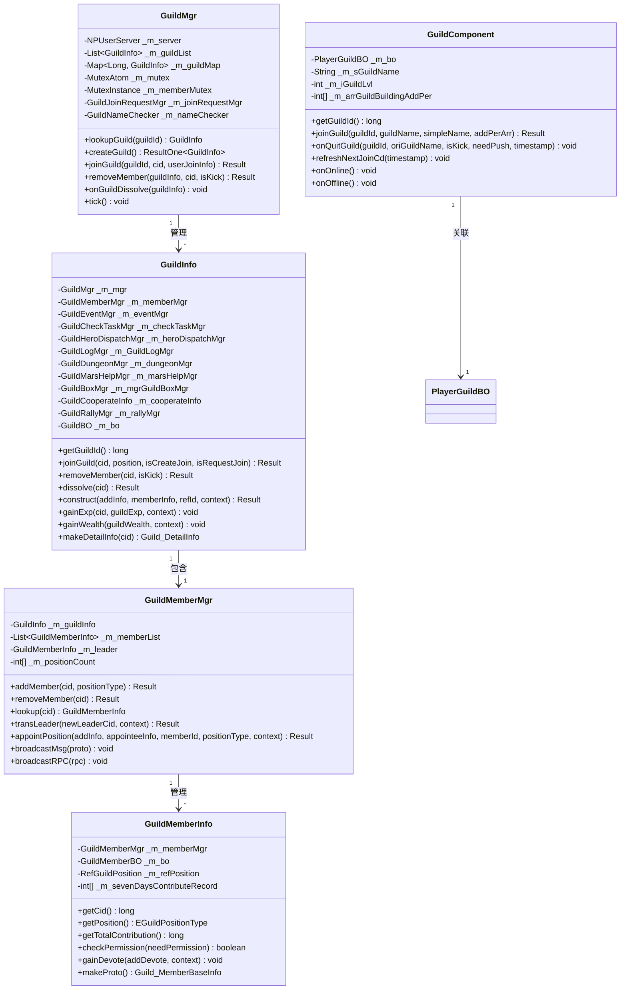
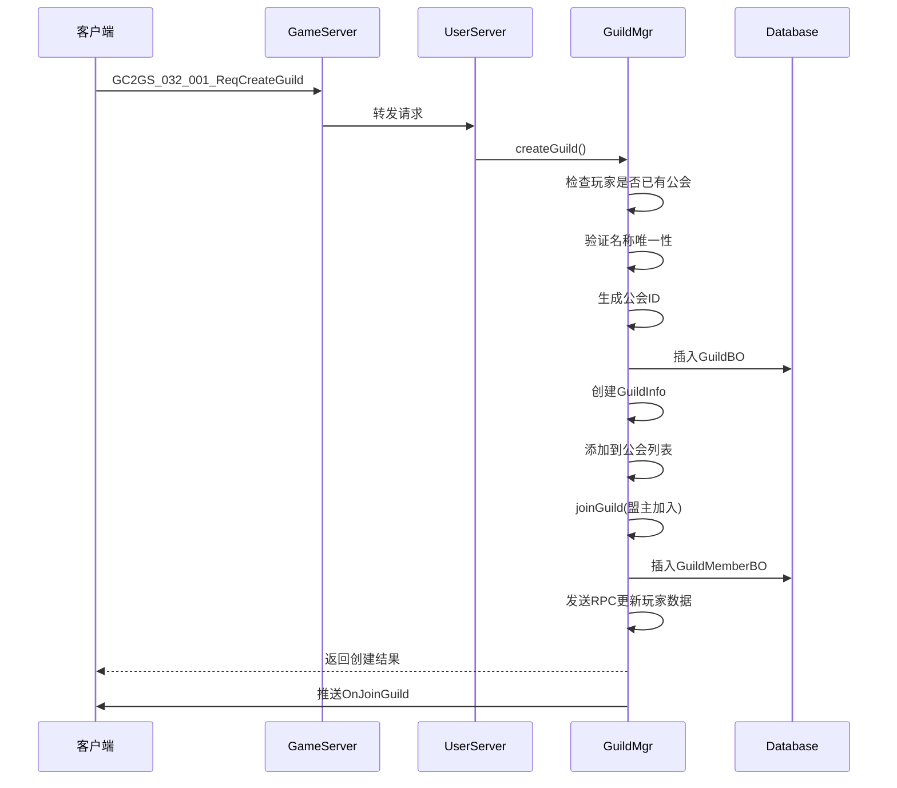
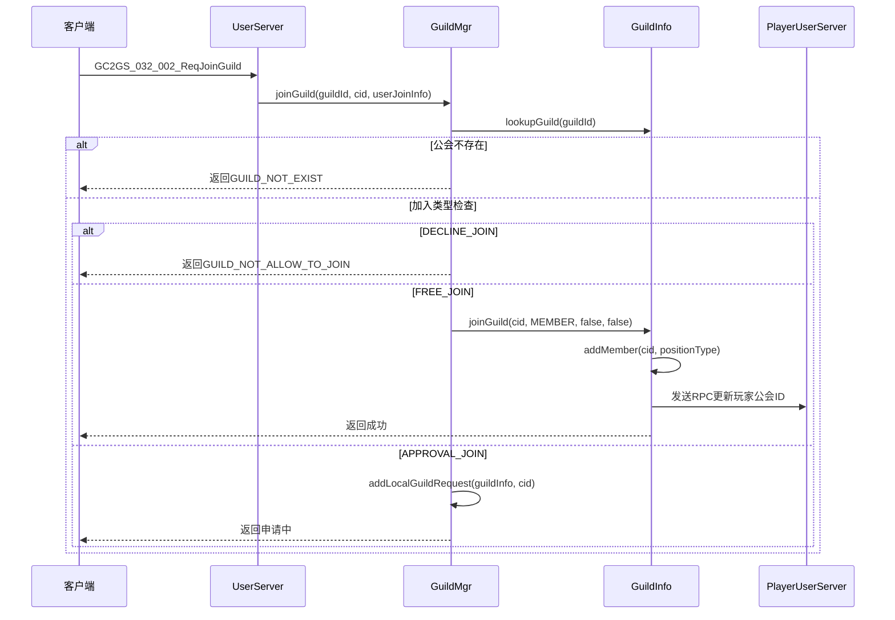
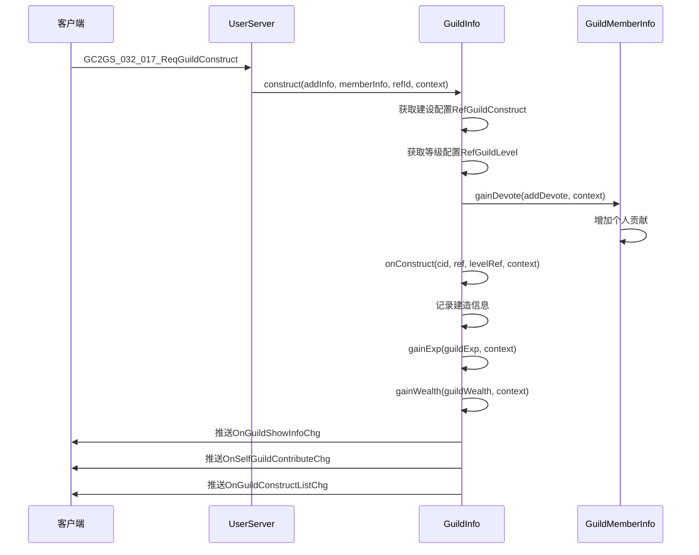
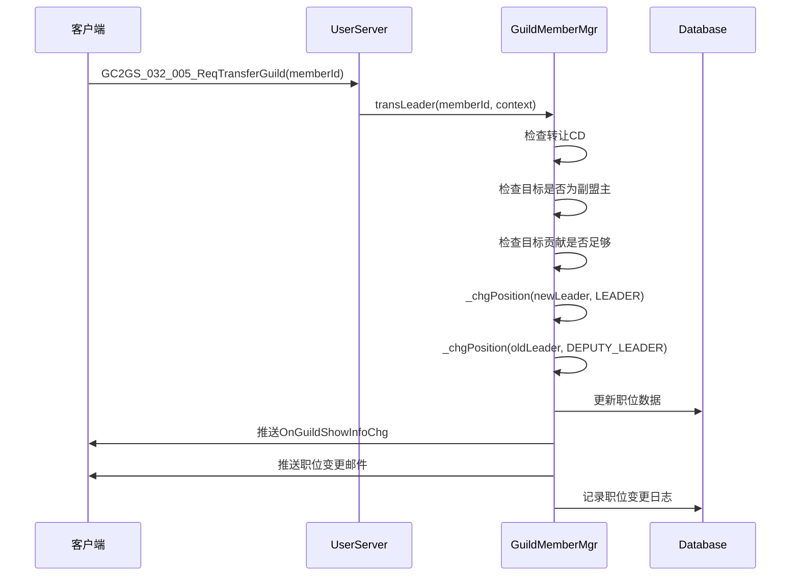
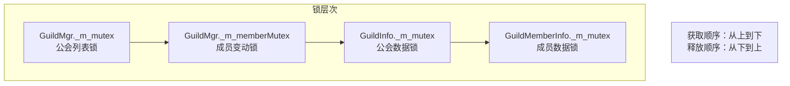
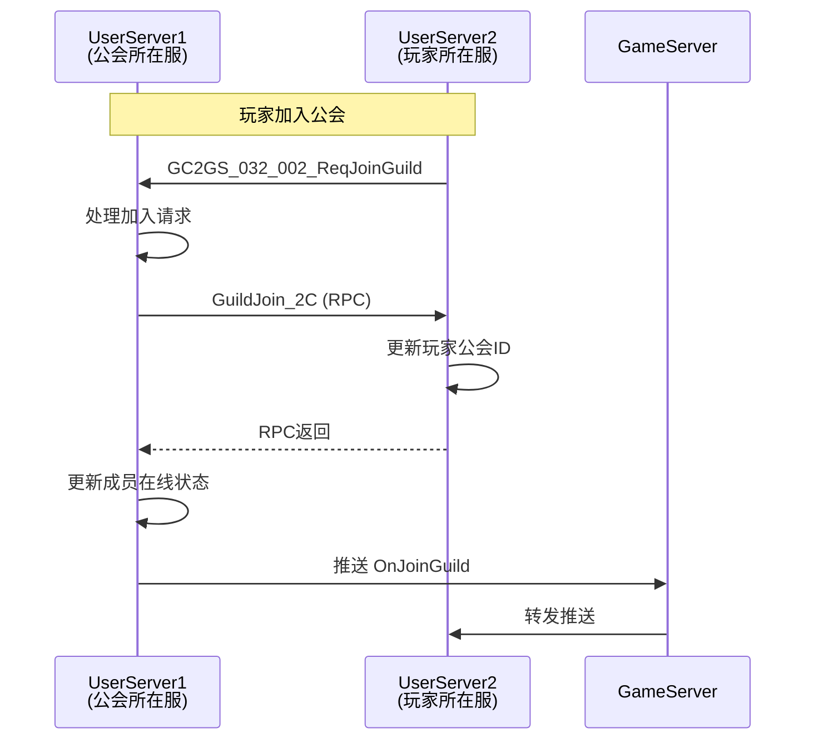
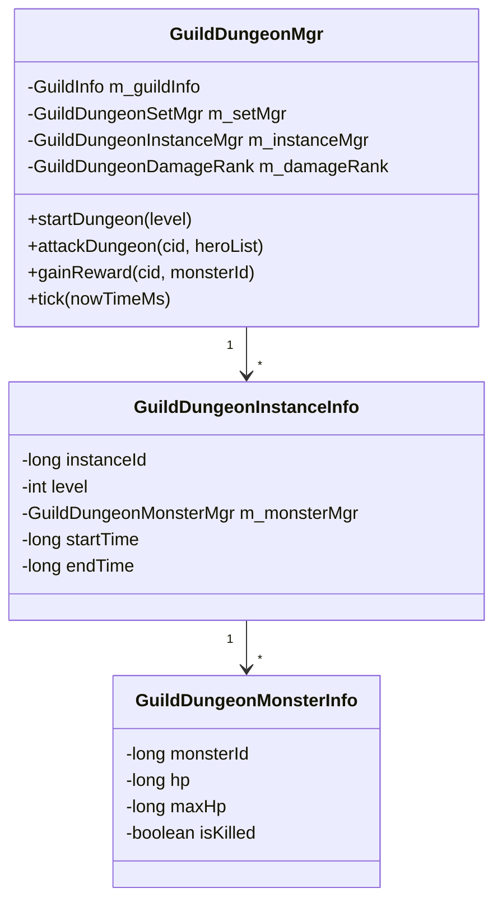
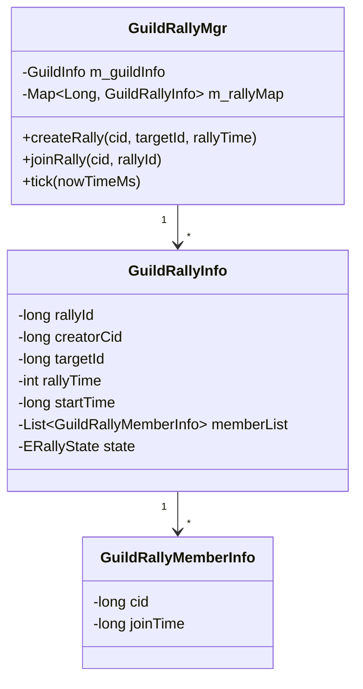
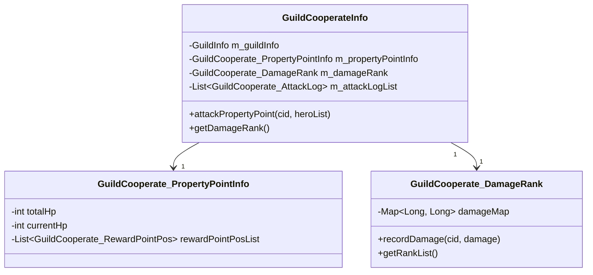

# 公会模块服务端开发文档

## 一、模块架构

### 1.1 模块概述

公会模块（Guild Module）负责管理公会相关的数据和业务逻辑，包括：
- 公会创建、加入、退出
- 公会成员管理
- 公会建设与升级
- 公会宝箱系统
- 公会求助与帮助系统
- 火星系统公会功能
- 公会副本
- 公会集结
- 公会协作

### 1.2 模块编号

协议模块编号: `p032`, `p042`

### 1.3 架构图



---

## 二、核心数据结构

### 2.1 公会详细信息 (Guild_DetailInfo)

**路径**: `ClientProtocol/Common/GuildObj/Guild_DetailInfo.cs`

| 字段名 | 类型 | 说明 |
|--------|------|------|
| guildInfo | Guild_ShowInfo | 公会基础信息 |
| guildWealth | long | 联盟财富 |
| announcement | string | 公告 |
| memberList | List<Guild_MemberBaseInfo> | 成员列表 |
| joinRequestList | List<Guild_JoinRequestInfo> | 入盟请求列表 |
| constructList | Guild_ConstructList | 建造信息列表 |
| eventList | List<Guild_EventInfo> | 事件列表 |
| nextCanRecruitTimeMs | long | 下次可公开招募时间 |
| entrustInfo | Guild_EntrustInfo | 杂物委托信息 |
| dispatchData | Guild_DispatchData | 派遣信息 |
| selfContributeInfo | Guild_MemberContributeInfo | 贡献信息 |
| latestMarsMineBattleReportId | long | 最新火星矿战报ID |

### 2.2 公会成员基础信息 (Guild_MemberBaseInfo)

**路径**: `ClientProtocol/Common/GuildObj/Guild_MemberBaseInfo.cs`

| 字段名 | 类型 | 说明 |
|--------|------|------|
| cid | long | 成员角色ID |
| positionId | int | 职位ID |

### 2.3 数据库实体 (GuildBO)

| 字段名 | 类型 | 说明 |
|--------|------|------|
| guildId | long | 公会ID |
| name | String | 公会名称 |
| simpleName | String | 公会简称 |
| flagId | long | 旗帜ID |
| declaration | String | 宣言 |
| announcement | String | 公告 |
| level | int | 等级 |
| exp | long | 经验 |
| wealth | long | 财富 |
| joinType | int | 加入类型 |
| joinLimitInfo | byte[] | 加入限制信息 |
| constructList | byte[] | 建造信息 |
| activePoint | long | 活跃点 |
| activePointTargetLvl | int | 活跃点目标等级 |
| entrustRefId | long | 委托配置ID |
| entrustEventId | long | 委托事件ID |
| entrustPoint | long | 委托进度 |
| lastProactiveTransLeaderTimeMs | long | 上次主动转让时间 |
| nextOpenRecruitTimeMs | long | 下次可招募时间 |
| isDissovle | boolean | 是否已解散 |

### 2.4 成员数据库实体 (GuildMemberBO)

| 字段名 | 类型 | 说明 |
|--------|------|------|
| guildId | long | 公会ID |
| cid | long | 玩家ID |
| position | int | 职位 |
| totalContribute | long | 总贡献 |
| pastDayContribute | byte[] | 历史7日贡献记录 |
| dayDealEntrustNum | int | 当日处理委托次数 |
| totalDealEntrustNum | int | 总处理委托次数 |
| isOnline | boolean | 是否在线 |
| lastReportOnlineTimestamp | long | 最后上报在线时间 |
| lastResetDataTimestamp | long | 最后重置数据时间 |
| isGuildBoxShareAnonymous | boolean | 宝箱分享是否匿名 |

---

## 三、协议处理

### 3.1 公会操作协议 (p032)

#### 创建与加入

| 协议名 | 主序号 | 子序号 | 处理类 |
|--------|--------|--------|--------|
| GC2GS_032_001_ReqCreateGuild | 32 | 1 | 创建公会 |
| GC2GS_032_002_ReqJoinGuild | 32 | 2 | 加入公会 |
| GC2GS_032_003_ReqRandomJoinGuild | 32 | 3 | 随机加入公会 |
| GC2GS_032_004_ReqOtherGuildInfo | 32 | 4 | 获取其他公会信息 |
| GC2GS_032_005_ReqTransferGuild | 32 | 5 | 转让盟主 |
| GC2GS_032_006_ReqDissolveGuild | 32 | 6 | 解散公会 |

#### 成员管理

| 协议名 | 主序号 | 子序号 | 处理类 |
|--------|--------|--------|--------|
| GC2GS_032_007_ReqGuildPositionAppoint | 32 | 7 | 职位任命 |
| GC2GS_032_014_ReqGuildKickOutMember | 32 | 14 | 踢出成员 |
| GC2GS_032_016_ReqLeaveGuild | 32 | 16 | 退出公会 |
| GC2GS_032_013_ReqProcessGuildJoinRequest | 32 | 13 | 处理入会申请 |

#### 信息修改

| 协议名 | 主序号 | 子序号 | 处理类 |
|--------|--------|--------|--------|
| GC2GS_032_008_ReqChgGuildFlag | 32 | 8 | 修改旗帜 |
| GC2GS_032_009_ReqChgGuildName | 32 | 9 | 修改名称 |
| GC2GS_032_010_ReqChgGuildDeclaration | 32 | 10 | 修改宣言 |
| GC2GS_032_011_ReqChgGuildAnnouncement | 32 | 11 | 修改公告 |
| GC2GS_032_012_ReqSetGuildJoinType | 32 | 12 | 设置加入方式 |

### 3.2 公会相关协议 (p042)

#### 火星求助

| 协议名 | 主序号 | 子序号 | 处理类 |
|--------|--------|--------|--------|
| GC2GS_042_001_ReqSendMarsHelp | 42 | 1 | 发送火星求助 |
| GC2GS_042_002_ReqDealMarsHelp | 42 | 2 | 处理火星求助 |
| GC2GS_042_003_ReqMarsHelpList | 42 | 3 | 火星求助列表 |

#### 公会宝箱

| 协议名 | 主序号 | 子序号 | 处理类 |
|--------|--------|--------|--------|
| GC2GS_042_005_ReqGetGuildBoxList | 42 | 5 | 获取公会宝箱列表 |
| GC2GS_042_007_ReqGainGuildRewardBox | 42 | 7 | 领取公会奖励宝箱 |

#### 集结功能

| 协议名 | 主序号 | 子序号 | 处理类 |
|--------|--------|--------|--------|
| GC2GS_042_060_ReqCreateRally | 42 | 60 | 创建集结 |
| GC2GS_042_061_ReqJoinRally | 42 | 61 | 加入集结 |
| GC2GS_042_062_ReqQueryRallyInfo | 42 | 62 | 查询集结信息 |

---

## 四、核心逻辑流程

### 4.1 创建公会流程



**关键代码**:
```java
public ResultOne<GuildInfo> createGuild(long _flagId, String _name, String _simpleName,
    String _declaration, boolean _isFreeJoin)
{
    // 随机委托事件
    GuildEntrustWeightList entrustWeightList = new GuildEntrustWeightList();
    RefGuildEntrustQuality refGuildEntrustQuality = entrustWeightList.randomRef();

    // 构造数据对象
    GuildBO guildBO = new GuildBO();
    guildBO.setGuildId(_m_server.getBM(), UsID.makeGuildId(_m_server));
    guildBO.setName(_m_server.getBM(), _name);
    guildBO.setSimpleName(_m_server.getBM(), _simpleName);
    guildBO.setFlagId(_m_server.getBM(), _flagId);
    guildBO.setDeclaration(_m_server.getBM(), _declaration);
    guildBO.setJoinType(_m_server.getBM(),
        _isFreeJoin ? EGuildJoinType.FREE_JOIN.ordinal() : EGuildJoinType.APPROVAL_JOIN.ordinal());
    guildBO.setLevel(_m_server.getBM(), 1);
    guildBO.insert(_m_server.getBM());

    // 构造工会信息
    GuildInfo guildInfo = new GuildInfo(guildBO, this);
    _onGuildAdd(guildInfo);

    return ResultOne.succ(guildInfo);
}
```

### 4.2 加入公会流程



### 4.3 公会建设流程



**关键代码**:
```java
public Result construct(GuildOp_PlayerCname _addInfo, GuildMemberInfo _memberInfo,
    long _refId, NPPlayerContext _context)
{
    // 查找配置
    RefGuildConstruct refGuildConstruct = RefGuildConstruct.getMgr().get(_refId);
    if (refGuildConstruct == null)
        return CommErr.REF_NOT_FOUND;

    // 查找联盟等级配置
    RefGuildLevel levelRef = getLevelRef();
    if (levelRef == null)
        return CommErr.REF_NOT_FOUND;

    // 获取个人贡献
    _memberInfo.gainDevote(refGuildConstruct.add_devote, _context);

    // 记录建造信息
    onConstruct(_memberInfo.getCid(), refGuildConstruct, levelRef, _context);

    // 发送日志
    GuildLogFunc.sendGuildConstructionLog(_addInfo.getCname(), _refId,
        refGuildConstruct.add_guild_exp, refGuildConstruct.add_guild_wealth,
        refGuildConstruct.add_personal_guild_coin, this);

    return Result.SUCC;
}
```

### 4.4 公会转让流程



---

## 五、数据库设计

### 5.1 公会数据表 (guild)

| 字段名 | 类型 | 说明 | 索引 |
|--------|------|------|------|
| id | BIGINT | 主键 | PK |
| guild_id | BIGINT | 公会ID | UK |
| name | VARCHAR(32) | 公会名称 | UK |
| simple_name | VARCHAR(8) | 公会简称 | UK |
| flag_id | BIGINT | 旗帜ID | |
| declaration | VARCHAR(256) | 宣言 | |
| announcement | VARCHAR(512) | 公告 | |
| level | INT | 公会等级 | |
| exp | BIGINT | 公会经验 | |
| wealth | BIGINT | 公会财富 | |
| leader_id | BIGINT | 盟主ID | IDX |
| join_type | INT | 加入类型 | |
| join_limit_info | BLOB | 加入限制信息 | |
| construct_list | BLOB | 建造信息 | |
| active_point | BIGINT | 活跃点 | |
| entrust_ref_id | BIGINT | 委托配置ID | |
| entrust_event_id | BIGINT | 委托事件ID | |
| entrust_point | BIGINT | 委托进度 | |
| create_time | DATETIME | 创建时间 | IDX |
| is_dissolve | BOOLEAN | 是否已解散 | |

### 5.2 公会成员数据表 (guild_member)

| 字段名 | 类型 | 说明 | 索引 |
|--------|------|------|------|
| id | BIGINT | 主键 | PK |
| guild_id | BIGINT | 公会ID | IDX |
| cid | BIGINT | 玩家ID | UK |
| position | INT | 职位ID | |
| total_contribute | BIGINT | 总贡献值 | |
| past_day_contribute | BLOB | 历史7日贡献 | |
| day_deal_entrust_num | INT | 当日处理委托次数 | |
| total_deal_entrust_num | INT | 总处理委托次数 | |
| is_online | BOOLEAN | 是否在线 | |
| last_report_online_timestamp | BIGINT | 最后上报在线时间 | |
| last_reset_data_timestamp | BIGINT | 最后重置数据时间 | |
| join_time | DATETIME | 加入时间 | |

### 5.3 公会申请数据表 (guild_join_request)

| 字段名 | 类型 | 说明 | 索引 |
|--------|------|------|------|
| id | BIGINT | 主键 | PK |
| guild_id | BIGINT | 公会ID | IDX |
| cid | BIGINT | 申请人ID | IDX |
| status | INT | 状态 | |
| apply_time | DATETIME | 申请时间 | |
| process_time | DATETIME | 处理时间 | |

### 5.4 公会日志数据表 (guild_log)

| 字段名 | 类型 | 说明 | 索引 |
|--------|------|------|------|
| id | BIGINT | 主键 | PK |
| guild_id | BIGINT | 公会ID | IDX |
| type | INT | 日志类型 | |
| data | BLOB | 日志数据 | |
| create_time | DATETIME | 创建时间 | IDX |

---

## 六、服务配置

### 6.1 协议注册

```java
// 协议主序号
public const byte GUILD_MODULE_ORDER = 32;
public const byte GUILD_RELATED_ORDER = 42;

// 协议处理器注册
protocolHandler.Register<GC2GS_032_001_ReqCreateGuild>(OnCreateGuild);
protocolHandler.Register<GC2GS_032_002_ReqJoinGuild>(OnJoinGuild);
protocolHandler.Register<GC2GS_032_003_ReqRandomJoinGuild>(OnRandomJoinGuild);
protocolHandler.Register<GC2GS_032_004_ReqOtherGuildInfo>(OnOtherGuildInfo);
protocolHandler.Register<GC2GS_032_005_ReqTransferGuild>(OnTransferGuild);
protocolHandler.Register<GC2GS_032_006_ReqDissolveGuild>(OnDissolveGuild);
protocolHandler.Register<GC2GS_032_007_ReqGuildPositionAppoint>(OnPositionAppoint);
protocolHandler.Register<GC2GS_032_008_ReqChgGuildFlag>(OnChgGuildFlag);
protocolHandler.Register<GC2GS_032_009_ReqChgGuildName>(OnChgGuildName);
protocolHandler.Register<GC2GS_032_010_ReqChgGuildDeclaration>(OnChgDeclaration);
protocolHandler.Register<GC2GS_032_011_ReqChgGuildAnnouncement>(OnChgAnnouncement);
protocolHandler.Register<GC2GS_032_012_ReqSetGuildJoinType>(OnSetJoinType);
protocolHandler.Register<GC2GS_032_013_ReqProcessGuildJoinRequest>(OnProcessJoinRequest);
protocolHandler.Register<GC2GS_032_014_ReqGuildKickOutMember>(OnKickOutMember);
protocolHandler.Register<GC2GS_032_016_ReqLeaveGuild>(OnLeaveGuild);
protocolHandler.Register<GC2GS_032_017_ReqGuildConstruct>(OnGuildConstruct);
```

### 6.2 服务依赖

公会模块依赖以下服务：
- 玩家数据服务 (PlayerDataService)
- 资源服务 (ResourceService)
- 配置数据服务 (RefdataService)
- 推送服务 (PushService)
- 跨服服务 (CrossServerService)
- 聊天服务 (ChatService)
- 排行榜服务 (RankService)

### 6.3 初始化流程

```java
public boolean init()
{
    // 加载工会数据
    List<GuildBO> guildBOList = _m_server.getBM().getBM(GuildBO.class).s_findAll();
    for (GuildBO guildBO : guildBOList)
    {
        GuildInfo guildInfo = new GuildInfo(guildBO, this);
        _onGuildAdd(guildInfo);
    }

    // 加载工会成员数据
    List<GuildMemberBO> memberBOList = _m_server.getBM().getBM(GuildMemberBO.class).s_findAll();
    for (GuildMemberBO memberBO : memberBOList)
    {
        GuildInfo guildInfo = lookupGuild(memberBO.getGuildId());
        if (guildInfo != null)
        {
            guildInfo.getMemberMgr().initMember(memberBO);
        }
    }

    // 加载工会申请数据
    List<GuildJoinRequestBO> requestBOList = _m_server.getBM().getBM(GuildJoinRequestBO.class).s_findAll();
    for (GuildJoinRequestBO requestBO : requestBOList)
    {
        _m_joinRequestMgr.initGuildJoinRequest(requestBO);
    }

    // 加载其他数据（日志、事件、派遣、副本、宝箱等）...

    // 初始化公会
    for (GuildInfo guildInfo : _m_guildList)
    {
        guildInfo.onInited();
    }

    // 启动tick
    tick();

    return true;
}
```

---

## 七、RPC通信

### 7.1 玩家加入公会RPC

```java
// 发送给玩家所在服务器
GuildJoin_2C rpc = new GuildJoin_2C();
rpc.req().setCid(_cid);
rpc.req().setGuildId(getGuildId());
rpc.req().setIsRequestJoin(_isRequestJoin);
rpc.req().setSimpleName(getSimpleName());

int usId = CommonFunc.parseServerTypeIdFromCid(_cid);
getGuildMgr().getServer().rpc2us().requestToRepeat(usId, rpc, callback, 3, failCallback);
```

### 7.2 玩家移除RPC

```java
// 发送给玩家所在服务器
GuildMemberRmv_2C rpc = new GuildMemberRmv_2C();
rpc.req().setCid(_cid);
rpc.req().setGuildId(getGuildId());
rpc.req().setGuildName(getName());
rpc.req().setTimeMS(CommonFunc.getNowTimeMS());
rpc.req().setIsKicked(_isKicked);

int usId = CommonFunc.parseServerTypeIdFromCid(_cid);
getGuildMgr().getServer().rpc2us().requestToRepeat(usId, rpc, null, 3, failCallback);
```

### 7.3 公会属性加成同步RPC

```java
// 广播属性加成变化
GuildSimpleNameChg_2C rpc = new GuildSimpleNameChg_2C();
rpc.req().setGuildId(getGuildId());
rpc.req().setGuildName(getName());
rpc.req().setSimpleName(_simpleName);
getMemberMgr().broadcastRPC(rpc);
```

---

## 八、定时任务

### 8.1 Tick处理

```java
public synchronized void tick()
{
    long nowTimeMS = CommonFunc.getNowTimeMS();

    ArrayList<GuildInfo> guildList = new ArrayList<>(_m_guildList);

    for (GuildInfo guildInfo : guildList)
    {
        guildInfo.tick(nowTimeMS);
    }

    // 5秒后处理一次
    ALSynTaskManager.getInstance().regTask(this::tick, 5000);
}
```

### 8.2 公会Tick处理

```java
public void tick(long _nowTimeMs)
{
    _lock();
    try
    {
        // 国力变更推送
        if (_m_preTotalEarnings != _m_newTotalEarnings)
        {
            _m_preTotalEarnings = _m_newTotalEarnings;
            _m_memberMgr.broadcastMsg(new GS2GC_032_062_OnGuildTotalEarningsChg(_m_preTotalEarnings));
        }

        // 事件管理器tick
        _m_eventMgr.tick();

        // 检查任务
        _m_checkTaskMgr.tick(_nowTimeMs);

        // 公会副本检查
        _m_dungeonMgr.tick(_nowTimeMs);

        // 联盟集结到期处理
        _m_rallyMgr.tick(_nowTimeMs);
    } finally
    {
        _unlock();
    }
}
```

---

## 九、并发控制

### 9.1 锁机制

```java
// 公会列表锁
private MutexAtom _m_mutex;

// 成员变动操作锁
private MutexInstance _m_memberMutex;

// 使用示例
public Result joinGuild(GuildInfo _guildInfo, long _cid, EGuildPositionType _position,
    boolean _isCreateJoin, boolean _isRequestJoin)
{
    Result result;
    _m_memberMutex.lock();
    try
    {
        result = _guildInfo.joinGuild(_cid, _position, _isCreateJoin, _isRequestJoin);
    } finally
    {
        _m_memberMutex.unlock();
    }
    // ... 后续处理
    return result;
}
```

### 9.2 异步任务处理

```java
// 使用异步任务处理耗时操作
ALSynTaskManager.getInstance().regTask(() ->
{
    // 发送RPC处理
    memberRmv(_cid, _isKick);

    // 移除玩家排行榜国力
    RankFixedInfo rankFixedInfo = _m_mgr.getServer().getRankFixedMgr().lookupRank(RefGeneral.Ref().guild_rank_fixed_id);
    if (rankFixedInfo != null)
        rankFixedInfo.removeSubObj(getGuildId(), _cid);

    // 修改玩家Cache中数据
    PlayerCacheFunc.updateGuildInfo(getGuildMgr().getServer(), _cid, new CachedObj_CachedGuildInfo());
});
```

---

## 十、并发控制详解

### 10.1 锁层次结构



### 10.2 锁使用规范

**禁止行为**：
- 跨层级同时持有多个锁
- 在锁内调用外部服务
- 在锁内执行耗时操作

**正确示例**：
```java
// 正确：单一层级锁
public Result joinGuild(GuildInfo _guildInfo, long _cid, EGuildPositionType _position, ...)
{
    Result result;
    _m_memberMutex.lock();
    try
    {
        result = _guildInfo.joinGuild(_cid, _position, ...);
    } finally
    {
        _m_memberMutex.unlock();
    }

    // 锁外执行耗时操作
    _onJoinSuccess(_cid);

    return result;
}
```

**错误示例**：
```java
// 错误：嵌套锁
public void wrongExample()
{
    _m_mutex.lock();
    try
    {
        // 危险：嵌套获取另一个锁
        _m_memberMutex.lock();  // 可能死锁
        try
        {
            // ...
        } finally
        {
            _m_memberMutex.unlock();
        }
    } finally
    {
        _m_mutex.unlock();
    }
}
```

### 10.3 锁优先级设置

```java
// 降低成员锁优先级避免冲突
_m_mutex = new MutexAtom();
_m_memberMutex = new MutexInstance();

// 成员信息锁降低优先级
_m_memberMutex.reducePriority(10);
```

---

## 十一、数据一致性保证

### 11.1 事务处理示例

```java
/**
 * 公会创建事务
 * 1. 创建公会数据
 * 2. 添加成员数据
 * 3. 发送RPC更新玩家数据
 *
 * 回滚策略：任一步骤失败则清理已创建数据
 */
public ResultOne<GuildInfo> createGuildWithTransaction(...)
{
    // Step 1: 创建公会
    GuildBO guildBO = new GuildBO();
    guildBO.setGuildId(...);
    guildBO.setName(...);
    guildBO.insert(_m_server.getBM());

    GuildInfo guildInfo = new GuildInfo(guildBO, this);

    // Step 2: 添加创建者为盟主
    Result joinResult = guildInfo.joinGuild(_cid, EGuildPositionType.LEADER, true, false);
    if (!joinResult.isSucc())
    {
        // 回滚：删除公会数据
        guildBO.del(_m_server.getBM());
        return ResultOne.fail(joinResult);
    }

    // Step 3: 发送RPC更新玩家数据
    GuildJoin_2C rpc = new GuildJoin_2C();
    rpc.req().setCid(_cid);
    rpc.req().setGuildId(guildInfo.getGuildId());

    int usId = CommonFunc.parseServerTypeIdFromCid(_cid);
    AtomicBoolean rpcSuccess = new AtomicBoolean(false);

    getGuildMgr().getServer().rpc2us().requestToRepeat(usId, rpc, _rpc -> {
        rpcSuccess.set(true);
    }, 3, () -> {
        // RPC失败，标记失败
        rpcSuccess.set(false);
    });

    if (!rpcSuccess.get())
    {
        // 回滚：移除成员并删除公会
        guildInfo.removeMember(_cid, false);
        guildBO.del(_m_server.getBM());
        return ResultOne.fail(CommErr.RPC_FAILED);
    }

    return ResultOne.succ(guildInfo);
}
```

### 11.2 数据校验策略

```java
/**
 * 公会操作前置校验
 */
public Result validateGuildOperation(long _cid, GuildInfo _guildInfo, EGuildPermissionType _permission)
{
    // 1. 公会存在性校验
    if (_guildInfo == null || _guildInfo.isDissolve())
        return GuildErr.GUILD_NOT_EXIST;

    // 2. 成员存在性校验
    GuildMemberInfo memberInfo = _guildInfo.getMemberMgr().lookup(_cid);
    if (memberInfo == null)
        return GuildErr.NOT_MEMBER_OF_GUILD;

    // 3. 权限校验
    if (!memberInfo.checkPermission(_permission))
        return GuildErr.DONT_HAVE_PERMISSION;

    // 4. 公会状态校验
    if (_guildInfo.getJoinType() == EGuildJoinType.DECLINE_JOIN)
    {
        // 特殊状态下的额外校验
    }

    return Result.SUCC;
}
```

---

## 十二、服务间通信详解

### 12.1 RPC通信模型



### 12.2 关键RPC定义

| RPC名称 | 方向 | 触发场景 | 数据内容 |
|---------|------|----------|----------|
| GuildJoin_2C | 公会服 → 玩家服 | 加入公会 | guildId, simpleName, addPerArr |
| GuildMemberRmv_2C | 公会服 → 玩家服 | 退出/踢出 | guildId, guildName, isKicked |
| GuildSimpleNameChg_2C | 公会服 → 玩家服 | 改名 | guildName, simpleName |
| GuildLevelChg_2C | 公会服 → 玩家服 | 升级 | guildLvl |
| GuildMemberOnlineState | 玩家服 → 公会服 | 上下线 | cid, isOnline |
| GuildRequestLoadRankData | 玩家服 → 公会服 | 国力变化 | cid, guildId |

### 12.3 RPC超时处理

```java
// RPC调用配置
int maxRetry = 3;           // 最大重试次数
int timeoutMs = 5000;       // 超时时间

getServer().rpc2us().requestToRepeat(usId, rpc
    , successCallback      // 成功回调
    , maxRetry             // 重试次数
    , failCallback         // 失败回调
);

// 失败处理
Runnable failCallback = () -> {
    USLog.error(getServer(), "RPC failed: player:{} guild:{}"
        , _cid, _guildId);

    // 根据业务场景决定是否需要补偿操作
    // 例如：重新发送、记录日志、通知玩家等
};
```

---

## 十三、服务监控与告警

### 13.1 关键监控指标

| 指标名称 | 计算方式 | 正常范围 | 告警阈值 |
|----------|----------|----------|----------|
| 公会数量 | _m_guildList.size() | < 10000 | > 10000 |
| 平均成员数 | sum(memberCount) / guildCount | 10-30 | < 5 |
| 操作延迟 | 耗时统计 | < 100ms | > 500ms |
| RPC成功率 | 成功数 / 总数 | > 99% | < 95% |
| 锁等待时间 | 获取锁耗时 | < 10ms | > 100ms |

### 13.2 日志规范

```java
// 操作日志
USLog.info(getServer(), "Guild operation: op={}, guild={}, cid={}, result={}"
    , operationType, guildId, cid, result);

// 错误日志
USLog.error(getServer(), "Guild error: op={}, guild={}, cid={}, err={}"
    , operationType, guildId, cid, errCode);

// 变更日志（记录到日志数据库）
LogGuildMemberChgBO logBo = new LogGuildMemberChgBO();
logBo.setGuildId(bmObj, guildId);
logBo.setType(bmObj, logType);
logBo.setCid(bmObj, cid);
CommLogDB.log(bmObj, logBo, context);
```

### 13.3 性能分析

```java
// 操作耗时统计
long startTime = System.currentTimeMillis();

try
{
    // 执行操作
    Result result = _doOperation();
    return result;
} finally
{
    long cost = System.currentTimeMillis() - startTime;
    if (cost > 100)
    {
        USLog.warn(getServer(), "Slow operation: op={}, cost={}ms"
            , operationType, cost);
    }
}
```

---

## 十四、容灾与恢复

### 14.1 数据持久化策略

| 数据类型 | 持久化方式 | 持久化时机 |
|----------|-----------|-----------|
| GuildBO | 数据库写入 | 创建/变更时即时写入 |
| GuildMemberBO | 数据库写入 | 成员变更时即时写入 |
| GuildEventBO | 数据库写入 | 事件创建时写入 |
| 公会缓存 | 内存缓存 | 服务启动时加载 |

### 14.2 服务重启恢复

```java
public boolean init()
{
    // 1. 加载公会数据
    List<GuildBO> guildBOList = _m_server.getBM().getBM(GuildBO.class).s_findAll();
    for (GuildBO guildBO : guildBOList)
    {
        GuildInfo guildInfo = new GuildInfo(guildBO, this);
        _onGuildAdd(guildInfo);
    }

    // 2. 加载成员数据
    List<GuildMemberBO> memberBOList = _m_server.getBM().getBM(GuildMemberBO.class).s_findAll();
    for (GuildMemberBO memberBO : memberBOList)
    {
        GuildInfo guildInfo = lookupGuild(memberBO.getGuildId());
        if (guildInfo != null)
        {
            guildInfo.getMemberMgr().initMember(memberBO);
        }
    }

    // 3. 加载其他数据（申请、日志、事件等）
    // ...

    // 4. 初始化公会状态
    for (GuildInfo guildInfo : _m_guildList)
    {
        guildInfo.onInited();
    }

    // 5. 启动定时任务
    tick();

    return true;
}
```

### 14.3 异常恢复机制

```java
// 成员数据异常恢复
public Result recoverMemberData(long _guildId, long _cid)
{
    GuildInfo guildInfo = lookupGuild(_guildId);
    if (guildInfo == null)
        return GuildErr.GUILD_NOT_EXIST;

    // 检查成员是否存在
    GuildMemberInfo memberInfo = guildInfo.getMemberMgr().lookup(_cid);
    if (memberInfo != null)
        return Result.SUCC;  // 数据正常

    // 尝试从数据库恢复
    GuildMemberBO memberBO = _m_server.getBM().getBM(GuildMemberBO.class)
        .s_findOne("guild_id = ? AND cid = ?", _guildId, _cid);

    if (memberBO != null)
    {
        // 恢复成员数据
        guildInfo.getMemberMgr().initMember(memberBO);
        USLog.info(getServer(), "Member data recovered: guild={}, cid={}", _guildId, _cid);
        return Result.SUCC;
    }

    return GuildErr.MEMBER_NOT_FOUND;
}
```

---

## 十五、扩展子系统

### 15.1 公会副本质系统



### 15.2 公会集结系统



### 15.3 公会协作系统



---

## 十六、GM命令支持

### 16.1 常用GM命令

| 命令 | 参数 | 功能 | 示例 |
|------|------|------|------|
| guild_create | flagId, name, simpleName | 创建公会 | guild_create 1001 测试公会 CS |
| guild_set_level | level | 设置公会等级 | guild_set_level 10 |
| guild_set_wealth | wealth | 设置公会财富 | guild_set_wealth 100000 |
| guild_add_exp | exp | 增加公会经验 | guild_add_exp 1000 |
| guild_refresh_entrust | - | 刷新委托 | guild_refresh_entrust |
| guild_clear_recruit_cd | - | 清除招募CD | guild_clear_recruit_cd |
| guild_force_transfer | currentLeaderCid, newLeaderCid | 强制转让盟主 | guild_force_transfer 10001 10002 |

### 16.2 GM命令实现

```java
// 强制转让盟主
public Result transferLeaderByGM(long _currentLeaderCid, long _newLeaderCid, NPPlayerContext _context)
{
    _lock();
    try
    {
        // 校验当前盟主ID
        long actualLeaderId = getLeaderId();
        if (actualLeaderId != _currentLeaderCid)
            return CommErr.PARAM_ERROR;

        // 调用强制转让（绕过业务规则）
        return _m_memberMgr.forceTransLeader(_newLeaderCid, _context);
    } finally
    {
        _unlock();
    }
}

// 强制转让实现
public Result forceTransLeader(long _newLeaderCid, NPPlayerContext _context)
{
    // 获取新盟主
    GuildMemberInfo newLeaderInfo = lookup(_newLeaderCid);
    if (newLeaderInfo == null)
        return GuildErr.MEMBER_NOT_FOUND;

    // 获取原盟主
    GuildMemberInfo oriLeader = _m_leader;

    // 获取职位配置
    RefGuildPosition leaderPosition = RefGuildPosition.getMgr().get(EGuildPositionType.LEADER.ordinal());
    RefGuildPosition memberPosition = RefGuildPosition.getMgr().get(newLeaderInfo.getPosition().ordinal());

    // 执行转让
    _chgPosition(newLeaderInfo, leaderPosition, oriLeader.getCid(), _context);
    _chgPosition(oriLeader, memberPosition, oriLeader.getCid(), _context);

    // 更新盟主引用
    _m_leader = newLeaderInfo;

    // 广播变更
    broadcastMsg(new GS2GC_032_050_OnGuildShowInfoChg(_m_guildInfo.makeShowInfo()));

    return Result.SUCC;
}
```

---

*文档生成时间: 2026-04-11*
