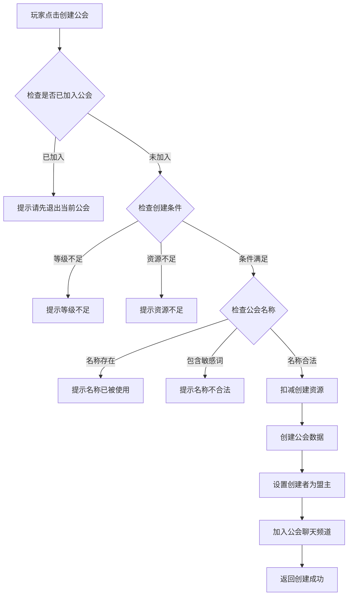
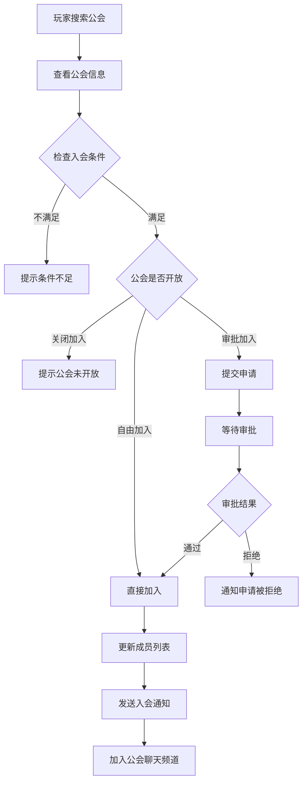
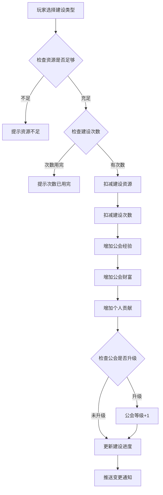
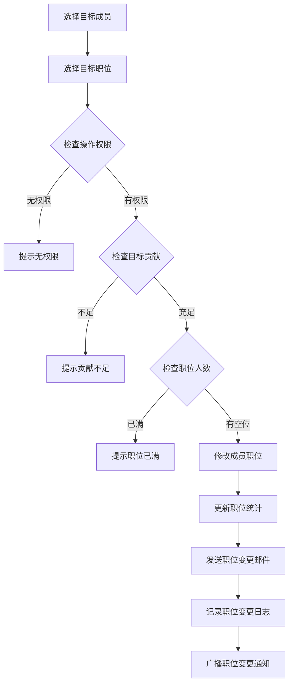
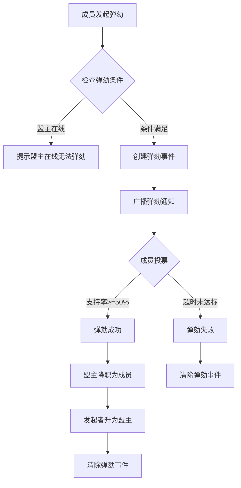
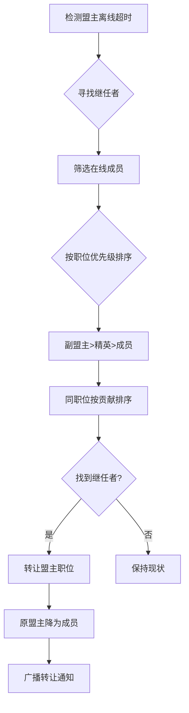
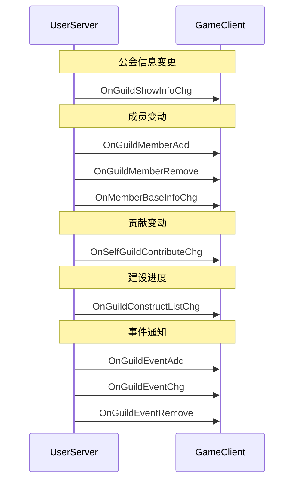
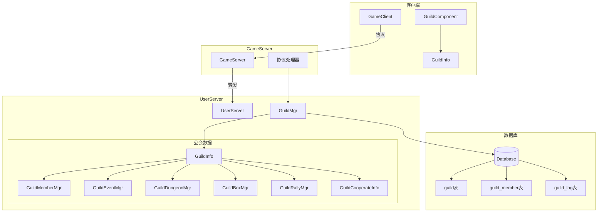

# 公会模块完整说明

## 一、模块概述

### 1.1 业务背景

公会模块是 K2C 游戏的核心社交系统。玩家可以创建或加入公会，与志同道合的玩家一起成长。公会提供了丰富的社交玩法和团队内容，包括公会建设、公会技能、公会副本等，是增强玩家粘性和游戏深度的重要系统。

### 1.2 目标用户

- **社交型玩家**：希望结交朋友，参与团队活动
- **竞争型玩家**：通过公会战、公会排名证明实力
- **领导者**：希望管理公会，带领成员发展

### 1.3 核心价值

1. **社交连接**：建立玩家之间的社交纽带
2. **团队协作**：通过公会活动促进玩家合作
3. **长期目标**：公会发展为玩家提供长期追求
4. **资源产出**：公会系统提供额外资源获取途径

---

## 二、功能清单

### 2.1 公会基础功能

| 功能名称 | 功能描述 | 用户价值 |
|---------|---------|---------|
| 公会创建 | 消耗资源创建公会 | 建立自己的团队 |
| 公会解散 | 解散公会（仅盟主） | 退出公会系统 |
| 公会搜索 | 按名称/简称搜索公会 | 找到目标公会 |
| 公会申请 | 申请加入公会 | 加入心仪公会 |
| 申请审批 | 审批入会申请 | 管理公会成员 |
| 退出公会 | 主动退出公会 | 离开当前公会 |
| 踢出成员 | 将成员踢出公会 | 管理不良成员 |

### 2.2 公会管理功能

| 功能名称 | 功能描述 | 用户价值 |
|---------|---------|---------|
| 职位管理 | 设置成员职位 | 分配权限和责任 |
| 公告管理 | 设置公会公告 | 传达公会信息 |
| 入会条件 | 设置入会门槛 | 控制成员质量 |
| 公会改名 | 修改公会名称和简称 | 品牌重塑 |
| 旗帜修改 | 修改公会旗帜 | 形象定制 |

### 2.3 公会建设功能

| 功能名称 | 功能描述 | 用户价值 |
|---------|---------|---------|
| 公会建设 | 捐献资源获得贡献 | 增加公会资金 |
| 建设奖励 | 达成进度领取奖励 | 集体奖励 |
| 公会升级 | 提升公会等级 | 解锁更多功能 |

### 2.4 公会社交功能

| 功能名称 | 功能描述 | 用户价值 |
|---------|---------|---------|
| 公会聊天 | 公会专属聊天频道 | 成员交流 |
| 公会邮件 | 公会群发邮件 | 通知公告 |
| 成员列表 | 查看成员信息 | 了解公会 |
| 公开招募 | 世界频道发布招募 | 招募新成员 |

### 2.5 公会弹劾功能

| 功能名称 | 功能描述 | 用户价值 |
|---------|---------|---------|
| 发起弹劾 | 弹劾不活跃盟主 | 维护公会利益 |
| 批准弹劾 | 成员投票支持弹劾 | 民主决策 |
| 取消弹劾 | 发起者取消弹劾 | 误操作撤销 |

### 2.6 公会事务功能

| 功能名称 | 功能描述 | 用户价值 |
|---------|---------|---------|
| 杂物委托 | 处理公会事务获得奖励 | 日常收益 |
| 派遣大臣 | 派遣伙伴获得属性加成 | 属性提升 |

### 2.7 公会宝箱功能

| 功能名称 | 功能描述 | 用户价值 |
|---------|---------|---------|
| 活跃宝箱 | 公会活跃度达标获得 | 集体活跃奖励 |
| 宝箱领取 | 领取可用宝箱 | 获取资源 |

### 2.8 公会协作功能

| 功能名称 | 功能描述 | 用户价值 |
|---------|---------|---------|
| 协作攻击 | 成员协作攻击据点 | 团队PVE |
| 伤害排行 | 记录协作伤害排名 | 竞争排名 |
| 协作奖励 | 根据伤害发放奖励 | 团队收益 |

### 2.9 公会集结功能

| 功能名称 | 功能描述 | 用户价值 |
|---------|---------|---------|
| 创建集结 | 发起集体行动 | 组织团队活动 |
| 加入集结 | 参与集结行动 | 参与团队活动 |
| 集结出发 | 集结时间到达出发 | 协同作战 |

---

## 三、业务流程详解

### 3.1 公会创建流程



**详细步骤说明**：

1. **前置检查**
   - 玩家未加入任何公会
   - 玩家等级达到创建要求
   - 拥有足够的创建资源（钻石）

2. **名称验证**
   - 名称长度：2-10个字符
   - 简称长度：2-4个字符
   - 不包含敏感词
   - 全服唯一

3. **创建处理**
   - 扣减创建资源
   - 创建公会基础数据
   - 设置创建者为盟主
   - 初始化公会资金和经验
   - 创建公会聊天频道

### 3.2 公会申请流程



**加入类型说明**：

| 加入类型 | 说明 |
|---------|------|
| FREE_JOIN | 自由加入，符合条件直接入会 |
| APPROVAL_JOIN | 审批加入，需要管理审批 |
| DECLINE_JOIN | 拒绝加入，不接收新成员 |

**入会条件类型**：

| 条件类型 | 说明 |
|---------|------|
| NATION_POWER | 国力（总赚速）要求 |
| LEVEL | 玩家等级要求 |

### 3.3 公会建设流程



**建设类型说明**：

| 建设类型 | 消耗资源 | 获得贡献 | 公会经验 | 公会财富 |
|---------|---------|---------|---------|---------|
| 金币建设 | 银两×10000 | 50 | 100 | 200 |
| 钻石建设 | 钻石×50 | 200 | 500 | 1000 |
| 免费建设 | 无 | 20 | 30 | 50 |

### 3.4 公会职位任命流程



### 3.5 公会弹劾流程



### 3.6 盟主被动转让流程



---

## 四、关键规则

### 4.1 公会等级规则

1. **等级上限**：最高30级
2. **升级条件**：公会经验达到阈值
3. **等级效果**：
   - 增加成员上限
   - 解锁职位名额
   - 解锁公会功能

**等级配置示例**：

| 等级 | 成员上限 | 副盟主名额 | 精英名额 | 升级经验 |
|------|---------|-----------|---------|---------|
| 1 | 30 | 1 | 3 | 0 |
| 5 | 40 | 2 | 5 | 5000 |
| 10 | 50 | 2 | 7 | 20000 |
| 20 | 70 | 3 | 10 | 100000 |
| 30 | 100 | 5 | 15 | 500000 |

### 4.2 公会职位规则

| 职位 | 权限 | 人数限制 | 说明 |
|------|------|---------|------|
| 盟主 | 全部权限 | 1人 | 公会创建者或转让继任 |
| 副盟主 | 审批、踢人、公告、修改设置 | 等级配置 | 高级管理 |
| 精英 | 审批、公告 | 等级配置 | 中级管理 |
| 成员 | 基本权限 | 无限制 | 普通成员 |

**权限详解**：

| 操作 | 盟主 | 副盟主 | 精英 | 成员 |
|------|------|--------|------|------|
| 解散公会 | OK | - | - | - |
| 转让盟主 | OK | - | - | - |
| 任命副盟主 | OK | - | - | - |
| 任命精英 | OK | OK | - | - |
| 踢出成员 | OK | OK | - | - |
| 审批申请 | OK | OK | OK | - |
| 修改公告 | OK | OK | OK | - |
| 修改入会条件 | OK | OK | - | - |
| 公会建设 | OK | OK | OK | OK |
| 处理委托 | OK | OK | OK | OK |
| 派遣大臣 | OK | OK | OK | OK |

### 4.3 公会贡献规则

1. **贡献获取**：通过建设、公会活动获得
2. **贡献用途**：派遣大臣、公会商店兑换
3. **贡献保留**：退出公会贡献保留，重新加入继续累计

**贡献获取方式**：

| 方式 | 获得贡献 | 每日上限 |
|------|---------|---------|
| 金币建设 | 50 | 3次 |
| 钻石建设 | 200 | 2次 |
| 免费建设 | 20 | 1次 |
| 处理委托 | 根据公会总赚速计算 | 无上限 |

### 4.4 公会成员规则

1. **成员上限**：基础30人，随公会等级增加
2. **入会冷却**：退出公会后需等待24小时才能加入新公会（可使用免CD次数）
3. **职位转移**：盟主可转让职位给副盟主，需满足贡献要求
4. **自动转让**：盟主离线超过72小时，系统自动转让给活跃副盟主

---

## 五、数据同步机制

### 5.1 实时推送



### 5.2 跨服同步

公会数据存储在公会所属的UserServer上，需要通过RPC与其他UserServer通信：

1. **玩家加入公会**：公会服务器 -> 玩家服务器
2. **玩家退出公会**：公会服务器 -> 玩家服务器
3. **公会属性加成**：公会服务器 -> 玩家服务器
4. **成员在线状态**：玩家服务器 -> 公会服务器

---

## 六、示例

### 6.1 公会创建示例

**输入数据**：
```
玩家ID：10001
玩家等级：20
旗帜ID：1001
公会名称：王者之路
公会简称：WZZL
宣言：欢迎加入王者之路
加入方式：审批加入
创建消耗：钻石×200
```

**创建结果**：
```
公会ID：50001
公会名称：王者之路
公会简称：WZZL
公会等级：1
公会资金：10000（初始）
成员数量：1
盟主：玩家10001
创建时间：2026-04-11 10:00:00
```

### 6.2 公会建设示例

**初始状态**：
```
公会资金：50,000
公会经验：8,000/10,000
个人贡献：500
建设进度：80/100
```

**操作**：金币建设（消耗银两×10000）
```
公会资金：50,000 + 200 = 50,200
公会经验：8,000 + 100 = 8,100
个人贡献：500 + 50 = 550
建设进度：80 + 10 = 90
```

### 6.3 公会职位任命示例

**操作**：任命精英
```
目标成员ID：10005
目标成员贡献：3000
当前职位：成员
目标职位：精英

检查条件：
1. 操作者权限：盟主/副盟主 OK
2. 目标贡献>=1000 OK
3. 精英名额未满 OK

结果：
- 成员10005职位变更：成员 -> 精英
- 发送职位变更邮件
- 记录职位变更日志
- 广播职位变更通知
```

### 6.4 公会弹劾示例

**场景**：盟主离线超过72小时
```
公会ID：50001
盟主ID：10001（离线80小时）
发起者：10002（副盟主）

弹劾流程：
1. 发起者发起弹劾
2. 创建弹劾事件
3. 广播弹劾通知
4. 成员投票（支持率60%）
5. 弹劾成功

结果：
- 原盟主10001降为成员
- 发起者10002升为盟主
- 清除弹劾事件
```

---

## 七、公会模块架构总览



---

*文档生成时间: 2026-04-11*
