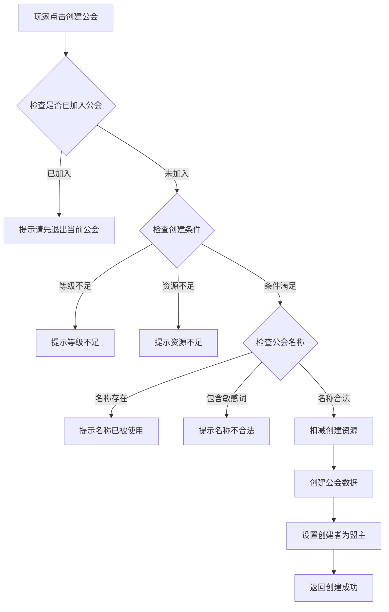
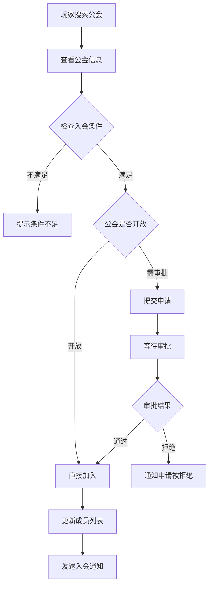
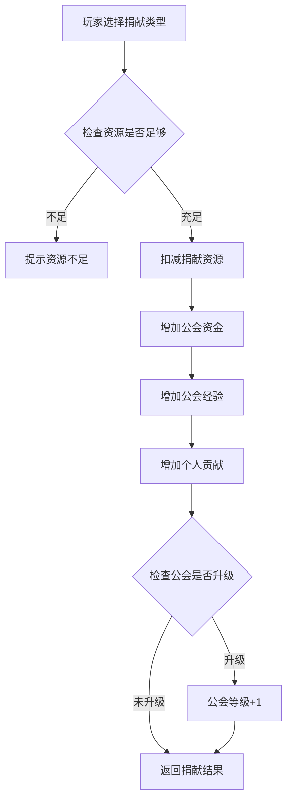
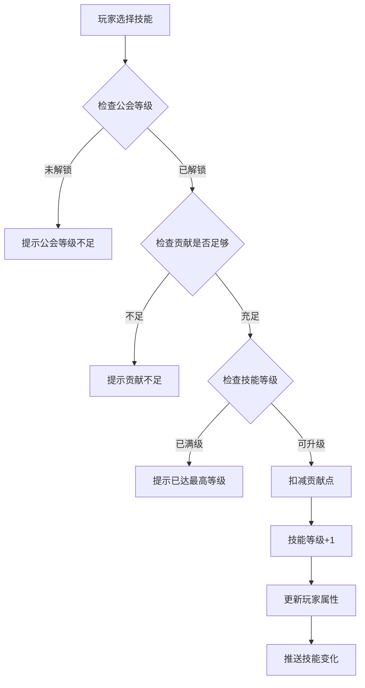

# 公会模块完整说明

## 一、模块概述

### 1.1 业务背景

公会模块是 K2C 游戏的核心社交系统。玩家可以创建或加入公会，与志同道合的玩家一起成长。公会提供了丰富的社交玩法和团队内容，包括公会建设、公会技能、公会副本等，是增强玩家粘性和游戏深度的重要系统。

### 1.2 目标用户

- **社交型玩家**：希望结交朋友，参与团队活动
- **竞争型玩家**：通过公会战、公会排名证明实力
- **领导者**：希望管理公会，带领成员发展

### 1.3 核心价值

1. **社交连接**：建立玩家之间的社交纽带
2. **团队协作**：通过公会活动促进玩家合作
3. **长期目标**：公会发展为玩家提供长期追求
4. **资源产出**：公会系统提供额外资源获取途径

---

## 二、功能清单

### 2.1 公会基础功能

| 功能名称 | 功能描述 | 用户价值 |
|---------|---------|---------|
| 公会创建 | 消耗资源创建公会 | 建立自己的团队 |
| 公会解散 | 解散公会 | 退出公会系统 |
| 公会搜索 | 搜索指定公会 | 找到目标公会 |
| 公会申请 | 申请加入公会 | 加入心仪公会 |
| 申请审批 | 审批入会申请 | 管理公会成员 |
| 退出公会 | 主动退出公会 | 离开当前公会 |
| 踢出成员 | 将成员踢出公会 | 管理不良成员 |

### 2.2 公会管理功能

| 功能名称 | 功能描述 | 用户价值 |
|---------|---------|---------|
| 职位管理 | 设置成员职位 | 分配权限和责任 |
| 公告管理 | 设置公会公告 | 传达公会信息 |
| 入会条件 | 设置入会门槛 | 控制成员质量 |
| 公会改名 | 修改公会名称 | 品牌重塑 |

### 2.3 公会建设功能

| 功能名称 | 功能描述 | 用户价值 |
|---------|---------|---------|
| 公会捐献 | 捐献资源获得贡献 | 增加公会资金 |
| 公会升级 | 提升公会等级 | 解锁更多功能 |
| 建筑建设 | 建设公会建筑 | 提供公会加成 |

### 2.4 公会技能功能

| 功能名称 | 功能描述 | 用户价值 |
|---------|---------|---------|
| 技能学习 | 学习公会技能 | 获得属性加成 |
| 技能升级 | 提升技能等级 | 增强加成效果 |
| 技能重置 | 重置技能点数 | 重新分配 |

### 2.5 公会副本功能

| 功能名称 | 功能描述 | 用户价值 |
|---------|---------|---------|
| 副本挑战 | 挑战公会副本 | 团队PVE内容 |
| 伤害排行 | 记录副本伤害 | 竞争排名 |
| 通关奖励 | 通关获得奖励 | 团队收益 |

### 2.6 公会社交功能

| 功能名称 | 功能描述 | 用户价值 |
|---------|---------|---------|
| 公会聊天 | 公会专属聊天频道 | 成员交流 |
| 公会邮件 | 公会群发邮件 | 通知公告 |
| 成员列表 | 查看成员信息 | 了解公会 |

---

## 三、业务流程详解

### 3.1 公会创建流程



**详细步骤说明**：

1. **前置检查**
   - 玩家未加入任何公会
   - 玩家等级达到创建要求（通常为15级）
   - 拥有足够的创建资源（钻石×200）

2. **名称验证**
   - 名称长度：2-10个字符
   - 不包含敏感词
   - 全服唯一

3. **创建处理**
   - 扣减创建资源
   - 创建公会基础数据
   - 设置创建者为盟主
   - 初始化公会资金和经验

### 3.2 公会申请流程



**详细步骤说明**：

1. **搜索公会**
   - 按公会名称搜索
   - 按公会排名浏览
   - 按推荐列表选择

2. **条件检查**
   - 玩家等级是否满足
   - 战力是否满足
   - 公会是否已满

3. **申请处理**
   - 公开公会：直接加入
   - 审批公会：提交申请等待审批
   - 关闭公会：无法申请

### 3.3 公会捐献流程



**捐献类型**：

| 捐献类型 | 消耗资源 | 获得贡献 | 公会资金 | 公会经验 |
|---------|---------|---------|---------|---------|
| 银两捐献 | 银两×10000 | 10 | 100 | 50 |
| 钻石捐献 | 钻石×50 | 50 | 500 | 200 |
| 高级捐献 | 钻石×200 | 200 | 2000 | 800 |

### 3.4 公会技能学习流程



---

## 四、关键规则

### 4.1 公会等级规则

1. **等级上限**：最高30级
2. **升级条件**：公会经验达到阈值
3. **等级效果**：
   - 增加成员上限
   - 解锁公会技能
   - 解锁公会建筑

### 4.2 公会职位规则

| 职位 | 权限 | 人数限制 |
|------|------|---------|
| 盟主 | 全部权限 | 1人 |
| 副盟主 | 审批、踢人、公告 | 2人 |
| 长老 | 审批、公告 | 5人 |
| 成员 | 基本权限 | 无限制 |

### 4.3 公会贡献规则

1. **贡献获取**：通过捐献、公会活动获得
2. **贡献用途**：学习公会技能、兑换商店物品
3. **贡献保留**：退出公会贡献清零，重新加入重新累计

### 4.4 公会成员规则

1. **成员上限**：基础30人，随公会等级增加
2. **入会冷却**：退出公会后需等待24小时才能加入新公会
3. **职位转移**：盟主可转让职位给其他成员

---

## 五、用户故事

### 5.1 公会创建者故事

> 作为一名有领导力的玩家，我创建了名为"王者之路"的公会。我设置了入会条件为战力5万以上，招募了一批活跃玩家。每天我组织公会成员进行公会副本挑战，公会等级不断提升。看到公会从创建时的几个人发展到满员，我感到非常有成就感。

### 5.2 公会成员故事

> 作为一名公会成员，我每天都会进行公会捐献，积累贡献点。我用贡献点学习了公会技能，战力得到了提升。公会战时，我和公会成员一起努力，获得了不错的排名。在公会聊天频道，我结交了很多朋友，大家互相帮助，一起成长。

### 5.3 公会管理者故事

> 作为公会副盟主，我负责管理公会日常事务。每天我都会审批新的入会申请，踢出不活跃的成员。公会公告由我来更新，通知成员即将到来的活动。公会战的策略由我和盟主一起制定，分工合作让公会运转得井井有条。

---

## 六、示例

### 6.1 公会创建示例

**输入数据**：
```
玩家ID：10001
玩家等级：20
公会名称：王者之路
公会图标：icon_001
创建消耗：钻石×200
```

**创建结果**：
```
公会ID：50001
公会名称：王者之路
公会等级：1
公会资金：10000（初始）
成员数量：1
盟主：玩家10001
创建时间：2026-04-06 10:00:00
```

### 6.2 公会捐献示例

**初始状态**：
```
公会资金：50,000
公会经验：8,000/10,000
个人贡献：500
```

**操作**：钻石捐献（消耗钻石×50）
```
公会资金：50,000 + 500 = 50,500
公会经验：8,000 + 200 = 8,200
个人贡献：500 + 50 = 550
```

### 6.3 公会技能学习示例

**技能配置**：
```
技能ID：GSK001
技能名称：攻击强化
技能效果：攻击力+2%/级
最高等级：20级
学习消耗：贡献×50×等级
公会解锁等级：5级
```

**学习过程**：
```
公会等级：8级（已解锁）
当前技能等级：3级
目标等级：4级
消耗贡献：50 × 4 = 200

学习后：攻击力+8%（4级）
```

---

*文档生成时间: 2026-04-06*
