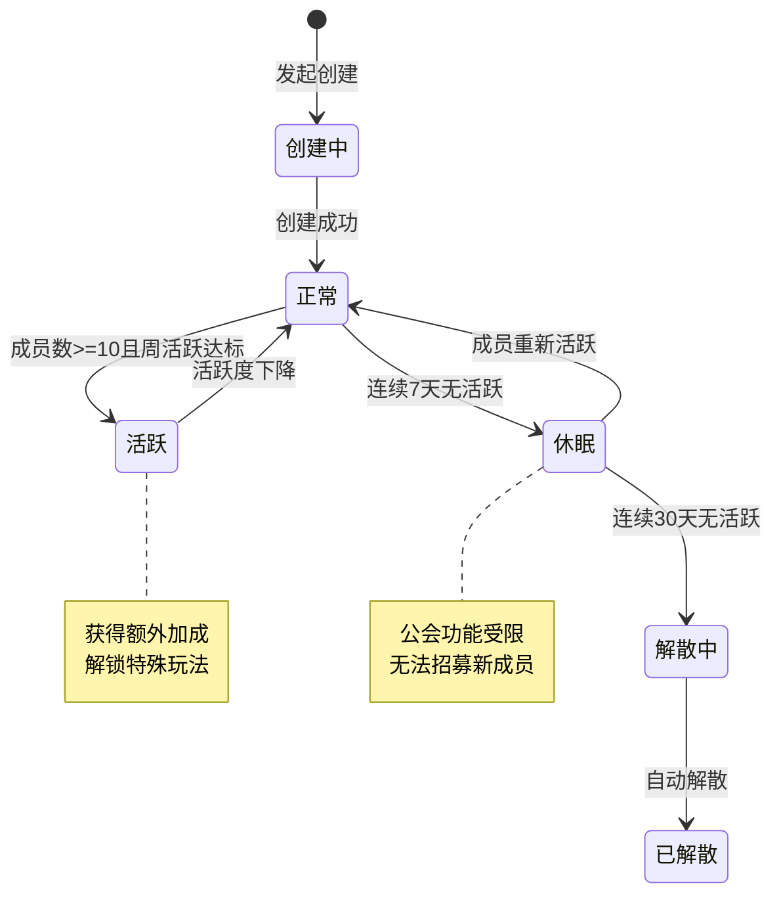
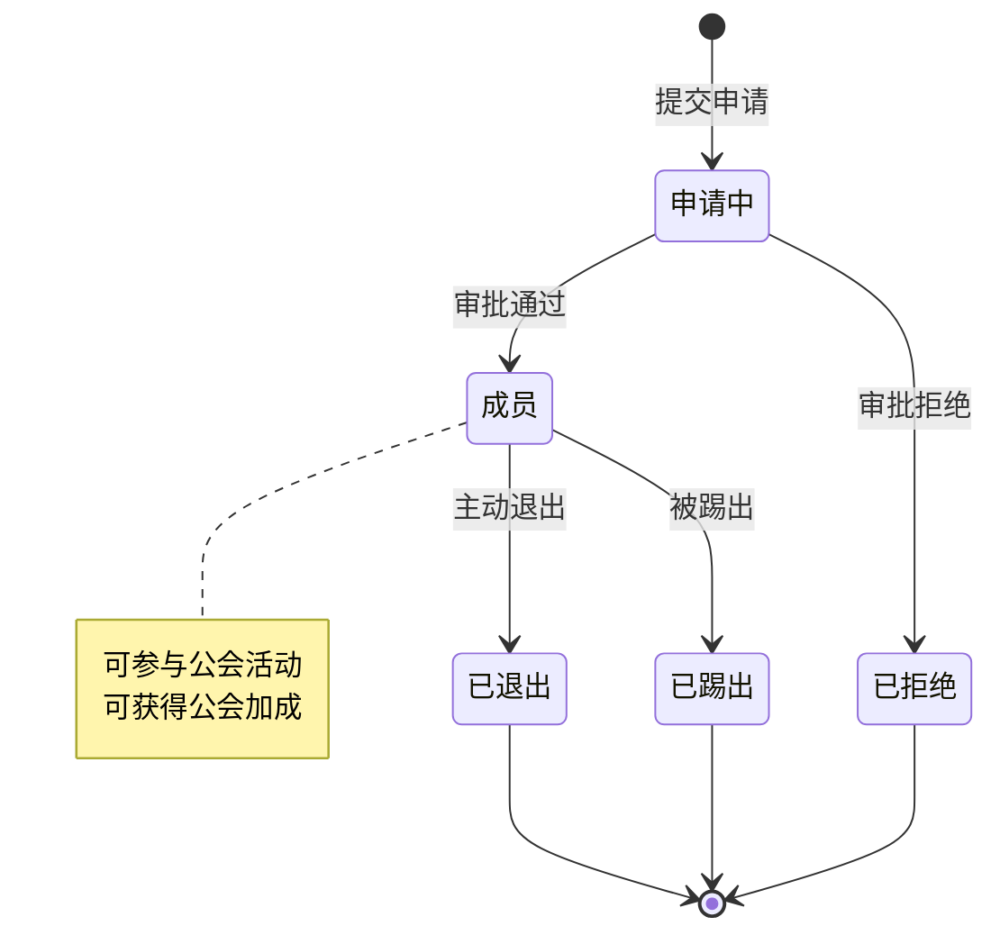
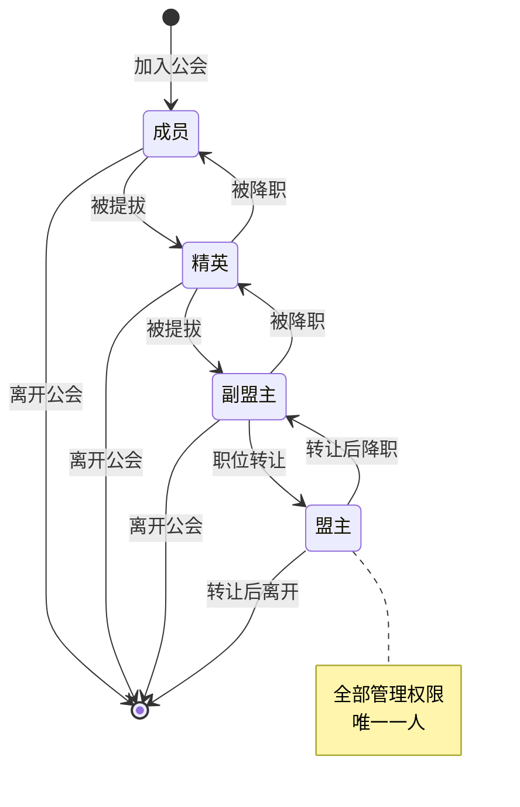
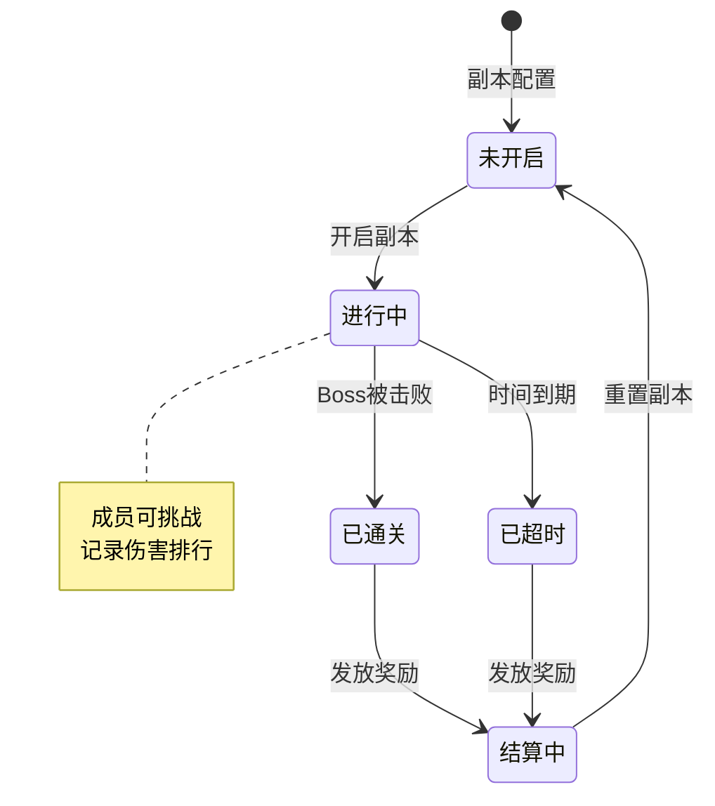
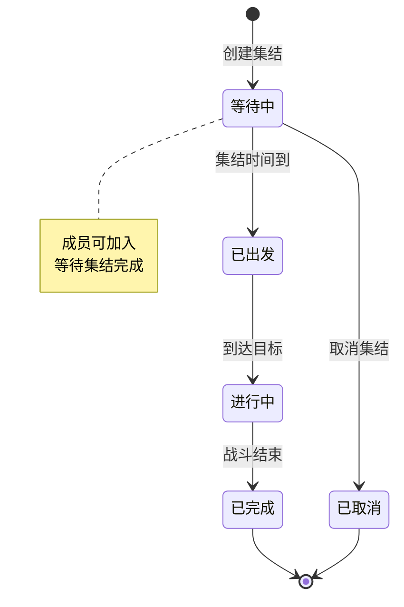
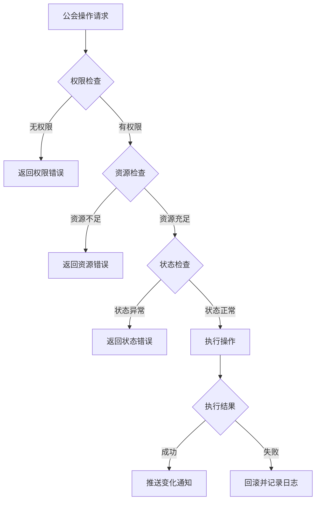

# 公会模块实现细节

## 一、计算公式

### 1.1 公会经验计算

```
公会升级所需经验 = base_exp × level ^ 1.5
```

**示例计算**：
```
base_exp = 1000
目标等级：10级
升级所需经验 = 1000 × 10^1.5 = 1000 × 31.62 ≈ 31,620
```

### 1.2 公会贡献计算

```
贡献值 = 捐献资源 × 转化比例
每日捐献上限 = 基础上限 × (1 + VIP加成)
```

**转化比例**：
```
银两捐献：1银两 = 0.001贡献
钻石捐献：1钻石 = 1贡献
```

### 1.3 公会技能效果计算

```
技能效果 = 基础效果 × 技能等级
实际效果 = 技能效果 × (1 + 公会建筑加成)
```

**示例计算**：
```
技能：攻击强化
基础效果：2%/级
当前等级：5级
公会建筑加成：10%

技能效果 = 2% × 5 = 10%
实际效果 = 10% × 1.1 = 11%攻击力加成
```

### 1.4 公会副本伤害计算

```
个人贡献伤害 = 玩家对Boss造成的总伤害
伤害排名 = 按贡献伤害降序排列
伤害奖励 = 基础奖励 × (1 + 排名系数)
```

**排名系数**：
```
第1名：+100%
第2名：+80%
第3名：+60%
第4-10名：+40%
第11-20名：+20%
第21名以后：+10%
```

### 1.5 委托奖励计算

```java
// 根据公会总赚速计算获得的银两
long gainCurrency = (long) Math.ceil(getTotalEarnings() * oriRef.gain_currency_per / 10000d);

// 暴击判断
int critMul = 1;
if (!RefGeneral.Ref().guild_entrust_crit_mul_weight.isEmpty())
{
    critMul = RefGeneral.Ref().guild_entrust_crit_mul_weight.random();
    gainCurrency *= critMul;
}
```

---

## 二、状态机定义

### 2.1 公会状态机



### 2.2 公会成员状态机



### 2.3 公会职位状态机



### 2.4 公会副本状态机



### 2.5 公会集结状态机



---

## 三、数据约束

### 3.1 公会基础数据约束

| 字段名 | 数据类型 | 取值范围 | 必填 | 唯一性 | 说明 |
|--------|----------|----------|------|--------|------|
| guildId | long | > 0 | 是 | 是 | 公会唯一ID |
| name | string | 2-10字符 | 是 | 是 | 公会名称 |
| simpleName | string | 2-4字符 | 是 | 是 | 公会简称 |
| level | int | 1-30 | 是 | 否 | 公会等级 |
| exp | long | >= 0 | 是 | 否 | 公会经验 |
| wealth | long | >= 0 | 是 | 否 | 公会资金 |
| leaderId | long | > 0 | 是 | 否 | 盟主玩家ID |
| memberCount | int | 0-100 | 是 | 否 | 成员数量 |
| createTime | datetime | - | 是 | 否 | 创建时间 |

### 3.2 公会成员数据约束

| 字段名 | 数据类型 | 取值范围 | 必填 | 说明 |
|--------|----------|----------|------|------|
| guildId | long | > 0 | 是 | 所属公会ID |
| playerId | long | > 0 | 是 | 玩家ID |
| position | int | 1-4 | 是 | 职位：1成员,2精英,3副盟主,4盟主 |
| contribution | long | >= 0 | 是 | 累计贡献 |
| sevenDaysContribution | int | >= 0 | 是 | 7日贡献 |
| joinTime | datetime | - | 是 | 加入时间 |
| lastActiveTime | datetime | - | 是 | 最后活跃时间 |

### 3.3 公会申请数据约束

| 字段名 | 数据类型 | 取值范围 | 必填 | 说明 |
|--------|----------|----------|------|------|
| guildId | long | > 0 | 是 | 申请的公会ID |
| playerId | long | > 0 | 是 | 申请人ID |
| status | int | 0-2 | 是 | 状态：0待审批,1通过,2拒绝 |
| applyTime | datetime | - | 是 | 申请时间 |
| processTime | datetime | - | 否 | 处理时间 |

---

## 四、错误处理策略

### 4.1 公会模块错误码

| 错误码 | 错误信息 | 处理策略 | 用户提示 |
|--------|----------|----------|----------|
| 32001 | 公会不存在 | 检查公会ID有效性 | "公会不存在" |
| 32002 | 已加入公会 | 需先退出当前公会 | "您已加入公会，请先退出" |
| 32003 | 公会名称已存在 | 提示更换名称 | "公会名称已被使用" |
| 32004 | 创建条件不满足 | 提示具体条件 | "创建条件不足：等级/资源" |
| 32005 | 公会已满员 | 无法加入 | "公会成员已满" |
| 32006 | 入会条件不满足 | 提示具体条件 | "入会条件不满足" |
| 32007 | 公会关闭招募 | 无法申请 | "公会暂未开放招募" |
| 32008 | 无权限操作 | 提示所需权限 | "您没有权限执行此操作" |
| 32009 | 公会资金不足 | 提示资金需求 | "公会资金不足" |
| 32010 | 个人贡献不足 | 提示贡献需求 | "个人贡献不足" |
| 32011 | 公会技能未解锁 | 提示解锁条件 | "公会等级不足，技能未解锁" |
| 32012 | 技能已达最高等级 | 无需处理 | "技能已达最高等级" |
| 32013 | 今日捐献已达上限 | 提示明日重置 | "今日捐献次数已用完" |
| 32014 | 退出冷却中 | 提示剩余时间 | "请等待X小时后再加入公会" |
| 32015 | 成员不存在 | 检查成员ID | "成员不存在" |
| 32016 | 盟主不存在 | 检查公会状态 | "盟主不存在" |
| 32017 | 成员不是副盟主 | 检查职位要求 | "只能转让给副盟主" |
| 32018 | 盟主转让CD中 | 提示剩余时间 | "转让冷却中，请等待" |
| 32019 | 公会已解散 | 刷新列表 | "公会已解散" |
| 32020 | 还有其他成员 | 需先移除成员 | "请先移除所有成员" |

### 4.2 公会操作权限表

| 操作 | 盟主 | 副盟主 | 精英 | 成员 |
|------|------|--------|------|------|
| 解散公会 | OK | - | - | - |
| 转让盟主 | OK | - | - | - |
| 任命副盟主 | OK | - | - | - |
| 任命精英 | OK | OK | - | - |
| 踢出成员 | OK | OK | - | - |
| 审批申请 | OK | OK | OK | - |
| 修改公告 | OK | OK | OK | - |
| 修改入会条件 | OK | OK | - | - |
| 开启公会副本 | OK | OK | OK | - |
| 公会捐献 | OK | OK | OK | OK |
| 学习公会技能 | OK | OK | OK | OK |
| 挑战公会副本 | OK | OK | OK | OK |
| 处理委托 | OK | OK | OK | OK |
| 派遣大臣 | OK | OK | OK | OK |

### 4.3 异常处理流程



---

## 五、关键代码示例

### 5.1 公会创建 (Java)

```java
public ResultOne<GuildInfo> createGuild(long _flagId, String _name, String _simpleName,
    String _declaration, boolean _isFreeJoin)
{
    // 随机委托事件
    GuildEntrustWeightList entrustWeightList = new GuildEntrustWeightList();
    RefGuildEntrustQuality refGuildEntrustQuality = entrustWeightList.randomRef();
    if (refGuildEntrustQuality == null)
        USLog.error(_m_server, "GuildMgr createGuild failed, random refGuildEntrustQuality failed.");

    // 构造数据对象
    GuildBO guildBO = new GuildBO();
    guildBO.setGuildId(_m_server.getBM(), UsID.makeGuildId(_m_server));
    guildBO.setName(_m_server.getBM(), _name);
    guildBO.setSimpleName(_m_server.getBM(), _simpleName);
    guildBO.setFlagId(_m_server.getBM(), _flagId);
    guildBO.setDeclaration(_m_server.getBM(), _declaration);
    guildBO.setJoinType(_m_server.getBM(),
        _isFreeJoin ? EGuildJoinType.FREE_JOIN.ordinal() : EGuildJoinType.APPROVAL_JOIN.ordinal());
    guildBO.setLevel(_m_server.getBM(), 1);
    guildBO.setActivePointTargetLvl(_m_server.getBM(), 1);

    // 委托相关信息
    if (refGuildEntrustQuality != null)
    {
        guildBO.setEntrustRefId(_m_server.getBM(), refGuildEntrustQuality.Id());
        Long eventId = CommonFunc.randSelect(refGuildEntrustQuality.guild_random_requests_id_list);
        guildBO.setEntrustEventId(_m_server.getBM(), eventId == null ? 0 : eventId);
        guildBO.setEntrustWeightBaseList(_m_server.getBM(), entrustWeightList.toString());
    }
    guildBO.insert(_m_server.getBM());

    // 构造工会信息
    GuildInfo guildInfo = new GuildInfo(guildBO, this);
    _onGuildAdd(guildInfo);

    return ResultOne.succ(guildInfo);
}
```

### 5.2 公会建设 (Java)

```java
public Result construct(GuildOp_PlayerCname _addInfo, GuildMemberInfo _memberInfo,
    long _refId, NPPlayerContext _context)
{
    // 查找配置
    RefGuildConstruct refGuildConstruct = RefGuildConstruct.getMgr().get(_refId);
    if (refGuildConstruct == null)
    {
        USLog.error(_m_mgr.getServer(), "GuildInfo.construct - refGuildConstruct not found, guildId={} refId={}",
            _m_bo.getGuildId(), _refId);
        return CommErr.REF_NOT_FOUND;
    }

    // 查找联盟等级配置
    RefGuildLevel levelRef = getLevelRef();
    if (levelRef == null)
    {
        USLog.error(_m_mgr.getServer(), "GuildInfo.construct - levelRef not found, guildId={} level={}",
            _m_bo.getGuildId(), _m_bo.getLevel());
        return CommErr.REF_NOT_FOUND;
    }

    // 获取个人贡献
    _memberInfo.gainDevote(refGuildConstruct.add_devote, _context);

    // 记录建造信息
    onConstruct(_memberInfo.getCid(), refGuildConstruct, levelRef, _context);

    GuildLogFunc.sendGuildConstructionLog(_addInfo.getCname(), _refId, refGuildConstruct.add_guild_exp,
        refGuildConstruct.add_guild_wealth, refGuildConstruct.add_personal_guild_coin, this);

    return Result.SUCC;
}
```

### 5.3 公会经验获取 (Java)

```java
public void gainExp(long _cid, long _guildExp, NPPlayerContext _context)
{
    if (_guildExp <= 0)
        return;

    int oriLevel = _m_bo.getLevel();

    _lock();
    try
    {
        long newExp = _m_bo.getExp() + _guildExp;

        // 检查升级
        if (_m_guildLevelRef != null)
        {
            RefGuildLevel refCurLevel = _m_guildLevelRef;
            while (true)
            {
                // 查找下一等级配置
                RefGuildLevel refNextLevel = RefGuildLevel.getMgr().get(refCurLevel.level + 1);
                if (refNextLevel == null)
                    break;

                // 如果经验不足升级到下一等级，跳出循环
                int needExp = refCurLevel.need_exp;
                if (needExp <= 0 || newExp < needExp)
                    break;

                // 消耗升级经验，升级到下一等级
                newExp -= needExp;
                refCurLevel = refNextLevel;
            }

            // 更新等级配置缓存
            if (_m_guildLevelRef != refCurLevel)
            {
                _m_bo.setLevel(_m_mgr.getServer().getBM(), refCurLevel.level);
                _m_guildLevelRef = refCurLevel;

                // 广播等级变更
                GuildLevelChg_2C rpc = new GuildLevelChg_2C();
                rpc.req().setGuildId(getGuildId());
                rpc.req().setGuildLvl(refCurLevel.level);
                getMemberMgr().broadcastRPC(rpc);
            }
        }

        // 保存经验
        _m_bo.setExp(_m_mgr.getServer().getBM(), newExp);
        _m_bo.saveAllMarked(_m_mgr.getServer().getBM());

        _context.getCollector().addItem(RefGeneral.Ref().guild_exp_common_item, _guildExp);
    } finally
    {
        _unlock();
    }

    // 推送变更
    getMemberMgr().broadcastMsg(new GS2GC_032_050_OnGuildShowInfoChg(makeShowInfo()));

    // 如果等级发生提升
    int newLevel = _m_bo.getLevel();
    if (oriLevel != newLevel)
    {
        // 发送升级邮件
        Mail_Data mailData = new Mail_Data();
        mailData.setMailRefId(RefGeneral.Ref().guild_upgrade_mail_id);
        mailData.getContentReplace().add("[" + getSimpleName() + "]");
        mailData.getContentReplace().add(getName());
        mailData.getContentReplace().add(String.valueOf(newLevel));

        NPPlayerContext context = NPPlayerContext.createNew(ENPGameEvent.GUILD_UPGRADE);
        List<Long> memberCidList = getMemberMgr().getMemberCidList(null);
        for (Long memberCid : memberCidList)
        {
            MailSystem.addMail(_m_mgr.getServer(), memberCid, mailData, context);
        }

        GuildLogFunc.sendGuildUpgradeLog(newLevel, this);
    }
}
```

### 5.4 公会转让 (Java)

```java
public Result transLeader(long _newLeaderCid, NPPlayerContext _context)
{
    long nowTimeMS = CommonFunc.getNowTimeMS();
    // 判断上次转让的时间是否超过要求时间
    long lastProactiveTransLeaderTimeMs = _m_guildInfo.getLastProactiveTransLeaderTimeMs();
    if (nowTimeMS - lastProactiveTransLeaderTimeMs < (long) RefGeneral.Ref().guild_leader_proactive_transfer_cd_hours * 3600 * 1000)
        return GuildErr.GUILD_LEADER_PROACTIVE_TRANSFER_CD;

    GuildMemberInfo oriLeader;
    _lock();
    try
    {
        // 查询新盟主信息
        GuildMemberInfo newLeaderInfo = lookup(_newLeaderCid);
        if (newLeaderInfo == null)
            return GuildErr.MEMBER_NOT_FOUND;

        // 判断是否已经是副盟主
        if (newLeaderInfo.getPosition() != EGuildPositionType.DEPUTY_LEADER)
            return GuildErr.MEMBER_NOT_DEPUTY_LEADER;

        // 判断是否有盟主
        if (_m_leader == null)
            return GuildErr.LEADER_NOT_FOUND;

        // 查询配置
        RefGuildPosition refPosition = RefGuildPosition.getMgr().get(EGuildPositionType.LEADER.ordinal());
        if (refPosition == null)
            return CommErr.REF_NOT_FOUND;

        // 判断贡献是否足够
        if (newLeaderInfo.getTotalContribution() < refPosition.trans_need_historical_contributions)
            return GuildErr.GUILD_CONTRIBUTION_NOT_ENOUGH;

        // 查询配置
        RefGuildPosition refMemberPosition = RefGuildPosition.getMgr().get(newLeaderInfo.getPosition().ordinal());
        if (refMemberPosition == null)
            return CommErr.REF_NOT_FOUND;

        // 把新盟主修改成盟主
        _chgPosition(newLeaderInfo, refPosition, _m_leader.getCid(), _context);
        // 原盟主职位修改
        _chgPosition(_m_leader, refMemberPosition, _m_leader.getCid(), _context);

        oriLeader = _m_leader;
        _m_leader = newLeaderInfo;

        // 盟主变动所以需要把联盟信息也推一遍
        broadcastMsg(new GS2GC_032_050_OnGuildShowInfoChg(_m_guildInfo.makeShowInfo()));
    } finally
    {
        _unlock();
    }

    GuildLogFunc.sendLeaderTransferLog(oriLeader.getCid(), _newLeaderCid, getGuildInfo());

    // 记录转让时间
    _m_guildInfo.setLastProactiveTransLeaderTimeMs(nowTimeMS);

    return Result.SUCC;
}
```

### 5.5 七日贡献计算 (Java)

```java
public int getPastDaysContribute()
{
    _lock();
    try
    {
        long todayZeroClockMS = CommonFunc.getTodayZeroClockMS(0);
        if (_m_lastCalTimestamp >= todayZeroClockMS)
            return _m_sevenDaysContribute;

        // 按照时间间隔，计算新的七天贡献
        int interval = (int) Math.min(((CommonFunc.getNowTimeMS() - _m_bo.getLastResetDataTimestamp()) / 86400000L),
            SEVEN_DAYS_CONTRIBUTE_RECORD_SIZE);
        int newSevenDaysContributeValue = 0;
        for (int i = interval; i < SEVEN_DAYS_CONTRIBUTE_RECORD_SIZE; i++)
        {
            newSevenDaysContributeValue += _m_sevenDaysContributeRecord[i];
        }

        _m_sevenDaysContribute = newSevenDaysContributeValue;
        _m_lastCalTimestamp = todayZeroClockMS;

        return _m_sevenDaysContribute;
    } finally
    {
        _unlock();
    }
}

public void gainDevote(int _addDevote, NPPlayerContext _context)
{
    if (_addDevote <= 0)
        return;

    _lock();
    try
    {
        long todayZeroClockMS = CommonFunc.getTodayZeroClockMS(0);
        // 检查是否重置数据
        _checkResetData(todayZeroClockMS);

        // 增加贡献
        _m_sevenDaysContributeRecord[SEVEN_DAYS_CONTRIBUTE_RECORD_SIZE - 1] += _addDevote;

        // 计算新的七天贡献
        int newSevenDaysContributeValue = 0;
        Common_IntList sevenDaysContributeRecord = new Common_IntList();
        for (int i : _m_sevenDaysContributeRecord)
        {
            sevenDaysContributeRecord.getValueList().add(i);
            newSevenDaysContributeValue += i;
        }

        _m_sevenDaysContribute = newSevenDaysContributeValue;
        _m_lastCalTimestamp = todayZeroClockMS;

        BM bmObj = _m_memberMgr.getGuildInfo().getGuildMgr().getServer().getBM();
        _m_bo.setTotalContribute(bmObj, _m_bo.getTotalContribute() + _addDevote);
        _m_bo.setPastDayContribute(bmObj, sevenDaysContributeRecord.makePackage().array());
        _m_bo.saveAllMarked(bmObj);
    } finally
    {
        _unlock();
    }

    _context.getCollector().addItem(RefGeneral.Ref().personal_contribution_common_item, _addDevote);

    getMemberMgr().getGuildInfo().getGuildMgr().getServer().sendMsgToGC(
        getCid(), new GS2GC_032_056_OnSelfGuildContributeChg(makeContributeProto()));
}
```

---

## 六、性能优化建议

### 6.1 缓存策略

1. **公会信息缓存**：公会基础信息全量缓存到GuildMgr
2. **成员列表缓存**：按公会ID缓存成员列表到GuildMemberMgr
3. **贡献排行缓存**：7日贡献排行实时计算
4. **名称检查缓存**：GuildNameChecker缓存所有公会名称

```java
// 公会名称检查器缓存
public class GuildNameChecker
{
    private Set<String> _m_nameSet = new HashSet<>();
    private Set<String> _m_simpleNameSet = new HashSet<>();

    public boolean nameExists(String _name) {
        return _m_nameSet.contains(_name);
    }

    public boolean simpleNameExists(String _simpleName) {
        return _m_simpleNameSet.contains(_simpleName);
    }
}
```

### 6.2 数据分片

1. **公会ID分片**：公会相关数据按公会ID分库分表
2. **玩家ID索引**：通过玩家ID快速查找所属公会

### 6.3 异步处理

1. **公会升级检查**：捐献后异步检查升级
2. **奖励发放**：通关奖励异步批量发放
3. **排行榜更新**：伤害排行异步更新
4. **日志写入**：公会日志异步写入数据库

```java
// 异步任务处理示例
ALSynTaskManager.getInstance().regTask(() ->
{
    // 发送RPC处理
    memberRmv(_cid, _isKick);

    // 移除玩家排行榜国力
    RankFixedInfo rankFixedInfo = _m_mgr.getServer().getRankFixedMgr().lookupRank(RefGeneral.Ref().guild_rank_fixed_id);
    if (rankFixedInfo != null)
        rankFixedInfo.removeSubObj(getGuildId(), _cid);
});
```

### 6.4 锁优化

1. **细粒度锁**：公会列表锁和成员变动锁分开
2. **锁降级**：成员信息锁降低优先级避免冲突
3. **避免死锁**：统一锁获取顺序

```java
// 成员信息锁降低优先级
_m_mutex = new MutexAtom();
_m_mutex.reducePriority(10);
```

### 6.5 批量推送

```java
// 广播消息给所有成员
public void broadcastMsg(_IALProtocolStructure _proto, Predicate<GuildMemberInfo> _predicate)
{
    // 获取成员列表
    List<Long> memberCidList = getMemberCidList(_predicate);
    if (memberCidList.isEmpty())
        return;

    ALSynTaskManager.getInstance().regTask(() ->
    {
        for (Long cid : memberCidList)
        {
            getGuildInfo().getGuildMgr().getServer().sendMsgToGC(cid, _proto);
        }
    });
}
```

---

## 七、监控与日志

### 7.1 关键指标监控

| 指标 | 说明 | 告警阈值 |
|------|------|---------|
| 公会数量 | 服务器公会总数 | > 10000 |
| 平均成员数 | 平均每个公会成员数 | < 5 |
| 操作延迟 | 公会操作响应时间 | > 500ms |
| 公会聊天频率 | 每分钟聊天消息数 | > 1000 |

### 7.2 日志记录

```java
// 公会成员变更日志
LogGuildMemberChgBO logBo = new LogGuildMemberChgBO();
logBo.setGuildId(bmObj, _guildInfo.getGuildId());
logBo.setType(bmObj, logType); // 1=加入, 2=创建加入, 3=主动退出, 4=解散退出, 5=被踢
logBo.setCid(bmObj, _cid);
CommLogDB.log(bmObj, logBo, null);

// 公会财富变更日志
LogGuildWealthChgBO logBo = new LogGuildWealthChgBO();
logBo.setGuildId(bmObj, getGuildId());
logBo.setEvent(bmObj, _context.getContextId());
logBo.setOldNumber(bmObj, oriValue);
logBo.setChgValue(bmObj, _guildWealth);
logBo.setFinalNumber(bmObj, newValue);
CommLogDB.log(bmObj, logBo, _context);
```

---

*文档生成时间: 2026-04-11*
