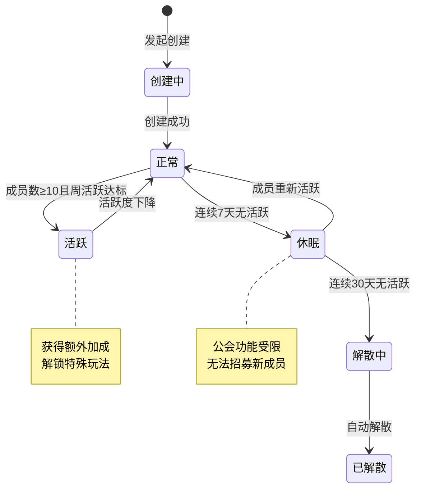
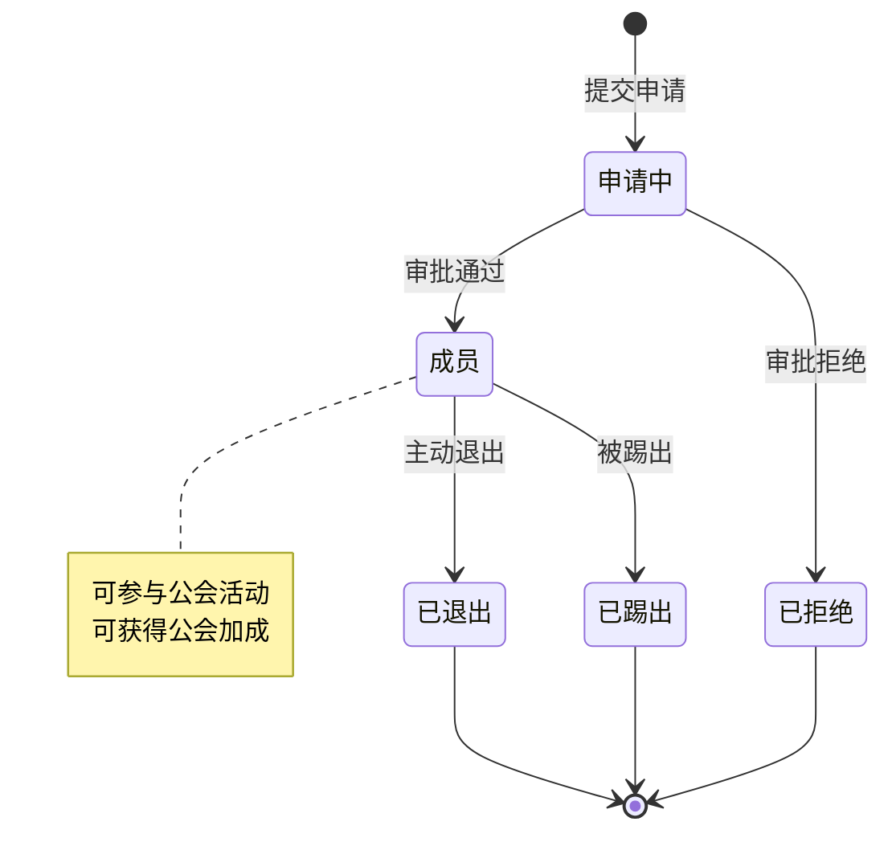
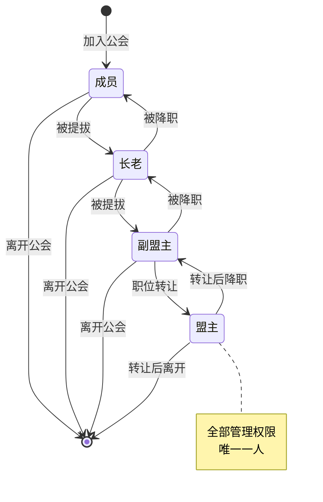
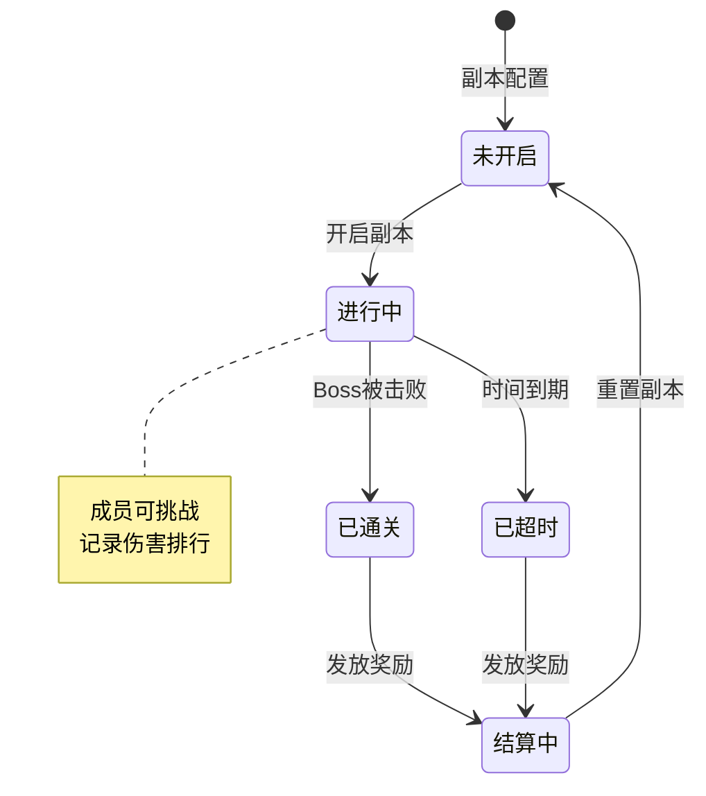
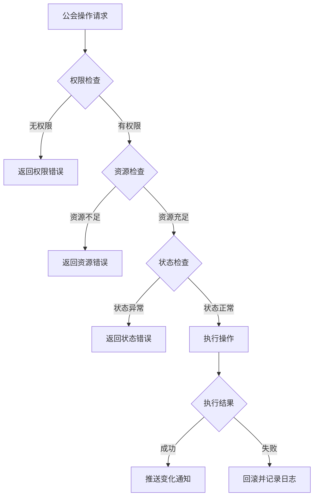

# 公会模块实现细节

## 一、计算公式

### 1.1 公会经验计算

```
公会升级所需经验 = base_exp × level ^ 1.5
```

**示例计算**：
```
base_exp = 1000
目标等级：10级
升级所需经验 = 1000 × 10^1.5 = 1000 × 31.62 ≈ 31,620
```

### 1.2 公会贡献计算

```
贡献值 = 捐献资源 × 转化比例
每日捐献上限 = 基础上限 × (1 + VIP加成)
```

**转化比例**：
```
银两捐献：1银两 = 0.001贡献
钻石捐献：1钻石 = 1贡献
```

### 1.3 公会技能效果计算

```
技能效果 = 基础效果 × 技能等级
实际效果 = 技能效果 × (1 + 公会建筑加成)
```

**示例计算**：
```
技能：攻击强化
基础效果：2%/级
当前等级：5级
公会建筑加成：10%

技能效果 = 2% × 5 = 10%
实际效果 = 10% × 1.1 = 11%攻击力加成
```

### 1.4 公会副本伤害计算

```
个人贡献伤害 = 玩家对Boss造成的总伤害
伤害排名 = 按贡献伤害降序排列
伤害奖励 = 基础奖励 × (1 + 排名系数)
```

**排名系数**：
```
第1名：+100%
第2名：+80%
第3名：+60%
第4-10名：+40%
第11-20名：+20%
第21名以后：+10%
```

---

## 二、状态机定义

### 2.1 公会状态机



### 2.2 公会成员状态机



### 2.3 公会职位状态机



### 2.4 公会副本状态机



---

## 三、数据约束

### 3.1 公会基础数据约束

| 字段名 | 数据类型 | 取值范围 | 必填 | 唯一性 | 说明 |
|--------|----------|----------|------|--------|------|
| guildId | long | > 0 | 是 | 是 | 公会唯一ID |
| name | string | 2-10字符 | 是 | 是 | 公会名称 |
| level | int | 1-30 | 是 | 否 | 公会等级 |
| exp | long | >= 0 | 是 | 否 | 公会经验 |
| fund | long | >= 0 | 是 | 否 | 公会资金 |
| leaderId | long | > 0 | 是 | 否 | 盟主玩家ID |
| memberCount | int | 0-100 | 是 | 否 | 成员数量 |
| createTime | datetime | - | 是 | 否 | 创建时间 |

### 3.2 公会成员数据约束

| 字段名 | 数据类型 | 取值范围 | 必填 | 说明 |
|--------|----------|----------|------|------|
| guildId | long | > 0 | 是 | 所属公会ID |
| playerId | long | > 0 | 是 | 玩家ID |
| position | int | 1-4 | 是 | 职位：1盟主,2副盟主,3长老,4成员 |
| contribution | long | >= 0 | 是 | 累计贡献 |
| weeklyContribution | long | >= 0 | 是 | 本周贡献 |
| joinTime | datetime | - | 是 | 加入时间 |
| lastActiveTime | datetime | - | 是 | 最后活跃时间 |

### 3.3 公会技能数据约束

| 字段名 | 数据类型 | 取值范围 | 必填 | 说明 |
|--------|----------|----------|------|------|
| skillId | long | > 0 | 是 | 技能配置ID |
| level | int | 0-20 | 是 | 技能等级（0表示未学习） |
| unlockGuildLevel | int | 1-30 | 是 | 解锁所需公会等级 |

### 3.4 公会申请数据约束

| 字段名 | 数据类型 | 取值范围 | 必填 | 说明 |
|--------|----------|----------|------|------|
| guildId | long | > 0 | 是 | 申请的公会ID |
| playerId | long | > 0 | 是 | 申请人ID |
| status | int | 0-2 | 是 | 状态：0待审批,1通过,2拒绝 |
| applyTime | datetime | - | 是 | 申请时间 |
| processTime | datetime | - | 否 | 处理时间 |

---

## 四、错误处理策略

### 4.1 公会模块错误码

| 错误码 | 错误信息 | 处理策略 | 用户提示 |
|--------|----------|----------|----------|
| 32001 | 公会不存在 | 检查公会ID有效性 | "公会不存在" |
| 32002 | 已加入公会 | 需先退出当前公会 | "您已加入公会，请先退出" |
| 32003 | 公会名称已存在 | 提示更换名称 | "公会名称已被使用" |
| 32004 | 创建条件不满足 | 提示具体条件 | "创建条件不足：等级/资源" |
| 32005 | 公会已满员 | 无法加入 | "公会成员已满" |
| 32006 | 入会条件不满足 | 提示具体条件 | "入会条件不满足" |
| 32007 | 公会关闭招募 | 无法申请 | "公会暂未开放招募" |
| 32008 | 无权限操作 | 提示所需权限 | "您没有权限执行此操作" |
| 32009 | 公会资金不足 | 提示资金需求 | "公会资金不足" |
| 32010 | 个人贡献不足 | 提示贡献需求 | "个人贡献不足" |
| 32011 | 公会技能未解锁 | 提示解锁条件 | "公会等级不足，技能未解锁" |
| 32012 | 技能已达最高等级 | 无需处理 | "技能已达最高等级" |
| 32013 | 今日捐献已达上限 | 提示明日重置 | "今日捐献次数已用完" |
| 32014 | 退出冷却中 | 提示剩余时间 | "请等待X小时后再加入公会" |

### 4.2 公会操作权限表

| 操作 | 盟主 | 副盟主 | 长老 | 成员 |
|------|------|--------|------|------|
| 解散公会 | ✓ | ✗ | ✗ | ✗ |
| 转让盟主 | ✓ | ✗ | ✗ | ✗ |
| 任命副盟主 | ✓ | ✗ | ✗ | ✗ |
| 任命长老 | ✓ | ✓ | ✗ | ✗ |
| 踢出成员 | ✓ | ✓ | ✗ | ✗ |
| 审批申请 | ✓ | ✓ | ✓ | ✗ |
| 修改公告 | ✓ | ✓ | ✓ | ✗ |
| 修改入会条件 | ✓ | ✓ | ✗ | ✗ |
| 开启公会副本 | ✓ | ✓ | ✓ | ✗ |
| 公会捐献 | ✓ | ✓ | ✓ | ✓ |
| 学习公会技能 | ✓ | ✓ | ✓ | ✓ |
| 挑战公会副本 | ✓ | ✓ | ✓ | ✓ |

### 4.3 异常处理流程



---

## 五、关键代码示例

### 5.1 公会创建伪代码

```csharp
public Result CreateGuild(long playerId, string name, int iconId)
{
    // 1. 检查玩家是否已加入公会
    if (guildService.HasGuild(playerId))
        return Result.Error(32002, "已加入公会");

    // 2. 检查创建条件
    PlayerInfo player = playerService.GetPlayer(playerId);
    if (player.level < 15)
        return Result.Error(32004, "等级不足");

    CreateCostConfig cost = GetCreateCost();
    if (player.GetResource(ResourceType.Diamond) < cost.diamond)
        return Result.Error(32004, "钻石不足");

    // 3. 检查名称
    if (name.Length < 2 || name.Length > 10)
        return Result.Error(32003, "名称长度不合法");

    if (sensitiveWordService.Contains(name))
        return Result.Error(32003, "名称包含敏感词");

    if (guildService.NameExists(name))
        return Result.Error(32003, "名称已存在");

    // 4. 扣减资源
    playerService.CostResource(playerId, ResourceType.Diamond, cost.diamond);

    // 5. 创建公会
    GuildInfo guild = new GuildInfo {
        guildId = idGenerator.NextId(),
        name = name,
        iconId = iconId,
        level = 1,
        exp = 0,
        fund = cost.initialFund,
        leaderId = playerId,
        memberCount = 1,
        createTime = DateTime.Now,
        notice = "欢迎加入公会！"
    };
    guildService.CreateGuild(guild);

    // 6. 添加盟主成员
    GuildMemberInfo member = new GuildMemberInfo {
        guildId = guild.guildId,
        playerId = playerId,
        position = GuildPosition.Leader,
        contribution = 0,
        joinTime = DateTime.Now
    };
    guildService.AddMember(guild.guildId, member);

    // 7. 更新玩家公会ID
    playerService.SetGuildId(playerId, guild.guildId);

    // 8. 推送创建成功
    PushGuildCreate(playerId, guild);

    return Result.Success(guild);
}
```

### 5.2 公会捐献伪代码

```csharp
public Result Donate(long playerId, DonateType type)
{
    // 1. 获取公会信息
    GuildMemberInfo member = guildService.GetMember(playerId);
    if (member == null)
        return Result.Error(32002, "未加入公会");

    GuildInfo guild = guildService.GetGuild(member.guildId);

    // 2. 检查今日捐献次数
    DonateRecord record = guildService.GetTodayDonate(playerId);
    DonateConfig config = GetDonateConfig(type);

    if (record.dailyCount >= config.dailyLimit)
        return Result.Error(32013, "今日捐献已达上限");

    // 3. 检查并扣减资源
    PlayerInfo player = playerService.GetPlayer(playerId);
    if (!playerService.HasResource(playerId, config.resourceType, config.cost))
        return Result.Error(32004, "资源不足");

    playerService.CostResource(playerId, config.resourceType, config.cost, "公会捐献");

    // 4. 增加公会资金和经验
    guild.fund += config.guildFund;
    guild.exp += config.guildExp;
    guildService.UpdateGuild(guild);

    // 5. 增加个人贡献
    member.contribution += config.contribution;
    member.weeklyContribution += config.contribution;
    guildService.UpdateMember(member);

    // 6. 更新捐献记录
    record.dailyCount++;
    guildService.UpdateDonateRecord(record);

    // 7. 检查公会升级
    CheckGuildLevelUp(guild);

    // 8. 推送变化
    PushDonateResult(playerId, config.contribution);
    PushGuildInfo(guild.guildId);

    return Result.Success(new {
        contribution = config.contribution,
        guildFund = config.guildFund
    });
}
```

### 5.3 公会技能学习伪代码

```csharp
public Result LearnGuildSkill(long playerId, long skillId)
{
    // 1. 获取成员信息
    GuildMemberInfo member = guildService.GetMember(playerId);
    if (member == null)
        return Result.Error(32002, "未加入公会");

    GuildInfo guild = guildService.GetGuild(member.guildId);

    // 2. 获取技能配置
    GuildSkillRefObj skillRef = GetGuildSkillRef(skillId);
    if (skillRef == null)
        return Result.Error(32011, "技能不存在");

    // 3. 检查公会等级
    if (guild.level < skillRef.unlockGuildLevel)
        return Result.Error(32011, "公会等级不足");

    // 4. 获取当前技能等级
    GuildSkillInfo skill = guildService.GetSkill(playerId, skillId);
    int currentLevel = skill?.level ?? 0;

    if (currentLevel >= skillRef.maxLevel)
        return Result.Error(32012, "技能已达最高等级");

    // 5. 计算消耗
    int cost = skillRef.costBase * (currentLevel + 1);
    if (member.contribution < cost)
        return Result.Error(32010, "贡献不足");

    // 6. 扣减贡献
    member.contribution -= cost;
    guildService.UpdateMember(member);

    // 7. 升级技能
    if (skill == null)
    {
        skill = new GuildSkillInfo {
            playerId = playerId,
            skillId = skillId,
            level = 1
        };
        guildService.CreateSkill(skill);
    }
    else
    {
        skill.level++;
        guildService.UpdateSkill(skill);
    }

    // 8. 更新玩家属性
    RecalculatePlayerAttribute(playerId);

    // 9. 推送变化
    PushSkillUpdate(playerId, skill);
    PushMemberUpdate(playerId, member);

    return Result.Success(skill);
}
```

### 5.4 公会副本挑战伪代码

```csharp
public Result ChallengeGuildDungeon(long playerId, int dungeonId)
{
    // 1. 获取成员信息
    GuildMemberInfo member = guildService.GetMember(playerId);
    if (member == null)
        return Result.Error(32002, "未加入公会");

    GuildInfo guild = guildService.GetGuild(member.guildId);

    // 2. 获取副本信息
    GuildDungeonInfo dungeon = guildService.GetDungeon(guild.guildId, dungeonId);
    if (dungeon == null || dungeon.status != DungeonStatus.InProgress)
        return Result.Error(32001, "副本未开启");

    // 3. 检查挑战次数
    int todayCount = guildService.GetTodayChallengeCount(playerId, dungeonId);
    if (todayCount >= dungeon.dailyChallengeLimit)
        return Result.Error(32013, "今日挑战次数已用完");

    // 4. 执行战斗
    BattleResult battleResult = battleService.ExecuteDungeonBattle(playerId, dungeonId);

    // 5. 记录伤害
    dungeon.totalDamage += battleResult.damage;
    guildService.RecordDamage(playerId, dungeonId, battleResult.damage);

    // 6. 检查是否通关
    if (dungeon.totalDamage >= dungeon.bossHp)
    {
        dungeon.status = DungeonStatus.Cleared;
        dungeon.clearTime = DateTime.Now;
        DistributeDungeonReward(guild.guildId, dungeon);
    }

    guildService.UpdateDungeon(dungeon);

    // 7. 更新挑战次数
    guildService.IncrementChallengeCount(playerId, dungeonId);

    // 8. 推送结果
    PushDungeonResult(playerId, battleResult);
    PushDungeonInfo(guild.guildId, dungeon);

    return Result.Success(battleResult);
}
```

---

## 六、性能优化建议

### 6.1 缓存策略

1. **公会信息缓存**：公会基础信息全量缓存
2. **成员列表缓存**：按公会ID缓存成员列表
3. **贡献排行缓存**：每周贡献排行定时计算缓存

### 6.2 数据分片

1. **公会ID分片**：公会相关数据按公会ID分库分表
2. **玩家ID索引**：通过玩家ID快速查找所属公会

### 6.3 异步处理

1. **公会升级检查**：捐献后异步检查升级
2. **奖励发放**：通关奖励异步批量发放
3. **排行榜更新**：伤害排行异步更新

---

*文档生成时间: 2026-04-06*
