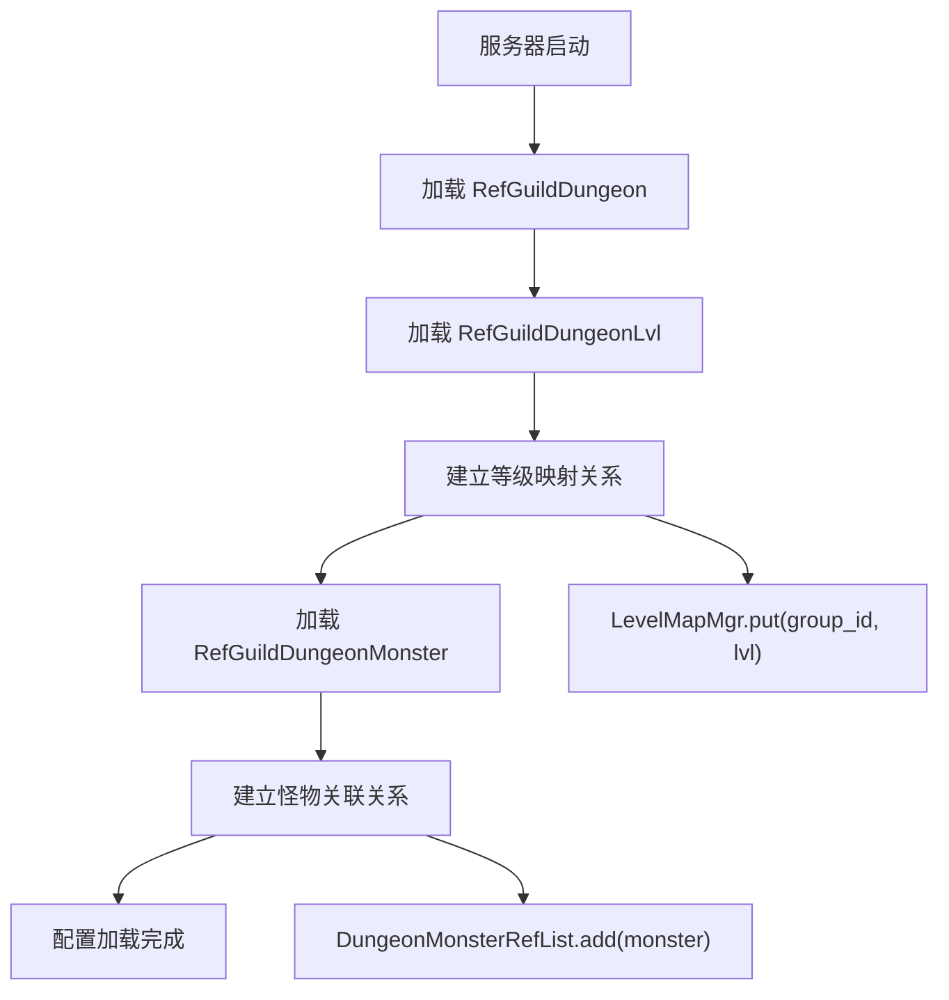

# GuildDungeonOp 模块 - 数据配表文档

## 模块概述

**模块编号**: p037
**模块名称**: GuildDungeonOp (公会副本操作)
**主要功能**: 提供公会副本战斗、伤害排行、奖励领取等功能

---

## 配置表总览

```mermaid
erDiagram
    RefGuildDungeon ||--o{ RefGuildDungeonLvl : "等级配置"
    RefGuildDungeon ||--o{ RefGuildDungeonMonster : "怪物配置"
    RefGuildDungeonLvl ||--|| GuildDungeonMonsterHpList : "怪物血量"

    RefGuildDungeon {
        long id PK "副本ID"
        int unlock_need_guild_lvl "解锁公会等级"
        int upgrade_group "升级分组"
        long boss_id "BOSS怪物ID"
        GuildDungeonMonsterKillRewardList kill_reward "击杀奖励"
        NPCommonCostItem kill_boss_reward "击杀BOSS奖励"
    }

    RefGuildDungeonLvl {
        long id PK "配置ID"
        int group_id FK "分组ID"
        int lvl "等级"
        GuildDungeonMonsterHpList monster_hp "怪物血量列表"
        NPCommonCostItem star_cost_item "开启消耗物品"
        int star_cost_guild_wealth "开启消耗公会财富"
        int upgrade_cost_guild_wealth "升级消耗公会财富"
        int finish_guild_exp "完成获得公会经验"
    }

    RefGuildDungeonMonster {
        long id PK "怪物ID"
        int dungeon_id FK "副本ID"
        EGuildDungeon_MonsterType monster_type "怪物类型"
        long monster_show_id "展示配置ID"
        List_pre_monster_id_list "前置怪物列表"
    }
```

---

## 核心配置表

### 1. RefGuildDungeon (公会副本配置表)

**表名**: `guild_dungeon`

| 字段名 | 类型 | 说明 | 示例值 |
|--------|------|------|--------|
| id | long | 副本ID | 1001 |
| unlock_need_guild_lvl | int | 解锁需要公会等级 | 5 |
| upgrade_group | int | 升级分组ID | 1 |
| boss_id | long | 最终BOSS怪物ID | 10001 |
| kill_reward | GuildDungeonMonsterKillRewardList | 击杀奖励列表 | 见下文 |
| kill_boss_reward | NPCommonCostItem | 击杀BOSS奖励 | item:10001,count:100 |

#### kill_reward 字段结构

```
怪物类型:奖励数量:奖励物品
COMMON:2:item:10001,count:50
SENIOR:1:item:10002,count:100
```

---

### 2. RefGuildDungeonLvl (公会副本等级配置表)

**表名**: `guild_dungeon_lvl`

| 字段名 | 类型 | 说明 | 示例值 |
|--------|------|------|--------|
| id | long | 配置ID | 1001 |
| group_id | int | 分组ID (与upgrade_group对应) | 1 |
| lvl | int | 等级 | 5 |
| monster_hp | GuildDungeonMonsterHpList | 各类型怪物血量 | 见下文 |
| star_cost_item | NPCommonCostItem | 开启消耗物品 | item:20001,count:1 |
| star_cost_guild_wealth | int | 开启消耗公会财富 | 1000 |
| upgrade_cost_guild_wealth | int | 升级消耗公会财富 | 5000 |
| finish_guild_exp | int | 完成获得公会经验 | 100 |

#### monster_hp 字段结构

```
怪物类型:血量
COMMON:500000
SENIOR:1000000
BOSS:5000000
```

---

### 3. RefGuildDungeonMonster (公会副本怪物配置表)

**表名**: `guild_dungeon_monster`

| 字段名 | 类型 | 说明 | 示例值 |
|--------|------|------|--------|
| id | long | 怪物ID | 10001 |
| dungeon_id | long | 所属副本ID | 1001 |
| monster_type | EGuildDungeon_MonsterType | 怪物类型 | BOSS |
| monster_show_id | long | 怪物展示配置ID | 2001 |
| pre_monster_id_list | List\<Long\> | 前置怪物ID列表 | [10000, 10002] |

---

## 枚举定义

### EGuildDungeon_MonsterType (怪物类型)

| 枚举值 | 数值 | 说明 |
|--------|------|------|
| NONE | 0 | 无 |
| COMMON | 1 | 普通怪物 |
| SENIOR | 2 | 高级怪物 |
| BOSS | 3 | BOSS怪物 |

### EGuildDungeon_StartType (开启类型)

| 枚举值 | 数值 | 说明 |
|--------|------|------|
| COMMON_ITEM | 0 | 通用物品开启 |
| ALLIANCE_WEALTH | 1 | 联盟财富开启 |

### EGuildDungeon_LogType (日志类型)

| 枚举值 | 数值 | 说明 |
|--------|------|------|
| NONE | 0 | 无 |
| START | 1 | 开启 |
| ATTACK | 2 | 攻击 |
| KILL | 3 | 击杀 |
| AUTO_START | 4 | 自动开启 |

---

## 数据库表结构

### guild_dungeon_set (公会副本设置表)

```sql
CREATE TABLE IF NOT EXISTS `guild_dungeon_set` (
    `id` bigint(20) NOT NULL AUTO_INCREMENT COMMENT '自增主键',
    `guildId` bigint(20) NOT NULL DEFAULT '0' COMMENT '联盟ID',
    `dungeonId` bigint(20) NOT NULL DEFAULT '0' COMMENT '联盟副本ID',
    `dungeonLvl` int(11) NOT NULL DEFAULT '0' COMMENT '联盟副本等级',
    `isAutoStart` tinyint(1) NOT NULL DEFAULT '0' COMMENT '设置自动开启',
    KEY `guildId` (`guildId`),
    PRIMARY KEY (`id`)
) COMMENT='联盟副本配置数据' engine=MyISAM DEFAULT CHARSET=utf8mb4;
```

### guild_dungeon_instance (公会副本实例表)

```sql
CREATE TABLE IF NOT EXISTS `guild_dungeon_instance` (
    `id` bigint(20) NOT NULL AUTO_INCREMENT COMMENT '自增主键',
    `guildId` bigint(20) NOT NULL DEFAULT '0' COMMENT '联盟ID',
    `dungeonId` bigint(20) NOT NULL DEFAULT '0' COMMENT '联盟副本ID',
    `dungeonLvl` int(11) NOT NULL DEFAULT '0' COMMENT '联盟副本等级',
    `startMs` bigint(20) NOT NULL DEFAULT '0' COMMENT '联盟副本开始时间',
    `isSettled` tinyint(1) NOT NULL DEFAULT '0' COMMENT '已结算',
    KEY `guildId` (`guildId`),
    PRIMARY KEY (`id`)
) COMMENT='联盟副本实例数据' engine=MyISAM DEFAULT CHARSET=utf8mb4;
```

### guild_dungeon_monster (公会副本怪物表)

```sql
CREATE TABLE IF NOT EXISTS `guild_dungeon_monster` (
    `id` bigint(20) NOT NULL AUTO_INCREMENT COMMENT '自增主键',
    `instanceId` bigint(20) NOT NULL DEFAULT '0' COMMENT '实例ID',
    `monsterId` bigint(20) NOT NULL DEFAULT '0' COMMENT '怪物ID',
    `hp` bigint(20) NOT NULL DEFAULT '0' COMMENT '怪物血量',
    `isReward` tinyint(1) NOT NULL DEFAULT '0' COMMENT '是否有奖励',
    `isTag` tinyint(1) NOT NULL DEFAULT '0' COMMENT '是否标记',
    `gainedCidList` blob COMMENT '已领取奖励玩家列表',
    KEY `instanceId` (`instanceId`),
    PRIMARY KEY (`id`)
) COMMENT='公会副本怪物数据' engine=MyISAM DEFAULT CHARSET=utf8mb4;
```

### guild_dungeon_damage_rank (伤害排行表)

```sql
CREATE TABLE IF NOT EXISTS `guild_dungeon_damage_rank` (
    `id` bigint(20) NOT NULL AUTO_INCREMENT COMMENT '自增主键',
    `guildId` bigint(20) NOT NULL DEFAULT '0' COMMENT '公会ID',
    `cid` bigint(20) NOT NULL DEFAULT '0' COMMENT '玩家CID',
    `value` bigint(20) NOT NULL DEFAULT '0' COMMENT '伤害值',
    `updatedMs` bigint(20) NOT NULL DEFAULT '0' COMMENT '更新时间',
    KEY `guildId` (`guildId`),
    PRIMARY KEY (`id`)
) COMMENT='公会副本伤害排行' engine=MyISAM DEFAULT CHARSET=utf8mb4;
```

### player_guild_dungeon_hero (玩家英雄战斗数据表)

```sql
CREATE TABLE IF NOT EXISTS `player_guild_dungeon_hero` (
    `id` bigint(20) NOT NULL AUTO_INCREMENT COMMENT '自增主键',
    `cid` bigint(20) NOT NULL DEFAULT '0' COMMENT '玩家CID',
    `heroId` bigint(20) NOT NULL DEFAULT '0' COMMENT '大臣ID',
    `fightedCount` int(11) NOT NULL DEFAULT '0' COMMENT '战斗次数',
    `recoveredCount` int(11) NOT NULL DEFAULT '0' COMMENT '恢复次数',
    `lastFightedMs` bigint(20) NOT NULL DEFAULT '0' COMMENT '最近一次战斗时间',
    KEY `cid` (`cid`),
    PRIMARY KEY (`id`)
) COMMENT='玩家公会副本大臣出战数据' engine=MyISAM DEFAULT CHARSET=utf8mb4;
```

---

## 配置加载流程



---

## 配置使用示例

### Java 服务端代码示例

```java
// 获取副本配置
RefGuildDungeon ref = RefGuildDungeon.getMgr().get(dungeonId);
if (ref == null) {
    return GuildErr.GUILD_DUNGEON_NOT_FOUND;
}

// 检查解锁条件
if (guildInfo.getLevel() < ref.unlock_need_guild_lvl) {
    return GuildErr.GUILD_DUNGEON_NOT_UNLOCK;
}

// 获取等级配置
RefGuildDungeonLvl lvlRef = ref.getLevelMapMgr().getLevelData(dungeonLvl);
if (lvlRef == null) {
    return CommErr.REF_NOT_FOUND;
}

// 获取怪物血量
long monsterHp = lvlRef.monster_hp.getValue(EGuildDungeon_MonsterType.COMMON);

// 检查开启消耗
long costWealth = lvlRef.star_cost_guild_wealth;
if (guildInfo.getWealth() < costWealth) {
    return CommErr.ITEM_NOT_ENOUGH;
}

// 生成有奖励的怪物列表
HashSet<Long> rewardMonsterIdSet = ref.buildRewardMonsterList();
```

### C# 客户端代码示例

```csharp
// 获取副本配置
GuildDungeonRefObj dungeonRef = GRefdataCoreMgr.instance.guildDungeonRefCore.getRef(dungeonId);
if (dungeonRef == null)
    return;

// 检查解锁条件
if (NPPlayer.instance.guildComp.guildInfo.level < dungeonRef.unlock_need_guild_lvl)
    return EGuildDungeonState.Lock;

// 获取等级配置
GuildDungeonLvlRefObj lvlRef = dungeonRef.getLvlRef(lvl);
if (lvlRef == null)
    return;

// 获取怪物血量
long monsterHp = lvlRef.getMonsterHp(EGuildDungeon_MonsterType.COMMON);

// 获取开启消耗
long costWealth = lvlRef.star_cost_guild_wealth;
```

---

## 配置文件位置

```
game_server/GameRes/src/NPGameRes/Refs/GuildDungeon/
├── RefGuildDungeon.java          # 副本配置
├── RefGuildDungeonLvl.java       # 等级配置
└── RefGuildDungeonMonster.java   # 怪物配置

game_server/GameRes/src/NPGameRes/GameObjs/GuildDungeon/
├── GuildDungeonMonsterHp.java        # 怪物血量对象
├── GuildDungeonMonsterHpList.java    # 怪物血量列表
├── GuildDungeonMonsterKillReward.java      # 击杀奖励
└── GuildDungeonMonsterKillRewardList.java  # 击杀奖励列表
```

---

*文档生成时间: 2026-04-11*
