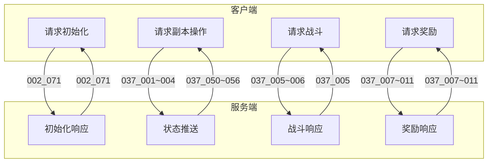
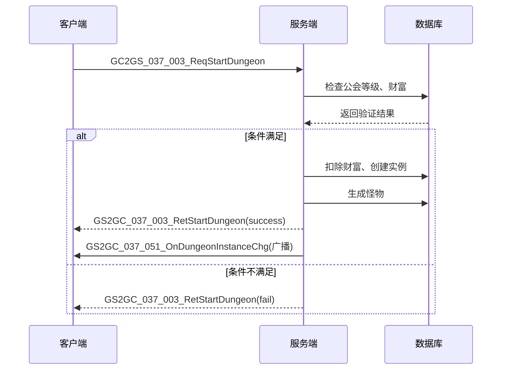
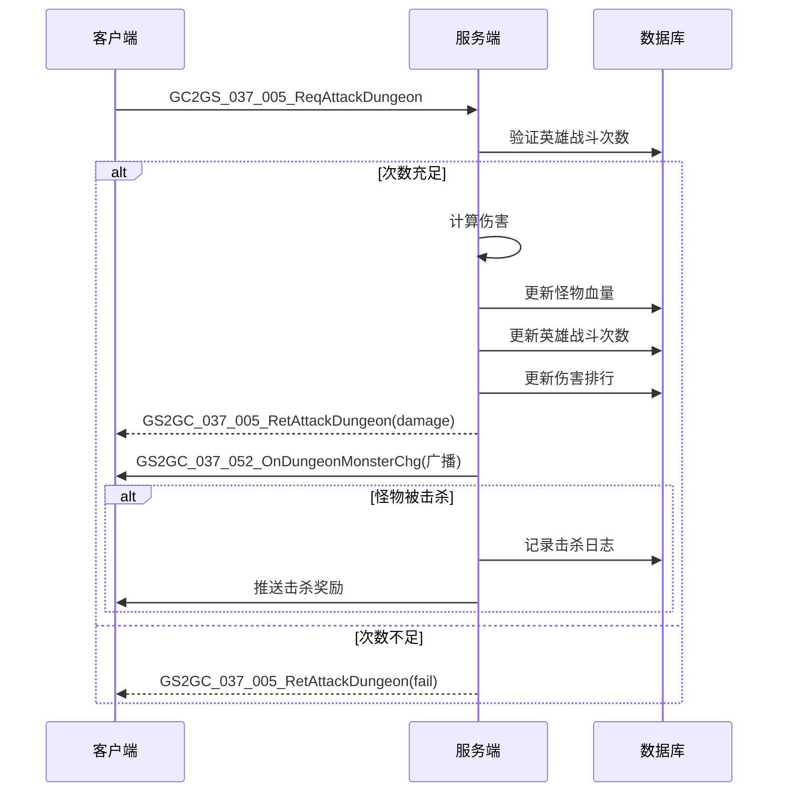
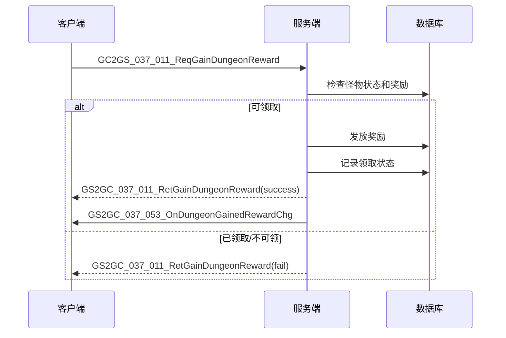

# GuildDungeonOp 模块 - 协议文档

## 协议概览

**协议编号**: p037
**协议方向**: GC2GS / GS2GC
**初始化协议**: p002_071 (ReqGuildDungeonInit / RetGuildDungeonInit)

---

## 协议架构图



---

## 初始化协议 (p002_071)

### GC2GS_002_071_ReqGuildDungeonInit

**说明**: 请求公会副本初始化数据

**请求字段**: 无

```csharp
// 客户端发送示例
NPGSClientListener.sendMsgByLog(new GC2GS_002_071_ReqGuildDungeonInit());
```

### GS2GC_002_071_RetGuildDungeonInit

**说明**: 返回公会副本初始化数据

| 字段名 | 类型 | 说明 |
|--------|------|------|
| setList | List\<GuildDungeon_SetInfo\> | 副本设置列表 |
| instanceList | List\<GuildDungeon_InstanceInfo\> | 副本实例列表 |
| fightHeroList | List\<GuildDungeon_FightHero\> | 英雄战斗信息列表 |
| gainedRewardMonsterIdList | List\<GuildDungeon_DungeonMonster\> | 已领取奖励的怪物列表 |

---

## 客户端请求协议 (GC2GS)

### 副本设置相关

#### GC2GS_037_001_ReqDungeontGlobalSet

**说明**: 请求副本全局设置

**请求字段**: 无

**响应**: GS2GC_037_001_RetDungeontGlobalSet

| 响应字段 | 类型 | 说明 |
|----------|------|------|
| autoStartDungeonIdList | List\<long\> | 自动开启的副本ID列表 |
| autoHour | int | 自动开启时间(时) |
| autoMin | int | 自动开启时间(分) |

---

#### GC2GS_037_002_ReqSetAutoStartDungeon

**说明**: 设置自动开启副本

| 字段名 | 类型 | 说明 |
|--------|------|------|
| dungeonIdList | List\<long\> | 副本ID列表 |
| hour | int | 自动开启时间(时) |
| min | int | 自动开启时间(分) |

**响应**: GS2GC_037_002_RetSetAutoStartDungeon

```csharp
// 客户端调用示例
NPPlayer.instance.guildDungeonComponent.reqSetAutoStartDungeon(
    new List<long> { 1001, 1002 },  // 副本ID列表
    10,  // 10点
    0,   // 0分
    (success) => {
        Debug.Log($"设置自动开启: {success}");
    }
);
```

---

#### GC2GS_037_003_ReqStartDungeon

**说明**: 开启副本

| 字段名 | 类型 | 说明 |
|--------|------|------|
| dungeonId | long | 副本ID |
| startType | EGuildDungeon_StartType | 开启类型 |

**响应**: GS2GC_037_003_RetStartDungeon

```csharp
// 客户端调用示例
NPPlayer.instance.guildDungeonComponent.reqStartDungeon(
    1001,  // 副本ID
    EGuildDungeon_StartType.ALLIANCE_WEALTH,  // 使用公会财富开启
    (success) => {
        Debug.Log($"开启副本: {success}");
    }
);
```

---

#### GC2GS_037_004_ReqUpgradeDungeonLvl

**说明**: 升级副本等级

| 字段名 | 类型 | 说明 |
|--------|------|------|
| dungeonId | long | 副本ID |
| curLevel | int | 当前等级(用于校验) |

**响应**: GS2GC_037_004_RetUpgradeDungeonLvl

```csharp
// 客户端调用示例
NPPlayer.instance.guildDungeonComponent.reqUpgradeDungeonLvl(
    1001,  // 副本ID
    5,     // 当前等级
    (success, msg) => {
        Debug.Log($"升级副本: {success}");
    }
);
```

---

### 战斗相关

#### GC2GS_037_005_ReqAttackDungeon

**说明**: 攻击副本怪物

| 字段名 | 类型 | 说明 |
|--------|------|------|
| instanceId | long | 副本实例ID |
| monsterId | long | 怪物ID |
| heroId | long | 出战英雄ID |

**响应**: GS2GC_037_005_RetAttackDungeon

| 响应字段 | 类型 | 说明 |
|----------|------|------|
| damage | long | 造成伤害 |
| isKilled | boolean | 是否击杀 |
| isDone | boolean | 副本是否完成 |

```csharp
// 客户端调用示例
NPPlayer.instance.guildDungeonComponent.reqAttackDungeon(
    instanceId,   // 实例ID
    monsterId,    // 怪物ID
    heroId,       // 英雄ID
    (success, msg) => {
        if (success) {
            Debug.Log($"造成伤害: {msg.getDamage()}, 击杀: {msg.getIsKilled()}");
        }
    }
);
```

---

#### GC2GS_037_006_ReqRecoverHeroFight

**说明**: 恢复英雄战斗次数

| 字段名 | 类型 | 说明 |
|--------|------|------|
| heroId | long | 英雄ID |

**响应**: GS2GC_037_006_RetRecoverHeroFight

```csharp
// 客户端调用示例
NPPlayer.instance.guildDungeonComponent.reqRecoverHeroFight(
    heroId,
    (success) => {
        Debug.Log($"恢复战斗次数: {success}");
    }
);
```

---

### 奖励相关

#### GC2GS_037_007_ReqDamageRank

**说明**: 请求伤害排行

| 字段名 | 类型 | 说明 |
|--------|------|------|
| page | int | 页码 |
| num | int | 每页数量 |

**响应**: GS2GC_037_007_RetDamageRank

| 响应字段 | 类型 | 说明 |
|----------|------|------|
| itemList | List\<GuildDungeon_DamageRankItem\> | 排行列表 |
| myRank | int | 我的排名 |
| myValue | long | 我的伤害值 |

---

#### GC2GS_037_008_ReqGainAllDungeonReward

**说明**: 领取所有副本奖励

**请求字段**: 无

**响应**: GS2GC_037_008_RetGainAllDungeonReward

---

#### GC2GS_037_011_ReqGainDungeonReward

**说明**: 领取单个奖励

| 字段名 | 类型 | 说明 |
|--------|------|------|
| instanceId | long | 实例ID |
| monsterId | long | 怪物ID |

**响应**: GS2GC_037_011_RetGainDungeonReward

```csharp
// 客户端调用示例
NPPlayer.instance.guildDungeonComponent.reqGainDungeonReward(
    instanceId,
    monsterId,
    (success) => {
        Debug.Log($"领取奖励: {success}");
    }
);
```

---

### 日志相关

#### GC2GS_037_010_ReqGetDungeonLogList

**说明**: 请求副本日志

| 字段名 | 类型 | 说明 |
|--------|------|------|
| dungeonId | long | 副本ID |

**响应**: GS2GC_037_010_RetGetDungeonLogList

| 响应字段 | 类型 | 说明 |
|----------|------|------|
| logList | List\<GuildDungeon_Log\> | 日志列表 |

---

#### GC2GS_037_012_ReqSetTagMonsterList

**说明**: 设置标记怪物列表

| 字段名 | 类型 | 说明 |
|--------|------|------|
| instanceId | long | 实例ID |
| tagMonsterIdList | List\<long\> | 标记怪物ID列表 |

**响应**: GS2GC_037_012_RetSetTagMonsterList

---

## 服务端推送协议 (GS2GC)

### 状态变更通知

#### GS2GC_037_050_OnDungeonSetChg

**说明**: 副本设置变更推送

| 字段名 | 类型 | 说明 |
|--------|------|------|
| setInfo | GuildDungeon_SetInfo | 副本设置信息 |

---

#### GS2GC_037_051_OnDungeonInstanceChg

**说明**: 副本实例变更推送

| 字段名 | 类型 | 说明 |
|--------|------|------|
| instanceInfo | GuildDungeon_InstanceInfo | 副本实例信息 |

---

#### GS2GC_037_052_OnDungeonMonsterChg

**说明**: 怪物状态变更推送

| 字段名 | 类型 | 说明 |
|--------|------|------|
| id | long | 实例ID |
| monsterId | long | 怪物ID |
| hp | long | 当前血量 |

---

#### GS2GC_037_053_OnDungeonGainedRewardChg

**说明**: 已领奖励变更推送

| 字段名 | 类型 | 说明 |
|--------|------|------|
| gainedRewardMonsterIdList | List\<GuildDungeon_DungeonMonster\> | 已领取奖励的怪物列表 |

---

#### GS2GC_037_054_OnDungeonHeroFightChg

**说明**: 英雄战斗状态变更推送

| 字段名 | 类型 | 说明 |
|--------|------|------|
| info | GuildDungeon_FightHero | 英雄战斗信息 |

---

#### GS2GC_037_055_OnDungeonTagMonsterChg

**说明**: 标记怪物变更推送

| 字段名 | 类型 | 说明 |
|--------|------|------|
| id | long | 实例ID |
| tagMonsterIdList | List\<long\> | 标记怪物ID列表 |

---

#### GS2GC_037_056_OnDungeonPush

**说明**: 副本推送通知(批量推送)

| 字段名 | 类型 | 说明 |
|--------|------|------|
| setList | List\<GuildDungeon_SetInfo\> | 副本设置列表 |
| instanceList | List\<GuildDungeon_InstanceInfo\> | 副本实例列表 |
| gainedRewardMonsterIdList | List\<GuildDungeon_DungeonMonster\> | 已领取奖励的怪物列表 |

---

## 协议对象定义

### GuildDungeon_SetInfo

```csharp
public class GuildDungeon_SetInfo {
    public long dungeonId;    // 公会副本ID
    public int lvl;           // 公会副本等级
}
```

### GuildDungeon_InstanceInfo

```csharp
public class GuildDungeon_InstanceInfo {
    public long id;                              // 实例ID
    public long dungeonId;                       // 公会副本ID
    public int lvl;                              // 公会副本等级
    public long startMs;                         // 开启时间
    public List<GuildDungeon_Monster> monsterList;     // 怪物列表
    public List<long> tagMonsterIdLiist;              // 已标记的怪物ID列表
}
```

### GuildDungeon_Monster

```csharp
public class GuildDungeon_Monster {
    public long monsterId;    // 怪物ID
    public bool isReward;     // 有奖励的怪物
    public long hp;           // 当前怪物血量
}
```

### GuildDungeon_FightHero

```csharp
public class GuildDungeon_FightHero {
    public long heroId;           // 英雄ID
    public int fightedCount;      // 出战次数
    public int recoveredCount;    // 已恢复次数
    public long lastFightedMs;    // 最后一次出战时间（毫秒）
}
```

### GuildDungeon_DamageRankItem

```csharp
public class GuildDungeon_DamageRankItem {
    public long cid;     // 玩家CID
    public long value;   // 分数
}
```

### GuildDungeon_Log

```csharp
public class GuildDungeon_Log {
    public EGuildDungeon_LogType logType;  // 日志类型
    public int createdAt;                  // 创建时间
    public byte[] info;                    // 日志数据
}
```

### GuildDungeon_DungeonMonster

```csharp
public class GuildDungeon_DungeonMonster {
    public long id;          // 实例ID
    public long monsterId;   // 怪物ID
}
```

---

## 协议交互流程

### 副本开启流程



### 攻击怪物流程



### 领取奖励流程



---

## 协议文件位置

```
game_server/ServerProtocol/ProtocolScripts/
├── GC2GS/p037_GuildDungeonOp/
│   ├── GC2GS_037_001_ReqDungeontGlobalSet.alpro
│   ├── GC2GS_037_002_ReqSetAutoStartDungeon.alpro
│   ├── GC2GS_037_003_ReqStartDungeon.alpro
│   ├── GC2GS_037_004_ReqUpgradeDungeonLvl.alpro
│   ├── GC2GS_037_005_ReqAttackDungeon.alpro
│   ├── GC2GS_037_006_ReqRecoverHeroFight.alpro
│   ├── GC2GS_037_007_ReqDamageRank.alpro
│   ├── GC2GS_037_008_ReqGainAllDungeonReward.alpro
│   ├── GC2GS_037_010_ReqGetDungeonLogList.alpro
│   ├── GC2GS_037_011_ReqGainDungeonReward.alpro
│   └── GC2GS_037_012_ReqSetTagMonsterList.alpro
└── GS2GC/p037_GuildDungeonOp/
    ├── GS2GC_037_050_OnDungeonSetChg.alpro
    ├── GS2GC_037_051_OnDungeonInstanceChg.alpro
    ├── GS2GC_037_052_OnDungeonMonsterChg.alpro
    ├── GS2GC_037_053_OnDungeonGainedRewardChg.alpro
    ├── GS2GC_037_054_OnDungeonHeroFightChg.alpro
    ├── GS2GC_037_055_OnDungeonTagMonsterChg.alpro
    └── GS2GC_037_056_OnDungeonPush.alpro
```

---

*文档生成时间: 2026-04-11*
