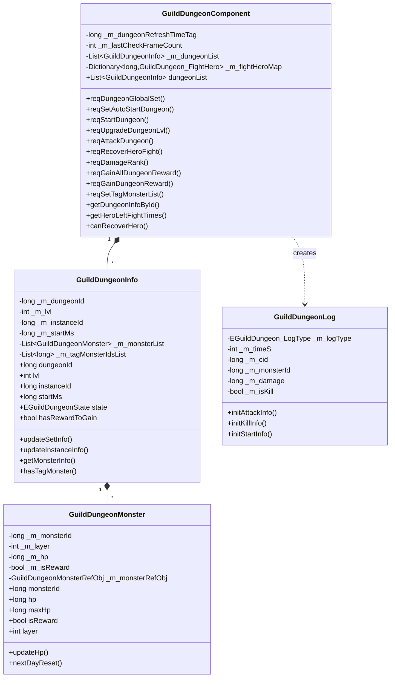

# GuildDungeonOp 模块 - 客户端开发文档

## 模块架构

### 组件类图



---

## 核心组件

### GuildDungeonComponent

**文件位置**: `GameComponent/GuildDungeon/GuildDungeonComponent.cs`

**继承关系**: `_ANPBasicPlayerComponent`

**依赖组件**: `ENPPlayerCompType.GUILD`

#### 完整字段列表

| 字段名 | 类型 | 说明 |
|--------|------|------|
| _m_dungeonRefreshTimeTag | long | 当前副本刷新时间戳（毫秒） |
| _m_lastCheckFrameCount | int | 上次检查副本信息的帧计数 |
| _m_dungeonList | List\<GuildDungeonInfo\> | 副本列表 |
| _m_fightHeroMap | Dictionary\<long, GuildDungeon_FightHero\> | 英雄战斗信息映射 |

#### 主要属性

| 属性名 | 类型 | 说明 |
|--------|------|------|
| dungeonList | List\<GuildDungeonInfo\> | 副本列表(自动检查重置) |
| compType | ENPPlayerCompType | 组件类型(GUILD_DUNGEON) |
| isMustInit | bool | 是否必须初始化(true) |
| canPreInit | bool | 是否允许提前初始化(true) |

#### 核心方法

```csharp
/// <summary>
/// 获取指定ID的副本信息
/// </summary>
public GuildDungeonInfo getDungeonInfoById(long _dungeonId)

/// <summary>
/// 获取指定实例ID的副本信息
/// </summary>
public GuildDungeonInfo getDungeonInfoByInstanceId(long _instanceId)

/// <summary>
/// 获取英雄剩余战斗次数
/// </summary>
public int getHeroLeftFightTimes(long _heroId)

/// <summary>
/// 获取剩余可出战大臣战力总值
/// </summary>
public long getLeftHeroTotalPower()

/// <summary>
/// 获取匹配英雄(用于推荐出战)
/// </summary>
public HeroInfo getSelfMatchHero(long _bossPower)

/// <summary>
/// 检查英雄是否可恢复
/// </summary>
public bool canRecoverHero(long heroId)

/// <summary>
/// 检查是否已领取怪物奖励
/// </summary>
public bool hasGainedRewardMonster(long _instanceId, long _monsterId)
```

---

### GuildDungeonInfo

**文件位置**: `GameComponent/GuildDungeon/GuildDungeonInfo.cs`

#### 完整字段列表

| 字段名 | 类型 | 说明 |
|--------|------|------|
| _m_dungeonRefreshTimeTag | long | 副本刷新时间标记 |
| _m_dungeonId | long | 公会副本ID |
| _m_dungeonRefObj | GuildDungeonRefObj | 公会副本参考对象 |
| _m_lvl | int | 公会副本等级 |
| _m_lvlRefObj | GuildDungeonLvlRefObj | 等级参考对象 |
| _m_bossMonster | GuildDungeonMonster | BOSS怪物 |
| _m_monsterList | List\<GuildDungeonMonster\> | 怪物列表 |
| _m_xMaxLayerCount | int | x轴层数量 |
| _m_yMaxLayerCount | int | y轴层数量 |
| _m_tagMonsterIdsList | List\<long\> | 标记的怪物ID列表 |
| _m_hasGainRewardMonsterIdsList | List\<long\> | 已领取奖励怪物ID列表 |
| _m_instanceId | long | 公会副本实例ID |
| _m_instanceLvl | long | 公会副本实例等级 |
| _m_startMs | long | 开启时间 |

#### 副本状态枚举

```csharp
public enum EGuildDungeonState {
    Lock,        // 未解锁
    WaitStart,   // 等待开启
    Started,     // 已开启
    End          // 已结束
}
```

#### 核心方法

```csharp
/// <summary>
/// 更新副本设置信息
/// </summary>
public void updateSetInfo(long _dungeonRefreshTimeTag, GuildDungeon_SetInfo _info)

/// <summary>
/// 更新副本实例信息
/// </summary>
public void updateInstanceInfo(long _dungeonRefreshTimeTag, GuildDungeon_InstanceInfo _instanceInfo)

/// <summary>
/// 更新标记怪物信息
/// </summary>
public void updateTagMonsterInfo(List<long> _tagMonsters)

/// <summary>
/// 更新已领取奖励怪物
/// </summary>
public void updateGainRewardMonster(List<GuildDungeon_DungeonMonster> gainedRewardMonsterIdList)

/// <summary>
/// 获取怪物信息
/// </summary>
public GuildDungeonMonster getMonsterInfo(long _monsterId)

/// <summary>
/// 检查是否已领取怪物奖励
/// </summary>
public bool hasGainedRewardMonster(long _monsterId)

/// <summary>
/// 检查是否标记了怪物
/// </summary>
public bool hasTagMonster(long _monsterId)

/// <summary>
/// 次日重置
/// </summary>
public void nextDayResetInfo(long _dungeonRefreshTimeTag)
```

---

### GuildDungeonMonster

**文件位置**: `GameComponent/GuildDungeon/GuildDungeonMonster.cs`

#### 完整字段列表

| 字段名 | 类型 | 说明 |
|--------|------|------|
| _m_monsterId | long | 怪物ID |
| _m_layer | int | 层级 |
| _m_positionInLayer | int | 在层级中的位置 |
| _m_totalInLayer | int | 该层级总怪物数量 |
| _m_dungeonInfo | GuildDungeonInfo | 所属副本信息 |
| _m_monsterRefObj | GuildDungeonMonsterRefObj | 怪物参考对象 |
| _m_monsterShowRefObj | GuildDungeonMonsterShowRefObj | 怪物展示对象 |
| _m_hp | long | 当前怪物血量 |
| _m_isReward | bool | 是否有奖励 |

#### 主要属性

| 属性名 | 类型 | 说明 |
|--------|------|------|
| monsterId | long | 怪物ID |
| hp | long | 当前血量 |
| maxHp | long | 最大血量 |
| isReward | bool | 是否有奖励 |
| layer | int | 层级 |
| icon | NPGTextureIndex | 图标 |

---

### GuildDungeonLog

**文件位置**: `GameComponent/GuildDungeon/GuildDungeonLog.cs`

#### 完整字段列表

| 字段名 | 类型 | 说明 |
|--------|------|------|
| _m_logType | EGuildDungeon_LogType | 日志类型 |
| _m_timeS | int | 日志时间戳 |
| _m_cid | long | 玩家CID |
| _m_monsterId | long | 怪物ID |
| _m_damage | long | 伤害数值 |
| _m_isKill | bool | 是否击杀 |
| _m_dungeonId | long | 副本ID |
| _m_startType | EGuildDungeon_StartType | 开启类型 |
| _m_startCost | long | 开启消耗 |

---

## 协议文件位置

```
game_client/Assets/Scripts/ClientProtocol/
├── GC2GS/p037_GuildDungeonOp/
│   ├── GC2GS_037_001_ReqDungeontGlobalSet.cs
│   ├── GC2GS_037_002_ReqSetAutoStartDungeon.cs
│   ├── GC2GS_037_003_ReqStartDungeon.cs
│   ├── GC2GS_037_004_ReqUpgradeDungeonLvl.cs
│   ├── GC2GS_037_005_ReqAttackDungeon.cs
│   ├── GC2GS_037_006_ReqRecoverHeroFight.cs
│   ├── GC2GS_037_007_ReqDamageRank.cs
│   ├── GC2GS_037_008_ReqGainAllDungeonReward.cs
│   ├── GC2GS_037_010_ReqGetDungeonLogList.cs
│   ├── GC2GS_037_011_ReqGainDungeonReward.cs
│   └── GC2GS_037_012_ReqSetTagMonsterList.cs
└── GS2GC/p037_GuildDungeonOp/
    ├── GS2GC_037_050_OnDungeonSetChg.cs
    ├── GS2GC_037_051_OnDungeonInstanceChg.cs
    ├── GS2GC_037_052_OnDungeonMonsterChg.cs
    ├── GS2GC_037_053_OnDungeonGainedRewardChg.cs
    ├── GS2GC_037_054_OnDungeonHeroFightChg.cs
    ├── GS2GC_037_055_OnDungeonTagMonsterChg.cs
    └── GS2GC_037_056_OnDungeonPush.cs
```

---

## 监听器

### 协议监听注册

**文件位置**: `NPGSClientListener/SubDealer/p037_GuildDungeonOp/`

| 文件名 | 说明 |
|--------|------|
| GSSubDealer_037_050_OnDungeonSetChg.cs | 副本设置变更监听 |
| GSSubDealer_037_051_OnDungeonInstanceChg.cs | 副本实例变更监听 |
| GSSubDealer_037_052_OnDungeonMonsterChg.cs | 怪物状态变更监听 |
| GSSubDealer_037_053_OnDungeonGainedRewardChg.cs | 奖励领取变更监听 |
| GSSubDealer_037_054_OnDungeonHeroFightChg.cs | 英雄战斗变更监听 |
| GSSubDealer_037_055_OnDungeonTagMonsterChg.cs | 标记怪物变更监听 |

---

## 使用示例

### 1. 初始化副本数据

```csharp
// 组件会自动在玩家登录时初始化
// 通过依赖注入获取组件
var dungeonComp = NPPlayer.instance.guildDungeonComponent;

// 检查初始化状态
if (dungeonComp.isInited) {
    // 获取副本列表
    var dungeonList = dungeonComp.dungeonList;
    foreach (var dungeon in dungeonList) {
        Debug.Log($"副本: {dungeon.dungeonId}, 状态: {dungeon.state}");
    }
}
```

### 2. 开启副本

```csharp
public void StartDungeon(long dungeonId) {
    // 检查公会状态
    if (!NPPlayer.instance.guildComp.isJoinGuild()) {
        Debug.Log("未加入公会");
        return;
    }

    // 请求开启副本
    NPPlayer.instance.guildDungeonComponent.reqStartDungeon(
        dungeonId,
        EGuildDungeon_StartType.ALLIANCE_WEALTH,
        (success) => {
            if (success) {
                Debug.Log("副本开启成功");
                // 刷新UI
                WinMsg.SendMsg(WinMsgType.ON_GUILD_DUNGEON_INSTANCE_CHG, dungeonId);
            } else {
                Debug.Log("副本开启失败");
            }
        }
    );
}
```

### 3. 攻击怪物

```csharp
public void AttackMonster(long instanceId, long monsterId, long heroId) {
    var dungeonComp = NPPlayer.instance.guildDungeonComponent;

    // 检查英雄战斗次数
    int leftTimes = dungeonComp.getHeroLeftFightTimes(heroId);
    if (leftTimes <= 0) {
        // 检查是否可恢复
        if (dungeonComp.canRecoverHero(heroId)) {
            // 显示恢复对话框
            ShowRecoverDialog(heroId);
        } else {
            Debug.Log("英雄战斗次数不足");
        }
        return;
    }

    // 发起攻击请求
    dungeonComp.reqAttackDungeon(
        instanceId,
        monsterId,
        heroId,
        (success, msg) => {
            if (success) {
                Debug.Log($"造成伤害: {msg.getDamage()}");
                if (msg.getIsKilled()) {
                    Debug.Log("击杀怪物!");
                }
                if (msg.getIsDone()) {
                    Debug.Log("副本完成!");
                }
            }
        }
    );
}
```

### 4. 恢复英雄战斗次数

```csharp
public void RecoverHeroFight(long heroId) {
    NPPlayer.instance.guildDungeonComponent.reqRecoverHeroFight(
        heroId,
        (success) => {
            if (success) {
                Debug.Log("恢复成功");
            } else {
                Debug.Log("恢复失败，请检查消耗品");
            }
        }
    );
}
```

### 5. 领取奖励

```csharp
public void GainReward(long instanceId, long monsterId) {
    NPPlayer.instance.guildDungeonComponent.reqGainDungeonReward(
        instanceId,
        monsterId,
        (success) => {
            if (success) {
                Debug.Log("领取奖励成功");
            } else {
                Debug.Log("领取奖励失败");
            }
        }
    );
}

// 一键领取所有奖励
public void GainAllRewards() {
    NPPlayer.instance.guildDungeonComponent.reqGainAllDungeonReward(
        (success) => {
            Debug.Log($"批量领取: {success}");
        }
    );
}
```

### 6. 查看伤害排行

```csharp
public void ShowDamageRank() {
    NPPlayer.instance.guildDungeonComponent.reqDamageRank(
        1,   // 第1页
        10,  // 每页10条
        (msg) => {
            if (msg != null) {
                Debug.Log($"我的排名: {msg.getMyRank()}");
                Debug.Log($"我的伤害: {msg.getMyValue()}");

                foreach (var item in msg.getItemList()) {
                    Debug.Log($"排名: CID={item.getCid()}, 伤害={item.getValue()}");
                }
            }
        }
    );
}
```

### 7. 标记怪物

```csharp
public void TagMonster(long instanceId, List<long> monsterIds) {
    NPPlayer.instance.guildDungeonComponent.reqSetTagMonsterList(
        instanceId,
        monsterIds,
        (success) => {
            if (success) {
                Debug.Log("标记成功");
            }
        }
    );
}
```

### 8. 获取推荐英雄

```csharp
public HeroInfo GetRecommendHero(long bossPower) {
    return NPPlayer.instance.guildDungeonComponent.getSelfMatchHero(bossPower);
}
```

---

## UI界面

### 界面文件位置

```
game_client/Assets/Scripts/LogicScripts/GameWndGui/GGui/GuildDungeon/
├── GGUIWndGuildDungeonMain.cs          # 主界面
├── GGUIWndGuildDungeonMap.cs           # 地图界面
├── GGUIWndGuildDungeonBattle.cs        # 战斗界面
├── GGUIWndGuildDungeonBattleSuc.cs     # 战斗成功界面
├── GGUIWndGuildDungeonAutoOpen.cs      # 自动开启设置
├── GGUIWndGuildDungeonLog.cs           # 日志界面
├── GGUIWndGuildDungeonRank.cs          # 排行榜界面
├── GGUIWndGuildDungeonSelectHero.cs    # 选择英雄界面
├── GGUIWndGuildDungeonStart.cs         # 开启界面
├── GGUIWndGuildDungeonUpgrade.cs       # 升级界面
├── Map/
│   ├── GGUIGuildDungeonMapMgr.cs       # 地图管理
│   └── GGUIGuildDungeonMapLineMgr.cs   # 路线管理
```

---

## 消息事件

| 消息类型 | 说明 |
|----------|------|
| WinMsgType.ON_GUILD_DUNGEON_RESET | 副本重置 |
| WinMsgType.ON_GUILD_DUNGEON_SET_CHG | 副本设置变更 |
| WinMsgType.ON_GUILD_DUNGEON_INSTANCE_CHG | 副本实例变更 |
| WinMsgType.ON_GUILD_DUNGEON_MONSTER_CHG | 怪物状态变更 |
| WinMsgType.ON_GUILD_DUNGEON_REWARD_CHG | 奖励变更 |
| WinMsgType.ON_GUILD_DUNGEON_TAG_MONSTER_CHG | 标记怪物变更 |
| WinMsgType.ON_LEAVE_GUILD | 离开公会 |
| WinMsgType.ON_JOIN_GUILD | 加入公会 |
| WinMsgType.ON_HERO_GAIN | 获得英雄 |

---

*文档生成时间: 2026-04-11*
