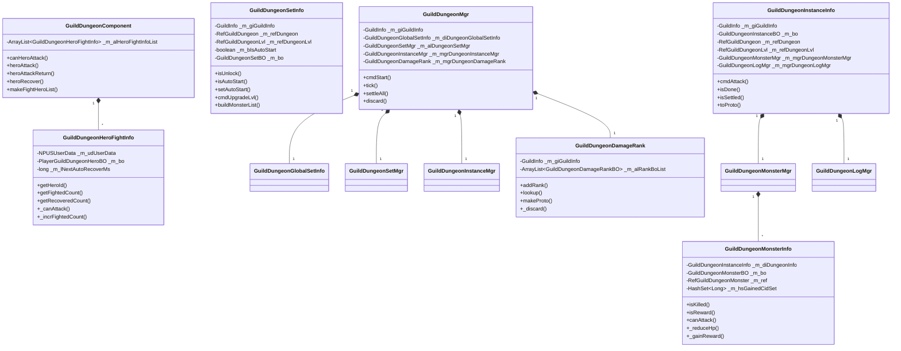
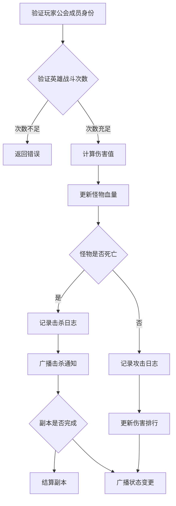
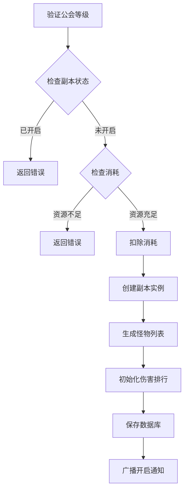
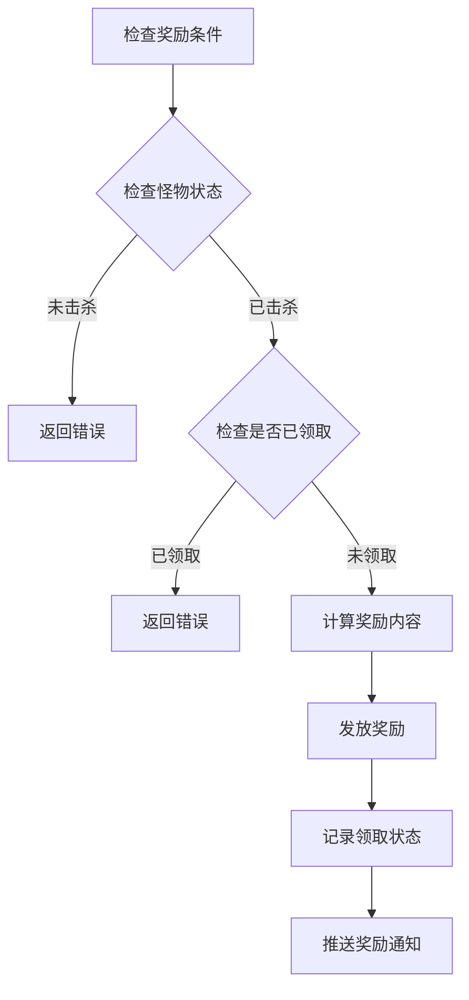

# GuildDungeonOp 模块 - 服务端开发文档

## 模块架构

### 目录结构

```
game_server/UserServer/src/NPUSServer/
├── NPUserMsgDispather/p037_GuildDungeonOp/
│   ├── MsgDealer_GC2GS_037_001_ReqDungeontGlobalSet.java
│   ├── MsgDealer_GC2GS_037_002_ReqSetAutoStartDungeon.java
│   ├── MsgDealer_GC2GS_037_003_ReqStartDungeon.java
│   ├── MsgDealer_GC2GS_037_004_ReqUpgradeDungeonLvl.java
│   ├── MsgDealer_GC2GS_037_005_ReqAttackDungeon.java
│   ├── MsgDealer_GC2GS_037_006_ReqRecoverHeroFight.java
│   ├── MsgDealer_GC2GS_037_007_ReqDamageRank.java
│   ├── MsgDealer_GC2GS_037_008_ReqGainAllDungeonReward.java
│   ├── MsgDealer_GC2GS_037_010_ReqGetDungeonLogList.java
│   ├── MsgDealer_GC2GS_037_011_ReqGainDungeonReward.java
│   └── MsgDealer_GC2GS_037_012_ReqSetTagMonsterList.java
├── GuildMsgDispather/
│   └── NPUSGuild_037_RequestDispatcher_GuildDungeonOp.java
├── NPUserMsgDispather/Write/
│   └── US2GCWriter_037_GuildDungeonOp.java
├── Guild/GuildDungeon/
│   ├── GuildDungeonMgr.java
│   ├── GuildDungeonInstanceInfo.java
│   ├── GuildDungeonInstanceMgr.java
│   ├── GuildDungeonSetInfo.java
│   ├── GuildDungeonSetMgr.java
│   ├── GuildDungeonMonsterInfo.java
│   ├── GuildDungeonMonsterMgr.java
│   ├── GuildDungeonDamageRank.java
│   ├── GuildDungeonGlobalSetInfo.java
│   ├── GuildDungeonLogInfo.java
│   ├── GuildDungeonLogMgr.java
│   └── GuildDungeonAttackResult.java
└── NPUSUserMgr/UserComp/GuildDungeonComp/
    ├── GuildDungeonComponent.java
    └── GuildDungeonHeroFightInfo.java
```

---

## 架构图



---

## 核心管理类

### GuildDungeonMgr

**文件位置**: `Guild/GuildDungeon/GuildDungeonMgr.java`

**说明**: 公会副本总管理器，负责副本生命周期管理

#### 完整字段列表

| 字段名 | 类型 | 说明 |
|--------|------|------|
| _m_giGuildInfo | GuildInfo | 公会数据 |
| _m_diDungeonGlobalSetInfo | GuildDungeonGlobalSetInfo | 全局设置信息 |
| _m_alDungeonSetMgr | GuildDungeonSetMgr | 副本设置管理器 |
| _m_mgrDungeonInstanceMgr | GuildDungeonInstanceMgr | 实例管理器 |
| _m_mgrDungeonDamageRank | GuildDungeonDamageRank | 伤害排行榜 |

#### 核心方法

```java
/**
 * 开启公会副本
 * @param _cid 操作者CID
 * @param _startType 开启类型
 * @param _dungeonId 副本ID
 * @param _context 上下文
 * @return 结果
 */
public Result cmdStart(long _cid, EGuildDungeon_StartType _startType, long _dungeonId, NPPlayerContext _context)

/**
 * 每秒tick操作
 * @param _nowTimeMs 当前时间戳
 */
public void tick(long _nowTimeMs)

/**
 * 结算所有公会副本
 * @param _context 上下文
 */
public void settleAll(NPPlayerContext _context)

/**
 * 销毁数据
 */
public void discard()
```

---

### GuildDungeonSetInfo

**文件位置**: `Guild/GuildDungeon/GuildDungeonSetInfo.java`

**说明**: 公会副本配置数据，存储副本等级、自动开启等设置

#### 完整字段列表

| 字段名 | 类型 | 说明 |
|--------|------|------|
| _m_giGuildInfo | GuildInfo | 公会数据 |
| _m_refDungeon | RefGuildDungeon | 副本配置数据 |
| _m_refDungeonLvl | RefGuildDungeonLvl | 副本等级配置数据 |
| _m_bIsAutoStart | boolean | 是否自动开启 |
| _m_bo | GuildDungeonSetBO | 数据库BO |
| _m_mutex | MutexAtom | 锁对象 |

#### 核心方法

```java
/**
 * 公会副本是否解锁
 */
public boolean isUnlock()

/**
 * 是否自动启动
 */
public boolean isAutoStart()

/**
 * 设置自动开启
 */
public void setAutoStart()

/**
 * 关闭自动开启
 */
public void unsetAutoStart()

/**
 * 获取当前等级数据
 */
public int getLvl()

/**
 * 更新副本等级
 */
public boolean cmdUpgradeLvl(RefGuildDungeonLvl _lvlRef, RefGuildDungeonLvl _nextLvlRef, NPPlayerContext _context)

/**
 * 构造怪物数据列表
 */
public ArrayList<GuildDungeon_Monster> buildMonsterList()

/**
 * 构造副本数据协议
 */
public GuildDungeon_SetInfo toProto()
```

---

### GuildDungeonInstanceInfo

**文件位置**: `Guild/GuildDungeon/GuildDungeonInstanceInfo.java`

**说明**: 公会副本实例数据，存储当前运行的副本状态

#### 完整字段列表

| 字段名 | 类型 | 说明 |
|--------|------|------|
| _m_giGuildInfo | GuildInfo | 公会数据 |
| _m_bo | GuildDungeonInstanceBO | 数据库BO |
| _m_refDungeon | RefGuildDungeon | 副本配置数据 |
| _m_refDungeonLvl | RefGuildDungeonLvl | 副本等级配置数据 |
| _m_mgrDungeonMonsterMgr | GuildDungeonMonsterMgr | 怪物管理器 |
| _m_mgrDungeonLogMgr | GuildDungeonLogMgr | 日志管理器 |
| _m_mutex | MutexAtom | 锁对象 |

#### 核心方法

```java
/**
 * 获取副本ID
 */
public long getDungeonId()

/**
 * 获取副本等级
 */
public int getLvl()

/**
 * 获取开启时间
 */
public long getStartMs()

/**
 * 实例副本已经完成
 */
public boolean isDone()

/**
 * 公会副本实例已结算标志
 */
public boolean isSettled()

/**
 * 攻击怪物
 * @param _cid 玩家CID
 * @param _heroId 英雄ID
 * @param _monsterId 怪物ID
 * @param _damage 伤害值
 * @param _context 上下文
 * @return 攻击结果
 */
public GuildDungeonAttackResult cmdAttack(long _cid, long _heroId, long _monsterId, long _damage, NPPlayerContext _context)

/**
 * 构造副本数据
 */
public GuildDungeon_InstanceInfo toProto()
```

---

### GuildDungeonMonsterInfo

**文件位置**: `Guild/GuildDungeon/GuildDungeonMonsterInfo.java`

**说明**: 副本怪物数据

#### 完整字段列表

| 字段名 | 类型 | 说明 |
|--------|------|------|
| _m_diDungeonInfo | GuildDungeonInstanceInfo | 所属副本信息 |
| _m_bo | GuildDungeonMonsterBO | 数据库BO |
| _m_hsGainedCidSet | HashSet\<Long\> | 已领取奖励玩家CID列表 |
| _m_ref | RefGuildDungeonMonster | 怪物配置数据 |

#### 核心方法

```java
/**
 * 获取怪物ID
 */
public long getMonsterId()

/**
 * 获取当前血量
 */
public long getHp()

/**
 * 是否被标记
 */
public boolean isTag()

/**
 * 是否有奖励(boss或有带奖励的其他怪物)
 */
public boolean isReward()

/**
 * 是否是BOSS
 */
public boolean isBoss()

/**
 * 是否已被击杀
 */
public boolean isKilled()

/**
 * 是否可攻击
 */
public boolean canAttack()

/**
 * 降低血量
 */
protected long _reduceHp(long _value)

/**
 * 计算获取的物品
 */
protected NPCommonCostItem _gainReward(long _cid)
```

---

### GuildDungeonDamageRank

**文件位置**: `Guild/GuildDungeon/GuildDungeonDamageRank.java`

**说明**: 伤害排行榜管理

#### 完整字段列表

| 字段名 | 类型 | 说明 |
|--------|------|------|
| _m_giGuildInfo | GuildInfo | 公会数据 |
| _m_alRankBoList | ArrayList\<GuildDungeonDamageRankBO\> | 排行数据列表 |
| _m_mutex | MutexAtom | 锁对象 |

#### 核心方法

```java
/**
 * 查找指定攻击记录
 */
public GuildDungeonDamageRankBO lookup(long _cid)

/**
 * 增加数据记录
 */
public void addRank(long _cid, long _value)

/**
 * 构造数据列表协议
 */
public void makeProto(long _cid, int _page, int _pageNum, GS2GC_037_007_RetDamageRank _proto)

/**
 * 销毁实例数据
 */
protected void _discard()
```

---

### GuildDungeonComponent

**文件位置**: `NPUSUserMgr/UserComp/GuildDungeonComp/GuildDungeonComponent.java`

**说明**: 玩家公会副本组件，存储玩家个人的副本数据

#### 完整字段列表

| 字段名 | 类型 | 说明 |
|--------|------|------|
| _m_alHeroFightInfoList | ArrayList\<GuildDungeonHeroFightInfo\> | 出战大臣数据列表 |

#### 核心方法

```java
/**
 * 刷新全部大臣数据
 */
public void refreshAll(boolean _push)

/**
 * 构造出战大臣数据
 */
public void makeFightHeroList(ArrayList<GuildDungeon_FightHero> _list)

/**
 * 查找指定大臣出战数据
 */
public GuildDungeonHeroFightInfo lookupHeroFight(long _heroId)

/**
 * 初始化大臣出战数据
 */
public GuildDungeonHeroFightInfo ensureHeroFight(long _heroId)

/**
 * 检查指定大臣是否可以出战
 */
public boolean canHeroAttack(HeroInfo _hero)

/**
 * 计入大臣出战次数
 */
public Result heroAttack(HeroInfo _hero, NPPlayerContext _context)

/**
 * 对指定大臣出战次数进行返回补偿
 */
public void heroAttackReturn(HeroInfo _hero, NPPlayerContext _context)

/**
 * 计入大臣恢复次数
 */
public Result heroRecover(HeroInfo _hero, NPPlayerContext _context)
```

---

### GuildDungeonHeroFightInfo

**文件位置**: `NPUSUserMgr/UserComp/GuildDungeonComp/GuildDungeonHeroFightInfo.java`

**说明**: 大臣出战数据

#### 完整字段列表

| 字段名 | 类型 | 说明 |
|--------|------|------|
| _m_udUserData | NPUSUserData | 玩家数据 |
| _m_bo | PlayerGuildDungeonHeroBO | 数据库BO |
| _m_lNextAutoRecoverMs | long | 大臣下次恢复时间 |

#### 核心方法

```java
/**
 * 获取英雄ID
 */
public long getHeroId()

/**
 * 获取战斗次数
 */
public int getFightedCount()

/**
 * 获取恢复次数
 */
public int getRecoveredCount()

/**
 * 获取最后战斗时间
 */
public long getLastFightedMs()

/**
 * 刷新大臣出战数据
 */
protected void _refresh(boolean _push)

/**
 * 检查是否可以出战
 */
protected boolean _canAttack()

/**
 * 设置攻击次数
 */
protected void _setFightedCount(int _count)

/**
 * 增加攻击次数
 */
protected void _incrFightedCount()

/**
 * 设置恢复次数
 */
protected void _setRecoveredCount(int _count)
```

---

## 业务流程

### 攻击流程



### 副本开启流程



### 奖励发放流程



---

## 数据库BO

### BO文件位置

```
game_server/UserServer/src/USDB/Bo/
├── GuildDungeonSetBO.java           # 副本设置
├── GuildDungeonInstanceBO.java      # 副本实例
├── GuildDungeonMonsterBO.java       # 副本怪物
├── GuildDungeonDamageRankBO.java    # 伤害排行
├── GuildDungeonLogBO.java           # 副本日志
├── GuildDungeonGlobalSetBO.java     # 全局设置
└── PlayerGuildDungeonHeroBO.java    # 玩家英雄战斗数据
```

---

## 消息处理器示例

### 攻击副本处理器

```java
public class MsgDealer_GC2GS_037_005_ReqAttackDungeon extends _ANPUserMsgDealer {
    @Override
    protected void _dealMsg(GC2GS_037_005_ReqAttackDungeon _msg, NPPlayerContext _context) {
        long instanceId = _msg.getInstanceId();
        long monsterId = _msg.getMonsterId();
        long heroId = _msg.getHeroId();

        // 1. 获取玩家公会信息
        GuildMemberInfo memberInfo = _context.getUserData().guildComp.getMemberInfo();
        if (memberInfo == null) {
            _sendErrCode(_context, GuildErr.NOT_IN_GUILD);
            return;
        }

        // 2. 获取副本实例
        GuildInfo guildInfo = memberInfo.getGuild();
        GuildDungeonInstanceInfo instance = guildInfo.getDungeonMgr().getInstanceMgr().lookup(instanceId);
        if (instance == null) {
            _sendErrCode(_context, GuildErr.GUILD_DUNGEON_NOT_FOUND);
            return;
        }

        // 3. 检查英雄战斗次数
        HeroInfo heroInfo = _context.getUserData().heroComp.getHero(heroId);
        if (heroInfo == null) {
            _sendErrCode(_context, CommErr.HERO_NOT_FOUND);
            return;
        }

        GuildDungeonComponent dungeonComp = _context.getUserData().getComponent(ENPPlayerCompType.GUILD_DUNGEON);
        if (!dungeonComp.canHeroAttack(heroInfo)) {
            _sendErrCode(_context, GuildErr.GUILD_DUNGEON_FIGHT_HERO_FAIL);
            return;
        }

        // 4. 计算伤害
        long damage = _calculateDamage(heroInfo, instance);

        // 5. 执行攻击
        GuildDungeonAttackResult result = instance.cmdAttack(_context.getCid(), heroId, monsterId, damage, _context);
        if (result.result.getCode() != 0) {
            _sendErrCode(_context, result.result.getCode());
            return;
        }

        // 6. 更新英雄战斗次数
        dungeonComp.heroAttack(heroInfo, _context);

        // 7. 更新伤害排行
        guildInfo.getDungeonMgr().getDamageRank().addRank(_context.getCid(), result.damge);

        // 8. 发送响应
        _context.sendMsg(US2GCWriter_037_GuildDungeonOp.make_005_RetAttackDungeon(result));
    }
}
```

---

## 错误码定义

| 错误码 | 错误名 | 说明 |
|--------|--------|------|
| 37001 | GUILD_DUNGEON_NOT_FOUND | 副本不存在 |
| 37002 | GUILD_DUNGEON_NOT_UNLOCK | 副本未解锁 |
| 37003 | GUILD_DUNGEON_STARTED | 副本已开启 |
| 37004 | GUILD_DUNGEON_ERR | 副本错误 |
| 37005 | GUILD_DUNGEON_START_FAIL | 开启失败 |
| 37006 | GUILD_DUNGEON_MONSTER_NOT_FOUND | 怪物不存在 |
| 37007 | GUILD_DUNGEON_MONSTER_KILLED | 怪物已被击杀 |
| 37008 | GUILD_DUNGEON_MONSTER_PRE_MONSTER_NOT_KILLED | 前置怪物未击杀 |
| 37009 | GUILD_DUNGEON_ATTACK_FAIL | 攻击失败 |
| 37010 | GUILD_DUNGEON_FIGHT_HERO_FAIL | 英雄战斗失败 |
| 37011 | GUILD_DUNGEON_NOT_RECOVER_HERO | 英雄无法恢复 |
| 37012 | GUILD_DUNGEON_RECOVER_LIMIT | 恢复次数达到上限 |
| 37013 | GUILD_DUNGEON_LVL_UPDATED | 副本等级已更新 |

---

*文档生成时间: 2026-04-11*
