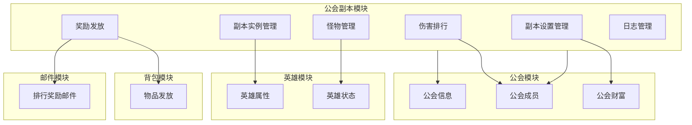
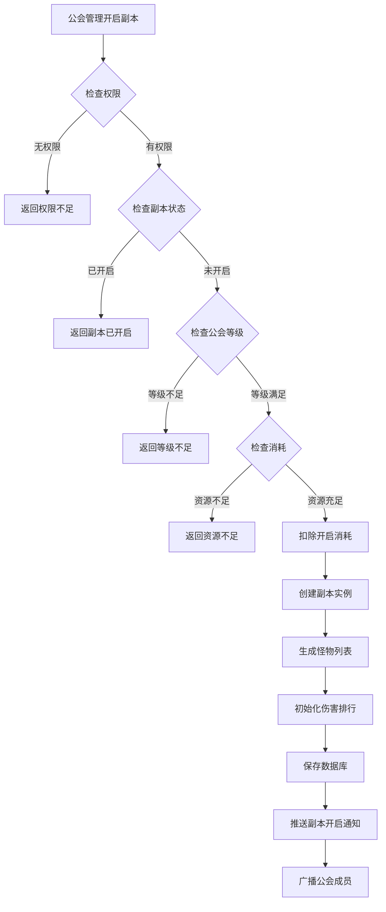
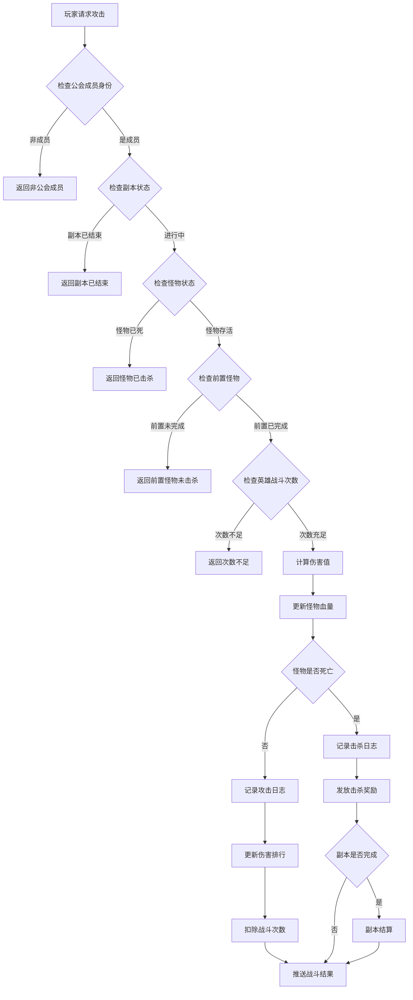
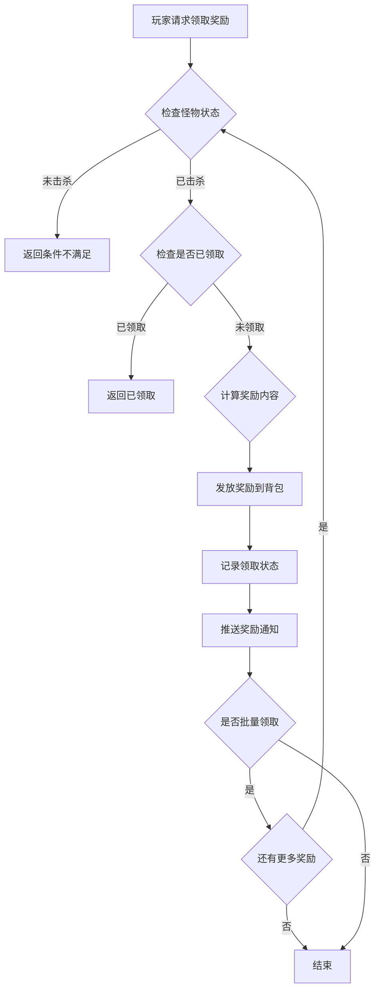
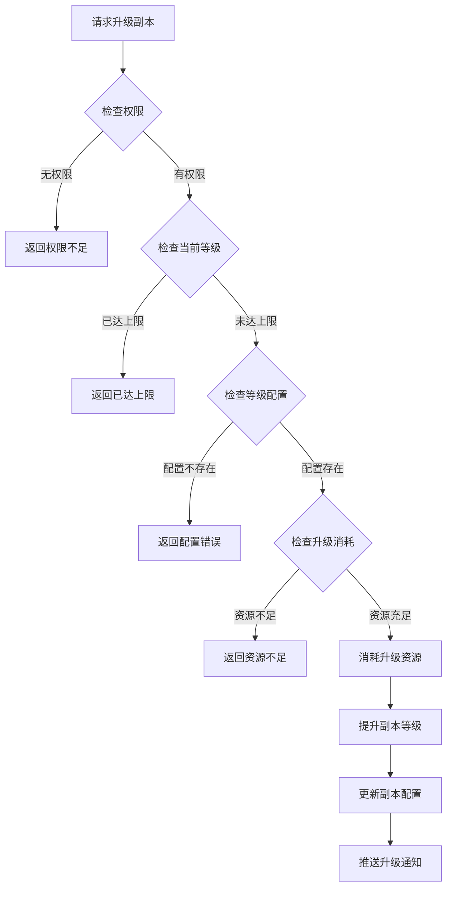
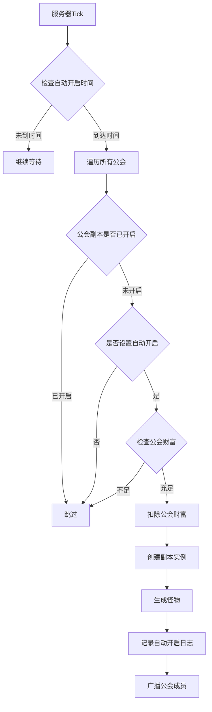
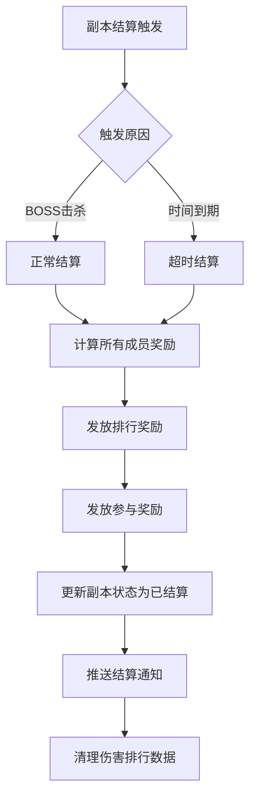
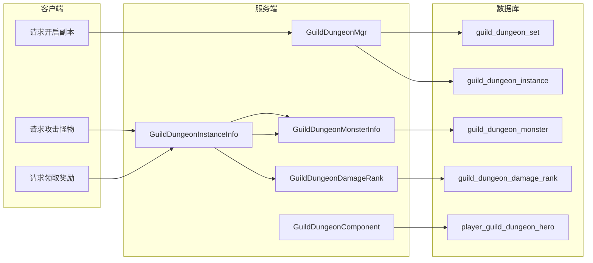

# 公会副本模块完整说明

## 一、模块概述

### 1.1 业务背景

公会副本模块是 K2C 游戏公会系统的核心玩法之一，为公会成员提供集体挑战的PVE内容。公会成员共同攻击副本怪物，通过伤害排行榜展示贡献，获得个人奖励和公会奖励。该模块促进了公会成员间的协作，增强了公会凝聚力。

### 1.2 目标用户

- **公会会长/副会长**：管理副本设置，决定副本开启和等级
- **公会成员**：参与副本战斗，获取奖励和荣誉
- **活跃玩家**：追求伤害排行榜名次，获得额外奖励

### 1.3 核心价值

1. **团队协作**：公会成员共同挑战，体现团队力量
2. **竞争激励**：伤害排行榜激发玩家挑战欲望
3. **资源产出**：提供稳定的资源获取渠道
4. **公会活跃**：增加公会玩法参与度

---

## 二、模块关联图



---

## 三、功能清单

### 3.1 副本设置功能

| 功能名称 | 功能描述 | 用户价值 |
|---------|---------|---------|
| 查看副本设置 | 查看当前副本配置和状态 | 了解副本信息 |
| 设置自动开启 | 设置副本是否自动开启 | 减少管理负担 |
| 升级副本等级 | 提升副本难度和奖励等级 | 增加挑战和收益 |
| 开启副本 | 手动开启公会副本 | 控制开放时间 |

### 3.2 战斗功能

| 功能名称 | 功能描述 | 用户价值 |
|---------|---------|---------|
| 选择英雄出战 | 选择参与战斗的英雄 | 策略配置 |
| 攻击副本怪物 | 派遣英雄攻击怪物 | 获取伤害和奖励 |
| 恢复战斗次数 | 消耗资源恢复英雄战斗次数 | 持续参与 |
| 标记怪物 | 标记优先攻击的怪物 | 团队协作 |

### 3.3 排行榜功能

| 功能名称 | 功能描述 | 用户价值 |
|---------|---------|---------|
| 查看伤害排行 | 查看公会成员伤害排名 | 了解贡献排名 |
| 查看个人统计 | 查看个人战斗数据 | 了解个人表现 |

### 3.4 奖励功能

| 功能名称 | 功能描述 | 用户价值 |
|---------|---------|---------|
| 查看可领奖励 | 查看可领取的奖励列表 | 了解奖励内容 |
| 领取奖励 | 领取副本奖励 | 获取资源收益 |
| 批量领取 | 一键领取所有奖励 | 提升领取效率 |
| 查看副本日志 | 查看历史副本记录 | 追踪历史战绩 |

---

## 四、业务流程详解

### 4.1 副本开启流程



**详细步骤说明**：

1. **权限验证**
   - 检查玩家是否为会长或副会长
   - 检查是否有操作权限

2. **条件检查**
   - 检查副本是否已在进行中
   - 检查公会等级是否满足要求
   - 检查开启消耗是否充足

3. **实例创建**
   - 根据副本等级生成怪物
   - 设置怪物属性和血量
   - 随机选择有奖励的怪物
   - 初始化伤害排行榜

4. **通知广播**
   - 向所有在线公会成员推送副本开启通知
   - 更新副本状态界面

### 4.2 攻击副本怪物流程



**详细步骤说明**：

1. **身份验证**
   - 验证玩家公会成员身份
   - 验证副本是否进行中

2. **怪物检查**
   - 检查怪物是否存在且存活
   - 检查前置怪物是否已击杀

3. **英雄检查**
   - 检查英雄战斗次数是否充足
   - 检查英雄是否处于恢复状态

4. **战斗执行**
   - 计算英雄对怪物的伤害值
   - 扣减怪物血量
   - 更新伤害排行榜

5. **结果处理**
   - 怪物死亡时发放击杀奖励
   - 扣除英雄战斗次数
   - 推送战斗结果通知

### 4.3 奖励领取流程



**详细步骤说明**：

1. **条件检查**
   - 检查怪物是否已击杀
   - 检查玩家是否已领取

2. **奖励计算**
   - 击杀奖励：击杀怪物的玩家获得
   - BOSS奖励：击杀BOSS额外获得

3. **奖励发放**
   - 发放奖励到玩家背包
   - 记录领取状态
   - 推送获得奖励通知

### 4.4 副本升级流程



### 4.5 自动开启流程



### 4.6 副本结算流程



---

## 五、关键规则

### 5.1 副本开启规则

1. **开启条件**
   - 公会等级达到要求
   - 副本未开启（同一副本不能重复开启）
   - 有足够的开启消耗

2. **开启消耗**
   - 方式1：消耗公会财富
   - 方式2：消耗指定物品

3. **自动开启**
   - 可设置副本自动开启
   - 到达指定时间自动开始新一期

### 5.2 战斗规则

1. **英雄战斗次数**
   - 每个英雄每期有固定战斗次数（默认1次）
   - 次数可通过消耗钻石恢复
   - 恢复次数有上限

2. **伤害计算**
   - 伤害 = 英雄战力（由客户端计算并上传）
   - 怪物有血量，伤害会扣除血量
   - 血量归零时怪物被击杀

3. **怪物攻击规则**
   - 必须先击杀前置怪物才能攻击当前怪物
   - BOSS怪物必定有奖励
   - 部分普通怪物随机有奖励

### 5.3 奖励规则

1. **击杀奖励**
   - 击杀怪物者获得奖励
   - BOSS击杀奖励与普通怪物不同
   - 奖励内容：物品、资源

2. **排行奖励**
   - 副本结束后根据伤害排名发放
   - 通过邮件发送

3. **参与奖励**
   - 参与战斗即可获得
   - 每期只能领取一次

---

## 六、数据流转图



---

## 七、用户故事

### 7.1 公会会长故事

> 作为公会会长，我每天需要管理公会副本的开启。我设置了自动开启，这样冷却结束后副本会自动开始。当我们公会的整体实力提升后，我将副本等级从3级升到了5级，怪物更难打了，但奖励也更丰厚了。

### 7.2 活跃成员故事

> 作为一名活跃的公会成员，我每天都会参与公会副本。我选择攻击力最高的英雄出战，尽量打出更高的伤害。上周我在伤害排行榜上排第二，获得了稀有装备材料，这周我要努力冲击第一名！

### 7.3 普通成员故事

> 作为一名普通成员，我每天上线后会先打公会副本。我标记了那只掉落我需要材料的怪物，希望公会其他成员优先攻击它。即使我的伤害不高，也能获得基础奖励，积少成多。

---

## 八、示例

### 8.1 副本实例数据示例

**副本配置**：
```
副本ID: 1001
副本等级: 5
当前怪物: #101 哥布林战士
怪物血量: 1,500,000 / 2,000,000
开启时间: 2026-04-07 10:00:00
预计结束: 2026-04-08 10:00:00
```

### 8.2 战斗记录示例

**战斗输入**：
```
玩家ID: 20001
英雄ID: 10001 (战士)
英雄战力: 50000
```

**战斗结果**：
```
造成伤害: 50000
怪物剩余血量: 1,450,000
剩余战斗次数: 0/1
```

### 8.3 排行榜示例

| 排名 | 玩家名称 | 伤害值 | 击杀数 |
|------|----------|--------|--------|
| 1 | 剑圣无名 | 1,250,000 | 3 |
| 2 | 龙女小舞 | 980,000 | 2 |
| 3 | 魔法少女 | 750,000 | 1 |
| 4 | 勇者小明 | 520,000 | 0 |
| 5 | 刺客暗影 | 450,000 | 0 |

### 8.4 奖励示例

**击杀奖励**：
```
公会贡献: +50
银两: +1000
经验: +500
```

**BOSS击杀奖励**：
```
公会贡献: +200
钻石: +100
稀有装备材料箱: ×1
```

---

*文档生成时间: 2026-04-11*
