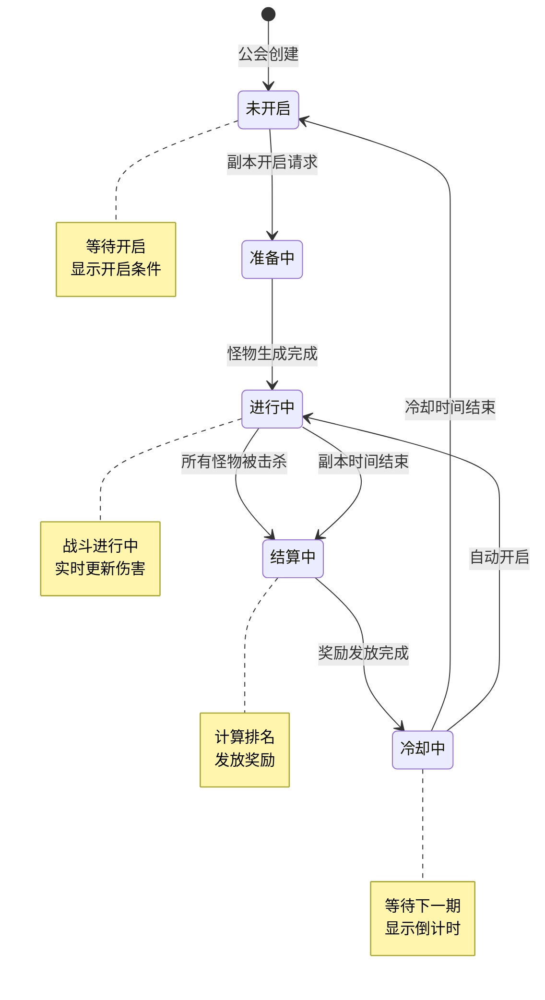
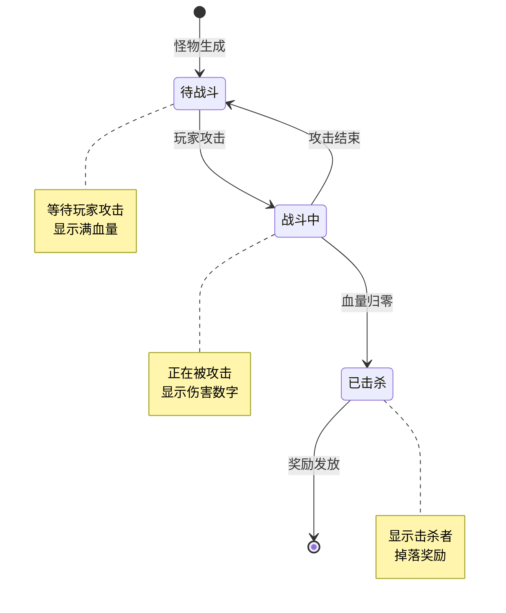
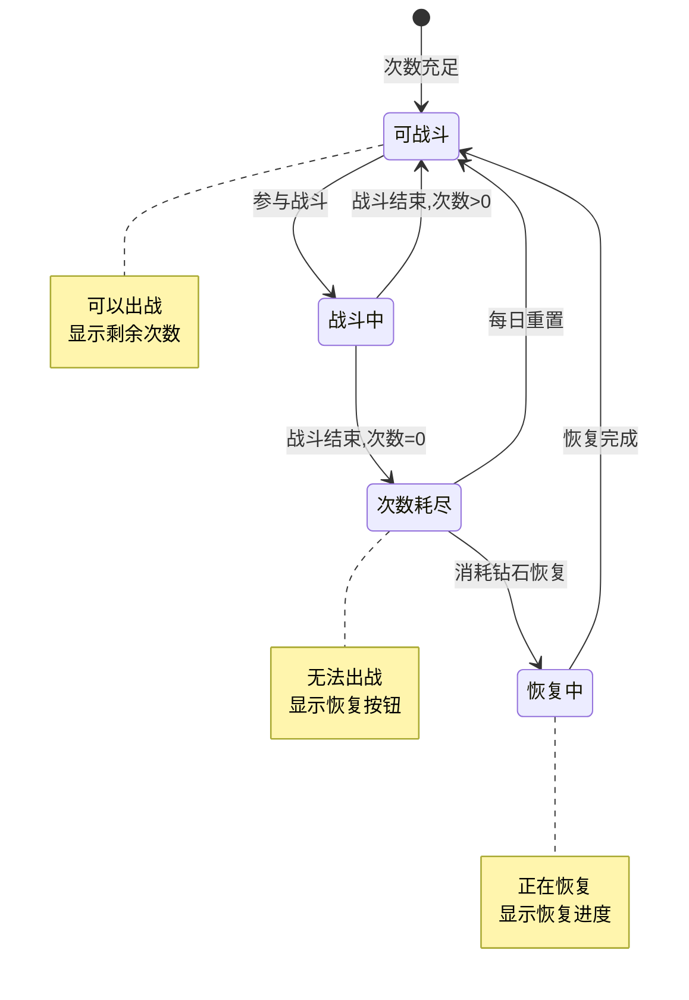
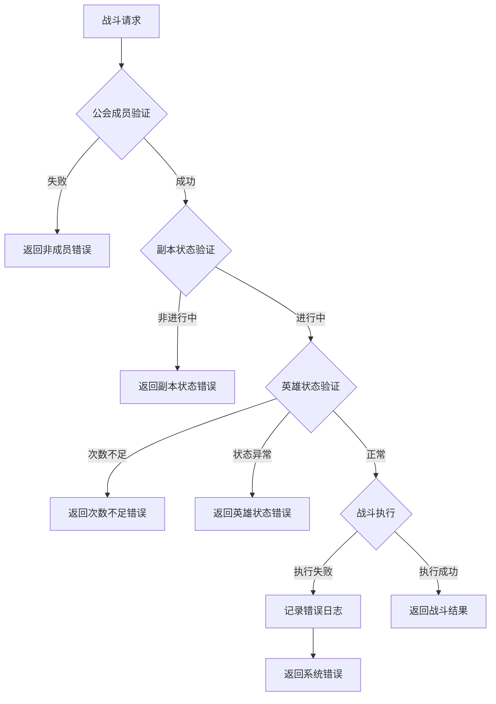

# 公会副本模块实现细节

## 一、计算公式

### 1.1 伤害计算公式

```
基础伤害 = 英雄攻击力 × 技能倍率 × (1 - 怪物防御减免率)
最终伤害 = 基础伤害 × 暴击系数 × 随机浮动系数
```

**参数说明**：
- `英雄攻击力`：英雄面板攻击力
- `技能倍率`：使用技能的伤害倍率
- `怪物防御减免率`：怪物防御/（怪物防御+常量）
- `暴击系数`：暴击时为1.5，否则为1.0
- `随机浮动系数`：0.9-1.1之间的随机数

**示例计算**：
```
英雄攻击力: 5000
技能倍率: 2.5
怪物防御: 1000
防御常量: 5000
暴击: 是

防御减免率 = 1000 / (1000 + 5000) = 0.167
基础伤害 = 5000 × 2.5 × (1 - 0.167) = 10416.67
暴击系数 = 1.5
随机浮动 = 1.05
最终伤害 = 10416.67 × 1.5 × 1.05 = 16406.25 ≈ 16406
```

### 1.2 排名计算公式

```
排名 = 所有参与者的伤害值降序排列后的位置
同伤害排名 = 取相同伤害值的最高排名
```

### 1.3 副本等级奖励系数

```
奖励倍率 = 1 + (副本等级 - 1) × 0.2
```

**示例计算**：
```
副本等级: 5
奖励倍率 = 1 + (5 - 1) × 0.2 = 1.8
基础奖励100银两 → 实际奖励180银两
```

### 1.4 怪物血量计算

```
怪物血量 = 基础血量 × (1 + 副本等级 × 0.15)
```

**示例计算**：
```
基础血量: 500,000
副本等级: 5
怪物血量 = 500000 × (1 + 5 × 0.15) = 875,000
```

---

## 二、状态机定义

### 2.1 副本状态机



### 2.2 怪物状态机



### 2.3 英雄战斗状态机



---

## 三、数据约束

### 3.1 副本设置数据约束

| 字段名 | 数据类型 | 取值范围 | 必填 | 说明 |
|--------|----------|----------|------|------|
| teamId | long | > 0 | 是 | 公会ID |
| dungeonLevel | int | 1-20 | 是 | 副本等级 |
| autoStart | boolean | true/false | 是 | 是否自动开启 |
| lastStartTime | datetime | - | 否 | 上次开启时间 |

### 3.2 副本实例数据约束

| 字段名 | 数据类型 | 取值范围 | 必填 | 说明 |
|--------|----------|----------|------|------|
| instanceId | long | > 0 | 是 | 实例唯一ID |
| teamId | long | > 0 | 是 | 公会ID |
| monsterId | int | > 0 | 是 | 当前怪物配置ID |
| monsterHp | long | >= 0 | 是 | 怪物当前血量 |
| monsterMaxHp | long | > 0 | 是 | 怪物最大血量 |
| startTime | datetime | - | 是 | 开启时间 |
| endTime | datetime | - | 否 | 结束时间 |
| status | int | 0-3 | 是 | 状态：0未开始,1进行中,2结算中,3已结束 |

### 3.3 英雄战斗数据约束

| 字段名 | 数据类型 | 取值范围 | 必填 | 说明 |
|--------|----------|----------|------|------|
| heroId | long | > 0 | 是 | 英雄唯一ID |
| cid | long | > 0 | 是 | 玩家CID |
| fightCount | int | 0-10 | 是 | 剩余战斗次数 |
| totalDamage | long | >= 0 | 是 | 累计伤害 |
| killCount | int | >= 0 | 是 | 击杀数量 |

### 3.4 伤害排行数据约束

| 字段名 | 数据类型 | 取值范围 | 必填 | 说明 |
|--------|----------|----------|------|------|
| rankId | long | > 0 | 是 | 排行记录ID |
| instanceId | long | > 0 | 是 | 副本实例ID |
| cid | long | > 0 | 是 | 玩家CID |
| damage | long | >= 0 | 是 | 伤害值 |
| rank | int | >= 1 | 是 | 排名 |
| killCount | int | >= 0 | 是 | 击杀数 |

---

## 四、错误处理策略

### 4.1 公会副本错误码

| 错误码 | 错误信息 | 处理策略 | 用户提示 |
|--------|----------|----------|----------|
| 37001 | 副本未开启 | 等待副本开启 | "公会副本尚未开启" |
| 37002 | 副本已结束 | 查看结算信息 | "本期副本已结束" |
| 37003 | 非公会成员 | 检查公会状态 | "您不是公会成员" |
| 37004 | 权限不足 | 检查职位权限 | "您没有此权限" |
| 37005 | 英雄战斗次数不足 | 检查英雄次数 | "英雄战斗次数不足" |
| 37006 | 英雄状态异常 | 检查英雄状态 | "英雄状态异常，无法出战" |
| 37007 | 奖励已领取 | 检查领取状态 | "奖励已领取" |
| 37008 | 副本冷却中 | 显示冷却时间 | "副本冷却中，请等待X小时" |
| 37009 | 副本等级已达上限 | 检查等级配置 | "副本已达到最高等级" |
| 37010 | 升级条件不满足 | 显示所需条件 | "升级条件不足" |

### 4.2 战斗错误处理流程



### 4.3 异常场景处理

| 异常场景 | 处理策略 | 数据回滚 |
|----------|----------|----------|
| 战斗中断 | 恢复英雄战斗次数 | 是 |
| 奖励发放失败 | 重试发放，最多3次 | 否 |
| 排行榜更新失败 | 异步重试更新 | 否 |
| 怪物生成失败 | 回滚副本状态 | 是 |

---

## 五、关键代码示例

### 5.1 副本开启伪代码

```java
public Result startDungeon(long teamId, long operatorCid) {
    // 1. 检查权限
    GuildMember member = guildMemberDao.selectByTeamAndCid(teamId, operatorCid);
    if (member == null || !member.hasPermission(GuildPermission.START_DUNGEON)) {
        return Result.error(37004, "权限不足");
    }

    // 2. 检查副本状态
    GuildDungeonSet set = dungeonSetDao.selectByTeamId(teamId);
    if (set.getStatus() == DungeonStatus.RUNNING) {
        return Result.error(37001, "副本已在进行中");
    }
    if (set.getStatus() == DungeonStatus.COOLING) {
        long remainSeconds = set.getCooldownEndTime() - System.currentTimeMillis() / 1000;
        return Result.error(37008, "副本冷却中，剩余" + remainSeconds + "秒");
    }

    // 3. 检查公会等级
    Guild guild = guildDao.selectById(teamId);
    if (guild.getLevel() < MIN_GUILD_LEVEL) {
        return Result.error(37004, "公会等级不足");
    }

    // 4. 创建副本实例
    GuildDungeonInstance instance = new GuildDungeonInstance();
    instance.setInstanceId(idGenerator.nextId());
    instance.setTeamId(teamId);
    instance.setDungeonLevel(set.getDungeonLevel());
    instance.setStartTime(new Date());
    instance.setStatus(DungeonStatus.RUNNING);

    // 5. 生成第一只怪物
    MonsterConfig monster = getFirstMonster(set.getDungeonLevel());
    instance.setMonsterId(monster.getMonsterId());
    instance.setMonsterHp(calculateMonsterHp(monster, set.getDungeonLevel()));
    instance.setMonsterMaxHp(instance.getMonsterHp());

    // 6. 保存数据
    dungeonInstanceDao.insert(instance);
    set.setStatus(DungeonStatus.RUNNING);
    dungeonSetDao.updateById(set);

    // 7. 推送通知
    pushDungeonStart(teamId, instance);

    return Result.success(instance);
}
```

### 5.2 攻击副本伪代码

```java
public Result attackDungeon(long cid, long heroId) {
    // 1. 获取玩家公会信息
    GuildMember member = guildMemberDao.selectByCid(cid);
    if (member == null) {
        return Result.error(37003, "非公会成员");
    }

    long teamId = member.getTeamId();

    // 2. 获取副本实例
    GuildDungeonInstance instance = dungeonInstanceDao.selectRunningByTeamId(teamId);
    if (instance == null) {
        return Result.error(37001, "副本未开启");
    }

    // 3. 检查英雄战斗次数
    GuildDungeonHeroFight fightInfo = heroFightDao.selectByCidAndHero(cid, heroId);
    if (fightInfo == null || fightInfo.getFightCount() <= 0) {
        return Result.error(37005, "英雄战斗次数不足");
    }

    // 4. 计算伤害
    Hero hero = heroDao.selectById(heroId);
    long damage = calculateDamage(hero, instance);

    // 5. 更新怪物血量
    long newHp = instance.getMonsterHp() - damage;
    boolean isKilled = newHp <= 0;

    if (isKilled) {
        // 怪物被击杀
        handleMonsterKilled(instance, cid, damage);
    } else {
        instance.setMonsterHp(newHp);
        dungeonInstanceDao.updateById(instance);
    }

    // 6. 更新英雄战斗信息
    fightInfo.setFightCount(fightInfo.getFightCount() - 1);
    fightInfo.setTotalDamage(fightInfo.getTotalDamage() + damage);
    if (isKilled) {
        fightInfo.setKillCount(fightInfo.getKillCount() + 1);
    }
    heroFightDao.updateById(fightInfo);

    // 7. 更新伤害排行
    updateDamageRank(instance.getInstanceId(), cid, damage, isKilled);

    // 8. 推送战斗结果
    pushAttackResult(teamId, cid, heroId, damage, isKilled);

    return Result.success(new AttackResult(damage, isKilled, fightInfo.getFightCount()));
}
```

### 5.3 伤害计算伪代码

```java
private long calculateDamage(Hero hero, GuildDungeonInstance instance) {
    // 获取英雄属性
    long atk = hero.getAttack();

    // 获取技能倍率（随机技能）
    double skillRate = getRandomSkillRate(hero);

    // 获取怪物防御
    MonsterConfig monster = getMonsterConfig(instance.getMonsterId());
    int def = monster.getDefense();

    // 计算防御减免
    double defReduce = (double) def / (def + DEF_CONSTANT);

    // 基础伤害
    long baseDamage = (long) (atk * skillRate * (1 - defReduce));

    // 暴击判定
    boolean isCrit = RandomUtil.random() < hero.getCritRate();
    double critRate = isCrit ? 1.5 : 1.0;

    // 随机浮动
    double randomRate = 0.9 + RandomUtil.random() * 0.2;

    // 最终伤害
    long finalDamage = (long) (baseDamage * critRate * randomRate);

    return Math.max(1, finalDamage);
}
```

### 5.4 奖励发放伪代码

```java
public Result gainDungeonReward(long cid, long instanceId) {
    // 1. 检查副本是否已结束
    GuildDungeonInstance instance = dungeonInstanceDao.selectById(instanceId);
    if (instance == null || instance.getStatus() != DungeonStatus.ENDED) {
        return Result.error(37002, "副本未结束");
    }

    // 2. 检查是否已领取
    GuildDungeonRewardRecord record = rewardRecordDao.selectByCidAndInstance(cid, instanceId);
    if (record != null && record.isBaseRewardTaken()) {
        return Result.error(37007, "奖励已领取");
    }

    // 3. 计算奖励
    List<RewardInfo> rewards = new ArrayList<>();

    // 基础奖励
    GuildDungeonHeroFight fightInfo = heroFightDao.selectByCidAndInstance(cid, instanceId);
    if (fightInfo != null && fightInfo.getTotalDamage() > 0) {
        rewards.addAll(calculateBaseReward(instance.getDungeonLevel(), fightInfo.getFightCount()));
    }

    // 排行奖励
    DamageRank rank = damageRankDao.selectByCidAndInstance(cid, instanceId);
    if (rank != null && rank.getRank() <= 10) {
        rewards.addAll(calculateRankReward(instance.getDungeonLevel(), rank.getRank()));
    }

    // 击杀奖励
    if (fightInfo != null && fightInfo.getKillCount() > 0) {
        rewards.addAll(calculateKillReward(instance.getDungeonLevel(), fightInfo.getKillCount()));
    }

    // 4. 发放奖励
    rewardService.giveRewards(cid, rewards);

    // 5. 更新领取状态
    if (record == null) {
        record = new GuildDungeonRewardRecord();
        record.setCid(cid);
        record.setInstanceId(instanceId);
        record.setBaseRewardTaken(true);
        rewardRecordDao.insert(record);
    } else {
        record.setBaseRewardTaken(true);
        rewardRecordDao.updateById(record);
    }

    return Result.success(rewards);
}
```

---

## 六、跨模块依赖

### 6.1 依赖模块

| 模块名称 | 依赖类型 | 依赖说明 |
|----------|----------|----------|
| GuildOp | 数据依赖 | 获取公会信息、成员信息 |
| HeroOp | 数据依赖 | 获取英雄属性、英雄状态 |
| BagOp | 功能依赖 | 奖励发放到背包 |
| MailOp | 功能依赖 | 排行奖励通过邮件发放 |

### 6.2 数据交互说明

```java
// 获取公会信息
Guild guild = GuildModule.getGuild(teamId);

// 获取英雄属性
Hero hero = HeroModule.getHero(cid, heroId);

// 发放奖励
BagModule.addItems(cid, rewardList);

// 发送排行奖励邮件
MailModule.sendMail(cid, rankRewardMail);
```

### 6.3 事件订阅

| 事件名称 | 处理逻辑 |
|----------|----------|
| 公会成员加入 | 初始化成员战斗数据 |
| 公会成员退出 | 清理成员战斗数据 |
| 每日重置 | 重置英雄战斗次数 |
| 公会解散 | 清理所有副本数据 |

---

*文档生成时间: 2026-04-07*
